This document outlines how user input is processed through the command-line interface, supporting both interactive and non-interactive modes. The flow manages command editing, execution, and session control, allowing users to interact with the system and receive feedback.

# Handling CLI Input Loop

```mermaid
%%{init: {"flowchart": {"defaultRenderer": "elk"}} }%%
flowchart TD
    node1["Is CLI ready to process commands?"] -->|"No"| node4["Return CLI mode"]
    click node1 openCode "src/main/cli/cli.c:6866:6868"
    click node4 openCode "src/main/cli/cli.c:6885:6886"
    node1 -->|"Yes"| loop1
    subgraph loop1["For each incoming character"]
        
        node2 -->|"Yes"| node5["Process character interactively"]
        click node5 openCode "src/main/cli/cli.c:6806:6815"
        node2 -->|"No"| node3{"Session termination (CTRL-C or timeout)?"}
        click node3 openCode "src/main/cli/cli.c:6876:6880"
        node3 -->|"Yes"| node4
        node3 -->|"No"| node6["Command Parsing and Execution"]
        
    end
classDef HeadingStyle fill:#777777,stroke:#333,stroke-width:2px;
click node2 goToHeading "Interactive Command Editing and Completion"
node2:::HeadingStyle
click node6 goToHeading "Command Parsing and Execution"
node6:::HeadingStyle

%% Swimm:
%% %%{init: {"flowchart": {"defaultRenderer": "elk"}} }%%
%% flowchart TD
%%     node1["Is CLI ready to process commands?"] -->|"No"| node4["Return CLI mode"]
%%     click node1 openCode "<SwmPath>[src/…/cli/cli.c](src/main/cli/cli.c)</SwmPath>:6866:6868"
%%     click node4 openCode "<SwmPath>[src/…/cli/cli.c](src/main/cli/cli.c)</SwmPath>:6885:6886"
%%     node1 -->|"Yes"| loop1
%%     subgraph loop1["For each incoming character"]
%%         
%%         node2 -->|"Yes"| node5["Process character interactively"]
%%         click node5 openCode "<SwmPath>[src/…/cli/cli.c](src/main/cli/cli.c)</SwmPath>:6806:6815"
%%         node2 -->|"No"| node3{"Session termination (<SwmToken path="src/main/cli/cli.c" pos="6876:33:35" line-data="            if (c == 0x3 || (cmp32(millis(), cliEntryTime) &gt; 2000)) { // CTRL-C (ETX) or 2 seconds timeout">`CTRL-C`</SwmToken> or timeout)?"}
%%         click node3 openCode "<SwmPath>[src/…/cli/cli.c](src/main/cli/cli.c)</SwmPath>:6876:6880"
%%         node3 -->|"Yes"| node4
%%         node3 -->|"No"| node6["Command Parsing and Execution"]
%%         
%%     end
%% classDef HeadingStyle fill:#777777,stroke:#333,stroke-width:2px;
%% click node2 goToHeading "Interactive Command Editing and Completion"
%% node2:::HeadingStyle
%% click node6 goToHeading "Command Parsing and Execution"
%% node6:::HeadingStyle
```



<SwmSnippet path="/src/main/cli/cli.c" line="6864">

---

In <SwmToken path="src/main/cli/cli.c" pos="6864:2:2" line-data="bool cliProcess(void)">`cliProcess`</SwmToken>, we start by checking if the CLI is active and ready. Then, we loop through all available input bytes from the serial port. If we're in interactive mode, we hand off each character to <SwmToken path="src/main/cli/cli.c" pos="6873:1:1" line-data="            processCharacterInteractive(c);">`processCharacterInteractive`</SwmToken> to handle things like tab completion and prompt updates, which are only relevant when a user is typing commands directly.

```c
bool cliProcess(void)
{
    if (!cliWriter || !cliMode) {
        return false;
    }

    while (serialRxBytesWaiting(cliPort)) {
        uint8_t c = serialRead(cliPort);
        if (cliInteractive) {
            processCharacterInteractive(c);
        } else {
```

---

</SwmSnippet>

## Interactive Command Editing and Completion

```mermaid
%%{init: {"flowchart": {"defaultRenderer": "elk"}} }%%
flowchart TD
    node1{"What is the input character?"}
    click node1 openCode "src/main/cli/cli.c:6808:6862"
    node1 -->|"Tab or '?'"| node2["Tab completion / Help"]
    click node2 openCode "src/main/cli/cli.c:6808:6845"
    subgraph loop1["Loop: Find matching commands"]
        node2 --> node3{"Ambiguous matches?"}
        click node3 openCode "src/main/cli/cli.c:6821:6843"
        node3 -->|"Yes"| node4["List ambiguous commands"]
        click node4 openCode "src/main/cli/cli.c:6834:6841"
        node4 --> node5["Redraw prompt"]
        click node5 openCode "src/main/cli/cli.c:6841:6843"
        node3 -->|"No"| node6["Complete command"]
        click node6 openCode "src/main/cli/cli.c:6825:6832"
        node6 --> node5
    end
    subgraph loop2["Loop: Write buffer to CLI"]
        node5 --> node7["Write buffer characters"]
        click node7 openCode "src/main/cli/cli.c:6844:6845"
    end
    node1 -->|"CTRL-D & buffer empty"| node8["Exit CLI"]
    click node8 openCode "src/main/cli/cli.c:6846:6848"
    node1 -->|CTRL-L| node9["Clear screen & redraw prompt"]
    click node9 openCode "src/main/cli/cli.c:6849:6852"
    node1 -->|"Backspace"| node10["Remove last character from buffer"]
    click node10 openCode "src/main/cli/cli.c:6853:6858"
    node1 -->|"Any other character"| node11["Process character normally"]
    click node11 openCode "src/main/cli/cli.c:6859:6861"

classDef HeadingStyle fill:#777777,stroke:#333,stroke-width:2px;

%% Swimm:
%% %%{init: {"flowchart": {"defaultRenderer": "elk"}} }%%
%% flowchart TD
%%     node1{"What is the input character?"}
%%     click node1 openCode "<SwmPath>[src/…/cli/cli.c](src/main/cli/cli.c)</SwmPath>:6808:6862"
%%     node1 -->|"Tab or '?'"| node2["Tab completion / Help"]
%%     click node2 openCode "<SwmPath>[src/…/cli/cli.c](src/main/cli/cli.c)</SwmPath>:6808:6845"
%%     subgraph loop1["Loop: Find matching commands"]
%%         node2 --> node3{"Ambiguous matches?"}
%%         click node3 openCode "<SwmPath>[src/…/cli/cli.c](src/main/cli/cli.c)</SwmPath>:6821:6843"
%%         node3 -->|"Yes"| node4["List ambiguous commands"]
%%         click node4 openCode "<SwmPath>[src/…/cli/cli.c](src/main/cli/cli.c)</SwmPath>:6834:6841"
%%         node4 --> node5["Redraw prompt"]
%%         click node5 openCode "<SwmPath>[src/…/cli/cli.c](src/main/cli/cli.c)</SwmPath>:6841:6843"
%%         node3 -->|"No"| node6["Complete command"]
%%         click node6 openCode "<SwmPath>[src/…/cli/cli.c](src/main/cli/cli.c)</SwmPath>:6825:6832"
%%         node6 --> node5
%%     end
%%     subgraph loop2["Loop: Write buffer to CLI"]
%%         node5 --> node7["Write buffer characters"]
%%         click node7 openCode "<SwmPath>[src/…/cli/cli.c](src/main/cli/cli.c)</SwmPath>:6844:6845"
%%     end
%%     node1 -->|"<SwmToken path="src/main/cli/cli.c" pos="6846:24:26" line-data="    } else if (!bufferIndex &amp;&amp; c == 4) {   // CTRL-D">`CTRL-D`</SwmToken> & buffer empty"| node8["Exit CLI"]
%%     click node8 openCode "<SwmPath>[src/…/cli/cli.c](src/main/cli/cli.c)</SwmPath>:6846:6848"
%%     node1 -->|<SwmToken path="src/main/cli/cli.c" pos="6849:23:25" line-data="    } else if (c == 12) {                  // NewPage / CTRL-L">`CTRL-L`</SwmToken>| node9["Clear screen & redraw prompt"]
%%     click node9 openCode "<SwmPath>[src/…/cli/cli.c](src/main/cli/cli.c)</SwmPath>:6849:6852"
%%     node1 -->|"Backspace"| node10["Remove last character from buffer"]
%%     click node10 openCode "<SwmPath>[src/…/cli/cli.c](src/main/cli/cli.c)</SwmPath>:6853:6858"
%%     node1 -->|"Any other character"| node11["Process character normally"]
%%     click node11 openCode "<SwmPath>[src/…/cli/cli.c](src/main/cli/cli.c)</SwmPath>:6859:6861"
%% 
%% classDef HeadingStyle fill:#777777,stroke:#333,stroke-width:2px;
```



<SwmSnippet path="/src/main/cli/cli.c" line="6806">

---

In <SwmToken path="src/main/cli/cli.c" pos="6806:4:4" line-data="static void processCharacterInteractive(const char c)">`processCharacterInteractive`</SwmToken>, when the input is tab or '?', we look for commands matching the current buffer prefix. We track the first and last matches in the command table, setting up for either auto-completion or listing possible matches.

```c
static void processCharacterInteractive(const char c)
{
    if (c == '\t' || c == '?') {
        // do tab completion
        const clicmd_t *cmd, *pstart = NULL, *pend = NULL;
        uint32_t i = bufferIndex;
        for (cmd = cmdTable; cmd < cmdTable + ARRAYLEN(cmdTable); cmd++) {
            if (bufferIndex && (strncasecmp(cliBuffer, cmd->name, bufferIndex) != 0)) {
                continue;
            }
            if (!pstart) {
                pstart = cmd;
            }
            pend = cmd;
        }
```

---

</SwmSnippet>

<SwmSnippet path="/src/main/cli/cli.c" line="6821">

---

Here, if we found at least one matching command, we extend the buffer with the longest common prefix from all matches. If the match is unambiguous, we add a space to indicate completion.

```c
        if (pstart) {    /* Buffer matches one or more commands */
            for (; ; bufferIndex++) {
                if (pstart->name[bufferIndex] != pend->name[bufferIndex])
                    break;
                if (!pstart->name[bufferIndex] && bufferIndex < sizeof(cliBuffer) - 2) {
                    /* Unambiguous -- append a space */
                    cliBuffer[bufferIndex++] = ' ';
                    cliBuffer[bufferIndex] = '\0';
                    break;
                }
                cliBuffer[bufferIndex] = pstart->name[bufferIndex];
            }
```

---

</SwmSnippet>

<SwmSnippet path="/src/main/cli/cli.c" line="6834">

---

Next, if the completion is ambiguous or the buffer is empty, we print all matching command names separated by tabs, so the user can see their options.

```c
        if (!bufferIndex || pstart != pend) {
            /* Print list of ambiguous matches */
            cliPrint("\r\n\033[K");
            for (cmd = pstart; cmd <= pend; cmd++) {
                cliPrint(cmd->name);
                cliWrite('\t');
            }
```

---

</SwmSnippet>

<SwmSnippet path="/src/main/cli/cli.c" line="6841">

---

After listing matches, we redraw the prompt and reprint the current buffer so the user can continue typing without losing their place.

```c
            cliPrompt();
            i = 0;    /* Redraw prompt */
        }
        for (; i < bufferIndex; i++)
            cliWrite(cliBuffer[i]);
```

---

</SwmSnippet>

<SwmSnippet path="/src/main/cli/cli.c" line="6845">

---

After handling tab completion and control characters, any other input gets passed to <SwmToken path="src/main/cli/cli.c" pos="6860:1:1" line-data="        processCharacter(c);">`processCharacter`</SwmToken> to handle normal command editing and command execution.

```c
            cliWrite(cliBuffer[i]);
    } else if (!bufferIndex && c == 4) {   // CTRL-D
        cliExit(true);
        return;
    } else if (c == 12) {                  // NewPage / CTRL-L
        // clear screen
        cliPrint("\033[2J\033[1;1H");
        cliPrompt();
    } else if (c == 127) {
        // backspace
        if (bufferIndex) {
            cliBuffer[--bufferIndex] = 0;
            cliPrint("\010 \010");
        }
    } else {
        processCharacter(c);
    }
}
```

---

</SwmSnippet>

## Command Parsing and Execution

```mermaid
%%{init: {"flowchart": {"defaultRenderer": "elk"}} }%%
flowchart TD
    node1{"Is character newline/carriage return and buffer not empty?"}
    click node1 openCode "src/main/cli/cli.c:6741:6741"
    node1 -->|"Yes"| node22{"Is CLI interactive?"}
    click node22 openCode "src/main/cli/cli.c:6742:6745"
    node22 -->|"Yes"| node23["Echo newline"]
    click node23 openCode "src/main/cli/cli.c:6744:6745"
    node22 -->|"No"| node2["Prepare input line (strip comments, whitespace)"]
    node23 --> node2
    node2["Prepare input line (strip comments, whitespace)"]
    click node2 openCode "src/main/cli/cli.c:6747:6757"
    node2 --> node3{"Is input line non-empty?"}
    click node3 openCode "src/main/cli/cli.c:6759:6760"
    node3 -->|"Yes"| node4["Search for matching command"]
    node3 -->|"No"| node8["Clear input buffer"]
    subgraph loop1["For each command in command table"]
        node4 --> node5{"Does input match command?"}
        click node5 openCode "src/main/cli/cli.c:6766:6768"
        node5 -->|"Yes"| node6["Execute command"]
        click node6 openCode "src/main/cli/cli.c:6771:6775"
        node5 -->|"No"| node4
    end
    node4 --> node9{"Was command found?"}
    click node9 openCode "src/main/cli/cli.c:6770:6783"
    node9 -->|"No"| node10{"Is CLI interactive?"}
    click node10 openCode "src/main/cli/cli.c:6777:6778"
    node10 -->|"Yes"| node11["Show error: unknown command"]
    click node11 openCode "src/main/cli/cli.c:6778:6779"
    node10 -->|"No"| node13["Show error: command not available"]
    click node13 openCode "src/main/cli/cli.c:6780:6782"
    node9 -->|"Yes"| node6
    node6 --> node7{"Is CLI session ended?"}
    click node7 openCode "src/main/cli/cli.c:6772:6775"
    node7 -->|"Yes"| node12["Return"]
    click node12 openCode "src/main/cli/cli.c:6774:6775"
    node7 -->|"No"| node8["Clear input buffer"]
    click node8 openCode "src/main/cli/cli.c:6786:6787"
    node8 --> node14{"Is CLI interactive?"}
    click node14 openCode "src/main/cli/cli.c:6789:6791"
    node14 -->|"Yes"| node15["Show prompt"]
    click node15 openCode "src/main/cli/cli.c:6790:6791"
    node14 -->|"No"| node16["Ready for next input"]
    click node16 openCode "src/main/cli/cli.c:6792:6792"
    node1 -->|"No"| node17{"Is character printable and buffer not full?"}
    click node17 openCode "src/main/cli/cli.c:6793:6793"
    node17 -->|"Yes"| node18{"Is character leading space and buffer empty?"}
    click node18 openCode "src/main/cli/cli.c:6794:6795"
    node18 -->|"Yes"| node16
    node18 -->|"No"| node19["Add character to buffer"]
    click node19 openCode "src/main/cli/cli.c:6797:6797"
    node19 --> node20{"Is CLI interactive?"}
    click node20 openCode "src/main/cli/cli.c:6800:6802"
    node20 -->|"Yes"| node21["Echo character"]
    click node21 openCode "src/main/cli/cli.c:6801:6802"
    node20 -->|"No"| node16

classDef HeadingStyle fill:#777777,stroke:#333,stroke-width:2px;

%% Swimm:
%% %%{init: {"flowchart": {"defaultRenderer": "elk"}} }%%
%% flowchart TD
%%     node1{"Is character newline/carriage return and buffer not empty?"}
%%     click node1 openCode "<SwmPath>[src/…/cli/cli.c](src/main/cli/cli.c)</SwmPath>:6741:6741"
%%     node1 -->|"Yes"| node22{"Is CLI interactive?"}
%%     click node22 openCode "<SwmPath>[src/…/cli/cli.c](src/main/cli/cli.c)</SwmPath>:6742:6745"
%%     node22 -->|"Yes"| node23["Echo newline"]
%%     click node23 openCode "<SwmPath>[src/…/cli/cli.c](src/main/cli/cli.c)</SwmPath>:6744:6745"
%%     node22 -->|"No"| node2["Prepare input line (strip comments, whitespace)"]
%%     node23 --> node2
%%     node2["Prepare input line (strip comments, whitespace)"]
%%     click node2 openCode "<SwmPath>[src/…/cli/cli.c](src/main/cli/cli.c)</SwmPath>:6747:6757"
%%     node2 --> node3{"Is input line <SwmToken path="src/main/cli/cli.c" pos="6759:5:7" line-data="        // Process non-empty lines">`non-empty`</SwmToken>?"}
%%     click node3 openCode "<SwmPath>[src/…/cli/cli.c](src/main/cli/cli.c)</SwmPath>:6759:6760"
%%     node3 -->|"Yes"| node4["Search for matching command"]
%%     node3 -->|"No"| node8["Clear input buffer"]
%%     subgraph loop1["For each command in command table"]
%%         node4 --> node5{"Does input match command?"}
%%         click node5 openCode "<SwmPath>[src/…/cli/cli.c](src/main/cli/cli.c)</SwmPath>:6766:6768"
%%         node5 -->|"Yes"| node6["Execute command"]
%%         click node6 openCode "<SwmPath>[src/…/cli/cli.c](src/main/cli/cli.c)</SwmPath>:6771:6775"
%%         node5 -->|"No"| node4
%%     end
%%     node4 --> node9{"Was command found?"}
%%     click node9 openCode "<SwmPath>[src/…/cli/cli.c](src/main/cli/cli.c)</SwmPath>:6770:6783"
%%     node9 -->|"No"| node10{"Is CLI interactive?"}
%%     click node10 openCode "<SwmPath>[src/…/cli/cli.c](src/main/cli/cli.c)</SwmPath>:6777:6778"
%%     node10 -->|"Yes"| node11["Show error: unknown command"]
%%     click node11 openCode "<SwmPath>[src/…/cli/cli.c](src/main/cli/cli.c)</SwmPath>:6778:6779"
%%     node10 -->|"No"| node13["Show error: command not available"]
%%     click node13 openCode "<SwmPath>[src/…/cli/cli.c](src/main/cli/cli.c)</SwmPath>:6780:6782"
%%     node9 -->|"Yes"| node6
%%     node6 --> node7{"Is CLI session ended?"}
%%     click node7 openCode "<SwmPath>[src/…/cli/cli.c](src/main/cli/cli.c)</SwmPath>:6772:6775"
%%     node7 -->|"Yes"| node12["Return"]
%%     click node12 openCode "<SwmPath>[src/…/cli/cli.c](src/main/cli/cli.c)</SwmPath>:6774:6775"
%%     node7 -->|"No"| node8["Clear input buffer"]
%%     click node8 openCode "<SwmPath>[src/…/cli/cli.c](src/main/cli/cli.c)</SwmPath>:6786:6787"
%%     node8 --> node14{"Is CLI interactive?"}
%%     click node14 openCode "<SwmPath>[src/…/cli/cli.c](src/main/cli/cli.c)</SwmPath>:6789:6791"
%%     node14 -->|"Yes"| node15["Show prompt"]
%%     click node15 openCode "<SwmPath>[src/…/cli/cli.c](src/main/cli/cli.c)</SwmPath>:6790:6791"
%%     node14 -->|"No"| node16["Ready for next input"]
%%     click node16 openCode "<SwmPath>[src/…/cli/cli.c](src/main/cli/cli.c)</SwmPath>:6792:6792"
%%     node1 -->|"No"| node17{"Is character printable and buffer not full?"}
%%     click node17 openCode "<SwmPath>[src/…/cli/cli.c](src/main/cli/cli.c)</SwmPath>:6793:6793"
%%     node17 -->|"Yes"| node18{"Is character leading space and buffer empty?"}
%%     click node18 openCode "<SwmPath>[src/…/cli/cli.c](src/main/cli/cli.c)</SwmPath>:6794:6795"
%%     node18 -->|"Yes"| node16
%%     node18 -->|"No"| node19["Add character to buffer"]
%%     click node19 openCode "<SwmPath>[src/…/cli/cli.c](src/main/cli/cli.c)</SwmPath>:6797:6797"
%%     node19 --> node20{"Is CLI interactive?"}
%%     click node20 openCode "<SwmPath>[src/…/cli/cli.c](src/main/cli/cli.c)</SwmPath>:6800:6802"
%%     node20 -->|"Yes"| node21["Echo character"]
%%     click node21 openCode "<SwmPath>[src/…/cli/cli.c](src/main/cli/cli.c)</SwmPath>:6801:6802"
%%     node20 -->|"No"| node16
%% 
%% classDef HeadingStyle fill:#777777,stroke:#333,stroke-width:2px;
```



<SwmSnippet path="/src/main/cli/cli.c" line="6739">

---

In <SwmToken path="src/main/cli/cli.c" pos="6739:4:4" line-data="static void processCharacter(const char c)">`processCharacter`</SwmToken>, when we get a newline or carriage return and the buffer isn't empty, we treat it as the end of a command. We strip comments and trailing spaces before looking up and executing the command.

```c
static void processCharacter(const char c)
{
    if (bufferIndex && (c == '\n' || c == '\r')) {
        if (cliInteractive) {
            // echo new line back to terminal
            cliPrintLinefeed();
        }

        // Strip comment starting with # from line
        char *p = cliBuffer;
        p = strchr(p, '#');
        if (NULL != p) {
            bufferIndex = (uint32_t)(p - cliBuffer);
        }

        // Strip trailing whitespace
        while (bufferIndex > 0 && cliBuffer[bufferIndex - 1] == ' ') {
            bufferIndex--;
        }
```

---

</SwmSnippet>

<SwmSnippet path="/src/main/cli/cli.c" line="6759">

---

After cleaning up the buffer, we look up the command and execute it if found. If not, we print an error. We then clear the buffer and, if interactive, show the prompt again. For printable characters, we add them to the buffer and echo if needed.

```c
        // Process non-empty lines
        if (bufferIndex > 0) {
            cliBuffer[bufferIndex] = 0; // null terminate

            const clicmd_t *cmd;
            char *options;
            for (cmd = cmdTable; cmd < cmdTable + ARRAYLEN(cmdTable); cmd++) {
                if ((options = checkCommand(cliBuffer, cmd->name))) {
                    break;
                }
            }
            if (cmd < cmdTable + ARRAYLEN(cmdTable)) {
                cmd->cliCommand(cmd->name, options);
                if (!cliMode) {
                    // cli session ended
                    return;
                }
            } else {
                if (cliInteractive) {
                    cliPrintError("input", "UNKNOWN COMMAND, TRY 'HELP'");
                } else {
                    cliPrint("ERR_CMD_NA: ");
                    cliPrintLine(cliBuffer);
                }
            }
        }

        cliClearInputBuffer();

        // prompt if in interactive mode
        if (cliInteractive) {
            cliPrompt();
        }

    } else if (bufferIndex < sizeof(cliBuffer) && c >= 32 && c <= 126) {
        if (!bufferIndex && c == ' ') {
            return; // Ignore leading spaces
        }
        cliBuffer[bufferIndex++] = c;

        // echo the character if interactive
        if (cliInteractive) {
            cliWrite(c);
        }
    }
}
```

---

</SwmSnippet>

## Handling Flow Control and Non-Interactive Input

```mermaid
%%{init: {"flowchart": {"defaultRenderer": "elk"}} }%%
flowchart TD
    node1["Start CLI input processing"]
    click node1 openCode "src/main/cli/cli.c:6875:6876"
    subgraph loop1["While session is active"]
        node1 --> node2{"Is input CTRL-C or timeout (2s)?"}
        click node2 openCode "src/main/cli/cli.c:6876:6877"
        node2 -->|"Yes"| node3["Send termination signal and exit session"]
        click node3 openCode "src/main/cli/cli.c:6877:6879"
        node2 -->|"No"| node4["Process input character"]
        click node4 openCode "src/main/cli/cli.c:6881:6882"
        node4 --> node2
    end
    node3 --> node7["Return CLI mode"]
    click node7 openCode "src/main/cli/cli.c:6879:6880"
    loop1 --> node5["Flush output"]
    click node5 openCode "src/main/cli/cli.c:6884:6885"
    node5 --> node8["Return CLI mode"]
    click node8 openCode "src/main/cli/cli.c:6885:6886"

classDef HeadingStyle fill:#777777,stroke:#333,stroke-width:2px;

%% Swimm:
%% %%{init: {"flowchart": {"defaultRenderer": "elk"}} }%%
%% flowchart TD
%%     node1["Start CLI input processing"]
%%     click node1 openCode "<SwmPath>[src/…/cli/cli.c](src/main/cli/cli.c)</SwmPath>:6875:6876"
%%     subgraph loop1["While session is active"]
%%         node1 --> node2{"Is input <SwmToken path="src/main/cli/cli.c" pos="6876:33:35" line-data="            if (c == 0x3 || (cmp32(millis(), cliEntryTime) &gt; 2000)) { // CTRL-C (ETX) or 2 seconds timeout">`CTRL-C`</SwmToken> or timeout (2s)?"}
%%         click node2 openCode "<SwmPath>[src/…/cli/cli.c](src/main/cli/cli.c)</SwmPath>:6876:6877"
%%         node2 -->|"Yes"| node3["Send termination signal and exit session"]
%%         click node3 openCode "<SwmPath>[src/…/cli/cli.c](src/main/cli/cli.c)</SwmPath>:6877:6879"
%%         node2 -->|"No"| node4["Process input character"]
%%         click node4 openCode "<SwmPath>[src/…/cli/cli.c](src/main/cli/cli.c)</SwmPath>:6881:6882"
%%         node4 --> node2
%%     end
%%     node3 --> node7["Return CLI mode"]
%%     click node7 openCode "<SwmPath>[src/…/cli/cli.c](src/main/cli/cli.c)</SwmPath>:6879:6880"
%%     loop1 --> node5["Flush output"]
%%     click node5 openCode "<SwmPath>[src/…/cli/cli.c](src/main/cli/cli.c)</SwmPath>:6884:6885"
%%     node5 --> node8["Return CLI mode"]
%%     click node8 openCode "<SwmPath>[src/…/cli/cli.c](src/main/cli/cli.c)</SwmPath>:6885:6886"
%% 
%% classDef HeadingStyle fill:#777777,stroke:#333,stroke-width:2px;
```



<SwmSnippet path="/src/main/cli/cli.c" line="6875">

---

Back in <SwmToken path="src/main/cli/cli.c" pos="6864:2:2" line-data="bool cliProcess(void)">`cliProcess`</SwmToken>, after <SwmToken path="src/main/cli/cli.c" pos="6806:4:4" line-data="static void processCharacterInteractive(const char c)">`processCharacterInteractive`</SwmToken> returns, we check for flow control (like <SwmToken path="src/main/cli/cli.c" pos="6876:33:35" line-data="            if (c == 0x3 || (cmp32(millis(), cliEntryTime) &gt; 2000)) { // CTRL-C (ETX) or 2 seconds timeout">`CTRL-C`</SwmToken> or timeout) and exit if needed. Otherwise, we call <SwmToken path="src/main/cli/cli.c" pos="6881:1:1" line-data="            processCharacter(c);">`processCharacter`</SwmToken> to handle the character as part of a command line.

```c
            // handle terminating flow control character
            if (c == 0x3 || (cmp32(millis(), cliEntryTime) > 2000)) { // CTRL-C (ETX) or 2 seconds timeout
                cliWrite(0x3); // send end of text, terminating flow control
                cliExit(false);
                return cliMode;
            }
            processCharacter(c);
        }
    }
```

---

</SwmSnippet>

<SwmSnippet path="/src/main/cli/cli.c" line="6884">

---

Finally, after returning from <SwmToken path="src/main/cli/cli.c" pos="6739:4:4" line-data="static void processCharacter(const char c)">`processCharacter`</SwmToken>, we flush any pending output and return the current CLI mode to signal if the session is still active.

```c
    cliWriterFlush();
    return cliMode;
}
```

---

</SwmSnippet>

&nbsp;

*This is an auto-generated document by Swimm 🌊 and has not yet been verified by a human*

<SwmMeta version="3.0.0" repo-id="Z2l0aHViJTNBJTNBYy1iZXRhZmxpZ2h0JTNBJTNBcmljYXJkb2xvcGV6Zw==" repo-name="c-betaflight"><sup>Powered by [Swimm](https://app.swimm.io/)</sup></SwmMeta>
