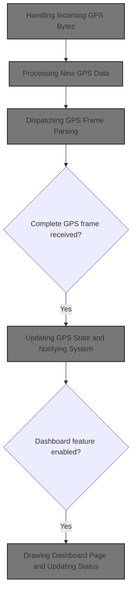

This document describes how incoming GPS data is processed to update the system's GPS state and, if enabled, refresh the dashboard display. The flow covers receiving GPS data, updating navigation state, and conditionally updating the dashboard.



# Handling Incoming GPS Bytes

<SwmSnippet path="/src/main/io/gps.c" line="2524">

---

In <SwmToken path="src/main/io/gps.c" pos="2524:4:4" line-data="static void gpsHandlePassthrough(uint8_t data)">`gpsHandlePassthrough`</SwmToken>, we start by passing the incoming byte to <SwmToken path="src/main/io/gps.c" pos="2526:1:1" line-data="    gpsNewData(data);">`gpsNewData`</SwmToken>, assuming it's valid GPS data. This kicks off the GPS parsing flow. The dashboard update logic is conditionally compiled and only runs if both the dashboard feature is enabled at build time and at runtime. This direct call means GPS and dashboard modules are tightly linked, which is flagged in the comments as something that should be improved.

```c
static void gpsHandlePassthrough(uint8_t data)
{
    gpsNewData(data);
#ifdef USE_DASHBOARD
```

---

</SwmSnippet>

## Processing New GPS Data

<SwmSnippet path="/src/main/io/gps.c" line="1527">

---

In <SwmToken path="src/main/io/gps.c" pos="1527:4:4" line-data="static void gpsNewData(uint16_t c)">`gpsNewData`</SwmToken>, we check if a new GPS frame is available by calling <SwmToken path="src/main/io/gps.c" pos="1530:5:5" line-data="    if (!gpsNewFrame(c)) {">`gpsNewFrame`</SwmToken>. If not, we bail out early. This avoids updating state or triggering notifications when there's no new data. The argument 'c' is assumed to be a valid frame code for parsing.

```c
static void gpsNewData(uint16_t c)
{
    DEBUG_SET(DEBUG_GPS_CONNECTION, 1, gpsSol.navIntervalMs);
    if (!gpsNewFrame(c)) {
        // no new nav solution data
        return;
    }
```

---

</SwmSnippet>

### Dispatching GPS Frame Parsing

```mermaid
%%{init: {"flowchart": {"defaultRenderer": "elk"}} }%%
flowchart TD
    node1["Receive GPS data byte"] --> node2{"GPS protocol provider?"}
    click node1 openCode "src/main/io/gps.c:1557:1559"
    node2 -->|"NMEA"| node3["Delegate to NMEA parser"]
    click node2 openCode "src/main/io/gps.c:1559:1564"
    node2 -->|"UBLOX"| node4["Delegate to UBLOX parser"]
    click node3 openCode "src/main/io/gps.c:1562:1563"
    click node4 openCode "src/main/io/gps.c:1566:1567"
    node2 -->|"Other"| node5["Return false (unsupported protocol)"]
    click node5 openCode "src/main/io/gps.c:1570:1574"
    node3 --> node6["Return parsed GPS data"]
    node4 --> node6
    node5 --> node7["Return false"]
    click node6 openCode "src/main/io/gps.c:1573:1574"
    click node7 openCode "src/main/io/gps.c:1573:1574"
classDef HeadingStyle fill:#777777,stroke:#333,stroke-width:2px;

%% Swimm:
%% %%{init: {"flowchart": {"defaultRenderer": "elk"}} }%%
%% flowchart TD
%%     node1["Receive GPS data byte"] --> node2{"GPS protocol provider?"}
%%     click node1 openCode "<SwmPath>[src/…/io/gps.c](src/main/io/gps.c)</SwmPath>:1557:1559"
%%     node2 -->|"NMEA"| node3["Delegate to NMEA parser"]
%%     click node2 openCode "<SwmPath>[src/…/io/gps.c](src/main/io/gps.c)</SwmPath>:1559:1564"
%%     node2 -->|"UBLOX"| node4["Delegate to UBLOX parser"]
%%     click node3 openCode "<SwmPath>[src/…/io/gps.c](src/main/io/gps.c)</SwmPath>:1562:1563"
%%     click node4 openCode "<SwmPath>[src/…/io/gps.c](src/main/io/gps.c)</SwmPath>:1566:1567"
%%     node2 -->|"Other"| node5["Return false (unsupported protocol)"]
%%     click node5 openCode "<SwmPath>[src/…/io/gps.c](src/main/io/gps.c)</SwmPath>:1570:1574"
%%     node3 --> node6["Return parsed GPS data"]
%%     node4 --> node6
%%     node5 --> node7["Return false"]
%%     click node6 openCode "<SwmPath>[src/…/io/gps.c](src/main/io/gps.c)</SwmPath>:1573:1574"
%%     click node7 openCode "<SwmPath>[src/…/io/gps.c](src/main/io/gps.c)</SwmPath>:1573:1574"
%% classDef HeadingStyle fill:#777777,stroke:#333,stroke-width:2px;
```



<SwmSnippet path="/src/main/io/gps.c" line="1557">

---

In <SwmToken path="src/main/io/gps.c" pos="1557:2:2" line-data="bool gpsNewFrame(uint8_t c)">`gpsNewFrame`</SwmToken>, we branch based on the configured GPS provider. If NMEA is selected and compiled in, we call <SwmToken path="src/main/io/gps.c" pos="1562:3:3" line-data="        return gpsNewFrameNMEA(c);">`gpsNewFrameNMEA`</SwmToken> to parse the incoming byte. This lets us support different GPS protocols without mixing their logic.

```c
bool gpsNewFrame(uint8_t c)
{
    switch (gpsConfig()->provider) {
    case GPS_NMEA:          // NMEA
#ifdef USE_GPS_NMEA
        return gpsNewFrameNMEA(c);
#endif
        break;
    case GPS_UBLOX:         // UBX binary
#ifdef USE_GPS_UBLOX
```

---

</SwmSnippet>

<SwmSnippet path="/src/main/io/gps.c" line="1863">

---

<SwmToken path="src/main/io/gps.c" pos="1863:4:4" line-data="static bool gpsNewFrameNMEA(char c)">`gpsNewFrameNMEA`</SwmToken> parses incoming NMEA sentence characters one at a time, using static variables to keep track of parsing state. It identifies the sentence type, parses each field, checks the checksum, and updates the global GPS solution if the sentence is valid.

```c
static bool gpsNewFrameNMEA(char c)
{
    static gpsDataNmea_t gps_msg;
    static char string[15];
    static uint8_t param = 0, offset = 0, parity = 0;
    static uint8_t checksum_param, gps_frame = NO_FRAME;
    bool receivedNavMessage = false;

    switch (c) {

    case '$':
        param = 0;
        offset = 0;
        parity = 0;
        break;

    case ',':
    case '*':
        string[offset] = 0;
        if (param == 0) {  // frame identification (5 chars, e.g. "GPGGA", "GNGGA", "GLGGA", ...)
            gps_frame = NO_FRAME;
            if (strcmp(&string[2], "GGA") == 0) {
                gps_frame = FRAME_GGA;
            } else if (strcmp(&string[2], "RMC") == 0) {
                gps_frame = FRAME_RMC;
            } else if (strcmp(&string[2], "GSV") == 0) {
                gps_frame = FRAME_GSV;
            } else if (strcmp(&string[2], "GSA") == 0) {
                gps_frame = FRAME_GSA;
            }
        }

        // parse string and write data into gps_msg
        parseFieldNmea(&gps_msg, string, gps_frame, param);

        param++;
        offset = 0;
        if (c == '*')
            checksum_param = 1;
        else
            parity ^= c;
        break;

    case '\r':
    case '\n':
        if (checksum_param) {   //parity checksum
#ifdef USE_DASHBOARD
            shiftPacketLog();
#endif
            uint8_t checksum = 16 * ((string[0] >= 'A') ? string[0] - 'A' + 10 : string[0] - '0') + ((string[1] >= 'A') ? string[1] - 'A' + 10 : string[1] - '0');
            if (checksum == parity) {
#ifdef USE_DASHBOARD
                *dashboardGpsPacketLogCurrentChar = DASHBOARD_LOG_IGNORED;
                dashboardGpsPacketCount++;
#endif
                receivedNavMessage = writeGpsSolutionNmea(&gpsSol, &gps_msg, gps_frame);  // // write gps_msg into gpsSol
            }
#ifdef USE_DASHBOARD
            else {
                *dashboardGpsPacketLogCurrentChar = DASHBOARD_LOG_ERROR;
            }
#endif
        }
        checksum_param = 0;
        break;

    default:
        if (offset < 15)
            string[offset++] = c;
        if (!checksum_param)
            parity ^= c;
        break;
    }

    return receivedNavMessage;
}
```

---

</SwmSnippet>

<SwmSnippet path="/src/main/io/gps.c" line="1567">

---

Back in <SwmToken path="src/main/io/gps.c" pos="1530:5:5" line-data="    if (!gpsNewFrame(c)) {">`gpsNewFrame`</SwmToken>, after returning from <SwmToken path="src/main/io/gps.c" pos="1562:3:3" line-data="        return gpsNewFrameNMEA(c);">`gpsNewFrameNMEA`</SwmToken>, we handle other provider types. If UBLOX is selected, we call <SwmToken path="src/main/io/gps.c" pos="1567:3:3" line-data="        return gpsNewFrameUBLOX(c);">`gpsNewFrameUBLOX`</SwmToken> for UBLOX-specific parsing. If no provider matches, we just return false.

```c
        return gpsNewFrameUBLOX(c);
#endif
        break;
    default:
        break;
    }
    return false;
}
```

---

</SwmSnippet>

### Parsing UBLOX GPS Frames

See <SwmLink doc-title="Processing and Updating GPS Data from UBLOX Modules">[Processing and Updating GPS Data from UBLOX Modules](/.swm/processing-and-updating-gps-data-from-ublox-modules.b7xbe10x.sw.md)</SwmLink>

### Updating GPS State and Notifying System

<SwmSnippet path="/src/main/io/gps.c" line="1534">

---

Back in <SwmToken path="src/main/io/gps.c" pos="1527:4:4" line-data="static void gpsNewData(uint16_t c)">`gpsNewData`</SwmToken>, after parsing a new frame, we update timing and sensor flags if we're actively receiving data. Then we toggle the <SwmToken path="src/main/io/gps.c" pos="1540:1:1" line-data="    GPS_update ^= GPS_DIRECT_TICK;">`GPS_update`</SwmToken> flag and call the <SwmToken path="src/main/io/gps.c" pos="1541:1:1" line-data="    onGpsNewData();">`onGpsNewData`</SwmToken> callback to notify other parts of the system.

```c
    if (gpsData.state == GPS_STATE_RECEIVING_DATA) {
        DEBUG_SET(DEBUG_GPS_CONNECTION, 3, gpsData.now - gpsData.lastNavMessage); // interval since last Nav data was received
        gpsData.lastNavMessage = gpsData.now;
        sensorsSet(SENSOR_GPS);
        // use the baud rate debug once receiving data
    }
    GPS_update ^= GPS_DIRECT_TICK;
    onGpsNewData();
}
```

---

</SwmSnippet>

## Triggering Dashboard Updates

<SwmSnippet path="/src/main/io/gps.c" line="2528">

---

Back in <SwmToken path="src/main/io/gps.c" pos="2524:4:4" line-data="static void gpsHandlePassthrough(uint8_t data)">`gpsHandlePassthrough`</SwmToken>, after handling GPS data, we check if the dashboard feature is enabled and, if so, call <SwmToken path="src/main/io/gps.c" pos="2530:1:1" line-data="        dashboardUpdate(micros());">`dashboardUpdate`</SwmToken>. This direct call ties the GPS and dashboard modules together, which is noted as something that should be decoupled.

```c
    if (featureIsEnabled(FEATURE_DASHBOARD)) {
        // Should be handled via a generic callback hook, so the GPS module doesn't have to be coupled to the dashboard module.
        dashboardUpdate(micros());
    }
#endif
}
```

---

</SwmSnippet>

# Refreshing Dashboard Display

<SwmSnippet path="/src/main/io/dashboard.c" line="642">

---

In <SwmToken path="src/main/io/dashboard.c" pos="642:2:2" line-data="void dashboardUpdate(timeUs_t currentTimeUs)">`dashboardUpdate`</SwmToken>, we check if the display is available, then decide if it's time to update based on the current time. We track armed state changes to control which dashboard page is shown and when to refresh.

```c
void dashboardUpdate(timeUs_t currentTimeUs)
{
    static uint8_t previousArmedState = 0;

#ifdef USE_CMS
    if (displayIsGrabbed(displayPort)) {
        return;
    }
#endif

    const bool updateNow = (int32_t)(currentTimeUs - nextDisplayUpdateAt) >= 0L;
    if (!updateNow) {
        return;
    }

    nextDisplayUpdateAt = currentTimeUs + DISPLAY_UPDATE_FREQUENCY;

    bool armedState = ARMING_FLAG(ARMED) ? true : false;
    bool armedStateChanged = armedState != previousArmedState;
    previousArmedState = armedState;

    if (armedState) {
        if (!armedStateChanged) {
            return;
        }
        dashboardSetPage(PAGE_ARMED);
        pageState.pageChanging = true;
    } else {
        if (armedStateChanged) {
            pageState.pageFlags |= PAGE_STATE_FLAG_FORCE_PAGE_CHANGE;
        }

        pageState.pageChanging = (pageState.pageFlags & PAGE_STATE_FLAG_FORCE_PAGE_CHANGE) ||
                (((int32_t)(currentTimeUs - pageState.nextPageAt) >= 0L && (pageState.pageFlags & PAGE_STATE_FLAG_CYCLE_ENABLED)));
        if (pageState.pageChanging && (pageState.pageFlags & PAGE_STATE_FLAG_CYCLE_ENABLED)) {

            do {
                pageState.cycleIndex++;
                pageState.cycleIndex = pageState.cycleIndex % PAGE_COUNT;
                pageState.page = &pages[pageState.cycleIndex];
            } while (pageState.page->flags & PAGE_FLAGS_SKIP_CYCLING);
```

---

</SwmSnippet>

<SwmSnippet path="/src/main/io/dashboard.c" line="686">

---

When the dashboard page changes, we reset the display hardware to make sure it's ready, then handle the page change logic. If the dashboard isn't present, we bail out early.

```c
    if (pageState.pageChanging) {
        pageState.pageFlags &= ~PAGE_STATE_FLAG_FORCE_PAGE_CHANGE;
        pageState.nextPageAt = currentTimeUs + PAGE_CYCLE_FREQUENCY;

        // Some OLED displays do not respond on the first initialisation so refresh the display
        // when the page changes in the hopes the hardware responds.  This also allows the
        // user to power off/on the display or connect it while powered.
        resetDisplay();

        if (!dashboardPresent) {
            return;
        }
        handlePageChange();
    }

    if (!dashboardPresent) {
        return;
    }

```

---

</SwmSnippet>

## Reinitializing Display Hardware

<SwmSnippet path="/src/main/io/dashboard.c" line="129">

---

<SwmToken path="src/main/io/dashboard.c" pos="129:4:4" line-data="static void resetDisplay(void)">`resetDisplay`</SwmToken> reinitializes the OLED hardware by calling <SwmToken path="src/main/io/dashboard.c" pos="131:5:5" line-data="    dashboardPresent = ug2864hsweg01InitI2C(dev);">`ug2864hsweg01InitI2C`</SwmToken> and updates <SwmToken path="src/main/io/dashboard.c" pos="131:1:1" line-data="    dashboardPresent = ug2864hsweg01InitI2C(dev);">`dashboardPresent`</SwmToken> to track if the display is available.

```c
static void resetDisplay(void)
{
    dashboardPresent = ug2864hsweg01InitI2C(dev);
}
```

---

</SwmSnippet>

## Initializing and Clearing OLED Display

```mermaid
%%{init: {"flowchart": {"defaultRenderer": "elk"}} }%%
flowchart TD
    node1["Send display OFF command"]
    click node1 openCode "src/main/drivers/display_ug2864hsweg01.c:280:282"
    node1 --> node2{"Did display acknowledge OFF command?"}
    click node2 openCode "src/main/drivers/display_ug2864hsweg01.c:280:282"
    node2 -->|"No"| node5["Initialization failed"]
    click node5 openCode "src/main/drivers/display_ug2864hsweg01.c:281:282"
    node2 -->|"Yes"| node3["Configure display settings (contrast, multiplex ratio, charge pump, etc.)"]
    click node3 openCode "src/main/drivers/display_ug2864hsweg01.c:284:309"
    node3 --> node4["Clear display for first use"]
    click node4 openCode "src/main/drivers/display_ug2864hsweg01.c:311:311"
    node4 --> node6["Display ready for operation"]
    click node6 openCode "src/main/drivers/display_ug2864hsweg01.c:313:314"

classDef HeadingStyle fill:#777777,stroke:#333,stroke-width:2px;

%% Swimm:
%% %%{init: {"flowchart": {"defaultRenderer": "elk"}} }%%
%% flowchart TD
%%     node1["Send display OFF command"]
%%     click node1 openCode "<SwmPath>[src/…/drivers/display_ug2864hsweg01.c](src/main/drivers/display_ug2864hsweg01.c)</SwmPath>:280:282"
%%     node1 --> node2{"Did display acknowledge OFF command?"}
%%     click node2 openCode "<SwmPath>[src/…/drivers/display_ug2864hsweg01.c](src/main/drivers/display_ug2864hsweg01.c)</SwmPath>:280:282"
%%     node2 -->|"No"| node5["Initialization failed"]
%%     click node5 openCode "<SwmPath>[src/…/drivers/display_ug2864hsweg01.c](src/main/drivers/display_ug2864hsweg01.c)</SwmPath>:281:282"
%%     node2 -->|"Yes"| node3["Configure display settings (contrast, multiplex ratio, charge pump, etc.)"]
%%     click node3 openCode "<SwmPath>[src/…/drivers/display_ug2864hsweg01.c](src/main/drivers/display_ug2864hsweg01.c)</SwmPath>:284:309"
%%     node3 --> node4["Clear display for first use"]
%%     click node4 openCode "<SwmPath>[src/…/drivers/display_ug2864hsweg01.c](src/main/drivers/display_ug2864hsweg01.c)</SwmPath>:311:311"
%%     node4 --> node6["Display ready for operation"]
%%     click node6 openCode "<SwmPath>[src/…/drivers/display_ug2864hsweg01.c](src/main/drivers/display_ug2864hsweg01.c)</SwmPath>:313:314"
%% 
%% classDef HeadingStyle fill:#777777,stroke:#333,stroke-width:2px;
```



<SwmSnippet path="/src/main/drivers/display_ug2864hsweg01.c" line="276">

---

<SwmToken path="src/main/drivers/display_ug2864hsweg01.c" pos="276:2:2" line-data="bool ug2864hsweg01InitI2C(const extDevice_t *dev)">`ug2864hsweg01InitI2C`</SwmToken> sends a set of commands to initialize the OLED display, then calls <SwmToken path="src/main/drivers/display_ug2864hsweg01.c" pos="311:1:1" line-data="    i2c_OLED_clear_display(dev);">`i2c_OLED_clear_display`</SwmToken> to blank the screen and reset its state. This makes sure the display is ready for use.

```c
bool ug2864hsweg01InitI2C(const extDevice_t *dev)
{

    // Set display OFF
    if (!i2c_OLED_send_cmd(dev, 0xAE)) {
        return false;
    }

    static const uint8_t i2c_OLED_cmd_init[] = {
        0xD4, // Set Display Clock Divide Ratio / OSC Frequency
        0x80, // Display Clock Divide Ratio / OSC Frequency
        0xA8, // Set Multiplex Ratio
        0x3F, // Multiplex Ratio for 128x64 (64-1)
        0xD3, // Set Display Offset
        0x00, // Display Offset
        0x40, // Set Display Start Line
        0x8D, // Set Charge Pump
        0x14, // Charge Pump (0x10 External, 0x14 Internal DC/DC)
        0xA1, // Set Segment Re-Map
        0xC8, // Set Com Output Scan Direction
        0xDA, // Set COM Hardware Configuration
        0x12, // COM Hardware Configuration
        0x81, // Set Contrast
        0xCF, // Contrast
        0xD9, // Set Pre-Charge Period
        0xF1, // Set Pre-Charge Period (0x22 External, 0xF1 Internal)
        0xDB, // Set VCOMH Deselect Level
        0x40, // VCOMH Deselect Level
        0xA4, // Set all pixels OFF
        0xA6, // Set display not inverted
        0xAF, // Set display On
    };

    i2c_OLED_send_cmdarray(dev, i2c_OLED_cmd_init, ARRAYLEN(i2c_OLED_cmd_init));

    i2c_OLED_clear_display(dev);

    return true;
}
```

---

</SwmSnippet>

<SwmSnippet path="/src/main/drivers/display_ug2864hsweg01.c" line="213">

---

<SwmToken path="src/main/drivers/display_ug2864hsweg01.c" pos="213:2:2" line-data="void i2c_OLED_clear_display(const extDevice_t *dev)">`i2c_OLED_clear_display`</SwmToken> blanks the display and sets brightness, prepping it for new data.

```c
void i2c_OLED_clear_display(const extDevice_t *dev)
{
    static const uint8_t i2c_OLED_cmd_clear_display_pre[] = {
        0xa6, // Set Normal Display
        0xae, // Display OFF
        0x20, // Set Memory Addressing Mode
        0x00, // Set Memory Addressing Mode to Horizontal addressing mode
    };

    i2c_OLED_send_cmdarray(dev, i2c_OLED_cmd_clear_display_pre, ARRAYLEN(i2c_OLED_cmd_clear_display_pre));

    i2c_OLED_clear_display_quick(dev);

    static const uint8_t i2c_OLED_cmd_clear_display_post[] = {
        0x81, // Setup CONTRAST CONTROL, following byte is the contrast Value... always a 2 byte instruction
        200,  // Here you can set the brightness 1 = dull, 255 is very bright
        0xaf, // display on
    };

    i2c_OLED_send_cmdarray(dev, i2c_OLED_cmd_clear_display_post, ARRAYLEN(i2c_OLED_cmd_clear_display_post));
}
```

---

</SwmSnippet>

## Drawing Dashboard Page and Updating Status

```mermaid
%%{init: {"flowchart": {"defaultRenderer": "elk"}} }%%
flowchart TD
    node1["Update dashboard display"] --> node2{"Is the system armed?"}
    click node1 openCode "src/main/io/dashboard.c:705:705"
    node2 -->|"No"| node3["Update failsafe status"]
    click node2 openCode "src/main/io/dashboard.c:707:707"
    node3 --> node4["Update receiver status"]
    click node3 openCode "src/main/io/dashboard.c:708:708"
    node4 --> node5["Update ticker status"]
    click node4 openCode "src/main/io/dashboard.c:709:709"
    node5 --> node6["End dashboard update"]
    click node5 openCode "src/main/io/dashboard.c:710:710"
    node2 -->|"Yes"| node6["End dashboard update"]
    click node6 openCode "src/main/io/dashboard.c:713:713"
classDef HeadingStyle fill:#777777,stroke:#333,stroke-width:2px;

%% Swimm:
%% %%{init: {"flowchart": {"defaultRenderer": "elk"}} }%%
%% flowchart TD
%%     node1["Update dashboard display"] --> node2{"Is the system armed?"}
%%     click node1 openCode "<SwmPath>[src/…/io/dashboard.c](src/main/io/dashboard.c)</SwmPath>:705:705"
%%     node2 -->|"No"| node3["Update failsafe status"]
%%     click node2 openCode "<SwmPath>[src/…/io/dashboard.c](src/main/io/dashboard.c)</SwmPath>:707:707"
%%     node3 --> node4["Update receiver status"]
%%     click node3 openCode "<SwmPath>[src/…/io/dashboard.c](src/main/io/dashboard.c)</SwmPath>:708:708"
%%     node4 --> node5["Update ticker status"]
%%     click node4 openCode "<SwmPath>[src/…/io/dashboard.c](src/main/io/dashboard.c)</SwmPath>:709:709"
%%     node5 --> node6["End dashboard update"]
%%     click node5 openCode "<SwmPath>[src/…/io/dashboard.c](src/main/io/dashboard.c)</SwmPath>:710:710"
%%     node2 -->|"Yes"| node6["End dashboard update"]
%%     click node6 openCode "<SwmPath>[src/…/io/dashboard.c](src/main/io/dashboard.c)</SwmPath>:713:713"
%% classDef HeadingStyle fill:#777777,stroke:#333,stroke-width:2px;
```



<SwmSnippet path="/src/main/io/dashboard.c" line="705">

---

After resetting the display in <SwmToken path="src/main/io/gps.c" pos="2530:1:1" line-data="        dashboardUpdate(micros());">`dashboardUpdate`</SwmToken>, we draw the current dashboard page and, if not armed, update failsafe, receiver, and ticker status. This keeps the dashboard info current and relevant.

```c
    pageState.page->drawFn();

    if (!armedState) {
        updateFailsafeStatus();
        updateRxStatus();
        updateTicker();
    }

}
```

---

</SwmSnippet>

&nbsp;

*This is an auto-generated document by Swimm 🌊 and has not yet been verified by a human*

<SwmMeta version="3.0.0" repo-id="Z2l0aHViJTNBJTNBYy1iZXRhZmxpZ2h0JTNBJTNBcmljYXJkb2xvcGV6Zw==" repo-name="c-betaflight"><sup>Powered by [Swimm](https://app.swimm.io/)</sup></SwmMeta>
