This document describes how IBUS frames are processed to update control channel data or respond to telemetry requests. The system checks each incoming frame, updates channel data for control frames, and prepares telemetry responses with sensor data for telemetry requests.

# Processing Incoming IBUS Frames

```mermaid
%%{init: {"flowchart": {"defaultRenderer": "elk"}} }%%
flowchart TD
    node1["Check if IBUS frame is done"]
    click node1 openCode "src/main/rx/ibus.c:174:175"
    node1 --> node2{"Is frame done?"}
    click node2 openCode "src/main/rx/ibus.c:174:175"
    node2 -->|"No"| node3["Return status: Pending"]
    click node3 openCode "src/main/rx/ibus.c:175:176"
    node2 -->|"Yes"| node4["Reset frame done flag"]
    click node4 openCode "src/main/rx/ibus.c:178:179"
    node4 --> node5{"Is checksum valid?"}
    click node5 openCode "src/main/rx/ibus.c:180:181"
    node5 -->|"No"| node3
    node5 -->|"Yes"| node6{"Is model IA6 or sync byte valid?"}
    click node6 openCode "src/main/rx/ibus.c:181:182"
    node6 -->|"Yes"| node7["Update channel data and set status: Complete"]
    click node7 openCode "src/main/rx/ibus.c:182:184"
    node6 -->|"No"| node3
    node7 --> node8["Return status: Complete"]
    click node8 openCode "src/main/rx/ibus.c:192:193"

classDef HeadingStyle fill:#777777,stroke:#333,stroke-width:2px;

%% Swimm:
%% %%{init: {"flowchart": {"defaultRenderer": "elk"}} }%%
%% flowchart TD
%%     node1["Check if IBUS frame is done"]
%%     click node1 openCode "<SwmPath>[src/…/rx/ibus.c](src/main/rx/ibus.c)</SwmPath>:174:175"
%%     node1 --> node2{"Is frame done?"}
%%     click node2 openCode "<SwmPath>[src/…/rx/ibus.c](src/main/rx/ibus.c)</SwmPath>:174:175"
%%     node2 -->|"No"| node3["Return status: Pending"]
%%     click node3 openCode "<SwmPath>[src/…/rx/ibus.c](src/main/rx/ibus.c)</SwmPath>:175:176"
%%     node2 -->|"Yes"| node4["Reset frame done flag"]
%%     click node4 openCode "<SwmPath>[src/…/rx/ibus.c](src/main/rx/ibus.c)</SwmPath>:178:179"
%%     node4 --> node5{"Is checksum valid?"}
%%     click node5 openCode "<SwmPath>[src/…/rx/ibus.c](src/main/rx/ibus.c)</SwmPath>:180:181"
%%     node5 -->|"No"| node3
%%     node5 -->|"Yes"| node6{"Is model IA6 or sync byte valid?"}
%%     click node6 openCode "<SwmPath>[src/…/rx/ibus.c](src/main/rx/ibus.c)</SwmPath>:181:182"
%%     node6 -->|"Yes"| node7["Update channel data and set status: Complete"]
%%     click node7 openCode "<SwmPath>[src/…/rx/ibus.c](src/main/rx/ibus.c)</SwmPath>:182:184"
%%     node6 -->|"No"| node3
%%     node7 --> node8["Return status: Complete"]
%%     click node8 openCode "<SwmPath>[src/…/rx/ibus.c](src/main/rx/ibus.c)</SwmPath>:192:193"
%% 
%% classDef HeadingStyle fill:#777777,stroke:#333,stroke-width:2px;
```



<SwmSnippet path="/src/main/rx/ibus.c" line="168">

---

IbusFrameStatus kicks off the flow by checking if a new IBUS frame is ready, validating it, updating channel data if it's a control frame, or handling telemetry if it's a request. It updates protocol-specific state and uses global variables to track IBUS status. If a telemetry request is detected, it calls into the telemetry handler (<SwmPath>[src/…/telemetry/ibus_shared.c](src/main/telemetry/ibus_shared.c)</SwmPath>) to generate a response, since that's where the protocol-specific telemetry logic lives.

```c
static uint8_t ibusFrameStatus(rxRuntimeState_t *rxRuntimeState)
{
    UNUSED(rxRuntimeState);

    uint8_t frameStatus = RX_FRAME_PENDING;

    if (!ibusFrameDone) {
        return frameStatus;
    }

    ibusFrameDone = false;

    if (checksumIsOk()) {
        if (ibusModel == IBUS_MODEL_IA6 || ibusSyncByte == IBUS_SERIAL_RX_PACKET_LENGTH) {
            updateChannelData();
            frameStatus = RX_FRAME_COMPLETE;
            rxRuntimeState->lastRcFrameTimeUs = lastFrameTimeUs;
#if defined(USE_TELEMETRY) && defined(USE_TELEMETRY_IBUS)
        } else {
            rxBytesToIgnore = respondToIbusRequest(ibus);
#endif
        }
    }

    return frameStatus;
}
```

---

</SwmSnippet>

# Handling IBUS Telemetry Requests

```mermaid
%%{init: {"flowchart": {"defaultRenderer": "elk"}} }%%
flowchart TD
  node1["Extract address and set as base if first request"]
  click node1 openCode "src/main/telemetry/ibus_shared.c:467:468"
  node1 --> node2["Mark response as invalid by default"]
  click node2 openCode "src/main/telemetry/ibus_shared.c:470:470"
  node2 --> node3{"Is address within supported range?"}
  click node3 openCode "src/main/telemetry/ibus_shared.c:472:472"
  node3 -->|"No"| node7["Transmit response and return result"]
  click node7 openCode "src/main/telemetry/ibus_shared.c:482:482"
  node3 -->|"Yes"| node4{"Which command is requested?"}
  click node4 openCode "src/main/telemetry/ibus_shared.c:473:479"
  node4 -->|"Discover Sensor"| node5["Prepare sensor discovery reply"]
  click node5 openCode "src/main/telemetry/ibus_shared.c:474:474"
  node4 -->|"Sensor Type"| node6["Prepare sensor type reply"]
  click node6 openCode "src/main/telemetry/ibus_shared.c:476:476"
  node4 -->|"Measurement"| node8["Prepare measurement reply"]
  click node8 openCode "src/main/telemetry/ibus_shared.c:478:478"
  node4 -->|"Other"| node7
  node5 --> node7
  node6 --> node7
  node8 --> node7

classDef HeadingStyle fill:#777777,stroke:#333,stroke-width:2px;

%% Swimm:
%% %%{init: {"flowchart": {"defaultRenderer": "elk"}} }%%
%% flowchart TD
%%   node1["Extract address and set as base if first request"]
%%   click node1 openCode "<SwmPath>[src/…/telemetry/ibus_shared.c](src/main/telemetry/ibus_shared.c)</SwmPath>:467:468"
%%   node1 --> node2["Mark response as invalid by default"]
%%   click node2 openCode "<SwmPath>[src/…/telemetry/ibus_shared.c](src/main/telemetry/ibus_shared.c)</SwmPath>:470:470"
%%   node2 --> node3{"Is address within supported range?"}
%%   click node3 openCode "<SwmPath>[src/…/telemetry/ibus_shared.c](src/main/telemetry/ibus_shared.c)</SwmPath>:472:472"
%%   node3 -->|"No"| node7["Transmit response and return result"]
%%   click node7 openCode "<SwmPath>[src/…/telemetry/ibus_shared.c](src/main/telemetry/ibus_shared.c)</SwmPath>:482:482"
%%   node3 -->|"Yes"| node4{"Which command is requested?"}
%%   click node4 openCode "<SwmPath>[src/…/telemetry/ibus_shared.c](src/main/telemetry/ibus_shared.c)</SwmPath>:473:479"
%%   node4 -->|"Discover Sensor"| node5["Prepare sensor discovery reply"]
%%   click node5 openCode "<SwmPath>[src/…/telemetry/ibus_shared.c](src/main/telemetry/ibus_shared.c)</SwmPath>:474:474"
%%   node4 -->|"Sensor Type"| node6["Prepare sensor type reply"]
%%   click node6 openCode "<SwmPath>[src/…/telemetry/ibus_shared.c](src/main/telemetry/ibus_shared.c)</SwmPath>:476:476"
%%   node4 -->|"Measurement"| node8["Prepare measurement reply"]
%%   click node8 openCode "<SwmPath>[src/…/telemetry/ibus_shared.c](src/main/telemetry/ibus_shared.c)</SwmPath>:478:478"
%%   node4 -->|"Other"| node7
%%   node5 --> node7
%%   node6 --> node7
%%   node8 --> node7
%% 
%% classDef HeadingStyle fill:#777777,stroke:#333,stroke-width:2px;
```



<SwmSnippet path="/src/main/telemetry/ibus_shared.c" line="465">

---

RespondToIbusRequest handles incoming telemetry requests by figuring out the sender's address, possibly setting it as the base address, and prepping the response buffer. It checks if the address is valid for us, then dispatches to the right handler for the command (discover, sensor type, or measurement). If nothing matches, the buffer stays invalid, so we don't send junk data. This keeps the protocol robust and avoids accidental replies.

```c
uint8_t respondToIbusRequest(uint8_t const * const ibusPacket)
{
    ibusAddress_t returnAddress = getAddress(ibusPacket);
    autodetectFirstReceivedAddressAsBaseAddress(returnAddress);
    //set buffer to invalid
    sendBuffer[0] = INVALID_IBUS_ADDRESS;

    if (theAddressIsWithinOurRange(returnAddress)) {
        if (isCommand(IBUS_COMMAND_DISCOVER_SENSOR, ibusPacket)) {
            setIbusDiscoverSensorReply(returnAddress);
        } else if (isCommand(IBUS_COMMAND_SENSOR_TYPE, ibusPacket)) {
            setIbusSensorType(returnAddress);
        } else if (isCommand(IBUS_COMMAND_MEASUREMENT, ibusPacket)) {
            setIbusMeasurement(returnAddress);
        }
    }
    //transmit if content was set
    return transmitIbusPacket();
}
```

---

</SwmSnippet>

# Preparing Measurement Telemetry Data

<SwmSnippet path="/src/main/telemetry/ibus_shared.c" line="431">

---

SetIbusMeasurement sets up the telemetry response for a measurement command. It figures out which sensor is being requested, how much data to send, and then calls <SwmToken path="src/main/telemetry/ibus_shared.c" pos="437:1:1" line-data="    setValue(sendBuffer + 2, sensorID, sensorLength);">`setValue`</SwmToken> to fill in the actual sensor data in the buffer. This is the bridge between the protocol command and the sensor data logic.

```c
static void setIbusMeasurement(ibusAddress_t address)
{
    uint8_t sensorID = getSensorID(address);
    uint8_t sensorLength = getSensorLength(sensorID);
    sendBuffer[0] = IBUS_HEADER_FOOTER_SIZE + sensorLength;
    sendBuffer[1] = IBUS_COMMAND_MEASUREMENT | address;
    setValue(sendBuffer + 2, sensorID, sensorLength);
}
```

---

</SwmSnippet>

# Filling Sensor Data into the Telemetry Buffer

```mermaid
%%{init: {"flowchart": {"defaultRenderer": "elk"}} }%%
flowchart TD
  node1["Start: Prepare telemetry value"]
  click node1 openCode "src/main/telemetry/ibus_shared.c:342:343"
  node1 --> node2{"Extended telemetry & special structure?"}
  click node2 openCode "src/main/telemetry/ibus_shared.c:346:353"
  node2 -->|"Yes"| node3["Fill buffer with combined frame"]
  click node3 openCode "src/main/telemetry/ibus_shared.c:350:351"
  node2 -->|"No"| node4["Clear buffer"]
  click node4 openCode "src/main/telemetry/ibus_shared.c:355:357"
  node4 --> node5{"Is sensor type GPS?"}
  click node5 openCode "src/main/telemetry/ibus_shared.c:359:362"
  node5 -->|"Yes"| node6["Assign GPS value"]
  click node6 openCode "src/main/telemetry/ibus_shared.c:359:362"
  node5 -->|"No"| node7{"Which sensor type?"}
  click node7 openCode "src/main/telemetry/ibus_shared.c:366:426"
  node7 --> node8["Assign selected sensor value"]
  click node8 openCode "src/main/telemetry/ibus_shared.c:366:426"

  subgraph loop1["For each byte in buffer"]
    node6 --> node9["Fill buffer with value bytes"]
    click node9 openCode "src/main/telemetry/ibus_shared.c:360:362"
    node8 --> node10["Fill buffer with value bytes"]
    click node10 openCode "src/main/telemetry/ibus_shared.c:427:429"
  end

  node3 --> node11["End"]
  loop1 --> node11["End"]
  click node11 openCode "src/main/telemetry/ibus_shared.c:429:429"

classDef HeadingStyle fill:#777777,stroke:#333,stroke-width:2px;

%% Swimm:
%% %%{init: {"flowchart": {"defaultRenderer": "elk"}} }%%
%% flowchart TD
%%   node1["Start: Prepare telemetry value"]
%%   click node1 openCode "<SwmPath>[src/…/telemetry/ibus_shared.c](src/main/telemetry/ibus_shared.c)</SwmPath>:342:343"
%%   node1 --> node2{"Extended telemetry & special structure?"}
%%   click node2 openCode "<SwmPath>[src/…/telemetry/ibus_shared.c](src/main/telemetry/ibus_shared.c)</SwmPath>:346:353"
%%   node2 -->|"Yes"| node3["Fill buffer with combined frame"]
%%   click node3 openCode "<SwmPath>[src/…/telemetry/ibus_shared.c](src/main/telemetry/ibus_shared.c)</SwmPath>:350:351"
%%   node2 -->|"No"| node4["Clear buffer"]
%%   click node4 openCode "<SwmPath>[src/…/telemetry/ibus_shared.c](src/main/telemetry/ibus_shared.c)</SwmPath>:355:357"
%%   node4 --> node5{"Is sensor type GPS?"}
%%   click node5 openCode "<SwmPath>[src/…/telemetry/ibus_shared.c](src/main/telemetry/ibus_shared.c)</SwmPath>:359:362"
%%   node5 -->|"Yes"| node6["Assign GPS value"]
%%   click node6 openCode "<SwmPath>[src/…/telemetry/ibus_shared.c](src/main/telemetry/ibus_shared.c)</SwmPath>:359:362"
%%   node5 -->|"No"| node7{"Which sensor type?"}
%%   click node7 openCode "<SwmPath>[src/…/telemetry/ibus_shared.c](src/main/telemetry/ibus_shared.c)</SwmPath>:366:426"
%%   node7 --> node8["Assign selected sensor value"]
%%   click node8 openCode "<SwmPath>[src/…/telemetry/ibus_shared.c](src/main/telemetry/ibus_shared.c)</SwmPath>:366:426"
%% 
%%   subgraph loop1["For each byte in buffer"]
%%     node6 --> node9["Fill buffer with value bytes"]
%%     click node9 openCode "<SwmPath>[src/…/telemetry/ibus_shared.c](src/main/telemetry/ibus_shared.c)</SwmPath>:360:362"
%%     node8 --> node10["Fill buffer with value bytes"]
%%     click node10 openCode "<SwmPath>[src/…/telemetry/ibus_shared.c](src/main/telemetry/ibus_shared.c)</SwmPath>:427:429"
%%   end
%% 
%%   node3 --> node11["End"]
%%   loop1 --> node11["End"]
%%   click node11 openCode "<SwmPath>[src/…/telemetry/ibus_shared.c](src/main/telemetry/ibus_shared.c)</SwmPath>:429:429"
%% 
%% classDef HeadingStyle fill:#777777,stroke:#333,stroke-width:2px;
```



<SwmSnippet path="/src/main/telemetry/ibus_shared.c" line="342">

---

SetValue checks for extended telemetry or GPS, clears the buffer, and sets up for the main sensor data logic.

```c
static void setValue(uint8_t* bufferPtr, uint8_t sensorType, uint8_t length)
{
    ibusTelemetry_s value;

#if defined(USE_TELEMETRY_IBUS_EXTENDED)
    uint8_t itemCount;
    const uint8_t* structure = getSensorStruct(sensorType, &itemCount);
    if (structure != 0) {
        setCombinedFrame(bufferPtr, structure, itemCount);
        return;
    }
#endif //defined(USE_TELEMETRY_IBUS_EXTENDED)
    //clear result
    for (unsigned i = 0; i < length; i++) {
        bufferPtr[i] = value.byte[i] = 0;
    }
```

---

</SwmSnippet>

<SwmSnippet path="/src/main/telemetry/ibus_shared.c" line="359">

---

After clearing the buffer, <SwmToken path="src/main/telemetry/ibus_shared.c" pos="342:4:4" line-data="static void setValue(uint8_t* bufferPtr, uint8_t sensorType, uint8_t length)">`setValue`</SwmToken> checks if GPS data should be set. If so, it copies the GPS bytes and returns, skipping the rest of the logic. If not, it falls through to the standard sensor type handling.

```c
    if (setGPS(sensorType, &value)) {
        for (unsigned i = 0; i < length; i++) {
            bufferPtr[i] = value.byte[i];
        }
```

---

</SwmSnippet>

<SwmSnippet path="/src/main/telemetry/ibus_shared.c" line="365">

---

After handling special cases, <SwmToken path="src/main/telemetry/ibus_shared.c" pos="342:4:4" line-data="static void setValue(uint8_t* bufferPtr, uint8_t sensorType, uint8_t length)">`setValue`</SwmToken> uses a switch-case to pick the right sensor data, fills the union, and copies the bytes into the buffer. This lets it support a bunch of sensor types with minimal code duplication, and the union makes it easy to handle different data sizes and formats.

```c
#endif //defined(USE_TELEMETRY_IBUS_EXTENDED)
    switch (sensorType) {
        case IBUS_SENSOR_TYPE_EXTERNAL_VOLTAGE:
            value.uint16 = getVoltage();
            break;
        case IBUS_SENSOR_TYPE_TEMPERATURE:
            value.uint16 = getTemperature();
            break;
        case IBUS_SENSOR_TYPE_RPM_FLYSKY:
            value.int16 = (int16_t)rcCommand[THROTTLE];
            break;
        case IBUS_SENSOR_TYPE_FUEL:
            value.uint16 = getFuel();
            break;
        case IBUS_SENSOR_TYPE_RPM:
            value.uint16 = getRPM();
            break;
        case IBUS_SENSOR_TYPE_FLIGHT_MODE:
            value.uint16 = getMode();
            break;
        case IBUS_SENSOR_TYPE_CELL:
            value.uint16 = (uint16_t)(getBatteryAverageCellVoltage());
            break;
        case IBUS_SENSOR_TYPE_BAT_CURR:
            value.uint16 = (uint16_t)getAmperage();
            break;
#if defined(USE_ACC)
        case IBUS_SENSOR_TYPE_ACC_X:
        case IBUS_SENSOR_TYPE_ACC_Y:
        case IBUS_SENSOR_TYPE_ACC_Z:
            value.int16 = getACC(sensorType - IBUS_SENSOR_TYPE_ACC_X);
            break;
#endif
        case IBUS_SENSOR_TYPE_ROLL:
        case IBUS_SENSOR_TYPE_PITCH:
        case IBUS_SENSOR_TYPE_YAW:
            value.int16 = attitude.raw[sensorType - IBUS_SENSOR_TYPE_ROLL] *10;
            break;
        case IBUS_SENSOR_TYPE_ARMED:
            value.uint16 = ARMING_FLAG(ARMED) ? 1 : 0;
            break;
#if defined(USE_TELEMETRY_IBUS_EXTENDED)
        case IBUS_SENSOR_TYPE_CMP_HEAD:
            value.uint16 = DECIDEGREES_TO_DEGREES(attitude.values.yaw);
            break;
#ifdef USE_VARIO
        case IBUS_SENSOR_TYPE_VERTICAL_SPEED:
        case IBUS_SENSOR_TYPE_CLIMB_RATE:
            value.int16 = (int16_t) constrain(getEstimatedVario(), SHRT_MIN, SHRT_MAX);
            break;
#endif
#ifdef USE_BARO
        case IBUS_SENSOR_TYPE_ALT:
        case IBUS_SENSOR_TYPE_ALT_MAX:
            value.int32 = baro.altitude;
            break;
        case IBUS_SENSOR_TYPE_PRES:
            value.uint32 = baro.pressure | (((uint32_t)getTemperature()) << 19);
            break;
#endif
#endif //defined(TELEMETRY_IBUS_EXTENDED)
    }
    for (unsigned i = 0; i < length; i++) {
        bufferPtr[i] = value.byte[i];
    }
```

---

</SwmSnippet>

&nbsp;

*This is an auto-generated document by Swimm 🌊 and has not yet been verified by a human*

<SwmMeta version="3.0.0" repo-id="Z2l0aHViJTNBJTNBYy1iZXRhZmxpZ2h0JTNBJTNBcmljYXJkb2xvcGV6Zw==" repo-name="c-betaflight"><sup>Powered by [Swimm](https://app.swimm.io/)</sup></SwmMeta>
