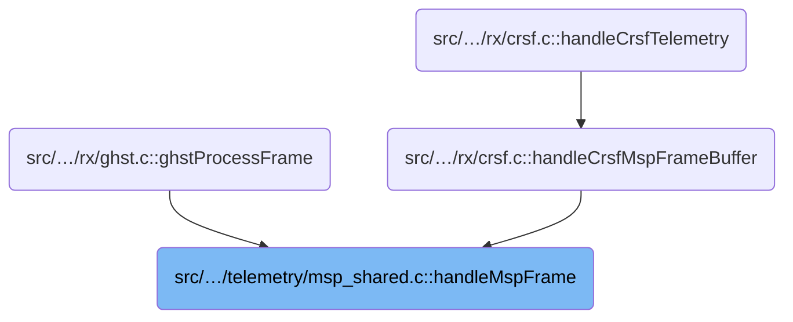
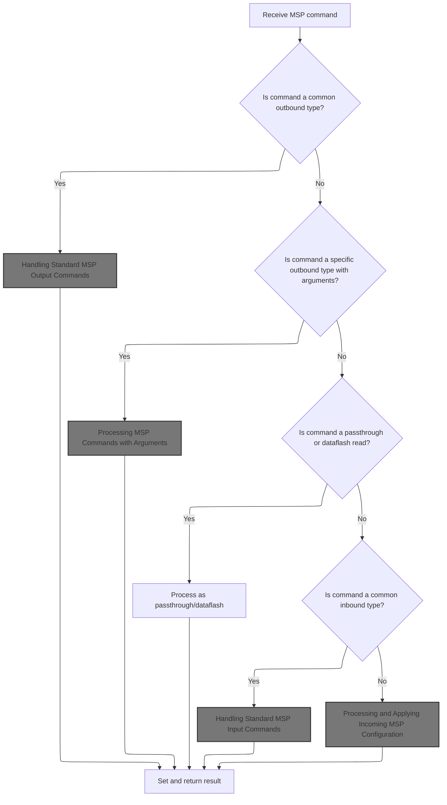
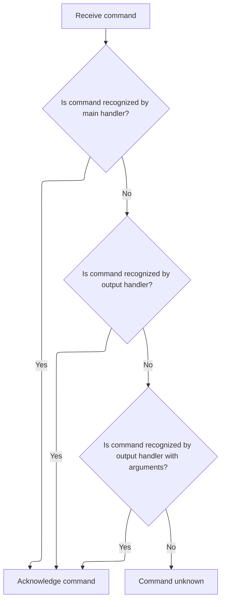
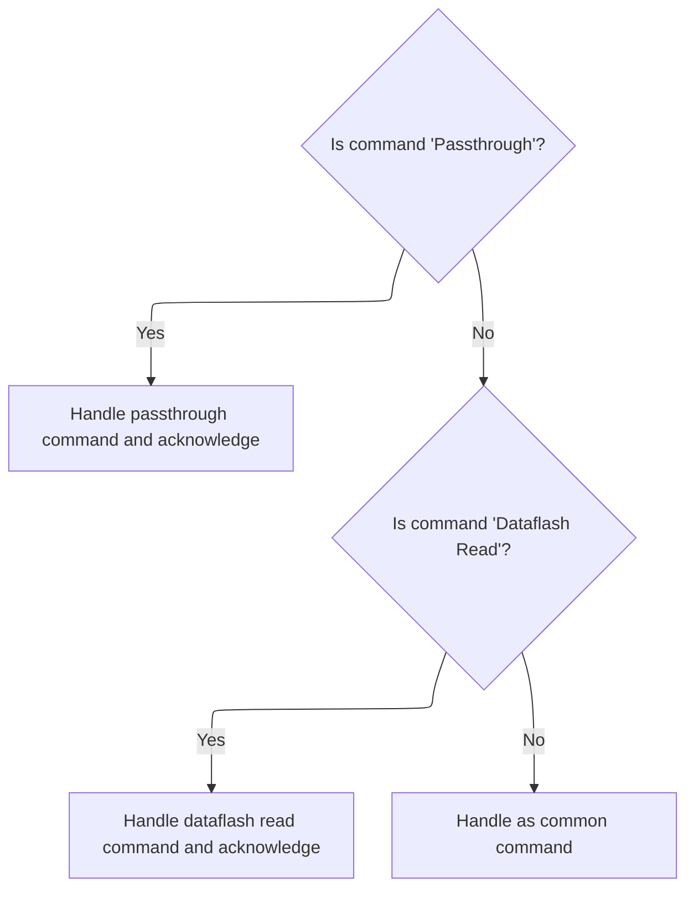
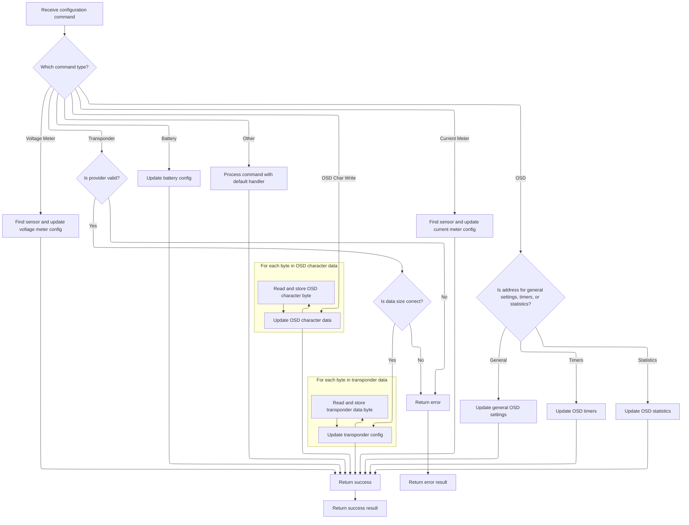
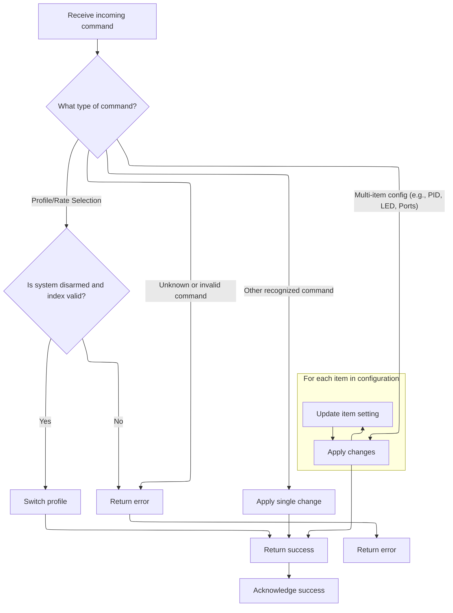

This document describes the flow for handling incoming telemetry frames containing MSP commands. The flow acts as the main entry point for MSP-based telemetry and configuration, enabling communication between the flight controller and external tools. It receives telemetry frames, interprets the contained commands, and dispatches them to the appropriate handlers, supporting data retrieval, configuration updates, and passthrough operations.

# Where is this flow used?

This flow is used multiple times in the codebase as represented in the following diagram:



# Parsing and Assembling MSP Frames

```mermaid
%%{init: {"flowchart": {"defaultRenderer": "elk"}} }%%
flowchart TD
    node1["Receive telemetry frame"] --> node2{"Is payloadLength >= MIN_LENGTH_CHUNK?"}
    click node1 openCode "src/main/telemetry/msp_shared.c:175:176"
    click node2 openCode "src/main/telemetry/msp_shared.c:177:179"
    node2 -->|"No"| node3["Reject frame"]
    click node3 openCode "src/main/telemetry/msp_shared.c:178:179"
    node2 -->|"Yes"| node4{"Is lastRequestVersion <= TELEMETRY_MSP_VERSION?"}
    click node4 openCode "src/main/telemetry/msp_shared.c:190:193"
    node4 -->|"No"| node5["Send version mismatch error"]
    click node5 openCode "src/main/telemetry/msp_shared.c:191:193"
    node4 -->|"Yes"| node6{"Is this start of new packet?"}
    click node6 openCode "src/main/telemetry/msp_shared.c:195:231"
    node6 -->|"Yes"| node7{"Is mspPayloadSize <= buffer size?"}
    click node7 openCode "src/main/telemetry/msp_shared.c:222:230"
    node7 -->|"No"| node8["Send packet too big error"]
    click node8 openCode "src/main/telemetry/msp_shared.c:228:230"
    node7 -->|"Yes"| node9["Begin assembling packet"]
    click node9 openCode "src/main/telemetry/msp_shared.c:223:227"
    node6 -->|"No"| node10{"Is sequence correct?"}
    click node10 openCode "src/main/telemetry/msp_shared.c:235:239"
    node10 -->|"No"| node11["Reject frame due to packet loss"]
    click node11 openCode "src/main/telemetry/msp_shared.c:237:239"
    node10 -->|"Yes"| node12["Continue assembling packet"]
    click node12 openCode "src/main/telemetry/msp_shared.c:241:242"
    node9 --> node13{"Is this the last chunk?"}
    click node13 openCode "src/main/telemetry/msp_shared.c:249:258"
    node12 --> node13
    node13 -->|"No"| node14["Wait for more chunks"]
    click node14 openCode "src/main/telemetry/msp_shared.c:252:253"
    node13 -->|"Yes"| node15{"Is command MSP_EEPROM_WRITE?"}
    click node15 openCode "src/main/telemetry/msp_shared.c:261:263"
    node15 -->|"Yes"| node16["Skip telemetry requests"]
    click node16 openCode "src/main/telemetry/msp_shared.c:262:263"
    node15 -->|"No"| node17["Prepare and process packet"]
    click node17 openCode "src/main/telemetry/msp_shared.c:265:268"
    node16 --> node17
    node17 --> node18["Frame processed"]
    click node18 openCode "src/main/telemetry/msp_shared.c:269:269"

classDef HeadingStyle fill:#777777,stroke:#333,stroke-width:2px;

%% Swimm:
%% %%{init: {"flowchart": {"defaultRenderer": "elk"}} }%%
%% flowchart TD
%%     node1["Receive telemetry frame"] --> node2{"Is <SwmToken path="src/main/telemetry/msp_shared.c" pos="175:16:16" line-data="bool handleMspFrame(uint8_t *const payload, uint8_t const payloadLength, uint8_t *const skipsBeforeResponse)">`payloadLength`</SwmToken> >= <SwmToken path="src/main/telemetry/msp_shared.c" pos="177:8:8" line-data="    if (payloadLength &lt; MIN_LENGTH_CHUNK) {">`MIN_LENGTH_CHUNK`</SwmToken>?"}
%%     click node1 openCode "<SwmPath>[src/…/telemetry/msp_shared.c](src/main/telemetry/msp_shared.c)</SwmPath>:175:176"
%%     click node2 openCode "<SwmPath>[src/…/telemetry/msp_shared.c](src/main/telemetry/msp_shared.c)</SwmPath>:177:179"
%%     node2 -->|"No"| node3["Reject frame"]
%%     click node3 openCode "<SwmPath>[src/…/telemetry/msp_shared.c](src/main/telemetry/msp_shared.c)</SwmPath>:178:179"
%%     node2 -->|"Yes"| node4{"Is <SwmToken path="src/main/telemetry/msp_shared.c" pos="188:1:1" line-data="    lastRequestVersion = (status &amp; MSP_STATUS_VERSION_MASK) &gt;&gt; MSP_STATUS_VERSION_SHIFT;">`lastRequestVersion`</SwmToken> <= <SwmToken path="src/main/telemetry/msp_shared.c" pos="190:8:8" line-data="    if (lastRequestVersion &gt; TELEMETRY_MSP_VERSION) {">`TELEMETRY_MSP_VERSION`</SwmToken>?"}
%%     click node4 openCode "<SwmPath>[src/…/telemetry/msp_shared.c](src/main/telemetry/msp_shared.c)</SwmPath>:190:193"
%%     node4 -->|"No"| node5["Send version mismatch error"]
%%     click node5 openCode "<SwmPath>[src/…/telemetry/msp_shared.c](src/main/telemetry/msp_shared.c)</SwmPath>:191:193"
%%     node4 -->|"Yes"| node6{"Is this start of new packet?"}
%%     click node6 openCode "<SwmPath>[src/…/telemetry/msp_shared.c](src/main/telemetry/msp_shared.c)</SwmPath>:195:231"
%%     node6 -->|"Yes"| node7{"Is <SwmToken path="src/main/telemetry/msp_shared.c" pos="196:3:3" line-data="        uint16_t mspPayloadSize;">`mspPayloadSize`</SwmToken> <= buffer size?"}
%%     click node7 openCode "<SwmPath>[src/…/telemetry/msp_shared.c](src/main/telemetry/msp_shared.c)</SwmPath>:222:230"
%%     node7 -->|"No"| node8["Send packet too big error"]
%%     click node8 openCode "<SwmPath>[src/…/telemetry/msp_shared.c](src/main/telemetry/msp_shared.c)</SwmPath>:228:230"
%%     node7 -->|"Yes"| node9["Begin assembling packet"]
%%     click node9 openCode "<SwmPath>[src/…/telemetry/msp_shared.c](src/main/telemetry/msp_shared.c)</SwmPath>:223:227"
%%     node6 -->|"No"| node10{"Is sequence correct?"}
%%     click node10 openCode "<SwmPath>[src/…/telemetry/msp_shared.c](src/main/telemetry/msp_shared.c)</SwmPath>:235:239"
%%     node10 -->|"No"| node11["Reject frame due to packet loss"]
%%     click node11 openCode "<SwmPath>[src/…/telemetry/msp_shared.c](src/main/telemetry/msp_shared.c)</SwmPath>:237:239"
%%     node10 -->|"Yes"| node12["Continue assembling packet"]
%%     click node12 openCode "<SwmPath>[src/…/telemetry/msp_shared.c](src/main/telemetry/msp_shared.c)</SwmPath>:241:242"
%%     node9 --> node13{"Is this the last chunk?"}
%%     click node13 openCode "<SwmPath>[src/…/telemetry/msp_shared.c](src/main/telemetry/msp_shared.c)</SwmPath>:249:258"
%%     node12 --> node13
%%     node13 -->|"No"| node14["Wait for more chunks"]
%%     click node14 openCode "<SwmPath>[src/…/telemetry/msp_shared.c](src/main/telemetry/msp_shared.c)</SwmPath>:252:253"
%%     node13 -->|"Yes"| node15{"Is command <SwmToken path="src/main/telemetry/msp_shared.c" pos="260:19:19" line-data="    // Skip a few telemetry requests if command is MSP_EEPROM_WRITE">`MSP_EEPROM_WRITE`</SwmToken>?"}
%%     click node15 openCode "<SwmPath>[src/…/telemetry/msp_shared.c](src/main/telemetry/msp_shared.c)</SwmPath>:261:263"
%%     node15 -->|"Yes"| node16["Skip telemetry requests"]
%%     click node16 openCode "<SwmPath>[src/…/telemetry/msp_shared.c](src/main/telemetry/msp_shared.c)</SwmPath>:262:263"
%%     node15 -->|"No"| node17["Prepare and process packet"]
%%     click node17 openCode "<SwmPath>[src/…/telemetry/msp_shared.c](src/main/telemetry/msp_shared.c)</SwmPath>:265:268"
%%     node16 --> node17
%%     node17 --> node18["Frame processed"]
%%     click node18 openCode "<SwmPath>[src/…/telemetry/msp_shared.c](src/main/telemetry/msp_shared.c)</SwmPath>:269:269"
%% 
%% classDef HeadingStyle fill:#777777,stroke:#333,stroke-width:2px;
```



<SwmSnippet path="/src/main/telemetry/msp_shared.c" line="175">

---

HandleMspFrame kicks off the MSP frame parsing and assembly. It checks the protocol version (v1/v2), extracts payload size and command, and manages multi-chunk frame assembly using static state. Sequence numbers are validated to detect packet loss. When a full frame is assembled, it calls <SwmToken path="src/main/telemetry/msp_shared.c" pos="267:1:1" line-data="    processMspPacket();">`processMspPacket`</SwmToken> to actually process the command. Special handling is done for EEPROM writes by setting <SwmToken path="src/main/telemetry/msp_shared.c" pos="175:24:24" line-data="bool handleMspFrame(uint8_t *const payload, uint8_t const payloadLength, uint8_t *const skipsBeforeResponse)">`skipsBeforeResponse`</SwmToken>, which tells telemetry to pause requests for a bit.

```c
bool handleMspFrame(uint8_t *const payload, uint8_t const payloadLength, uint8_t *const skipsBeforeResponse)
{
    if (payloadLength < MIN_LENGTH_CHUNK) {
        return false;   // prevent analyzing garbage data
    }

    static uint8_t mspStarted = 0;
    static uint8_t lastSeq = 0;

    sbuf_t sbufInput;

    const uint8_t status = payload[MSP_INDEX_STATUS];
    const uint8_t seqNumber = status & MSP_STATUS_SEQUENCE_MASK;
    lastRequestVersion = (status & MSP_STATUS_VERSION_MASK) >> MSP_STATUS_VERSION_SHIFT;

    if (lastRequestVersion > TELEMETRY_MSP_VERSION) {
        sendMspErrorResponse(TELEMETRY_MSP_VER_MISMATCH, 0);
        return true;
    }

    if (status & MSP_STATUS_START_MASK) { // first packet in sequence
        uint16_t mspPayloadSize;
        if (lastRequestVersion == 1) { // MSPv1
            if (payloadLength < MIN_LENGTH_REQUEST_V1) {
                return false;   // prevent analyzing garbage data
            }

            mspPayloadSize = payload[MSP_INDEX_SIZE_V1];
            requestPacket.cmd = payload[MSP_INDEX_ID_V1];
            if (mspPayloadSize == 0xff) { // jumbo frame
                if (payloadLength < MIN_LENGTH_REQUEST_JUMBO) {
                    return false;   // prevent analyzing garbage data
                }
                mspPayloadSize = *(uint16_t*)&payload[MSP_INDEX_SIZE_JUMBO_LO];
                sbufInit(&sbufInput, payload + MSP_INDEX_PAYLOAD_JUMBO, payload + payloadLength);
            } else {
                sbufInit(&sbufInput, payload + MSP_INDEX_PAYLOAD_V1, payload + payloadLength);
            }
        } else { // MSPv2
            if (payloadLength < MIN_LENGTH_REQUEST_V2) {
                return false;   // prevent analyzing garbage data
            }
            requestPacket.flags = payload[MSP_INDEX_FLAG_V2];
            requestPacket.cmd = *(uint16_t*)&payload[MSP_INDEX_ID_LO];
            mspPayloadSize = *(uint16_t*)&payload[MSP_INDEX_SIZE_V2_LO];
            sbufInit(&sbufInput, payload + MSP_INDEX_PAYLOAD_V2, payload + payloadLength);
        }
        if (mspPayloadSize <= sizeof(requestBuffer)) { // prevent buffer overrun
            requestPacket.result = 0;
            requestPacket.buf.ptr = requestBuffer;
            requestPacket.buf.end = requestBuffer + mspPayloadSize;
            mspStarted = 1;
        } else { // this MSP packet is too big to fit in the buffer.
            sendMspErrorResponse(TELEMETRY_MSP_REQUEST_IS_TOO_BIG, requestPacket.cmd);
            return true;
        }
    } else { // second onward chunk
        if (!mspStarted) { // no start packet yet, throw this one away
            return false;
        } else {
            if (((lastSeq + 1) & MSP_STATUS_SEQUENCE_MASK) != seqNumber) {
                // packet loss detected!
                mspStarted = 0;
                return false;
            }
        }
        sbufInit(&sbufInput, payload + 1, payload + payloadLength);
    }

    lastSeq = seqNumber;

    const int payloadExpecting = sbufBytesRemaining(&requestPacket.buf);
    const int payloadIncoming = sbufBytesRemaining(&sbufInput);

    if (payloadExpecting > payloadIncoming) {
        sbufWriteData(&requestPacket.buf, sbufInput.ptr, payloadIncoming);
        sbufAdvance(&sbufInput, payloadIncoming);
        return false;
    } else { // this is the last/only chunk
        if (payloadExpecting) {
            sbufWriteData(&requestPacket.buf, sbufInput.ptr, payloadExpecting);
            sbufAdvance(&sbufInput, payloadExpecting);
        }
    }

    // Skip a few telemetry requests if command is MSP_EEPROM_WRITE
    if (requestPacket.cmd == MSP_EEPROM_WRITE && skipsBeforeResponse) {
        *skipsBeforeResponse = TELEMETRY_REQUEST_SKIPS_AFTER_EEPROMWRITE;
    }

    mspStarted = 0;
    sbufSwitchToReader(&requestPacket.buf, requestBuffer);
    processMspPacket();
    return true;
}
```

---

</SwmSnippet>

# Preparing MSP Response Packet

<SwmSnippet path="/src/main/telemetry/msp_shared.c" line="144">

---

ProcessMspPacket sets up the response and hands off to <SwmToken path="src/main/telemetry/msp_shared.c" pos="152:4:4" line-data="    if (mspFcProcessCommand(mspSharedDescriptor, &amp;requestPacket, &amp;responsePacket, &amp;mspPostProcessFn) == MSP_RESULT_ERROR) {">`mspFcProcessCommand`</SwmToken> to process the command and fill in the response.

```c
static void processMspPacket(void)
{
    responsePacket.cmd = 0;
    responsePacket.result = 0;
    responsePacket.buf.ptr = responseBuffer;
    responsePacket.buf.end = ARRAYEND(responseBuffer);

    mspPostProcessFnPtr mspPostProcessFn = NULL;
    if (mspFcProcessCommand(mspSharedDescriptor, &requestPacket, &responsePacket, &mspPostProcessFn) == MSP_RESULT_ERROR) {
        sbufWriteU8(&responsePacket.buf, TELEMETRY_MSP_ERROR);
    }
```

---

</SwmSnippet>

## Dispatching MSP Commands



<SwmSnippet path="/src/main/msp/msp.c" line="4421">

---

In <SwmToken path="src/main/msp/msp.c" pos="4421:2:2" line-data="mspResult_e mspFcProcessCommand(mspDescriptor_t srcDesc, mspPacket_t *cmd, mspPacket_t *reply, mspPostProcessFnPtr *mspPostProcessFn)">`mspFcProcessCommand`</SwmToken> we set up the reply to match the incoming command and then dispatch the command to the right handler. The function checks which handler matches the command code and calls it, moving through output, argument-based, passthrough, and dataflash handlers as needed.

```c
mspResult_e mspFcProcessCommand(mspDescriptor_t srcDesc, mspPacket_t *cmd, mspPacket_t *reply, mspPostProcessFnPtr *mspPostProcessFn)
{
    int ret = MSP_RESULT_ACK;
    sbuf_t *dst = &reply->buf;
    sbuf_t *src = &cmd->buf;
    const int16_t cmdMSP = cmd->cmd;
    // initialize reply by default
    reply->cmd = cmd->cmd;

    if (mspCommonProcessOutCommand(cmdMSP, dst, mspPostProcessFn)) {
```

---

</SwmSnippet>

### Handling Standard MSP Output Commands

```mermaid
%%{init: {"flowchart": {"defaultRenderer": "elk"}} }%%
flowchart TD
  node1["Receive command request (cmdMSP)"] --> node2{"Which command is requested?"}
  click node1 openCode "src/main/msp/msp.c:627:1083"
  node2 -->|"API Version"| node3["Return API version info"]
  click node3 openCode "src/main/msp/msp.c:631:636"
  node2 -->|"FC Variant"| node4["Return flight controller variant"]
  click node4 openCode "src/main/msp/msp.c:638:640"
  node2 -->|"FC Version"| node5["Return flight controller version"]
  click node5 openCode "src/main/msp/msp.c:642:647"
  node2 -->|"Board Info"| node6{"Is board info feature enabled?"}
  click node6 openCode "src/main/msp/msp.c:655:754"
  node6 -->|"Yes"| node6a["Return board information"]
  click node6a openCode "src/main/msp/msp.c:655:754"
  node6 -->|"No"| node6b["Return default board info"]
  click node6b openCode "src/main/msp/msp.c:702:704"
  node2 -->|"Battery State"| node7["Return battery state"]
  click node7 openCode "src/main/msp/msp.c:796:811"
  node2 -->|"Analog"| node8["Return analog sensor data"]
  click node8 openCode "src/main/msp/msp.c:764:770"
  node2 -->|"Debug"| node9["Return debug values"]
  click node9 openCode "src/main/msp/msp.c:772:775"
  subgraph loop1["For each debug value"]
    node9 --> node9a["Write debug value to response"]
    click node9a openCode "src/main/msp/msp.c:773:775"
  end
  node2 -->|"OSD Config"| node10{"Is OSD feature enabled?"}
  click node10 openCode "src/main/msp/msp.c:943:1068"
  node10 -->|"Yes"| node10a["Return OSD configuration"]
  click node10a openCode "src/main/msp/msp.c:943:1068"
  node10 -->|"No"| node10b["Return default OSD config"]
  click node10b openCode "src/main/msp/msp.c:996:997"
  subgraph loop2["For each OSD item"]
    node10a --> node10c["Write OSD item config"]
    click node10c openCode "src/main/msp/msp.c:1015:1017"
  end
  node2 -->|"Voltage Meters"| node11["Return voltage meter data"]
  click node11 openCode "src/main/msp/msp.c:813:828"
  subgraph loop3["For each voltage meter"]
    node11 --> node11a["Write voltage meter value"]
    click node11a openCode "src/main/msp/msp.c:820:828"
  end
  node2 -->|"Current Meters"| node12["Return current meter data"]
  click node12 openCode "src/main/msp/msp.c:832:847"
  subgraph loop4["For each current meter"]
    node12 --> node12a["Write current meter value"]
    click node12a openCode "src/main/msp/msp.c:838:847"
  end
  node2 -->|"Unknown"| node13["Return failure"]
  click node13 openCode "src/main/msp/msp.c:1079:1081"

classDef HeadingStyle fill:#777777,stroke:#333,stroke-width:2px;

%% Swimm:
%% %%{init: {"flowchart": {"defaultRenderer": "elk"}} }%%
%% flowchart TD
%%   node1["Receive command request (<SwmToken path="src/main/msp/msp.c" pos="627:8:8" line-data="static bool mspCommonProcessOutCommand(int16_t cmdMSP, sbuf_t *dst, mspPostProcessFnPtr *mspPostProcessFn)">`cmdMSP`</SwmToken>)"] --> node2{"Which command is requested?"}
%%   click node1 openCode "<SwmPath>[src/…/msp/msp.c](src/main/msp/msp.c)</SwmPath>:627:1083"
%%   node2 -->|"API Version"| node3["Return API version info"]
%%   click node3 openCode "<SwmPath>[src/…/msp/msp.c](src/main/msp/msp.c)</SwmPath>:631:636"
%%   node2 -->|"FC Variant"| node4["Return flight controller variant"]
%%   click node4 openCode "<SwmPath>[src/…/msp/msp.c](src/main/msp/msp.c)</SwmPath>:638:640"
%%   node2 -->|"FC Version"| node5["Return flight controller version"]
%%   click node5 openCode "<SwmPath>[src/…/msp/msp.c](src/main/msp/msp.c)</SwmPath>:642:647"
%%   node2 -->|"Board Info"| node6{"Is board info feature enabled?"}
%%   click node6 openCode "<SwmPath>[src/…/msp/msp.c](src/main/msp/msp.c)</SwmPath>:655:754"
%%   node6 -->|"Yes"| node6a["Return board information"]
%%   click node6a openCode "<SwmPath>[src/…/msp/msp.c](src/main/msp/msp.c)</SwmPath>:655:754"
%%   node6 -->|"No"| node6b["Return default board info"]
%%   click node6b openCode "<SwmPath>[src/…/msp/msp.c](src/main/msp/msp.c)</SwmPath>:702:704"
%%   node2 -->|"Battery State"| node7["Return battery state"]
%%   click node7 openCode "<SwmPath>[src/…/msp/msp.c](src/main/msp/msp.c)</SwmPath>:796:811"
%%   node2 -->|"Analog"| node8["Return analog sensor data"]
%%   click node8 openCode "<SwmPath>[src/…/msp/msp.c](src/main/msp/msp.c)</SwmPath>:764:770"
%%   node2 -->|"Debug"| node9["Return debug values"]
%%   click node9 openCode "<SwmPath>[src/…/msp/msp.c](src/main/msp/msp.c)</SwmPath>:772:775"
%%   subgraph loop1["For each debug value"]
%%     node9 --> node9a["Write debug value to response"]
%%     click node9a openCode "<SwmPath>[src/…/msp/msp.c](src/main/msp/msp.c)</SwmPath>:773:775"
%%   end
%%   node2 -->|"OSD Config"| node10{"Is OSD feature enabled?"}
%%   click node10 openCode "<SwmPath>[src/…/msp/msp.c](src/main/msp/msp.c)</SwmPath>:943:1068"
%%   node10 -->|"Yes"| node10a["Return OSD configuration"]
%%   click node10a openCode "<SwmPath>[src/…/msp/msp.c](src/main/msp/msp.c)</SwmPath>:943:1068"
%%   node10 -->|"No"| node10b["Return default OSD config"]
%%   click node10b openCode "<SwmPath>[src/…/msp/msp.c](src/main/msp/msp.c)</SwmPath>:996:997"
%%   subgraph loop2["For each OSD item"]
%%     node10a --> node10c["Write OSD item config"]
%%     click node10c openCode "<SwmPath>[src/…/msp/msp.c](src/main/msp/msp.c)</SwmPath>:1015:1017"
%%   end
%%   node2 -->|"Voltage Meters"| node11["Return voltage meter data"]
%%   click node11 openCode "<SwmPath>[src/…/msp/msp.c](src/main/msp/msp.c)</SwmPath>:813:828"
%%   subgraph loop3["For each voltage meter"]
%%     node11 --> node11a["Write voltage meter value"]
%%     click node11a openCode "<SwmPath>[src/…/msp/msp.c](src/main/msp/msp.c)</SwmPath>:820:828"
%%   end
%%   node2 -->|"Current Meters"| node12["Return current meter data"]
%%   click node12 openCode "<SwmPath>[src/…/msp/msp.c](src/main/msp/msp.c)</SwmPath>:832:847"
%%   subgraph loop4["For each current meter"]
%%     node12 --> node12a["Write current meter value"]
%%     click node12a openCode "<SwmPath>[src/…/msp/msp.c](src/main/msp/msp.c)</SwmPath>:838:847"
%%   end
%%   node2 -->|"Unknown"| node13["Return failure"]
%%   click node13 openCode "<SwmPath>[src/…/msp/msp.c](src/main/msp/msp.c)</SwmPath>:1079:1081"
%% 
%% classDef HeadingStyle fill:#777777,stroke:#333,stroke-width:2px;
```



<SwmSnippet path="/src/main/msp/msp.c" line="627">

---

MspCommonProcessOutCommand switches on the command ID and writes protocol-specific response data to the output buffer. It uses a ton of #ifdefs to include/exclude fields based on build options, so the actual output depends on which features are enabled. If the command isn't recognized, it returns false.

```c
static bool mspCommonProcessOutCommand(int16_t cmdMSP, sbuf_t *dst, mspPostProcessFnPtr *mspPostProcessFn)
{
    UNUSED(mspPostProcessFn);

    switch (cmdMSP) {
    case MSP_API_VERSION:
        sbufWriteU8(dst, MSP_PROTOCOL_VERSION);
        sbufWriteU8(dst, API_VERSION_MAJOR);
        sbufWriteU8(dst, API_VERSION_MINOR);
        break;

    case MSP_FC_VARIANT:
        sbufWriteData(dst, flightControllerIdentifier, FLIGHT_CONTROLLER_IDENTIFIER_LENGTH);
        break;

    case MSP_FC_VERSION:
        sbufWriteU8(dst, (uint8_t)(FC_VERSION_YEAR - FC_CALVER_BASE_YEAR)); // year since 2000
        sbufWriteU8(dst, FC_VERSION_MONTH);
        sbufWriteU8(dst, FC_VERSION_PATCH_LEVEL);
        sbufWritePString(dst, FC_VERSION_STRING);
        break;

    case MSP2_MCU_INFO: {
        sbufWriteU8(dst, getMcuTypeId());
        sbufWritePString(dst, getMcuTypeName());
        break;
    }

    case MSP_BOARD_INFO: {
        sbufWriteData(dst, systemConfig()->boardIdentifier, BOARD_IDENTIFIER_LENGTH);
#ifdef USE_HARDWARE_REVISION_DETECTION
        sbufWriteU16(dst, hardwareRevision);
#else
        sbufWriteU16(dst, 0); // No other build targets currently have hardware revision detection.
#endif
#if defined(USE_MAX7456)
        sbufWriteU8(dst, 2);  // 2 == FC with MAX7456
#else
        sbufWriteU8(dst, 0);  // 0 == FC
#endif

        // Target capabilities (uint8)
#define TARGET_HAS_VCP 0
#define TARGET_HAS_SOFTSERIAL 1
#define TARGET_HAS_FLASH_BOOTLOADER 3
#define TARGET_SUPPORTS_RX_BIND 6

        uint8_t targetCapabilities = 0;
#ifdef USE_VCP
        targetCapabilities |= BIT(TARGET_HAS_VCP);
#endif
#if defined(USE_SOFTSERIAL)
        targetCapabilities |= BIT(TARGET_HAS_SOFTSERIAL);
#endif
#if defined(USE_FLASH_BOOT_LOADER)
        targetCapabilities |= BIT(TARGET_HAS_FLASH_BOOTLOADER);
#endif
#if defined(USE_RX_BIND)
        if (getRxBindSupported()) {
            targetCapabilities |= BIT(TARGET_SUPPORTS_RX_BIND);
        }
#endif

        sbufWriteU8(dst, targetCapabilities);

        // Target name with explicit length
        sbufWritePString(dst, targetName);

#if defined(USE_BOARD_INFO)
        // Board name with explicit length
        sbufWritePString(dst, getBoardName());

        // Manufacturer id with explicit length
        sbufWritePString(dst, getManufacturerId());
#else
        sbufWriteU8(dst, 0);
        sbufWriteU8(dst, 0);
#endif

#if defined(USE_SIGNATURE)
        // Signature
        sbufWriteData(dst, getSignature(), SIGNATURE_LENGTH);
#else
        uint8_t emptySignature[SIGNATURE_LENGTH];
        memset(emptySignature, 0, sizeof(emptySignature));
        sbufWriteData(dst, &emptySignature, sizeof(emptySignature));
#endif

        sbufWriteU8(dst, getMcuTypeId());

        // Added in API version 1.42
        sbufWriteU8(dst, systemConfig()->configurationState);

        // Added in API version 1.43
        sbufWriteU16(dst, gyro.sampleRateHz); // informational so the configurator can display the correct gyro/pid frequencies in the drop-down

        // Configuration warnings / problems (uint32_t)
#define PROBLEM_ACC_NEEDS_CALIBRATION 0
#define PROBLEM_MOTOR_PROTOCOL_DISABLED 1

        uint32_t configurationProblems = 0;

#if defined(USE_ACC)
        if (!accHasBeenCalibrated()) {
            configurationProblems |= BIT(PROBLEM_ACC_NEEDS_CALIBRATION);
        }
#endif

        if (!checkMotorProtocolEnabled(&motorConfig()->dev, NULL)) {
            configurationProblems |= BIT(PROBLEM_MOTOR_PROTOCOL_DISABLED);
        }

        sbufWriteU32(dst, configurationProblems);

        // Added in MSP API 1.44
#if defined(USE_SPI)
        sbufWriteU8(dst, spiGetRegisteredDeviceCount());
#else
        sbufWriteU8(dst, 0);
#endif
#if defined(USE_I2C)
        sbufWriteU8(dst, i2cGetRegisteredDeviceCount());
#else
        sbufWriteU8(dst, 0);
#endif

        break;
    }

    case MSP_BUILD_INFO:
        sbufWriteData(dst, buildDate, BUILD_DATE_LENGTH);
        sbufWriteData(dst, buildTime, BUILD_TIME_LENGTH);
        sbufWriteData(dst, shortGitRevision, GIT_SHORT_REVISION_LENGTH);
        // Added in API version 1.46
        sbufWriteBuildInfoFlags(dst);
        break;

    case MSP_ANALOG:
        sbufWriteU8(dst, (uint8_t)constrain(getLegacyBatteryVoltage(), 0, 255));
        sbufWriteU16(dst, (uint16_t)constrain(getMAhDrawn(), 0, 0xFFFF)); // milliamp hours drawn from battery
        sbufWriteU16(dst, getRssi());
        sbufWriteU16(dst, (int16_t)constrain(getAmperage(), -0x8000, 0x7FFF)); // send current in 0.01 A steps, range is -320A to 320A
        sbufWriteU16(dst, getBatteryVoltage());
        break;

    case MSP_DEBUG:
        for (int i = 0; i < DEBUG16_VALUE_COUNT; i++) {
            sbufWriteU16(dst, debug[i]);      // 4 variables are here for general monitoring purpose
        }
```

---

</SwmSnippet>

<SwmSnippet path="/src/main/msp/msp.c" line="778">

---

This section continues the switch statement, handling <SwmToken path="src/main/msp/msp.c" pos="778:3:3" line-data="    case MSP_UID:">`MSP_UID`</SwmToken>, <SwmToken path="src/main/msp/msp.c" pos="784:3:3" line-data="    case MSP_FEATURE_CONFIG:">`MSP_FEATURE_CONFIG`</SwmToken>, <SwmToken path="src/main/msp/msp.c" pos="789:3:3" line-data="    case MSP_BEEPER_CONFIG:">`MSP_BEEPER_CONFIG`</SwmToken>, <SwmToken path="src/main/msp/msp.c" pos="796:3:3" line-data="    case MSP_BATTERY_STATE: {">`MSP_BATTERY_STATE`</SwmToken>, and <SwmToken path="src/main/msp/msp.c" pos="813:3:3" line-data="    case MSP_VOLTAGE_METERS: {">`MSP_VOLTAGE_METERS`</SwmToken>. Each case outputs specific config or sensor data, and the flow moves on to the next command handler.

```c
    case MSP_UID:
        sbufWriteU32(dst, U_ID_0);
        sbufWriteU32(dst, U_ID_1);
        sbufWriteU32(dst, U_ID_2);
        break;

    case MSP_FEATURE_CONFIG:
        sbufWriteU32(dst, featureConfig()->enabledFeatures);
        break;

#ifdef USE_BEEPER
    case MSP_BEEPER_CONFIG:
        sbufWriteU32(dst, beeperConfig()->beeper_off_flags);
        sbufWriteU8(dst, beeperConfig()->dshotBeaconTone);
        sbufWriteU32(dst, beeperConfig()->dshotBeaconOffFlags);
        break;
#endif

    case MSP_BATTERY_STATE: {
        // battery characteristics
        sbufWriteU8(dst, (uint8_t)constrain(getBatteryCellCount(), 0, 255)); // 0 indicates battery not detected.
        sbufWriteU16(dst, batteryConfig()->batteryCapacity); // in mAh

        // battery state
        sbufWriteU8(dst, (uint8_t)constrain(getLegacyBatteryVoltage(), 0, 255)); // in 0.1V steps
        sbufWriteU16(dst, (uint16_t)constrain(getMAhDrawn(), 0, 0xFFFF)); // milliamp hours drawn from battery
        sbufWriteU16(dst, (int16_t)constrain(getAmperage(), -0x8000, 0x7FFF)); // send current in 0.01 A steps, range is -320A to 320A

        // battery alerts
        sbufWriteU8(dst, (uint8_t)getBatteryState());

        sbufWriteU16(dst, getBatteryVoltage()); // in 0.01V steps
        break;
    }

    case MSP_VOLTAGE_METERS: {
        // write out id and voltage meter values, once for each meter we support
        uint8_t count = supportedVoltageMeterCount;
#ifdef USE_ESC_SENSOR
        count -= VOLTAGE_METER_ID_ESC_COUNT - getMotorCount();
#endif

        for (int i = 0; i < count; i++) {

            voltageMeter_t meter;
            uint8_t id = (uint8_t)voltageMeterIds[i];
            voltageMeterRead(id, &meter);

            sbufWriteU8(dst, id);
            sbufWriteU8(dst, (uint8_t)constrain((meter.displayFiltered + 5) / 10, 0, 255));
        }
```

---

</SwmSnippet>

<SwmSnippet path="/src/main/msp/msp.c" line="832">

---

Here we handle <SwmToken path="src/main/msp/msp.c" pos="832:3:3" line-data="    case MSP_CURRENT_METERS: {">`MSP_CURRENT_METERS`</SwmToken>, outputting current meter data for each supported meter. After this, the flow continues to voltage meter config and other command handlers.

```c
    case MSP_CURRENT_METERS: {
        // write out id and current meter values, once for each meter we support
        uint8_t count = supportedCurrentMeterCount;
#ifdef USE_ESC_SENSOR
        count -= VOLTAGE_METER_ID_ESC_COUNT - getMotorCount();
#endif
        for (int i = 0; i < count; i++) {

            currentMeter_t meter;
            uint8_t id = (uint8_t)currentMeterIds[i];
            currentMeterRead(id, &meter);

            sbufWriteU8(dst, id);
            sbufWriteU16(dst, (uint16_t)constrain(meter.mAhDrawn, 0, 0xFFFF)); // milliamp hours drawn from battery
            sbufWriteU16(dst, (uint16_t)constrain(meter.amperage * 10, 0, 0xFFFF)); // send amperage in 0.001 A steps (mA). Negative range is truncated to zero
        }
```

---

</SwmSnippet>

<SwmSnippet path="/src/main/msp/msp.c" line="851">

---

This section handles <SwmToken path="src/main/msp/msp.c" pos="851:3:3" line-data="    case MSP_VOLTAGE_METER_CONFIG: {">`MSP_VOLTAGE_METER_CONFIG`</SwmToken>, writing out config for each ADC voltage sensor. Next up is current meter config and battery config handlers.

```c
    case MSP_VOLTAGE_METER_CONFIG: {
        // by using a sensor type and a sub-frame length it's possible to configure any type of voltage meter,
        // e.g. an i2c/spi/can sensor or any sensor not built directly into the FC such as ESC/RX/SPort/SBus that has
        // different configuration requirements.
        STATIC_ASSERT(VOLTAGE_SENSOR_ADC_VBAT == 0, VOLTAGE_SENSOR_ADC_VBAT_incorrect); // VOLTAGE_SENSOR_ADC_VBAT should be the first index
        sbufWriteU8(dst, MAX_VOLTAGE_SENSOR_ADC); // voltage meters in payload
        for (int i = VOLTAGE_SENSOR_ADC_VBAT; i < MAX_VOLTAGE_SENSOR_ADC; i++) {
            const uint8_t adcSensorSubframeLength = 1 + 1 + 1 + 1 + 1; // length of id, type, vbatscale, vbatresdivval, vbatresdivmultipler, in bytes
            sbufWriteU8(dst, adcSensorSubframeLength); // ADC sensor sub-frame length

            sbufWriteU8(dst, voltageMeterADCtoIDMap[i]); // id of the sensor
            sbufWriteU8(dst, VOLTAGE_SENSOR_TYPE_ADC_RESISTOR_DIVIDER); // indicate the type of sensor that the next part of the payload is for

            sbufWriteU8(dst, voltageSensorADCConfig(i)->vbatscale);
            sbufWriteU8(dst, voltageSensorADCConfig(i)->vbatresdivval);
            sbufWriteU8(dst, voltageSensorADCConfig(i)->vbatresdivmultiplier);
        }
```

---

</SwmSnippet>

<SwmSnippet path="/src/main/msp/msp.c" line="872">

---

Here we handle <SwmToken path="src/main/msp/msp.c" pos="872:3:3" line-data="    case MSP_CURRENT_METER_CONFIG: {">`MSP_CURRENT_METER_CONFIG`</SwmToken>, outputting config for ADC and virtual current sensors. The flow then continues to battery config and transponder config handlers.

```c
    case MSP_CURRENT_METER_CONFIG: {
        // the ADC and VIRTUAL sensors have the same configuration requirements, however this API reflects
        // that this situation may change and allows us to support configuration of any current sensor with
        // specialist configuration requirements.

        int currentMeterCount = 1;

#ifdef USE_VIRTUAL_CURRENT_METER
        currentMeterCount++;
#endif
        sbufWriteU8(dst, currentMeterCount);

        const uint8_t adcSensorSubframeLength = 1 + 1 + 2 + 2; // length of id, type, scale, offset, in bytes
        sbufWriteU8(dst, adcSensorSubframeLength);
        sbufWriteU8(dst, CURRENT_METER_ID_BATTERY_1); // the id of the meter
        sbufWriteU8(dst, CURRENT_SENSOR_ADC); // indicate the type of sensor that the next part of the payload is for
        sbufWriteU16(dst, currentSensorADCConfig()->scale);
        sbufWriteU16(dst, currentSensorADCConfig()->offset);

#ifdef USE_VIRTUAL_CURRENT_METER
        const int8_t virtualSensorSubframeLength = 1 + 1 + 2 + 2; // length of id, type, scale, offset, in bytes
        sbufWriteU8(dst, virtualSensorSubframeLength);
        sbufWriteU8(dst, CURRENT_METER_ID_VIRTUAL_1); // the id of the meter
        sbufWriteU8(dst, CURRENT_SENSOR_VIRTUAL); // indicate the type of sensor that the next part of the payload is for
        sbufWriteU16(dst, currentSensorVirtualConfig()->scale);
        sbufWriteU16(dst, currentSensorVirtualConfig()->offset);
#endif

        // if we had any other current sensors, this is where we would output any needed configuration
        break;
    }

    case MSP_BATTERY_CONFIG:
        sbufWriteU8(dst, (batteryConfig()->vbatmincellvoltage + 5) / 10);
        sbufWriteU8(dst, (batteryConfig()->vbatmaxcellvoltage + 5) / 10);
        sbufWriteU8(dst, (batteryConfig()->vbatwarningcellvoltage + 5) / 10);
        sbufWriteU16(dst, batteryConfig()->batteryCapacity);
        sbufWriteU8(dst, batteryConfig()->voltageMeterSource);
        sbufWriteU8(dst, batteryConfig()->currentMeterSource);
        sbufWriteU16(dst, batteryConfig()->vbatmincellvoltage);
        sbufWriteU16(dst, batteryConfig()->vbatmaxcellvoltage);
        sbufWriteU16(dst, batteryConfig()->vbatwarningcellvoltage);
        break;

    case MSP_TRANSPONDER_CONFIG: {
#ifdef USE_TRANSPONDER
        // Backward compatibility to BFC 3.1.1 is lost for this message type
        sbufWriteU8(dst, TRANSPONDER_PROVIDER_COUNT);
        for (unsigned int i = 0; i < TRANSPONDER_PROVIDER_COUNT; i++) {
            sbufWriteU8(dst, transponderRequirements[i].provider);
            sbufWriteU8(dst, transponderRequirements[i].dataLength);
        }
```

---

</SwmSnippet>

<SwmSnippet path="/src/main/msp/msp.c" line="925">

---

This section handles <SwmToken path="src/main/msp/msp.c" pos="916:3:3" line-data="    case MSP_TRANSPONDER_CONFIG: {">`MSP_TRANSPONDER_CONFIG`</SwmToken>, outputting provider and data for transponder config. Next up is OSD config if enabled.

```c
        uint8_t provider = transponderConfig()->provider;
        sbufWriteU8(dst, provider);

        if (provider) {
            uint8_t requirementIndex = provider - 1;
            uint8_t providerDataLength = transponderRequirements[requirementIndex].dataLength;

            for (unsigned int i = 0; i < providerDataLength; i++) {
                sbufWriteU8(dst, transponderConfig()->data[i]);
            }
```

---

</SwmSnippet>

<SwmSnippet path="/src/main/msp/msp.c" line="937">

---

Here we finish up <SwmToken path="src/main/msp/msp.c" pos="916:3:3" line-data="    case MSP_TRANSPONDER_CONFIG: {">`MSP_TRANSPONDER_CONFIG`</SwmToken> and move into <SwmToken path="src/main/msp/msp.c" pos="943:3:3" line-data="    case MSP_OSD_CONFIG: {">`MSP_OSD_CONFIG`</SwmToken>, which outputs OSD flags and starts building the OSD config response.

```c
        sbufWriteU8(dst, 0); // no providers
#endif
        break;
    }

#if defined(USE_OSD)
    case MSP_OSD_CONFIG: {
#define OSD_FLAGS_OSD_FEATURE           (1 << 0)
//#define OSD_FLAGS_OSD_SLAVE             (1 << 1)
#define OSD_FLAGS_RESERVED_1            (1 << 2)
#define OSD_FLAGS_OSD_HARDWARE_FRSKYOSD (1 << 3)
#define OSD_FLAGS_OSD_HARDWARE_MAX_7456 (1 << 4)
#define OSD_FLAGS_OSD_DEVICE_DETECTED   (1 << 5)
#define OSD_FLAGS_OSD_MSP_DEVICE        (1 << 6)
#define OSD_FLAGS_OSD_HARDWARE_AIRBOT_THEIA_OSD (1 << 7)

        uint8_t osdFlags = 0;

        osdFlags |= OSD_FLAGS_OSD_FEATURE;

        osdDisplayPortDevice_e deviceType;
        displayPort_t *osdDisplayPort = osdGetDisplayPort(&deviceType);
        bool displayIsReady = osdDisplayPort && displayCheckReady(osdDisplayPort, true);
        switch (deviceType) {
        case OSD_DISPLAYPORT_DEVICE_MAX7456:
            osdFlags |= OSD_FLAGS_OSD_HARDWARE_MAX_7456;
            if (displayIsReady) {
                osdFlags |= OSD_FLAGS_OSD_DEVICE_DETECTED;
            }

            break;
        case OSD_DISPLAYPORT_DEVICE_FRSKYOSD:
            osdFlags |= OSD_FLAGS_OSD_HARDWARE_FRSKYOSD;
            if (displayIsReady) {
                osdFlags |= OSD_FLAGS_OSD_DEVICE_DETECTED;
            }

            break;
        case OSD_DISPLAYPORT_DEVICE_MSP:
            osdFlags |= OSD_FLAGS_OSD_MSP_DEVICE
#ifdef USE_MSP_DISPLAYPORT_FONT
                        | OSD_FLAGS_OSD_HARDWARE_AIRBOT_THEIA_OSD
#endif
            ;
            if (displayIsReady) {
                osdFlags |= OSD_FLAGS_OSD_DEVICE_DETECTED;
            }

            break;
        default:
            break;
        }

        sbufWriteU8(dst, osdFlags);

#ifdef USE_OSD_SD
        // send video system (AUTO/PAL/NTSC/HD)
        sbufWriteU8(dst, vcdProfile()->video_system);
#else
        sbufWriteU8(dst, VIDEO_SYSTEM_HD);
#endif // USE_OSD_SD

        // OSD specific, not applicable to OSD slaves.

        // Configuration
        sbufWriteU8(dst, osdConfig()->units);

        // Alarms
        sbufWriteU8(dst, osdConfig()->rssi_alarm);
        sbufWriteU16(dst, osdConfig()->cap_alarm);

        // Reuse old timer alarm (U16) as OSD_ITEM_COUNT
        sbufWriteU8(dst, 0);
        sbufWriteU8(dst, OSD_ITEM_COUNT);

        sbufWriteU16(dst, osdConfig()->alt_alarm);

        // Element position and visibility
        for (int i = 0; i < OSD_ITEM_COUNT; i++) {
            sbufWriteU16(dst, osdElementConfig()->item_pos[i]);
        }
```

---

</SwmSnippet>

<SwmSnippet path="/src/main/msp/msp.c" line="1019">

---

This section continues <SwmToken path="src/main/msp/msp.c" pos="943:3:3" line-data="    case MSP_OSD_CONFIG: {">`MSP_OSD_CONFIG`</SwmToken>, outputting element positions and visibility for each OSD item. Next up is post-flight statistics and timers.

```c
        // Post flight statistics
        sbufWriteU8(dst, OSD_STAT_COUNT);
        for (int i = 0; i < OSD_STAT_COUNT; i++ ) {
            sbufWriteU8(dst, osdStatGetState(i));
        }
```

---

</SwmSnippet>

<SwmSnippet path="/src/main/msp/msp.c" line="1025">

---

Here we output OSD post-flight stats and timer config, then move on to enabled warnings and other OSD-specific fields.

```c
        // Timers
        sbufWriteU8(dst, OSD_TIMER_COUNT);
        for (int i = 0; i < OSD_TIMER_COUNT; i++) {
            sbufWriteU16(dst, osdConfig()->timers[i]);
        }
```

---

</SwmSnippet>

<SwmSnippet path="/src/main/msp/msp.c" line="1031">

---

This wraps up the MSP output command dispatcher. For each command, it writes protocol-specific response data, with output varying based on enabled features and build flags. If the command isn't recognized, it returns false.

```c
        // Enabled warnings
        // Send low word first for backwards compatibility (API < 1.41)
        sbufWriteU16(dst, (uint16_t)(osdConfig()->enabledWarnings & 0xFFFF));
        // API >= 1.41
        // Send the warnings count and 32bit enabled warnings flags.
        // Add currently active OSD profile (0 indicates OSD profiles not available).
        // Add OSD stick overlay mode (0 indicates OSD stick overlay not available).
        sbufWriteU8(dst, OSD_WARNING_COUNT);
        sbufWriteU32(dst, osdConfig()->enabledWarnings);

#ifdef USE_OSD_PROFILES
        sbufWriteU8(dst, OSD_PROFILE_COUNT);            // available profiles
        sbufWriteU8(dst, osdConfig()->osdProfileIndex); // selected profile
#else
        // If the feature is not available there is only 1 profile and it's always selected
        sbufWriteU8(dst, 1);
        sbufWriteU8(dst, 1);
#endif // USE_OSD_PROFILES

#ifdef USE_OSD_STICK_OVERLAY
        sbufWriteU8(dst, osdConfig()->overlay_radio_mode);
#else
        sbufWriteU8(dst, 0);
#endif // USE_OSD_STICK_OVERLAY

        // API >= 1.43
        // Add the camera frame element width/height
        sbufWriteU8(dst, osdConfig()->camera_frame_width);
        sbufWriteU8(dst, osdConfig()->camera_frame_height);

        // API >= 1.46
        sbufWriteU16(dst, osdConfig()->link_quality_alarm);

        // API >= 1.47
        sbufWriteU16(dst, osdConfig()->rssi_dbm_alarm);

        break;
    }
#endif // USE_OSD

    case MSP_OSD_CANVAS: {
#ifdef USE_OSD
        sbufWriteU8(dst, osdConfig()->canvas_cols);
        sbufWriteU8(dst, osdConfig()->canvas_rows);
#endif
        break;
    }

    default:
        return false;
    }
    return true;
}
```

---

</SwmSnippet>

### Fallback and Argument-Based MSP Command Handling



<SwmSnippet path="/src/main/msp/msp.c" line="4431">

---

We just returned from <SwmToken path="src/main/msp/msp.c" pos="627:4:4" line-data="static bool mspCommonProcessOutCommand(int16_t cmdMSP, sbuf_t *dst, mspPostProcessFnPtr *mspPostProcessFn)">`mspCommonProcessOutCommand`</SwmToken>. If that didn't handle the command, we try <SwmToken path="src/main/msp/msp.c" pos="4432:8:8" line-data="    } else if (mspProcessOutCommand(srcDesc, cmdMSP, dst)) {">`mspProcessOutCommand`</SwmToken> or <SwmToken path="src/main/msp/msp.c" pos="4434:13:13" line-data="    } else if ((ret = mspFcProcessOutCommandWithArg(srcDesc, cmdMSP, src, dst, mspPostProcessFn)) != MSP_RESULT_CMD_UNKNOWN) {">`mspFcProcessOutCommandWithArg`</SwmToken> for commands needing arguments. This keeps the dispatcher flexible for more complex MSP commands.

```c
        ret = MSP_RESULT_ACK;
    } else if (mspProcessOutCommand(srcDesc, cmdMSP, dst)) {
        ret = MSP_RESULT_ACK;
    } else if ((ret = mspFcProcessOutCommandWithArg(srcDesc, cmdMSP, src, dst, mspPostProcessFn)) != MSP_RESULT_CMD_UNKNOWN) {
```

---

</SwmSnippet>

### Processing MSP Commands with Arguments

```mermaid
%%{init: {"flowchart": {"defaultRenderer": "elk"}} }%%
flowchart TD
    node1["Receive command and arguments"] --> node2{"Which command type?"}
    click node1 openCode "src/main/msp/msp.c:2326:2329"
    node2 -->|"BOXNAMES/BOXIDS"| node3["Return box info"]
    click node2 openCode "src/main/msp/msp.c:2329:2336"
    node2 -->|"REBOOT"| node4{"Is reboot mode valid?"}
    click node4 openCode "src/main/msp/msp.c:2343:2352"
    node4 -->|"Yes"| node5["Set reboot mode and prepare post-processing"]
    click node5 openCode "src/main/msp/msp.c:2353:2378"
    node4 -->|"No"| node6["Return error"]
    click node6 openCode "src/main/msp/msp.c:2351:2352"
    node2 -->|"MULTIPLE_MSP"| node7["Process multiple sub-commands"]
    click node7 openCode "src/main/msp/msp.c:2383:2401"
    subgraph loop1["For each sub-command in MULTIPLE_MSP"]
        node7 --> node8["Read and process sub-command"]
        click node8 openCode "src/main/msp/msp.c:2392:2395"
        node8 --> node9["Update response"]
        click node9 openCode "src/main/msp/msp.c:2396:2399"
        node9 --> node7
    end
    node2 -->|"VTXTABLE_BAND"| node10["Return VTX band info"]
    click node10 openCode "src/main/msp/msp.c:2416:2430"
    subgraph loop2["For each band name byte"]
        node10 --> node11["Write band name byte"]
        click node11 openCode "src/main/msp/msp.c:2422:2424"
        node11 --> node10
    end
    subgraph loop3["For each channel frequency"]
        node10 --> node12["Write channel frequency"]
        click node12 openCode "src/main/msp/msp.c:2428:2430"
        node12 --> node10
    end
    node2 -->|"VTXTABLE_POWERLEVEL"| node13["Return VTX power level info"]
    click node13 openCode "src/main/msp/msp.c:2440:2449"
    subgraph loop4["For each power label byte"]
        node13 --> node14["Write power label byte"]
        click node14 openCode "src/main/msp/msp.c:2447:2449"
        node14 --> node13
    end
    node2 -->|"SIMPLIFIED_TUNING"| node15["Return simplified tuning data"]
    click node15 openCode "src/main/msp/msp.c:2462:2467"
    node2 -->|"CALCULATE_SIMPLIFIED_PID"| node16["Calculate and return PID tuning"]
    click node16 openCode "src/main/msp/msp.c:2471:2476"
    node2 -->|"CALCULATE_SIMPLIFIED_DTERM"| node17["Calculate and return D-term tuning"]
    click node17 openCode "src/main/msp/msp.c:2479:2485"
    node2 -->|"CALCULATE_SIMPLIFIED_GYRO"| node18["Calculate and return gyro tuning"]
    click node18 openCode "src/main/msp/msp.c:2489:2494"
    node2 -->|"VALIDATE_SIMPLIFIED_TUNING"| node19["Validate tuning and return result"]
    click node19 openCode "src/main/msp/msp.c:2498:2540"
    subgraph loop5["For each axis in PID validation"]
        node19 --> node20["Compare PID values"]
        click node20 openCode "src/main/msp/msp.c:2503:2510"
        node20 --> node19
    end
    node2 -->|"RESET_CONF"| node21{"Is configuration armed?"}
    click node21 openCode "src/main/msp/msp.c:2546:2553"
    node21 -->|"No"| node22["Reset configuration and prepare post-processing"]
    click node22 openCode "src/main/msp/msp.c:2553:2558"
    node21 -->|"Yes"| node23["Return failure"]
    click node23 openCode "src/main/msp/msp.c:2552:2553"
    node2 -->|"GET_TEXT"| node24{"Is text type valid?"}
    click node24 openCode "src/main/msp/msp.c:2574:2601"
    node24 -->|"Yes"| node25["Return requested text"]
    click node25 openCode "src/main/msp/msp.c:2606:2607"
    node24 -->|"No"| node26["Return error"]
    click node26 openCode "src/main/msp/msp.c:2600:2601"
    node2 -->|"GET_LED_STRIP_CONFIG"| node27["Return LED strip config"]
    click node27 openCode "src/main/msp/msp.c:2612:2614"
    node2 -->|"Unknown"| node28["Return unknown command error"]
    click node28 openCode "src/main/msp/msp.c:2618:2620"
    node3 --> node29["Send ACK"]
    node4 --> node29
    node5 --> node29
    node6 --> node29
    node7 --> node29
    node10 --> node29
    node13 --> node29
    node15 --> node29
    node16 --> node29
    node17 --> node29
    node18 --> node29
    node19 --> node29
    node22 --> node29
    node23 --> node29
    node25 --> node29
    node26 --> node29
    node27 --> node29
    node28 --> node29
    node29["Send response"]
classDef HeadingStyle fill:#777777,stroke:#333,stroke-width:2px;

%% Swimm:
%% %%{init: {"flowchart": {"defaultRenderer": "elk"}} }%%
%% flowchart TD
%%     node1["Receive command and arguments"] --> node2{"Which command type?"}
%%     click node1 openCode "<SwmPath>[src/…/msp/msp.c](src/main/msp/msp.c)</SwmPath>:2326:2329"
%%     node2 -->|"BOXNAMES/BOXIDS"| node3["Return box info"]
%%     click node2 openCode "<SwmPath>[src/…/msp/msp.c](src/main/msp/msp.c)</SwmPath>:2329:2336"
%%     node2 -->|"REBOOT"| node4{"Is reboot mode valid?"}
%%     click node4 openCode "<SwmPath>[src/…/msp/msp.c](src/main/msp/msp.c)</SwmPath>:2343:2352"
%%     node4 -->|"Yes"| node5["Set reboot mode and prepare post-processing"]
%%     click node5 openCode "<SwmPath>[src/…/msp/msp.c](src/main/msp/msp.c)</SwmPath>:2353:2378"
%%     node4 -->|"No"| node6["Return error"]
%%     click node6 openCode "<SwmPath>[src/…/msp/msp.c](src/main/msp/msp.c)</SwmPath>:2351:2352"
%%     node2 -->|"MULTIPLE_MSP"| node7["Process multiple sub-commands"]
%%     click node7 openCode "<SwmPath>[src/…/msp/msp.c](src/main/msp/msp.c)</SwmPath>:2383:2401"
%%     subgraph loop1["For each sub-command in MULTIPLE_MSP"]
%%         node7 --> node8["Read and process sub-command"]
%%         click node8 openCode "<SwmPath>[src/…/msp/msp.c](src/main/msp/msp.c)</SwmPath>:2392:2395"
%%         node8 --> node9["Update response"]
%%         click node9 openCode "<SwmPath>[src/…/msp/msp.c](src/main/msp/msp.c)</SwmPath>:2396:2399"
%%         node9 --> node7
%%     end
%%     node2 -->|"VTXTABLE_BAND"| node10["Return VTX band info"]
%%     click node10 openCode "<SwmPath>[src/…/msp/msp.c](src/main/msp/msp.c)</SwmPath>:2416:2430"
%%     subgraph loop2["For each band name byte"]
%%         node10 --> node11["Write band name byte"]
%%         click node11 openCode "<SwmPath>[src/…/msp/msp.c](src/main/msp/msp.c)</SwmPath>:2422:2424"
%%         node11 --> node10
%%     end
%%     subgraph loop3["For each channel frequency"]
%%         node10 --> node12["Write channel frequency"]
%%         click node12 openCode "<SwmPath>[src/…/msp/msp.c](src/main/msp/msp.c)</SwmPath>:2428:2430"
%%         node12 --> node10
%%     end
%%     node2 -->|"VTXTABLE_POWERLEVEL"| node13["Return VTX power level info"]
%%     click node13 openCode "<SwmPath>[src/…/msp/msp.c](src/main/msp/msp.c)</SwmPath>:2440:2449"
%%     subgraph loop4["For each power label byte"]
%%         node13 --> node14["Write power label byte"]
%%         click node14 openCode "<SwmPath>[src/…/msp/msp.c](src/main/msp/msp.c)</SwmPath>:2447:2449"
%%         node14 --> node13
%%     end
%%     node2 -->|"SIMPLIFIED_TUNING"| node15["Return simplified tuning data"]
%%     click node15 openCode "<SwmPath>[src/…/msp/msp.c](src/main/msp/msp.c)</SwmPath>:2462:2467"
%%     node2 -->|"CALCULATE_SIMPLIFIED_PID"| node16["Calculate and return PID tuning"]
%%     click node16 openCode "<SwmPath>[src/…/msp/msp.c](src/main/msp/msp.c)</SwmPath>:2471:2476"
%%     node2 -->|"CALCULATE_SIMPLIFIED_DTERM"| node17["Calculate and return D-term tuning"]
%%     click node17 openCode "<SwmPath>[src/…/msp/msp.c](src/main/msp/msp.c)</SwmPath>:2479:2485"
%%     node2 -->|"CALCULATE_SIMPLIFIED_GYRO"| node18["Calculate and return gyro tuning"]
%%     click node18 openCode "<SwmPath>[src/…/msp/msp.c](src/main/msp/msp.c)</SwmPath>:2489:2494"
%%     node2 -->|"VALIDATE_SIMPLIFIED_TUNING"| node19["Validate tuning and return result"]
%%     click node19 openCode "<SwmPath>[src/…/msp/msp.c](src/main/msp/msp.c)</SwmPath>:2498:2540"
%%     subgraph loop5["For each axis in PID validation"]
%%         node19 --> node20["Compare PID values"]
%%         click node20 openCode "<SwmPath>[src/…/msp/msp.c](src/main/msp/msp.c)</SwmPath>:2503:2510"
%%         node20 --> node19
%%     end
%%     node2 -->|"RESET_CONF"| node21{"Is configuration armed?"}
%%     click node21 openCode "<SwmPath>[src/…/msp/msp.c](src/main/msp/msp.c)</SwmPath>:2546:2553"
%%     node21 -->|"No"| node22["Reset configuration and prepare post-processing"]
%%     click node22 openCode "<SwmPath>[src/…/msp/msp.c](src/main/msp/msp.c)</SwmPath>:2553:2558"
%%     node21 -->|"Yes"| node23["Return failure"]
%%     click node23 openCode "<SwmPath>[src/…/msp/msp.c](src/main/msp/msp.c)</SwmPath>:2552:2553"
%%     node2 -->|"GET_TEXT"| node24{"Is text type valid?"}
%%     click node24 openCode "<SwmPath>[src/…/msp/msp.c](src/main/msp/msp.c)</SwmPath>:2574:2601"
%%     node24 -->|"Yes"| node25["Return requested text"]
%%     click node25 openCode "<SwmPath>[src/…/msp/msp.c](src/main/msp/msp.c)</SwmPath>:2606:2607"
%%     node24 -->|"No"| node26["Return error"]
%%     click node26 openCode "<SwmPath>[src/…/msp/msp.c](src/main/msp/msp.c)</SwmPath>:2600:2601"
%%     node2 -->|"GET_LED_STRIP_CONFIG"| node27["Return LED strip config"]
%%     click node27 openCode "<SwmPath>[src/…/msp/msp.c](src/main/msp/msp.c)</SwmPath>:2612:2614"
%%     node2 -->|"Unknown"| node28["Return unknown command error"]
%%     click node28 openCode "<SwmPath>[src/…/msp/msp.c](src/main/msp/msp.c)</SwmPath>:2618:2620"
%%     node3 --> node29["Send ACK"]
%%     node4 --> node29
%%     node5 --> node29
%%     node6 --> node29
%%     node7 --> node29
%%     node10 --> node29
%%     node13 --> node29
%%     node15 --> node29
%%     node16 --> node29
%%     node17 --> node29
%%     node18 --> node29
%%     node19 --> node29
%%     node22 --> node29
%%     node23 --> node29
%%     node25 --> node29
%%     node26 --> node29
%%     node27 --> node29
%%     node28 --> node29
%%     node29["Send response"]
%% classDef HeadingStyle fill:#777777,stroke:#333,stroke-width:2px;
```



<SwmSnippet path="/src/main/msp/msp.c" line="2326">

---

In <SwmToken path="src/main/msp/msp.c" pos="2326:4:4" line-data="static mspResult_e mspFcProcessOutCommandWithArg(mspDescriptor_t srcDesc, int16_t cmdMSP, sbuf_t *src, sbuf_t *dst, mspPostProcessFnPtr *mspPostProcessFn)">`mspFcProcessOutCommandWithArg`</SwmToken> we handle MSP commands that need arguments, including repository-specific ones like <SwmToken path="src/main/msp/msp.c" pos="2342:3:3" line-data="    case MSP_REBOOT:">`MSP_REBOOT`</SwmToken> and <SwmToken path="src/main/msp/msp.c" pos="2381:3:3" line-data="    case MSP_MULTIPLE_MSP:">`MSP_MULTIPLE_MSP`</SwmToken>. <SwmToken path="src/main/msp/msp.c" pos="2381:3:3" line-data="    case MSP_MULTIPLE_MSP:">`MSP_MULTIPLE_MSP`</SwmToken> uses a two-pass algorithm to batch commands, and some commands set a post-process function pointer for deferred actions like reboot.

```c
static mspResult_e mspFcProcessOutCommandWithArg(mspDescriptor_t srcDesc, int16_t cmdMSP, sbuf_t *src, sbuf_t *dst, mspPostProcessFnPtr *mspPostProcessFn)
{

    switch (cmdMSP) {
    case MSP_BOXNAMES:
        {
            const int page = sbufBytesRemaining(src) ? sbufReadU8(src) : 0;
            serializeBoxReply(dst, page, &serializeBoxNameFn);
        }
        break;
    case MSP_BOXIDS:
        {
            const int page = sbufBytesRemaining(src) ? sbufReadU8(src) : 0;
            serializeBoxReply(dst, page, &serializeBoxPermanentIdFn);
        }
        break;
    case MSP_REBOOT:
        if (sbufBytesRemaining(src)) {
            rebootMode = sbufReadU8(src);

            if (rebootMode >= MSP_REBOOT_COUNT
#if !defined(USE_USB_MSC)
                || rebootMode == MSP_REBOOT_MSC || rebootMode == MSP_REBOOT_MSC_UTC
#endif
                ) {
                return MSP_RESULT_ERROR;
            }
        } else {
            rebootMode = MSP_REBOOT_FIRMWARE;
        }

        sbufWriteU8(dst, rebootMode);

#if defined(USE_USB_MSC)
        if (rebootMode == MSP_REBOOT_MSC) {
            if (mscCheckFilesystemReady()) {
                sbufWriteU8(dst, 1);
            } else {
                sbufWriteU8(dst, 0);

                return MSP_RESULT_ACK;
            }
        }
#endif

#if defined(USE_MSP_OVER_TELEMETRY)
        if (featureIsEnabled(FEATURE_RX_SPI) && srcDesc == getMspTelemetryDescriptor()) {
            dispatchAdd(&mspRebootEntry, MSP_DISPATCH_DELAY_US);
        } else
#endif
        if (mspPostProcessFn) {
            *mspPostProcessFn = mspRebootFn;
        }

        break;
    case MSP_MULTIPLE_MSP:
        {
            uint8_t maxMSPs = 0;
            if (sbufBytesRemaining(src) == 0) {
                return MSP_RESULT_ERROR;
            }
            int bytesRemaining = sbufBytesRemaining(dst);
            mspPacket_t packetIn, packetOut;
            sbufInit(&packetIn.buf, src->end, src->end); // there is no paramater for MSP_MULTIPLE_MSP
            uint8_t* initialInputPtr = src->ptr;
            while (sbufBytesRemaining(src) && bytesRemaining > 0) {
                uint8_t newMSP = sbufReadU8(src);
                sbufInit(&packetOut.buf, dst->ptr + 1, dst->end); // reserve 1 byte for length
                packetIn.cmd = newMSP;
                mspFcProcessCommand(srcDesc, &packetIn, &packetOut, NULL);
                uint8_t mspSize = sbufPtr(&packetOut.buf) - dst->ptr; // length included
                bytesRemaining -= mspSize;
                if (bytesRemaining >= 0) {
                    maxMSPs++;
                }
            }
```

---

</SwmSnippet>

<SwmSnippet path="/src/main/msp/msp.c" line="2402">

---

This part processes each batched MSP command and writes their results, then moves to the next handler.

```c
            src->ptr = initialInputPtr;
            sbufInit(&packetOut.buf, dst->ptr, dst->end);
            for (int i = 0; i < maxMSPs; i++) {
                uint8_t* sizePtr = sbufPtr(&packetOut.buf);
                sbufWriteU8(&packetOut.buf, 0); // placeholder for reply size
                packetIn.cmd = sbufReadU8(src);
                mspFcProcessCommand(srcDesc, &packetIn, &packetOut, NULL);
                *sizePtr = sbufPtr(&packetOut.buf) - (sizePtr + 1);
            }
```

---

</SwmSnippet>

<SwmSnippet path="/src/main/msp/msp.c" line="2411">

---

After batching, we hit feature-specific handlers for VTX table, tuning, and LED strip, depending on build flags.

```c
            dst->ptr = packetOut.buf.ptr;
        }
        break;

#ifdef USE_VTX_TABLE
    case MSP_VTXTABLE_BAND:
        {
            const uint8_t band = sbufBytesRemaining(src) ? sbufReadU8(src) : 0;
            if (band > 0 && band <= VTX_TABLE_MAX_BANDS) {
                sbufWriteU8(dst, band);  // band number (same as request)
                sbufWriteU8(dst, VTX_TABLE_BAND_NAME_LENGTH); // band name length
                for (int i = 0; i < VTX_TABLE_BAND_NAME_LENGTH; i++) { // band name bytes
                    sbufWriteU8(dst, vtxTableConfig()->bandNames[band - 1][i]);
                }
```

---

</SwmSnippet>

<SwmSnippet path="/src/main/msp/msp.c" line="2425">

---

This section outputs VTX table band info for <SwmToken path="src/main/msp/msp.c" pos="2416:3:3" line-data="    case MSP_VTXTABLE_BAND:">`MSP_VTXTABLE_BAND`</SwmToken>, then moves on to power level and other VTX table handlers.

```c
                sbufWriteU8(dst, vtxTableConfig()->bandLetters[band - 1]); // band letter
                sbufWriteU8(dst, vtxTableConfig()->isFactoryBand[band - 1]); // CUSTOM = 0; FACTORY = 1
                sbufWriteU8(dst, vtxTableConfig()->channels); // number of channel frequencies to follow
                for (int i = 0; i < vtxTableConfig()->channels; i++) { // the frequency for each channel
                    sbufWriteU16(dst, vtxTableConfig()->frequency[band - 1][i]);
                }
```

---

</SwmSnippet>

<SwmSnippet path="/src/main/msp/msp.c" line="2435">

---

Here we output VTX table power level info for <SwmToken path="src/main/msp/msp.c" pos="2440:3:3" line-data="    case MSP_VTXTABLE_POWERLEVEL:">`MSP_VTXTABLE_POWERLEVEL`</SwmToken>, then continue to simplified tuning handlers if enabled.

```c
            setMspVtxDeviceStatusReady(srcDesc);
#endif
        }
        break;

    case MSP_VTXTABLE_POWERLEVEL:
        {
            const uint8_t powerLevel = sbufBytesRemaining(src) ? sbufReadU8(src) : 0;
            if (powerLevel > 0 && powerLevel <= VTX_TABLE_MAX_POWER_LEVELS) {
                sbufWriteU8(dst, powerLevel);  // powerLevel number (same as request)
                sbufWriteU16(dst, vtxTableConfig()->powerValues[powerLevel - 1]);
                sbufWriteU8(dst, VTX_TABLE_POWER_LABEL_LENGTH); // powerLevel label length
                for (int i = 0; i < VTX_TABLE_POWER_LABEL_LENGTH; i++) { // powerlevel label bytes
                    sbufWriteU8(dst, vtxTableConfig()->powerLabels[powerLevel - 1][i]);
                }
```

---

</SwmSnippet>

<SwmSnippet path="/src/main/msp/msp.c" line="2454">

---

This section handles simplified tuning commands, outputting PID, D-term, and gyro filter data for each. Next up is validation and reset config handlers.

```c
            setMspVtxDeviceStatusReady(srcDesc);
#endif
        }
        break;
#endif // USE_VTX_TABLE

#ifdef USE_SIMPLIFIED_TUNING
    // Added in MSP API 1.44
    case MSP_SIMPLIFIED_TUNING:
        {
            writeSimplifiedPids(currentPidProfile, dst);
            writeSimplifiedDtermFilters(currentPidProfile, dst);
            writeSimplifiedGyroFilters(gyroConfig(), dst);
        }
        break;

    case MSP_CALCULATE_SIMPLIFIED_PID:
        {
            pidProfile_t tempPidProfile = *currentPidProfile;
            readSimplifiedPids(&tempPidProfile, src);
            applySimplifiedTuningPids(&tempPidProfile);
            writePidfs(&tempPidProfile, dst);
        }
        break;

    case MSP_CALCULATE_SIMPLIFIED_DTERM:
        {
            pidProfile_t tempPidProfile = *currentPidProfile;
            readSimplifiedDtermFilters(&tempPidProfile, src);
            applySimplifiedTuningDtermFilters(&tempPidProfile);
            writeSimplifiedDtermFilters(&tempPidProfile, dst);
        }
        break;

    case MSP_CALCULATE_SIMPLIFIED_GYRO:
        {
            gyroConfig_t tempGyroConfig = *gyroConfig();
            readSimplifiedGyroFilters(&tempGyroConfig, src);
            applySimplifiedTuningGyroFilters(&tempGyroConfig);
            writeSimplifiedGyroFilters(&tempGyroConfig, dst);
        }
        break;

    case MSP_VALIDATE_SIMPLIFIED_TUNING:
        {
            pidProfile_t tempPidProfile = *currentPidProfile;
            applySimplifiedTuningPids(&tempPidProfile);
            bool result = true;

            for (int i = 0; i < XYZ_AXIS_COUNT; i++) {
                result = result &&
                    tempPidProfile.pid[i].P == currentPidProfile->pid[i].P &&
                    tempPidProfile.pid[i].I == currentPidProfile->pid[i].I &&
                    tempPidProfile.pid[i].D == currentPidProfile->pid[i].D &&
                    tempPidProfile.d_max[i] == currentPidProfile->d_max[i] &&
                    tempPidProfile.pid[i].F == currentPidProfile->pid[i].F;
            }
```

---

</SwmSnippet>

<SwmSnippet path="/src/main/msp/msp.c" line="2512">

---

This wraps up the argument-based and repo-specific MSP command dispatcher. Each command gets custom handling, with output and deferred actions depending on build flags and command type. Returns ACK if handled, CMD_UNKNOWN if not.

```c
            sbufWriteU8(dst, result);

            gyroConfig_t tempGyroConfig = *gyroConfig();
            applySimplifiedTuningGyroFilters(&tempGyroConfig);
            result =
                tempGyroConfig.gyro_lpf1_static_hz == gyroConfig()->gyro_lpf1_static_hz &&
                tempGyroConfig.gyro_lpf2_static_hz == gyroConfig()->gyro_lpf2_static_hz;

#if defined(USE_DYN_LPF)
            result = result &&
                tempGyroConfig.gyro_lpf1_dyn_min_hz == gyroConfig()->gyro_lpf1_dyn_min_hz &&
                tempGyroConfig.gyro_lpf1_dyn_max_hz == gyroConfig()->gyro_lpf1_dyn_max_hz;
#endif

            sbufWriteU8(dst, result);

            applySimplifiedTuningDtermFilters(&tempPidProfile);
            result =
                tempPidProfile.dterm_lpf1_static_hz == currentPidProfile->dterm_lpf1_static_hz &&
                tempPidProfile.dterm_lpf2_static_hz == currentPidProfile->dterm_lpf2_static_hz;

#if defined(USE_DYN_LPF)
            result = result &&
                tempPidProfile.dterm_lpf1_dyn_min_hz == currentPidProfile->dterm_lpf1_dyn_min_hz &&
                tempPidProfile.dterm_lpf1_dyn_max_hz == currentPidProfile->dterm_lpf1_dyn_max_hz;
#endif

            sbufWriteU8(dst, result);
        }
        break;
#endif

    case MSP_RESET_CONF:
        {
            if (sbufBytesRemaining(src) >= 1) {
                // Added in MSP API 1.42
                sbufReadU8(src);
            }

            bool success = false;
            if (!ARMING_FLAG(ARMED)) {
                success = resetEEPROM();

                if (success && mspPostProcessFn) {
                    rebootMode = MSP_REBOOT_FIRMWARE;
                    *mspPostProcessFn = mspRebootFn;
                }
            }

            // Added in API version 1.42
            sbufWriteU8(dst, success);
        }

        break;

    case MSP2_GET_TEXT:
        {
            // type byte, then length byte followed by the actual characters
            const uint8_t textType = sbufBytesRemaining(src) ? sbufReadU8(src) : 0;

            const char *textVar;

            switch (textType) {
                case MSP2TEXT_PILOT_NAME:
                    textVar = pilotConfigMutable()->pilotName;
                    break;

                case MSP2TEXT_CRAFT_NAME:
                    textVar = pilotConfigMutable()->craftName;
                    break;

                case MSP2TEXT_PID_PROFILE_NAME:
                    textVar = currentPidProfile->profileName;
                    break;

                case MSP2TEXT_RATE_PROFILE_NAME:
                    textVar = currentControlRateProfile->profileName;
                    break;

                case MSP2TEXT_BUILDKEY:
                    textVar = buildKey;
                    break;

                case MSP2TEXT_RELEASENAME:
                    textVar = releaseName;
                    break;

                default:
                    return MSP_RESULT_ERROR;
            }

            if (!textVar) return MSP_RESULT_ERROR;

            //  type byte, then length byte followed by the actual characters
            sbufWriteU8(dst, textType);
            sbufWritePString(dst, textVar);
        }
        break;
#ifdef USE_LED_STRIP
    case MSP2_GET_LED_STRIP_CONFIG_VALUES:
        sbufWriteU8(dst, ledStripConfig()->ledstrip_brightness);
        sbufWriteU16(dst, ledStripConfig()->ledstrip_rainbow_delta);
        sbufWriteU16(dst, ledStripConfig()->ledstrip_rainbow_freq);
        break;
#endif

    default:
        return MSP_RESULT_CMD_UNKNOWN;
    }
    return MSP_RESULT_ACK;
}
```

---

</SwmSnippet>

### Handling Passthrough and Dataflash MSP Commands



<SwmSnippet path="/src/main/msp/msp.c" line="4435">

---

We just returned from <SwmToken path="src/main/msp/msp.c" pos="2326:4:4" line-data="static mspResult_e mspFcProcessOutCommandWithArg(mspDescriptor_t srcDesc, int16_t cmdMSP, sbuf_t *src, sbuf_t *dst, mspPostProcessFnPtr *mspPostProcessFn)">`mspFcProcessOutCommandWithArg`</SwmToken>. If the command wasn't handled, we check for passthrough and dataflash commands, which are repo-specific and may be conditionally compiled. If none match, we fall back to <SwmToken path="src/main/msp/msp.c" pos="4445:5:5" line-data="        ret = mspCommonProcessInCommand(srcDesc, cmdMSP, src, mspPostProcessFn);">`mspCommonProcessInCommand`</SwmToken>.

```c
        /* ret */;
    } else if (cmdMSP == MSP_SET_PASSTHROUGH) {
        mspFcSetPassthroughCommand(dst, src, mspPostProcessFn);
        ret = MSP_RESULT_ACK;
#ifdef USE_FLASHFS
    } else if (cmdMSP == MSP_DATAFLASH_READ) {
        mspFcDataFlashReadCommand(dst, src);
        ret = MSP_RESULT_ACK;
#endif
    } else {
        ret = mspCommonProcessInCommand(srcDesc, cmdMSP, src, mspPostProcessFn);
    }
```

---

</SwmSnippet>

### Handling Standard MSP Input Commands



<SwmSnippet path="/src/main/msp/msp.c" line="4124">

---

In <SwmToken path="src/main/msp/msp.c" pos="4124:4:4" line-data="static mspResult_e mspCommonProcessInCommand(mspDescriptor_t srcDesc, int16_t cmdMSP, sbuf_t *src, mspPostProcessFnPtr *mspPostProcessFn)">`mspCommonProcessInCommand`</SwmToken> we handle standard MSP input commands, reading data from the buffer and updating config structures. Each case is tailored to a specific command, with feature flags gating support.

```c
static mspResult_e mspCommonProcessInCommand(mspDescriptor_t srcDesc, int16_t cmdMSP, sbuf_t *src, mspPostProcessFnPtr *mspPostProcessFn)
{
    UNUSED(mspPostProcessFn);
    const unsigned int dataSize = sbufBytesRemaining(src);
    UNUSED(dataSize); // maybe unused due to compiler options

    switch (cmdMSP) {
#ifdef USE_TRANSPONDER
    case MSP_SET_TRANSPONDER_CONFIG: {
        // Backward compatibility to BFC 3.1.1 is lost for this message type

        uint8_t provider = sbufReadU8(src);
        uint8_t bytesRemaining = dataSize - 1;

        if (provider > TRANSPONDER_PROVIDER_COUNT) {
            return MSP_RESULT_ERROR;
        }

        const uint8_t requirementIndex = provider - 1;
        const uint8_t transponderDataSize = transponderRequirements[requirementIndex].dataLength;

        transponderConfigMutable()->provider = provider;

        if (provider == TRANSPONDER_NONE) {
            break;
        }

        if (bytesRemaining != transponderDataSize) {
            return MSP_RESULT_ERROR;
        }

        if (provider != transponderConfig()->provider) {
            transponderStopRepeating();
        }

        memset(transponderConfigMutable()->data, 0, sizeof(transponderConfig()->data));

        for (unsigned int i = 0; i < transponderDataSize; i++) {
            transponderConfigMutable()->data[i] = sbufReadU8(src);
        }
```

---

</SwmSnippet>

<SwmSnippet path="/src/main/msp/msp.c" line="4164">

---

This section continues the input command dispatcher, handling voltage meter, current meter, battery, and OSD config updates. The flow moves on to OSD character and canvas config next.

```c
        transponderUpdateData();
        break;
    }
#endif

    case MSP_SET_VOLTAGE_METER_CONFIG: {
        int8_t id = sbufReadU8(src);

        //
        // find and configure an ADC voltage sensor
        //
        int8_t voltageSensorADCIndex;
        for (voltageSensorADCIndex = 0; voltageSensorADCIndex < MAX_VOLTAGE_SENSOR_ADC; voltageSensorADCIndex++) {
            if (id == voltageMeterADCtoIDMap[voltageSensorADCIndex]) {
                break;
            }
        }

        if (voltageSensorADCIndex < MAX_VOLTAGE_SENSOR_ADC) {
            voltageSensorADCConfigMutable(voltageSensorADCIndex)->vbatscale = sbufReadU8(src);
            voltageSensorADCConfigMutable(voltageSensorADCIndex)->vbatresdivval = sbufReadU8(src);
            voltageSensorADCConfigMutable(voltageSensorADCIndex)->vbatresdivmultiplier = sbufReadU8(src);
        } else {
            // if we had any other types of voltage sensor to configure, this is where we'd do it.
            sbufReadU8(src);
            sbufReadU8(src);
            sbufReadU8(src);
        }
        break;
    }

    case MSP_SET_CURRENT_METER_CONFIG: {
        int id = sbufReadU8(src);

        switch (id) {
            case CURRENT_METER_ID_BATTERY_1:
                currentSensorADCConfigMutable()->scale = sbufReadU16(src);
                currentSensorADCConfigMutable()->offset = sbufReadU16(src);
                break;
#ifdef USE_VIRTUAL_CURRENT_METER
            case CURRENT_METER_ID_VIRTUAL_1:
                currentSensorVirtualConfigMutable()->scale = sbufReadU16(src);
                currentSensorVirtualConfigMutable()->offset = sbufReadU16(src);
                break;
#endif
            default:
                sbufReadU16(src);
                sbufReadU16(src);
                break;
        }
        break;
    }

    case MSP_SET_BATTERY_CONFIG:
        batteryConfigMutable()->vbatmincellvoltage = sbufReadU8(src) * 10;      // vbatlevel_warn1 in MWC2.3 GUI
        batteryConfigMutable()->vbatmaxcellvoltage = sbufReadU8(src) * 10;      // vbatlevel_warn2 in MWC2.3 GUI
        batteryConfigMutable()->vbatwarningcellvoltage = sbufReadU8(src) * 10;  // vbatlevel when buzzer starts to alert
        batteryConfigMutable()->batteryCapacity = sbufReadU16(src);
        batteryConfigMutable()->voltageMeterSource = sbufReadU8(src);
        batteryConfigMutable()->currentMeterSource = sbufReadU8(src);
        if (sbufBytesRemaining(src) >= 6) {
            batteryConfigMutable()->vbatmincellvoltage = sbufReadU16(src);
            batteryConfigMutable()->vbatmaxcellvoltage = sbufReadU16(src);
            batteryConfigMutable()->vbatwarningcellvoltage = sbufReadU16(src);
        }
        break;

#if defined(USE_OSD)
    case MSP_SET_OSD_CONFIG:
        {
            const uint8_t addr = sbufReadU8(src);

            if ((int8_t)addr == -1) {
                /* Set general OSD settings */
                videoSystem_e video_system = sbufReadU8(src);

                if ((video_system == VIDEO_SYSTEM_HD) && (vcdProfile()->video_system != VIDEO_SYSTEM_HD)) {
                    // If switching to HD, don't wait for the VTX to communicate the correct resolution, just
#ifdef USE_OSD_HD
                    // If an HD build, increase the canvas size to the HD default as that is what the user will expect
                    osdConfigMutable()->canvas_cols = OSD_HD_COLS;
                    osdConfigMutable()->canvas_rows = OSD_HD_ROWS;
                    // Also force use of MSP displayport
                    osdConfigMutable()->displayPortDevice = OSD_DISPLAYPORT_DEVICE_MSP;
#else
                    // must have an SD build option, keep existing SD video_system, do not change canvas size
                    video_system = vcdProfile()->video_system;
#endif
                } else if ((video_system != VIDEO_SYSTEM_HD) && (vcdProfile()->video_system == VIDEO_SYSTEM_HD)) {
                    // Switching away from HD to SD
#ifdef USE_OSD_SD
                    // SD is in the build; set canvas size to SD and displayport device to auto
                    osdConfigMutable()->canvas_cols = OSD_SD_COLS;
                    osdConfigMutable()->canvas_rows = (video_system == VIDEO_SYSTEM_NTSC) ? VIDEO_LINES_NTSC : VIDEO_LINES_PAL;
                    osdConfigMutable()->displayPortDevice = OSD_DISPLAYPORT_DEVICE_AUTO;
#else
                    // must have an HD build option, keep existing HD video_system, do not change canvas size
                    video_system = VIDEO_SYSTEM_HD;
#endif
                }

                vcdProfileMutable()->video_system = video_system;

                osdConfigMutable()->units = sbufReadU8(src);

                // Alarms
                osdConfigMutable()->rssi_alarm = sbufReadU8(src);
                osdConfigMutable()->cap_alarm = sbufReadU16(src);
                sbufReadU16(src); // Skip unused (previously fly timer)
                osdConfigMutable()->alt_alarm = sbufReadU16(src);

                if (sbufBytesRemaining(src) >= 2) {
                    /* Enabled warnings */
                    // API < 1.41 supports only the low 16 bits
                    osdConfigMutable()->enabledWarnings = sbufReadU16(src);
                }

                if (sbufBytesRemaining(src) >= 4) {
                    // 32bit version of enabled warnings (API >= 1.41)
                    osdConfigMutable()->enabledWarnings = sbufReadU32(src);
                }

                if (sbufBytesRemaining(src) >= 1) {
                    // API >= 1.41
                    // selected OSD profile
#ifdef USE_OSD_PROFILES
                    changeOsdProfileIndex(sbufReadU8(src));
#else
                    sbufReadU8(src);
#endif // USE_OSD_PROFILES
                }

                if (sbufBytesRemaining(src) >= 1) {
                    // API >= 1.41
                    // OSD stick overlay mode

#ifdef USE_OSD_STICK_OVERLAY
                    osdConfigMutable()->overlay_radio_mode = sbufReadU8(src);
#else
                    sbufReadU8(src);
#endif // USE_OSD_STICK_OVERLAY

                }

                if (sbufBytesRemaining(src) >= 2) {
                    // API >= 1.43
                    // OSD camera frame element width/height
                    osdConfigMutable()->camera_frame_width = sbufReadU8(src);
                    osdConfigMutable()->camera_frame_height = sbufReadU8(src);
                }

                if (sbufBytesRemaining(src) >= 2) {
                    // API >= 1.46
                    osdConfigMutable()->link_quality_alarm = sbufReadU16(src);
                }

                if (sbufBytesRemaining(src) >= 2) {
                    // API >= 1.47
                    osdConfigMutable()->rssi_dbm_alarm = sbufReadU16(src);
                }

            } else if ((int8_t)addr == -2) {
                // Timers
                uint8_t index = sbufReadU8(src);
                if (index > OSD_TIMER_COUNT) {
                    return MSP_RESULT_ERROR;
                }
                osdConfigMutable()->timers[index] = sbufReadU16(src);
            } else {
                const uint16_t value = sbufReadU16(src);

                /* Get screen index, 0 is post flight statistics, 1 and above are in flight OSD screens */
                const uint8_t screen = (sbufBytesRemaining(src) >= 1) ? sbufReadU8(src) : 1;

                if (screen == 0 && addr < OSD_STAT_COUNT) {
                    /* Set statistic item enable */
                    osdStatSetState(addr, (value != 0));
                } else if (addr < OSD_ITEM_COUNT) {
                    /* Set element positions */
                    osdElementConfigMutable()->item_pos[addr] = value;
                    osdAnalyzeActiveElements();
                } else {
                    return MSP_RESULT_ERROR;
                }
            }
        }
        break;

    case MSP_OSD_CHAR_WRITE:
        {
            osdCharacter_t chr;
            size_t osdCharacterBytes;
            uint16_t addr;
            if (dataSize >= OSD_CHAR_VISIBLE_BYTES + 2) {
                if (dataSize >= OSD_CHAR_BYTES + 2) {
                    // 16 bit address, full char with metadata
                    addr = sbufReadU16(src);
                    osdCharacterBytes = OSD_CHAR_BYTES;
                } else if (dataSize >= OSD_CHAR_BYTES + 1) {
                    // 8 bit address, full char with metadata
                    addr = sbufReadU8(src);
                    osdCharacterBytes = OSD_CHAR_BYTES;
                } else {
                    // 16 bit character address, only visible char bytes
                    addr = sbufReadU16(src);
                    osdCharacterBytes = OSD_CHAR_VISIBLE_BYTES;
                }
            } else {
                // 8 bit character address, only visible char bytes
                addr = sbufReadU8(src);
                osdCharacterBytes = OSD_CHAR_VISIBLE_BYTES;
            }
            for (unsigned ii = 0; ii < MIN(osdCharacterBytes, sizeof(chr.data)); ii++) {
                chr.data[ii] = sbufReadU8(src);
            }
```

---

</SwmSnippet>

<SwmSnippet path="/src/main/msp/msp.c" line="4379">

---

This wraps up the input command dispatcher, handling OSD character and canvas config, then falling back to <SwmToken path="src/main/msp/msp.c" pos="4413:3:3" line-data="        return mspProcessInCommand(srcDesc, cmdMSP, src);">`mspProcessInCommand`</SwmToken> for any remaining commands. This keeps the flow extensible for future input handlers.

```c
            displayPort_t *osdDisplayPort = osdGetDisplayPort(NULL);
            if (!osdDisplayPort) {
                return MSP_RESULT_ERROR;
            }

            if (!displayWriteFontCharacter(osdDisplayPort, addr, &chr)) {
                return MSP_RESULT_ERROR;
            }
        }
        break;

#ifdef USE_OSD_HD
    case MSP_SET_OSD_CANVAS:
        {
            osdConfigMutable()->canvas_cols = sbufReadU8(src);
            osdConfigMutable()->canvas_rows = sbufReadU8(src);

            if ((vcdProfile()->video_system != VIDEO_SYSTEM_HD) ||
                (osdConfig()->displayPortDevice != OSD_DISPLAYPORT_DEVICE_MSP)) {
                // An HD VTX has communicated it's canvas size, so we must be in HD mode
                vcdProfileMutable()->video_system = VIDEO_SYSTEM_HD;
                // And using MSP displayport
                osdConfigMutable()->displayPortDevice = OSD_DISPLAYPORT_DEVICE_MSP;

                // Save settings and reboot or the user won't see the effect and will have to manually save
                writeEEPROM();
                systemReset();
            }
        }
        break;
#endif //USE_OSD_HD
#endif // OSD

    default:
        return mspProcessInCommand(srcDesc, cmdMSP, src);
    }
    return MSP_RESULT_ACK;
}
```

---

</SwmSnippet>

### Processing and Applying Incoming MSP Configuration



<SwmSnippet path="/src/main/msp/msp.c" line="2647">

---

In <SwmToken path="src/main/msp/msp.c" pos="2647:4:4" line-data="static mspResult_e mspProcessInCommand(mspDescriptor_t srcDesc, int16_t cmdMSP, sbuf_t *src)">`mspProcessInCommand`</SwmToken> we handle incoming MSP config commands, reading data and updating repo-specific config structures. Each case is tailored to a command, with feature flags and constants gating support and validation. Safety checks (like not updating when armed) are built in for critical commands.

```c
static mspResult_e mspProcessInCommand(mspDescriptor_t srcDesc, int16_t cmdMSP, sbuf_t *src)
{
    uint32_t i;
    uint8_t value;
    const unsigned int dataSize = sbufBytesRemaining(src);
    switch (cmdMSP) {
    case MSP_SELECT_SETTING:
        value = sbufReadU8(src);
        if ((value & RATEPROFILE_MASK) == 0) {
            if (!ARMING_FLAG(ARMED)) {
                if (value >= PID_PROFILE_COUNT) {
                    value = 0;
                }
                changePidProfile(value);
            }
        } else {
            value = value & ~RATEPROFILE_MASK;

            if (value >= CONTROL_RATE_PROFILE_COUNT) {
                value = 0;
            }
            changeControlRateProfile(value);
        }
        break;

    case MSP_COPY_PROFILE:
        value = sbufReadU8(src);        // 0 = pid profile, 1 = control rate profile
        uint8_t dstProfileIndex = sbufReadU8(src);
        uint8_t srcProfileIndex = sbufReadU8(src);
        if (value == 0) {
            pidCopyProfile(dstProfileIndex, srcProfileIndex);
        }
        else if (value == 1) {
            copyControlRateProfile(dstProfileIndex, srcProfileIndex);
        }
        break;

#if defined(USE_GPS) || defined(USE_MAG)
    case MSP_SET_HEADING:
        magHold = sbufReadU16(src);
        break;
#endif

    case MSP_SET_RAW_RC:
#ifdef USE_RX_MSP
        {
            uint8_t channelCount = dataSize / sizeof(uint16_t);
            if (channelCount > MAX_SUPPORTED_RC_CHANNEL_COUNT) {
                return MSP_RESULT_ERROR;
            } else {
                uint16_t frame[MAX_SUPPORTED_RC_CHANNEL_COUNT];
                for (int i = 0; i < channelCount; i++) {
                    frame[i] = sbufReadU16(src);
                }
```

---

</SwmSnippet>

<SwmSnippet path="/src/main/msp/msp.c" line="2701">

---

This section continues the config dispatcher, handling RC, accelerometer, arming, PID, and mode range updates. The flow moves on to adjustment ranges and tuning next.

```c
                rxMspFrameReceive(frame, channelCount);
            }
        }
#endif
        break;
#if defined(USE_ACC)
    case MSP_SET_ACC_TRIM:
        accelerometerConfigMutable()->accelerometerTrims.values.pitch = sbufReadU16(src);
        accelerometerConfigMutable()->accelerometerTrims.values.roll  = sbufReadU16(src);

        break;
#endif
    case MSP_SET_ARMING_CONFIG:
        armingConfigMutable()->auto_disarm_delay = sbufReadU8(src);
        sbufReadU8(src); // reserved. disarm_kill_switch was removed in #5073
        if (sbufBytesRemaining(src)) {
          imuConfigMutable()->small_angle = sbufReadU8(src);
        }
        if (sbufBytesRemaining(src)) {
            armingConfigMutable()->gyro_cal_on_first_arm = sbufReadU8(src);
        }
        break;

    case MSP_SET_PID_CONTROLLER:
        break;

    case MSP_SET_PID:
        for (int i = 0; i < PID_ITEM_COUNT; i++) {
            currentPidProfile->pid[i].P = sbufReadU8(src);
            currentPidProfile->pid[i].I = sbufReadU8(src);
            currentPidProfile->pid[i].D = sbufReadU8(src);
        }
```

---

</SwmSnippet>

<SwmSnippet path="/src/main/msp/msp.c" line="2733">

---

Here we handle adjustment ranges, RC tuning, motor config, and <SwmPath>[src/…/drivers/compass/](src/main/drivers/compass/)</SwmPath> config. The flow continues to motor, servo, and advanced config handlers.

```c
        pidInitConfig(currentPidProfile);
        break;

    case MSP_SET_MODE_RANGE:
        i = sbufReadU8(src);
        if (i < MAX_MODE_ACTIVATION_CONDITION_COUNT) {
            modeActivationCondition_t *mac = modeActivationConditionsMutable(i);
            i = sbufReadU8(src);
            const box_t *box = findBoxByPermanentId(i);
            if (box) {
                mac->modeId = box->boxId;
                mac->auxChannelIndex = sbufReadU8(src);
                mac->range.startStep = sbufReadU8(src);
                mac->range.endStep = sbufReadU8(src);
                if (sbufBytesRemaining(src) != 0) {
                    mac->modeLogic = sbufReadU8(src);

                    i = sbufReadU8(src);
                    mac->linkedTo = findBoxByPermanentId(i)->boxId;
                }
                rcControlsInit();
            } else {
                return MSP_RESULT_ERROR;
            }
        } else {
            return MSP_RESULT_ERROR;
        }
        break;

    case MSP_SET_ADJUSTMENT_RANGE:
        i = sbufReadU8(src);
        if (i < MAX_ADJUSTMENT_RANGE_COUNT) {
            adjustmentRange_t *adjRange = adjustmentRangesMutable(i);
            sbufReadU8(src); // was adjRange->adjustmentIndex
            adjRange->auxChannelIndex = sbufReadU8(src);
            adjRange->range.startStep = sbufReadU8(src);
            adjRange->range.endStep = sbufReadU8(src);
            adjRange->adjustmentConfig = sbufReadU8(src);
            adjRange->auxSwitchChannelIndex = sbufReadU8(src);

            activeAdjustmentRangeReset();
        } else {
            return MSP_RESULT_ERROR;
        }
        break;

    case MSP_SET_RC_TUNING:
        if (sbufBytesRemaining(src) >= 10) {
            value = sbufReadU8(src);
            if (currentControlRateProfile->rcRates[FD_PITCH] == currentControlRateProfile->rcRates[FD_ROLL]) {
                currentControlRateProfile->rcRates[FD_PITCH] = value;
            }
            currentControlRateProfile->rcRates[FD_ROLL] = value;

            value = sbufReadU8(src);
            if (currentControlRateProfile->rcExpo[FD_PITCH] == currentControlRateProfile->rcExpo[FD_ROLL]) {
                currentControlRateProfile->rcExpo[FD_PITCH] = value;
            }
            currentControlRateProfile->rcExpo[FD_ROLL] = value;

            for (int i = 0; i < 3; i++) {
                currentControlRateProfile->rates[i] = sbufReadU8(src);
            }
```

---

</SwmSnippet>

<SwmSnippet path="/src/main/msp/msp.c" line="2797">

---

This section handles motor, servo, servo mix, 3D config, RC deadband, PID reset, sensor alignment, advanced config, filter config, and PID advanced updates. The flow moves on to sensor config and calibration next.

```c
            sbufReadU8(src);    // tpa_rate is moved to PID profile
            currentControlRateProfile->thrMid8 = sbufReadU8(src);
            currentControlRateProfile->thrExpo8 = sbufReadU8(src);
            sbufReadU16(src);   // tpa_breakpoint is moved to PID profile

            if (sbufBytesRemaining(src) >= 1) {
                currentControlRateProfile->rcExpo[FD_YAW] = sbufReadU8(src);
            }

            if (sbufBytesRemaining(src) >= 1) {
                currentControlRateProfile->rcRates[FD_YAW] = sbufReadU8(src);
            }

            if (sbufBytesRemaining(src) >= 1) {
                currentControlRateProfile->rcRates[FD_PITCH] = sbufReadU8(src);
            }

            if (sbufBytesRemaining(src) >= 1) {
                currentControlRateProfile->rcExpo[FD_PITCH] = sbufReadU8(src);
            }

            // version 1.41
            if (sbufBytesRemaining(src) >= 2) {
                currentControlRateProfile->throttle_limit_type = sbufReadU8(src);
                currentControlRateProfile->throttle_limit_percent = sbufReadU8(src);
            }

            // version 1.42
            if (sbufBytesRemaining(src) >= 6) {
                currentControlRateProfile->rate_limit[FD_ROLL] = sbufReadU16(src);
                currentControlRateProfile->rate_limit[FD_PITCH] = sbufReadU16(src);
                currentControlRateProfile->rate_limit[FD_YAW] = sbufReadU16(src);
            }

            // version 1.43
            if (sbufBytesRemaining(src) >= 1) {
                currentControlRateProfile->rates_type = sbufReadU8(src);
            }

            // version 1.47
            if (sbufBytesRemaining(src) >= 1) {
                currentControlRateProfile->thrHover8 = sbufReadU8(src);
            }

            initRcProcessing();
        } else {
            return MSP_RESULT_ERROR;
        }
        break;

    case MSP_SET_MOTOR_CONFIG:
        sbufReadU16(src);   // minthrottle deprecated in 4.6
        motorConfigMutable()->maxthrottle = sbufReadU16(src);
        motorConfigMutable()->mincommand = sbufReadU16(src);

        // version 1.42
        if (sbufBytesRemaining(src) >= 2) {
            motorConfigMutable()->motorPoleCount = sbufReadU8(src);
#if defined(USE_DSHOT_TELEMETRY)
            motorConfigMutable()->dev.useDshotTelemetry = sbufReadU8(src);
#else
            sbufReadU8(src);
#endif
        }
        break;

#ifdef USE_GPS
    case MSP_SET_GPS_CONFIG:
        gpsConfigMutable()->provider = sbufReadU8(src);
        gpsConfigMutable()->sbasMode = sbufReadU8(src);
        gpsConfigMutable()->autoConfig = sbufReadU8(src);
        gpsConfigMutable()->autoBaud = sbufReadU8(src);
        if (sbufBytesRemaining(src) >= 2) {
            // Added in API version 1.43
            gpsConfigMutable()->gps_set_home_point_once = sbufReadU8(src);
            gpsConfigMutable()->gps_ublox_use_galileo = sbufReadU8(src);
        }
        break;
#endif

#ifdef USE_MAG
    case MSP_SET_COMPASS_CONFIG:
        imuConfigMutable()->mag_declination = sbufReadU16(src);
        break;
#endif

#ifdef USE_GPS
#ifdef USE_GPS_RESCUE
#ifndef USE_WING
    case MSP_SET_GPS_RESCUE:
        gpsRescueConfigMutable()->maxRescueAngle = sbufReadU16(src);
        gpsRescueConfigMutable()->returnAltitudeM = sbufReadU16(src);
        gpsRescueConfigMutable()->descentDistanceM = sbufReadU16(src);
        gpsRescueConfigMutable()->groundSpeedCmS = sbufReadU16(src);
        autopilotConfigMutable()->throttleMin = sbufReadU16(src);
        autopilotConfigMutable()->throttleMax = sbufReadU16(src);
        autopilotConfigMutable()->hoverThrottle = sbufReadU16(src);
        gpsRescueConfigMutable()->sanityChecks = sbufReadU8(src);
        gpsRescueConfigMutable()->minSats = sbufReadU8(src);
        if (sbufBytesRemaining(src) >= 6) {
            // Added in API version 1.43
            gpsRescueConfigMutable()->ascendRate = sbufReadU16(src);
            gpsRescueConfigMutable()->descendRate = sbufReadU16(src);
            gpsRescueConfigMutable()->allowArmingWithoutFix = sbufReadU8(src);
            gpsRescueConfigMutable()->altitudeMode = sbufReadU8(src);
        }
        if (sbufBytesRemaining(src) >= 2) {
            // Added in API version 1.44
            gpsRescueConfigMutable()->minStartDistM = sbufReadU16(src);
        }
        if (sbufBytesRemaining(src) >= 2) {
            // Added in API version 1.46
            gpsRescueConfigMutable()->initialClimbM = sbufReadU16(src);
        }
        break;

    case MSP_SET_GPS_RESCUE_PIDS:
        autopilotConfigMutable()->altitudeP = sbufReadU16(src);
        autopilotConfigMutable()->altitudeI = sbufReadU16(src);
        autopilotConfigMutable()->altitudeD = sbufReadU16(src);
        // altitude_F not included in msp yet
        gpsRescueConfigMutable()->velP = sbufReadU16(src);
        gpsRescueConfigMutable()->velI = sbufReadU16(src);
        gpsRescueConfigMutable()->velD = sbufReadU16(src);
        gpsRescueConfigMutable()->yawP = sbufReadU16(src);
        break;
#endif // !USE_WING
#endif
#endif

    case MSP_SET_MOTOR:
        for (int i = 0; i < getMotorCount(); i++) {
            motor_disarmed[i] = motorConvertFromExternal(sbufReadU16(src));
        }
```

---

</SwmSnippet>

<SwmSnippet path="/src/main/msp/msp.c" line="2938">

---

This part updates sensor config, runs calibration, and calls <SwmToken path="src/main/msp/msp.c" pos="3343:1:1" line-data="            writeReadEeprom(NULL);">`writeReadEeprom`</SwmToken> for EEPROM writes.

```c
        i = sbufReadU8(src);
        if (i >= MAX_SUPPORTED_SERVOS) {
            return MSP_RESULT_ERROR;
        } else {
            servoParamsMutable(i)->min = sbufReadU16(src);
            servoParamsMutable(i)->max = sbufReadU16(src);
            servoParamsMutable(i)->middle = sbufReadU16(src);
            servoParamsMutable(i)->rate = sbufReadU8(src);
            servoParamsMutable(i)->forwardFromChannel = sbufReadU8(src);
            servoParamsMutable(i)->reversedSources = sbufReadU32(src);
        }
#endif
        break;

    case MSP_SET_SERVO_MIX_RULE:
#ifdef USE_SERVOS
        i = sbufReadU8(src);
        if (i >= MAX_SERVO_RULES) {
            return MSP_RESULT_ERROR;
        } else {
            customServoMixersMutable(i)->targetChannel = sbufReadU8(src);
            customServoMixersMutable(i)->inputSource = sbufReadU8(src);
            customServoMixersMutable(i)->rate = sbufReadU8(src);
            customServoMixersMutable(i)->speed = sbufReadU8(src);
            customServoMixersMutable(i)->min = sbufReadU8(src);
            customServoMixersMutable(i)->max = sbufReadU8(src);
            customServoMixersMutable(i)->box = sbufReadU8(src);
            loadCustomServoMixer();
        }
#endif
        break;

    case MSP_SET_MOTOR_3D_CONFIG:
        flight3DConfigMutable()->deadband3d_low = sbufReadU16(src);
        flight3DConfigMutable()->deadband3d_high = sbufReadU16(src);
        flight3DConfigMutable()->neutral3d = sbufReadU16(src);
        break;

    case MSP_SET_RC_DEADBAND:
        rcControlsConfigMutable()->deadband = sbufReadU8(src);
        rcControlsConfigMutable()->yaw_deadband = sbufReadU8(src);
#if defined(USE_POSITION_HOLD) && !defined(USE_WING)
        posHoldConfigMutable()->deadband = sbufReadU8(src);
#else
        sbufReadU8(src);
#endif
        flight3DConfigMutable()->deadband3d_throttle = sbufReadU16(src);
        break;

    case MSP_SET_RESET_CURR_PID:
        resetPidProfile(currentPidProfile);
        break;

    case MSP_SET_SENSOR_ALIGNMENT: {
        sbufReadU8(src);
        sbufReadU8(src);  // discard deprecated acc_align
#if defined(USE_MAG)
        compassConfigMutable()->mag_alignment = sbufReadU8(src);
#else
        sbufReadU8(src);
#endif

        gyroConfigMutable()->gyro_enabled_bitmask = sbufReadU8(src);

        if (sbufBytesRemaining(src) >= 6) {
#ifdef USE_MAG
            compassConfigMutable()->mag_customAlignment.roll = sbufReadU16(src);
            compassConfigMutable()->mag_customAlignment.pitch = sbufReadU16(src);
            compassConfigMutable()->mag_customAlignment.yaw = sbufReadU16(src);
#else
            sbufReadU16(src);
            sbufReadU16(src);
            sbufReadU16(src);
#endif
        }

        break;
    }

    case MSP_SET_ADVANCED_CONFIG:
        sbufReadU8(src); // was gyroConfigMutable()->gyro_sync_denom - removed in API 1.43
        pidConfigMutable()->pid_process_denom = sbufReadU8(src);
        motorConfigMutable()->dev.useContinuousUpdate = sbufReadU8(src);
        motorConfigMutable()->dev.motorProtocol = sbufReadU8(src);
        motorConfigMutable()->dev.motorPwmRate = sbufReadU16(src);
        if (sbufBytesRemaining(src) >= 2) {
            motorConfigMutable()->motorIdle = sbufReadU16(src);
        }
        if (sbufBytesRemaining(src)) {
            sbufReadU8(src); // DEPRECATED: gyro_use_32khz
        }
        if (sbufBytesRemaining(src)) {
            motorConfigMutable()->dev.motorInversion = sbufReadU8(src);
        }
        if (sbufBytesRemaining(src) >= 8) {
            sbufReadU8(src); // deprecated gyro_to_use
            gyroConfigMutable()->gyro_high_fsr = sbufReadU8(src);
            gyroConfigMutable()->gyroMovementCalibrationThreshold = sbufReadU8(src);
            gyroConfigMutable()->gyroCalibrationDuration = sbufReadU16(src);
            gyroConfigMutable()->gyro_offset_yaw = sbufReadU16(src);
            gyroConfigMutable()->checkOverflow = sbufReadU8(src);
        }
        if (sbufBytesRemaining(src) >= 1) {
            //Added in MSP API 1.42
            systemConfigMutable()->debug_mode = sbufReadU8(src);
        }

        validateAndFixGyroConfig();

        break;
    case MSP_SET_FILTER_CONFIG:
        gyroConfigMutable()->gyro_lpf1_static_hz = sbufReadU8(src);
        currentPidProfile->dterm_lpf1_static_hz = sbufReadU16(src);
        currentPidProfile->yaw_lowpass_hz = sbufReadU16(src);
        if (sbufBytesRemaining(src) >= 8) {
            gyroConfigMutable()->gyro_soft_notch_hz_1 = sbufReadU16(src);
            gyroConfigMutable()->gyro_soft_notch_cutoff_1 = sbufReadU16(src);
            currentPidProfile->dterm_notch_hz = sbufReadU16(src);
            currentPidProfile->dterm_notch_cutoff = sbufReadU16(src);
        }
        if (sbufBytesRemaining(src) >= 4) {
            gyroConfigMutable()->gyro_soft_notch_hz_2 = sbufReadU16(src);
            gyroConfigMutable()->gyro_soft_notch_cutoff_2 = sbufReadU16(src);
        }
        if (sbufBytesRemaining(src) >= 1) {
            currentPidProfile->dterm_lpf1_type = sbufReadU8(src);
        }
        if (sbufBytesRemaining(src) >= 10) {
            gyroConfigMutable()->gyro_hardware_lpf = sbufReadU8(src);
            sbufReadU8(src); // DEPRECATED: gyro_32khz_hardware_lpf
            gyroConfigMutable()->gyro_lpf1_static_hz = sbufReadU16(src);
            gyroConfigMutable()->gyro_lpf2_static_hz = sbufReadU16(src);
            gyroConfigMutable()->gyro_lpf1_type = sbufReadU8(src);
            gyroConfigMutable()->gyro_lpf2_type = sbufReadU8(src);
            currentPidProfile->dterm_lpf2_static_hz = sbufReadU16(src);
        }
        if (sbufBytesRemaining(src) >= 9) {
            // Added in MSP API 1.41
            currentPidProfile->dterm_lpf2_type = sbufReadU8(src);
#if defined(USE_DYN_LPF)
            gyroConfigMutable()->gyro_lpf1_dyn_min_hz = sbufReadU16(src);
            gyroConfigMutable()->gyro_lpf1_dyn_max_hz = sbufReadU16(src);
            currentPidProfile->dterm_lpf1_dyn_min_hz = sbufReadU16(src);
            currentPidProfile->dterm_lpf1_dyn_max_hz = sbufReadU16(src);
#else
            sbufReadU16(src);
            sbufReadU16(src);
            sbufReadU16(src);
            sbufReadU16(src);
#endif
        }
        if (sbufBytesRemaining(src) >= 8) {
            // Added in MSP API 1.42
#if defined(USE_DYN_NOTCH_FILTER)
            sbufReadU8(src); // DEPRECATED 1.43: dyn_notch_range
            sbufReadU8(src); // DEPRECATED 1.44: dyn_notch_width_percent
            dynNotchConfigMutable()->dyn_notch_q = sbufReadU16(src);
            dynNotchConfigMutable()->dyn_notch_min_hz = sbufReadU16(src);
#else
            sbufReadU8(src);
            sbufReadU8(src);
            sbufReadU16(src);
            sbufReadU16(src);
#endif
#if defined(USE_RPM_FILTER)
            rpmFilterConfigMutable()->rpm_filter_harmonics = sbufReadU8(src);
            rpmFilterConfigMutable()->rpm_filter_min_hz = sbufReadU8(src);
#else
            sbufReadU8(src);
            sbufReadU8(src);
#endif
        }
        if (sbufBytesRemaining(src) >= 2) {
#if defined(USE_DYN_NOTCH_FILTER)
            // Added in MSP API 1.43
            dynNotchConfigMutable()->dyn_notch_max_hz = sbufReadU16(src);
#else
            sbufReadU16(src);
#endif
        }
        if (sbufBytesRemaining(src) >= 2) {
            // Added in MSP API 1.44
#if defined(USE_DYN_LPF)
            currentPidProfile->dterm_lpf1_dyn_expo = sbufReadU8(src);
#else
            sbufReadU8(src);
#endif
#if defined(USE_DYN_NOTCH_FILTER)
            dynNotchConfigMutable()->dyn_notch_count = sbufReadU8(src);
#else
            sbufReadU8(src);
#endif
        }

        // reinitialize the gyro filters with the new values
        validateAndFixGyroConfig();
        gyroInitFilters();
        // reinitialize the PID filters with the new values
        pidInitFilters(currentPidProfile);

        break;
    case MSP_SET_PID_ADVANCED:
        sbufReadU16(src);
        sbufReadU16(src);
        sbufReadU16(src); // was pidProfile.yaw_p_limit
        sbufReadU8(src); // reserved
        sbufReadU8(src); // was vbatPidCompensation
#if defined(USE_FEEDFORWARD)
        currentPidProfile->feedforward_transition = sbufReadU8(src);
#else
        sbufReadU8(src);
#endif
        sbufReadU8(src); // was low byte of currentPidProfile->dtermSetpointWeight
        sbufReadU8(src); // reserved
        sbufReadU8(src); // reserved
        sbufReadU8(src); // reserved
        currentPidProfile->rateAccelLimit = sbufReadU16(src);
        currentPidProfile->yawRateAccelLimit = sbufReadU16(src);
        if (sbufBytesRemaining(src) >= 2) {
            currentPidProfile->angle_limit = sbufReadU8(src);
            sbufReadU8(src); // was pidProfile.levelSensitivity
        }
        if (sbufBytesRemaining(src) >= 4) {
            sbufReadU16(src); // was currentPidProfile->itermThrottleThreshold
            currentPidProfile->anti_gravity_gain = sbufReadU16(src);
        }
        if (sbufBytesRemaining(src) >= 2) {
            sbufReadU16(src); // was currentPidProfile->dtermSetpointWeight
        }
        if (sbufBytesRemaining(src) >= 14) {
            // Added in MSP API 1.40
            currentPidProfile->iterm_rotation = sbufReadU8(src);
            sbufReadU8(src); // was currentPidProfile->smart_feedforward
#if defined(USE_ITERM_RELAX)
            currentPidProfile->iterm_relax = sbufReadU8(src);
            currentPidProfile->iterm_relax_type = sbufReadU8(src);
#else
            sbufReadU8(src);
            sbufReadU8(src);
#endif
#if defined(USE_ABSOLUTE_CONTROL)
            currentPidProfile->abs_control_gain = sbufReadU8(src);
#else
            sbufReadU8(src);
#endif
#if defined(USE_THROTTLE_BOOST)
            currentPidProfile->throttle_boost = sbufReadU8(src);
#else
            sbufReadU8(src);
#endif
#if defined(USE_ACRO_TRAINER)
            currentPidProfile->acro_trainer_angle_limit = sbufReadU8(src);
#else
            sbufReadU8(src);
#endif
            // PID controller feedforward terms
            currentPidProfile->pid[PID_ROLL].F = sbufReadU16(src);
            currentPidProfile->pid[PID_PITCH].F = sbufReadU16(src);
            currentPidProfile->pid[PID_YAW].F = sbufReadU16(src);
            sbufReadU8(src); // was currentPidProfile->antiGravityMode
        }
        if (sbufBytesRemaining(src) >= 7) {
            // Added in MSP API 1.41
#ifdef USE_D_MAX
            currentPidProfile->d_max[PID_ROLL] = sbufReadU8(src);
            currentPidProfile->d_max[PID_PITCH] = sbufReadU8(src);
            currentPidProfile->d_max[PID_YAW] = sbufReadU8(src);
            currentPidProfile->d_max_gain = sbufReadU8(src);
            currentPidProfile->d_max_advance = sbufReadU8(src);
#else
            sbufReadU8(src);
            sbufReadU8(src);
            sbufReadU8(src);
            sbufReadU8(src);
            sbufReadU8(src);
#endif
#if defined(USE_INTEGRATED_YAW_CONTROL)
            currentPidProfile->use_integrated_yaw = sbufReadU8(src);
            currentPidProfile->integrated_yaw_relax = sbufReadU8(src);
#else
            sbufReadU8(src);
            sbufReadU8(src);
#endif
        }
        if(sbufBytesRemaining(src) >= 1) {
            // Added in MSP API 1.42
#if defined(USE_ITERM_RELAX)
            currentPidProfile->iterm_relax_cutoff = sbufReadU8(src);
#else
            sbufReadU8(src);
#endif
        }
        if (sbufBytesRemaining(src) >= 3) {
            // Added in MSP API 1.43
            currentPidProfile->motor_output_limit = sbufReadU8(src);
            currentPidProfile->auto_profile_cell_count = sbufReadU8(src);
#if defined(USE_DYN_IDLE)
            currentPidProfile->dyn_idle_min_rpm = sbufReadU8(src);
#else
            sbufReadU8(src);
#endif
        }
        if (sbufBytesRemaining(src) >= 7) {
            // Added in MSP API 1.44
#if defined(USE_FEEDFORWARD)
            currentPidProfile->feedforward_averaging = sbufReadU8(src);
            currentPidProfile->feedforward_smooth_factor = sbufReadU8(src);
            currentPidProfile->feedforward_boost = sbufReadU8(src);
            currentPidProfile->feedforward_max_rate_limit = sbufReadU8(src);
            currentPidProfile->feedforward_jitter_factor = sbufReadU8(src);
#else
            sbufReadU8(src);
            sbufReadU8(src);
            sbufReadU8(src);
            sbufReadU8(src);
            sbufReadU8(src);
#endif

#if defined(USE_BATTERY_VOLTAGE_SAG_COMPENSATION)
            currentPidProfile->vbat_sag_compensation = sbufReadU8(src);
#else
            sbufReadU8(src);
#endif
#if defined(USE_THRUST_LINEARIZATION)
            currentPidProfile->thrustLinearization = sbufReadU8(src);
#else
            sbufReadU8(src);
#endif
        }
        if (sbufBytesRemaining(src) >= 4) {
            // Added in API 1.45
            currentPidProfile->tpa_mode = sbufReadU8(src);
            currentPidProfile->tpa_rate = MIN(sbufReadU8(src), TPA_MAX);
            currentPidProfile->tpa_breakpoint = sbufReadU16(src);
        }

        pidInitConfig(currentPidProfile);
        initEscEndpoints();
        mixerInitProfile();

        break;
    case MSP_SET_SENSOR_CONFIG:
#if defined(USE_ACC)
        accelerometerConfigMutable()->acc_hardware = sbufReadU8(src);
#else
        sbufReadU8(src);
#endif
#if defined(USE_BARO)
        barometerConfigMutable()->baro_hardware = sbufReadU8(src);
#else
        sbufReadU8(src);
#endif
#if defined(USE_MAG)
        compassConfigMutable()->mag_hardware = sbufReadU8(src);
#else
        sbufReadU8(src);
#endif

        if (sbufBytesRemaining(src) >= 1) {
#ifdef USE_RANGEFINDER
            rangefinderConfigMutable()->rangefinder_hardware = sbufReadU8(src);
#else
            sbufReadU8(src);
#endif
        }

        if (sbufBytesRemaining(src) >= 1) {
#ifdef USE_OPTICALFLOW
            opticalflowConfigMutable()->opticalflow_hardware = sbufReadU8(src);
#else
            sbufReadU8(src);
#endif
        }
        break;

#ifdef USE_ACC
    case MSP_ACC_CALIBRATION:
        if (!ARMING_FLAG(ARMED))
            accStartCalibration();
        break;
#endif

#if defined(USE_MAG)
    case MSP_MAG_CALIBRATION:
        if (!ARMING_FLAG(ARMED)) {
            compassStartCalibration();
        }
#endif

        break;
    case MSP_EEPROM_WRITE:
        if (ARMING_FLAG(ARMED)) {
            return MSP_RESULT_ERROR;
        }

        // This is going to take some time and won't be done where real-time performance is needed so
        // ignore how long it takes to avoid confusing the scheduler
        schedulerIgnoreTaskStateTime();

#if defined(USE_MSP_OVER_TELEMETRY)
        if (featureIsEnabled(FEATURE_RX_SPI) && srcDesc == getMspTelemetryDescriptor()) {
            dispatchAdd(&writeReadEepromEntry, MSP_DISPATCH_DELAY_US);
        } else
#endif
        {
            writeReadEeprom(NULL);
        }

        break;

#ifdef USE_BLACKBOX
```

---

</SwmSnippet>

<SwmSnippet path="/src/main/msp/msp.c" line="420">

---

WriteReadEeprom updates EEPROM and reloads config, but skips if the system is armed. If VTX table needs reinit, it does that too. The <SwmToken path="src/main/msp/msp.c" pos="420:6:6" line-data="static void writeReadEeprom(dispatchEntry_t* self)">`dispatchEntry_t`</SwmToken> pointer is unused.

```c
static void writeReadEeprom(dispatchEntry_t* self)
{
    UNUSED(self);

    if (ARMING_FLAG(ARMED)) {
        return;
    }

    writeEEPROM();
    readEEPROM();

#ifdef USE_VTX_TABLE
    if (vtxTableNeedsInit) {
        vtxTableNeedsInit = false;
        vtxTableInit();  // Reinitialize and refresh the in-memory copies
    }
#endif
}
```

---

</SwmSnippet>

<SwmSnippet path="/src/main/msp/msp.c" line="3349">

---

We just returned from earlier config handlers in <SwmToken path="src/main/msp/msp.c" pos="2647:4:4" line-data="static mspResult_e mspProcessInCommand(mspDescriptor_t srcDesc, int16_t cmdMSP, sbuf_t *src)">`mspProcessInCommand`</SwmToken>. This chunk continues the switch-case, handling Blackbox and VTX config updates. It checks for safe update conditions (like not logging or not armed), reads config data from the buffer, and applies updates only if valid. Feature flags and version checks gate which fields are updated, keeping the logic repo-specific and safe.

```c
    case MSP_SET_BLACKBOX_CONFIG:
        // Don't allow config to be updated while Blackbox is logging
        if (blackboxMayEditConfig()) {
            blackboxConfigMutable()->device = sbufReadU8(src);
            const int rateNum = sbufReadU8(src); // was rate_num
            const int rateDenom = sbufReadU8(src); // was rate_denom
            uint16_t pRatio = 0;
            if (sbufBytesRemaining(src) >= 2) {
                // p_ratio specified, so use it directly
                pRatio = sbufReadU16(src);
            } else {
                // p_ratio not specified in MSP, so calculate it from old rateNum and rateDenom
                pRatio = blackboxCalculatePDenom(rateNum, rateDenom);
            }

            if (sbufBytesRemaining(src) >= 1) {
                // sample_rate specified, so use it directly
                blackboxConfigMutable()->sample_rate = sbufReadU8(src);
            } else {
                // sample_rate not specified in MSP, so calculate it from old p_ratio
                blackboxConfigMutable()->sample_rate = blackboxCalculateSampleRate(pRatio);
            }

            // Added in MSP API 1.45
            if (sbufBytesRemaining(src) >= 4) {
                blackboxConfigMutable()->fields_disabled_mask = sbufReadU32(src);
            }
        }
        break;
#endif

#ifdef USE_VTX_COMMON
    case MSP_SET_VTX_CONFIG:
        {
            vtxDevice_t *vtxDevice = vtxCommonDevice();
            vtxDevType_e vtxType = VTXDEV_UNKNOWN;
            if (vtxDevice) {
                vtxType = vtxCommonGetDeviceType(vtxDevice);
            }
            uint16_t newFrequency = sbufReadU16(src);
            if (newFrequency <= VTXCOMMON_MSP_BANDCHAN_CHKVAL) {  // Value is band and channel
                const uint8_t newBand = (newFrequency / 8) + 1;
                const uint8_t newChannel = (newFrequency % 8) + 1;
                vtxSettingsConfigMutable()->band = newBand;
                vtxSettingsConfigMutable()->channel = newChannel;
                vtxSettingsConfigMutable()->freq = vtxCommonLookupFrequency(vtxDevice, newBand, newChannel);
            } else if (newFrequency <= VTX_SETTINGS_MAX_FREQUENCY_MHZ) { // Value is frequency in MHz
                vtxSettingsConfigMutable()->band = 0;
                vtxSettingsConfigMutable()->freq = newFrequency;
            }

            if (sbufBytesRemaining(src) >= 2) {
                vtxSettingsConfigMutable()->power = sbufReadU8(src);
                const uint8_t newPitmode = sbufReadU8(src);
                if (vtxType != VTXDEV_UNKNOWN) {
                    // Delegate pitmode to vtx directly
                    unsigned vtxCurrentStatus;
                    vtxCommonGetStatus(vtxDevice, &vtxCurrentStatus);
                    if ((bool)(vtxCurrentStatus & VTX_STATUS_PIT_MODE) != (bool)newPitmode) {
                        vtxCommonSetPitMode(vtxDevice, newPitmode);
                    }
                }
            }

            if (sbufBytesRemaining(src)) {
                    vtxSettingsConfigMutable()->lowPowerDisarm = sbufReadU8(src);
            }

            // API version 1.42 - this parameter kept separate since clients may already be supplying
            if (sbufBytesRemaining(src) >= 2) {
                vtxSettingsConfigMutable()->pitModeFreq = sbufReadU16(src);
            }

            // API version 1.42 - extensions for non-encoded versions of the band, channel or frequency
            if (sbufBytesRemaining(src) >= 4) {
                // Added standalone values for band, channel and frequency to move
                // away from the flawed encoded combined method originally implemented.
                uint8_t newBand = sbufReadU8(src);
                const uint8_t newChannel = sbufReadU8(src);
                uint16_t newFreq = sbufReadU16(src);
                if (newBand) {
                    newFreq = vtxCommonLookupFrequency(vtxDevice, newBand, newChannel);
                }
                vtxSettingsConfigMutable()->band = newBand;
                vtxSettingsConfigMutable()->channel = newChannel;
                vtxSettingsConfigMutable()->freq = newFreq;
            }

            // API version 1.42 - extensions for vtxtable support
            if (sbufBytesRemaining(src) >= 4) {
#ifdef USE_VTX_TABLE
                const uint8_t newBandCount = sbufReadU8(src);
                const uint8_t newChannelCount = sbufReadU8(src);
                const uint8_t newPowerCount = sbufReadU8(src);

                if ((newBandCount > VTX_TABLE_MAX_BANDS) ||
                    (newChannelCount > VTX_TABLE_MAX_CHANNELS) ||
                    (newPowerCount > VTX_TABLE_MAX_POWER_LEVELS)) {
                    return MSP_RESULT_ERROR;
                }
                vtxTableConfigMutable()->bands = newBandCount;
                vtxTableConfigMutable()->channels = newChannelCount;
                vtxTableConfigMutable()->powerLevels = newPowerCount;

                // boolean to determine whether the vtxtable should be cleared in
                // expectation that the detailed band/channel and power level messages
                // will follow to repopulate the tables
                if (sbufReadU8(src)) {
                    for (int i = 0; i < VTX_TABLE_MAX_BANDS; i++) {
                        vtxTableConfigClearBand(vtxTableConfigMutable(), i);
                        vtxTableConfigClearChannels(vtxTableConfigMutable(), i, 0);
                    }
```

---

</SwmSnippet>

<SwmSnippet path="/src/main/msp/msp.c" line="3461">

---

Here we're continuing the MSP command dispatcher in <SwmToken path="src/main/msp/msp.c" pos="2647:4:4" line-data="static mspResult_e mspProcessInCommand(mspDescriptor_t srcDesc, int16_t cmdMSP, sbuf_t *src)">`mspProcessInCommand`</SwmToken>, handling VTX table config updates. This chunk finalizes the logic for <SwmToken path="src/main/msp/msp.c" pos="3381:3:3" line-data="    case MSP_SET_VTX_CONFIG:">`MSP_SET_VTX_CONFIG`</SwmToken>, including clearing VTX table bands, channels, and power labels if requested. It then moves on to <SwmToken path="src/main/msp/msp.c" pos="3479:3:3" line-data="    case MSP_SET_VTXTABLE_BAND:">`MSP_SET_VTXTABLE_BAND`</SwmToken>, which starts the process of updating individual VTX band info. Each case is tightly coupled to the VTX feature set and only runs if the relevant feature flags are enabled.

```c
                    vtxTableConfigClearPowerLabels(vtxTableConfigMutable(), 0);
                    vtxTableConfigClearPowerValues(vtxTableConfigMutable(), 0);
                }
#else
                sbufReadU8(src);
                sbufReadU8(src);
                sbufReadU8(src);
                sbufReadU8(src);
#endif
            }
#ifdef USE_VTX_MSP
            setMspVtxDeviceStatusReady(srcDesc);
#endif
        }
        break;
#endif

#ifdef USE_VTX_TABLE
    case MSP_SET_VTXTABLE_BAND:
        {
            char bandName[VTX_TABLE_BAND_NAME_LENGTH + 1];
            memset(bandName, 0, VTX_TABLE_BAND_NAME_LENGTH + 1);
            uint16_t frequencies[VTX_TABLE_MAX_CHANNELS];
            const uint8_t band = sbufReadU8(src);
            const uint8_t bandNameLength = sbufReadU8(src);
            for (int i = 0; i < bandNameLength; i++) {
                const char nameChar = sbufReadU8(src);
                if (i < VTX_TABLE_BAND_NAME_LENGTH) {
                    bandName[i] = toupper(nameChar);
                }
            }
```

---

</SwmSnippet>

<SwmSnippet path="/src/main/msp/msp.c" line="3492">

---

Next up, we're still in <SwmToken path="src/main/msp/msp.c" pos="2647:4:4" line-data="static mspResult_e mspProcessInCommand(mspDescriptor_t srcDesc, int16_t cmdMSP, sbuf_t *src)">`mspProcessInCommand`</SwmToken>, now handling <SwmToken path="src/main/msp/msp.c" pos="3479:3:3" line-data="    case MSP_SET_VTXTABLE_BAND:">`MSP_SET_VTXTABLE_BAND`</SwmToken>. This part reads the band name, band letter, factory flag, and channel count, then loops to read the frequency for each channel. It preps all the data needed to update a VTX band entry before the actual config write in the next snippet.

```c
            const char bandLetter = toupper(sbufReadU8(src));
            const bool isFactoryBand = (bool)sbufReadU8(src);
            const uint8_t channelCount = sbufReadU8(src);
            for (int i = 0; i < channelCount; i++) {
                const uint16_t frequency = sbufReadU16(src);
                if (i < vtxTableConfig()->channels) {
                    frequencies[i] = frequency;
                }
            }
```

---

</SwmSnippet>

<SwmSnippet path="/src/main/msp/msp.c" line="3502">

---

Here we actually write the new VTX band config into the table if the band number is valid. It updates the band name, letter, factory flag, and frequencies, and resets the frequency if this is the currently selected band. If the band is out of range, it returns an error. After updating, it flags the VTX table for reinit.

```c
            if (band > 0 && band <= vtxTableConfig()->bands) {
                vtxTableStrncpyWithPad(vtxTableConfigMutable()->bandNames[band - 1], bandName, VTX_TABLE_BAND_NAME_LENGTH);
                vtxTableConfigMutable()->bandLetters[band - 1] = bandLetter;
                vtxTableConfigMutable()->isFactoryBand[band - 1] = isFactoryBand;
                for (int i = 0; i < vtxTableConfig()->channels; i++) {
                    vtxTableConfigMutable()->frequency[band - 1][i] = frequencies[i];
                }
```

---

</SwmSnippet>

<SwmSnippet path="/src/main/msp/msp.c" line="3509">

---

Here we finish up the VTX band update by resetting the frequency if the updated band is currently selected, and flagging the table for reinit. If the band is invalid, we bail out with an error. Then we move on to the next MSP command, <SwmToken path="src/main/msp/msp.c" pos="3527:3:3" line-data="    case MSP_SET_VTXTABLE_POWERLEVEL:">`MSP_SET_VTXTABLE_POWERLEVEL`</SwmToken>.

```c
                // If this is the currently selected band then reset the frequency
                if (band == vtxSettingsConfig()->band) {
                    uint16_t newFreq = 0;
                    if (vtxSettingsConfig()->channel > 0 && vtxSettingsConfig()->channel <= vtxTableConfig()->channels) {
                        newFreq = frequencies[vtxSettingsConfig()->channel - 1];
                    }
                    vtxSettingsConfigMutable()->freq = newFreq;
                }
                vtxTableNeedsInit = true;  // reinintialize vtxtable after eeprom write
            } else {
                return MSP_RESULT_ERROR;
            }
#ifdef USE_VTX_MSP
            setMspVtxDeviceStatusReady(srcDesc);
#endif
        }
        break;

    case MSP_SET_VTXTABLE_POWERLEVEL:
        {
            char powerLevelLabel[VTX_TABLE_POWER_LABEL_LENGTH + 1];
            memset(powerLevelLabel, 0, VTX_TABLE_POWER_LABEL_LENGTH + 1);
            const uint8_t powerLevel = sbufReadU8(src);
            const uint16_t powerValue = sbufReadU16(src);
            const uint8_t powerLevelLabelLength = sbufReadU8(src);
            for (int i = 0; i < powerLevelLabelLength; i++) {
                const char labelChar = sbufReadU8(src);
                if (i < VTX_TABLE_POWER_LABEL_LENGTH) {
                    powerLevelLabel[i] = toupper(labelChar);
                }
            }
```

---

</SwmSnippet>

<SwmSnippet path="/src/main/msp/msp.c" line="3541">

---

Here we handle <SwmToken path="src/main/msp/msp.c" pos="3527:3:3" line-data="    case MSP_SET_VTXTABLE_POWERLEVEL:">`MSP_SET_VTXTABLE_POWERLEVEL`</SwmToken>, reading the power value and label for a given power level, uppercasing the label, and updating the config if the index is valid. If not, we return an error. We also flag the table for reinit after a successful update.

```c
            if (powerLevel > 0 && powerLevel <= vtxTableConfig()->powerLevels) {
                vtxTableConfigMutable()->powerValues[powerLevel - 1] = powerValue;
                vtxTableStrncpyWithPad(vtxTableConfigMutable()->powerLabels[powerLevel - 1], powerLevelLabel, VTX_TABLE_POWER_LABEL_LENGTH);
                vtxTableNeedsInit = true;  // reinintialize vtxtable after eeprom write
            } else {
                return MSP_RESULT_ERROR;
            }
#ifdef USE_VTX_MSP
            setMspVtxDeviceStatusReady(srcDesc);
#endif
        }
        break;
#endif

    case MSP2_SET_MOTOR_OUTPUT_REORDERING:
        {
            const uint8_t arraySize = sbufReadU8(src);

            for (unsigned i = 0; i < MAX_SUPPORTED_MOTORS; i++) {
                uint8_t value = i;

                if (i < arraySize) {
                    value = sbufReadU8(src);
                }

                motorConfigMutable()->dev.motorOutputReordering[i] = value;
            }
```

---

</SwmSnippet>

<SwmSnippet path="/src/main/msp/msp.c" line="3572">

---

Here we process <SwmToken path="src/main/msp/msp.c" pos="3555:3:3" line-data="    case MSP2_SET_MOTOR_OUTPUT_REORDERING:">`MSP2_SET_MOTOR_OUTPUT_REORDERING`</SwmToken>, reading the new motor order from the buffer and updating the config. If fewer values are provided than the max, the rest are left as their index. This lets clients partially update the motor order.

```c
    case MSP2_SEND_DSHOT_COMMAND:
        {
            const bool armed = ARMING_FLAG(ARMED);

            if (!armed) {
                const uint8_t commandType = sbufReadU8(src);
                const uint8_t motorIndex = sbufReadU8(src);
                const uint8_t commandCount = sbufReadU8(src);

                if (DSHOT_CMD_TYPE_BLOCKING == commandType) {
                    motorDisable();
                }

                for (uint8_t i = 0; i < commandCount; i++) {
                    const uint8_t commandIndex = sbufReadU8(src);
                    dshotCommandWrite(motorIndex, getMotorCount(), commandIndex, commandType);
                }
```

---

</SwmSnippet>

<SwmSnippet path="/src/main/msp/msp.c" line="3590">

---

This part sends DSHOT commands to motors if disarmed, handling blocking/non-blocking logic.

```c
                if (DSHOT_CMD_TYPE_BLOCKING == commandType) {
                    motorEnable();
                }
            }
        }
        break;
#endif

#ifdef USE_SIMPLIFIED_TUNING
    // Added in MSP API 1.44
    case MSP_SET_SIMPLIFIED_TUNING:
        {
            readSimplifiedPids(currentPidProfile, src);
            readSimplifiedDtermFilters(currentPidProfile, src);
            readSimplifiedGyroFilters(gyroConfigMutable(), src);
            applySimplifiedTuning(currentPidProfile, gyroConfigMutable());
        }
        break;
#endif

#ifdef USE_CAMERA_CONTROL
    case MSP_CAMERA_CONTROL:
        {
            if (ARMING_FLAG(ARMED)) {
                return MSP_RESULT_ERROR;
            }

            const uint8_t key = sbufReadU8(src);
            cameraControlKeyPress(key, 0);
        }
        break;
#endif

    case MSP_SET_ARMING_DISABLED:
        {
            const uint8_t command = sbufReadU8(src);
            uint8_t disableRunawayTakeoff = 0;
#ifndef USE_RUNAWAY_TAKEOFF
            UNUSED(disableRunawayTakeoff);
#endif
            if (sbufBytesRemaining(src)) {
                disableRunawayTakeoff = sbufReadU8(src);
            }
            if (command) {
#ifndef SIMULATOR_BUILD // In simulator mode we can safely arm with MSP link.
                mspArmingDisableByDescriptor(srcDesc);
                setArmingDisabled(ARMING_DISABLED_MSP);
                if (ARMING_FLAG(ARMED)) {
                    disarm(DISARM_REASON_ARMING_DISABLED);
                }
#endif
#ifdef USE_RUNAWAY_TAKEOFF
                runawayTakeoffTemporaryDisable(false);
#endif
            } else {
                mspArmingEnableByDescriptor(srcDesc);
                if (mspIsMspArmingEnabled()) {
                    unsetArmingDisabled(ARMING_DISABLED_MSP);
#ifdef USE_RUNAWAY_TAKEOFF
                    runawayTakeoffTemporaryDisable(disableRunawayTakeoff);
#endif
                }
            }
        }
        break;

#if defined(USE_FLASHFS) && defined(USE_BLACKBOX)
    case MSP_DATAFLASH_ERASE:
        blackboxEraseAll();

        break;
#endif

#if defined(USE_RANGEFINDER_MT)
    case MSP2_SENSOR_RANGEFINDER_LIDARMT:
        mtRangefinderReceiveNewData(sbufPtr(src));
        break;

    case MSP2_SENSOR_OPTICALFLOW_MT:
        mtOpticalflowReceiveNewData(sbufPtr(src));
        break;
#endif

#ifdef USE_GPS
    case MSP2_SENSOR_GPS:
        (void)sbufReadU8(src);              // instance
        (void)sbufReadU16(src);             // gps_week
        gpsSol.time = sbufReadU32(src);     // ms_tow
        gpsSetFixState(sbufReadU8(src) != 0); // fix_type
        gpsSol.numSat = sbufReadU8(src);    // satellites_in_view
        gpsSol.acc.hAcc = sbufReadU16(src) * 10; // horizontal_pos_accuracy - convert cm to mm
        gpsSol.acc.vAcc = sbufReadU16(src) * 10; // vertical_pos_accuracy - convert cm to mm
        gpsSol.acc.sAcc = sbufReadU16(src) * 10; // horizontal_vel_accuracy - convert cm to mm
        gpsSol.dop.pdop = sbufReadU16(src); // hdop in 4.4 and earlier, pdop in 4.5 and above
        gpsSol.llh.lon = sbufReadU32(src);
        gpsSol.llh.lat = sbufReadU32(src);
        gpsSol.llh.altCm = sbufReadU32(src); // alt
        int32_t ned_vel_north = (int32_t)sbufReadU32(src);  // ned_vel_north
        int32_t ned_vel_east = (int32_t)sbufReadU32(src);   // ned_vel_east
        gpsSol.groundSpeed = (uint16_t)sqrtf((ned_vel_north * ned_vel_north) + (ned_vel_east * ned_vel_east));
        (void)sbufReadU32(src);             // ned_vel_down
        gpsSol.groundCourse = ((uint16_t)sbufReadU16(src) % 36000) / 10; // incoming value expected to be in centidegrees, output value in decidegrees
        (void)sbufReadU16(src);             // true_yaw
        (void)sbufReadU16(src);             // year
        (void)sbufReadU8(src);              // month
        (void)sbufReadU8(src);              // day
        (void)sbufReadU8(src);              // hour
        (void)sbufReadU8(src);              // min
        (void)sbufReadU8(src);              // sec
        GPS_update |= GPS_MSP_UPDATE;        // MSP data signalisation to GPS functions
        break;

    case MSP_SET_RAW_GPS:
        gpsSetFixState(sbufReadU8(src));
        gpsSol.numSat = sbufReadU8(src);
        gpsSol.llh.lat = sbufReadU32(src);
        gpsSol.llh.lon = sbufReadU32(src);
        gpsSol.llh.altCm = sbufReadU16(src) * 100; // alt changed from 1m to 0.01m per lsb since MSP API 1.39 by RTH. Received MSP altitudes in 1m per lsb have to upscaled.
        gpsSol.groundSpeed = sbufReadU16(src);
        GPS_update |= GPS_MSP_UPDATE;        // MSP data signalisation to GPS functions
        break;
#endif // USE_GPS
    case MSP_SET_FEATURE_CONFIG:
        featureConfigReplace(sbufReadU32(src));
        break;

#ifdef USE_BEEPER
    case MSP_SET_BEEPER_CONFIG:
        beeperConfigMutable()->beeper_off_flags = sbufReadU32(src);
        if (sbufBytesRemaining(src) >= 1) {
            beeperConfigMutable()->dshotBeaconTone = sbufReadU8(src);
        }
        if (sbufBytesRemaining(src) >= 4) {
            beeperConfigMutable()->dshotBeaconOffFlags = sbufReadU32(src);
        }
        break;
#endif

    case MSP_SET_BOARD_ALIGNMENT_CONFIG:
        boardAlignmentMutable()->rollDegrees = sbufReadU16(src);
        boardAlignmentMutable()->pitchDegrees = sbufReadU16(src);
        boardAlignmentMutable()->yawDegrees = sbufReadU16(src);
        break;

    case MSP_SET_MIXER_CONFIG:
#ifndef USE_QUAD_MIXER_ONLY
        mixerConfigMutable()->mixerMode = sbufReadU8(src);
#else
        sbufReadU8(src);
#endif
        if (sbufBytesRemaining(src) >= 1) {
            mixerConfigMutable()->yaw_motors_reversed = sbufReadU8(src);
        }
        break;

    case MSP_SET_RX_CONFIG:
        rxConfigMutable()->serialrx_provider = sbufReadU8(src);
        rxConfigMutable()->maxcheck = sbufReadU16(src);
        rxConfigMutable()->midrc = sbufReadU16(src);
        rxConfigMutable()->mincheck = sbufReadU16(src);
        rxConfigMutable()->spektrum_sat_bind = sbufReadU8(src);
        if (sbufBytesRemaining(src) >= 4) {
            rxConfigMutable()->rx_min_usec = sbufReadU16(src);
            rxConfigMutable()->rx_max_usec = sbufReadU16(src);
        }
        if (sbufBytesRemaining(src) >= 4) {
            sbufReadU8(src); // not required in API 1.44, was rxConfigMutable()->rcInterpolation
            sbufReadU8(src); // not required in API 1.44, was rxConfigMutable()->rcInterpolationInterval
            rxConfigMutable()->airModeActivateThreshold = (sbufReadU16(src) - 1000) / 10;
        }
        if (sbufBytesRemaining(src) >= 6) {
#ifdef USE_RX_SPI
            rxSpiConfigMutable()->rx_spi_protocol = sbufReadU8(src);
            rxSpiConfigMutable()->rx_spi_id = sbufReadU32(src);
            rxSpiConfigMutable()->rx_spi_rf_channel_count = sbufReadU8(src);
#else
            sbufReadU8(src);
            sbufReadU32(src);
            sbufReadU8(src);
#endif
        }
        if (sbufBytesRemaining(src) >= 1) {
            rxConfigMutable()->fpvCamAngleDegrees = sbufReadU8(src);
        }
        if (sbufBytesRemaining(src) >= 6) {
            // Added in MSP API 1.40
            sbufReadU8(src); // not required in API 1.44, was rxConfigMutable()->rcSmoothingChannels
#if defined(USE_RC_SMOOTHING_FILTER)
            sbufReadU8(src); // not required in API 1.44, was rc_smoothing_type
            configRebootUpdateCheckU8(&rxConfigMutable()->rc_smoothing_setpoint_cutoff, sbufReadU8(src));
            configRebootUpdateCheckU8(&rxConfigMutable()->rc_smoothing_throttle_cutoff, sbufReadU8(src)); // was rc_smoothing_feedforward_cutoff
            configRebootUpdateCheckU8(&rxConfigMutable()->rc_smoothing_auto_factor_throttle, sbufReadU8(src)); // was rc_smoothing_input_type
            sbufReadU8(src); // not required in API 1.44, was rc_smoothing_derivative_type
#else
            sbufReadU8(src);
            sbufReadU8(src);
            sbufReadU8(src);
            sbufReadU8(src);
            sbufReadU8(src);
#endif
        }
        if (sbufBytesRemaining(src) >= 1) {
            // Added in MSP API 1.40
            // Kept separate from the section above to work around missing Configurator support in version < 10.4.2
#if defined(USE_USB_CDC_HID)
            usbDevConfigMutable()->type = sbufReadU8(src);
#else
            sbufReadU8(src);
#endif
        }
        if (sbufBytesRemaining(src) >= 1) {
            // Added in MSP API 1.42
#if defined(USE_RC_SMOOTHING_FILTER)
            // Added extra validation/range constraint for rc_smoothing_auto_factor as a workaround for a bug in
            // the 10.6 configurator where it was possible to submit an invalid out-of-range value. We might be
            // able to remove the constraint at some point in the future once the affected versions are deprecated
            // enough that the risk is low.
            configRebootUpdateCheckU8(&rxConfigMutable()->rc_smoothing_auto_factor_rpy, constrain(sbufReadU8(src), RC_SMOOTHING_AUTO_FACTOR_MIN, RC_SMOOTHING_AUTO_FACTOR_MAX));
#else
            sbufReadU8(src);
#endif
        }
        if (sbufBytesRemaining(src) >= 1) {
            // Added in MSP API 1.44
#if defined(USE_RC_SMOOTHING_FILTER)
            configRebootUpdateCheckU8(&rxConfigMutable()->rc_smoothing, sbufReadU8(src));
#else
            sbufReadU8(src);
#endif
        }
        if (sbufBytesRemaining(src) >= 6) {
            // Added in MSP API 1.45
#ifdef USE_RX_EXPRESSLRS
            sbufReadData(src, rxExpressLrsSpiConfigMutable()->UID, 6);
#else
            uint8_t emptyUid[6];
            sbufReadData(src, emptyUid, 6);
#endif
        }
        if (sbufBytesRemaining(src) >= 1) {
#ifdef USE_RX_EXPRESSLRS
            // Added in MSP API 1.47
            rxExpressLrsSpiConfigMutable()->modelId = sbufReadU8(src);
#else
            sbufReadU8(src);
#endif
        }
        break;
    case MSP_SET_FAILSAFE_CONFIG:
        failsafeConfigMutable()->failsafe_delay = sbufReadU8(src);
        failsafeConfigMutable()->failsafe_landing_time = sbufReadU8(src);
        failsafeConfigMutable()->failsafe_throttle = sbufReadU16(src);
        failsafeConfigMutable()->failsafe_switch_mode = sbufReadU8(src);
        failsafeConfigMutable()->failsafe_throttle_low_delay = sbufReadU16(src);
        failsafeConfigMutable()->failsafe_procedure = sbufReadU8(src);
        break;

    case MSP_SET_RXFAIL_CONFIG:
        i = sbufReadU8(src);
        if (i < MAX_SUPPORTED_RC_CHANNEL_COUNT) {
            rxFailsafeChannelConfigsMutable(i)->mode = sbufReadU8(src);
            rxFailsafeChannelConfigsMutable(i)->step = CHANNEL_VALUE_TO_RXFAIL_STEP(sbufReadU16(src));
        } else {
            return MSP_RESULT_ERROR;
        }
        break;

    case MSP_SET_RSSI_CONFIG:
        rxConfigMutable()->rssi_channel = sbufReadU8(src);
        break;

    case MSP_SET_RX_MAP:
        for (int i = 0; i < RX_MAPPABLE_CHANNEL_COUNT; i++) {
            rxConfigMutable()->rcmap[i] = sbufReadU8(src);
        }
```

---

</SwmSnippet>

<SwmSnippet path="/src/main/msp/msp.c" line="3867">

---

Here we handle <SwmToken path="src/main/msp/msp.c" pos="3867:3:3" line-data="    case MSP_SET_CF_SERIAL_CONFIG:">`MSP_SET_CF_SERIAL_CONFIG`</SwmToken>, reading and updating serial port configs from the buffer. It checks the data size for alignment and only updates known ports. The next snippet handles a similar update for <SwmToken path="src/main/msp/msp.c" pos="3894:3:3" line-data="    case MSP2_COMMON_SET_SERIAL_CONFIG: {">`MSP2_COMMON_SET_SERIAL_CONFIG`</SwmToken>, which uses a slightly different structure.

```c
    case MSP_SET_CF_SERIAL_CONFIG:
        {
            uint8_t portConfigSize = sizeof(uint8_t) + sizeof(uint16_t) + (sizeof(uint8_t) * 4);

            if (dataSize % portConfigSize != 0) {
                return MSP_RESULT_ERROR;
            }

            uint8_t remainingPortsInPacket = dataSize / portConfigSize;

            while (remainingPortsInPacket--) {
                uint8_t identifier = sbufReadU8(src);

                serialPortConfig_t *portConfig = serialFindPortConfigurationMutable(identifier);

                if (!portConfig) {
                    return MSP_RESULT_ERROR;
                }

                portConfig->functionMask = sbufReadU16(src);
                portConfig->msp_baudrateIndex = sbufReadU8(src);
                portConfig->gps_baudrateIndex = sbufReadU8(src);
                portConfig->telemetry_baudrateIndex = sbufReadU8(src);
                portConfig->blackbox_baudrateIndex = sbufReadU8(src);
            }
```

---

</SwmSnippet>

<SwmSnippet path="/src/main/msp/msp.c" line="3894">

---

Here we process <SwmToken path="src/main/msp/msp.c" pos="3894:3:3" line-data="    case MSP2_COMMON_SET_SERIAL_CONFIG: {">`MSP2_COMMON_SET_SERIAL_CONFIG`</SwmToken>, which is similar to the previous serial config handler but supports variable-sized port configs and skips unknown bytes. This makes it more robust to protocol changes. After this, the flow moves to LED color and strip config handlers.

```c
    case MSP2_COMMON_SET_SERIAL_CONFIG: {
        if (dataSize < 1) {
            return MSP_RESULT_ERROR;
        }
        unsigned count = sbufReadU8(src);
        unsigned portConfigSize = (dataSize - 1) / count;
        unsigned expectedPortSize = sizeof(uint8_t) + sizeof(uint32_t) + (sizeof(uint8_t) * 4);
        if (portConfigSize < expectedPortSize) {
            return MSP_RESULT_ERROR;
        }
        for (unsigned ii = 0; ii < count; ii++) {
            unsigned start = sbufBytesRemaining(src);
            uint8_t identifier = sbufReadU8(src);
            serialPortConfig_t *portConfig = serialFindPortConfigurationMutable(identifier);

            if (!portConfig) {
                return MSP_RESULT_ERROR;
            }

            portConfig->functionMask = sbufReadU32(src);
            portConfig->msp_baudrateIndex = sbufReadU8(src);
            portConfig->gps_baudrateIndex = sbufReadU8(src);
            portConfig->telemetry_baudrateIndex = sbufReadU8(src);
            portConfig->blackbox_baudrateIndex = sbufReadU8(src);
            // Skip unknown bytes
            while (start - sbufBytesRemaining(src) < portConfigSize && sbufBytesRemaining(src)) {
                sbufReadU8(src);
            }
        }
```

---

</SwmSnippet>

<SwmSnippet path="/src/main/msp/msp.c" line="3927">

---

Here we handle <SwmToken path="src/main/msp/msp.c" pos="3927:3:3" line-data="    case MSP_SET_LED_COLORS:">`MSP_SET_LED_COLORS`</SwmToken>, reading HSV values for each LED color and updating the config. The next snippet moves on to LED strip config and other LED-related commands.

```c
    case MSP_SET_LED_COLORS:
        for (int i = 0; i < LED_CONFIGURABLE_COLOR_COUNT; i++) {
            hsvColor_t *color = &ledStripStatusModeConfigMutable()->colors[i];
            color->h = sbufReadU16(src);
            color->s = sbufReadU8(src);
            color->v = sbufReadU8(src);
        }
```

---

</SwmSnippet>

<SwmSnippet path="/src/main/msp/msp.c" line="3938">

---

This wraps up <SwmToken path="src/main/msp/msp.c" pos="2647:4:4" line-data="static mspResult_e mspProcessInCommand(mspDescriptor_t srcDesc, int16_t cmdMSP, sbuf_t *src)">`mspProcessInCommand`</SwmToken>. The function is a giant switch-case dispatcher for MSP commands, each with custom logic for reading buffer data and updating config or state. Feature flags and constants control which cases are active, and the function returns ACK or error based on command validity and buffer contents. It's the main entry point for all MSP config and control updates, tightly coupled to the repo's config structures and hardware abstraction.

```c
    case MSP_SET_LED_STRIP_CONFIG:
        {
            i = sbufReadU8(src);
            if (i >= LED_STRIP_MAX_LENGTH || dataSize != (1 + 4)) {
                return MSP_RESULT_ERROR;
            }
#ifdef USE_LED_STRIP_STATUS_MODE
            ledConfig_t *ledConfig = &ledStripStatusModeConfigMutable()->ledConfigs[i];
            *ledConfig = sbufReadU32(src);
            reevaluateLedConfig();
#else
            sbufReadU32(src);
#endif
            // API 1.41 - selected ledstrip_profile
            if (sbufBytesRemaining(src) >= 1) {
                ledStripConfigMutable()->ledstrip_profile = sbufReadU8(src);
            }
        }
        break;
#endif

#ifdef USE_LED_STRIP_STATUS_MODE
    case MSP_SET_LED_STRIP_MODECOLOR:
        {
            ledModeIndex_e modeIdx = sbufReadU8(src);
            int funIdx = sbufReadU8(src);
            int color = sbufReadU8(src);

            if (!setModeColor(modeIdx, funIdx, color)) {
                return MSP_RESULT_ERROR;
            }
        }
        break;
#endif

    case MSP_SET_NAME:
        memset(pilotConfigMutable()->craftName, 0, sizeof(pilotConfigMutable()->craftName));
        sbufReadData(src, pilotConfigMutable()->craftName, MIN(ARRAYLEN(pilotConfigMutable()->craftName) - 1, dataSize));
#ifdef USE_OSD
        osdAnalyzeActiveElements();
#endif
        break;

#ifdef USE_RTC_TIME
    case MSP_SET_RTC:
        {
            // Use seconds and milliseconds to make senders
            // easier to implement. Generating a 64 bit value
            // might not be trivial in some platforms.
            int32_t secs = (int32_t)sbufReadU32(src);
            uint16_t millis = sbufReadU16(src);
            rtcTime_t t = rtcTimeMake(secs, millis);
            rtcSet(&t);
        }

        break;
#endif

    case MSP_SET_TX_INFO:
        setRssiMsp(sbufReadU8(src));

        break;

#if defined(USE_BOARD_INFO)
    case MSP_SET_BOARD_INFO:
        if (!boardInformationIsSet()) {
            uint8_t length = sbufReadU8(src);
            char boardName[MAX_BOARD_NAME_LENGTH + 1];
            sbufReadData(src, boardName, MIN(length, MAX_BOARD_NAME_LENGTH));
            if (length > MAX_BOARD_NAME_LENGTH) {
                sbufAdvance(src, length - MAX_BOARD_NAME_LENGTH);
                length = MAX_BOARD_NAME_LENGTH;
            }
            boardName[length] = '\0';
            length = sbufReadU8(src);
            char manufacturerId[MAX_MANUFACTURER_ID_LENGTH + 1];
            sbufReadData(src, manufacturerId, MIN(length, MAX_MANUFACTURER_ID_LENGTH));
            if (length > MAX_MANUFACTURER_ID_LENGTH) {
                sbufAdvance(src, length - MAX_MANUFACTURER_ID_LENGTH);
                length = MAX_MANUFACTURER_ID_LENGTH;
            }
            manufacturerId[length] = '\0';

            setBoardName(boardName);
            setManufacturerId(manufacturerId);
            persistBoardInformation();
        } else {
            return MSP_RESULT_ERROR;
        }

        break;
#if defined(USE_SIGNATURE)
    case MSP_SET_SIGNATURE:
        if (!signatureIsSet()) {
            uint8_t signature[SIGNATURE_LENGTH];
            sbufReadData(src, signature, SIGNATURE_LENGTH);
            setSignature(signature);
            persistSignature();
        } else {
            return MSP_RESULT_ERROR;
        }

        break;
#endif
#endif // USE_BOARD_INFO
#if defined(USE_RX_BIND)
    case MSP2_BETAFLIGHT_BIND:
        if (!startRxBind()) {
            return MSP_RESULT_ERROR;
        }

        break;
#endif

    case MSP2_SET_TEXT:
        {
            // type byte, then length byte followed by the actual characters
            const unsigned textType = sbufReadU8(src);

            char* textVar;
            unsigned textSpace;
            switch (textType) {
                case MSP2TEXT_PILOT_NAME:
                    textVar = pilotConfigMutable()->pilotName;
                    textSpace = sizeof(pilotConfigMutable()->pilotName) - 1;
                    break;

                case MSP2TEXT_CRAFT_NAME:
                    textVar = pilotConfigMutable()->craftName;
                    textSpace = sizeof(pilotConfigMutable()->craftName) - 1;
                    break;

                case MSP2TEXT_PID_PROFILE_NAME:
                    textVar = currentPidProfile->profileName;
                    textSpace = sizeof(currentPidProfile->profileName) - 1;
                    break;

                case MSP2TEXT_RATE_PROFILE_NAME:
                    textVar = currentControlRateProfile->profileName;
                    textSpace = sizeof(currentControlRateProfile->profileName) - 1;
                    break;

                case MSP2TEXT_CUSTOM_MSG_0:
                case MSP2TEXT_CUSTOM_MSG_0 + 1:
                case MSP2TEXT_CUSTOM_MSG_0 + 2:
                case MSP2TEXT_CUSTOM_MSG_0 + 3: {
                    unsigned msgIdx = textType - MSP2TEXT_CUSTOM_MSG_0;
                    if (msgIdx < OSD_CUSTOM_MSG_COUNT) {
                        textVar = pilotConfigMutable()->message[msgIdx];
                        textSpace = sizeof(pilotConfigMutable()->message[msgIdx]) - 1;
                    } else {
                        return MSP_RESULT_ERROR;
                    }
                    break;
                }
                default:
                    return MSP_RESULT_ERROR;
            }

            const unsigned textLength = MIN(textSpace, sbufReadU8(src));
            textVar[textLength] = '\0';
            sbufReadData(src, textVar, textLength);

#ifdef USE_OSD
            if (textType == MSP2TEXT_PILOT_NAME || textType == MSP2TEXT_CRAFT_NAME) {
                osdAnalyzeActiveElements();
            }
#endif
        }
        break;

#ifdef USE_LED_STRIP
    case MSP2_SET_LED_STRIP_CONFIG_VALUES:
        ledStripConfigMutable()->ledstrip_brightness = sbufReadU8(src);
        ledStripConfigMutable()->ledstrip_rainbow_delta = sbufReadU16(src);
        ledStripConfigMutable()->ledstrip_rainbow_freq = sbufReadU16(src);
        break;
#endif

    default:
        // we do not know how to handle the (valid) message, indicate error MSP $M!
        return MSP_RESULT_ERROR;
    }
    return MSP_RESULT_ACK;
}
```

---

</SwmSnippet>

### Returning MSP Command Results

<SwmSnippet path="/src/main/msp/msp.c" line="4447">

---

After handling the command, we set the reply result and return it for the caller.

```c
    reply->result = ret;
    return ret;
}
```

---

</SwmSnippet>

## Running Post-Processing and Finalizing the Response

<SwmSnippet path="/src/main/telemetry/msp_shared.c" line="155">

---

After handling the command, we run any post-processing and prep the response buffer for sending.

```c
    if (mspPostProcessFn) {
        mspPostProcessFn(NULL);
    }

    sbufSwitchToReader(&responsePacket.buf, responseBuffer);
}
```

---

</SwmSnippet>

&nbsp;

*This is an auto-generated document by Swimm 🌊 and has not yet been verified by a human*

<SwmMeta version="3.0.0" repo-id="Z2l0aHViJTNBJTNBYy1iZXRhZmxpZ2h0JTNBJTNBcmljYXJkb2xvcGV6Zw==" repo-name="c-betaflight"><sup>Powered by [Swimm](https://app.swimm.io/)</sup></SwmMeta>
