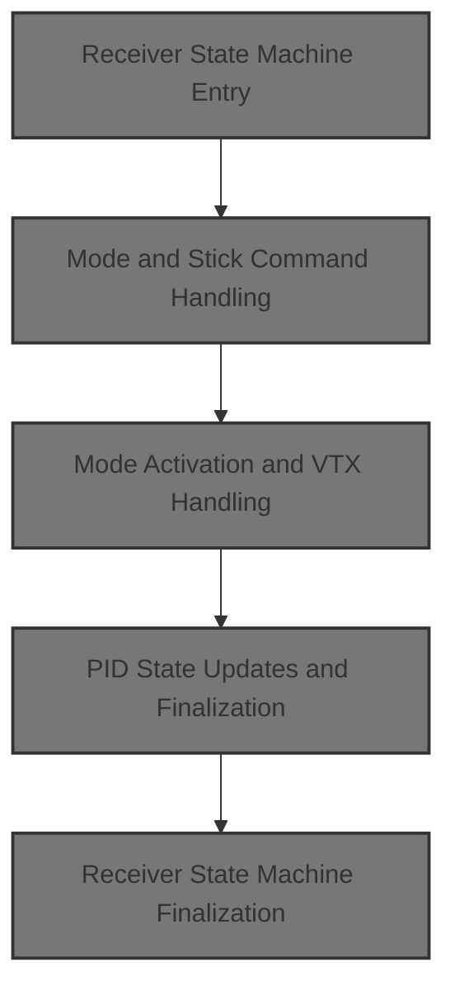
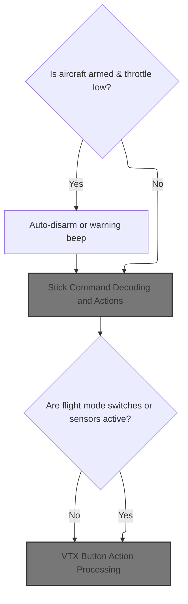
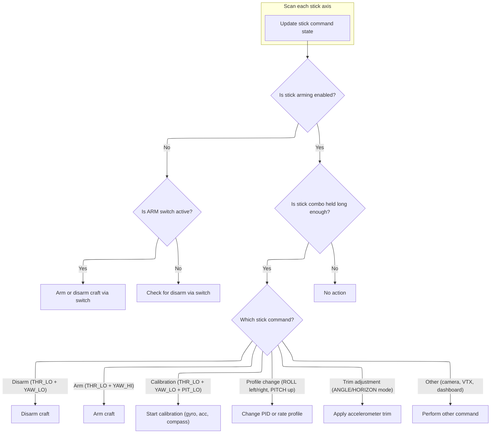
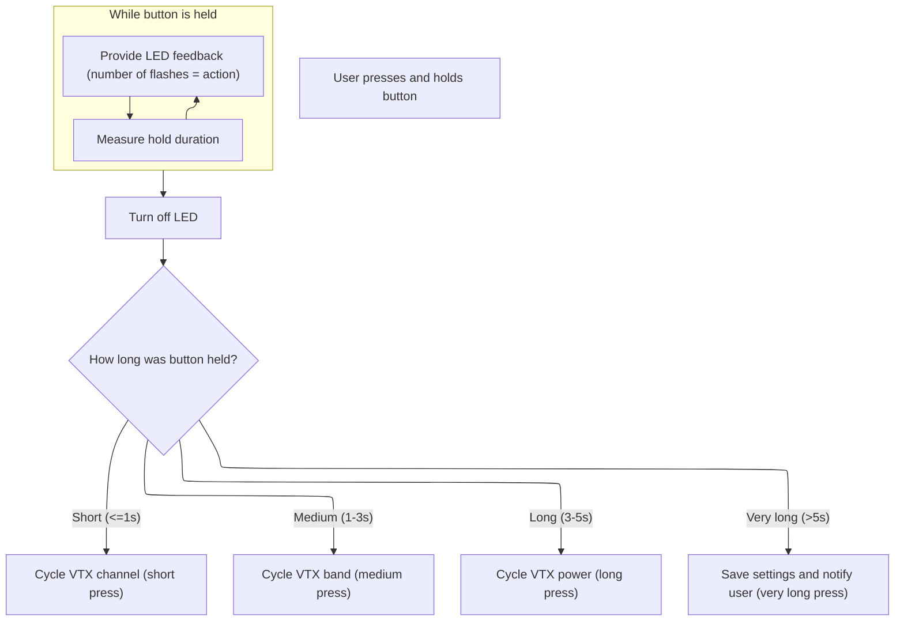
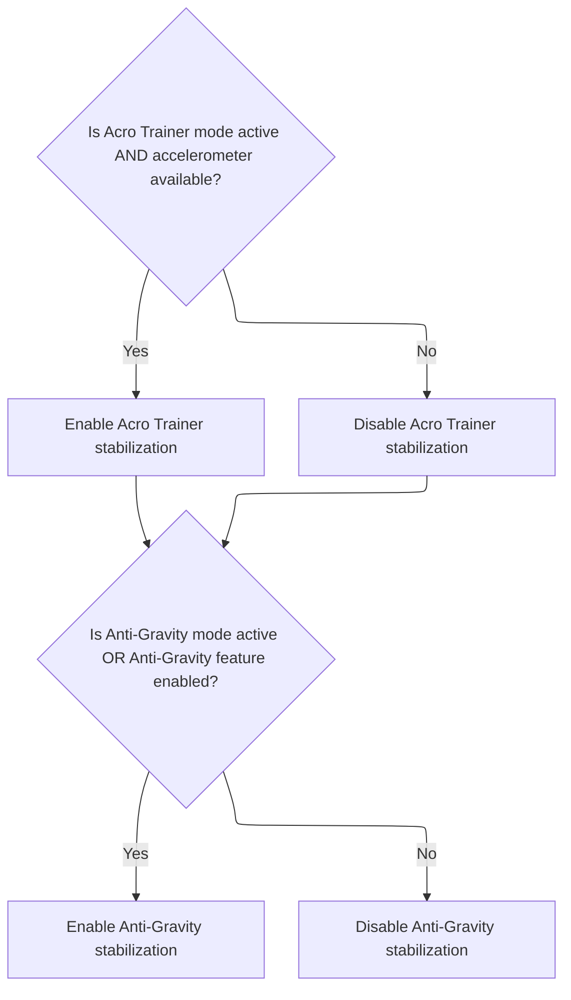

This document outlines how receiver signals and user commands are processed to update the flight controller's state. User actions are interpreted to change arming status, flight modes, PID profiles, and VTX settings, with safety checks ensuring valid operations.



# Receiver State Machine Entry

<SwmSnippet path="/src/main/fc/tasks.c" line="179">

---

In <SwmToken path="src/main/fc/tasks.c" pos="179:4:4" line-data="static void taskUpdateRxMain(timeUs_t currentTimeUs)">`taskUpdateRxMain`</SwmToken>, we start the RX state machine, which splits up receiver input handling, mode changes, and command updates. We call into <SwmPath>[src/…/fc/core.c](src/main/fc/core.c)</SwmPath> next to process mode logic and stick commands before updating RC commands.

```c
static void taskUpdateRxMain(timeUs_t currentTimeUs)
{
    static timeDelta_t rxStateDurationFractionUs[RX_STATE_COUNT];
    timeDelta_t executeTimeUs;
    rxState_e oldRxState = rxState;
    timeDelta_t anticipatedExecutionTime;

    // Where we are using a state machine call schedulerIgnoreTaskExecRate() for all states bar one
    if (rxState != RX_STATE_UPDATE) {
        schedulerIgnoreTaskExecRate();
    }

    switch (rxState) {
    default:
    case RX_STATE_CHECK:
        if (!processRx(currentTimeUs)) {
            rxState = RX_STATE_CHECK;
            break;
        }
        rxState = RX_STATE_MODES;
        break;

    case RX_STATE_MODES:
        processRxModes(currentTimeUs);
        rxState = RX_STATE_UPDATE;
        break;

```

---

</SwmSnippet>

## Mode and Stick Command Handling



<SwmSnippet path="/src/main/fc/core.c" line="921">

---

In <SwmToken path="src/main/fc/core.c" pos="921:2:2" line-data="void processRxModes(timeUs_t currentTimeUs)">`processRxModes`</SwmToken>, we handle <SwmToken path="src/main/fc/core.c" pos="938:13:15" line-data="        &amp;&amp; !FLIGHT_MODE(GPS_RESCUE_MODE)  // disable auto-disarm when GPS Rescue is active">`auto-disarm`</SwmToken> logic and beeper warnings if the craft is armed but throttle is low. After that, we call into <SwmPath>[src/…/fc/rc_controls.c](src/main/fc/rc_controls.c)</SwmPath> to process stick positions and commands, so user input is only handled after safety checks are done. This keeps things safe and predictable.

```c
void processRxModes(timeUs_t currentTimeUs)
{
    static bool armedBeeperOn = false;
#ifdef USE_TELEMETRY
    static bool sharedPortTelemetryEnabled = false;
#endif
    const throttleStatus_e throttleStatus = calculateThrottleStatus();

    // When armed and motors aren't spinning, do beeps and then disarm
    // board after delay so users without buzzer won't lose fingers.
    // mixTable constrains motor commands, so checking  throttleStatus is enough
    const timeUs_t autoDisarmDelayUs = armingConfig()->auto_disarm_delay * 1e6f;
    if (ARMING_FLAG(ARMED)
        && featureIsEnabled(FEATURE_MOTOR_STOP)
        && !isFixedWing()
        && !featureIsEnabled(FEATURE_3D)
        && !isAirmodeEnabled()
        && !FLIGHT_MODE(GPS_RESCUE_MODE)  // disable auto-disarm when GPS Rescue is active
    ) {
        if (isUsingSticksForArming()) {
            if (throttleStatus == THROTTLE_LOW) {
                if ((autoDisarmDelayUs > 0) && (currentTimeUs > disarmAt)) {
                    // auto-disarm configured and delay is over
                    disarm(DISARM_REASON_THROTTLE_TIMEOUT);
                    armedBeeperOn = false;
                } else {
                    // still armed; do warning beeps while armed
                    beeper(BEEPER_ARMED);
                    armedBeeperOn = true;
                }
            } else {
                // throttle is not low - extend disarm time
                disarmAt = currentTimeUs + autoDisarmDelayUs;

                if (armedBeeperOn) {
                    beeperSilence();
                    armedBeeperOn = false;
                }
            }
        } else {
            // arming is via AUX switch; beep while throttle low
            if (throttleStatus == THROTTLE_LOW) {
                beeper(BEEPER_ARMED);
                armedBeeperOn = true;
            } else if (armedBeeperOn) {
                beeperSilence();
                armedBeeperOn = false;
            }
        }
    } else {
        disarmAt = currentTimeUs + autoDisarmDelayUs;  // extend auto-disarm timer
    }

    if (!(IS_RC_MODE_ACTIVE(BOXPARALYZE) && !ARMING_FLAG(ARMED))
#ifdef USE_CMS
        && !cmsInMenu
#endif
        ) {
        processRcStickPositions();
    }

```

---

</SwmSnippet>

### Stick Command Decoding and Actions



<SwmSnippet path="/src/main/fc/rc_controls.c" line="133">

---

In <SwmToken path="src/main/fc/rc_controls.c" pos="133:2:2" line-data="void processRcStickPositions(void)">`processRcStickPositions`</SwmToken>, we encode the current stick positions into a bitmask and use static variables to track how long they're held. This lets us detect stick commands and avoid repeats. We need this before calling <SwmPath>[src/…/fc/core.c](src/main/fc/core.c)</SwmPath> again to handle arming, disarming, and profile changes based on stick input.

```c
void processRcStickPositions(void)
{
    // time the sticks are maintained
    static int16_t rcDelayMs;
    // hold sticks position for command combos
    static uint8_t rcSticks;
    // an extra guard for disarming through switch to prevent that one frame can disarm it
    static uint8_t rcDisarmTicks;
    static bool doNotRepeat;
    static bool pendingApplyRollAndPitchTrimDeltaSave = false;

    // checking sticks positions
    uint8_t stTmp = 0;
    for (int i = 0; i < 4; i++) {
        stTmp >>= 2;
        if (rcData[i] > rxConfig()->mincheck) {
            stTmp |= 0x80;  // check for MIN
        }
        if (rcData[i] < rxConfig()->maxcheck) {
            stTmp |= 0x40;  // check for MAX
        }
    }
```

---

</SwmSnippet>

<SwmSnippet path="/src/main/fc/rc_controls.c" line="155">

---

Here we check if the stick position is held long enough to trigger commands, and handle arming/disarming logic based on stick or switch input. We call <SwmPath>[src/…/fc/core.c](src/main/fc/core.c)</SwmPath> next to actually perform arming/disarming and profile changes, since those actions need to update system state and provide feedback.

```c
    if (stTmp == rcSticks) {
        if (rcDelayMs <= INT16_MAX - (getTaskDeltaTimeUs(TASK_SELF) / 1000)) {
            rcDelayMs += getTaskDeltaTimeUs(TASK_SELF) / 1000;
        }
    } else {
        rcDelayMs = 0;
        doNotRepeat = false;
    }
    rcSticks = stTmp;

    // perform actions
    if (!isUsingSticksToArm) {
        if (IS_RC_MODE_ACTIVE(BOXARM)) {
            rcDisarmTicks = 0;
            // Arming via ARM BOX
            tryArm();
        } else {
            resetTryingToArm();
            // Disarming via ARM BOX
            resetArmingDisabled();
            const bool boxFailsafeSwitchIsOn = IS_RC_MODE_ACTIVE(BOXFAILSAFE);
            if (ARMING_FLAG(ARMED) && (failsafeIsReceivingRxData() || boxFailsafeSwitchIsOn)) {
                // in a true signal loss situation, allow disarm only once we regain validated RxData (failsafeIsReceivingRxData = true),
                // to avoid potentially false disarm signals soon after link recover
                // Note that BOXFAILSAFE will also drive failsafeIsReceivingRxData false (immediately at start or end)
                // That's why we explicitly allow disarm here if BOXFAILSAFE switch is active
                // Note that BOXGPSRESCUE mode does not trigger failsafe - we can always disarm in that mode
                rcDisarmTicks++;
                if (rcDisarmTicks > 3) {
                    // require three duplicate disarm values in a row before we disarm
                    disarm(DISARM_REASON_SWITCH);
                }
            }
        }
    } else if (rcSticks == THR_LO + YAW_LO + PIT_CE + ROL_CE) {
        if (rcDelayMs >= ARM_DELAY_MS && !doNotRepeat) {
            doNotRepeat = true;
            // Disarm on throttle down + yaw
            resetTryingToArm();
            if (ARMING_FLAG(ARMED))
                disarm(DISARM_REASON_STICKS);
            else {
                beeper(BEEPER_DISARM_REPEAT);     // sound tone while stick held
                repeatAfter(STICK_AUTOREPEAT_MS); // disarm tone will repeat

#ifdef USE_RUNAWAY_TAKEOFF
                // Unset the ARMING_DISABLED_RUNAWAY_TAKEOFF arming disabled flag that might have been set
                // by a runaway pidSum detection auto-disarm.
                // This forces the pilot to explicitly perform a disarm sequence (even though we're implicitly disarmed)
                // before they're able to rearm
                unsetArmingDisabled(ARMING_DISABLED_RUNAWAY_TAKEOFF);
#endif
                unsetArmingDisabled(ARMING_DISABLED_CRASH_DETECTED);
            }
        }
        return;
    } else if (rcSticks == THR_LO + YAW_HI + PIT_CE + ROL_CE && !IS_RC_MODE_ACTIVE(BOXSTICKCOMMANDDISABLE)) { // disable stick arming if STICK COMMAND DISABLE SW is active
        if (rcDelayMs >= ARM_DELAY_MS && !doNotRepeat) {
            doNotRepeat = true;
            if (!ARMING_FLAG(ARMED)) {
                // Arm via YAW
                tryArm();
                if (isTryingToArm() ||
                    ((getArmingDisableFlags() == ARMING_DISABLED_CALIBRATING) && armingConfig()->gyro_cal_on_first_arm)) {
                    doNotRepeat = false;
                }
            } else {
                resetArmingDisabled();
            }
        }
        return;
    } else {
```

---

</SwmSnippet>

<SwmSnippet path="/src/main/fc/core.c" line="519">

---

<SwmToken path="src/main/fc/core.c" pos="519:2:2" line-data="void tryArm(void)">`tryArm`</SwmToken> handles arming logic, including gyro calibration if needed, DSHOT protocol specifics (like telemetry and spin direction), launch control, and setting all the right flags and timers. It also gives beeper feedback for arming status or errors. If arming is blocked, it signals the reason with beeps.

```c
void tryArm(void)
{
    if (armingConfig()->gyro_cal_on_first_arm) {
        gyroStartCalibration(true);
    }

    // runs each loop while arming switches are engaged
    updateArmingStatus();

    if (!isArmingDisabled()) {
        if (ARMING_FLAG(ARMED)) {
            return;
        }

        const timeUs_t currentTimeUs = micros();

#ifdef USE_DSHOT
        // Handle timer wraparound by checking if the time difference is reasonable
        timeDelta_t beaconTimeDiff = cmpTimeUs(currentTimeUs, getLastDshotBeaconCommandTimeUs());
        if (beaconTimeDiff < DSHOT_BEACON_GUARD_DELAY_US && beaconTimeDiff >= 0) {
            if (tryingToArm == ARMING_DELAYED_DISARMED) {
                if (IS_RC_MODE_ACTIVE(BOXCRASHFLIP)) {
                    tryingToArm = ARMING_DELAYED_CRASHFLIP;
#ifdef USE_LAUNCH_CONTROL
                } else if (canUseLaunchControl()) {
                    tryingToArm = ARMING_DELAYED_LAUNCH_CONTROL;
#endif
                } else {
                    tryingToArm = ARMING_DELAYED_NORMAL;
                }
            }
            return;
        }

        if (isMotorProtocolDshot()) {
#if defined(USE_ESC_SENSOR) && defined(USE_DSHOT_TELEMETRY)
            // Try to activate extended DSHOT telemetry only if no esc sensor exists and dshot telemetry is active
            if (!featureIsEnabled(FEATURE_ESC_SENSOR) && useDshotTelemetry) {
                dshotCleanTelemetryData();
                if (motorConfig()->dev.useDshotEdt) {
                    dshotCommandWrite(ALL_MOTORS, getMotorCount(), DSHOT_CMD_EXTENDED_TELEMETRY_ENABLE, DSHOT_CMD_TYPE_INLINE);
                }
            }
#endif
            // choose crashflip outcome on arming
            // consider only the switch position
            crashFlipModeActive = IS_RC_MODE_ACTIVE(BOXCRASHFLIP);

            setMotorSpinDirection(crashFlipModeActive ? DSHOT_CMD_SPIN_DIRECTION_REVERSED : DSHOT_CMD_SPIN_DIRECTION_NORMAL);
        }
#endif // USE_DSHOT

#ifdef USE_LAUNCH_CONTROL
        if (!crashFlipModeActive && (canUseLaunchControl() || (tryingToArm == ARMING_DELAYED_LAUNCH_CONTROL))) {
            if (launchControlState == LAUNCH_CONTROL_DISABLED) {  // only activate if it hasn't already been triggered
                launchControlState = LAUNCH_CONTROL_ACTIVE;
            }
        }
#endif

#ifdef USE_OSD
        osdSuppressStats(false);
#endif
#ifdef USE_RPM_LIMIT
        mixerResetRpmLimiter();
#endif
        ENABLE_ARMING_FLAG(ARMED);

#ifdef USE_RC_STATS
        NotifyRcStatsArming();
#endif

        resetTryingToArm();

#ifdef USE_ACRO_TRAINER
        pidAcroTrainerInit();
#endif // USE_ACRO_TRAINER

        if (isModeActivationConditionPresent(BOXPREARM)) {
            ENABLE_ARMING_FLAG(WAS_ARMED_WITH_PREARM);
        }
        imuQuaternionHeadfreeOffsetSet();

#if defined(USE_DYN_NOTCH_FILTER)
        resetMaxFFT();
#endif

        disarmAt = currentTimeUs + armingConfig()->auto_disarm_delay * 1000 * 1000;   // start disarm timeout, will be extended when throttle is nonzero

        lastArmingDisabledReason = 0;

#ifdef USE_GPS
        //beep to indicate arming
        if (featureIsEnabled(FEATURE_GPS)) {
            GPS_reset_home_position();
            canUseGPSHeading = false; // block use of GPS Heading in position hold after each arm, until quad can set IMU to GPS COG
            if (STATE(GPS_FIX) && gpsSol.numSat >= gpsRescueConfig()->minSats) {
                beeper(BEEPER_ARMING_GPS_FIX);
            } else {
                beeper(BEEPER_ARMING_GPS_NO_FIX);
            }
        } else {
            beeper(BEEPER_ARMING);
        }
#else
        beeper(BEEPER_ARMING);
#endif

#ifdef USE_PERSISTENT_STATS
        statsOnArm();
#endif

#ifdef USE_RUNAWAY_TAKEOFF
        runawayTakeoffDeactivateUs = 0;
        runawayTakeoffAccumulatedUs = 0;
        runawayTakeoffTriggerUs = 0;
#endif
    } else {
       resetTryingToArm();
        if (!isFirstArmingGyroCalibrationRunning()) {
            int armingDisabledReason = ffs(getArmingDisableFlags());
            if (lastArmingDisabledReason != armingDisabledReason) {
                lastArmingDisabledReason = armingDisabledReason;

                beeperWarningBeeps(armingDisabledReason);
            }
        }
    }
}
```

---

</SwmSnippet>

<SwmSnippet path="/src/main/fc/rc_controls.c" line="227">

---

We just returned from <SwmPath>[src/…/fc/core.c](src/main/fc/core.c)</SwmPath> after handling arming/disarming. Now, in <SwmPath>[src/…/fc/rc_controls.c](src/main/fc/rc_controls.c)</SwmPath>, we check for stick combos that trigger calibration, profile changes, or config saves. When a PID profile change is detected, we call <SwmPath>[src/…/config/config.c](src/main/config/config.c)</SwmPath> to actually switch and re-init everything tied to the profile.

```c
        resetTryingToArm();
    }

    if (ARMING_FLAG(ARMED) || doNotRepeat || rcDelayMs <= STICK_DELAY_MS || (getArmingDisableFlags() & (ARMING_DISABLED_RUNAWAY_TAKEOFF | ARMING_DISABLED_CRASH_DETECTED))) {
        return;
    }
    doNotRepeat = true;

    #ifdef USE_USB_CDC_HID
    // If this target is used as a joystick, we should leave here.
    if (cdcDeviceIsMayBeActive() || IS_RC_MODE_ACTIVE(BOXSTICKCOMMANDDISABLE)) {
        return;
    }
    #endif

    // actions during not armed

    if (rcSticks == THR_LO + YAW_LO + PIT_LO + ROL_CE) {
        // GYRO calibration
        gyroStartCalibration(false);

#ifdef USE_GPS
        if (featureIsEnabled(FEATURE_GPS)) {
            GPS_reset_home_position();
        }
#endif

#ifdef USE_BARO
        if (sensors(SENSOR_BARO)) {
            baroSetGroundLevel();
        }
#endif

        return;
    }

    if (featureIsEnabled(FEATURE_INFLIGHT_ACC_CAL) && (rcSticks == THR_LO + YAW_LO + PIT_HI + ROL_HI)) {
        // Inflight ACC Calibration
        handleInflightCalibrationStickPosition();
        return;
    }

    // Change PID profile
    switch (rcSticks) {
    case THR_LO + YAW_LO + PIT_CE + ROL_LO:
        // ROLL left -> PID profile 1
        changePidProfile(0);
        return;
    case THR_LO + YAW_LO + PIT_HI + ROL_CE:
        // PITCH up -> PID profile 2
        changePidProfile(1);
        return;
    case THR_LO + YAW_LO + PIT_CE + ROL_HI:
        // ROLL right -> PID profile 3
        changePidProfile(2);
        return;
    }

```

---

</SwmSnippet>

<SwmSnippet path="/src/main/config/config.c" line="780">

---

<SwmToken path="src/main/config/config.c" pos="780:2:2" line-data="void changePidProfile(uint8_t pidProfileIndex)">`changePidProfile`</SwmToken> switches the active PID profile, reinitializes all dependent subsystems, and beeps to confirm the new profile. It also tells the scheduler to ignore any timing hiccup from the config switch.

```c
void changePidProfile(uint8_t pidProfileIndex)
{
    // The config switch will cause a big enough delay in the current task to upset the scheduler
    schedulerIgnoreTaskExecTime();

    if (pidProfileIndex < PID_PROFILE_COUNT) {
        systemConfigMutable()->pidProfileIndex = pidProfileIndex;
        loadPidProfile();

        pidInit(currentPidProfile);
        initEscEndpoints();
        mixerInitProfile();
    }

    beeperConfirmationBeeps(pidProfileIndex + 1);
}
```

---

</SwmSnippet>

<SwmSnippet path="/src/main/fc/rc_controls.c" line="285">

---

We just returned from <SwmPath>[src/…/config/config.c](src/main/config/config.c)</SwmPath> after switching PID profiles. Back in <SwmPath>[src/…/fc/rc_controls.c](src/main/fc/rc_controls.c)</SwmPath>, we handle the rest of the stick commands: saving config, calibrating sensors, adjusting trims, changing rate profiles, and triggering VTX or camera actions. Each stick combo maps to a specific action, and config changes are saved as needed.

```c
    if (rcSticks == THR_LO + YAW_LO + PIT_LO + ROL_HI) {
        saveConfigAndNotify();
    }

#ifdef USE_ACC
    if (rcSticks == THR_HI + YAW_LO + PIT_LO + ROL_CE) {
        // Calibrating Acc
        accStartCalibration();
        return;
    }
#endif

#if defined(USE_MAG)
    if (rcSticks == THR_HI + YAW_HI + PIT_LO + ROL_CE) {
        // Calibrating Mag
        compassStartCalibration();

        return;
    }
#endif

    if (FLIGHT_MODE(ANGLE_MODE | HORIZON_MODE)) {
        // in ANGLE or HORIZON mode, so use sticks to apply accelerometer trims
        rollAndPitchTrims_t accelerometerTrimsDelta;
        memset(&accelerometerTrimsDelta, 0, sizeof(accelerometerTrimsDelta));

        if (pendingApplyRollAndPitchTrimDeltaSave && ((rcSticks & THR_MASK) != THR_HI)) {
            saveConfigAndNotify();
            pendingApplyRollAndPitchTrimDeltaSave = false;
            return;
        }

        bool shouldApplyRollAndPitchTrimDelta = false;
        switch (rcSticks) {
        case THR_HI + YAW_CE + PIT_HI + ROL_CE:
            accelerometerTrimsDelta.values.pitch = 1;
            shouldApplyRollAndPitchTrimDelta = true;
            break;
        case THR_HI + YAW_CE + PIT_LO + ROL_CE:
            accelerometerTrimsDelta.values.pitch = -1;
            shouldApplyRollAndPitchTrimDelta = true;
            break;
        case THR_HI + YAW_CE + PIT_CE + ROL_HI:
            accelerometerTrimsDelta.values.roll = 1;
            shouldApplyRollAndPitchTrimDelta = true;
            break;
        case THR_HI + YAW_CE + PIT_CE + ROL_LO:
            accelerometerTrimsDelta.values.roll = -1;
            shouldApplyRollAndPitchTrimDelta = true;
            break;
        }
        if (shouldApplyRollAndPitchTrimDelta) {
#if defined(USE_ACC)
            applyAccelerometerTrimsDelta(&accelerometerTrimsDelta);
#endif
            pendingApplyRollAndPitchTrimDeltaSave = true;

            beeperConfirmationBeeps(1);

            repeatAfter(STICK_AUTOREPEAT_MS);

            return;
        }
    } else {
        // in ACRO mode, so use sticks to change RATE profile
        switch (rcSticks) {
        case THR_HI + YAW_CE + PIT_HI + ROL_CE:
            changeControlRateProfile(0);
            return;
        case THR_HI + YAW_CE + PIT_LO + ROL_CE:
            changeControlRateProfile(1);
            return;
        case THR_HI + YAW_CE + PIT_CE + ROL_HI:
            changeControlRateProfile(2);
            return;
        case THR_HI + YAW_CE + PIT_CE + ROL_LO:
            changeControlRateProfile(3);
            return;
        }
    }

#ifdef USE_DASHBOARD
    if (rcSticks == THR_LO + YAW_CE + PIT_HI + ROL_LO) {
        dashboardDisablePageCycling();
    }

    if (rcSticks == THR_LO + YAW_CE + PIT_HI + ROL_HI) {
        dashboardEnablePageCycling();
    }
#endif

#ifdef USE_VTX_CONTROL
    if (rcSticks ==  THR_HI + YAW_LO + PIT_CE + ROL_HI) {
        vtxIncrementBand();
    }
    if (rcSticks ==  THR_HI + YAW_LO + PIT_CE + ROL_LO) {
        vtxDecrementBand();
    }
    if (rcSticks ==  THR_HI + YAW_HI + PIT_CE + ROL_HI) {
        vtxIncrementChannel();
    }
    if (rcSticks ==  THR_HI + YAW_HI + PIT_CE + ROL_LO) {
        vtxDecrementChannel();
    }
#endif

#ifdef USE_CAMERA_CONTROL
    if (rcSticks == THR_CE + YAW_HI + PIT_CE + ROL_CE) {
        cameraControlKeyPress(CAMERA_CONTROL_KEY_ENTER, 0);
        repeatAfter(3 * STICK_DELAY_MS);
    } else if (rcSticks == THR_CE + YAW_CE + PIT_CE + ROL_LO) {
        cameraControlKeyPress(CAMERA_CONTROL_KEY_LEFT, 0);
        repeatAfter(3 * STICK_DELAY_MS);
    } else if (rcSticks == THR_CE + YAW_CE + PIT_HI + ROL_CE) {
        cameraControlKeyPress(CAMERA_CONTROL_KEY_UP, 0);
        repeatAfter(3 * STICK_DELAY_MS);
    } else if (rcSticks == THR_CE + YAW_CE + PIT_CE + ROL_HI) {
        cameraControlKeyPress(CAMERA_CONTROL_KEY_RIGHT, 0);
        repeatAfter(3 * STICK_DELAY_MS);
    } else if (rcSticks == THR_CE + YAW_CE + PIT_LO + ROL_CE) {
        cameraControlKeyPress(CAMERA_CONTROL_KEY_DOWN, 0);
        repeatAfter(3 * STICK_DELAY_MS);
    } else if (rcSticks == THR_LO + YAW_CE + PIT_HI + ROL_CE) {
        cameraControlKeyPress(CAMERA_CONTROL_KEY_UP, 2000);
    }
#endif
}
```

---

</SwmSnippet>

### Mode Activation and VTX Handling

```mermaid
%%{init: {"flowchart": {"defaultRenderer": "elk"}} }%%
flowchart TD
    node1["Update inflight calibration if enabled"]
    click node1 openCode "src/main/fc/core.c:982:984"
    node1 --> node2["Update activated flight modes"]
    click node2 openCode "src/main/fc/core.c:986:986"
    node2 --> node3{"Is crash flip mode active?"}
    click node3 openCode "src/main/fc/core.c:989:996"
    node3 -->|"Yes"| node4["Alert pilot with beeper"]
    click node4 openCode "src/main/fc/core.c:991:991"
    node4 --> node5{"Is crash flip switch off while armed?"}
    click node5 openCode "src/main/fc/core.c:992:995"
    node5 -->|"Yes"| node6["Disarm aircraft"]
    click node6 openCode "src/main/fc/core.c:994:994"
    node5 -->|"No"| node7
    node3 -->|"No"| node7
    node7 --> node8{"Should process RC adjustments?"}
    click node8 openCode "src/main/fc/core.c:999:1001"
    node8 -->|"Yes"| node9["Process RC adjustments"]
    click node9 openCode "src/main/fc/core.c:1000:1000"
    node8 -->|"No"| node10
    node9 --> node10
    node10 --> node11{"Update flight modes and LED/task scheduling based on switches, sensors, arming, failsafe"}
    click node11 openCode "src/main/fc/core.c:1003:1099"
    node11 --> node12{"Is telemetry feature enabled?"}
    click node12 openCode "src/main/fc/core.c:1143:1157"
    node12 -->|"Yes"| node13["Update telemetry port allocation"]
    click node13 openCode "src/main/fc/core.c:1144:1156"
    node12 -->|"No"| node14
    node13 --> node14
    node14 --> node15{"Should VTX channel/control be updated?"}
    click node15 openCode "src/main/fc/core.c:1161:1165"
    node15 -->|"Yes"| node16["Update VTX channel/control"]
    click node16 openCode "src/main/fc/core.c:1161:1165"
    node15 -->|"No"| node17["Finish"]
    node16 --> node17
classDef HeadingStyle fill:#777777,stroke:#333,stroke-width:2px;

%% Swimm:
%% %%{init: {"flowchart": {"defaultRenderer": "elk"}} }%%
%% flowchart TD
%%     node1["Update inflight calibration if enabled"]
%%     click node1 openCode "<SwmPath>[src/…/fc/core.c](src/main/fc/core.c)</SwmPath>:982:984"
%%     node1 --> node2["Update activated flight modes"]
%%     click node2 openCode "<SwmPath>[src/…/fc/core.c](src/main/fc/core.c)</SwmPath>:986:986"
%%     node2 --> node3{"Is crash flip mode active?"}
%%     click node3 openCode "<SwmPath>[src/…/fc/core.c](src/main/fc/core.c)</SwmPath>:989:996"
%%     node3 -->|"Yes"| node4["Alert pilot with beeper"]
%%     click node4 openCode "<SwmPath>[src/…/fc/core.c](src/main/fc/core.c)</SwmPath>:991:991"
%%     node4 --> node5{"Is crash flip switch off while armed?"}
%%     click node5 openCode "<SwmPath>[src/…/fc/core.c](src/main/fc/core.c)</SwmPath>:992:995"
%%     node5 -->|"Yes"| node6["Disarm aircraft"]
%%     click node6 openCode "<SwmPath>[src/…/fc/core.c](src/main/fc/core.c)</SwmPath>:994:994"
%%     node5 -->|"No"| node7
%%     node3 -->|"No"| node7
%%     node7 --> node8{"Should process RC adjustments?"}
%%     click node8 openCode "<SwmPath>[src/…/fc/core.c](src/main/fc/core.c)</SwmPath>:999:1001"
%%     node8 -->|"Yes"| node9["Process RC adjustments"]
%%     click node9 openCode "<SwmPath>[src/…/fc/core.c](src/main/fc/core.c)</SwmPath>:1000:1000"
%%     node8 -->|"No"| node10
%%     node9 --> node10
%%     node10 --> node11{"Update flight modes and LED/task scheduling based on switches, sensors, arming, failsafe"}
%%     click node11 openCode "<SwmPath>[src/…/fc/core.c](src/main/fc/core.c)</SwmPath>:1003:1099"
%%     node11 --> node12{"Is telemetry feature enabled?"}
%%     click node12 openCode "<SwmPath>[src/…/fc/core.c](src/main/fc/core.c)</SwmPath>:1143:1157"
%%     node12 -->|"Yes"| node13["Update telemetry port allocation"]
%%     click node13 openCode "<SwmPath>[src/…/fc/core.c](src/main/fc/core.c)</SwmPath>:1144:1156"
%%     node12 -->|"No"| node14
%%     node13 --> node14
%%     node14 --> node15{"Should VTX channel/control be updated?"}
%%     click node15 openCode "<SwmPath>[src/…/fc/core.c](src/main/fc/core.c)</SwmPath>:1161:1165"
%%     node15 -->|"Yes"| node16["Update VTX channel/control"]
%%     click node16 openCode "<SwmPath>[src/…/fc/core.c](src/main/fc/core.c)</SwmPath>:1161:1165"
%%     node15 -->|"No"| node17["Finish"]
%%     node16 --> node17
%% classDef HeadingStyle fill:#777777,stroke:#333,stroke-width:2px;
```



<SwmSnippet path="/src/main/fc/core.c" line="982">

---

We just returned from <SwmPath>[src/…/fc/rc_controls.c](src/main/fc/rc_controls.c)</SwmPath> after stick command handling. Now, in <SwmPath>[src/…/fc/core.c](src/main/fc/core.c)</SwmPath>, we update flight modes based on RC input and sensor state, manage telemetry ports, and handle VTX channel/button logic. We call <SwmPath>[src/…/io/vtx_control.c](src/main/io/vtx_control.c)</SwmPath> next to process any VTX button actions, since those depend on the latest mode state.

```c
    if (featureIsEnabled(FEATURE_INFLIGHT_ACC_CAL)) {
        updateInflightCalibrationState();
    }

    updateActivatedModes();

#ifdef USE_DSHOT
    if (crashFlipModeActive) {
        // Enable beep warning when the crashflip mode is active
        beeper(BEEPER_CRASHFLIP_MODE);
        if (!IS_RC_MODE_ACTIVE(BOXCRASHFLIP)) {
            // permit the option of staying disarmed if the crashflip switch is set to off while armed
            disarm(DISARM_REASON_SWITCH);
        }
    }
#endif

    if (!cliMode && !(IS_RC_MODE_ACTIVE(BOXPARALYZE) && !ARMING_FLAG(ARMED))) {
        processRcAdjustments(currentControlRateProfile);
    }

    bool canUseHorizonMode = true;
    if ((IS_RC_MODE_ACTIVE(BOXANGLE)
        || failsafeIsActive()
#ifdef USE_ALTITUDE_HOLD
        || FLIGHT_MODE(ALT_HOLD_MODE)
#endif
#ifdef USE_POSITION_HOLD
        || FLIGHT_MODE(POS_HOLD_MODE)
#endif
        ) && (sensors(SENSOR_ACC))) {
        // bumpless transfer to Level mode
        canUseHorizonMode = false;

        if (!FLIGHT_MODE(ANGLE_MODE)) {
            ENABLE_FLIGHT_MODE(ANGLE_MODE);
        }
    } else {
        DISABLE_FLIGHT_MODE(ANGLE_MODE); // failsafe support
    }

#ifdef USE_ALTITUDE_HOLD
    // only if armed; can coexist with position hold
    if (ARMING_FLAG(ARMED)
        // and not in GPS_RESCUE_MODE, to give it priority over Altitude Hold
        && !FLIGHT_MODE(GPS_RESCUE_MODE)
        // and either the alt_hold switch is activated, or are in failsafe landing mode
        && (IS_RC_MODE_ACTIVE(BOXALTHOLD) || failsafeIsActive())
        // and we have Acc for self-levelling
        && sensors(SENSOR_ACC)
        // and we have altitude data
        && isAltitudeAvailable()
        // but not until throttle is raised
        && wasThrottleRaised()) {
        if (!FLIGHT_MODE(ALT_HOLD_MODE)) {
            ENABLE_FLIGHT_MODE(ALT_HOLD_MODE);
        }
    } else {
        DISABLE_FLIGHT_MODE(ALT_HOLD_MODE);
    }
#endif

#ifdef USE_POSITION_HOLD
    // only if armed; can coexist with altitude hold
    if (ARMING_FLAG(ARMED)
        // and not in GPS_RESCUE_MODE, to give it priority over Position Hold
        && !FLIGHT_MODE(GPS_RESCUE_MODE)
        // and either the alt_hold switch is activated, or are in failsafe landing mode
        && (IS_RC_MODE_ACTIVE(BOXPOSHOLD) || failsafeIsActive())
        // and we have Acc for self-levelling
        && sensors(SENSOR_ACC)
        // but not until throttle is raised
        && wasThrottleRaised()) {
        if (!FLIGHT_MODE(POS_HOLD_MODE)) {
            ENABLE_FLIGHT_MODE(POS_HOLD_MODE);
        }
    } else {
        DISABLE_FLIGHT_MODE(POS_HOLD_MODE);
    }
#endif

    if (IS_RC_MODE_ACTIVE(BOXHORIZON) && canUseHorizonMode && sensors(SENSOR_ACC)) {
        DISABLE_FLIGHT_MODE(ANGLE_MODE);
        if (!FLIGHT_MODE(HORIZON_MODE)) {
            ENABLE_FLIGHT_MODE(HORIZON_MODE);
        }
    } else {
        DISABLE_FLIGHT_MODE(HORIZON_MODE);
    }

#ifdef USE_GPS_RESCUE
    if (ARMING_FLAG(ARMED) && (IS_RC_MODE_ACTIVE(BOXGPSRESCUE) || (failsafeIsActive() && failsafeConfig()->failsafe_procedure == FAILSAFE_PROCEDURE_GPS_RESCUE))) {
        if (!FLIGHT_MODE(GPS_RESCUE_MODE)) {
            ENABLE_FLIGHT_MODE(GPS_RESCUE_MODE);
        }
    } else {
        DISABLE_FLIGHT_MODE(GPS_RESCUE_MODE);
    }
#endif

#ifdef USE_CHIRP
    if (IS_RC_MODE_ACTIVE(BOXCHIRP) && !FLIGHT_MODE(FAILSAFE_MODE) && !FLIGHT_MODE(GPS_RESCUE_MODE)) {
        if (!FLIGHT_MODE(CHIRP_MODE)) {
            ENABLE_FLIGHT_MODE(CHIRP_MODE);
        }
    } else {
        DISABLE_FLIGHT_MODE(CHIRP_MODE);
    }
#endif

    if (FLIGHT_MODE(ANGLE_MODE | ALT_HOLD_MODE | POS_HOLD_MODE | HORIZON_MODE)) {
        LED1_ON;
        // increase frequency of attitude task to reduce drift when in angle or horizon mode
        rescheduleTask(TASK_ATTITUDE, TASK_PERIOD_HZ(acc.sampleRateHz / (float)imuConfig()->imu_process_denom));
    } else {
        LED1_OFF;
        rescheduleTask(TASK_ATTITUDE, TASK_PERIOD_HZ(100));
    }

    if (!IS_RC_MODE_ACTIVE(BOXPREARM) && ARMING_FLAG(WAS_ARMED_WITH_PREARM)) {
        DISABLE_ARMING_FLAG(WAS_ARMED_WITH_PREARM);
    }

#if defined(USE_ACC) || defined(USE_MAG)
    if (sensors(SENSOR_ACC) || sensors(SENSOR_MAG)) {
#if defined(USE_GPS) || defined(USE_MAG)
        if (IS_RC_MODE_ACTIVE(BOXMAG)) {
            if (!FLIGHT_MODE(MAG_MODE)) {
                ENABLE_FLIGHT_MODE(MAG_MODE);
                magHold = DECIDEGREES_TO_DEGREES(attitude.values.yaw);
            }
        } else {
            DISABLE_FLIGHT_MODE(MAG_MODE);
        }
#endif
        if (IS_RC_MODE_ACTIVE(BOXHEADFREE) && !FLIGHT_MODE(GPS_RESCUE_MODE)) {
            if (!FLIGHT_MODE(HEADFREE_MODE)) {
                ENABLE_FLIGHT_MODE(HEADFREE_MODE);
            }
        } else {
            DISABLE_FLIGHT_MODE(HEADFREE_MODE);
        }
        if (IS_RC_MODE_ACTIVE(BOXHEADADJ) && !FLIGHT_MODE(GPS_RESCUE_MODE)) {
            if (imuQuaternionHeadfreeOffsetSet()) {
               beeper(BEEPER_RX_SET);
            }
        }
    }
#endif

    if (IS_RC_MODE_ACTIVE(BOXPASSTHRU)) {
        ENABLE_FLIGHT_MODE(PASSTHRU_MODE);
    } else {
        DISABLE_FLIGHT_MODE(PASSTHRU_MODE);
    }

    if (mixerConfig()->mixerMode == MIXER_FLYING_WING || mixerConfig()->mixerMode == MIXER_AIRPLANE) {
        DISABLE_FLIGHT_MODE(HEADFREE_MODE);
    }

#ifdef USE_TELEMETRY
    if (featureIsEnabled(FEATURE_TELEMETRY)) {
        bool enableSharedPortTelemetry = (!isModeActivationConditionPresent(BOXTELEMETRY) && ARMING_FLAG(ARMED)) || (isModeActivationConditionPresent(BOXTELEMETRY) && IS_RC_MODE_ACTIVE(BOXTELEMETRY));
        if (enableSharedPortTelemetry && !sharedPortTelemetryEnabled) {
            mspSerialReleaseSharedTelemetryPorts();
            telemetryCheckState();

            sharedPortTelemetryEnabled = true;
        } else if (!enableSharedPortTelemetry && sharedPortTelemetryEnabled) {
            // the telemetry state must be checked immediately so that shared serial ports are released.
            telemetryCheckState();
            mspSerialAllocatePorts();

            sharedPortTelemetryEnabled = false;
        }
    }
#endif

#ifdef USE_VTX_CONTROL
    vtxUpdateActivatedChannel();

    if (canUpdateVTX()) {
        handleVTXControlButton();
    }
#endif

#ifdef USE_ACRO_TRAINER
```

---

</SwmSnippet>

### VTX Button Action Processing



<SwmSnippet path="/src/main/io/vtx_control.c" line="206">

---

In <SwmToken path="src/main/io/vtx_control.c" pos="206:2:2" line-data="void handleVTXControlButton(void)">`handleVTXControlButton`</SwmToken>, we measure how long the button is held, map that to an action (<SwmPath>[src/main/config/](src/main/config/)</SwmPath>), and flash the LED to show which action will trigger. When the button is released, we run the mapped VTX action. This gives clear feedback and avoids accidental changes.

```c
void handleVTXControlButton(void)
{
#if defined(USE_VTX_RTC6705) && defined(BUTTON_A_PIN)
    bool buttonWasPressed = false;
    const timeMs_t start = millis();
    timeMs_t ledToggleAt = start;
    bool ledEnabled = false;
    uint8_t flashesDone = 0;

    uint8_t actionCounter = 0;
    bool buttonHeld;
    while ((buttonHeld = buttonAPressed())) {
        const timeMs_t end = millis();

        int32_t diff = cmp32(end, start);
        if (diff > 25 && diff <= 1000) {
            actionCounter = 4;
        } else if (diff > 1000 && diff <= 3000) {
            actionCounter = 3;
        } else if (diff > 3000 && diff <= 5000) {
            actionCounter = 2;
        } else if (diff > 5000) {
            actionCounter = 1;
        }

        if (actionCounter) {

            diff = cmp32(ledToggleAt, end);

            if (diff < 0) {
                ledEnabled = !ledEnabled;

                const uint8_t updateDuration = 60;

                ledToggleAt = end + updateDuration;

                if (ledEnabled) {
                    LED1_ON;
                } else {
                    LED1_OFF;
                    flashesDone++;
                }

                if (flashesDone == actionCounter) {
                    ledToggleAt += (1000 - ((flashesDone * updateDuration) * 2));
                    flashesDone = 0;
                }
            }
            buttonWasPressed = true;
        }
    }
```

---

</SwmSnippet>

<SwmSnippet path="/src/main/io/vtx_control.c" line="262">

---

After the button is released, we turn off the LED and run the mapped VTX action: <SwmToken path="src/main/config/config.c" pos="490:14:16" line-data="            vtxSettingsConfigMutable()-&gt;freq = 0; // band/channel determined frequency can&#39;t be valid anymore">`band/channel`</SwmToken> change, power change, or config save, depending on how long the button was held. This gives clear, duration-based control for VTX settings.

```c
    LED1_OFF;

    switch (actionCounter) {
    case 4:
        vtxCycleBandOrChannel(0, +1);
        break;
    case 3:
        vtxCycleBandOrChannel(+1, 0);
        break;
    case 2:
        vtxCyclePower(+1);
        break;
    case 1:
        saveConfigAndNotify();
        break;
    }
#endif
}
```

---

</SwmSnippet>

### PID State Updates and Finalization



<SwmSnippet path="/src/main/fc/core.c" line="1169">

---

We just returned from <SwmPath>[src/…/io/vtx_control.c](src/main/io/vtx_control.c)</SwmPath>. Back in <SwmPath>[src/…/fc/core.c](src/main/fc/core.c)</SwmPath>, we update the acro trainer and anti-gravity PID states based on the latest RC mode activations and features. This keeps the PID system in sync with the current flight mode.

```c
    pidSetAcroTrainerState(IS_RC_MODE_ACTIVE(BOXACROTRAINER) && sensors(SENSOR_ACC));
#endif // USE_ACRO_TRAINER

    pidSetAntiGravityState(IS_RC_MODE_ACTIVE(BOXANTIGRAVITY) || featureIsEnabled(FEATURE_ANTI_GRAVITY));
}
```

---

</SwmSnippet>

## Receiver State Machine Finalization

```mermaid
%%{init: {"flowchart": {"defaultRenderer": "elk"}} }%%
flowchart TD
    node1["Update receiver commands and arming status"]
    click node1 openCode "src/main/fc/tasks.c:208:209"
    node1 --> node2{"Is flight controller armed?"}
    click node2 openCode "src/main/fc/tasks.c:212:213"
    node2 -->|"Not armed"| node3["Send RC data to HID"]
    click node3 openCode "src/main/fc/tasks.c:213:214"
    node2 -->|"Armed"| node4["Continue"]
    node3 --> node4
    node4 --> node5["Update receiver state"]
    click node5 openCode "src/main/fc/tasks.c:216:217"
    node5 --> node6{"Ignore task execution time?"}
    click node6 openCode "src/main/fc/tasks.c:220:221"
    node6 -->|"No"| node7["Calculate and update timing"]
    click node7 openCode "src/main/fc/tasks.c:221:234"
    node6 -->|"Yes"| node12["Schedule next receiver state update"]
    node7 --> node8{"Has anticipated execution time changed?"}
    click node8 openCode "src/main/fc/tasks.c:225:227"
    node8 -->|"Yes"| node9["Adjust anticipated execution time"]
    click node9 openCode "src/main/fc/tasks.c:226:227"
    node8 -->|"No"| node10{"Did task take longer than expected?"}
    click node10 openCode "src/main/fc/tasks.c:229:231"
    node10 -->|"Yes"| node11["Update max time"]
    click node11 openCode "src/main/fc/tasks.c:230:231"
    node10 -->|"No"| node13["Decay max time"]
    click node13 openCode "src/main/fc/tasks.c:233:234"
    node9 --> node14{"Debug mode enabled for RX state timing?"}
    node11 --> node14
    node13 --> node14
    node14 -->|"Yes"| node15["Update debug output"]
    click node15 openCode "src/main/fc/tasks.c:238:239"
    node14 -->|"No"| node12["Schedule next receiver state update"]
    node15 --> node12["Schedule next receiver state update"]
    click node12 openCode "src/main/fc/tasks.c:241:241"

classDef HeadingStyle fill:#777777,stroke:#333,stroke-width:2px;

%% Swimm:
%% %%{init: {"flowchart": {"defaultRenderer": "elk"}} }%%
%% flowchart TD
%%     node1["Update receiver commands and arming status"]
%%     click node1 openCode "<SwmPath>[src/…/fc/tasks.c](src/main/fc/tasks.c)</SwmPath>:208:209"
%%     node1 --> node2{"Is flight controller armed?"}
%%     click node2 openCode "<SwmPath>[src/…/fc/tasks.c](src/main/fc/tasks.c)</SwmPath>:212:213"
%%     node2 -->|"Not armed"| node3["Send RC data to HID"]
%%     click node3 openCode "<SwmPath>[src/…/fc/tasks.c](src/main/fc/tasks.c)</SwmPath>:213:214"
%%     node2 -->|"Armed"| node4["Continue"]
%%     node3 --> node4
%%     node4 --> node5["Update receiver state"]
%%     click node5 openCode "<SwmPath>[src/…/fc/tasks.c](src/main/fc/tasks.c)</SwmPath>:216:217"
%%     node5 --> node6{"Ignore task execution time?"}
%%     click node6 openCode "<SwmPath>[src/…/fc/tasks.c](src/main/fc/tasks.c)</SwmPath>:220:221"
%%     node6 -->|"No"| node7["Calculate and update timing"]
%%     click node7 openCode "<SwmPath>[src/…/fc/tasks.c](src/main/fc/tasks.c)</SwmPath>:221:234"
%%     node6 -->|"Yes"| node12["Schedule next receiver state update"]
%%     node7 --> node8{"Has anticipated execution time changed?"}
%%     click node8 openCode "<SwmPath>[src/…/fc/tasks.c](src/main/fc/tasks.c)</SwmPath>:225:227"
%%     node8 -->|"Yes"| node9["Adjust anticipated execution time"]
%%     click node9 openCode "<SwmPath>[src/…/fc/tasks.c](src/main/fc/tasks.c)</SwmPath>:226:227"
%%     node8 -->|"No"| node10{"Did task take longer than expected?"}
%%     click node10 openCode "<SwmPath>[src/…/fc/tasks.c](src/main/fc/tasks.c)</SwmPath>:229:231"
%%     node10 -->|"Yes"| node11["Update max time"]
%%     click node11 openCode "<SwmPath>[src/…/fc/tasks.c](src/main/fc/tasks.c)</SwmPath>:230:231"
%%     node10 -->|"No"| node13["Decay max time"]
%%     click node13 openCode "<SwmPath>[src/…/fc/tasks.c](src/main/fc/tasks.c)</SwmPath>:233:234"
%%     node9 --> node14{"Debug mode enabled for RX state timing?"}
%%     node11 --> node14
%%     node13 --> node14
%%     node14 -->|"Yes"| node15["Update debug output"]
%%     click node15 openCode "<SwmPath>[src/…/fc/tasks.c](src/main/fc/tasks.c)</SwmPath>:238:239"
%%     node14 -->|"No"| node12["Schedule next receiver state update"]
%%     node15 --> node12["Schedule next receiver state update"]
%%     click node12 openCode "<SwmPath>[src/…/fc/tasks.c](src/main/fc/tasks.c)</SwmPath>:241:241"
%% 
%% classDef HeadingStyle fill:#777777,stroke:#333,stroke-width:2px;
```



<SwmSnippet path="/src/main/fc/tasks.c" line="206">

---

We just returned from <SwmPath>[src/…/fc/core.c](src/main/fc/core.c)</SwmPath>. Back in <SwmToken path="src/main/fc/tasks.c" pos="179:4:4" line-data="static void taskUpdateRxMain(timeUs_t currentTimeUs)">`taskUpdateRxMain`</SwmToken>, we finish the RX state machine cycle: update RC commands, arming, and (if not armed) send RC data over USB HID. We also track and decay execution time for each state to help the scheduler adapt to timing changes.

```c
    case RX_STATE_UPDATE:
        // updateRcCommands sets rcCommand, which is needed by updateAltHold and updateSonarAltHoldState
        updateRcCommands();
        updateArmingStatus();

#ifdef USE_USB_CDC_HID
        if (!ARMING_FLAG(ARMED)) {
            sendRcDataToHid();
        }
#endif
        rxState = RX_STATE_CHECK;
        break;
    }

    if (!schedulerGetIgnoreTaskExecTime()) {
        executeTimeUs = micros() - currentTimeUs + RX_TASK_MARGIN;

        // If the scheduler has reduced the anticipatedExecutionTime due to task aging, pick that up
        anticipatedExecutionTime = schedulerGetNextStateTime();
        if (anticipatedExecutionTime != (rxStateDurationFractionUs[oldRxState] >> RX_TASK_DECAY_SHIFT)) {
            rxStateDurationFractionUs[oldRxState] = anticipatedExecutionTime << RX_TASK_DECAY_SHIFT;
        }

        if (executeTimeUs > (rxStateDurationFractionUs[oldRxState] >> RX_TASK_DECAY_SHIFT)) {
            rxStateDurationFractionUs[oldRxState] = executeTimeUs << RX_TASK_DECAY_SHIFT;
        } else {
            // Slowly decay the max time
            rxStateDurationFractionUs[oldRxState]--;
        }
    }

    if (debugMode == DEBUG_RX_STATE_TIME) {
        debug[oldRxState] = rxStateDurationFractionUs[oldRxState] >> RX_TASK_DECAY_SHIFT;
    }

    schedulerSetNextStateTime(rxStateDurationFractionUs[rxState] >> RX_TASK_DECAY_SHIFT);
}
```

---

</SwmSnippet>

&nbsp;

*This is an auto-generated document by Swimm 🌊 and has not yet been verified by a human*

<SwmMeta version="3.0.0" repo-id="Z2l0aHViJTNBJTNBYy1iZXRhZmxpZ2h0JTNBJTNBcmljYXJkb2xvcGV6Zw==" repo-name="c-betaflight"><sup>Powered by [Swimm](https://app.swimm.io/)</sup></SwmMeta>
