```mermaid
%%{init: {"flowchart": {"defaultRenderer": "elk"}} }%%
flowchart TD
    node1["Check if command is valid and DSHOT protocol is enabled"]
    click node1 openCode "src/main/cli/cli.c:3894:3898"
    node1 -->|"Valid"| node4["Process each command argument"]
    click node4 openCode "src/main/cli/cli.c:3905:3956"
    node1 -->|"Invalid"| node3["Show error to user"]
    click node3 openCode "src/main/cli/cli.c:3895:3897"
    subgraph loop1["For each command argument"]
      node4 --> node2{"Is command value valid?"}
      click node2 openCode "src/main/cli/cli.c:3917:3948"
      node2 -->|"Yes"| node5{"Is command ESC info request?"}
      click node5 openCode "src/main/cli/cli.c:3925:3939"
      node5 -->|"Yes"| node6["Retrieving and Displaying ESC Information"]
      
      node5 -->|"No"| node7["Send standard DSHOT command to motor"]
      click node7 openCode "src/main/cli/cli.c:3926:3927"
      node2 -->|"No"| node8["Show invalid command error"]
      click node8 openCode "src/main/cli/cli.c:3947:3948"
    end
    node4 --> node9["Re-enable motors"]
    click node9 openCode "src/main/cli/cli.c:3958:3959"
classDef HeadingStyle fill:#777777,stroke:#333,stroke-width:2px;
click node6 goToHeading "Retrieving and Displaying ESC Information"
node6:::HeadingStyle

%% Swimm:
%% %%{init: {"flowchart": {"defaultRenderer": "elk"}} }%%
%% flowchart TD
%%     node1["Check if command is valid and DSHOT protocol is enabled"]
%%     click node1 openCode "<SwmPath>[src/…/cli/cli.c](src/main/cli/cli.c)</SwmPath>:3894:3898"
%%     node1 -->|"Valid"| node4["Process each command argument"]
%%     click node4 openCode "<SwmPath>[src/…/cli/cli.c](src/main/cli/cli.c)</SwmPath>:3905:3956"
%%     node1 -->|"Invalid"| node3["Show error to user"]
%%     click node3 openCode "<SwmPath>[src/…/cli/cli.c](src/main/cli/cli.c)</SwmPath>:3895:3897"
%%     subgraph loop1["For each command argument"]
%%       node4 --> node2{"Is command value valid?"}
%%       click node2 openCode "<SwmPath>[src/…/cli/cli.c](src/main/cli/cli.c)</SwmPath>:3917:3948"
%%       node2 -->|"Yes"| node5{"Is command ESC info request?"}
%%       click node5 openCode "<SwmPath>[src/…/cli/cli.c](src/main/cli/cli.c)</SwmPath>:3925:3939"
%%       node5 -->|"Yes"| node6["Retrieving and Displaying ESC Information"]
%%       
%%       node5 -->|"No"| node7["Send standard DSHOT command to motor"]
%%       click node7 openCode "<SwmPath>[src/…/cli/cli.c](src/main/cli/cli.c)</SwmPath>:3926:3927"
%%       node2 -->|"No"| node8["Show invalid command error"]
%%       click node8 openCode "<SwmPath>[src/…/cli/cli.c](src/main/cli/cli.c)</SwmPath>:3947:3948"
%%     end
%%     node4 --> node9["Re-enable motors"]
%%     click node9 openCode "<SwmPath>[src/…/cli/cli.c](src/main/cli/cli.c)</SwmPath>:3958:3959"
%% classDef HeadingStyle fill:#777777,stroke:#333,stroke-width:2px;
%% click node6 goToHeading "Retrieving and Displaying ESC Information"
%% node6:::HeadingStyle
```

This document describes how users interact with electronic speed controllers (ESCs) using <SwmToken path="src/main/cli/cli.c" pos="6589:11:11" line-data="    CLI_COMMAND_DEF(&quot;dshotprog&quot;, &quot;program DShot ESC(s)&quot;, &quot;&lt;index&gt; &lt;command&gt;+&quot;, cliDshotProg),">`DShot`</SwmToken> programming commands through the CLI. Users can send commands to control ESCs or request detailed ESC information, and the system processes these commands, displays results, and ensures safe motor operation.

# Parsing and Dispatching <SwmToken path="src/main/cli/cli.c" pos="6589:11:11" line-data="    CLI_COMMAND_DEF(&quot;dshotprog&quot;, &quot;program DShot ESC(s)&quot;, &quot;&lt;index&gt; &lt;command&gt;+&quot;, cliDshotProg),">`DShot`</SwmToken> Commands



<SwmSnippet path="/src/main/cli/cli.c" line="3892">

---

In <SwmToken path="src/main/cli/cli.c" pos="3892:4:4" line-data="static void cliDshotProg(const char *cmdName, char *cmdline)">`cliDshotProg`</SwmToken>, we parse the input, disable motors for safety, and process each command. For ESC info requests, we delegate to <SwmToken path="src/main/cli/cli.c" pos="3931:1:1" line-data="                                executeEscInfoCommand(cmdName, escIndex);">`executeEscInfoCommand`</SwmToken> to handle info retrieval.

```c
static void cliDshotProg(const char *cmdName, char *cmdline)
{
    if (isEmpty(cmdline) || !isMotorProtocolDshot()) {
        cliShowParseError(cmdName);

        return;
    }

    char *saveptr;
    char *pch = strtok_r(cmdline, " ", &saveptr);
    int pos = 0;
    int escIndex = 0;
    bool firstCommand = true;
    while (pch != NULL) {
        switch (pos) {
        case 0:
            escIndex = parseOutputIndex(cmdName, pch, true);
            if (escIndex == -1) {
                return;
            }

            break;
        default:
            {
                int command = atoi(pch);
                if (command >= 0 && command < DSHOT_MIN_THROTTLE) {
                    if (firstCommand) {
                        // pwmDisableMotors();
                        motorDisable();

                        firstCommand = false;
                    }

                    if (command != DSHOT_CMD_ESC_INFO) {
                        dshotCommandWrite(escIndex, getMotorCount(), command, DSHOT_CMD_TYPE_BLOCKING);
                    } else {
#if defined(USE_ESC_SENSOR) && defined(USE_ESC_SENSOR_INFO)
                        if (featureIsEnabled(FEATURE_ESC_SENSOR)) {
                            if (escIndex != ALL_MOTORS) {
                                executeEscInfoCommand(cmdName, escIndex);
                            } else {
                                for (uint8_t i = 0; i < getMotorCount(); i++) {
                                    executeEscInfoCommand(cmdName, i);
                                }
                            }
                        } else
#endif
                        {
```

---

</SwmSnippet>

## Retrieving and Displaying ESC Information

```mermaid
%%{init: {"flowchart": {"defaultRenderer": "elk"}} }%%
flowchart TD
    node1["Announce which ESC is being queried (escIndex)"] --> node2["Read ESC data into buffer"]
    click node1 openCode "src/main/cli/cli.c:3878:3878"
    node2 --> node3["Request ESC info from selected ESC"]
    click node2 openCode "src/main/cli/cli.c:3882:3882"
    node3 --> node4["Wait for ESC response"]
    click node3 openCode "src/main/cli/cli.c:3884:3884"
    node4 --> node5["Display ESC info to user"]
    click node4 openCode "src/main/cli/cli.c:3886:3886"
    click node5 openCode "src/main/cli/cli.c:3888:3888"

classDef HeadingStyle fill:#777777,stroke:#333,stroke-width:2px;

%% Swimm:
%% %%{init: {"flowchart": {"defaultRenderer": "elk"}} }%%
%% flowchart TD
%%     node1["Announce which ESC is being queried (<SwmToken path="src/main/cli/cli.c" pos="3876:16:16" line-data="static void executeEscInfoCommand(const char *cmdName, uint8_t escIndex)">`escIndex`</SwmToken>)"] --> node2["Read ESC data into buffer"]
%%     click node1 openCode "<SwmPath>[src/…/cli/cli.c](src/main/cli/cli.c)</SwmPath>:3878:3878"
%%     node2 --> node3["Request ESC info from selected ESC"]
%%     click node2 openCode "<SwmPath>[src/…/cli/cli.c](src/main/cli/cli.c)</SwmPath>:3882:3882"
%%     node3 --> node4["Wait for ESC response"]
%%     click node3 openCode "<SwmPath>[src/…/cli/cli.c](src/main/cli/cli.c)</SwmPath>:3884:3884"
%%     node4 --> node5["Display ESC info to user"]
%%     click node4 openCode "<SwmPath>[src/…/cli/cli.c](src/main/cli/cli.c)</SwmPath>:3886:3886"
%%     click node5 openCode "<SwmPath>[src/…/cli/cli.c](src/main/cli/cli.c)</SwmPath>:3888:3888"
%% 
%% classDef HeadingStyle fill:#777777,stroke:#333,stroke-width:2px;
```



<SwmSnippet path="/src/main/cli/cli.c" line="3876">

---

<SwmToken path="src/main/cli/cli.c" pos="3876:4:4" line-data="static void executeEscInfoCommand(const char *cmdName, uint8_t escIndex)">`executeEscInfoCommand`</SwmToken> reads ESC info into a buffer, sends the info request, waits for the response, and then prints the info.

```c
static void executeEscInfoCommand(const char *cmdName, uint8_t escIndex)
{
    cliPrintLinef("Info for ESC %d:", escIndex);

    uint8_t escInfoBuffer[ESC_INFO_BLHELI32_EXPECTED_FRAME_SIZE];

    startEscDataRead(escInfoBuffer, ESC_INFO_BLHELI32_EXPECTED_FRAME_SIZE);

    dshotCommandWrite(escIndex, getMotorCount(), DSHOT_CMD_ESC_INFO, DSHOT_CMD_TYPE_BLOCKING);

    delay(10);

    printEscInfo(cmdName, escInfoBuffer, getNumberEscBytesRead());
}
```

---

</SwmSnippet>

## Parsing and Formatting ESC Info Data

```mermaid
%%{init: {"flowchart": {"defaultRenderer": "elk"}} }%%
flowchart TD
    node1["Receive ESC info data"]
    click node1 openCode "src/main/cli/cli.c:3719:3721"
    node1 --> node2{"Is data long enough for version info?"}
    click node2 openCode "src/main/cli/cli.c:3721:3721"
    node2 -->|"No"| node10["Print 'No Info.'"]
    click node10 openCode "src/main/cli/cli.c:3871:3873"
    node2 -->|"Yes"| node3{"Which ESC protocol/version?"}
    click node3 openCode "src/main/cli/cli.c:3724:3733"
    node3 -->|"BLHeli32"| node4{"Does data match BLHeli32 frame length?"}
    node3 -->|"KISS V2"| node5{"Does data match KISS V2 frame length?"}
    node3 -->|"KISS V1"| node6{"Does data match KISS V1 frame length?"}
    click node4 openCode "src/main/cli/cli.c:3725:3727"
    click node5 openCode "src/main/cli/cli.c:3728:3730"
    click node6 openCode "src/main/cli/cli.c:3731:3733"
    node4 -->|"No"| node10
    node4 -->|"Yes"| node7{"Does CRC check pass?"}
    node5 -->|"No"| node10
    node5 -->|"Yes"| node8{"Does CRC check pass?"}
    node6 -->|"No"| node10
    node6 -->|"Yes"| node9{"Does CRC check pass?"}
    click node7 openCode "src/main/cli/cli.c:3738:3738"
    click node8 openCode "src/main/cli/cli.c:3738:3738"
    click node9 openCode "src/main/cli/cli.c:3738:3738"
    node7 -->|"No"| node10
    node7 -->|"Yes"| node11["Display BLHeli32 ESC info"]
    node8 -->|"No"| node10
    node8 -->|"Yes"| node12["Display KISS V2 ESC info"]
    node9 -->|"No"| node10
    node9 -->|"Yes"| node13["Display KISS V1 ESC info"]
    click node11 openCode "src/main/cli/cli.c:3756:3799"
    click node12 openCode "src/main/cli/cli.c:3750:3791"
    click node13 openCode "src/main/cli/cli.c:3744:3791"
    subgraph loop1["For each byte in 12-byte serial number"]
      node14["Print serial number byte with formatting"]
      click node14 openCode "src/main/cli/cli.c:3802:3807"
    end
    node11 --> loop1
    node12 --> loop1
    node13 --> loop1
    loop1 --> node15["Display firmware version, rotation, 3D, voltage/current/LEDs if applicable"]
    click node15 openCode "src/main/cli/cli.c:3810:3862"
    subgraph loop2["For each of 4 LEDs (BLHeli32)"]
      node16["Print LED status"]
      click node16 openCode "src/main/cli/cli.c:3859:3862"
    end
    node11 --> loop2
    loop2 --> node15
    node10 --> node15
classDef HeadingStyle fill:#777777,stroke:#333,stroke-width:2px;

%% Swimm:
%% %%{init: {"flowchart": {"defaultRenderer": "elk"}} }%%
%% flowchart TD
%%     node1["Receive ESC info data"]
%%     click node1 openCode "<SwmPath>[src/…/cli/cli.c](src/main/cli/cli.c)</SwmPath>:3719:3721"
%%     node1 --> node2{"Is data long enough for version info?"}
%%     click node2 openCode "<SwmPath>[src/…/cli/cli.c](src/main/cli/cli.c)</SwmPath>:3721:3721"
%%     node2 -->|"No"| node10["Print 'No Info.'"]
%%     click node10 openCode "<SwmPath>[src/…/cli/cli.c](src/main/cli/cli.c)</SwmPath>:3871:3873"
%%     node2 -->|"Yes"| node3{"Which ESC protocol/version?"}
%%     click node3 openCode "<SwmPath>[src/…/cli/cli.c](src/main/cli/cli.c)</SwmPath>:3724:3733"
%%     node3 -->|"BLHeli32"| node4{"Does data match BLHeli32 frame length?"}
%%     node3 -->|"KISS V2"| node5{"Does data match KISS V2 frame length?"}
%%     node3 -->|"KISS V1"| node6{"Does data match KISS V1 frame length?"}
%%     click node4 openCode "<SwmPath>[src/…/cli/cli.c](src/main/cli/cli.c)</SwmPath>:3725:3727"
%%     click node5 openCode "<SwmPath>[src/…/cli/cli.c](src/main/cli/cli.c)</SwmPath>:3728:3730"
%%     click node6 openCode "<SwmPath>[src/…/cli/cli.c](src/main/cli/cli.c)</SwmPath>:3731:3733"
%%     node4 -->|"No"| node10
%%     node4 -->|"Yes"| node7{"Does CRC check pass?"}
%%     node5 -->|"No"| node10
%%     node5 -->|"Yes"| node8{"Does CRC check pass?"}
%%     node6 -->|"No"| node10
%%     node6 -->|"Yes"| node9{"Does CRC check pass?"}
%%     click node7 openCode "<SwmPath>[src/…/cli/cli.c](src/main/cli/cli.c)</SwmPath>:3738:3738"
%%     click node8 openCode "<SwmPath>[src/…/cli/cli.c](src/main/cli/cli.c)</SwmPath>:3738:3738"
%%     click node9 openCode "<SwmPath>[src/…/cli/cli.c](src/main/cli/cli.c)</SwmPath>:3738:3738"
%%     node7 -->|"No"| node10
%%     node7 -->|"Yes"| node11["Display BLHeli32 ESC info"]
%%     node8 -->|"No"| node10
%%     node8 -->|"Yes"| node12["Display KISS V2 ESC info"]
%%     node9 -->|"No"| node10
%%     node9 -->|"Yes"| node13["Display KISS V1 ESC info"]
%%     click node11 openCode "<SwmPath>[src/…/cli/cli.c](src/main/cli/cli.c)</SwmPath>:3756:3799"
%%     click node12 openCode "<SwmPath>[src/…/cli/cli.c](src/main/cli/cli.c)</SwmPath>:3750:3791"
%%     click node13 openCode "<SwmPath>[src/…/cli/cli.c](src/main/cli/cli.c)</SwmPath>:3744:3791"
%%     subgraph loop1["For each byte in 12-byte serial number"]
%%       node14["Print serial number byte with formatting"]
%%       click node14 openCode "<SwmPath>[src/…/cli/cli.c](src/main/cli/cli.c)</SwmPath>:3802:3807"
%%     end
%%     node11 --> loop1
%%     node12 --> loop1
%%     node13 --> loop1
%%     loop1 --> node15["Display firmware version, rotation, <SwmToken path="src/main/cli/cli.c" pos="3823:4:4" line-data="                    cliPrintLinef(&quot;3D: %s&quot;, escInfoBuffer[17] ? &quot;on&quot; : &quot;off&quot;);">`3D`</SwmToken>, voltage/current/LEDs if applicable"]
%%     click node15 openCode "<SwmPath>[src/…/cli/cli.c](src/main/cli/cli.c)</SwmPath>:3810:3862"
%%     subgraph loop2["For each of 4 LEDs (BLHeli32)"]
%%       node16["Print LED status"]
%%       click node16 openCode "<SwmPath>[src/…/cli/cli.c](src/main/cli/cli.c)</SwmPath>:3859:3862"
%%     end
%%     node11 --> loop2
%%     loop2 --> node15
%%     node10 --> node15
%% classDef HeadingStyle fill:#777777,stroke:#333,stroke-width:2px;
```



<SwmSnippet path="/src/main/cli/cli.c" line="3718">

---

In <SwmToken path="src/main/cli/cli.c" pos="3718:4:4" line-data="static void printEscInfo(const char *cmdName, const uint8_t *escInfoBuffer, uint8_t bytesRead)">`printEscInfo`</SwmToken>, we first check the ESC info version byte to determine how to parse the buffer. We validate the frame length and CRC8 checksum to make sure the data is intact. Then, we extract firmware version, subversion, and ESC type using offsets specific to the detected version, and print the ESC type string according to the protocol. The MCU serial number is printed in hex with dashes every 3 bytes for readability.

```c
static void printEscInfo(const char *cmdName, const uint8_t *escInfoBuffer, uint8_t bytesRead)
{
    bool escInfoReceived = false;
    if (bytesRead > ESC_INFO_VERSION_POSITION) {
        uint8_t escInfoVersion;
        uint8_t frameLength;
        if (escInfoBuffer[ESC_INFO_VERSION_POSITION] == 254) {
            escInfoVersion = ESC_INFO_BLHELI32;
            frameLength = ESC_INFO_BLHELI32_EXPECTED_FRAME_SIZE;
        } else if (escInfoBuffer[ESC_INFO_VERSION_POSITION] == 255) {
            escInfoVersion = ESC_INFO_KISS_V2;
            frameLength = ESC_INFO_KISS_V2_EXPECTED_FRAME_SIZE;
        } else {
            escInfoVersion = ESC_INFO_KISS_V1;
            frameLength = ESC_INFO_KISS_V1_EXPECTED_FRAME_SIZE;
        }

        if (bytesRead == frameLength) {
            escInfoReceived = true;

            if (calculateCrc8(escInfoBuffer, frameLength - 1) == escInfoBuffer[frameLength - 1]) {
                uint8_t firmwareVersion = 0;
                uint8_t firmwareSubVersion = 0;
                uint8_t escType = 0;
                switch (escInfoVersion) {
                case ESC_INFO_KISS_V1:
                    firmwareVersion = escInfoBuffer[12];
                    firmwareSubVersion = (escInfoBuffer[13] & 0x1f) + 97;
                    escType = (escInfoBuffer[13] & 0xe0) >> 5;

                    break;
                case ESC_INFO_KISS_V2:
                    firmwareVersion = escInfoBuffer[13];
                    firmwareSubVersion = escInfoBuffer[14];
                    escType = escInfoBuffer[15];

                    break;
                case ESC_INFO_BLHELI32:
                    firmwareVersion = escInfoBuffer[13];
                    firmwareSubVersion = escInfoBuffer[14];
                    escType = escInfoBuffer[15];

                    break;
                }

                cliPrint("ESC Type: ");
                switch (escInfoVersion) {
                case ESC_INFO_KISS_V1:
                case ESC_INFO_KISS_V2:
                    switch (escType) {
                    case 1:
                        cliPrintLine("KISS8A");

                        break;
                    case 2:
                        cliPrintLine("KISS16A");

                        break;
                    case 3:
                        cliPrintLine("KISS24A");

                        break;
                    case 5:
                        cliPrintLine("KISS Ultralite");

                        break;
                    default:
                        cliPrintLine("unknown");

                        break;
                    }

                    break;
                case ESC_INFO_BLHELI32:
                    {
                        char *escType = (char *)(escInfoBuffer + 31);
                        escType[32] = 0;
                        cliPrintLine(escType);
                    }

                    break;
                }

                cliPrint("MCU Serial No: 0x");
                for (int i = 0; i < 12; i++) {
                    if (i && (i % 3 == 0)) {
                        cliPrint("-");
                    }
                    cliPrintf("%02x", escInfoBuffer[i]);
                }
```

---

</SwmSnippet>

<SwmSnippet path="/src/main/cli/cli.c" line="3808">

---

After printing the serial number, we format and print the firmware version according to the ESC protocol. For KISS, it's major.minor plus a character; for BLHELI32, it's decimal numbers. Then, for KISS V2 and BLHELI32, we print rotation direction and <SwmToken path="src/main/cli/cli.c" pos="3823:4:4" line-data="                    cliPrintLinef(&quot;3D: %s&quot;, escInfoBuffer[17] ? &quot;on&quot; : &quot;off&quot;);">`3D`</SwmToken> mode, and for BLHELI32, we also show low voltage limit, current limit, and LED statuses, handling special cases for unsupported or off values.

```c
                cliPrintLinefeed();

                switch (escInfoVersion) {
                case ESC_INFO_KISS_V1:
                case ESC_INFO_KISS_V2:
                    cliPrintLinef("Firmware Version: %d.%02d%c", firmwareVersion / 100, firmwareVersion % 100, (char)firmwareSubVersion);

                    break;
                case ESC_INFO_BLHELI32:
                    cliPrintLinef("Firmware Version: %d.%02d%", firmwareVersion, firmwareSubVersion);

                    break;
                }
                if (escInfoVersion == ESC_INFO_KISS_V2 || escInfoVersion == ESC_INFO_BLHELI32) {
                    cliPrintLinef("Rotation Direction: %s", escInfoBuffer[16] ? "reversed" : "normal");
                    cliPrintLinef("3D: %s", escInfoBuffer[17] ? "on" : "off");
                    if (escInfoVersion == ESC_INFO_BLHELI32) {
                        uint8_t setting = escInfoBuffer[18];
                        cliPrint("Low voltage Limit: ");
                        switch (setting) {
                        case 0:
                            cliPrintLine("off");

                            break;
                        case 255:
                            cliPrintLine("unsupported");

                            break;
                        default:
                            cliPrintLinef("%d.%01d", setting / 10, setting % 10);

                            break;
                        }

                        setting = escInfoBuffer[19];
                        cliPrint("Current Limit: ");
                        switch (setting) {
                        case 0:
                            cliPrintLine("off");

                            break;
                        case 255:
                            cliPrintLine("unsupported");

                            break;
                        default:
                            cliPrintLinef("%d", setting);

                            break;
                        }

                        for (int i = 0; i < 4; i++) {
                            setting = escInfoBuffer[i + 20];
                            cliPrintLinef("LED %d: %s", i, setting ? (setting == 255) ? "unsupported" : "on" : "off");
                        }
```

---

</SwmSnippet>

<SwmSnippet path="/src/main/cli/cli.c" line="3871">

---

If the ESC info wasn't received or failed validation, we print 'No Info.' so the user knows the data wasn't available.

```c
    if (!escInfoReceived) {
        cliPrintLine("No Info.");
    }
}
```

---

</SwmSnippet>

## Finalizing Command Processing and Motor State

```mermaid
%%{init: {"flowchart": {"defaultRenderer": "elk"}} }%%
flowchart TD
    node1["Start DShot programming command processing"]
    click node1 openCode "src/main/cli/cli.c:3940:3959"
    subgraph loop1["For each command argument"]
        node1 --> node2{"Is command between 1 and DSHOT_MIN_THROTTLE-1?"}
        click node2 openCode "src/main/cli/cli.c:3946:3948"
        node2 -->|"Yes"| node3{"Is command supported?"}
        click node3 openCode "src/main/cli/cli.c:3940:3941"
        node2 -->|"No"| node4["Inform user: Command out of range"]
        click node4 openCode "src/main/cli/cli.c:3947:3948"
        node3 -->|"Yes"| node5["Execute user command"]
        click node5 openCode "src/main/cli/cli.c:3944:3944"
        node3 -->|"No"| node6["Inform user: Command not supported"]
        click node6 openCode "src/main/cli/cli.c:3940:3941"
        node5 --> node7["Confirm command sent to user"]
        click node7 openCode "src/main/cli/cli.c:3944:3944"
        node6 --> node7
        node4 --> node7
    end
    node7 --> node8["Enable motor"]
    click node8 openCode "src/main/cli/cli.c:3958:3959"
classDef HeadingStyle fill:#777777,stroke:#333,stroke-width:2px;

%% Swimm:
%% %%{init: {"flowchart": {"defaultRenderer": "elk"}} }%%
%% flowchart TD
%%     node1["Start <SwmToken path="src/main/cli/cli.c" pos="6589:11:11" line-data="    CLI_COMMAND_DEF(&quot;dshotprog&quot;, &quot;program DShot ESC(s)&quot;, &quot;&lt;index&gt; &lt;command&gt;+&quot;, cliDshotProg),">`DShot`</SwmToken> programming command processing"]
%%     click node1 openCode "<SwmPath>[src/…/cli/cli.c](src/main/cli/cli.c)</SwmPath>:3940:3959"
%%     subgraph loop1["For each command argument"]
%%         node1 --> node2{"Is command between 1 and DSHOT_MIN_THROTTLE-1?"}
%%         click node2 openCode "<SwmPath>[src/…/cli/cli.c](src/main/cli/cli.c)</SwmPath>:3946:3948"
%%         node2 -->|"Yes"| node3{"Is command supported?"}
%%         click node3 openCode "<SwmPath>[src/…/cli/cli.c](src/main/cli/cli.c)</SwmPath>:3940:3941"
%%         node2 -->|"No"| node4["Inform user: Command out of range"]
%%         click node4 openCode "<SwmPath>[src/…/cli/cli.c](src/main/cli/cli.c)</SwmPath>:3947:3948"
%%         node3 -->|"Yes"| node5["Execute user command"]
%%         click node5 openCode "<SwmPath>[src/…/cli/cli.c](src/main/cli/cli.c)</SwmPath>:3944:3944"
%%         node3 -->|"No"| node6["Inform user: Command not supported"]
%%         click node6 openCode "<SwmPath>[src/…/cli/cli.c](src/main/cli/cli.c)</SwmPath>:3940:3941"
%%         node5 --> node7["Confirm command sent to user"]
%%         click node7 openCode "<SwmPath>[src/…/cli/cli.c](src/main/cli/cli.c)</SwmPath>:3944:3944"
%%         node6 --> node7
%%         node4 --> node7
%%     end
%%     node7 --> node8["Enable motor"]
%%     click node8 openCode "<SwmPath>[src/…/cli/cli.c](src/main/cli/cli.c)</SwmPath>:3958:3959"
%% classDef HeadingStyle fill:#777777,stroke:#333,stroke-width:2px;
```



<SwmSnippet path="/src/main/cli/cli.c" line="3940">

---

After ESC info handling, we wrap up command processing and re-enable motors in <SwmToken path="src/main/cli/cli.c" pos="3892:4:4" line-data="static void cliDshotProg(const char *cmdName, char *cmdline)">`cliDshotProg`</SwmToken>.

```c
                            cliPrintLine("Not supported.");
                        }
                    }

                    cliPrintLinef("Command Sent: %d", command);

                } else {
                    cliPrintErrorLinef(cmdName, "INVALID COMMAND. RANGE: 1 - %d.", DSHOT_MIN_THROTTLE - 1);
                }
            }

            break;
        }

        pos++;
        pch = strtok_r(NULL, " ", &saveptr);
    }

    motorEnable();
}
```

---

</SwmSnippet>

&nbsp;

*This is an auto-generated document by Swimm 🌊 and has not yet been verified by a human*

<SwmMeta version="3.0.0" repo-id="Z2l0aHViJTNBJTNBYy1iZXRhZmxpZ2h0JTNBJTNBcmljYXJkb2xvcGV6Zw==" repo-name="c-betaflight"><sup>Powered by [Swimm](https://app.swimm.io/)</sup></SwmMeta>
