This document describes the process of programming data into flash memory. The flow receives data and a target address as input, ensures pending data is handled, and writes the new data to the specified location while maintaining device state and data integrity.

# Coordinating Flash Page Programming

```mermaid
%%{init: {"flowchart": {"defaultRenderer": "elk"}} }%%
flowchart TD
    node1["Start page programming"] --> node2{"Is there unsaved data in buffer (bufferDirty)?"}
    click node1 openCode "src/main/drivers/flash/flash_w25n.c:796:801"
    node2 -->|"No"| node4["Set program address to target address"]
    click node2 openCode "src/main/drivers/flash/flash_w25n.c:560:580"
    node2 -->|"Yes"| node3{"Does target address match current program load address?"}
    node3 -->|"No"| node5["Flush buffer (write pending data), prepare device for new address"]
    node3 -->|"Yes"| node4
    click node3 openCode "src/main/drivers/flash/flash_w25n.c:564:576"
    click node4 openCode "src/main/drivers/flash/flash_w25n.c:578:579"
    node5 --> node4
    click node5 openCode "src/main/drivers/flash/flash_w25n.c:566:576"
    node4 --> node6["Write new data to flash memory"]
    click node6 openCode "src/main/drivers/flash/flash_w25n.c:799:799"
    node6 --> node7["Finalize programming operation"]
    click node7 openCode "src/main/drivers/flash/flash_w25n.c:800:800"
classDef HeadingStyle fill:#777777,stroke:#333,stroke-width:2px;

%% Swimm:
%% %%{init: {"flowchart": {"defaultRenderer": "elk"}} }%%
%% flowchart TD
%%     node1["Start page programming"] --> node2{"Is there unsaved data in buffer (<SwmToken path="src/main/drivers/flash/flash_w25n.c" pos="564:4:4" line-data="    if (bufferDirty) {">`bufferDirty`</SwmToken>)?"}
%%     click node1 openCode "<SwmPath>[src/…/flash/flash_w25n.c](src/main/drivers/flash/flash_w25n.c)</SwmPath>:796:801"
%%     node2 -->|"No"| node4["Set program address to target address"]
%%     click node2 openCode "<SwmPath>[src/…/flash/flash_w25n.c](src/main/drivers/flash/flash_w25n.c)</SwmPath>:560:580"
%%     node2 -->|"Yes"| node3{"Does target address match current program load address?"}
%%     node3 -->|"No"| node5["Flush buffer (write pending data), prepare device for new address"]
%%     node3 -->|"Yes"| node4
%%     click node3 openCode "<SwmPath>[src/…/flash/flash_w25n.c](src/main/drivers/flash/flash_w25n.c)</SwmPath>:564:576"
%%     click node4 openCode "<SwmPath>[src/…/flash/flash_w25n.c](src/main/drivers/flash/flash_w25n.c)</SwmPath>:578:579"
%%     node5 --> node4
%%     click node5 openCode "<SwmPath>[src/…/flash/flash_w25n.c](src/main/drivers/flash/flash_w25n.c)</SwmPath>:566:576"
%%     node4 --> node6["Write new data to flash memory"]
%%     click node6 openCode "<SwmPath>[src/…/flash/flash_w25n.c](src/main/drivers/flash/flash_w25n.c)</SwmPath>:799:799"
%%     node6 --> node7["Finalize programming operation"]
%%     click node7 openCode "<SwmPath>[src/…/flash/flash_w25n.c](src/main/drivers/flash/flash_w25n.c)</SwmPath>:800:800"
%% classDef HeadingStyle fill:#777777,stroke:#333,stroke-width:2px;
```



<SwmSnippet path="/src/main/drivers/flash/flash_w25n.c" line="796">

---

In <SwmToken path="src/main/drivers/flash/flash_w25n.c" pos="796:4:4" line-data="static void w25n_pageProgram(flashDevice_t *fdevice, uint32_t address, const uint8_t *data, uint32_t length, void (*callback)(uintptr_t arg))">`w25n_pageProgram`</SwmToken> we kick off the page programming flow by calling <SwmToken path="src/main/drivers/flash/flash_w25n.c" pos="798:1:1" line-data="    w25n_pageProgramBegin(fdevice, address, callback);">`w25n_pageProgramBegin`</SwmToken>. This sets up the device state and manages buffer/address logic so the flash is ready for the next steps. We need this call to make sure any pending data is handled and the device is prepared for new programming.

```c
static void w25n_pageProgram(flashDevice_t *fdevice, uint32_t address, const uint8_t *data, uint32_t length, void (*callback)(uintptr_t arg))
{
    w25n_pageProgramBegin(fdevice, address, callback);
```

---

</SwmSnippet>

<SwmSnippet path="/src/main/drivers/flash/flash_w25n.c" line="560">

---

<SwmToken path="src/main/drivers/flash/flash_w25n.c" pos="560:4:4" line-data="static void w25n_pageProgramBegin(flashDevice_t *fdevice, uint32_t address, void (*callback)(uintptr_t arg))">`w25n_pageProgramBegin`</SwmToken> sets up the callback and checks if there's unprogrammed data (<SwmToken path="src/main/drivers/flash/flash_w25n.c" pos="564:4:4" line-data="    if (bufferDirty) {">`bufferDirty`</SwmToken>). If so, and the address has changed, it waits for the device, disables programming, enables writing, translates the address to a page, executes the program command, clears the dirty flag, and re-enables programming. If the buffer isn't dirty, it just updates the programming addresses. This keeps flash operations in sync and avoids data loss.

```c
static void w25n_pageProgramBegin(flashDevice_t *fdevice, uint32_t address, void (*callback)(uintptr_t arg))
{
    fdevice->callback = callback;

    if (bufferDirty) {
        if (address != programLoadAddress) {
            w25n_waitForReady(fdevice);

            isProgramming = false;

            w25n_writeEnable(fdevice);

            w25n_programExecute(fdevice, W25N_LINEAR_TO_PAGE(programStartAddress));

            bufferDirty = false;
            isProgramming = true;
        }
    } else {
        programStartAddress = programLoadAddress = address;
    }
}
```

---

</SwmSnippet>

<SwmSnippet path="/src/main/drivers/flash/flash_w25n.c" line="799">

---

After returning from <SwmToken path="src/main/drivers/flash/flash_w25n.c" pos="560:4:4" line-data="static void w25n_pageProgramBegin(flashDevice_t *fdevice, uint32_t address, void (*callback)(uintptr_t arg))">`w25n_pageProgramBegin`</SwmToken> in <SwmToken path="src/main/drivers/flash/flash_w25n.c" pos="796:4:4" line-data="static void w25n_pageProgram(flashDevice_t *fdevice, uint32_t address, const uint8_t *data, uint32_t length, void (*callback)(uintptr_t arg))">`w25n_pageProgram`</SwmToken>, we continue by writing the actual data and finishing the programming. The earlier setup makes sure the device is ready for these steps.

```c
    w25n_pageProgramContinue(fdevice, &data, &length, 1);
    w25n_pageProgramFinish(fdevice);
}
```

---

</SwmSnippet>

&nbsp;

*This is an auto-generated document by Swimm 🌊 and has not yet been verified by a human*

<SwmMeta version="3.0.0" repo-id="Z2l0aHViJTNBJTNBYy1iZXRhZmxpZ2h0JTNBJTNBcmljYXJkb2xvcGV6Zw==" repo-name="c-betaflight"><sup>Powered by [Swimm](https://app.swimm.io/)</sup></SwmMeta>
