This document outlines the steps to initialize a Quad SPI device by enabling hardware resources, configuring pins, setting up chip select handling, and selecting the operational mode. The process adapts to various hardware configurations, resulting in a device ready for communication with external memory or peripherals.

# Quad SPI Device Pin and Peripheral Setup

```mermaid
%%{init: {"flowchart": {"defaultRenderer": "elk"}} }%%
flowchart TD
    node1["Start QUADSPI device initialization"]
    click node1 openCode "src/platform/STM32/bus_quadspi_hal.c:256:257"
    node1 --> node2["Enable QUADSPI clock and reset"]
    click node2 openCode "src/platform/STM32/bus_quadspi_hal.c:261:262"
    node2 --> node3["Initialize all QUADSPI IO lines"]
    click node3 openCode "src/platform/STM32/bus_quadspi_hal.c:264:275"
    node3 --> node4{"Configure chip select for each bank"}
    click node4 openCode "src/platform/STM32/bus_quadspi_hal.c:288:298"
    node4 -->|"Bank 1: Hardware, Bank 2: Hardware"| node5["Configure both chip selects for hardware"]
    node4 -->|"Bank 1: Hardware, Bank 2: Software"| node6["Configure bank 1 for hardware, bank 2 for software"]
    node4 -->|"Bank 1: Software, Bank 2: Hardware"| node7["Configure bank 1 for software, bank 2 for hardware"]
    node4 -->|"Bank 1: Software, Bank 2: Software"| node8["Configure both chip selects for software"]
    click node5 openCode "src/platform/STM32/bus_quadspi_hal.c:289:295"
    click node6 openCode "src/platform/STM32/bus_quadspi_hal.c:289:297"
    click node7 openCode "src/platform/STM32/bus_quadspi_hal.c:291:295"
    click node8 openCode "src/platform/STM32/bus_quadspi_hal.c:291:297"
    node5 --> node9{"Select QUADSPI mode"}
    node6 --> node9
    node7 --> node9
    node8 --> node9
    click node9 openCode "src/platform/STM32/bus_quadspi_hal.c:312:324"
    node9 -->|"Bank 1 only"| node10["Set up for bank 1 only"]
    node9 -->|"Bank 2 only"| node11["Set up for bank 2 only"]
    node9 -->|"Dual flash"| node12["Set up for dual flash"]
    click node10 openCode "src/platform/STM32/bus_quadspi_hal.c:314:316"
    click node11 openCode "src/platform/STM32/bus_quadspi_hal.c:318:320"
    click node12 openCode "src/platform/STM32/bus_quadspi_hal.c:322:323"
    node10 --> node13["Finish QUADSPI device initialization"]
    node11 --> node13
    node12 --> node13
    click node13 openCode "src/platform/STM32/bus_quadspi_hal.c:326:331"
classDef HeadingStyle fill:#777777,stroke:#333,stroke-width:2px;

%% Swimm:
%% %%{init: {"flowchart": {"defaultRenderer": "elk"}} }%%
%% flowchart TD
%%     node1["Start QUADSPI device initialization"]
%%     click node1 openCode "<SwmPath>[src/…/STM32/bus_quadspi_hal.c](src/platform/STM32/bus_quadspi_hal.c)</SwmPath>:256:257"
%%     node1 --> node2["Enable QUADSPI clock and reset"]
%%     click node2 openCode "<SwmPath>[src/…/STM32/bus_quadspi_hal.c](src/platform/STM32/bus_quadspi_hal.c)</SwmPath>:261:262"
%%     node2 --> node3["Initialize all QUADSPI IO lines"]
%%     click node3 openCode "<SwmPath>[src/…/STM32/bus_quadspi_hal.c](src/platform/STM32/bus_quadspi_hal.c)</SwmPath>:264:275"
%%     node3 --> node4{"Configure chip select for each bank"}
%%     click node4 openCode "<SwmPath>[src/…/STM32/bus_quadspi_hal.c](src/platform/STM32/bus_quadspi_hal.c)</SwmPath>:288:298"
%%     node4 -->|"Bank 1: Hardware, Bank 2: Hardware"| node5["Configure both chip selects for hardware"]
%%     node4 -->|"Bank 1: Hardware, Bank 2: Software"| node6["Configure bank 1 for hardware, bank 2 for software"]
%%     node4 -->|"Bank 1: Software, Bank 2: Hardware"| node7["Configure bank 1 for software, bank 2 for hardware"]
%%     node4 -->|"Bank 1: Software, Bank 2: Software"| node8["Configure both chip selects for software"]
%%     click node5 openCode "<SwmPath>[src/…/STM32/bus_quadspi_hal.c](src/platform/STM32/bus_quadspi_hal.c)</SwmPath>:289:295"
%%     click node6 openCode "<SwmPath>[src/…/STM32/bus_quadspi_hal.c](src/platform/STM32/bus_quadspi_hal.c)</SwmPath>:289:297"
%%     click node7 openCode "<SwmPath>[src/…/STM32/bus_quadspi_hal.c](src/platform/STM32/bus_quadspi_hal.c)</SwmPath>:291:295"
%%     click node8 openCode "<SwmPath>[src/…/STM32/bus_quadspi_hal.c](src/platform/STM32/bus_quadspi_hal.c)</SwmPath>:291:297"
%%     node5 --> node9{"Select QUADSPI mode"}
%%     node6 --> node9
%%     node7 --> node9
%%     node8 --> node9
%%     click node9 openCode "<SwmPath>[src/…/STM32/bus_quadspi_hal.c](src/platform/STM32/bus_quadspi_hal.c)</SwmPath>:312:324"
%%     node9 -->|"Bank 1 only"| node10["Set up for bank 1 only"]
%%     node9 -->|"Bank 2 only"| node11["Set up for bank 2 only"]
%%     node9 -->|"Dual flash"| node12["Set up for dual flash"]
%%     click node10 openCode "<SwmPath>[src/…/STM32/bus_quadspi_hal.c](src/platform/STM32/bus_quadspi_hal.c)</SwmPath>:314:316"
%%     click node11 openCode "<SwmPath>[src/…/STM32/bus_quadspi_hal.c](src/platform/STM32/bus_quadspi_hal.c)</SwmPath>:318:320"
%%     click node12 openCode "<SwmPath>[src/…/STM32/bus_quadspi_hal.c](src/platform/STM32/bus_quadspi_hal.c)</SwmPath>:322:323"
%%     node10 --> node13["Finish QUADSPI device initialization"]
%%     node11 --> node13
%%     node12 --> node13
%%     click node13 openCode "<SwmPath>[src/…/STM32/bus_quadspi_hal.c](src/platform/STM32/bus_quadspi_hal.c)</SwmPath>:326:331"
%% classDef HeadingStyle fill:#777777,stroke:#333,stroke-width:2px;
```



<SwmSnippet path="/src/platform/STM32/bus_quadspi_hal.c" line="256">

---

In <SwmToken path="src/platform/STM32/bus_quadspi_hal.c" pos="256:2:2" line-data="void quadSpiInitDevice(quadSpiDevice_e device)">`quadSpiInitDevice`</SwmToken>, we kick things off by enabling the peripheral clock and mapping all the relevant Quad SPI pins using <SwmToken path="src/platform/STM32/bus_quadspi_hal.c" pos="264:1:1" line-data="    IOInit(IOGetByTag(quadSpi-&gt;clk),  OWNER_QUADSPI_CLK,  RESOURCE_INDEX(device));">`IOInit`</SwmToken> and repository-specific constants. This sets up the hardware resources for the selected device. The next step is calling <SwmToken path="src/platform/STM32/bus_quadspi_hal.c" pos="278:1:1" line-data="    IOConfigGPIOAF(IOGetByTag(quadSpi-&gt;clk), QUADSPI_IO_AF_CLK_CFG, quadSpi-&gt;clkAF);">`IOConfigGPIOAF`</SwmToken> from <SwmPath>[src/…/STM32/io_stm32.c](src/platform/STM32/io_stm32.c)</SwmPath>, which configures the alternate functions for these pins, especially for STM32H7/G4 chips and chip select handling, so the pins actually behave as needed for SPI communication.

```c
void quadSpiInitDevice(quadSpiDevice_e device)
{
    quadSpiDevice_t *quadSpi = &(quadSpiDevice[device]);

    // Enable QUADSPI clock
    RCC_ClockCmd(quadSpi->rcc, ENABLE);
    RCC_ResetCmd(quadSpi->rcc, ENABLE);

    IOInit(IOGetByTag(quadSpi->clk),  OWNER_QUADSPI_CLK,  RESOURCE_INDEX(device));
    IOInit(IOGetByTag(quadSpi->bk1IO0), OWNER_QUADSPI_BK1IO0, RESOURCE_INDEX(device));
    IOInit(IOGetByTag(quadSpi->bk1IO1), OWNER_QUADSPI_BK1IO1, RESOURCE_INDEX(device));
    IOInit(IOGetByTag(quadSpi->bk1IO2), OWNER_QUADSPI_BK1IO2, RESOURCE_INDEX(device));
    IOInit(IOGetByTag(quadSpi->bk1IO3), OWNER_QUADSPI_BK1IO3, RESOURCE_INDEX(device));
    IOInit(IOGetByTag(quadSpi->bk1CS), OWNER_QUADSPI_BK1CS, RESOURCE_INDEX(device));

    IOInit(IOGetByTag(quadSpi->bk2IO0), OWNER_QUADSPI_BK2IO0, RESOURCE_INDEX(device));
    IOInit(IOGetByTag(quadSpi->bk2IO1), OWNER_QUADSPI_BK2IO1, RESOURCE_INDEX(device));
    IOInit(IOGetByTag(quadSpi->bk2IO2), OWNER_QUADSPI_BK2IO2, RESOURCE_INDEX(device));
    IOInit(IOGetByTag(quadSpi->bk2IO3), OWNER_QUADSPI_BK2IO3, RESOURCE_INDEX(device));
    IOInit(IOGetByTag(quadSpi->bk2CS), OWNER_QUADSPI_BK2CS, RESOURCE_INDEX(device));

#if defined(STM32H7) || defined(STM32G4)
    IOConfigGPIOAF(IOGetByTag(quadSpi->clk), QUADSPI_IO_AF_CLK_CFG, quadSpi->clkAF);
    IOConfigGPIOAF(IOGetByTag(quadSpi->bk1IO0), QUADSPI_IO_AF_BK_IO_CFG, quadSpi->bk1IO0AF);
    IOConfigGPIOAF(IOGetByTag(quadSpi->bk1IO1), QUADSPI_IO_AF_BK_IO_CFG, quadSpi->bk1IO1AF);
    IOConfigGPIOAF(IOGetByTag(quadSpi->bk1IO2), QUADSPI_IO_AF_BK_IO_CFG, quadSpi->bk1IO2AF);
    IOConfigGPIOAF(IOGetByTag(quadSpi->bk1IO3), QUADSPI_IO_AF_BK_IO_CFG, quadSpi->bk1IO3AF);
    IOConfigGPIOAF(IOGetByTag(quadSpi->bk2IO0), QUADSPI_IO_AF_BK_IO_CFG, quadSpi->bk2IO0AF);
    IOConfigGPIOAF(IOGetByTag(quadSpi->bk2IO1), QUADSPI_IO_AF_BK_IO_CFG, quadSpi->bk2IO1AF);
    IOConfigGPIOAF(IOGetByTag(quadSpi->bk2IO2), QUADSPI_IO_AF_BK_IO_CFG, quadSpi->bk2IO2AF);
    IOConfigGPIOAF(IOGetByTag(quadSpi->bk2IO3), QUADSPI_IO_AF_BK_IO_CFG, quadSpi->bk2IO3AF);

    if ((quadSpiConfig(device)->csFlags & QUADSPI_BK1_CS_MASK) == QUADSPI_BK1_CS_HARDWARE) {
        IOConfigGPIOAF(IOGetByTag(quadSpi->bk1CS), QUADSPI_IO_AF_BK_CS_CFG, quadSpi->bk1CSAF);
    } else {
        IOConfigGPIO(IOGetByTag(quadSpi->bk1CS), QUADSPI_IO_BK_CS_CFG);
    }

    if ((quadSpiConfig(device)->csFlags & QUADSPI_BK2_CS_MASK) == QUADSPI_BK2_CS_HARDWARE) {
        IOConfigGPIOAF(IOGetByTag(quadSpi->bk2CS), QUADSPI_IO_AF_BK_CS_CFG, quadSpi->bk2CSAF);
    } else {
        IOConfigGPIO(IOGetByTag(quadSpi->bk2CS), QUADSPI_IO_BK_CS_CFG);
    }
#endif

```

---

</SwmSnippet>

<SwmSnippet path="/src/platform/STM32/io_stm32.c" line="199">

---

<SwmToken path="src/platform/STM32/io_stm32.c" pos="199:2:2" line-data="void IOConfigGPIOAF(IO_t io, ioConfig_t cfg, uint8_t af)">`IOConfigGPIOAF`</SwmToken> sets up the pin's alternate function and electrical parameters by unpacking them from cfg and mapping the IO to the right hardware port.

```c
void IOConfigGPIOAF(IO_t io, ioConfig_t cfg, uint8_t af)
{
    if (!io) {
        return;
    }

    rccPeriphTag_t rcc = ioPortDefs[IO_GPIOPortIdx(io)].rcc;
    RCC_ClockCmd(rcc, ENABLE);

    GPIO_InitTypeDef init = {
        .Pin = IO_Pin(io),
        .Mode = (cfg >> 0) & 0x13,
        .Speed = (cfg >> 2) & 0x03,
        .Pull = (cfg >> 5) & 0x03,
        .Alternate = af
    };

    HAL_GPIO_Init(IO_GPIO(io), &init);
}
```

---

</SwmSnippet>

<SwmSnippet path="/src/platform/STM32/bus_quadspi_hal.c" line="301">

---

After pin config, we reset and reconfigure the Quad SPI hardware with the right parameters for the device, then check for errors.

```c
    quadSpi->hquadSpi.Instance = quadSpi->dev;
    // DeInit QUADSPI hardware
    HAL_QSPI_DeInit(&quadSpi->hquadSpi);

    quadSpi->hquadSpi.Init.ClockPrescaler = QUADSPI_CLOCK_INITIALISATION;
    quadSpi->hquadSpi.Init.FifoThreshold = 1;
    quadSpi->hquadSpi.Init.SampleShifting = QSPI_SAMPLE_SHIFTING_NONE;
    quadSpi->hquadSpi.Init.FlashSize = 23; // address bits + 1
    quadSpi->hquadSpi.Init.ChipSelectHighTime = QSPI_CS_HIGH_TIME_1_CYCLE;
    quadSpi->hquadSpi.Init.ClockMode = QSPI_CLOCK_MODE_0;

    switch (quadSpiConfig(device)->mode) {
    case QUADSPI_MODE_BK1_ONLY:
        quadSpi->hquadSpi.Init.FlashID = QSPI_FLASH_ID_1;
        quadSpi->hquadSpi.Init.DualFlash = QSPI_DUALFLASH_DISABLE;
        break;
    case QUADSPI_MODE_BK2_ONLY:
        quadSpi->hquadSpi.Init.FlashID = QSPI_FLASH_ID_2;
        quadSpi->hquadSpi.Init.DualFlash = QSPI_DUALFLASH_DISABLE;
        break;
    case QUADSPI_MODE_DUAL_FLASH:
        quadSpi->hquadSpi.Init.DualFlash = QSPI_DUALFLASH_ENABLE;
        break;
    }

    // Init QUADSPI hardware
    if (HAL_QSPI_Init(&quadSpi->hquadSpi) != HAL_OK)
    {
      Error_Handler();
    }
}
```

---

</SwmSnippet>

&nbsp;

*This is an auto-generated document by Swimm 🌊 and has not yet been verified by a human*

<SwmMeta version="3.0.0" repo-id="Z2l0aHViJTNBJTNBYy1iZXRhZmxpZ2h0JTNBJTNBcmljYXJkb2xvcGV6Zw==" repo-name="c-betaflight"><sup>Powered by [Swimm](https://app.swimm.io/)</sup></SwmMeta>
