This document outlines the process for managing SPI radio packet reception and receiver state transitions. The flow enables the receiver to bind with transmitters, synchronize, extract control data, and handle telemetry, ensuring reliable radio communication and real-time status feedback through LEDs.

# Handling SPI Packet Reception and State Management

```mermaid
%%{init: {"flowchart": {"defaultRenderer": "elk"}} }%%
flowchart TD
  node1{"Is bind requested?"}
  click node1 openCode "src/main/rx/cyrf6936_spektrum.c:648:651"
  node1 -->|"Yes"| node2["Start binding process"]
  click node2 openCode "src/main/rx/cyrf6936_spektrum.c:649:651"
  node1 -->|"No"| node3{"Is packet received?"}
  click node3 openCode "src/main/rx/cyrf6936_spektrum.c:653:655"
  node2 --> node3
  node3 -->|"Yes"| node4["DSM Packet State Machine and Validation"]
  
  node3 -->|"No"| node5["Check for timeout, update status/LEDs, and return result"]
  click node5 openCode "src/main/rx/cyrf6936_spektrum.c:657:662"
  node4 --> node5
classDef HeadingStyle fill:#777777,stroke:#333,stroke-width:2px;
click node4 goToHeading "DSM Packet State Machine and Validation"
node4:::HeadingStyle

%% Swimm:
%% %%{init: {"flowchart": {"defaultRenderer": "elk"}} }%%
%% flowchart TD
%%   node1{"Is bind requested?"}
%%   click node1 openCode "<SwmPath>[src/…/rx/cyrf6936_spektrum.c](src/main/rx/cyrf6936_spektrum.c)</SwmPath>:648:651"
%%   node1 -->|"Yes"| node2["Start binding process"]
%%   click node2 openCode "<SwmPath>[src/…/rx/cyrf6936_spektrum.c](src/main/rx/cyrf6936_spektrum.c)</SwmPath>:649:651"
%%   node1 -->|"No"| node3{"Is packet received?"}
%%   click node3 openCode "<SwmPath>[src/…/rx/cyrf6936_spektrum.c](src/main/rx/cyrf6936_spektrum.c)</SwmPath>:653:655"
%%   node2 --> node3
%%   node3 -->|"Yes"| node4["DSM Packet State Machine and Validation"]
%%   
%%   node3 -->|"No"| node5["Check for timeout, update status/LEDs, and return result"]
%%   click node5 openCode "<SwmPath>[src/…/rx/cyrf6936_spektrum.c](src/main/rx/cyrf6936_spektrum.c)</SwmPath>:657:662"
%%   node4 --> node5
%% classDef HeadingStyle fill:#777777,stroke:#333,stroke-width:2px;
%% click node4 goToHeading "DSM Packet State Machine and Validation"
%% node4:::HeadingStyle
```



<SwmSnippet path="/src/main/rx/cyrf6936_spektrum.c" line="643">

---

In <SwmToken path="src/main/rx/cyrf6936_spektrum.c" pos="643:2:2" line-data="rx_spi_received_e spektrumSpiDataReceived(uint8_t *payload)">`spektrumSpiDataReceived`</SwmToken>, we check for binding, then only process a packet if reception is finished, passing the payload and timestamp to <SwmToken path="src/main/rx/cyrf6936_spektrum.c" pos="654:5:5" line-data="        result = spektrumReadPacket(payload, timeStamp);">`spektrumReadPacket`</SwmToken>.

```c
rx_spi_received_e spektrumSpiDataReceived(uint8_t *payload)
{
    rx_spi_received_e result = RX_SPI_RECEIVED_NONE;
    uint32_t timeStamp;

    if (rxSpiCheckBindRequested(true)) {
        dsmReceiver.bound = false;
        dsmReceiverStartBind();
    }

    if (cyrf6936RxFinished(&timeStamp)) {
        result = spektrumReadPacket(payload, timeStamp);
    }

```

---

</SwmSnippet>

## DSM Packet State Machine and Validation

```mermaid
%%{init: {"flowchart": {"defaultRenderer": "elk"}} }%%
flowchart TD
    node1["Receive radio packet"] --> node2{"Is packet length >= 2?"}
    click node1 openCode "src/main/rx/cyrf6936_spektrum.c:510:515"
    click node2 openCode "src/main/rx/cyrf6936_spektrum.c:521:523"
    node2 -->|"No"| node3["Skip processing"]
    click node3 openCode "src/main/rx/cyrf6936_spektrum.c:522:523"
    node2 -->|"Yes"| node4{"Receiver status"}
    click node4 openCode "src/main/rx/cyrf6936_spektrum.c:525:638"
    node4 -->|"Bind"| node5{"Is binding verification successful?"}
    click node5 openCode "src/main/rx/cyrf6936_spektrum.c:527:533"
    node5 -->|"No"| node16["Return result"]
    node5 -->|"Yes"| node6[Sum packet["0..7"] and packet["8..13"]]
    click node6 openCode "src/main/rx/cyrf6936_spektrum.c:537:547"
    node6 --> node7["Update receiver configuration (manufacturer ID, channel count, protocol) and set as bound"]
    click node7 openCode "src/main/rx/cyrf6936_spektrum.c:553:572"
    node7 --> node16["Return result"]
    node4 -->|"Sync"| node8{"Is packet valid?"}
    click node8 openCode "src/main/rx/cyrf6936_spektrum.c:575:591"
    node8 -->|"Yes"| node9["Update sync state"]
    click node9 openCode "src/main/rx/cyrf6936_spektrum.c:577:588"
    node9 --> node16["Return result"]
    node8 -->|"No"| node16
    node4 -->|"Receive"| node10{"Is packet valid?"}
    click node10 openCode "src/main/rx/cyrf6936_spektrum.c:613:634"
    node10 -->|"Yes"| node11["Extract data and update receiver"]
    click node11 openCode "src/main/rx/cyrf6936_spektrum.c:617:633"
    node11 --> node12{"Is telemetry required?"}
    click node12 openCode "src/main/rx/cyrf6936_spektrum.c:619:625"
    node12 -->|"Yes"| node13["Send telemetry and update status"]
    click node13 openCode "src/main/rx/cyrf6936_spektrum.c:620:624"
    node13 --> node16["Return result"]
    node12 -->|"No"| node14["Continue receiving"]
    click node14 openCode "src/main/rx/cyrf6936_spektrum.c:627:629"
    node14 --> node16["Return result"]
    node10 -->|"No"| node16
    node4 -->|"Unhandled status"| node15["No business action"]
    click node15 openCode "src/main/rx/cyrf6936_spektrum.c:636:638"
    node15 --> node16["Return result"]
    node16["Return result"]
    click node16 openCode "src/main/rx/cyrf6936_spektrum.c:640:641"

    subgraph loop1["Sum packet bytes for binding"]
        node6
    end
classDef HeadingStyle fill:#777777,stroke:#333,stroke-width:2px;

%% Swimm:
%% %%{init: {"flowchart": {"defaultRenderer": "elk"}} }%%
%% flowchart TD
%%     node1["Receive radio packet"] --> node2{"Is packet length >= 2?"}
%%     click node1 openCode "<SwmPath>[src/…/rx/cyrf6936_spektrum.c](src/main/rx/cyrf6936_spektrum.c)</SwmPath>:510:515"
%%     click node2 openCode "<SwmPath>[src/…/rx/cyrf6936_spektrum.c](src/main/rx/cyrf6936_spektrum.c)</SwmPath>:521:523"
%%     node2 -->|"No"| node3["Skip processing"]
%%     click node3 openCode "<SwmPath>[src/…/rx/cyrf6936_spektrum.c](src/main/rx/cyrf6936_spektrum.c)</SwmPath>:522:523"
%%     node2 -->|"Yes"| node4{"Receiver status"}
%%     click node4 openCode "<SwmPath>[src/…/rx/cyrf6936_spektrum.c](src/main/rx/cyrf6936_spektrum.c)</SwmPath>:525:638"
%%     node4 -->|"Bind"| node5{"Is binding verification successful?"}
%%     click node5 openCode "<SwmPath>[src/…/rx/cyrf6936_spektrum.c](src/main/rx/cyrf6936_spektrum.c)</SwmPath>:527:533"
%%     node5 -->|"No"| node16["Return result"]
%%     node5 -->|"Yes"| node6[Sum packet["0..7"] and packet["8..13"]]
%%     click node6 openCode "<SwmPath>[src/…/rx/cyrf6936_spektrum.c](src/main/rx/cyrf6936_spektrum.c)</SwmPath>:537:547"
%%     node6 --> node7["Update receiver configuration (manufacturer ID, channel count, protocol) and set as bound"]
%%     click node7 openCode "<SwmPath>[src/…/rx/cyrf6936_spektrum.c](src/main/rx/cyrf6936_spektrum.c)</SwmPath>:553:572"
%%     node7 --> node16["Return result"]
%%     node4 -->|"Sync"| node8{"Is packet valid?"}
%%     click node8 openCode "<SwmPath>[src/…/rx/cyrf6936_spektrum.c](src/main/rx/cyrf6936_spektrum.c)</SwmPath>:575:591"
%%     node8 -->|"Yes"| node9["Update sync state"]
%%     click node9 openCode "<SwmPath>[src/…/rx/cyrf6936_spektrum.c](src/main/rx/cyrf6936_spektrum.c)</SwmPath>:577:588"
%%     node9 --> node16["Return result"]
%%     node8 -->|"No"| node16
%%     node4 -->|"Receive"| node10{"Is packet valid?"}
%%     click node10 openCode "<SwmPath>[src/…/rx/cyrf6936_spektrum.c](src/main/rx/cyrf6936_spektrum.c)</SwmPath>:613:634"
%%     node10 -->|"Yes"| node11["Extract data and update receiver"]
%%     click node11 openCode "<SwmPath>[src/…/rx/cyrf6936_spektrum.c](src/main/rx/cyrf6936_spektrum.c)</SwmPath>:617:633"
%%     node11 --> node12{"Is telemetry required?"}
%%     click node12 openCode "<SwmPath>[src/…/rx/cyrf6936_spektrum.c](src/main/rx/cyrf6936_spektrum.c)</SwmPath>:619:625"
%%     node12 -->|"Yes"| node13["Send telemetry and update status"]
%%     click node13 openCode "<SwmPath>[src/…/rx/cyrf6936_spektrum.c](src/main/rx/cyrf6936_spektrum.c)</SwmPath>:620:624"
%%     node13 --> node16["Return result"]
%%     node12 -->|"No"| node14["Continue receiving"]
%%     click node14 openCode "<SwmPath>[src/…/rx/cyrf6936_spektrum.c](src/main/rx/cyrf6936_spektrum.c)</SwmPath>:627:629"
%%     node14 --> node16["Return result"]
%%     node10 -->|"No"| node16
%%     node4 -->|"Unhandled status"| node15["No business action"]
%%     click node15 openCode "<SwmPath>[src/…/rx/cyrf6936_spektrum.c](src/main/rx/cyrf6936_spektrum.c)</SwmPath>:636:638"
%%     node15 --> node16["Return result"]
%%     node16["Return result"]
%%     click node16 openCode "<SwmPath>[src/…/rx/cyrf6936_spektrum.c](src/main/rx/cyrf6936_spektrum.c)</SwmPath>:640:641"
%% 
%%     subgraph loop1["Sum packet bytes for binding"]
%%         node6
%%     end
%% classDef HeadingStyle fill:#777777,stroke:#333,stroke-width:2px;
```

<SwmSnippet path="/src/main/rx/cyrf6936_spektrum.c" line="509">

---

In <SwmToken path="src/main/rx/cyrf6936_spektrum.c" pos="509:4:4" line-data="static rx_spi_received_e spektrumReadPacket(uint8_t *payload, const uint32_t timeStamp)">`spektrumReadPacket`</SwmToken>, we grab the packet from the radio chip, check its length, and then run it through a state machine. The first state shown here is BIND, where we validate the packet by comparing pairs of bytes and calculating a checksum in two steps. Only if these checks pass do we move on to binding the receiver.

```c
static rx_spi_received_e spektrumReadPacket(uint8_t *payload, const uint32_t timeStamp)
{
    rx_spi_received_e result = RX_SPI_RECEIVED_NONE;

    uint8_t packetLength, packet[16];

    packetLength = cyrf6936ReadRegister(CYRF6936_RX_COUNT);
    cyrf6936RecvLen(packet, packetLength);

    cyrf6936WriteRegister(CYRF6936_XACT_CFG, CYRF6936_MODE_SYNTH_RX | CYRF6936_FRC_END);
    cyrf6936WriteRegister(CYRF6936_RX_ABORT, 0x00);

    if (packetLength < 2) {
        return result;
    }

    switch (dsmReceiver.status) {
    case DSM_RECEIVER_BIND:
        if (packet[0] != packet[4] || packet[1] != packet[5]
            || packet[2] != packet[6] || packet[3] != packet[7]) {

            dsmReceiver.timeLastPacket = timeStamp;
            dsmReceiver.timeout = DSM_BIND_TIMEOUT_US;
            break;
        }

        unsigned i;
        uint16_t bindSum = 384 - 0x10;
        for (i = 0; i < 8; i++) {
            bindSum += packet[i];
        }
```

---

</SwmSnippet>

<SwmSnippet path="/src/main/rx/cyrf6936_spektrum.c" line="545">

---

Here we're continuing the checksum calculation for the bind packet, now adding bytes 8 through 13. This is the second stage of the bind validation, right after the initial 8-byte sum, and right before we check the result against the packet's checksum fields.

```c
        for (i = 8; i < 14; i++) {
            bindSum += packet[i];
        }
```

---

</SwmSnippet>

<SwmSnippet path="/src/main/rx/cyrf6936_spektrum.c" line="553">

---

Here the function updates the receiver and config state after a successful bind, writes to EEPROM, and transitions to the next state. In SYNC and RECV states, it handles channel setup, missed packet tracking, and telemetry. The return value signals what kind of packet was processed, so the caller can react accordingly.

```c
        dsmReceiver.mfgId[0] = ~packet[0];
        dsmReceiver.mfgId[1] = ~packet[1];
        dsmReceiver.mfgId[2] = ~packet[2];
        dsmReceiver.mfgId[3] = ~packet[3];
        dsmReceiver.numChannels = packet[11];
        dsmReceiver.protocol = packet[12];
        memcpy(spektrumConfigMutable()->mfgId, dsmReceiver.mfgId, 4);
        spektrumConfigMutable()->numChannels = dsmReceiver.numChannels;
        spektrumConfigMutable()->protocol = dsmReceiver.protocol;
        writeEEPROM();

        cyrf6936SetDataCode(bindDataCode);

        dsmReceiver.bindPackets = 0;
        dsmReceiver.status = DSM_RECEIVER_BIND2;
        dsmReceiver.timeLastPacket = timeStamp;
        dsmReceiver.timeout = DSM_BIND_TIMEOUT_US;
        dsmReceiver.bound = true;

        result = RX_SPI_RECEIVED_BIND;
        break;
    case DSM_RECEIVER_SYNC_A:
        if (isValidPacket(packet)) {
            if (IS_DSM2(dsmReceiver.protocol)) {
                dsmReceiver.rfChannels[0] = dsmReceiver.rfChannel;
                dsmReceiver.rfChannels[1] = dsmReceiver.rfChannel;

                dsmReceiver.status = DSM_RECEIVER_SYNC_B;
            } else {
                dsmReceiver.status = DSM_RECEIVER_RECV;
                dsmReceiver.missedPackets = 0;
            }

            IS_DSM2(dsmReceiver.protocol) ? dsmReceiverSetNextSyncChannel() : dsmReceiverSetNextChannel();
            resetReceiveTimeout(timeStamp);
            cyrf6936StartRecv();

            result = RX_SPI_RECEIVED_DATA;
        }
        break;
    case DSM_RECEIVER_SYNC_B:
        if (isValidPacket(packet)) {
            if (dsmReceiver.crcSeed != ((dsmReceiver.mfgId[0] << 8) + dsmReceiver.mfgId[1])) {
                dsmReceiver.rfChannels[0] = dsmReceiver.rfChannel;
            } else {
                dsmReceiver.rfChannels[1] = dsmReceiver.rfChannel;
            }

            if (dsmReceiver.rfChannels[0] != dsmReceiver.rfChannels[1]) {
                dsmReceiver.status = DSM_RECEIVER_RECV;
                dsmReceiver.missedPackets = 0;
                dsmReceiverSetNextChannel();
                resetReceiveTimeout(timeStamp);
                cyrf6936StartRecv();
            }

            result = RX_SPI_RECEIVED_DATA;
        }
        break;
    case DSM_RECEIVER_RECV:
        if (isValidPacket(packet)) {
            setRssi(403 + cyrf6936GetRssi() * 20, RSSI_SOURCE_RX_PROTOCOL);
            dsmReceiver.missedPackets = 0;
            DEBUG_SET(DEBUG_RX_SPEKTRUM_SPI, 0, dsmReceiver.missedPackets);
            memcpy(payload, &packet[2], 14);
#ifdef USE_RX_SPEKTRUM_TELEMETRY
            if (dsmReceiver.sendTelemetry && dsmReceiver.crcSeed == ((dsmReceiver.mfgId[0] << 8) + dsmReceiver.mfgId[1])) {
                dsmSendTelemetryPacket();
                dsmReceiver.sendTelemetry = false;
                dsmReceiver.timeLastPacket = timeStamp;
                dsmReceiver.timeout = DSM_TELEMETRY_TIMEOUT_US;
                dsmReceiver.status = DSM_RECEIVER_TLM;
            } else {
#endif
                dsmReceiverSetNextChannel();
                resetReceiveTimeout(timeStamp);
                cyrf6936StartRecv();
#ifdef USE_RX_SPEKTRUM_TELEMETRY
            }
#endif
            result = RX_SPI_RECEIVED_DATA;
        }
        break;
    default:
        break;
    }

    return result;
}
```

---

</SwmSnippet>

## Timeout Handling After Packet Processing

<SwmSnippet path="/src/main/rx/cyrf6936_spektrum.c" line="657">

---

After returning from <SwmToken path="src/main/rx/cyrf6936_spektrum.c" pos="509:4:4" line-data="static rx_spi_received_e spektrumReadPacket(uint8_t *payload, const uint32_t timeStamp)">`spektrumReadPacket`</SwmToken>, we call <SwmToken path="src/main/rx/cyrf6936_spektrum.c" pos="657:1:1" line-data="    checkTimeout();">`checkTimeout`</SwmToken> to handle any timeouts or missed packets immediately.

```c
    checkTimeout();

```

---

</SwmSnippet>

## Receiver Timeout and State Transition Logic

```mermaid
%%{init: {"flowchart": {"defaultRenderer": "elk"}} }%%
flowchart TD
  node1{"Is telemetry enabled and interval elapsed?"}
  click node1 openCode "src/main/rx/cyrf6936_spektrum.c:408:411"
  node1 -->|"Yes"| node2["Send telemetry"]
  click node2 openCode "src/main/rx/cyrf6936_spektrum.c:409:411"
  node2 --> node3{"Has packet timeout elapsed?"}
  click node3 openCode "src/main/rx/cyrf6936_spektrum.c:414:470"
  node1 -->|"No"| node3
  node3 -->|"No"| node10["Wait for next event"]
  click node10 openCode "src/main/rx/cyrf6936_spektrum.c:471:471"
  node3 -->|"Yes"| node4{"Receiver state?"}
  click node4 openCode "src/main/rx/cyrf6936_spektrum.c:420:469"
  node4 -->|"BIND"| node5["Advance binding channel and restart"]
  click node5 openCode "src/main/rx/cyrf6936_spektrum.c:422:425"
  node4 -->|"BIND2"| node6{"Max bind packets sent?"}
  click node6 openCode "src/main/rx/cyrf6936_spektrum.c:428:433"
  node6 -->|"Yes"| node7["Start transfer"]
  click node7 openCode "src/main/rx/cyrf6936_spektrum.c:429:430"
  node6 -->|"No"| node8["Send next bind packet"]
  click node8 openCode "src/main/rx/cyrf6936_spektrum.c:431:433"
  node4 -->|"SYNC_A"| node9["Wait for next event"]
  click node9 openCode "src/main/rx/cyrf6936_spektrum.c:435:435"
  node4 -->|"SYNC_B"| node11["Set next sync/normal channel and restart"]
  click node11 openCode "src/main/rx/cyrf6936_spektrum.c:437:439"
  node4 -->|"RECV"| node12{"Missed packets < max?"}
  click node12 openCode "src/main/rx/cyrf6936_spektrum.c:444:452"
  node12 -->|"Yes"| node13["Retry on next channel"]
  click node13 openCode "src/main/rx/cyrf6936_spektrum.c:445:451"
  node12 -->|"No"| node14["Reset to sync state"]
  click node14 openCode "src/main/rx/cyrf6936_spektrum.c:453:456"
  node4 -->|"TLM"| node15["Switch to receive mode and restart"]
  click node15 openCode "src/main/rx/cyrf6936_spektrum.c:460:464"
  node4 -->|"Other/Unknown"| node16["Wait for next event"]
  click node16 openCode "src/main/rx/cyrf6936_spektrum.c:467:469"

classDef HeadingStyle fill:#777777,stroke:#333,stroke-width:2px;

%% Swimm:
%% %%{init: {"flowchart": {"defaultRenderer": "elk"}} }%%
%% flowchart TD
%%   node1{"Is telemetry enabled and interval elapsed?"}
%%   click node1 openCode "<SwmPath>[src/…/rx/cyrf6936_spektrum.c](src/main/rx/cyrf6936_spektrum.c)</SwmPath>:408:411"
%%   node1 -->|"Yes"| node2["Send telemetry"]
%%   click node2 openCode "<SwmPath>[src/…/rx/cyrf6936_spektrum.c](src/main/rx/cyrf6936_spektrum.c)</SwmPath>:409:411"
%%   node2 --> node3{"Has packet timeout elapsed?"}
%%   click node3 openCode "<SwmPath>[src/…/rx/cyrf6936_spektrum.c](src/main/rx/cyrf6936_spektrum.c)</SwmPath>:414:470"
%%   node1 -->|"No"| node3
%%   node3 -->|"No"| node10["Wait for next event"]
%%   click node10 openCode "<SwmPath>[src/…/rx/cyrf6936_spektrum.c](src/main/rx/cyrf6936_spektrum.c)</SwmPath>:471:471"
%%   node3 -->|"Yes"| node4{"Receiver state?"}
%%   click node4 openCode "<SwmPath>[src/…/rx/cyrf6936_spektrum.c](src/main/rx/cyrf6936_spektrum.c)</SwmPath>:420:469"
%%   node4 -->|"BIND"| node5["Advance binding channel and restart"]
%%   click node5 openCode "<SwmPath>[src/…/rx/cyrf6936_spektrum.c](src/main/rx/cyrf6936_spektrum.c)</SwmPath>:422:425"
%%   node4 -->|"BIND2"| node6{"Max bind packets sent?"}
%%   click node6 openCode "<SwmPath>[src/…/rx/cyrf6936_spektrum.c](src/main/rx/cyrf6936_spektrum.c)</SwmPath>:428:433"
%%   node6 -->|"Yes"| node7["Start transfer"]
%%   click node7 openCode "<SwmPath>[src/…/rx/cyrf6936_spektrum.c](src/main/rx/cyrf6936_spektrum.c)</SwmPath>:429:430"
%%   node6 -->|"No"| node8["Send next bind packet"]
%%   click node8 openCode "<SwmPath>[src/…/rx/cyrf6936_spektrum.c](src/main/rx/cyrf6936_spektrum.c)</SwmPath>:431:433"
%%   node4 -->|"SYNC_A"| node9["Wait for next event"]
%%   click node9 openCode "<SwmPath>[src/…/rx/cyrf6936_spektrum.c](src/main/rx/cyrf6936_spektrum.c)</SwmPath>:435:435"
%%   node4 -->|"SYNC_B"| node11["Set next sync/normal channel and restart"]
%%   click node11 openCode "<SwmPath>[src/…/rx/cyrf6936_spektrum.c](src/main/rx/cyrf6936_spektrum.c)</SwmPath>:437:439"
%%   node4 -->|"RECV"| node12{"Missed packets < max?"}
%%   click node12 openCode "<SwmPath>[src/…/rx/cyrf6936_spektrum.c](src/main/rx/cyrf6936_spektrum.c)</SwmPath>:444:452"
%%   node12 -->|"Yes"| node13["Retry on next channel"]
%%   click node13 openCode "<SwmPath>[src/…/rx/cyrf6936_spektrum.c](src/main/rx/cyrf6936_spektrum.c)</SwmPath>:445:451"
%%   node12 -->|"No"| node14["Reset to sync state"]
%%   click node14 openCode "<SwmPath>[src/…/rx/cyrf6936_spektrum.c](src/main/rx/cyrf6936_spektrum.c)</SwmPath>:453:456"
%%   node4 -->|"TLM"| node15["Switch to receive mode and restart"]
%%   click node15 openCode "<SwmPath>[src/…/rx/cyrf6936_spektrum.c](src/main/rx/cyrf6936_spektrum.c)</SwmPath>:460:464"
%%   node4 -->|"Other/Unknown"| node16["Wait for next event"]
%%   click node16 openCode "<SwmPath>[src/…/rx/cyrf6936_spektrum.c](src/main/rx/cyrf6936_spektrum.c)</SwmPath>:467:469"
%% 
%% classDef HeadingStyle fill:#777777,stroke:#333,stroke-width:2px;
```



<SwmSnippet path="/src/main/rx/cyrf6936_spektrum.c" line="403">

---

In <SwmToken path="src/main/rx/cyrf6936_spektrum.c" pos="403:4:4" line-data="static void checkTimeout(void)">`checkTimeout`</SwmToken>, we check if telemetry needs to be sent and if the time since the last packet exceeds the current timeout. If so, we reset the RF module and update the receiver state based on the current mode. If we're in BIND2 and have sent enough bind packets, we call <SwmToken path="src/main/rx/cyrf6936_spektrum.c" pos="429:1:1" line-data="                dsmReceiverStartTransfer();">`dsmReceiverStartTransfer`</SwmToken> to move to the next phase. This keeps the receiver progressing through its states and avoids getting stuck.

```c
static void checkTimeout(void)
{
    const uint32_t time = micros();

#ifdef USE_RX_SPEKTRUM_TELEMETRY
    if (featureIsEnabled(FEATURE_TELEMETRY) && (time - dsmReceiver.timeLastTelemetry) > DSM_TELEMETRY_TIME_US) {
        dsmReceiver.timeLastTelemetry = time;
        dsmReceiver.sendTelemetry = true;
    }
#endif

    if ((time - dsmReceiver.timeLastPacket) > dsmReceiver.timeout) {
        cyrf6936SetMode(CYRF6936_MODE_SYNTH_RX, true);
        cyrf6936WriteRegister(CYRF6936_RX_ABORT, 0x00);

        dsmReceiver.timeLastPacket += dsmReceiver.timeout;

        switch (dsmReceiver.status) {
        case DSM_RECEIVER_BIND:
            dsmReceiver.rfChannel = (dsmReceiver.rfChannel + 2) % DSM_MAX_RF_CHANNEL;
            cyrf6936SetChannel(dsmReceiver.rfChannel);
            dsmReceiver.timeout = DSM_BIND_TIMEOUT_US;
            cyrf6936StartRecv();
            break;
        case DSM_RECEIVER_BIND2:
            if (dsmReceiver.bindPackets++ > DSM_MAX_BIND_PACKETS) {
                dsmReceiverStartTransfer();
            } else {
                dsmReceiver.timeout = DSM_BIND_TIMEOUT_US;
                dsmSendBindPacket();
            }
            break;
        case DSM_RECEIVER_SYNC_A:
```

---

</SwmSnippet>

<SwmSnippet path="/src/main/rx/cyrf6936_spektrum.c" line="291">

---

<SwmToken path="src/main/rx/cyrf6936_spektrum.c" pos="291:4:4" line-data="static void dsmReceiverStartTransfer(void)">`dsmReceiverStartTransfer`</SwmToken> sets up the receiver for sync by resetting state, configuring transfer length, and calculating protocol-specific values like <SwmToken path="src/main/rx/cyrf6936_spektrum.c" pos="302:3:3" line-data="    dsmReceiver.crcSeed = ~((dsmReceiver.mfgId[0] &lt;&lt; 8) + dsmReceiver.mfgId[1]);">`crcSeed`</SwmToken>, <SwmToken path="src/main/rx/cyrf6936_spektrum.c" pos="303:3:3" line-data="    dsmReceiver.sopCol = (dsmReceiver.mfgId[0] + dsmReceiver.mfgId[1] + dsmReceiver.mfgId[2] + 2) &amp; 0x07;">`sopCol`</SwmToken>, and <SwmToken path="src/main/rx/cyrf6936_spektrum.c" pos="304:3:3" line-data="    dsmReceiver.dataCol = 7 - dsmReceiver.sopCol;">`dataCol`</SwmToken> from the manufacturer ID. It picks channels based on protocol (DSMX vs others), sets timeouts, and starts the hardware receiver. This gets the receiver ready for the next phase after binding.

```c
static void dsmReceiverStartTransfer(void)
{
    dsmReceiver.status = DSM_RECEIVER_SYNC_A;
    dsmReceiver.rfChannelIdx = 0;
    dsmReceiver.missedPackets = 0;

    cyrf6936SetConfigLen(cyrf6936TransferConfig, ARRAYLEN(cyrf6936TransferConfig));

    dsmReceiver.numChannels = spektrumConfig()->numChannels;
    dsmReceiver.protocol = spektrumConfig()->protocol;

    dsmReceiver.crcSeed = ~((dsmReceiver.mfgId[0] << 8) + dsmReceiver.mfgId[1]);
    dsmReceiver.sopCol = (dsmReceiver.mfgId[0] + dsmReceiver.mfgId[1] + dsmReceiver.mfgId[2] + 2) & 0x07;
    dsmReceiver.dataCol = 7 - dsmReceiver.sopCol;

    if (IS_DSMX(dsmReceiver.protocol)) {
        dsmGenerateDsmxChannels();
        dsmReceiver.rfChannelIdx = 22;
        dsmReceiverSetNextChannel();
    } else {
        memset(dsmReceiver.rfChannels, 0, 23);
        dsmReceiverSetNextSyncChannel();
    }

    dsmReceiver.timeLastPacket = micros();
    dsmReceiver.timeout = DSM_SYNC_TIMEOUT_US << 2;
    cyrf6936StartRecv();
}
```

---

</SwmSnippet>

<SwmSnippet path="/src/main/rx/cyrf6936_spektrum.c" line="436">

---

After returning from <SwmToken path="src/main/rx/cyrf6936_spektrum.c" pos="291:4:4" line-data="static void dsmReceiverStartTransfer(void)">`dsmReceiverStartTransfer`</SwmToken>, <SwmToken path="src/main/rx/cyrf6936_spektrum.c" pos="403:4:4" line-data="static void checkTimeout(void)">`checkTimeout`</SwmToken> continues with the state machine, handling SYNC, RECV, and TLM states. Each state gets its own timeout and channel logic, so the receiver keeps progressing and doesn't get stuck.

```c
        case DSM_RECEIVER_SYNC_B:
            IS_DSM2(dsmReceiver.protocol) ? dsmReceiverSetNextSyncChannel() : dsmReceiverSetNextChannel();
            dsmReceiver.timeout = DSM_SYNC_TIMEOUT_US;
            cyrf6936StartRecv();
            break;
        case DSM_RECEIVER_RECV:
            dsmReceiver.missedPackets++;
            DEBUG_SET(DEBUG_RX_SPEKTRUM_SPI, 0, dsmReceiver.missedPackets);
            if (dsmReceiver.missedPackets < DSM_MAX_MISSED_PACKETS) {
                dsmReceiverSetNextChannel();
                if (dsmReceiver.crcSeed == ((dsmReceiver.mfgId[0] << 8) + dsmReceiver.mfgId[1])) {
                    dsmReceiver.timeout = DSM_RECV_SHORT_TIMEOUT_US;
                } else {
                    dsmReceiver.timeout = dsmReceiver.numChannels < 8 ? DSM_RECV_LONG_TIMEOUT_US : DSM_RECV_MID_TIMEOUT_US;
                }
                cyrf6936StartRecv();
            } else {
                setRssiDirect(0, RSSI_SOURCE_RX_PROTOCOL);
                dsmReceiver.status = DSM_RECEIVER_SYNC_A;
                dsmReceiver.timeout = DSM_SYNC_TIMEOUT_US;
            }
            break;
#ifdef USE_RX_SPEKTRUM_TELEMETRY
        case DSM_RECEIVER_TLM:
            DEBUG_SET(DEBUG_RX_SPEKTRUM_SPI, 2, (cyrf6936ReadRegister(CYRF6936_TX_IRQ_STATUS) & CYRF6936_TXC_IRQ) == 0);
            dsmReceiverSetNextChannel();
            dsmReceiver.status = DSM_RECEIVER_RECV;
            dsmReceiver.timeout = (dsmReceiver.numChannels < 8 ? DSM_RECV_LONG_TIMEOUT_US : DSM_RECV_MID_TIMEOUT_US) - DSM_TELEMETRY_TIMEOUT_US;
            cyrf6936StartRecv();
            break;
#endif
        default:
            break;
        }
    }
}
```

---

</SwmSnippet>

## LED Status Update and Final Result

```mermaid
%%{init: {"flowchart": {"defaultRenderer": "elk"}} }%%
flowchart TD
  node1{"Is receiver bound?"}
  click node1 openCode "src/main/rx/cyrf6936_spektrum.c:659:659"
  node1 -->|"Yes"| node2{"Is receiver in BIND2 state?"}
  click node2 openCode "src/main/rx/cyrf6936_spektrum.c:659:659"
  node2 -->|"Yes"| node3["Show 'data received' indicator"]
  click node3 openCode "src/main/rx/cyrf6936_spektrum.c:659:659"
  node2 -->|"No"| node4["Show indicator based on data result"]
  click node4 openCode "src/main/rx/cyrf6936_spektrum.c:659:659"
  node1 -->|"No"| node5["Show 'binding mode' indicator"]
  click node5 openCode "src/main/rx/cyrf6936_spektrum.c:659:659"
  node3 --> node6["Return result"]
  click node6 openCode "src/main/rx/cyrf6936_spektrum.c:661:661"
  node4 --> node6
  node5 --> node6
classDef HeadingStyle fill:#777777,stroke:#333,stroke-width:2px;

%% Swimm:
%% %%{init: {"flowchart": {"defaultRenderer": "elk"}} }%%
%% flowchart TD
%%   node1{"Is receiver bound?"}
%%   click node1 openCode "<SwmPath>[src/…/rx/cyrf6936_spektrum.c](src/main/rx/cyrf6936_spektrum.c)</SwmPath>:659:659"
%%   node1 -->|"Yes"| node2{"Is receiver in BIND2 state?"}
%%   click node2 openCode "<SwmPath>[src/…/rx/cyrf6936_spektrum.c](src/main/rx/cyrf6936_spektrum.c)</SwmPath>:659:659"
%%   node2 -->|"Yes"| node3["Show 'data received' indicator"]
%%   click node3 openCode "<SwmPath>[src/…/rx/cyrf6936_spektrum.c](src/main/rx/cyrf6936_spektrum.c)</SwmPath>:659:659"
%%   node2 -->|"No"| node4["Show indicator based on data result"]
%%   click node4 openCode "<SwmPath>[src/…/rx/cyrf6936_spektrum.c](src/main/rx/cyrf6936_spektrum.c)</SwmPath>:659:659"
%%   node1 -->|"No"| node5["Show 'binding mode' indicator"]
%%   click node5 openCode "<SwmPath>[src/…/rx/cyrf6936_spektrum.c](src/main/rx/cyrf6936_spektrum.c)</SwmPath>:659:659"
%%   node3 --> node6["Return result"]
%%   click node6 openCode "<SwmPath>[src/…/rx/cyrf6936_spektrum.c](src/main/rx/cyrf6936_spektrum.c)</SwmPath>:661:661"
%%   node4 --> node6
%%   node5 --> node6
%% classDef HeadingStyle fill:#777777,stroke:#333,stroke-width:2px;
```



<SwmSnippet path="/src/main/rx/cyrf6936_spektrum.c" line="659">

---

After <SwmToken path="src/main/rx/cyrf6936_spektrum.c" pos="403:4:4" line-data="static void checkTimeout(void)">`checkTimeout`</SwmToken>, we update the LED to show bind or loss, then return the result from packet handling.

```c
    dsmReceiver.bound ? (dsmReceiver.status == DSM_RECEIVER_BIND2 ? rxSpiLedBlinkRxLoss(RX_SPI_RECEIVED_DATA) : rxSpiLedBlinkRxLoss(result)) : rxSpiLedBlinkBind();

    return result;
}
```

---

</SwmSnippet>

&nbsp;

*This is an auto-generated document by Swimm 🌊 and has not yet been verified by a human*

<SwmMeta version="3.0.0" repo-id="Z2l0aHViJTNBJTNBYy1iZXRhZmxpZ2h0JTNBJTNBcmljYXJkb2xvcGV6Zw==" repo-name="c-betaflight"><sup>Powered by [Swimm](https://app.swimm.io/)</sup></SwmMeta>
