This document describes the main flow for updating and controlling RC device features in response to user RC input. The process updates the device state, manages camera control actions, simulates key events for menu navigation, and processes device requests when supported.

# Processing RC Device Updates

<SwmSnippet path="/src/main/io/rcdevice_cam.c" line="294">

---

In <SwmToken path="src/main/io/rcdevice_cam.c" pos="294:2:2" line-data="void rcdeviceUpdate(timeUs_t currentTimeUs)">`rcdeviceUpdate`</SwmToken>, we update RC device state, then process camera control logic right after so it uses the latest input.

```c
void rcdeviceUpdate(timeUs_t currentTimeUs)
{
    rcdeviceReceive(currentTimeUs);

    rcdeviceCameraControlProcess();

```

---

</SwmSnippet>

## Handling Camera Control Toggles

```mermaid
%%{init: {"flowchart": {"defaultRenderer": "elk"}} }%%
flowchart TD
    node1["Start camera control process"]
    click node1 openCode "src/main/io/rcdevice_cam.c:70:119"
    
    subgraph loop1["For each camera mode (1 to 3)"]
        node2{"Is this mode activated by user?"}
        click node2 openCode "src/main/io/rcdevice_cam.c:75:117"
        node2 -->|"No"| node3["Mark as not activated"]
        click node3 openCode "src/main/io/rcdevice_cam.c:116:117"
        node3 --> node8
        node2 -->|"Yes"| node4{"Has this mode already been triggered?"}
        click node4 openCode "src/main/io/rcdevice_cam.c:79:81"
        node4 -->|"Yes"| node8["Skip to next mode"]
        click node8 openCode "src/main/io/rcdevice_cam.c:80:81"
        node4 -->|"No"| node5{"Which camera mode?"}
        click node5 openCode "src/main/io/rcdevice_cam.c:84:110"
        node5 -->|"Mode 1"| node6{"WiFi feature supported and system disarmed?"}
        click node6 openCode "src/main/io/rcdevice_cam.c:86:93"
        node6 -->|"Yes"| node9["Trigger WiFi action"]
        click node9 openCode "src/main/io/rcdevice_cam.c:91:92"
        node9 --> node14["Mark as triggered"]
        click node14 openCode "src/main/io/rcdevice_cam.c:113:114"
        node6 -->|"No"| node8
        node5 -->|"Mode 2"| node10{"Power feature supported?"}
        click node10 openCode "src/main/io/rcdevice_cam.c:96:98"
        node10 -->|"Yes"| node11["Trigger Power action"]
        click node11 openCode "src/main/io/rcdevice_cam.c:97:98"
        node11 --> node14
        node10 -->|"No"| node8
        node5 -->|"Mode 3"| node12{"Mode change feature supported and system disarmed?"}
        click node12 openCode "src/main/io/rcdevice_cam.c:101:105"
        node12 -->|"Yes"| node13["Trigger Mode Change action"]
        click node13 openCode "src/main/io/rcdevice_cam.c:104:105"
        node13 --> node14
        node12 -->|"No"| node8
    end
    node8 --> node15["End process"]
    click node15 openCode "src/main/io/rcdevice_cam.c:119:119"
    node1 --> node2
classDef HeadingStyle fill:#777777,stroke:#333,stroke-width:2px;

%% Swimm:
%% %%{init: {"flowchart": {"defaultRenderer": "elk"}} }%%
%% flowchart TD
%%     node1["Start camera control process"]
%%     click node1 openCode "<SwmPath>[src/…/io/rcdevice_cam.c](src/main/io/rcdevice_cam.c)</SwmPath>:70:119"
%%     
%%     subgraph loop1["For each camera mode (1 to 3)"]
%%         node2{"Is this mode activated by user?"}
%%         click node2 openCode "<SwmPath>[src/…/io/rcdevice_cam.c](src/main/io/rcdevice_cam.c)</SwmPath>:75:117"
%%         node2 -->|"No"| node3["Mark as not activated"]
%%         click node3 openCode "<SwmPath>[src/…/io/rcdevice_cam.c](src/main/io/rcdevice_cam.c)</SwmPath>:116:117"
%%         node3 --> node8
%%         node2 -->|"Yes"| node4{"Has this mode already been triggered?"}
%%         click node4 openCode "<SwmPath>[src/…/io/rcdevice_cam.c](src/main/io/rcdevice_cam.c)</SwmPath>:79:81"
%%         node4 -->|"Yes"| node8["Skip to next mode"]
%%         click node8 openCode "<SwmPath>[src/…/io/rcdevice_cam.c](src/main/io/rcdevice_cam.c)</SwmPath>:80:81"
%%         node4 -->|"No"| node5{"Which camera mode?"}
%%         click node5 openCode "<SwmPath>[src/…/io/rcdevice_cam.c](src/main/io/rcdevice_cam.c)</SwmPath>:84:110"
%%         node5 -->|"Mode 1"| node6{"WiFi feature supported and system disarmed?"}
%%         click node6 openCode "<SwmPath>[src/…/io/rcdevice_cam.c](src/main/io/rcdevice_cam.c)</SwmPath>:86:93"
%%         node6 -->|"Yes"| node9["Trigger WiFi action"]
%%         click node9 openCode "<SwmPath>[src/…/io/rcdevice_cam.c](src/main/io/rcdevice_cam.c)</SwmPath>:91:92"
%%         node9 --> node14["Mark as triggered"]
%%         click node14 openCode "<SwmPath>[src/…/io/rcdevice_cam.c](src/main/io/rcdevice_cam.c)</SwmPath>:113:114"
%%         node6 -->|"No"| node8
%%         node5 -->|"Mode 2"| node10{"Power feature supported?"}
%%         click node10 openCode "<SwmPath>[src/…/io/rcdevice_cam.c](src/main/io/rcdevice_cam.c)</SwmPath>:96:98"
%%         node10 -->|"Yes"| node11["Trigger Power action"]
%%         click node11 openCode "<SwmPath>[src/…/io/rcdevice_cam.c](src/main/io/rcdevice_cam.c)</SwmPath>:97:98"
%%         node11 --> node14
%%         node10 -->|"No"| node8
%%         node5 -->|"Mode 3"| node12{"Mode change feature supported and system disarmed?"}
%%         click node12 openCode "<SwmPath>[src/…/io/rcdevice_cam.c](src/main/io/rcdevice_cam.c)</SwmPath>:101:105"
%%         node12 -->|"Yes"| node13["Trigger Mode Change action"]
%%         click node13 openCode "<SwmPath>[src/…/io/rcdevice_cam.c](src/main/io/rcdevice_cam.c)</SwmPath>:104:105"
%%         node13 --> node14
%%         node12 -->|"No"| node8
%%     end
%%     node8 --> node15["End process"]
%%     click node15 openCode "<SwmPath>[src/…/io/rcdevice_cam.c](src/main/io/rcdevice_cam.c)</SwmPath>:119:119"
%%     node1 --> node2
%% classDef HeadingStyle fill:#777777,stroke:#333,stroke-width:2px;
```



<SwmSnippet path="/src/main/io/rcdevice_cam.c" line="70">

---

<SwmToken path="src/main/io/rcdevice_cam.c" pos="70:4:4" line-data="static void rcdeviceCameraControlProcess(void)">`rcdeviceCameraControlProcess`</SwmToken> loops through camera control modes, checks if each is active, and uses <SwmToken path="src/main/io/rcdevice_cam.c" pos="79:4:4" line-data="            if (switchStates[switchIndex].isActivated) {">`switchStates`</SwmToken> to make sure toggles only happen once per activation. It checks feature support and arming status to decide which camera action (like WiFi, power, or mode change) to simulate. If an action is valid, it calls <SwmToken path="src/main/io/rcdevice_cam.c" pos="112:1:1" line-data="                runcamDeviceSimulateCameraButton(camDevice, behavior);">`runcamDeviceSimulateCameraButton`</SwmToken> to send the command, then marks the toggle as activated. When the mode is not active, it resets the toggle state.

```c
static void rcdeviceCameraControlProcess(void)
{
    for (boxId_e i = BOXCAMERA1; i <= BOXCAMERA3; i++) {
        uint8_t switchIndex = i - BOXCAMERA1;

        if (IS_RC_MODE_ACTIVE(i)) {

            // check last state of this mode, if it's true, then ignore it.
            // Here is a logic to make a toggle control for this mode
            if (switchStates[switchIndex].isActivated) {
                continue;
            }

            uint8_t behavior = RCDEVICE_PROTOCOL_CAM_CTRL_UNKNOWN_CAMERA_OPERATION;
            switch (i) {
            case BOXCAMERA1:
                if (isFeatureSupported(RCDEVICE_PROTOCOL_FEATURE_SIMULATE_WIFI_BUTTON)) {
                    // avoid display wifi page when arming, in the next firmware(>2.0) of rcsplit we have change the wifi page logic:
                    // when the wifi was turn on it won't turn off the analog video output,
                    // and just put a wifi indicator on the right top of the video output. here is for the old split firmware
                    if (!ARMING_FLAG(ARMED) && !(getArmingDisableFlags() & (ARMING_DISABLED_RUNAWAY_TAKEOFF | ARMING_DISABLED_CRASH_DETECTED))) {
                        behavior = RCDEVICE_PROTOCOL_CAM_CTRL_SIMULATE_WIFI_BTN;
                    }
                }
                break;
            case BOXCAMERA2:
                if (isFeatureSupported(RCDEVICE_PROTOCOL_FEATURE_SIMULATE_POWER_BUTTON)) {
                    behavior = RCDEVICE_PROTOCOL_CAM_CTRL_SIMULATE_POWER_BTN;
                }
                break;
            case BOXCAMERA3:
                if (isFeatureSupported(RCDEVICE_PROTOCOL_FEATURE_CHANGE_MODE)) {
                    // avoid change camera mode when arming
                    if (!ARMING_FLAG(ARMED) && !(getArmingDisableFlags() & (ARMING_DISABLED_RUNAWAY_TAKEOFF | ARMING_DISABLED_CRASH_DETECTED))) {
                        behavior = RCDEVICE_PROTOCOL_CAM_CTRL_CHANGE_MODE;
                    }
                }
                break;
            default:
                break;
            }
            if (behavior != RCDEVICE_PROTOCOL_CAM_CTRL_UNKNOWN_CAMERA_OPERATION) {
                runcamDeviceSimulateCameraButton(camDevice, behavior);
                switchStates[switchIndex].isActivated = true;
            }
        } else {
            switchStates[switchIndex].isActivated = false;
        }
    }
}
```

---

</SwmSnippet>

<SwmSnippet path="/src/main/io/rcdevice.c" line="308">

---

<SwmToken path="src/main/io/rcdevice.c" pos="308:2:2" line-data="bool runcamDeviceSimulateCameraButton(runcamDevice_t *device, uint8_t operation)">`runcamDeviceSimulateCameraButton`</SwmToken> checks the device protocol version and sends the camera operation command accordingly. For protocol <SwmToken path="src/main/io/rcdevice.c" pos="229:16:18" line-data="// for the rcsplits that firmware &lt;= 1.1.0">`1.0`</SwmToken>, it sends the operation as is; for RCSPLIT, it increments the operation by 1 before sending. If the protocol isn't recognized, it returns false to indicate failure.

```c
bool runcamDeviceSimulateCameraButton(runcamDevice_t *device, uint8_t operation)
{
    if (device->info.protocolVersion == RCDEVICE_PROTOCOL_VERSION_1_0) {
        runcamDeviceSendPacket(device, RCDEVICE_PROTOCOL_COMMAND_CAMERA_CONTROL, &operation, sizeof(operation));
    } else if (device->info.protocolVersion == RCDEVICE_PROTOCOL_RCSPLIT_VERSION) {
        runcamSplitSendCommand(device, operation + 1);
    } else {
        return false;
    }

    return true;
}
```

---

</SwmSnippet>

## Simulating 5-Key Input Events

```mermaid
%%{init: {"flowchart": {"defaultRenderer": "elk"}} }%%
flowchart TD
    node1{"Is device armed, in menu, or crash detected?"}
    click node1 openCode "src/main/io/rcdevice_cam.c:237:239"
    node1 -->|"Yes"| node6["Skip key simulation"]
    click node6 openCode "src/main/io/rcdevice_cam.c:233:234"
    node1 -->|"No"| node2{"Is button pressed?"}
    click node2 openCode "src/main/io/rcdevice_cam.c:241:246"
    node2 -->|"Yes"| node3{"Are sticks centered?"}
    click node3 openCode "src/main/io/rcdevice_cam.c:242:245"
    node3 -->|"Yes"| node4["Send key release event and wait for device response"]
    click node4 openCode "src/main/io/rcdevice_cam.c:243:245"
    node3 -->|"No"| node7["No action"]
    click node7 openCode "src/main/io/rcdevice_cam.c:246:246"
    node2 -->|"No"| node5{"Is waiting for device response?"}
    click node5 openCode "src/main/io/rcdevice_cam.c:247:249"
    node5 -->|"Yes"| node7
    node5 -->|"No"| node8{"Are sticks in a special position?"}
    click node8 openCode "src/main/io/rcdevice_cam.c:253:275"
    node8 -->|"Yes"| node9["Send corresponding key event and wait for device response"]
    click node9 openCode "src/main/io/rcdevice_cam.c:278:281"
    node8 -->|"No"| node7
    %% After key simulation, always check feature support
    node7 --> node10{"Is feature supported?"}
    node4 --> node10
    node6 --> node10
    node9 --> node10
    click node10 openCode "src/main/io/rcdevice_cam.c:302:307"
    node10 -->|"Yes"| node11{"Is there a device request?"}
    click node11 openCode "src/main/io/rcdevice_cam.c:304:306"
    node11 -->|"Yes"| node12["Process device request"]
    click node12 openCode "src/main/io/rcdevice_cam.c:305:306"
    node11 -->|"No"| node13["End"]
    click node13 openCode "src/main/io/rcdevice_cam.c:308:308"
    node10 -->|"No"| node13
classDef HeadingStyle fill:#777777,stroke:#333,stroke-width:2px;

%% Swimm:
%% %%{init: {"flowchart": {"defaultRenderer": "elk"}} }%%
%% flowchart TD
%%     node1{"Is device armed, in menu, or crash detected?"}
%%     click node1 openCode "<SwmPath>[src/…/io/rcdevice_cam.c](src/main/io/rcdevice_cam.c)</SwmPath>:237:239"
%%     node1 -->|"Yes"| node6["Skip key simulation"]
%%     click node6 openCode "<SwmPath>[src/…/io/rcdevice_cam.c](src/main/io/rcdevice_cam.c)</SwmPath>:233:234"
%%     node1 -->|"No"| node2{"Is button pressed?"}
%%     click node2 openCode "<SwmPath>[src/…/io/rcdevice_cam.c](src/main/io/rcdevice_cam.c)</SwmPath>:241:246"
%%     node2 -->|"Yes"| node3{"Are sticks centered?"}
%%     click node3 openCode "<SwmPath>[src/…/io/rcdevice_cam.c](src/main/io/rcdevice_cam.c)</SwmPath>:242:245"
%%     node3 -->|"Yes"| node4["Send key release event and wait for device response"]
%%     click node4 openCode "<SwmPath>[src/…/io/rcdevice_cam.c](src/main/io/rcdevice_cam.c)</SwmPath>:243:245"
%%     node3 -->|"No"| node7["No action"]
%%     click node7 openCode "<SwmPath>[src/…/io/rcdevice_cam.c](src/main/io/rcdevice_cam.c)</SwmPath>:246:246"
%%     node2 -->|"No"| node5{"Is waiting for device response?"}
%%     click node5 openCode "<SwmPath>[src/…/io/rcdevice_cam.c](src/main/io/rcdevice_cam.c)</SwmPath>:247:249"
%%     node5 -->|"Yes"| node7
%%     node5 -->|"No"| node8{"Are sticks in a special position?"}
%%     click node8 openCode "<SwmPath>[src/…/io/rcdevice_cam.c](src/main/io/rcdevice_cam.c)</SwmPath>:253:275"
%%     node8 -->|"Yes"| node9["Send corresponding key event and wait for device response"]
%%     click node9 openCode "<SwmPath>[src/…/io/rcdevice_cam.c](src/main/io/rcdevice_cam.c)</SwmPath>:278:281"
%%     node8 -->|"No"| node7
%%     %% After key simulation, always check feature support
%%     node7 --> node10{"Is feature supported?"}
%%     node4 --> node10
%%     node6 --> node10
%%     node9 --> node10
%%     click node10 openCode "<SwmPath>[src/…/io/rcdevice_cam.c](src/main/io/rcdevice_cam.c)</SwmPath>:302:307"
%%     node10 -->|"Yes"| node11{"Is there a device request?"}
%%     click node11 openCode "<SwmPath>[src/…/io/rcdevice_cam.c](src/main/io/rcdevice_cam.c)</SwmPath>:304:306"
%%     node11 -->|"Yes"| node12["Process device request"]
%%     click node12 openCode "<SwmPath>[src/…/io/rcdevice_cam.c](src/main/io/rcdevice_cam.c)</SwmPath>:305:306"
%%     node11 -->|"No"| node13["End"]
%%     click node13 openCode "<SwmPath>[src/…/io/rcdevice_cam.c](src/main/io/rcdevice_cam.c)</SwmPath>:308:308"
%%     node10 -->|"No"| node13
%% classDef HeadingStyle fill:#777777,stroke:#333,stroke-width:2px;
```



<SwmSnippet path="/src/main/io/rcdevice_cam.c" line="300">

---

Back in <SwmToken path="src/main/io/rcdevice_cam.c" pos="294:2:2" line-data="void rcdeviceUpdate(timeUs_t currentTimeUs)">`rcdeviceUpdate`</SwmToken>, after handling camera control, we move on to <SwmToken path="src/main/io/rcdevice_cam.c" pos="300:1:1" line-data="    rcdevice5KeySimulationProcess(currentTimeUs);">`rcdevice5KeySimulationProcess`</SwmToken>. This step processes simulated 5-key input events, letting us handle menu navigation or other key-based actions based on RC input.

```c
    rcdevice5KeySimulationProcess(currentTimeUs);

```

---

</SwmSnippet>

<SwmSnippet path="/src/main/io/rcdevice_cam.c" line="227">

---

<SwmToken path="src/main/io/rcdevice_cam.c" pos="227:4:4" line-data="static void rcdevice5KeySimulationProcess(timeUs_t currentTimeUs)">`rcdevice5KeySimulationProcess`</SwmToken> checks if we're in a menu or if the system is armed, then looks at button and stick states to decide which key event to simulate. It uses stick positions and menu state to map to key events, and manages state flags to avoid repeated or out-of-order events.

```c
static void rcdevice5KeySimulationProcess(timeUs_t currentTimeUs)
{
    UNUSED(currentTimeUs);

#ifdef USE_CMS
    if (cmsInMenu) {
        return;
    }
#endif

    if (ARMING_FLAG(ARMED) || IS_RC_MODE_ACTIVE(BOXSTICKCOMMANDDISABLE) || (getArmingDisableFlags() & (ARMING_DISABLED_RUNAWAY_TAKEOFF | ARMING_DISABLED_CRASH_DETECTED))) {
        return;
    }

    if (isButtonPressed) {
        if (IS_MID(YAW) && IS_MID(PITCH) && IS_MID(ROLL)) {
            rcdeviceSend5KeyOSDCableSimualtionEvent(RCDEVICE_CAM_KEY_RELEASE);
            waitingDeviceResponse = true;
        }
    } else {
        if (waitingDeviceResponse) {
            return;
        }

        rcdeviceCamSimulationKeyEvent_e key = RCDEVICE_CAM_KEY_NONE;

        if (IS_MID(THROTTLE) && IS_MID(ROLL) && IS_MID(PITCH) && IS_LO(YAW)) { // Disconnect Lo YAW
            if (rcdeviceInMenu) {
                key = RCDEVICE_CAM_KEY_CONNECTION_CLOSE;
            }
        } else {
            if (rcdeviceInMenu) {
                if (IS_LO(ROLL)) { // Left LO ROLL
                    key = RCDEVICE_CAM_KEY_LEFT;
                } else if (IS_HI(PITCH)) { // Up HI PITCH
                    key = RCDEVICE_CAM_KEY_UP;
                } else if (IS_HI(ROLL)) { // Right HI ROLL
                    key = RCDEVICE_CAM_KEY_RIGHT;
                } else if (IS_LO(PITCH)) { // Down LO PITCH
                    key = RCDEVICE_CAM_KEY_DOWN;
                } else if (IS_MID(THROTTLE) && IS_MID(ROLL) && IS_MID(PITCH) && IS_HI(YAW)) { // Enter HI YAW
                    key = RCDEVICE_CAM_KEY_ENTER;
                }
            } else {
                if (IS_MID(THROTTLE) && IS_MID(ROLL) && IS_MID(PITCH) && IS_HI(YAW)) { // Enter HI YAW
                    key = RCDEVICE_CAM_KEY_CONNECTION_OPEN;
                }
            }
        }

        if (key != RCDEVICE_CAM_KEY_NONE) {
            rcdeviceSend5KeyOSDCableSimualtionEvent(key);
            isButtonPressed = true;
            waitingDeviceResponse = true;
        }
    }
}
```

---

</SwmSnippet>

<SwmSnippet path="/src/main/io/rcdevice_cam.c" line="302">

---

After <SwmToken path="src/main/io/rcdevice_cam.c" pos="227:4:4" line-data="static void rcdevice5KeySimulationProcess(timeUs_t currentTimeUs)">`rcdevice5KeySimulationProcess`</SwmToken>, <SwmToken path="src/main/io/rcdevice_cam.c" pos="294:2:2" line-data="void rcdeviceUpdate(timeUs_t currentTimeUs)">`rcdeviceUpdate`</SwmToken> checks if FC attitude feature is supported. If so, it processes any pending device requests, making sure only supported operations are handled.

```c
    if (isFeatureSupported(RCDEVICE_PROTOCOL_FEATURE_FC_ATTITUDE)) {
        runcamDeviceRequest_t *request = rcdeviceGetRequest();
        if (request) {
            rcdeviceProcessDeviceRequest(request);
        }
    }
}
```

---

</SwmSnippet>

&nbsp;

*This is an auto-generated document by Swimm 🌊 and has not yet been verified by a human*

<SwmMeta version="3.0.0" repo-id="Z2l0aHViJTNBJTNBYy1iZXRhZmxpZ2h0JTNBJTNBcmljYXJkb2xvcGV6Zw==" repo-name="c-betaflight"><sup>Powered by [Swimm](https://app.swimm.io/)</sup></SwmMeta>
