This document outlines how the firmware reads and processes magnetic sensor data, adapting to different hardware bus configurations. The process starts with a request for sensor measurements and results in calibrated magnetic field values or a failure indication. By abstracting the data read process and handling alternate bus types, the firmware ensures compatibility with a wide range of flight controller boards.

# Selecting Data Read Method Based on Bus Type

```mermaid
%%{init: {"flowchart": {"defaultRenderer": "elk"}} }%%
flowchart TD
    node1{"Which hardware bus type is used?"}
    click node1 openCode "src/main/drivers/compass/compass_ak8963.c:311:326"
    node1 -->|"I2C/SPI"| node2["Checking Data Ready and Fetching Sensor Bytes"]
    
    node1 -->|"MPU_SLAVE"| node3["Read sensor data via slave method"]
    click node3 openCode "src/main/drivers/compass/compass_ak8963.c:321:322"
    node2 --> node4{"Is sensor data valid and successfully read?"}
    node3 --> node4
    click node4 openCode "src/main/drivers/compass/compass_ak8963.c:329:337"
    node4 -->|"Yes"| node5["Return processed magnetic field values"]
    click node5 openCode "src/main/drivers/compass/compass_ak8963.c:339:344"
    node4 -->|"No"| node6["Return failure"]
    click node6 openCode "src/main/drivers/compass/compass_ak8963.c:330:337"
classDef HeadingStyle fill:#777777,stroke:#333,stroke-width:2px;
click node2 goToHeading "Checking Data Ready and Fetching Sensor Bytes"
node2:::HeadingStyle

%% Swimm:
%% %%{init: {"flowchart": {"defaultRenderer": "elk"}} }%%
%% flowchart TD
%%     node1{"Which hardware bus type is used?"}
%%     click node1 openCode "<SwmPath>[src/…/compass/compass_ak8963.c](src/main/drivers/compass/compass_ak8963.c)</SwmPath>:311:326"
%%     node1 -->|"I2C/SPI"| node2["Checking Data Ready and Fetching Sensor Bytes"]
%%     
%%     node1 -->|"MPU_SLAVE"| node3["Read sensor data via slave method"]
%%     click node3 openCode "<SwmPath>[src/…/compass/compass_ak8963.c](src/main/drivers/compass/compass_ak8963.c)</SwmPath>:321:322"
%%     node2 --> node4{"Is sensor data valid and successfully read?"}
%%     node3 --> node4
%%     click node4 openCode "<SwmPath>[src/…/compass/compass_ak8963.c](src/main/drivers/compass/compass_ak8963.c)</SwmPath>:329:337"
%%     node4 -->|"Yes"| node5["Return processed magnetic field values"]
%%     click node5 openCode "<SwmPath>[src/…/compass/compass_ak8963.c](src/main/drivers/compass/compass_ak8963.c)</SwmPath>:339:344"
%%     node4 -->|"No"| node6["Return failure"]
%%     click node6 openCode "<SwmPath>[src/…/compass/compass_ak8963.c](src/main/drivers/compass/compass_ak8963.c)</SwmPath>:330:337"
%% classDef HeadingStyle fill:#777777,stroke:#333,stroke-width:2px;
%% click node2 goToHeading "Checking Data Ready and Fetching Sensor Bytes"
%% node2:::HeadingStyle
```



<SwmSnippet path="/src/main/drivers/compass/compass_ak8963.c" line="304">

---

In <SwmToken path="src/main/drivers/compass/compass_ak8963.c" pos="304:4:4" line-data="static bool ak8963Read(magDev_t *mag, int16_t *magData)">`ak8963Read`</SwmToken>, we branch based on the bus type to pick the right data read method. For <SwmToken path="src/main/drivers/compass/compass_ak8963.c" pos="117:27:27" line-data="    ak8963SpiWriteRegisterDelay(dev, MPU_RA_I2C_SLV0_ADDR, slaveDev-&gt;busType_u.mpuSlave.address | READ_FLAG); // set I2C slave address for read">`I2C`</SwmToken> or SPI, we call <SwmToken path="src/main/drivers/compass/compass_ak8963.c" pos="315:5:5" line-data="        ack = ak8963DirectReadData(dev, buf);">`ak8963DirectReadData`</SwmToken> to fetch sensor data directly.

```c
static bool ak8963Read(magDev_t *mag, int16_t *magData)
{
    bool ack = false;
    uint8_t buf[7];

    extDevice_t *dev = &mag->dev;

    switch (dev->bus->busType) {
#if defined(USE_MAG_SPI_AK8963) || defined(USE_MAG_AK8963)
    case BUS_TYPE_I2C:
    case BUS_TYPE_SPI:
        ack = ak8963DirectReadData(dev, buf);
        break;
#endif

#if defined(USE_MAG_AK8963) && (defined(USE_GYRO_SPI_MPU6500) || defined(USE_GYRO_SPI_MPU9250))
```

---

</SwmSnippet>

## Checking Data Ready and Fetching Sensor Bytes

<SwmSnippet path="/src/main/drivers/compass/compass_ak8963.c" line="285">

---

<SwmToken path="src/main/drivers/compass/compass_ak8963.c" pos="285:4:4" line-data="static bool ak8963DirectReadData(const extDevice_t *dev, uint8_t *buf)">`ak8963DirectReadData`</SwmToken> first checks if new data is available by reading the status register. If data is ready, it then calls <SwmToken path="src/main/drivers/compass/compass_ak8963.c" pos="289:7:7" line-data="    bool ack = ak8963ReadRegisterBuffer(dev, AK8963_MAG_REG_ST1, &amp;status, 1);">`ak8963ReadRegisterBuffer`</SwmToken> to actually fetch the 7 bytes of sensor data. This two-step process avoids reading stale data.

```c
static bool ak8963DirectReadData(const extDevice_t *dev, uint8_t *buf)
{
    uint8_t status;

    bool ack = ak8963ReadRegisterBuffer(dev, AK8963_MAG_REG_ST1, &status, 1);

    if (!ack || (status & ST1_DATA_READY) == 0) {
        return false;
    }

    return ak8963ReadRegisterBuffer(dev, AK8963_MAG_REG_HXL, buf, 7);
}
```

---

</SwmSnippet>

## Abstracting Register Reads for Multiple Bus Types

```mermaid
%%{init: {"flowchart": {"defaultRenderer": "elk"}} }%%
flowchart TD
    node1["Request to read sensor register"] --> node2{"Is device bus type MPU slave?"}
    click node1 openCode "src/main/drivers/compass/compass_ak8963.c:265:273"
    node2 -->|"Yes"| node3["Read register via slave method"]
    click node2 openCode "src/main/drivers/compass/compass_ak8963.c:268:270"
    node3 --> node5["Return result"]
    click node3 openCode "src/main/drivers/compass/compass_ak8963.c:269:269"
    node2 -->|"No"| node4["Read register via standard bus method"]
    click node4 openCode "src/main/drivers/compass/compass_ak8963.c:272:272"
    node4 --> node5["Return result"]
    click node5 openCode "src/main/drivers/compass/compass_ak8963.c:269:273"

classDef HeadingStyle fill:#777777,stroke:#333,stroke-width:2px;

%% Swimm:
%% %%{init: {"flowchart": {"defaultRenderer": "elk"}} }%%
%% flowchart TD
%%     node1["Request to read sensor register"] --> node2{"Is device bus type MPU slave?"}
%%     click node1 openCode "<SwmPath>[src/…/compass/compass_ak8963.c](src/main/drivers/compass/compass_ak8963.c)</SwmPath>:265:273"
%%     node2 -->|"Yes"| node3["Read register via slave method"]
%%     click node2 openCode "<SwmPath>[src/…/compass/compass_ak8963.c](src/main/drivers/compass/compass_ak8963.c)</SwmPath>:268:270"
%%     node3 --> node5["Return result"]
%%     click node3 openCode "<SwmPath>[src/…/compass/compass_ak8963.c](src/main/drivers/compass/compass_ak8963.c)</SwmPath>:269:269"
%%     node2 -->|"No"| node4["Read register via standard bus method"]
%%     click node4 openCode "<SwmPath>[src/…/compass/compass_ak8963.c](src/main/drivers/compass/compass_ak8963.c)</SwmPath>:272:272"
%%     node4 --> node5["Return result"]
%%     click node5 openCode "<SwmPath>[src/…/compass/compass_ak8963.c](src/main/drivers/compass/compass_ak8963.c)</SwmPath>:269:273"
%% 
%% classDef HeadingStyle fill:#777777,stroke:#333,stroke-width:2px;
```



<SwmSnippet path="/src/main/drivers/compass/compass_ak8963.c" line="265">

---

<SwmToken path="src/main/drivers/compass/compass_ak8963.c" pos="265:4:4" line-data="static bool ak8963ReadRegisterBuffer(const extDevice_t *dev, uint8_t reg, uint8_t *buf, uint8_t len)">`ak8963ReadRegisterBuffer`</SwmToken> decides at runtime (and compile time) whether to use a specialized slave read or a generic register read, depending on the bus type and build configuration. If the device is on an MPU slave bus, it calls <SwmToken path="src/main/drivers/compass/compass_ak8963.c" pos="269:3:3" line-data="        return ak8963SlaveReadRegisterBuffer(dev, reg, buf, len);">`ak8963SlaveReadRegisterBuffer`</SwmToken> to handle the specifics; otherwise, it uses the generic function. This keeps the code flexible for different hardware setups.

```c
static bool ak8963ReadRegisterBuffer(const extDevice_t *dev, uint8_t reg, uint8_t *buf, uint8_t len)
{
#if defined(USE_MAG_AK8963) && (defined(USE_GYRO_SPI_MPU6500) || defined(USE_GYRO_SPI_MPU9250))
    if (dev->bus->busType == BUS_TYPE_MPU_SLAVE) {
        return ak8963SlaveReadRegisterBuffer(dev, reg, buf, len);
    }
#endif
    return busReadRegisterBuffer(dev, reg, buf, len);
}
```

---

</SwmSnippet>

<SwmSnippet path="/src/main/drivers/compass/compass_ak8963.c" line="113">

---

<SwmToken path="src/main/drivers/compass/compass_ak8963.c" pos="113:4:4" line-data="static bool ak8963SlaveReadRegisterBuffer(const extDevice_t *slaveDev, uint8_t reg, uint8_t *buf, uint8_t len)">`ak8963SlaveReadRegisterBuffer`</SwmToken> sets up the SPI-to-I2C bridge by writing to specific registers, waits for the read to complete, then disables interrupts to read the data buffer atomically. This is all about making sure the read is consistent and matches the hardware's timing requirements.

```c
static bool ak8963SlaveReadRegisterBuffer(const extDevice_t *slaveDev, uint8_t reg, uint8_t *buf, uint8_t len)
{
    extDevice_t *dev = slaveDev->bus->busType_u.mpuSlave.master;

    ak8963SpiWriteRegisterDelay(dev, MPU_RA_I2C_SLV0_ADDR, slaveDev->busType_u.mpuSlave.address | READ_FLAG); // set I2C slave address for read
    ak8963SpiWriteRegisterDelay(dev, MPU_RA_I2C_SLV0_REG, reg);                             // set I2C slave register
    ak8963SpiWriteRegisterDelay(dev, MPU_RA_I2C_SLV0_CTRL, (len & 0x0F) | I2C_SLV0_EN);     // read number of bytes
    delay(4);
    __disable_irq();
    bool ack = spiReadRegMskBufRB(dev, MPU_RA_EXT_SENS_DATA_00, buf, len);            // read I2C
    __enable_irq();
    return ack;
}
```

---

</SwmSnippet>

## Handling Alternate Bus Types and Fallbacks

```mermaid
%%{init: {"flowchart": {"defaultRenderer": "elk"}} }%%
flowchart TD
    node1["Start sensor data read"]
    click node1 openCode "src/main/drivers/compass/compass_ak8963.c:198:215"
    node1 --> node2{"Is sensor status ready?"}
    click node2 openCode "src/main/drivers/compass/compass_ak8963.c:217:233"
    subgraph loop1["Retry once if not ready"]
        node2 -->|"Not Ready (first attempt)"| node4["Retry reading sensor status"]
        click node4 openCode "src/main/drivers/compass/compass_ak8963.c:234:239"
        node4 --> node2
        node2 -->|"Not Ready (after retry)"| node6["Abort and report failure"]
        click node6 openCode "src/main/drivers/compass/compass_ak8963.c:240:241"
    end
    node2 -->|"Ready"| node3{"Is sensor data valid?"}
    click node3 openCode "src/main/drivers/compass/compass_ak8963.c:335:337"
    node3 -->|"Valid"| node5["Update magnetic field measurements (X, Y, Z)"]
    click node5 openCode "src/main/drivers/compass/compass_ak8963.c:339:341"
    node5 --> node7["Start next sensor read"]
    click node7 openCode "src/main/drivers/compass/compass_ak8963.c:333:333"
    node7 --> node8["Return success"]
    click node8 openCode "src/main/drivers/compass/compass_ak8963.c:343:344"
    node3 -->|"Overflow"| node6

classDef HeadingStyle fill:#777777,stroke:#333,stroke-width:2px;

%% Swimm:
%% %%{init: {"flowchart": {"defaultRenderer": "elk"}} }%%
%% flowchart TD
%%     node1["Start sensor data read"]
%%     click node1 openCode "<SwmPath>[src/…/compass/compass_ak8963.c](src/main/drivers/compass/compass_ak8963.c)</SwmPath>:198:215"
%%     node1 --> node2{"Is sensor status ready?"}
%%     click node2 openCode "<SwmPath>[src/…/compass/compass_ak8963.c](src/main/drivers/compass/compass_ak8963.c)</SwmPath>:217:233"
%%     subgraph loop1["Retry once if not ready"]
%%         node2 -->|"Not Ready (first attempt)"| node4["Retry reading sensor status"]
%%         click node4 openCode "<SwmPath>[src/…/compass/compass_ak8963.c](src/main/drivers/compass/compass_ak8963.c)</SwmPath>:234:239"
%%         node4 --> node2
%%         node2 -->|"Not Ready (after retry)"| node6["Abort and report failure"]
%%         click node6 openCode "<SwmPath>[src/…/compass/compass_ak8963.c](src/main/drivers/compass/compass_ak8963.c)</SwmPath>:240:241"
%%     end
%%     node2 -->|"Ready"| node3{"Is sensor data valid?"}
%%     click node3 openCode "<SwmPath>[src/…/compass/compass_ak8963.c](src/main/drivers/compass/compass_ak8963.c)</SwmPath>:335:337"
%%     node3 -->|"Valid"| node5["Update magnetic field measurements (X, Y, Z)"]
%%     click node5 openCode "<SwmPath>[src/…/compass/compass_ak8963.c](src/main/drivers/compass/compass_ak8963.c)</SwmPath>:339:341"
%%     node5 --> node7["Start next sensor read"]
%%     click node7 openCode "<SwmPath>[src/…/compass/compass_ak8963.c](src/main/drivers/compass/compass_ak8963.c)</SwmPath>:333:333"
%%     node7 --> node8["Return success"]
%%     click node8 openCode "<SwmPath>[src/…/compass/compass_ak8963.c](src/main/drivers/compass/compass_ak8963.c)</SwmPath>:343:344"
%%     node3 -->|"Overflow"| node6
%% 
%% classDef HeadingStyle fill:#777777,stroke:#333,stroke-width:2px;
```



<SwmSnippet path="/src/main/drivers/compass/compass_ak8963.c" line="320">

---

Back in <SwmToken path="src/main/drivers/compass/compass_ak8963.c" pos="304:4:4" line-data="static bool ak8963Read(magDev_t *mag, int16_t *magData)">`ak8963Read`</SwmToken>, after handling direct reads, we check if the device is on an MPU slave bus. If so, we call <SwmToken path="src/main/drivers/compass/compass_ak8963.c" pos="321:5:5" line-data="        ack = ak8963SlaveReadData(dev, buf);">`ak8963SlaveReadData`</SwmToken> to handle that case. This lets us support all the possible hardware configurations for the magnetometer.

```c
    case BUS_TYPE_MPU_SLAVE:
        ack = ak8963SlaveReadData(dev, buf);
        break;
#endif
    default:
        break;
    }

```

---

</SwmSnippet>

<SwmSnippet path="/src/main/drivers/compass/compass_ak8963.c" line="198">

---

<SwmToken path="src/main/drivers/compass/compass_ak8963.c" pos="198:4:4" line-data="static bool ak8963SlaveReadData(const extDevice_t *dev, uint8_t *buf)">`ak8963SlaveReadData`</SwmToken> uses a state machine to manage the read process. It starts by checking if data is ready, waits for the read to complete, and retries if needed. Once data is ready, it reads the sensor bytes. This non-blocking approach keeps the system responsive while dealing with slow hardware.

```c
static bool ak8963SlaveReadData(const extDevice_t *dev, uint8_t *buf)
{
    typedef enum {
        CHECK_STATUS = 0,
        WAITING_FOR_STATUS,
        WAITING_FOR_DATA
    } ak8963ReadState_e;

    static ak8963ReadState_e state = CHECK_STATUS;

    bool ack = false;

    // we currently need a different approach for the MPU9250 connected via SPI.
    // we cannot use the ak8963SlaveReadRegisterBuffer() method for SPI, it is to slow and blocks for far too long.

    bool retry = true;

restart:
    switch (state) {
        case CHECK_STATUS: {
            ak8963SlaveStartRead(dev, AK8963_MAG_REG_ST1, 1);
            state = WAITING_FOR_STATUS;
            return false;
        }

        case WAITING_FOR_STATUS: {
            uint32_t timeRemaining = ak8963SlaveQueuedReadTimeRemaining();
            if (timeRemaining) {
                return false;
            }

            ack = ak8963SlaveCompleteRead(dev, &buf[0]);

            uint8_t status = buf[0];

            if (!ack || (status & ST1_DATA_READY) == 0) {
                // too early. queue the status read again
                state = CHECK_STATUS;
                if (retry) {
                    retry = false;
                    goto restart;
               }
               return false;
            }

            // read the 6 bytes of data and the status2 register
            ak8963SlaveStartRead(dev, AK8963_MAG_REG_HXL, 7);

            state = WAITING_FOR_DATA;
            return false;
        }

        case WAITING_FOR_DATA: {
            uint32_t timeRemaining = ak8963SlaveQueuedReadTimeRemaining();
            if (timeRemaining) {
                return false;
            }

            ack = ak8963SlaveCompleteRead(dev, &buf[0]);
            state = CHECK_STATUS;
        }
    }

    return ack;
}
```

---

</SwmSnippet>

<SwmSnippet path="/src/main/drivers/compass/compass_ak8963.c" line="328">

---

After returning from <SwmToken path="src/main/drivers/compass/compass_ak8963.c" pos="198:4:4" line-data="static bool ak8963SlaveReadData(const extDevice_t *dev, uint8_t *buf)">`ak8963SlaveReadData`</SwmToken>, <SwmToken path="src/main/drivers/compass/compass_ak8963.c" pos="304:4:4" line-data="static bool ak8963Read(magDev_t *mag, int16_t *magData)">`ak8963Read`</SwmToken> checks if the read was successful and if the sensor overflowed. If all is good, it restarts the sensor for the next cycle and parses the raw data into calibrated values using the gain settings. This keeps the sensor running and the data valid.

```c
    uint8_t status2 = buf[6];
    if (!ack) {
        return false;
    }

    ak8963WriteRegister(dev, AK8963_MAG_REG_CNTL1, CNTL1_BIT_16_BIT | CNTL1_MODE_ONCE); // start reading again    uint8_t status2 = buf[6];

    if (status2 & ST2_MAG_SENSOR_OVERFLOW) {
        return false;
    }

    magData[X] = parseMag(buf + 0, mag->magGain[X]);
    magData[Y] = parseMag(buf + 2, mag->magGain[Y]);
    magData[Z] = parseMag(buf + 4, mag->magGain[Z]);

    return true;
}
```

---

</SwmSnippet>

&nbsp;

*This is an auto-generated document by Swimm 🌊 and has not yet been verified by a human*

<SwmMeta version="3.0.0" repo-id="Z2l0aHViJTNBJTNBYy1iZXRhZmxpZ2h0JTNBJTNBcmljYXJkb2xvcGV6Zw==" repo-name="c-betaflight"><sup>Powered by [Swimm](https://app.swimm.io/)</sup></SwmMeta>
