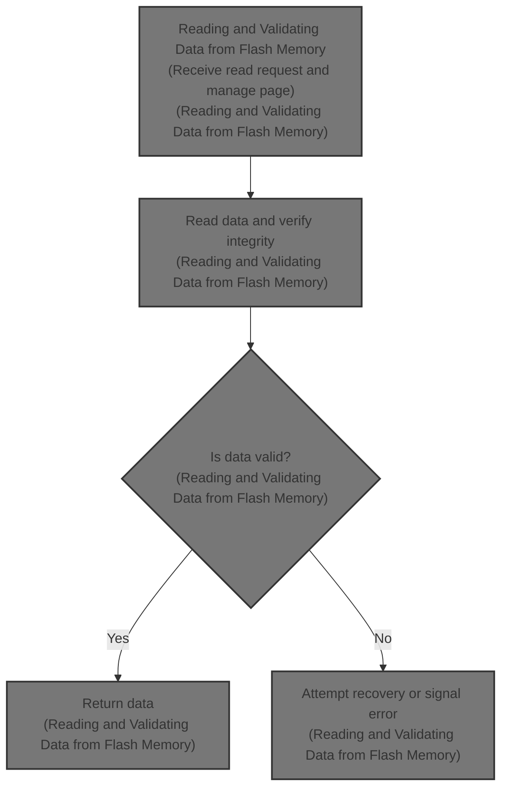

This document outlines the process for reading and validating data from flash memory. The flow ensures data is read from the correct memory page, verifies its integrity, and attempts recovery if errors are detected. It receives a request for data at a specific address and returns the data if valid, or signals an error if not.



# Reading and Validating Data from Flash Memory

```mermaid
%%{init: {"flowchart": {"defaultRenderer": "elk"}} }%%
flowchart TD
    node1["Flush device buffers to ensure data consistency"]
    click node1 openCode "src/main/drivers/flash/flash_w25n.c:845:845"
    node1 --> node2{"Is requested page different from current page?"}
    click node2 openCode "src/main/drivers/flash/flash_w25n.c:847:862"
    node2 -->|"Yes"| node3["Switch to target page and wait for device ready"]
    click node3 openCode "src/main/drivers/flash/flash_w25n.c:848:862"
    node2 -->|"No"| node4["Determine how many bytes to read from page"]
    click node4 openCode "src/main/drivers/flash/flash_w25n.c:864:871"
    node3 --> node4
    node4 --> node5{"Device mode: SPI or QUADSPI?"}
    click node5 openCode "src/main/drivers/flash/flash_w25n.c:873:903"
    node5 -->|"SPI"| node6["Read data using SPI"]
    click node6 openCode "src/main/drivers/flash/flash_w25n.c:874:896"
    node5 -->|"QUADSPI"| node7["Read data using QUADSPI"]
    click node7 openCode "src/main/drivers/flash/flash_w25n.c:899:903"
    node6 --> node8["Set timeout and wait for device ready"]
    click node8 openCode "src/main/drivers/flash/flash_w25n.c:907:910"
    node7 --> node8
    node8 --> node9["Check data integrity (ECC status)"]
    click node9 openCode "src/main/drivers/flash/flash_w25n.c:914:926"
    node9 --> node10{"ECC status"}
    click node10 openCode "src/main/drivers/flash/flash_w25n.c:917:926"
    node10 -->|"No error"| node11["Return number of bytes read"]
    click node11 openCode "src/main/drivers/flash/flash_w25n.c:928:929"
    node10 -->|"Corrected or uncorrectable error"| node12["Log error and reset device"]
    click node12 openCode "src/main/drivers/flash/flash_w25n.c:923:925"
    node12 --> node11
classDef HeadingStyle fill:#777777,stroke:#333,stroke-width:2px;

%% Swimm:
%% %%{init: {"flowchart": {"defaultRenderer": "elk"}} }%%
%% flowchart TD
%%     node1["Flush device buffers to ensure data consistency"]
%%     click node1 openCode "<SwmPath>[src/…/flash/flash_w25n.c](src/main/drivers/flash/flash_w25n.c)</SwmPath>:845:845"
%%     node1 --> node2{"Is requested page different from current page?"}
%%     click node2 openCode "<SwmPath>[src/…/flash/flash_w25n.c](src/main/drivers/flash/flash_w25n.c)</SwmPath>:847:862"
%%     node2 -->|"Yes"| node3["Switch to target page and wait for device ready"]
%%     click node3 openCode "<SwmPath>[src/…/flash/flash_w25n.c](src/main/drivers/flash/flash_w25n.c)</SwmPath>:848:862"
%%     node2 -->|"No"| node4["Determine how many bytes to read from page"]
%%     click node4 openCode "<SwmPath>[src/…/flash/flash_w25n.c](src/main/drivers/flash/flash_w25n.c)</SwmPath>:864:871"
%%     node3 --> node4
%%     node4 --> node5{"Device mode: SPI or QUADSPI?"}
%%     click node5 openCode "<SwmPath>[src/…/flash/flash_w25n.c](src/main/drivers/flash/flash_w25n.c)</SwmPath>:873:903"
%%     node5 -->|"SPI"| node6["Read data using SPI"]
%%     click node6 openCode "<SwmPath>[src/…/flash/flash_w25n.c](src/main/drivers/flash/flash_w25n.c)</SwmPath>:874:896"
%%     node5 -->|"QUADSPI"| node7["Read data using QUADSPI"]
%%     click node7 openCode "<SwmPath>[src/…/flash/flash_w25n.c](src/main/drivers/flash/flash_w25n.c)</SwmPath>:899:903"
%%     node6 --> node8["Set timeout and wait for device ready"]
%%     click node8 openCode "<SwmPath>[src/…/flash/flash_w25n.c](src/main/drivers/flash/flash_w25n.c)</SwmPath>:907:910"
%%     node7 --> node8
%%     node8 --> node9["Check data integrity (ECC status)"]
%%     click node9 openCode "<SwmPath>[src/…/flash/flash_w25n.c](src/main/drivers/flash/flash_w25n.c)</SwmPath>:914:926"
%%     node9 --> node10{"ECC status"}
%%     click node10 openCode "<SwmPath>[src/…/flash/flash_w25n.c](src/main/drivers/flash/flash_w25n.c)</SwmPath>:917:926"
%%     node10 -->|"No error"| node11["Return number of bytes read"]
%%     click node11 openCode "<SwmPath>[src/…/flash/flash_w25n.c](src/main/drivers/flash/flash_w25n.c)</SwmPath>:928:929"
%%     node10 -->|"Corrected or uncorrectable error"| node12["Log error and reset device"]
%%     click node12 openCode "<SwmPath>[src/…/flash/flash_w25n.c](src/main/drivers/flash/flash_w25n.c)</SwmPath>:923:925"
%%     node12 --> node11
%% classDef HeadingStyle fill:#777777,stroke:#333,stroke-width:2px;
```



<SwmSnippet path="/src/main/drivers/flash/flash_w25n.c" line="840">

---

W25n_readBytes kicks off the read flow by converting the linear address to page and column, flushing any buffered data, and switching pages if needed. It calculates how much data can be read from the current page, handles SPI or QUADSPI reads depending on the IO mode, and checks ECC status after reading. If an uncorrectable ECC error is detected, it logs the error and calls <SwmToken path="src/main/drivers/flash/flash_w25n.c" pos="924:1:1" line-data="        w25n_deviceReset(fdevice);">`w25n_deviceReset`</SwmToken> to recover the device.

```c
static int w25n_readBytes(flashDevice_t *fdevice, uint32_t address, uint8_t *buffer, uint32_t length)
{
    uint32_t targetPage = W25N_LINEAR_TO_PAGE(address);

    // As data is buffered before being written a flush must be performed before attempting a read
    w25n_flush(fdevice);

    if (currentPage != targetPage) {
        if (!w25n_waitForReady(fdevice)) {
            return 0;
        }

        currentPage = UINT32_MAX;

        w25n_performCommandWithPageAddress(&fdevice->io, W25N_INSTRUCTION_PAGE_DATA_READ, targetPage);

        w25n_setTimeout(fdevice, W25N_TIMEOUT_PAGE_READ_MS);
        if (!w25n_waitForReady(fdevice)) {
            return 0;
        }

        currentPage = targetPage;
    }

    uint32_t column = W25N_LINEAR_TO_COLUMN(address);
    uint16_t transferLength;

    if (length > W25N_PAGE_SIZE - column) {
        transferLength = W25N_PAGE_SIZE - column;
    } else {
        transferLength = length;
    }

    if (fdevice->io.mode == FLASHIO_SPI) {
        extDevice_t *dev = fdevice->io.handle.dev;

        uint8_t readStatus[] = { W25N_INSTRUCTION_READ_STATUS_REG, W25N_STAT_REG, 0 };
        uint8_t readyStatus[3];

        uint8_t cmd[4];
        cmd[0] = W25N_INSTRUCTION_READ_DATA;
        cmd[1] = (column >> 8) & 0xff;
        cmd[2] = (column >> 0) & 0xff;
        cmd[3] = 0;

        busSegment_t segments[] = {
                {.u.buffers = {readStatus, readyStatus}, sizeof(readStatus), true, w25n_callbackReady},
                {.u.buffers = {cmd, NULL}, sizeof(cmd), false, NULL},
                {.u.buffers = {NULL, buffer}, length, true, NULL},
                {.u.link = {NULL, NULL}, 0, true, NULL},
        };

        spiSequence(dev, &segments[0]);

        // Block pending completion of SPI access
        spiWait(dev);
    }
#ifdef USE_QUADSPI
    else if (fdevice->io.mode == FLASHIO_QUADSPI) {
        extDevice_t *dev = fdevice->io.handle.dev;

        //quadSpiReceiveWithAddress1LINE(quadSpi, W25N_INSTRUCTION_READ_DATA, 8, column, W25N_STATUS_COLUMN_ADDRESS_SIZE, buffer, length);
        quadSpiReceiveWithAddress4LINES(dev, W25N_INSTRUCTION_FAST_READ_QUAD_OUTPUT, 8, column, W25N_STATUS_COLUMN_ADDRESS_SIZE, buffer, length);
    }
#endif

    // XXX Don't need this?
    w25n_setTimeout(fdevice, W25N_TIMEOUT_PAGE_READ_MS);
    if (!w25n_waitForReady(fdevice)) {
        return 0;
    }

    // Check ECC

    uint8_t statReg = w25n_readRegister(&fdevice->io, W25N_STAT_REG);
    uint8_t eccCode = W25N_STATUS_FLAG_ECC(statReg);

    switch (eccCode) {
    case 0: // Successful read, no ECC correction
        break;
    case 1: // Successful read with ECC correction
    case 2: // Uncorrectable ECC in a single page
    case 3: // Uncorrectable ECC in multiple pages
        w25n_addError(address, eccCode);
        w25n_deviceReset(fdevice);
        break;
    }

    return transferLength;
}
```

---

</SwmSnippet>

<SwmSnippet path="/src/main/drivers/flash/flash_w25n.c" line="271">

---

W25n_deviceReset handles the device recovery by sending a reset command, waiting for the device to be ready, clearing write protection, and enabling ECC and buffered read mode. The commented-out code warns against enabling certain protection bits, which would block writes via the bad block lookup table.

```c
static void w25n_deviceReset(flashDevice_t *fdevice)
{
    flashDeviceIO_t *io = &fdevice->io;

    w25n_performOneByteCommand(io, W25N_INSTRUCTION_DEVICE_RESET);

    w25n_setTimeout(fdevice, W25N_TIMEOUT_RESET_MS);
    w25n_waitForReady(fdevice);

    // Protection for upper 1/32 (BP[3:0] = 0101, TB=0), WP-E on; to protect bad block replacement area
    // DON'T DO THIS. This will prevent writes through the bblut as well.
    // w25n_writeRegister(dev, W25N_PROT_REG, W25N_PROT_PB0_ENABLE|W25N_PROT_PB2_ENABLE|W25N_PROT_WP_E_ENABLE);

    // No protection, WP-E off, WP-E prevents use of IO2
    w25n_writeRegister(io, W25N_PROT_REG, W25N_PROT_CLEAR);

    // Buffered read mode (BUF = 1), ECC enabled (ECC = 1)
    w25n_writeRegister(io, W25N_CONF_REG, W25N_CONFIG_ECC_ENABLE|W25N_CONFIG_BUFFER_READ_MODE);
}
```

---

</SwmSnippet>

&nbsp;

*This is an auto-generated document by Swimm 🌊 and has not yet been verified by a human*

<SwmMeta version="3.0.0" repo-id="Z2l0aHViJTNBJTNBYy1iZXRhZmxpZ2h0JTNBJTNBcmljYXJkb2xvcGV6Zw==" repo-name="c-betaflight"><sup>Powered by [Swimm](https://app.swimm.io/)</sup></SwmMeta>
