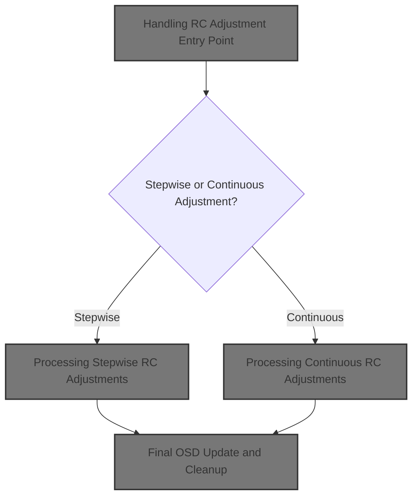
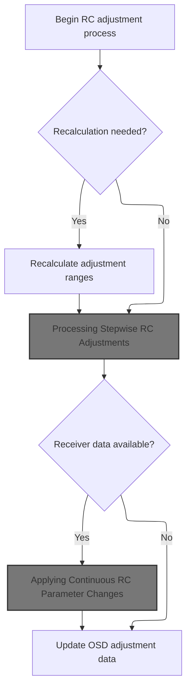
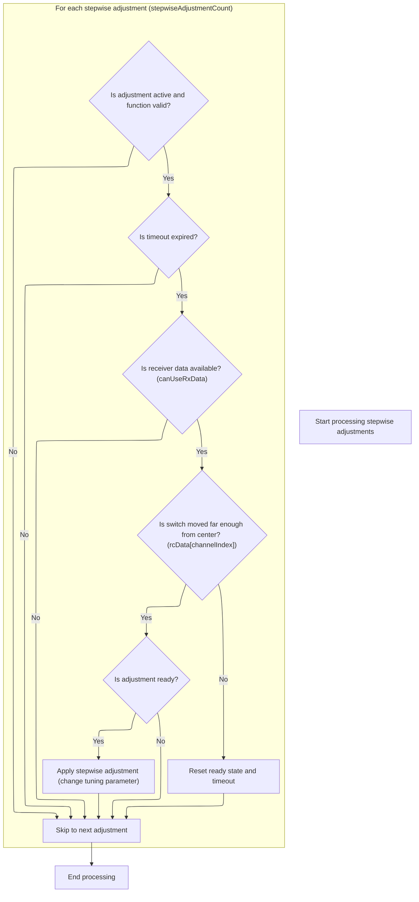
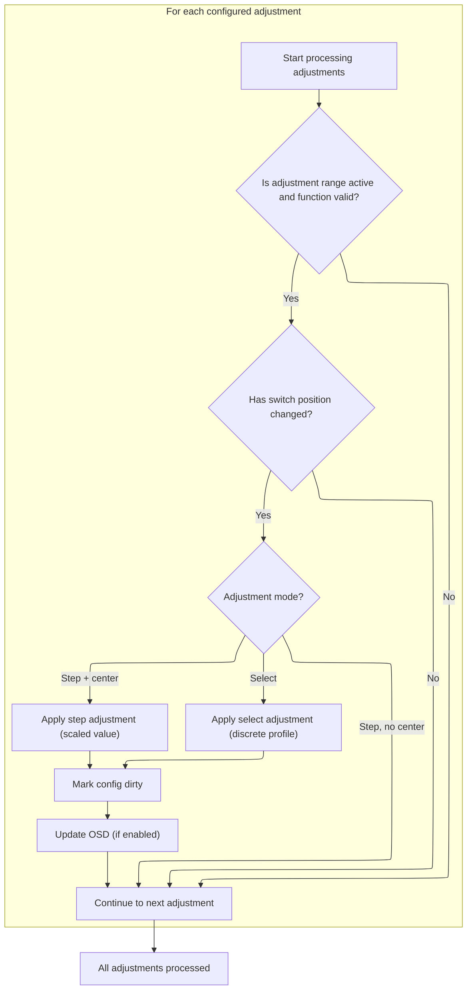

This document explains how pilots can adjust flight controller parameters in real time using their RC transmitter. The flow covers both incremental and continuous adjustments, updates system parameters immediately, and provides instant feedback through the on-screen display.



# Handling RC Adjustment Entry Point



<SwmSnippet path="/src/main/fc/rc_adjustments.c" line="849">

---

In <SwmToken path="src/main/fc/rc_adjustments.c" pos="849:2:2" line-data="void processRcAdjustments(controlRateConfig_t *controlRateConfig)">`processRcAdjustments`</SwmToken>, we check if RC input is available and recalculate adjustment ranges if needed. Next, we call <SwmToken path="src/main/fc/rc_adjustments.c" pos="860:1:1" line-data="    processStepwiseAdjustments(controlRateConfig, canUseRxData);">`processStepwiseAdjustments`</SwmToken> to actually process any stepwise RC-based parameter changes, since that's where the main adjustment logic happens.

```c
void processRcAdjustments(controlRateConfig_t *controlRateConfig)
{
    const bool canUseRxData = isRxReceivingSignal();

    // Recalculate the new active adjustments if required
    if (stepwiseAdjustmentCount == ADJUSTMENT_RANGE_COUNT_INVALID) {
        // This can take up to 30us and is only call when not armed so ignore this timing as it doesn't impact flight
        schedulerIgnoreTaskExecTime();
        calcActiveAdjustmentRanges();
    }

    processStepwiseAdjustments(controlRateConfig, canUseRxData);

```

---

</SwmSnippet>

## Processing Stepwise RC Adjustments



<SwmSnippet path="/src/main/fc/rc_adjustments.c" line="729">

---

In <SwmToken path="src/main/fc/rc_adjustments.c" pos="729:4:4" line-data="static void processStepwiseAdjustments(controlRateConfig_t *controlRateConfig, const bool canUseRxData)">`processStepwiseAdjustments`</SwmToken>, we loop through all stepwise adjustments, check if they're active and enabled, throttle how often we can apply them, and if the RC input is in the right position, we call <SwmToken path="src/main/fc/rc_adjustments.c" pos="773:7:7" line-data="            int newValue = applyStepAdjustment(controlRateConfig, adjustmentFunction, delta);">`applyStepAdjustment`</SwmToken> to actually change the parameter. This is where the RC input gets mapped to a parameter update.

```c
static void processStepwiseAdjustments(controlRateConfig_t *controlRateConfig, const bool canUseRxData)
{
    const timeMs_t now = millis();

    for (int index = 0; index < stepwiseAdjustmentCount; index++) {
        timedAdjustmentState_t *adjustmentState = &stepwiseAdjustments[index];
        const adjustmentRange_t *const adjustmentRange = adjustmentRanges(adjustmentState->adjustmentRangeIndex);
        const adjustmentConfig_t *adjustmentConfig = &defaultAdjustmentConfigs[adjustmentRange->adjustmentConfig - ADJUSTMENT_FUNCTION_CONFIG_INDEX_OFFSET];
        const adjustmentFunction_e adjustmentFunction = adjustmentConfig->adjustmentFunction;

        if (!isRangeActive(adjustmentRange->auxChannelIndex, &adjustmentRange->range) ||
            adjustmentFunction == ADJUSTMENT_NONE) {
            adjustmentState->timeoutAt = 0;

            continue;
        }

        if (cmp32(now, adjustmentState->timeoutAt) >= 0) {
            adjustmentState->timeoutAt = now + RESET_FREQUENCY_2HZ;
            adjustmentState->ready = true;
        }

        if (!canUseRxData) {
            continue;
        }

        const uint8_t channelIndex = NON_AUX_CHANNEL_COUNT + adjustmentRange->auxSwitchChannelIndex;

        if (adjustmentConfig->mode == ADJUSTMENT_MODE_STEP) {
            int delta;
            if (rcData[channelIndex] > rxConfig()->midrc + 200) {
                delta = adjustmentConfig->data.step;
            } else if (rcData[channelIndex] < rxConfig()->midrc - 200) {
                delta = -adjustmentConfig->data.step;
            } else {
                // returning the switch to the middle immediately resets the ready state
                adjustmentState->ready = true;
                adjustmentState->timeoutAt = now + RESET_FREQUENCY_2HZ;
                continue;
            }
            if (!adjustmentState->ready) {
                continue;
            }

            int newValue = applyStepAdjustment(controlRateConfig, adjustmentFunction, delta);

```

---

</SwmSnippet>

<SwmSnippet path="/src/main/fc/rc_adjustments.c" line="279">

---

<SwmToken path="src/main/fc/rc_adjustments.c" pos="279:4:4" line-data="static int applyStepAdjustment(controlRateConfig_t *controlRateConfig, uint8_t adjustmentFunction, int delta)">`applyStepAdjustment`</SwmToken> figures out which parameter to change based on the adjustment type, applies the delta, constrains the value, logs the event, and sometimes triggers extra actions like beeps or RC reinit. Some cases intentionally fall through to update multiple axes at once.

```c
static int applyStepAdjustment(controlRateConfig_t *controlRateConfig, uint8_t adjustmentFunction, int delta)
{
    beeperConfirmationBeeps(delta > 0 ? 2 : 1);
    int newValue;
    switch (adjustmentFunction) {
    case ADJUSTMENT_RC_RATE:
    case ADJUSTMENT_ROLL_RC_RATE:
        newValue = constrain((int)controlRateConfig->rcRates[FD_ROLL] + delta, 1, CONTROL_RATE_CONFIG_RC_RATES_MAX);
        controlRateConfig->rcRates[FD_ROLL] = newValue;
        blackboxLogInflightAdjustmentEvent(ADJUSTMENT_ROLL_RC_RATE, newValue);
        if (adjustmentFunction == ADJUSTMENT_ROLL_RC_RATE) {
            break;
        }
        // fall through for combined ADJUSTMENT_RC_EXPO
        FALLTHROUGH;
    case ADJUSTMENT_PITCH_RC_RATE:
        newValue = constrain((int)controlRateConfig->rcRates[FD_PITCH] + delta, 1, CONTROL_RATE_CONFIG_RC_RATES_MAX);
        controlRateConfig->rcRates[FD_PITCH] = newValue;
        blackboxLogInflightAdjustmentEvent(ADJUSTMENT_PITCH_RC_RATE, newValue);
        break;
    case ADJUSTMENT_RC_EXPO:
    case ADJUSTMENT_ROLL_RC_EXPO:
        newValue = constrain((int)controlRateConfig->rcExpo[FD_ROLL] + delta, 0, CONTROL_RATE_CONFIG_RC_EXPO_MAX);
        controlRateConfig->rcExpo[FD_ROLL] = newValue;
        blackboxLogInflightAdjustmentEvent(ADJUSTMENT_ROLL_RC_EXPO, newValue);
        if (adjustmentFunction == ADJUSTMENT_ROLL_RC_EXPO) {
            break;
        }
        // fall through for combined ADJUSTMENT_RC_EXPO
        FALLTHROUGH;
    case ADJUSTMENT_PITCH_RC_EXPO:
        newValue = constrain((int)controlRateConfig->rcExpo[FD_PITCH] + delta, 0, CONTROL_RATE_CONFIG_RC_EXPO_MAX);
        controlRateConfig->rcExpo[FD_PITCH] = newValue;
        blackboxLogInflightAdjustmentEvent(ADJUSTMENT_PITCH_RC_EXPO, newValue);
        break;
    case ADJUSTMENT_THROTTLE_EXPO:
        newValue = constrain((int)controlRateConfig->thrExpo8 + delta, 0, 100); // FIXME magic numbers repeated in cli.c
        controlRateConfig->thrExpo8 = newValue;
        initRcProcessing();
        blackboxLogInflightAdjustmentEvent(ADJUSTMENT_THROTTLE_EXPO, newValue);
        break;
    case ADJUSTMENT_PITCH_ROLL_RATE:
    case ADJUSTMENT_PITCH_RATE:
        newValue = constrain((int)controlRateConfig->rates[FD_PITCH] + delta, 0, CONTROL_RATE_CONFIG_RATE_MAX);
        controlRateConfig->rates[FD_PITCH] = newValue;
        blackboxLogInflightAdjustmentEvent(ADJUSTMENT_PITCH_RATE, newValue);
        if (adjustmentFunction == ADJUSTMENT_PITCH_RATE) {
            break;
        }
        // fall through for combined ADJUSTMENT_PITCH_ROLL_RATE
        FALLTHROUGH;
    case ADJUSTMENT_ROLL_RATE:
        newValue = constrain((int)controlRateConfig->rates[FD_ROLL] + delta, 0, CONTROL_RATE_CONFIG_RATE_MAX);
        controlRateConfig->rates[FD_ROLL] = newValue;
        blackboxLogInflightAdjustmentEvent(ADJUSTMENT_ROLL_RATE, newValue);
        break;
    case ADJUSTMENT_YAW_RATE:
        newValue = constrain((int)controlRateConfig->rates[FD_YAW] + delta, 0, CONTROL_RATE_CONFIG_RATE_MAX);
        controlRateConfig->rates[FD_YAW] = newValue;
        blackboxLogInflightAdjustmentEvent(ADJUSTMENT_YAW_RATE, newValue);
        break;
    case ADJUSTMENT_PITCH_ROLL_P:
    case ADJUSTMENT_PITCH_P:
        newValue = constrain((int)currentPidProfile->pid[PID_PITCH].P + delta, 0, 200); // FIXME magic numbers repeated in cli.c
        currentPidProfile->pid[PID_PITCH].P = newValue;
        blackboxLogInflightAdjustmentEvent(ADJUSTMENT_PITCH_P, newValue);

        if (adjustmentFunction == ADJUSTMENT_PITCH_P) {
            break;
        }
        // fall through for combined ADJUSTMENT_PITCH_ROLL_P
        FALLTHROUGH;
    case ADJUSTMENT_ROLL_P:
        newValue = constrain((int)currentPidProfile->pid[PID_ROLL].P + delta, 0, 200); // FIXME magic numbers repeated in cli.c
        currentPidProfile->pid[PID_ROLL].P = newValue;
        blackboxLogInflightAdjustmentEvent(ADJUSTMENT_ROLL_P, newValue);
        break;
    case ADJUSTMENT_PITCH_ROLL_I:
    case ADJUSTMENT_PITCH_I:
        newValue = constrain((int)currentPidProfile->pid[PID_PITCH].I + delta, 0, 200); // FIXME magic numbers repeated in cli.c
        currentPidProfile->pid[PID_PITCH].I = newValue;
        blackboxLogInflightAdjustmentEvent(ADJUSTMENT_PITCH_I, newValue);
        if (adjustmentFunction == ADJUSTMENT_PITCH_I) {
            break;
        }
        // fall through for combined ADJUSTMENT_PITCH_ROLL_I
        FALLTHROUGH;
    case ADJUSTMENT_ROLL_I:
        newValue = constrain((int)currentPidProfile->pid[PID_ROLL].I + delta, 0, 200); // FIXME magic numbers repeated in cli.c
        currentPidProfile->pid[PID_ROLL].I = newValue;
        blackboxLogInflightAdjustmentEvent(ADJUSTMENT_ROLL_I, newValue);
        break;
    case ADJUSTMENT_PITCH_ROLL_D:
    case ADJUSTMENT_PITCH_D:
        newValue = constrain((int)currentPidProfile->pid[PID_PITCH].D + delta, 0, 200); // FIXME magic numbers repeated in cli.c
        currentPidProfile->pid[PID_PITCH].D = newValue;
        blackboxLogInflightAdjustmentEvent(ADJUSTMENT_PITCH_D, newValue);
        if (adjustmentFunction == ADJUSTMENT_PITCH_D) {
            break;
        }
        // fall through for combined ADJUSTMENT_PITCH_ROLL_D
        FALLTHROUGH;
    case ADJUSTMENT_ROLL_D:
        newValue = constrain((int)currentPidProfile->pid[PID_ROLL].D + delta, 0, 200); // FIXME magic numbers repeated in cli.c
        currentPidProfile->pid[PID_ROLL].D = newValue;
        blackboxLogInflightAdjustmentEvent(ADJUSTMENT_ROLL_D, newValue);
        break;
    case ADJUSTMENT_YAW_P:
        newValue = constrain((int)currentPidProfile->pid[PID_YAW].P + delta, 0, 200); // FIXME magic numbers repeated in cli.c
        currentPidProfile->pid[PID_YAW].P = newValue;
        blackboxLogInflightAdjustmentEvent(ADJUSTMENT_YAW_P, newValue);
        break;
    case ADJUSTMENT_YAW_I:
        newValue = constrain((int)currentPidProfile->pid[PID_YAW].I + delta, 0, 200); // FIXME magic numbers repeated in cli.c
        currentPidProfile->pid[PID_YAW].I = newValue;
        blackboxLogInflightAdjustmentEvent(ADJUSTMENT_YAW_I, newValue);
        break;
    case ADJUSTMENT_YAW_D:
        newValue = constrain((int)currentPidProfile->pid[PID_YAW].D + delta, 0, 200); // FIXME magic numbers repeated in cli.c
        currentPidProfile->pid[PID_YAW].D = newValue;
        blackboxLogInflightAdjustmentEvent(ADJUSTMENT_YAW_D, newValue);
        break;
    case ADJUSTMENT_RC_RATE_YAW:
        newValue = constrain((int)controlRateConfig->rcRates[FD_YAW] + delta, 1, CONTROL_RATE_CONFIG_RC_RATES_MAX);
        controlRateConfig->rcRates[FD_YAW] = newValue;
        blackboxLogInflightAdjustmentEvent(ADJUSTMENT_RC_RATE_YAW, newValue);
        break;
    case ADJUSTMENT_PITCH_ROLL_F:
    case ADJUSTMENT_PITCH_F:
        newValue = constrain(currentPidProfile->pid[PID_PITCH].F + delta, 0, 2000);
        currentPidProfile->pid[PID_PITCH].F = newValue;
        blackboxLogInflightAdjustmentEvent(ADJUSTMENT_PITCH_F, newValue);

        if (adjustmentFunction == ADJUSTMENT_PITCH_F) {
            break;
        }
        // fall through for combined ADJUSTMENT_PITCH_ROLL_F
        FALLTHROUGH;
    case ADJUSTMENT_ROLL_F:
        newValue = constrain(currentPidProfile->pid[PID_ROLL].F + delta, 0, 2000);
        currentPidProfile->pid[PID_ROLL].F = newValue;
        blackboxLogInflightAdjustmentEvent(ADJUSTMENT_ROLL_F, newValue);
        break;
    case ADJUSTMENT_YAW_F:
        newValue = constrain(currentPidProfile->pid[PID_YAW].F + delta, 0, 2000);
        currentPidProfile->pid[PID_YAW].F = newValue;
        blackboxLogInflightAdjustmentEvent(ADJUSTMENT_YAW_F, newValue);
        break;
#if defined(USE_FEEDFORWARD)
    case ADJUSTMENT_FEEDFORWARD_TRANSITION:
        newValue = constrain(currentPidProfile->feedforward_transition + delta, 1, 100); // FIXME magic numbers repeated in cli.c
        currentPidProfile->feedforward_transition = newValue;
        blackboxLogInflightAdjustmentEvent(ADJUSTMENT_FEEDFORWARD_TRANSITION, newValue);
        break;
#endif
    default:
        newValue = -1;
        break;
    };

    return newValue;
}
```

---

</SwmSnippet>

<SwmSnippet path="/src/main/fc/rc_adjustments.c" line="775">

---

Back in <SwmToken path="src/main/fc/rc_adjustments.c" pos="729:4:4" line-data="static void processStepwiseAdjustments(controlRateConfig_t *controlRateConfig, const bool canUseRxData)">`processStepwiseAdjustments`</SwmToken>, after updating a parameter with <SwmToken path="src/main/fc/rc_adjustments.c" pos="279:4:4" line-data="static int applyStepAdjustment(controlRateConfig_t *controlRateConfig, uint8_t adjustmentFunction, int delta)">`applyStepAdjustment`</SwmToken>, we mark the config as dirty, reinit the PID profile so the new values are used, reset the ready flag, and update OSD if enabled. This makes sure the adjustment takes effect right away.

```c
            setConfigDirty();

            pidInitConfig(currentPidProfile);

            adjustmentState->ready = false;

#if defined(USE_OSD) && defined(USE_OSD_ADJUSTMENTS)
            updateOsdAdjustmentData(newValue, adjustmentConfig->adjustmentFunction);
#else
            UNUSED(newValue);
#endif
        }
    }
}
```

---

</SwmSnippet>

## Reinitializing PID Runtime Parameters

```mermaid
%%{init: {"flowchart": {"defaultRenderer": "elk"}} }%%
flowchart TD
    node1["Start PID configuration"]
    click node1 openCode "src/main/flight/pid_init.c:392:393"
    subgraph loop1["For each flight axis (roll, pitch, yaw)"]
        node1 --> node2["Set PID coefficients (P, I, D, F)"]
        click node2 openCode "src/main/flight/pid_init.c:394:399"
        node2 --> node3{"Is axis YAW?"}
        click node3 openCode "src/main/flight/pid_init.c:404:404"
        node3 -->|"Yes"| node4["Adjust yaw integral gain"]
        click node4 openCode "src/main/flight/pid_init.c:404:404"
        node3 -->|"No"| node5["Continue"]
        node4 --> node6["Next axis"]
        node5 --> node6
    end
    node6 --> node7["Set stabilization and flight mode gains"]
    click node7 openCode "src/main/flight/pid_init.c:406:452"
    node7 --> node8["Configure crash recovery parameters"]
    click node8 openCode "src/main/flight/pid_init.c:435:444"
    node8 --> node9{"Is dynamic low-pass filter enabled?"}
    click node9 openCode "src/main/flight/pid_init.c:483:501"
    node9 -->|"Yes"| node10{"Select filter type"}
    click node10 openCode "src/main/flight/pid_init.c:484:500"
    node10 --> node11["Set filter parameters"]
    click node11 openCode "src/main/flight/pid_init.c:504:506"
    node9 -->|"No"| node12["Disable dynamic low-pass filter"]
    click node12 openCode "src/main/flight/pid_init.c:502:503"
    node11 --> node13{"Is D-term max enabled?"}
    click node13 openCode "src/main/flight/pid_init.c:530:538"
    subgraph loop2["For each flight axis (if D-term max enabled)"]
        node13 -->|"Yes"| node14["Set D-term max percent"]
        click node14 openCode "src/main/flight/pid_init.c:531:537"
        node14 --> node15["Next axis"]
    end
    node13 -->|"No"| node16["Set default D-term max percent"]
    click node16 openCode "src/main/flight/pid_init.c:536:537"
    node14 --> node17["Configure advanced features"]
    node16 --> node17
    click node17 openCode "src/main/flight/pid_init.c:509:579"
    node17 --> node18{"Is easy disarm threshold set?"}
    click node18 openCode "src/main/flight/pid_init.c:581:582"
    node18 -->|"Yes"| node19["Enable easy disarm"]
    click node19 openCode "src/main/flight/pid_init.c:581:582"
    node18 -->|"No"| node20["Disable easy disarm"]
    click node20 openCode "src/main/flight/pid_init.c:581:582"
    node19 --> node21["Finish configuration"]
    node20 --> node21
    click node21 openCode "src/main/flight/pid_init.c:587:587"
classDef HeadingStyle fill:#777777,stroke:#333,stroke-width:2px;

%% Swimm:
%% %%{init: {"flowchart": {"defaultRenderer": "elk"}} }%%
%% flowchart TD
%%     node1["Start PID configuration"]
%%     click node1 openCode "<SwmPath>[src/…/flight/pid_init.c](src/main/flight/pid_init.c)</SwmPath>:392:393"
%%     subgraph loop1["For each flight axis (roll, pitch, yaw)"]
%%         node1 --> node2["Set PID coefficients (P, I, D, F)"]
%%         click node2 openCode "<SwmPath>[src/…/flight/pid_init.c](src/main/flight/pid_init.c)</SwmPath>:394:399"
%%         node2 --> node3{"Is axis YAW?"}
%%         click node3 openCode "<SwmPath>[src/…/flight/pid_init.c](src/main/flight/pid_init.c)</SwmPath>:404:404"
%%         node3 -->|"Yes"| node4["Adjust yaw integral gain"]
%%         click node4 openCode "<SwmPath>[src/…/flight/pid_init.c](src/main/flight/pid_init.c)</SwmPath>:404:404"
%%         node3 -->|"No"| node5["Continue"]
%%         node4 --> node6["Next axis"]
%%         node5 --> node6
%%     end
%%     node6 --> node7["Set stabilization and flight mode gains"]
%%     click node7 openCode "<SwmPath>[src/…/flight/pid_init.c](src/main/flight/pid_init.c)</SwmPath>:406:452"
%%     node7 --> node8["Configure crash recovery parameters"]
%%     click node8 openCode "<SwmPath>[src/…/flight/pid_init.c](src/main/flight/pid_init.c)</SwmPath>:435:444"
%%     node8 --> node9{"Is dynamic low-pass filter enabled?"}
%%     click node9 openCode "<SwmPath>[src/…/flight/pid_init.c](src/main/flight/pid_init.c)</SwmPath>:483:501"
%%     node9 -->|"Yes"| node10{"Select filter type"}
%%     click node10 openCode "<SwmPath>[src/…/flight/pid_init.c](src/main/flight/pid_init.c)</SwmPath>:484:500"
%%     node10 --> node11["Set filter parameters"]
%%     click node11 openCode "<SwmPath>[src/…/flight/pid_init.c](src/main/flight/pid_init.c)</SwmPath>:504:506"
%%     node9 -->|"No"| node12["Disable dynamic low-pass filter"]
%%     click node12 openCode "<SwmPath>[src/…/flight/pid_init.c](src/main/flight/pid_init.c)</SwmPath>:502:503"
%%     node11 --> node13{"Is D-term max enabled?"}
%%     click node13 openCode "<SwmPath>[src/…/flight/pid_init.c](src/main/flight/pid_init.c)</SwmPath>:530:538"
%%     subgraph loop2["For each flight axis (if D-term max enabled)"]
%%         node13 -->|"Yes"| node14["Set D-term max percent"]
%%         click node14 openCode "<SwmPath>[src/…/flight/pid_init.c](src/main/flight/pid_init.c)</SwmPath>:531:537"
%%         node14 --> node15["Next axis"]
%%     end
%%     node13 -->|"No"| node16["Set default D-term max percent"]
%%     click node16 openCode "<SwmPath>[src/…/flight/pid_init.c](src/main/flight/pid_init.c)</SwmPath>:536:537"
%%     node14 --> node17["Configure advanced features"]
%%     node16 --> node17
%%     click node17 openCode "<SwmPath>[src/…/flight/pid_init.c](src/main/flight/pid_init.c)</SwmPath>:509:579"
%%     node17 --> node18{"Is easy disarm threshold set?"}
%%     click node18 openCode "<SwmPath>[src/…/flight/pid_init.c](src/main/flight/pid_init.c)</SwmPath>:581:582"
%%     node18 -->|"Yes"| node19["Enable easy disarm"]
%%     click node19 openCode "<SwmPath>[src/…/flight/pid_init.c](src/main/flight/pid_init.c)</SwmPath>:581:582"
%%     node18 -->|"No"| node20["Disable easy disarm"]
%%     click node20 openCode "<SwmPath>[src/…/flight/pid_init.c](src/main/flight/pid_init.c)</SwmPath>:581:582"
%%     node19 --> node21["Finish configuration"]
%%     node20 --> node21
%%     click node21 openCode "<SwmPath>[src/…/flight/pid_init.c](src/main/flight/pid_init.c)</SwmPath>:587:587"
%% classDef HeadingStyle fill:#777777,stroke:#333,stroke-width:2px;
```



<SwmSnippet path="/src/main/flight/pid_init.c" line="392">

---

In <SwmToken path="src/main/flight/pid_init.c" pos="392:2:2" line-data="void pidInitConfig(const pidProfile_t *pidProfile)">`pidInitConfig`</SwmToken>, we convert user PID values to internal units using scaling factors and store them in <SwmToken path="src/main/flight/pid_init.c" pos="395:1:1" line-data="        pidRuntime.pidCoefficient[axis].Kp = PTERM_SCALE * pidProfile-&gt;pid[axis].P;">`pidRuntime`</SwmToken> for each axis. This makes sure the controller logic uses the right numbers.

```c
void pidInitConfig(const pidProfile_t *pidProfile)
{
    for (int axis = FD_ROLL; axis <= FD_YAW; axis++) {
        pidRuntime.pidCoefficient[axis].Kp = PTERM_SCALE * pidProfile->pid[axis].P;
        pidRuntime.pidCoefficient[axis].Ki = ITERM_SCALE * pidProfile->pid[axis].I;
        pidRuntime.pidCoefficient[axis].Kd = DTERM_SCALE * pidProfile->pid[axis].D;
        pidRuntime.pidCoefficient[axis].Kf = FEEDFORWARD_SCALE * (pidProfile->pid[axis].F * 0.01f);
    }
```

---

</SwmSnippet>

<SwmSnippet path="/src/main/flight/pid_init.c" line="404">

---

After the basic PID scaling, we handle yaw Ki scaling if integrated yaw isn't used, set up angle and horizon gains, and initialize a bunch of feature-specific runtime parameters depending on compile-time flags. Crash recovery and other features get their values converted to the right units here too.

```c
        pidRuntime.pidCoefficient[FD_YAW].Ki *= 2.5f;
    }
    pidRuntime.angleGain = pidProfile->pid[PID_LEVEL].P / 10.0f;
    pidRuntime.angleFeedforwardGain = pidProfile->pid[PID_LEVEL].F / 100.0f;
#ifdef USE_ACC
    pidRuntime.angleEarthRef = pidProfile->angle_earth_ref / 100.0f;
#endif
    pidRuntime.horizonGain = MIN(pidProfile->pid[PID_LEVEL].I / 100.0f, 1.0f);
    pidRuntime.horizonIgnoreSticks = (pidProfile->horizon_ignore_sticks) ? 1.0f : 0.0f;

    pidRuntime.horizonLimitSticks = pidProfile->pid[PID_LEVEL].D / 100.0f;
    pidRuntime.horizonLimitSticksInv = (pidProfile->pid[PID_LEVEL].D) ? 1.0f / pidRuntime.horizonLimitSticks : 1.0f;
    pidRuntime.horizonLimitDegrees = (float)pidProfile->horizon_limit_degrees;
    pidRuntime.horizonLimitDegreesInv = (pidProfile->horizon_limit_degrees) ? 1.0f / pidRuntime.horizonLimitDegrees : 1.0f;
#ifdef USE_ACC
    pidRuntime.horizonDelayMs = pidProfile->horizon_delay_ms;
#endif

#ifdef USE_CHIRP
    pidRuntime.chirpLagFreqHz = pidProfile->chirp_lag_freq_hz;
    pidRuntime.chirpLeadFreqHz = pidProfile->chirp_lead_freq_hz;
    pidRuntime.chirpAmplitude[FD_ROLL] = pidProfile->chirp_amplitude_roll;
    pidRuntime.chirpAmplitude[FD_PITCH] = pidProfile->chirp_amplitude_pitch;
    pidRuntime.chirpAmplitude[FD_YAW]= pidProfile->chirp_amplitude_yaw;
    pidRuntime.chirpFrequencyStartHz = pidProfile->chirp_frequency_start_deci_hz / 10.0f;
    pidRuntime.chirpFrequencyEndHz = pidProfile->chirp_frequency_end_deci_hz / 10.0f;
    pidRuntime.chirpTimeSeconds = pidProfile->chirp_time_seconds;
#endif

    pidRuntime.maxVelocity[FD_ROLL] = pidRuntime.maxVelocity[FD_PITCH] = pidProfile->rateAccelLimit * 100 * pidRuntime.dT;
    pidRuntime.maxVelocity[FD_YAW] = pidProfile->yawRateAccelLimit * 100 * pidRuntime.dT;
    pidRuntime.antiGravityGain = pidProfile->anti_gravity_gain;
    pidRuntime.crashTimeLimitUs = pidProfile->crash_time * 1000;
    pidRuntime.crashTimeDelayUs = pidProfile->crash_delay * 1000;
    pidRuntime.crashRecoveryAngleDeciDegrees = pidProfile->crash_recovery_angle * 10;
    pidRuntime.crashRecoveryRate = pidProfile->crash_recovery_rate;
    pidRuntime.crashGyroThreshold = pidProfile->crash_gthreshold; // error in deg/s
    pidRuntime.crashDtermThreshold = pidProfile->crash_dthreshold * 1000.0f; // gyro delta in deg/s/s * 1000 to match original 2017 intent
    pidRuntime.crashSetpointThreshold = pidProfile->crash_setpoint_threshold;
    pidRuntime.crashLimitYaw = pidProfile->crash_limit_yaw;

    pidRuntime.itermLimit = 0.01f * pidProfile->itermWindup * pidProfile->pidSumLimit;
    pidRuntime.itermLimitYaw = 0.01f * pidProfile->itermWindup * pidProfile->pidSumLimitYaw;

#if defined(USE_THROTTLE_BOOST)
    throttleBoost = pidProfile->throttle_boost * 0.1f;
#endif
    pidRuntime.itermRotation = pidProfile->iterm_rotation;

    // Calculate the anti-gravity value that will trigger the OSD display when its strength exceeds 25% of max.
    // This gives a useful indication of AG activity without excessive display.
    pidRuntime.antiGravityOsdCutoff = (pidRuntime.antiGravityGain / 10.0f) * 0.25f;
    pidRuntime.antiGravityPGain = ((float)(pidProfile->anti_gravity_p_gain) / 100.0f) * ANTIGRAVITY_KP;

#if defined(USE_ITERM_RELAX)
    pidRuntime.itermRelax = pidProfile->iterm_relax;
    pidRuntime.itermRelaxType = pidProfile->iterm_relax_type;
    pidRuntime.itermRelaxCutoff = pidProfile->iterm_relax_cutoff;
#endif

#ifdef USE_ACRO_TRAINER
    pidRuntime.acroTrainerAngleLimit = pidProfile->acro_trainer_angle_limit;
    pidRuntime.acroTrainerLookaheadTime = (float)pidProfile->acro_trainer_lookahead_ms / 1000.0f;
    pidRuntime.acroTrainerDebugAxis = pidProfile->acro_trainer_debug_axis;
    pidRuntime.acroTrainerGain = (float)pidProfile->acro_trainer_gain / 10.0f;
#endif // USE_ACRO_TRAINER

#if defined(USE_ABSOLUTE_CONTROL)
    pidRuntime.acGain = (float)pidProfile->abs_control_gain;
    pidRuntime.acLimit = (float)pidProfile->abs_control_limit;
    pidRuntime.acErrorLimit = (float)pidProfile->abs_control_error_limit;
    pidRuntime.acCutoff = (float)pidProfile->abs_control_cutoff;
    for (int axis = FD_ROLL; axis <= FD_YAW; axis++) {
        float iCorrection = -pidRuntime.acGain * PTERM_SCALE / ITERM_SCALE * pidRuntime.pidCoefficient[axis].Kp;
        pidRuntime.pidCoefficient[axis].Ki = MAX(0.0f, pidRuntime.pidCoefficient[axis].Ki + iCorrection);
    }
```

---

</SwmSnippet>

<SwmSnippet path="/src/main/flight/pid_init.c" line="483">

---

Here we set up the D_MAX feature: for each axis, if <SwmToken path="src/main/flight/pid_init.c" pos="531:11:11" line-data="        const uint8_t dMax = pidProfile-&gt;d_max[axis];">`d_max`</SwmToken> is higher than D, we store the ratio for scaling, otherwise just <SwmToken path="src/main/flight/pid_init.c" pos="331:17:19" line-data="        pidRuntime.spa[axis] = 1.0f; // 1.0 = no PID attenuation in runtime. 0 - full attenuation (no PIDs)">`1.0`</SwmToken>. We also calculate gain factors using the lowpass filter frequency. This only runs if D_MAX is enabled.

```c
    if (pidProfile->dterm_lpf1_dyn_min_hz > 0) {
        switch (pidProfile->dterm_lpf1_type) {
        case FILTER_PT1:
            pidRuntime.dynLpfFilter = DYN_LPF_PT1;
            break;
        case FILTER_BIQUAD:
            pidRuntime.dynLpfFilter = DYN_LPF_BIQUAD;
            break;
        case FILTER_PT2:
            pidRuntime.dynLpfFilter = DYN_LPF_PT2;
            break;
        case FILTER_PT3:
            pidRuntime.dynLpfFilter = DYN_LPF_PT3;
            break;
        default:
            pidRuntime.dynLpfFilter = DYN_LPF_NONE;
            break;
        }
    } else {
        pidRuntime.dynLpfFilter = DYN_LPF_NONE;
    }
    pidRuntime.dynLpfMin = pidProfile->dterm_lpf1_dyn_min_hz;
    pidRuntime.dynLpfMax = pidProfile->dterm_lpf1_dyn_max_hz;
    pidRuntime.dynLpfCurveExpo = pidProfile->dterm_lpf1_dyn_expo;
#endif

#ifdef USE_LAUNCH_CONTROL
    pidRuntime.launchControlMode = pidProfile->launchControlMode;
    if (sensors(SENSOR_ACC)) {
        pidRuntime.launchControlAngleLimit = pidProfile->launchControlAngleLimit;
    } else {
        pidRuntime.launchControlAngleLimit = 0;
    }
    pidRuntime.launchControlKi = ITERM_SCALE * pidProfile->launchControlGain;
#endif

#ifdef USE_INTEGRATED_YAW_CONTROL
    pidRuntime.useIntegratedYaw = pidProfile->use_integrated_yaw;
    pidRuntime.integratedYawRelax = pidProfile->integrated_yaw_relax;
#endif

#ifdef USE_THRUST_LINEARIZATION
    pidRuntime.thrustLinearization = pidProfile->thrustLinearization / 100.0f;
    pidRuntime.throttleCompensateAmount = pidRuntime.thrustLinearization - 0.5f * sq(pidRuntime.thrustLinearization);
#endif

#ifdef USE_D_MAX
    for (int axis = FD_ROLL; axis <= FD_YAW; ++axis) {
        const uint8_t dMax = pidProfile->d_max[axis];
        if ((pidProfile->pid[axis].D > 0) && dMax > pidProfile->pid[axis].D) {
            pidRuntime.dMaxPercent[axis] = (float) dMax / pidProfile->pid[axis].D;
            // fraction that Dmax is higher than D, eg if D is 8 and Dmax is 10, Dmax is 1.25 times bigger
        } else {
            pidRuntime.dMaxPercent[axis] = 1.0f;
        }
    }
```

---

</SwmSnippet>

<SwmSnippet path="/src/main/flight/pid_init.c" line="539">

---

At the end of <SwmToken path="src/main/fc/rc_adjustments.c" pos="777:1:1" line-data="            pidInitConfig(currentPidProfile);">`pidInitConfig`</SwmToken>, we finish setting up all the runtime parameters, including feature-specific stuff and feedforward smoothing (normalized to 250Hz). The function doesn't return anything, just updates the runtime state for the controller.

```c
    const float dmaxLpfInv = 1.0f / D_MAX_LOWPASS_HZ; // lowpass included inversely in gain since stronger lowpass decreases peak effect
    pidRuntime.dMaxGyroGain = D_MAX_GYRO_GAIN_FACTOR * pidProfile->d_max_gain * dmaxLpfInv;
    pidRuntime.dMaxSetpointGain = D_MAX_SETPOINT_GAIN_FACTOR * pidProfile->d_max_advance * dmaxLpfInv;
#endif

#if defined(USE_AIRMODE_LPF)
    pidRuntime.airmodeThrottleOffsetLimit = pidProfile->transient_throttle_limit / 100.0f;
#endif

#ifdef USE_FEEDFORWARD
    pidRuntime.feedforwardTransition = pidProfile->feedforward_transition / 100.0f;
    pidRuntime.feedforwardTransitionInv = (pidProfile->feedforward_transition == 0) ? 0.0f : 100.0f / pidProfile->feedforward_transition;
    pidRuntime.feedforwardAveraging = pidProfile->feedforward_averaging;
    // feedforward_smooth_factor effect previously would change based on packet looprate
    // normalizing to 250hz packet rate as that is the most commonly used ELRS packet rate
    float scaledSmoothFactor = 0.01f * pidProfile->feedforward_smooth_factor;
    float rxDt = 1.0f / 250.0f;
    float feedforwardSmoothingTau = (rxDt * scaledSmoothFactor) / (1.0f - scaledSmoothFactor);
    pidRuntime.feedforwardSmoothFactor = feedforwardSmoothingTau;
    pidRuntime.feedforwardJitterFactor = pidProfile->feedforward_jitter_factor;
    pidRuntime.feedforwardJitterFactorInv = 1.0f / (1.0f + pidProfile->feedforward_jitter_factor);
    pidRuntime.feedforwardBoostFactor = 0.001f * pidProfile->feedforward_boost;
    pidRuntime.feedforwardMaxRateLimit = pidProfile->feedforward_max_rate_limit;
    pidRuntime.feedforwardInterpolate = !(rxRuntimeState.serialrxProvider == SERIALRX_CRSF);
    pidRuntime.feedforwardYawHoldTime = 0.001f * pidProfile->feedforward_yaw_hold_time; // input time constant in milliseconds, converted to seconds
    pidRuntime.feedforwardYawHoldGain = pidProfile->feedforward_yaw_hold_gain;
    // normalise/maintain boost when time constant is small, 1.5x at 50ms, 2x at 25ms, almost 3x at 10ms
    if (pidProfile->feedforward_yaw_hold_time < 100) {
        pidRuntime.feedforwardYawHoldGain *= 150.0f / (float)(pidProfile->feedforward_yaw_hold_time + 50);
    }
#endif

    pidRuntime.levelRaceMode = pidProfile->level_race_mode;
    pidRuntime.tpaBreakpoint = constrainf((pidProfile->tpa_breakpoint - PWM_RANGE_MIN) / 1000.0f, 0.0f, 0.99f);
    // default of 1350 returns 0.35. range limited to 0 to 0.99
    pidRuntime.tpaMultiplier = (pidProfile->tpa_rate / 100.0f) / (1.0f - pidRuntime.tpaBreakpoint);
    // it is assumed that tpaLowBreakpoint is always less than or equal to tpaBreakpoint
    pidRuntime.tpaLowBreakpoint = constrainf((pidProfile->tpa_low_breakpoint - PWM_RANGE_MIN) / 1000.0f, 0.01f, 1.0f);
    pidRuntime.tpaLowBreakpoint = MIN(pidRuntime.tpaLowBreakpoint, pidRuntime.tpaBreakpoint);
    pidRuntime.tpaLowMultiplier = pidProfile->tpa_low_rate / (100.0f * pidRuntime.tpaLowBreakpoint);
    pidRuntime.tpaLowAlways = pidProfile->tpa_low_always;

    pidRuntime.useEzDisarm = pidProfile->landing_disarm_threshold > 0;
    pidRuntime.landingDisarmThreshold = pidProfile->landing_disarm_threshold * 10.0f;

#ifdef USE_WING
    tpaSpeedInit(pidProfile);
#endif
}
```

---

</SwmSnippet>

## Processing Continuous RC Adjustments

<SwmSnippet path="/src/main/fc/rc_adjustments.c" line="862">

---

Back in <SwmToken path="src/main/fc/rc_adjustments.c" pos="849:2:2" line-data="void processRcAdjustments(controlRateConfig_t *controlRateConfig)">`processRcAdjustments`</SwmToken>, after handling stepwise adjustments, we check if RC data is available and then call <SwmToken path="src/main/fc/rc_adjustments.c" pos="863:1:1" line-data="        processContinuosAdjustments(controlRateConfig);">`processContinuosAdjustments`</SwmToken> to handle any continuous parameter changes driven by RC input.

```c
    if (canUseRxData) {
        processContinuosAdjustments(controlRateConfig);
    }

#if defined(USE_OSD) && defined(USE_OSD_ADJUSTMENTS)
```

---

</SwmSnippet>

## Applying Continuous RC Parameter Changes



<SwmSnippet path="/src/main/fc/rc_adjustments.c" line="798">

---

In <SwmToken path="src/main/fc/rc_adjustments.c" pos="798:4:4" line-data="static void processContinuosAdjustments(controlRateConfig_t *controlRateConfig)">`processContinuosAdjustments`</SwmToken>, we loop through all continuous adjustments, check if they're active, and if the RC input changed, we branch by mode. For select mode, we calculate the switch position and call <SwmToken path="src/main/fc/rc_adjustments.c" pos="820:5:5" line-data="                    newValue = applySelectAdjustment(adjustmentFunction, position);">`applySelectAdjustment`</SwmToken> to update the relevant parameter/profile.

```c
static void processContinuosAdjustments(controlRateConfig_t *controlRateConfig)
{
    for (int i = 0; i < continuosAdjustmentCount; i++) {
        continuosAdjustmentState_t *adjustmentState = &continuosAdjustments[i];
        const adjustmentRange_t * const adjustmentRange = adjustmentRanges(adjustmentState->adjustmentRangeIndex);
        const uint8_t channelIndex = NON_AUX_CHANNEL_COUNT + adjustmentRange->auxSwitchChannelIndex;
        const adjustmentConfig_t *adjustmentConfig = &defaultAdjustmentConfigs[adjustmentRange->adjustmentConfig - ADJUSTMENT_FUNCTION_CONFIG_INDEX_OFFSET];
        const adjustmentFunction_e adjustmentFunction = adjustmentConfig->adjustmentFunction;

        if (isRangeActive(adjustmentRange->auxChannelIndex, &adjustmentRange->range) &&
            adjustmentFunction != ADJUSTMENT_NONE) {

            if (rcData[channelIndex] != adjustmentState->lastRcData) {
                int newValue = -1;

                if (adjustmentConfig->mode == ADJUSTMENT_MODE_SELECT) {
                    int switchPositions = adjustmentConfig->data.switchPositions;
                    if (adjustmentFunction == ADJUSTMENT_RATE_PROFILE && systemConfig()->rateProfile6PosSwitch) {
                        switchPositions =  6;
                    }
                    const uint16_t rangeWidth = (2100 - 900) / switchPositions;
                    const uint8_t position = (constrain(rcData[channelIndex], 900, 2100 - 1) - 900) / rangeWidth;
                    newValue = applySelectAdjustment(adjustmentFunction, position);

```

---

</SwmSnippet>

<SwmSnippet path="/src/main/fc/rc_adjustments.c" line="605">

---

<SwmToken path="src/main/fc/rc_adjustments.c" pos="605:4:4" line-data="static uint8_t applySelectAdjustment(adjustmentFunction_e adjustmentFunction, uint8_t position)">`applySelectAdjustment`</SwmToken> switches on the adjustment type, updates the relevant profile or setting, logs the event, and plays beeps for feedback if needed. It only does the work if the new value is different from the current one.

```c
static uint8_t applySelectAdjustment(adjustmentFunction_e adjustmentFunction, uint8_t position)
{
    uint8_t beeps = 0;

    switch (adjustmentFunction) {
    case ADJUSTMENT_RATE_PROFILE:
        if (getCurrentControlRateProfileIndex() != position) {
            changeControlRateProfile(position);
            blackboxLogInflightAdjustmentEvent(ADJUSTMENT_RATE_PROFILE, position);

            beeps = position + 1;
        }
        break;
    case ADJUSTMENT_HORIZON_STRENGTH:
        {
            uint8_t newValue = constrain(position, 0, 200); // FIXME magic numbers repeated in serial_cli.c
            if (currentPidProfile->pid[PID_LEVEL].D != newValue) {
                beeps = ((newValue - currentPidProfile->pid[PID_LEVEL].D) / 8) + 1;
                currentPidProfile->pid[PID_LEVEL].D = newValue;
                blackboxLogInflightAdjustmentEvent(ADJUSTMENT_HORIZON_STRENGTH, position);
            }
        }
        break;
    case ADJUSTMENT_PID_AUDIO:
#ifdef USE_PID_AUDIO
        {
            pidAudioModes_e newMode = pidAudioPositionToModeMap[position];
            if (newMode != pidAudioGetMode()) {
                pidAudioSetMode(newMode);
            }
        }
#endif
        break;
    case ADJUSTMENT_OSD_PROFILE:
#ifdef USE_OSD_PROFILES
        if (getCurrentOsdProfileIndex() != (position + 1)) {
            changeOsdProfileIndex(position+1);
        }
#endif
        break;
    case ADJUSTMENT_LED_PROFILE:
#ifdef USE_LED_STRIP
        if (getLedProfile() != position) {
            setLedProfile(position);
        }
#endif
        break;
    case ADJUSTMENT_LED_DIMMER:
#ifdef USE_LED_STRIP
        if (getLedBrightness() != position) {
            setLedBrightness(position);
        }
#endif
        break;

    default:
        break;
    }

    if (beeps) {
        beeperConfirmationBeeps(beeps);
    }

    return position;
}
```

---

</SwmSnippet>

<SwmSnippet path="/src/main/fc/rc_adjustments.c" line="822">

---

After <SwmToken path="src/main/fc/rc_adjustments.c" pos="605:4:4" line-data="static uint8_t applySelectAdjustment(adjustmentFunction_e adjustmentFunction, uint8_t position)">`applySelectAdjustment`</SwmToken> in <SwmToken path="src/main/fc/rc_adjustments.c" pos="798:4:4" line-data="static void processContinuosAdjustments(controlRateConfig_t *controlRateConfig)">`processContinuosAdjustments`</SwmToken>, if we're in step mode with a defined center, we scale the RC input to a parameter value, apply it with <SwmToken path="src/main/fc/rc_adjustments.c" pos="829:5:5" line-data="                        newValue = applyAbsoluteAdjustment(controlRateConfig, adjustmentFunction, value);">`applyAbsoluteAdjustment`</SwmToken>, mark config dirty, and reinit the PID profile so the new value is used immediately.

```c
                    setConfigDirtyIfNotPermanent(&adjustmentRange->range);
                } else {
                    // If setting is defined for step adjustment and center value has been specified, apply values directly (scaled) from aux channel
                    if (adjustmentRange->adjustmentCenter &&
                        (adjustmentConfig->mode == ADJUSTMENT_MODE_STEP)) {
                        int value = (((rcData[channelIndex] - PWM_RANGE_MIDDLE) * adjustmentRange->adjustmentScale) / (PWM_RANGE_MIDDLE - PWM_RANGE_MIN)) + adjustmentRange->adjustmentCenter;

                        newValue = applyAbsoluteAdjustment(controlRateConfig, adjustmentFunction, value);

```

---

</SwmSnippet>

<SwmSnippet path="/src/main/fc/rc_adjustments.c" line="442">

---

<SwmToken path="src/main/fc/rc_adjustments.c" pos="442:4:4" line-data="static int applyAbsoluteAdjustment(controlRateConfig_t *controlRateConfig, adjustmentFunction_e adjustmentFunction, int value)">`applyAbsoluteAdjustment`</SwmToken> updates the right config or PID value based on the adjustment type, constrains it with hardcoded limits, logs the event, and sometimes triggers extra actions like RC reinit. Some cases fall through to update multiple axes. If the adjustment type isn't handled, it returns -1.

```c
static int applyAbsoluteAdjustment(controlRateConfig_t *controlRateConfig, adjustmentFunction_e adjustmentFunction, int value)
{
    int newValue;

    switch (adjustmentFunction) {
    case ADJUSTMENT_RC_RATE:
    case ADJUSTMENT_ROLL_RC_RATE:
        newValue = constrain(value, 1, CONTROL_RATE_CONFIG_RC_RATES_MAX);
        controlRateConfig->rcRates[FD_ROLL] = newValue;
        blackboxLogInflightAdjustmentEvent(ADJUSTMENT_ROLL_RC_RATE, newValue);
        if (adjustmentFunction == ADJUSTMENT_ROLL_RC_RATE) {
            break;
        }
        // fall through for combined ADJUSTMENT_RC_EXPO
        FALLTHROUGH;
    case ADJUSTMENT_PITCH_RC_RATE:
        newValue = constrain(value, 1, CONTROL_RATE_CONFIG_RC_RATES_MAX);
        controlRateConfig->rcRates[FD_PITCH] = newValue;
        blackboxLogInflightAdjustmentEvent(ADJUSTMENT_PITCH_RC_RATE, newValue);
        break;
    case ADJUSTMENT_RC_EXPO:
    case ADJUSTMENT_ROLL_RC_EXPO:
        newValue = constrain(value, 1, CONTROL_RATE_CONFIG_RC_EXPO_MAX);
        controlRateConfig->rcExpo[FD_ROLL] = newValue;
        blackboxLogInflightAdjustmentEvent(ADJUSTMENT_ROLL_RC_EXPO, newValue);
        if (adjustmentFunction == ADJUSTMENT_ROLL_RC_EXPO) {
            break;
        }
        // fall through for combined ADJUSTMENT_RC_EXPO
        FALLTHROUGH;
    case ADJUSTMENT_PITCH_RC_EXPO:
        newValue = constrain(value, 0, CONTROL_RATE_CONFIG_RC_EXPO_MAX);
        controlRateConfig->rcExpo[FD_PITCH] = newValue;
        blackboxLogInflightAdjustmentEvent(ADJUSTMENT_PITCH_RC_EXPO, newValue);
        break;
    case ADJUSTMENT_THROTTLE_EXPO:
        newValue = constrain(value, 0, 100); // FIXME magic numbers repeated in cli.c
        controlRateConfig->thrExpo8 = newValue;
        initRcProcessing();
        blackboxLogInflightAdjustmentEvent(ADJUSTMENT_THROTTLE_EXPO, newValue);
        break;
    case ADJUSTMENT_PITCH_ROLL_RATE:
    case ADJUSTMENT_PITCH_RATE:
        newValue = constrain(value, 0, CONTROL_RATE_CONFIG_RATE_MAX);
        controlRateConfig->rates[FD_PITCH] = newValue;
        blackboxLogInflightAdjustmentEvent(ADJUSTMENT_PITCH_RATE, newValue);
        if (adjustmentFunction == ADJUSTMENT_PITCH_RATE) {
            break;
        }
        // fall through for combined ADJUSTMENT_PITCH_ROLL_RATE
        FALLTHROUGH;
    case ADJUSTMENT_ROLL_RATE:
        newValue = constrain(value, 0, CONTROL_RATE_CONFIG_RATE_MAX);
        controlRateConfig->rates[FD_ROLL] = newValue;
        blackboxLogInflightAdjustmentEvent(ADJUSTMENT_ROLL_RATE, newValue);
        break;
    case ADJUSTMENT_YAW_RATE:
        newValue = constrain(value, 0, CONTROL_RATE_CONFIG_RATE_MAX);
        controlRateConfig->rates[FD_YAW] = newValue;
        blackboxLogInflightAdjustmentEvent(ADJUSTMENT_YAW_RATE, newValue);
        break;
    case ADJUSTMENT_PITCH_ROLL_P:
    case ADJUSTMENT_PITCH_P:
        newValue = constrain(value, 0, 200); // FIXME magic numbers repeated in cli.c
        currentPidProfile->pid[PID_PITCH].P = newValue;
        blackboxLogInflightAdjustmentEvent(ADJUSTMENT_PITCH_P, newValue);

        if (adjustmentFunction == ADJUSTMENT_PITCH_P) {
            break;
        }
        // fall through for combined ADJUSTMENT_PITCH_ROLL_P
        FALLTHROUGH;
    case ADJUSTMENT_ROLL_P:
        newValue = constrain(value, 0, 200); // FIXME magic numbers repeated in cli.c
        currentPidProfile->pid[PID_ROLL].P = newValue;
        blackboxLogInflightAdjustmentEvent(ADJUSTMENT_ROLL_P, newValue);
        break;
    case ADJUSTMENT_PITCH_ROLL_I:
    case ADJUSTMENT_PITCH_I:
        newValue = constrain(value, 0, 200); // FIXME magic numbers repeated in cli.c
        currentPidProfile->pid[PID_PITCH].I = newValue;
        blackboxLogInflightAdjustmentEvent(ADJUSTMENT_PITCH_I, newValue);
        if (adjustmentFunction == ADJUSTMENT_PITCH_I) {
            break;
        }
        // fall through for combined ADJUSTMENT_PITCH_ROLL_I
        FALLTHROUGH;
    case ADJUSTMENT_ROLL_I:
        newValue = constrain(value, 0, 200); // FIXME magic numbers repeated in cli.c
        currentPidProfile->pid[PID_ROLL].I = newValue;
        blackboxLogInflightAdjustmentEvent(ADJUSTMENT_ROLL_I, newValue);
        break;
    case ADJUSTMENT_PITCH_ROLL_D:
    case ADJUSTMENT_PITCH_D:
        newValue = constrain(value, 0, 200); // FIXME magic numbers repeated in cli.c
        currentPidProfile->pid[PID_PITCH].D = newValue;
        blackboxLogInflightAdjustmentEvent(ADJUSTMENT_PITCH_D, newValue);
        if (adjustmentFunction == ADJUSTMENT_PITCH_D) {
            break;
        }
        // fall through for combined ADJUSTMENT_PITCH_ROLL_D
        FALLTHROUGH;
    case ADJUSTMENT_ROLL_D:
        newValue = constrain(value, 0, 200); // FIXME magic numbers repeated in cli.c
        currentPidProfile->pid[PID_ROLL].D = newValue;
        blackboxLogInflightAdjustmentEvent(ADJUSTMENT_ROLL_D, newValue);
        break;
    case ADJUSTMENT_YAW_P:
        newValue = constrain(value, 0, 200); // FIXME magic numbers repeated in cli.c
        currentPidProfile->pid[PID_YAW].P = newValue;
        blackboxLogInflightAdjustmentEvent(ADJUSTMENT_YAW_P, newValue);
        break;
    case ADJUSTMENT_YAW_I:
        newValue = constrain(value, 0, 200); // FIXME magic numbers repeated in cli.c
        currentPidProfile->pid[PID_YAW].I = newValue;
        blackboxLogInflightAdjustmentEvent(ADJUSTMENT_YAW_I, newValue);
        break;
    case ADJUSTMENT_YAW_D:
        newValue = constrain(value, 0, 200); // FIXME magic numbers repeated in cli.c
        currentPidProfile->pid[PID_YAW].D = newValue;
        blackboxLogInflightAdjustmentEvent(ADJUSTMENT_YAW_D, newValue);
        break;
    case ADJUSTMENT_RC_RATE_YAW:
        newValue = constrain(value, 1, CONTROL_RATE_CONFIG_RC_RATES_MAX);
        controlRateConfig->rcRates[FD_YAW] = newValue;
        blackboxLogInflightAdjustmentEvent(ADJUSTMENT_RC_RATE_YAW, newValue);
        break;
    case ADJUSTMENT_PITCH_ROLL_F:
    case ADJUSTMENT_PITCH_F:
        newValue = constrain(value, 0, 2000);
        currentPidProfile->pid[PID_PITCH].F = newValue;
        blackboxLogInflightAdjustmentEvent(ADJUSTMENT_PITCH_F, newValue);

        if (adjustmentFunction == ADJUSTMENT_PITCH_F) {
            break;
        }
        // fall through for combined ADJUSTMENT_PITCH_ROLL_F
        FALLTHROUGH;
    case ADJUSTMENT_ROLL_F:
        newValue = constrain(value, 0, 2000);
        currentPidProfile->pid[PID_ROLL].F = newValue;
        blackboxLogInflightAdjustmentEvent(ADJUSTMENT_ROLL_F, newValue);
        break;
    case ADJUSTMENT_YAW_F:
        newValue = constrain(value, 0, 2000);
        currentPidProfile->pid[PID_YAW].F = newValue;
        blackboxLogInflightAdjustmentEvent(ADJUSTMENT_YAW_F, newValue);
        break;
#if defined(USE_FEEDFORWARD)
    case ADJUSTMENT_FEEDFORWARD_TRANSITION:
        newValue = constrain(value, 1, 100); // FIXME magic numbers repeated in cli.c
        currentPidProfile->feedforward_transition = newValue;
        blackboxLogInflightAdjustmentEvent(ADJUSTMENT_FEEDFORWARD_TRANSITION, newValue);
        break;
#endif
    default:
        newValue = -1;
        break;
    };

    return newValue;
}
```

---

</SwmSnippet>

<SwmSnippet path="/src/main/fc/rc_adjustments.c" line="831">

---

After <SwmToken path="src/main/fc/rc_adjustments.c" pos="442:4:4" line-data="static int applyAbsoluteAdjustment(controlRateConfig_t *controlRateConfig, adjustmentFunction_e adjustmentFunction, int value)">`applyAbsoluteAdjustment`</SwmToken> in <SwmToken path="src/main/fc/rc_adjustments.c" pos="798:4:4" line-data="static void processContinuosAdjustments(controlRateConfig_t *controlRateConfig)">`processContinuosAdjustments`</SwmToken>, we mark config dirty, reinit the PID profile, and update OSD if enabled. This makes sure the new parameter value is used immediately and the OSD reflects the change.

```c
                        setConfigDirtyIfNotPermanent(&adjustmentRange->range);

                        pidInitConfig(currentPidProfile);
                    }
                }
#if defined(USE_OSD) && defined(USE_OSD_ADJUSTMENTS)
                updateOsdAdjustmentData(newValue, adjustmentConfig->adjustmentFunction);
#else
                UNUSED(newValue);
#endif
                adjustmentState->lastRcData = rcData[channelIndex];
            }
        } else {
```

---

</SwmSnippet>

<SwmSnippet path="/src/main/fc/rc_adjustments.c" line="844">

---

We clear <SwmToken path="src/main/fc/rc_adjustments.c" pos="844:3:3" line-data="            adjustmentState-&gt;lastRcData = 0;">`lastRcData`</SwmToken> for inactive adjustments so we only act on fresh RC input.

```c
            adjustmentState->lastRcData = 0;
        }
    }
}
```

---

</SwmSnippet>

## Final OSD Update and Cleanup

<SwmSnippet path="/src/main/fc/rc_adjustments.c" line="867">

---

At the end of <SwmToken path="src/main/fc/rc_adjustments.c" pos="849:2:2" line-data="void processRcAdjustments(controlRateConfig_t *controlRateConfig)">`processRcAdjustments`</SwmToken>, we call <SwmToken path="src/main/fc/rc_adjustments.c" pos="868:1:1" line-data="    updateOsdAdjustmentData(-1, 0);">`updateOsdAdjustmentData`</SwmToken>(-1, 0) to hide the OSD adjustment display if there was no recent change. This keeps the OSD clean and only shows adjustment info when needed.

```c
    // Hide the element if there is no change
    updateOsdAdjustmentData(-1, 0);
#endif
}
```

---

</SwmSnippet>

&nbsp;

*This is an auto-generated document by Swimm 🌊 and has not yet been verified by a human*

<SwmMeta version="3.0.0" repo-id="Z2l0aHViJTNBJTNBYy1iZXRhZmxpZ2h0JTNBJTNBcmljYXJkb2xvcGV6Zw==" repo-name="c-betaflight"><sup>Powered by [Swimm](https://app.swimm.io/)</sup></SwmMeta>
