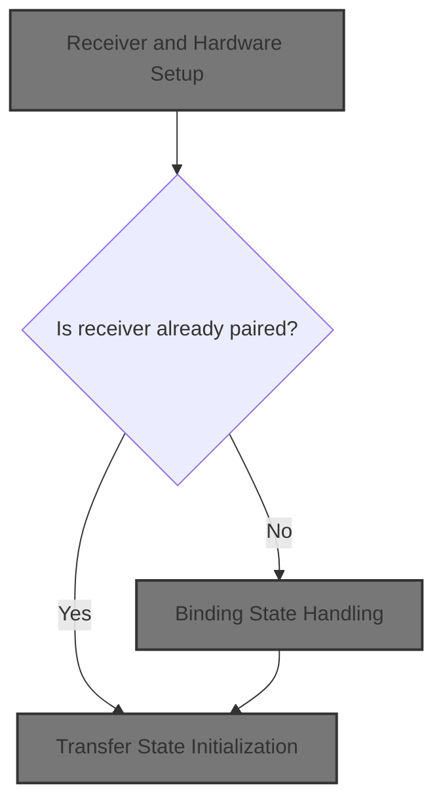

This document describes how the receiver is prepared to communicate with a transmitter. The process starts with hardware and configuration setup, checks if the receiver is already paired, and either initializes data transfer or enters binding mode as needed.



# Receiver and Hardware Setup

<SwmSnippet path="/src/main/rx/cyrf6936_spektrum.c" line="320">

---

In <SwmToken path="src/main/rx/cyrf6936_spektrum.c" pos="320:2:2" line-data="bool spektrumSpiInit(const struct rxSpiConfig_s *rxConfig, struct rxRuntimeState_s *rxRuntimeState, rxSpiExtiConfig_t *extiConfig)">`spektrumSpiInit`</SwmToken> we kick off the receiver setup: check if SPI EXTI is configured, set up IO, set the channel count, configure interrupts, initialize the RF chip, and set up RSSI if needed. We also handle telemetry timing if enabled. The key decision is whether the receiver is already bound (checked via manufacturer ID): if so, we copy the ID and jump straight to starting the transfer with <SwmToken path="src/main/rx/cyrf6936_spektrum.c" pos="354:1:1" line-data="        dsmReceiverStartTransfer();">`dsmReceiverStartTransfer`</SwmToken>. If not, we’ll handle binding instead. Calling <SwmToken path="src/main/rx/cyrf6936_spektrum.c" pos="354:1:1" line-data="        dsmReceiverStartTransfer();">`dsmReceiverStartTransfer`</SwmToken> here is what actually gets the receiver ready to start handling data packets if binding isn’t needed.

```c
bool spektrumSpiInit(const struct rxSpiConfig_s *rxConfig, struct rxRuntimeState_s *rxRuntimeState, rxSpiExtiConfig_t *extiConfig)
{
    UNUSED(extiConfig);

    if (!rxSpiExtiConfigured()) {
        return false;
    }

    rxSpiCommonIOInit(rxConfig);

    rxRuntimeState->channelCount = DSM_MAX_CHANNEL_COUNT;

    extiConfig->ioConfig = IOCFG_IPD;
    extiConfig->trigger = BETAFLIGHT_EXTI_TRIGGER_FALLING;

    if (!cyrf6936Init()) {
        return false;
    }

    if (rssiSource == RSSI_SOURCE_NONE) {
        rssiSource = RSSI_SOURCE_RX_PROTOCOL;
    }

    cyrf6936SetConfigLen(cyrf6936Config, ARRAYLEN(cyrf6936Config));

#ifdef USE_RX_SPEKTRUM_TELEMETRY
    dsmReceiver.timeLastTelemetry = micros() + DSM_TELEMETRY_TIME_US;
    dsmReceiver.sendTelemetry = false;
#endif

    if (spektrumConfig()->mfgId[0] || spektrumConfig()->mfgId[1]
        || spektrumConfig()->mfgId[2] || spektrumConfig()->mfgId[3]) {
        dsmReceiver.bound = true;
        memcpy(dsmReceiver.mfgId, spektrumConfig()->mfgId, 4);
        dsmReceiverStartTransfer();
    } else {
```

---

</SwmSnippet>

## Transfer State Initialization

<SwmSnippet path="/src/main/rx/cyrf6936_spektrum.c" line="291">

---

In <SwmToken path="src/main/rx/cyrf6936_spektrum.c" pos="291:4:4" line-data="static void dsmReceiverStartTransfer(void)">`dsmReceiverStartTransfer`</SwmToken> we reset the receiver state, set up the hardware config, pull in the number of channels and protocol, and calculate CRC and packet indices from the manufacturer ID. If we're using DSMX, we generate the channel list, set the index, and call <SwmToken path="src/main/rx/cyrf6936_spektrum.c" pos="309:1:1" line-data="        dsmReceiverSetNextChannel();">`dsmReceiverSetNextChannel`</SwmToken> to move to the right channel. This is needed to get the receiver on the correct frequency for DSMX operation.

```c
static void dsmReceiverStartTransfer(void)
{
    dsmReceiver.status = DSM_RECEIVER_SYNC_A;
    dsmReceiver.rfChannelIdx = 0;
    dsmReceiver.missedPackets = 0;

    cyrf6936SetConfigLen(cyrf6936TransferConfig, ARRAYLEN(cyrf6936TransferConfig));

    dsmReceiver.numChannels = spektrumConfig()->numChannels;
    dsmReceiver.protocol = spektrumConfig()->protocol;

    dsmReceiver.crcSeed = ~((dsmReceiver.mfgId[0] << 8) + dsmReceiver.mfgId[1]);
    dsmReceiver.sopCol = (dsmReceiver.mfgId[0] + dsmReceiver.mfgId[1] + dsmReceiver.mfgId[2] + 2) & 0x07;
    dsmReceiver.dataCol = 7 - dsmReceiver.sopCol;

    if (IS_DSMX(dsmReceiver.protocol)) {
        dsmGenerateDsmxChannels();
        dsmReceiver.rfChannelIdx = 22;
        dsmReceiverSetNextChannel();
    } else {
```

---

</SwmSnippet>

### RF Channel Cycling

```mermaid
%%{init: {"flowchart": {"defaultRenderer": "elk"}} }%%
flowchart TD
    node1{"Is protocol DSM2?"}
    click node1 openCode "src/main/rx/cyrf6936_spektrum.c:257:257"
    node1 -->|"Yes"| node2["Update channel index (toggle between 2 channels)"]
    click node2 openCode "src/main/rx/cyrf6936_spektrum.c:257:257"
    node1 -->|"No"| node3["Update channel index (cycle through 23 channels)"]
    click node3 openCode "src/main/rx/cyrf6936_spektrum.c:257:257"
    node2 --> node4["Invert integrity seed"]
    node3 --> node4
    click node4 openCode "src/main/rx/cyrf6936_spektrum.c:258:258"
    node4 --> node5["Select new radio channel"]
    click node5 openCode "src/main/rx/cyrf6936_spektrum.c:259:259"
    node5 --> node6["Apply new channel settings"]
    click node6 openCode "src/main/rx/cyrf6936_spektrum.c:260:260"
classDef HeadingStyle fill:#777777,stroke:#333,stroke-width:2px;

%% Swimm:
%% %%{init: {"flowchart": {"defaultRenderer": "elk"}} }%%
%% flowchart TD
%%     node1{"Is protocol DSM2?"}
%%     click node1 openCode "<SwmPath>[src/…/rx/cyrf6936_spektrum.c](src/main/rx/cyrf6936_spektrum.c)</SwmPath>:257:257"
%%     node1 -->|"Yes"| node2["Update channel index (toggle between 2 channels)"]
%%     click node2 openCode "<SwmPath>[src/…/rx/cyrf6936_spektrum.c](src/main/rx/cyrf6936_spektrum.c)</SwmPath>:257:257"
%%     node1 -->|"No"| node3["Update channel index (cycle through 23 channels)"]
%%     click node3 openCode "<SwmPath>[src/…/rx/cyrf6936_spektrum.c](src/main/rx/cyrf6936_spektrum.c)</SwmPath>:257:257"
%%     node2 --> node4["Invert integrity seed"]
%%     node3 --> node4
%%     click node4 openCode "<SwmPath>[src/…/rx/cyrf6936_spektrum.c](src/main/rx/cyrf6936_spektrum.c)</SwmPath>:258:258"
%%     node4 --> node5["Select new radio channel"]
%%     click node5 openCode "<SwmPath>[src/…/rx/cyrf6936_spektrum.c](src/main/rx/cyrf6936_spektrum.c)</SwmPath>:259:259"
%%     node5 --> node6["Apply new channel settings"]
%%     click node6 openCode "<SwmPath>[src/…/rx/cyrf6936_spektrum.c](src/main/rx/cyrf6936_spektrum.c)</SwmPath>:260:260"
%% classDef HeadingStyle fill:#777777,stroke:#333,stroke-width:2px;
```



<SwmSnippet path="/src/main/rx/cyrf6936_spektrum.c" line="255">

---

<SwmToken path="src/main/rx/cyrf6936_spektrum.c" pos="255:4:4" line-data="static void dsmReceiverSetNextChannel(void)">`dsmReceiverSetNextChannel`</SwmToken> bumps the channel index (2 or 23 depending on protocol), toggles the CRC seed, updates the current RF channel, and then calls <SwmToken path="src/main/rx/cyrf6936_spektrum.c" pos="260:1:1" line-data="    dsmSetChannel(dsmReceiver.rfChannel, dsmReceiver.sopCol, dsmReceiver.dataCol, dsmReceiver.crcSeed);">`dsmSetChannel`</SwmToken> to actually program the hardware with the new channel and CRC. This keeps the receiver in sync with the expected channel hopping.

```c
static void dsmReceiverSetNextChannel(void)
{
    dsmReceiver.rfChannelIdx = IS_DSM2(dsmReceiver.protocol) ? (dsmReceiver.rfChannelIdx + 1) % 2 : (dsmReceiver.rfChannelIdx + 1) % 23;
    dsmReceiver.crcSeed = ~dsmReceiver.crcSeed;
    dsmReceiver.rfChannel = dsmReceiver.rfChannels[dsmReceiver.rfChannelIdx];
    dsmSetChannel(dsmReceiver.rfChannel, dsmReceiver.sopCol, dsmReceiver.dataCol, dsmReceiver.crcSeed);
}
```

---

</SwmSnippet>

<SwmSnippet path="/src/main/rx/cyrf6936_spektrum.c" line="237">

---

<SwmToken path="src/main/rx/cyrf6936_spektrum.c" pos="237:4:4" line-data="static void dsmSetChannel(const uint8_t channel, const uint8_t sopCol, const uint8_t dataCol, const uint16_t crcSeed)">`dsmSetChannel`</SwmToken> figures out which row of the <SwmToken path="src/main/rx/cyrf6936_spektrum.c" pos="242:3:3" line-data="    cyrf6936SetSopCode(pnCodes[pnRow][sopCol]);">`pnCodes`</SwmToken> array to use based on protocol and channel, then sets the CRC seed, SOP code, data code, and the channel on the hardware. This lines up all the protocol-specific parameters for the next packet.

```c
static void dsmSetChannel(const uint8_t channel, const uint8_t sopCol, const uint8_t dataCol, const uint16_t crcSeed)
{
    const uint8_t pnRow = IS_DSM2(dsmReceiver.protocol) ? channel % 5 : (channel - 2) % 5;

    cyrf6936SetCrcSeed(crcSeed);
    cyrf6936SetSopCode(pnCodes[pnRow][sopCol]);
    cyrf6936SetDataCode(pnCodes[pnRow][dataCol]);

    cyrf6936SetChannel(channel);
}
```

---

</SwmSnippet>

### Sync Channel Setup (Non-DSMX)

```mermaid
%%{init: {"flowchart": {"defaultRenderer": "elk"}} }%%
flowchart TD
    node1["Reset all receiver channels to prepare for new data transfer"]
    click node1 openCode "src/main/rx/cyrf6936_spektrum.c:311:311"
    node1 --> node2["Advance to next synchronization channel for robust communication"]
    click node2 openCode "src/main/rx/cyrf6936_spektrum.c:312:313"
    node2 --> node3["Record current time as start of listening window"]
    click node3 openCode "src/main/rx/cyrf6936_spektrum.c:315:315"
    node3 --> node4["Set timeout for how long to wait for synchronization"]
    click node4 openCode "src/main/rx/cyrf6936_spektrum.c:316:316"
    node4 --> node5["Begin listening for incoming data packets"]
    click node5 openCode "src/main/rx/cyrf6936_spektrum.c:317:317"

classDef HeadingStyle fill:#777777,stroke:#333,stroke-width:2px;

%% Swimm:
%% %%{init: {"flowchart": {"defaultRenderer": "elk"}} }%%
%% flowchart TD
%%     node1["Reset all receiver channels to prepare for new data transfer"]
%%     click node1 openCode "<SwmPath>[src/…/rx/cyrf6936_spektrum.c](src/main/rx/cyrf6936_spektrum.c)</SwmPath>:311:311"
%%     node1 --> node2["Advance to next synchronization channel for robust communication"]
%%     click node2 openCode "<SwmPath>[src/…/rx/cyrf6936_spektrum.c](src/main/rx/cyrf6936_spektrum.c)</SwmPath>:312:313"
%%     node2 --> node3["Record current time as start of listening window"]
%%     click node3 openCode "<SwmPath>[src/…/rx/cyrf6936_spektrum.c](src/main/rx/cyrf6936_spektrum.c)</SwmPath>:315:315"
%%     node3 --> node4["Set timeout for how long to wait for synchronization"]
%%     click node4 openCode "<SwmPath>[src/…/rx/cyrf6936_spektrum.c](src/main/rx/cyrf6936_spektrum.c)</SwmPath>:316:316"
%%     node4 --> node5["Begin listening for incoming data packets"]
%%     click node5 openCode "<SwmPath>[src/…/rx/cyrf6936_spektrum.c](src/main/rx/cyrf6936_spektrum.c)</SwmPath>:317:317"
%% 
%% classDef HeadingStyle fill:#777777,stroke:#333,stroke-width:2px;
```



<SwmSnippet path="/src/main/rx/cyrf6936_spektrum.c" line="311">

---

Back in <SwmToken path="src/main/rx/cyrf6936_spektrum.c" pos="291:4:4" line-data="static void dsmReceiverStartTransfer(void)">`dsmReceiverStartTransfer`</SwmToken>, after handling DSMX, if we're not using DSMX, we clear out the RF channels and call <SwmToken path="src/main/rx/cyrf6936_spektrum.c" pos="312:1:1" line-data="        dsmReceiverSetNextSyncChannel();">`dsmReceiverSetNextSyncChannel`</SwmToken> to set up the next sync channel. This gets the receiver ready for the next packet in non-DSMX modes.

```c
        memset(dsmReceiver.rfChannels, 0, 23);
        dsmReceiverSetNextSyncChannel();
    }

```

---

</SwmSnippet>

<SwmSnippet path="/src/main/rx/cyrf6936_spektrum.c" line="248">

---

<SwmToken path="src/main/rx/cyrf6936_spektrum.c" pos="248:4:4" line-data="static void dsmReceiverSetNextSyncChannel(void)">`dsmReceiverSetNextSyncChannel`</SwmToken> flips the CRC seed, bumps the RF channel (wrapping around if needed), and then calls <SwmToken path="src/main/rx/cyrf6936_spektrum.c" pos="252:1:1" line-data="    dsmSetChannel(dsmReceiver.rfChannel, dsmReceiver.sopCol, dsmReceiver.dataCol, dsmReceiver.crcSeed);">`dsmSetChannel`</SwmToken> to update the hardware for the next sync attempt. This keeps the receiver in sync with the transmitter's hopping pattern.

```c
static void dsmReceiverSetNextSyncChannel(void)
{
    dsmReceiver.crcSeed = ~dsmReceiver.crcSeed;
    dsmReceiver.rfChannel = (dsmReceiver.rfChannel + 1) % DSM_MAX_RF_CHANNEL;
    dsmSetChannel(dsmReceiver.rfChannel, dsmReceiver.sopCol, dsmReceiver.dataCol, dsmReceiver.crcSeed);
}
```

---

</SwmSnippet>

<SwmSnippet path="/src/main/rx/cyrf6936_spektrum.c" line="315">

---

Back in <SwmToken path="src/main/rx/cyrf6936_spektrum.c" pos="291:4:4" line-data="static void dsmReceiverStartTransfer(void)">`dsmReceiverStartTransfer`</SwmToken>, after setting up channels (including the sync channel for non-DSMX), we record the current time, set the timeout, and finally start the hardware receiver with <SwmToken path="src/main/rx/cyrf6936_spektrum.c" pos="317:1:1" line-data="    cyrf6936StartRecv();">`cyrf6936StartRecv`</SwmToken>. This puts the receiver into listening mode.

```c
    dsmReceiver.timeLastPacket = micros();
    dsmReceiver.timeout = DSM_SYNC_TIMEOUT_US << 2;
    cyrf6936StartRecv();
}
```

---

</SwmSnippet>

## Binding State Handling

<SwmSnippet path="/src/main/rx/cyrf6936_spektrum.c" line="356">

---

Back in <SwmToken path="src/main/rx/cyrf6936_spektrum.c" pos="320:2:2" line-data="bool spektrumSpiInit(const struct rxSpiConfig_s *rxConfig, struct rxRuntimeState_s *rxRuntimeState, rxSpiExtiConfig_t *extiConfig)">`spektrumSpiInit`</SwmToken>, if the manufacturer ID is all zero (not bound), we skip starting the transfer and instead call <SwmToken path="src/main/rx/cyrf6936_spektrum.c" pos="357:1:1" line-data="        dsmReceiverStartBind();">`dsmReceiverStartBind`</SwmToken> to kick off the binding process. This is how the receiver gets paired with a transmitter if it hasn't been already.

```c
        dsmReceiver.bound = false;
        dsmReceiverStartBind();
    }

    return true;
}
```

---

</SwmSnippet>

<SwmSnippet path="/src/main/rx/cyrf6936_spektrum.c" line="273">

---

<SwmToken path="src/main/rx/cyrf6936_spektrum.c" pos="273:4:4" line-data="static void dsmReceiverStartBind(void)">`dsmReceiverStartBind`</SwmToken> sets the receiver to binding mode, configures the RF chip for binding, copies the PN code twice into the data buffer (protocol requirement), sets the initial bind channel and timeout, and starts the receiver. This gets the hardware ready to pair with a transmitter.

```c
static void dsmReceiverStartBind(void)
{
    uint8_t dataCode[16];
    dsmReceiver.status = DSM_RECEIVER_BIND;

    cyrf6936SetConfigLen(cyrf6936BindConfig, ARRAYLEN(cyrf6936BindConfig));

    memcpy(dataCode, pnCodes[0][8], 8);
    memcpy(dataCode + 8, pnCodes[0][8], 8);
    cyrf6936SetDataCode(dataCode);

    dsmReceiver.rfChannel = DSM_INITIAL_BIND_CHANNEL;
    cyrf6936SetChannel(dsmReceiver.rfChannel);
    dsmReceiver.timeLastPacket = micros();
    dsmReceiver.timeout = DSM_BIND_TIMEOUT_US;
    cyrf6936StartRecv();
}
```

---

</SwmSnippet>

&nbsp;

*This is an auto-generated document by Swimm 🌊 and has not yet been verified by a human*

<SwmMeta version="3.0.0" repo-id="Z2l0aHViJTNBJTNBYy1iZXRhZmxpZ2h0JTNBJTNBcmljYXJkb2xvcGV6Zw==" repo-name="c-betaflight"><sup>Powered by [Swimm](https://app.swimm.io/)</sup></SwmMeta>
