This document describes how the receiver is initialized and prepared to receive data according to the selected protocol. The process involves setting up the receiver state, determining the protocol type, configuring channels, and starting the receiver to ensure reliable communication for flight control.

# Where is this flow used?

This flow is used multiple times in the codebase as represented in the following diagram:

```mermaid
graph TD;
      51ac66e139c1534bb7c7f01b66fa1eaf23145f580ed79c6cf6f5ec8e977aa239(src/…/rx/cyrf6936_spektrum.c::spektrumSpiInit) --> 06e8f4403f396c96c2ae269964ee2613fcb8d90da157b5194454e3ddb0739e8c(src/…/rx/cyrf6936_spektrum.c::dsmReceiverStartTransfer):::mainFlowStyle

47499343c8f9705d6761ddd1552039250682aea44343a2845b9594fb7473a52a(src/…/rx/cyrf6936_spektrum.c::checkTimeout) --> 06e8f4403f396c96c2ae269964ee2613fcb8d90da157b5194454e3ddb0739e8c(src/…/rx/cyrf6936_spektrum.c::dsmReceiverStartTransfer):::mainFlowStyle

70be1d0091a628d988a0b8348a1fe94289e662fdd09a8c9a157c4a0e2b607bb4(src/…/rx/cyrf6936_spektrum.c::spektrumSpiDataReceived) --> 47499343c8f9705d6761ddd1552039250682aea44343a2845b9594fb7473a52a(src/…/rx/cyrf6936_spektrum.c::checkTimeout)


classDef mainFlowStyle color:#000000,fill:#7CB9F4
classDef rootsStyle color:#000000,fill:#00FFF4
classDef Style1 color:#000000,fill:#00FFAA
classDef Style2 color:#000000,fill:#FFFF00
classDef Style3 color:#000000,fill:#AA7CB9

%% Swimm:
%% graph TD;
%%       51ac66e139c1534bb7c7f01b66fa1eaf23145f580ed79c6cf6f5ec8e977aa239(<SwmPath>[src/…/rx/cyrf6936_spektrum.c](src/main/rx/cyrf6936_spektrum.c)</SwmPath>::<SwmToken path="src/main/rx/cyrf6936_spektrum.c" pos="320:2:2" line-data="bool spektrumSpiInit(const struct rxSpiConfig_s *rxConfig, struct rxRuntimeState_s *rxRuntimeState, rxSpiExtiConfig_t *extiConfig)">`spektrumSpiInit`</SwmToken>) --> 06e8f4403f396c96c2ae269964ee2613fcb8d90da157b5194454e3ddb0739e8c(<SwmPath>[src/…/rx/cyrf6936_spektrum.c](src/main/rx/cyrf6936_spektrum.c)</SwmPath>::<SwmToken path="src/main/rx/cyrf6936_spektrum.c" pos="291:4:4" line-data="static void dsmReceiverStartTransfer(void)">`dsmReceiverStartTransfer`</SwmToken>):::mainFlowStyle
%% 
%% 47499343c8f9705d6761ddd1552039250682aea44343a2845b9594fb7473a52a(<SwmPath>[src/…/rx/cyrf6936_spektrum.c](src/main/rx/cyrf6936_spektrum.c)</SwmPath>::<SwmToken path="src/main/rx/cyrf6936_spektrum.c" pos="403:4:4" line-data="static void checkTimeout(void)">`checkTimeout`</SwmToken>) --> 06e8f4403f396c96c2ae269964ee2613fcb8d90da157b5194454e3ddb0739e8c(<SwmPath>[src/…/rx/cyrf6936_spektrum.c](src/main/rx/cyrf6936_spektrum.c)</SwmPath>::<SwmToken path="src/main/rx/cyrf6936_spektrum.c" pos="291:4:4" line-data="static void dsmReceiverStartTransfer(void)">`dsmReceiverStartTransfer`</SwmToken>):::mainFlowStyle
%% 
%% 70be1d0091a628d988a0b8348a1fe94289e662fdd09a8c9a157c4a0e2b607bb4(<SwmPath>[src/…/rx/cyrf6936_spektrum.c](src/main/rx/cyrf6936_spektrum.c)</SwmPath>::<SwmToken path="src/main/rx/cyrf6936_spektrum.c" pos="643:2:2" line-data="rx_spi_received_e spektrumSpiDataReceived(uint8_t *payload)">`spektrumSpiDataReceived`</SwmToken>) --> 47499343c8f9705d6761ddd1552039250682aea44343a2845b9594fb7473a52a(<SwmPath>[src/…/rx/cyrf6936_spektrum.c](src/main/rx/cyrf6936_spektrum.c)</SwmPath>::<SwmToken path="src/main/rx/cyrf6936_spektrum.c" pos="403:4:4" line-data="static void checkTimeout(void)">`checkTimeout`</SwmToken>)
%% 
%% 
%% classDef mainFlowStyle color:#000000,fill:#7CB9F4
%% classDef rootsStyle color:#000000,fill:#00FFF4
%% classDef Style1 color:#000000,fill:#00FFAA
%% classDef Style2 color:#000000,fill:#FFFF00
%% classDef Style3 color:#000000,fill:#AA7CB9
```



# Receiver State and Channel Setup

<SwmSnippet path="/src/main/rx/cyrf6936_spektrum.c" line="291">

---

In <SwmToken path="src/main/rx/cyrf6936_spektrum.c" pos="291:4:4" line-data="static void dsmReceiverStartTransfer(void)">`dsmReceiverStartTransfer`</SwmToken>, we set up the receiver state, reset counters, configure hardware, and prep protocol-specific channel and CRC parameters. The protocol check (DSMX vs DSM2) decides if we generate DSMX channels and set the next channel, or clear channels and sync differently. We call <SwmToken path="src/main/rx/cyrf6936_spektrum.c" pos="309:1:1" line-data="        dsmReceiverSetNextChannel();">`dsmReceiverSetNextChannel`</SwmToken> next to actually apply the first channel setup for DSMX, which is needed before any data transfer can happen.

```c
static void dsmReceiverStartTransfer(void)
{
    dsmReceiver.status = DSM_RECEIVER_SYNC_A;
    dsmReceiver.rfChannelIdx = 0;
    dsmReceiver.missedPackets = 0;

    cyrf6936SetConfigLen(cyrf6936TransferConfig, ARRAYLEN(cyrf6936TransferConfig));

    dsmReceiver.numChannels = spektrumConfig()->numChannels;
    dsmReceiver.protocol = spektrumConfig()->protocol;

    dsmReceiver.crcSeed = ~((dsmReceiver.mfgId[0] << 8) + dsmReceiver.mfgId[1]);
    dsmReceiver.sopCol = (dsmReceiver.mfgId[0] + dsmReceiver.mfgId[1] + dsmReceiver.mfgId[2] + 2) & 0x07;
    dsmReceiver.dataCol = 7 - dsmReceiver.sopCol;

    if (IS_DSMX(dsmReceiver.protocol)) {
        dsmGenerateDsmxChannels();
        dsmReceiver.rfChannelIdx = 22;
        dsmReceiverSetNextChannel();
    } else {
```

---

</SwmSnippet>

## Channel Cycling and Hardware Update


<SwmSnippet path="/src/main/rx/cyrf6936_spektrum.c" line="255">

---

<SwmToken path="src/main/rx/cyrf6936_spektrum.c" pos="255:4:4" line-data="static void dsmReceiverSetNextChannel(void)">`dsmReceiverSetNextChannel`</SwmToken> bumps the channel index (using 2 or 23 depending on protocol), flips the CRC seed, updates the current RF channel, and then calls <SwmToken path="src/main/rx/cyrf6936_spektrum.c" pos="260:1:1" line-data="    dsmSetChannel(dsmReceiver.rfChannel, dsmReceiver.sopCol, dsmReceiver.dataCol, dsmReceiver.crcSeed);">`dsmSetChannel`</SwmToken> to push these new settings to the hardware. This keeps the receiver in sync with the protocol's channel hopping requirements.

```c
static void dsmReceiverSetNextChannel(void)
{
    dsmReceiver.rfChannelIdx = IS_DSM2(dsmReceiver.protocol) ? (dsmReceiver.rfChannelIdx + 1) % 2 : (dsmReceiver.rfChannelIdx + 1) % 23;
    dsmReceiver.crcSeed = ~dsmReceiver.crcSeed;
    dsmReceiver.rfChannel = dsmReceiver.rfChannels[dsmReceiver.rfChannelIdx];
    dsmSetChannel(dsmReceiver.rfChannel, dsmReceiver.sopCol, dsmReceiver.dataCol, dsmReceiver.crcSeed);
}
```

---

</SwmSnippet>

<SwmSnippet path="/src/main/rx/cyrf6936_spektrum.c" line="237">

---

<SwmToken path="src/main/rx/cyrf6936_spektrum.c" pos="237:4:4" line-data="static void dsmSetChannel(const uint8_t channel, const uint8_t sopCol, const uint8_t dataCol, const uint16_t crcSeed)">`dsmSetChannel`</SwmToken> picks the right codes from <SwmToken path="src/main/rx/cyrf6936_spektrum.c" pos="242:3:3" line-data="    cyrf6936SetSopCode(pnCodes[pnRow][sopCol]);">`pnCodes`</SwmToken> and updates the hardware config in the right order.

```c
static void dsmSetChannel(const uint8_t channel, const uint8_t sopCol, const uint8_t dataCol, const uint16_t crcSeed)
{
    const uint8_t pnRow = IS_DSM2(dsmReceiver.protocol) ? channel % 5 : (channel - 2) % 5;

    cyrf6936SetCrcSeed(crcSeed);
    cyrf6936SetSopCode(pnCodes[pnRow][sopCol]);
    cyrf6936SetDataCode(pnCodes[pnRow][dataCol]);

    cyrf6936SetChannel(channel);
}
```

---

</SwmSnippet>

## Fallback Sync Channel Setup

<SwmSnippet path="/src/main/rx/cyrf6936_spektrum.c" line="311">

---

Back in <SwmToken path="src/main/rx/cyrf6936_spektrum.c" pos="291:4:4" line-data="static void dsmReceiverStartTransfer(void)">`dsmReceiverStartTransfer`</SwmToken>, if we're not using DSMX, we clear out the channel array and call <SwmToken path="src/main/rx/cyrf6936_spektrum.c" pos="312:1:1" line-data="        dsmReceiverSetNextSyncChannel();">`dsmReceiverSetNextSyncChannel`</SwmToken> to set up a sync channel for protocols like DSM2. This is needed to get the receiver on the right channel for initial sync.

```c
        memset(dsmReceiver.rfChannels, 0, 23);
        dsmReceiverSetNextSyncChannel();
    }

```

---

</SwmSnippet>

<SwmSnippet path="/src/main/rx/cyrf6936_spektrum.c" line="248">

---

<SwmToken path="src/main/rx/cyrf6936_spektrum.c" pos="248:4:4" line-data="static void dsmReceiverSetNextSyncChannel(void)">`dsmReceiverSetNextSyncChannel`</SwmToken> flips the CRC seed, cycles the RF channel with wrap-around, and then calls <SwmToken path="src/main/rx/cyrf6936_spektrum.c" pos="252:1:1" line-data="    dsmSetChannel(dsmReceiver.rfChannel, dsmReceiver.sopCol, dsmReceiver.dataCol, dsmReceiver.crcSeed);">`dsmSetChannel`</SwmToken> to update the hardware with the new sync channel and CRC. This keeps the receiver moving through channels for sync.

```c
static void dsmReceiverSetNextSyncChannel(void)
{
    dsmReceiver.crcSeed = ~dsmReceiver.crcSeed;
    dsmReceiver.rfChannel = (dsmReceiver.rfChannel + 1) % DSM_MAX_RF_CHANNEL;
    dsmSetChannel(dsmReceiver.rfChannel, dsmReceiver.sopCol, dsmReceiver.dataCol, dsmReceiver.crcSeed);
}
```

---

</SwmSnippet>

<SwmSnippet path="/src/main/rx/cyrf6936_spektrum.c" line="315">

---

Back in <SwmToken path="src/main/rx/cyrf6936_spektrum.c" pos="291:4:4" line-data="static void dsmReceiverStartTransfer(void)">`dsmReceiverStartTransfer`</SwmToken>, after setting up the channels (including sync for non-DSMX), we set the last packet time, adjust the timeout, and finally start the hardware receiver. This gets the receiver ready and listening with the right config.

```c
    dsmReceiver.timeLastPacket = micros();
    dsmReceiver.timeout = DSM_SYNC_TIMEOUT_US << 2;
    cyrf6936StartRecv();
}
```

---

</SwmSnippet>

&nbsp;

*This is an auto-generated document by Swimm 🌊 and has not yet been verified by a human*

<SwmMeta version="3.0.0" repo-id="Z2l0aHViJTNBJTNBYy1iZXRhZmxpZ2h0JTNBJTNBcmljYXJkb2xvcGV6Zw==" repo-name="c-betaflight"><sup>Powered by [Swimm](https://app.swimm.io/)</sup></SwmMeta>
