This document describes how the receiver system is initialized for flight control. Configuration and enabled features are used to select the receiver protocol, set up the provider, and configure RC channels and signal processing. Safe startup conditions are ensured, and the RSSI source is selected for stable telemetry. The result is a receiver system ready to process input signals.

# Receiver Initialization and Provider Dispatch

```mermaid
%%{init: {"flowchart": {"defaultRenderer": "elk"}} }%%
flowchart TD
    node1["Start receiver initialization"]
    click node1 openCode "src/main/rx/rx.c:284:285"
    node1 --> node2{"Which receiver input method is enabled?"}
    click node2 openCode "src/main/rx/rx.c:286:298"
    node2 -->|"PWM"| node3["Set receiver to PWM"]
    node2 -->|"PPM"| node4["Set receiver to PPM"]
    node2 -->|"Serial"| node5["Set receiver to Serial"]
    node2 -->|"MSP"| node6["Set receiver to MSP"]
    node2 -->|"SPI"| node7["Set receiver to SPI"]
    node2 -->|"None"| node8["Set receiver to None"]
    node3 --> node9["Initialize RC channels and signal processing"]
    node4 --> node9
    node5 --> node9
    node6 --> node9
    node7 --> node9
    node8 --> node9
    subgraph loop1["For each RC channel"]
      node9["Set default value and timeout"]
      click node9 openCode "src/main/rx/rx.c:307:310"
    end
    node9 --> node10{"Is 3D flight mode enabled?"}
    click node10 openCode "src/main/rx/rx.c:312"
    node10 -->|"Yes"| node11["Set throttle to mid value"]
    click node11 openCode "src/main/rx/rx.c:312"
    node10 -->|"No"| node12["Set throttle to minimum value"]
    click node12 openCode "src/main/rx/rx.c:312"
    node11 --> node13["Initialize ARM switch channels if defined"]
    node12 --> node13
    subgraph loop2["For each mode activation condition"]
      node13["If ARM switch defined, set channel to OFF"]
      click node13 openCode "src/main/rx/rx.c:316:328"
    end
    node13 --> node14{"Which RSSI source is used?"}
    click node14 openCode "src/main/rx/rx.c:378:384"
    node14 -->|"ADC"| node15["Set RSSI source to ADC"]
    click node15 openCode "src/main/rx/rx.c:379:380"
    node14 -->|"RX Channel"| node16["Set RSSI source to RX channel"]
    click node16 openCode "src/main/rx/rx.c:382:383"
    node14 -->|"None"| node17["No RSSI source"]
    node15 --> node18["Setup signal filtering"]
    node16 --> node18
    node17 --> node18
    node18["Setup signal filtering"]
    click node18 openCode "src/main/rx/rx.c:387:393"
    node18 --> node19["Set number of RC channels"]
    click node19 openCode "src/main/rx/rx.c:402"

classDef HeadingStyle fill:#777777,stroke:#333,stroke-width:2px;

%% Swimm:
%% %%{init: {"flowchart": {"defaultRenderer": "elk"}} }%%
%% flowchart TD
%%     node1["Start receiver initialization"]
%%     click node1 openCode "<SwmPath>[src/…/rx/rx.c](src/main/rx/rx.c)</SwmPath>:284:285"
%%     node1 --> node2{"Which receiver input method is enabled?"}
%%     click node2 openCode "<SwmPath>[src/…/rx/rx.c](src/main/rx/rx.c)</SwmPath>:286:298"
%%     node2 -->|"PWM"| node3["Set receiver to PWM"]
%%     node2 -->|"PPM"| node4["Set receiver to PPM"]
%%     node2 -->|"Serial"| node5["Set receiver to Serial"]
%%     node2 -->|"MSP"| node6["Set receiver to MSP"]
%%     node2 -->|"SPI"| node7["Set receiver to SPI"]
%%     node2 -->|"None"| node8["Set receiver to None"]
%%     node3 --> node9["Initialize RC channels and signal processing"]
%%     node4 --> node9
%%     node5 --> node9
%%     node6 --> node9
%%     node7 --> node9
%%     node8 --> node9
%%     subgraph loop1["For each RC channel"]
%%       node9["Set default value and timeout"]
%%       click node9 openCode "<SwmPath>[src/…/rx/rx.c](src/main/rx/rx.c)</SwmPath>:307:310"
%%     end
%%     node9 --> node10{"Is 3D flight mode enabled?"}
%%     click node10 openCode "<SwmPath>[src/…/rx/rx.c](src/main/rx/rx.c)</SwmPath>:312"
%%     node10 -->|"Yes"| node11["Set throttle to mid value"]
%%     click node11 openCode "<SwmPath>[src/…/rx/rx.c](src/main/rx/rx.c)</SwmPath>:312"
%%     node10 -->|"No"| node12["Set throttle to minimum value"]
%%     click node12 openCode "<SwmPath>[src/…/rx/rx.c](src/main/rx/rx.c)</SwmPath>:312"
%%     node11 --> node13["Initialize ARM switch channels if defined"]
%%     node12 --> node13
%%     subgraph loop2["For each mode activation condition"]
%%       node13["If ARM switch defined, set channel to OFF"]
%%       click node13 openCode "<SwmPath>[src/…/rx/rx.c](src/main/rx/rx.c)</SwmPath>:316:328"
%%     end
%%     node13 --> node14{"Which RSSI source is used?"}
%%     click node14 openCode "<SwmPath>[src/…/rx/rx.c](src/main/rx/rx.c)</SwmPath>:378:384"
%%     node14 -->|"ADC"| node15["Set RSSI source to ADC"]
%%     click node15 openCode "<SwmPath>[src/…/rx/rx.c](src/main/rx/rx.c)</SwmPath>:379:380"
%%     node14 -->|"RX Channel"| node16["Set RSSI source to RX channel"]
%%     click node16 openCode "<SwmPath>[src/…/rx/rx.c](src/main/rx/rx.c)</SwmPath>:382:383"
%%     node14 -->|"None"| node17["No RSSI source"]
%%     node15 --> node18["Setup signal filtering"]
%%     node16 --> node18
%%     node17 --> node18
%%     node18["Setup signal filtering"]
%%     click node18 openCode "<SwmPath>[src/…/rx/rx.c](src/main/rx/rx.c)</SwmPath>:387:393"
%%     node18 --> node19["Set number of RC channels"]
%%     click node19 openCode "<SwmPath>[src/…/rx/rx.c](src/main/rx/rx.c)</SwmPath>:402"
%% 
%% classDef HeadingStyle fill:#777777,stroke:#333,stroke-width:2px;
```



<SwmSnippet path="/src/main/rx/rx.c" line="284">

---

In <SwmToken path="src/main/rx/rx.c" pos="284:2:2" line-data="void rxInit(void)">`rxInit`</SwmToken>, the flow starts by picking which receiver protocol to use based on enabled feature flags. It checks each protocol in a fixed priority order and sets the provider accordingly. This sets up the runtime state for all later receiver handling.

```c
void rxInit(void)
{
    if (featureIsEnabled(FEATURE_RX_PARALLEL_PWM)) {
        rxRuntimeState.rxProvider = RX_PROVIDER_PARALLEL_PWM;
    } else if (featureIsEnabled(FEATURE_RX_PPM)) {
        rxRuntimeState.rxProvider = RX_PROVIDER_PPM;
    } else if (featureIsEnabled(FEATURE_RX_SERIAL)) {
        rxRuntimeState.rxProvider = RX_PROVIDER_SERIAL;
    } else if (featureIsEnabled(FEATURE_RX_MSP)) {
        rxRuntimeState.rxProvider = RX_PROVIDER_MSP;
    } else if (featureIsEnabled(FEATURE_RX_SPI)) {
        rxRuntimeState.rxProvider = RX_PROVIDER_SPI;
    } else {
        rxRuntimeState.rxProvider = RX_PROVIDER_NONE;
    }
    rxRuntimeState.serialrxProvider = rxConfig()->serialrx_provider;
    rxRuntimeState.rcReadRawFn = nullReadRawRC;
    rxRuntimeState.rcFrameStatusFn = nullFrameStatus;
    rxRuntimeState.rcProcessFrameFn = nullProcessFrame;
    rxRuntimeState.lastRcFrameTimeUs = 0;              // zero when driver does not provide timing info
    rcSampleIndex = 0;

    uint32_t now = millis();
    for (int i = 0; i < MAX_SUPPORTED_RC_CHANNEL_COUNT; i++) {
        rcData[i] = rxConfig()->midrc;
        validRxSignalTimeout[i] = now + MAX_INVALID_PULSE_TIME_MS;
    }
```

---

</SwmSnippet>

<SwmSnippet path="/src/main/rx/rx.c" line="312">

---

After setting up the receiver provider, we make sure the ARM switch (if defined) starts in the OFF position by initializing its AUX channel value. This avoids accidental arming on boot.

```c
    rcData[THROTTLE] = (featureIsEnabled(FEATURE_3D)) ? rxConfig()->midrc : rxConfig()->rx_min_usec;

    // Initialize ARM switch to OFF position when arming via switch is defined
    // TODO - move to rc_mode.c
    for (int i = 0; i < MAX_MODE_ACTIVATION_CONDITION_COUNT; i++) {
        const modeActivationCondition_t *modeActivationCondition = modeActivationConditions(i);
        if (modeActivationCondition->modeId == BOXARM && IS_RANGE_USABLE(&modeActivationCondition->range)) {
            // ARM switch is defined, determine an OFF value
            float value;
            if (modeActivationCondition->range.startStep > 0) {
                value = MODE_STEP_TO_CHANNEL_VALUE((modeActivationCondition->range.startStep - 1));
            } else {
                value = MODE_STEP_TO_CHANNEL_VALUE((modeActivationCondition->range.endStep + 1));
            }
            // Initialize ARM AUX channel to OFF value
            rcData[modeActivationCondition->auxChannelIndex + NON_AUX_CHANNEL_COUNT] = value;
        }
    }
```

---

</SwmSnippet>

<SwmSnippet path="/src/main/rx/rx.c" line="331">

---

We call the right init function for the selected receiver protocol, and if it can't be set up, we use null handlers to keep things safe.

```c
    switch (rxRuntimeState.rxProvider) {
    default:

        break;
#ifdef USE_SERIALRX
    case RX_PROVIDER_SERIAL:
        {
            const bool enabled = serialRxInit(rxConfig(), &rxRuntimeState);
            if (!enabled) {
                rxRuntimeState.rcReadRawFn = nullReadRawRC;
                rxRuntimeState.rcFrameStatusFn = nullFrameStatus;
            }
        }

        break;
#endif

#ifdef USE_RX_MSP
```

---

</SwmSnippet>

<SwmSnippet path="/src/main/rx/rx.c" line="204">

---

<SwmToken path="src/main/rx/rx.c" pos="204:4:4" line-data="static bool serialRxInit(const rxConfig_t *rxConfig, rxRuntimeState_t *rxRuntimeState)">`serialRxInit`</SwmToken> picks the right serial RX protocol init function using a switch on the provider type, with each protocol only included if its compile flag is set. If the provider isn't supported, it just returns false.

```c
static bool serialRxInit(const rxConfig_t *rxConfig, rxRuntimeState_t *rxRuntimeState)
{
    bool enabled = false;
    switch (rxRuntimeState->serialrxProvider) {
#ifdef USE_SERIALRX_SRXL2
    case SERIALRX_SRXL2:
        enabled = srxl2RxInit(rxConfig, rxRuntimeState);
        break;
#endif
#ifdef USE_SERIALRX_SPEKTRUM
    case SERIALRX_SRXL:
    case SERIALRX_SPEKTRUM1024:
    case SERIALRX_SPEKTRUM2048:
        enabled = spektrumInit(rxConfig, rxRuntimeState);
        break;
#endif
#ifdef USE_SERIALRX_SBUS
    case SERIALRX_SBUS:
        enabled = sbusInit(rxConfig, rxRuntimeState);
        break;
#endif
#ifdef USE_SERIALRX_SUMD
    case SERIALRX_SUMD:
        enabled = sumdInit(rxConfig, rxRuntimeState);
        break;
#endif
#ifdef USE_SERIALRX_SUMH
    case SERIALRX_SUMH:
        enabled = sumhInit(rxConfig, rxRuntimeState);
        break;
#endif
#ifdef USE_SERIALRX_XBUS
    case SERIALRX_XBUS_MODE_B:
    case SERIALRX_XBUS_MODE_B_RJ01:
        enabled = xBusInit(rxConfig, rxRuntimeState);
        break;
#endif
#ifdef USE_SERIALRX_IBUS
    case SERIALRX_IBUS:
        enabled = ibusInit(rxConfig, rxRuntimeState);
        break;
#endif
#ifdef USE_SERIALRX_JETIEXBUS
    case SERIALRX_JETIEXBUS:
        enabled = jetiExBusInit(rxConfig, rxRuntimeState);
        break;
#endif
#ifdef USE_SERIALRX_CRSF
    case SERIALRX_CRSF:
        enabled = crsfRxInit(rxConfig, rxRuntimeState);
        break;
#endif
#ifdef USE_SERIALRX_GHST
    case SERIALRX_GHST:
        enabled = ghstRxInit(rxConfig, rxRuntimeState);
        break;
#endif
#ifdef USE_SERIALRX_TARGET_CUSTOM
    case SERIALRX_TARGET_CUSTOM:
        enabled = targetCustomSerialRxInit(rxConfig, rxRuntimeState);
        break;
#endif
#ifdef USE_SERIALRX_FPORT
    case SERIALRX_FPORT:
        enabled = fportRxInit(rxConfig, rxRuntimeState);
        break;
#endif
#ifdef USE_SERIALRX_MAVLINK
    case SERIALRX_MAVLINK:
        enabled = mavlinkRxInit(rxConfig, rxRuntimeState);
        break;
#endif
    default:
        enabled = false;
        break;
    }
    return enabled;
}
```

---

</SwmSnippet>

<SwmSnippet path="/src/main/rx/rx.c" line="349">

---

Back in <SwmToken path="src/main/rx/rx.c" pos="284:2:2" line-data="void rxInit(void)">`rxInit`</SwmToken>, after handling serial RX, we move on to other provider types. If SPI is selected, we call <SwmToken path="src/main/rx/rx.c" pos="358:9:9" line-data="            const bool enabled = rxSpiInit(rxSpiConfig(), &amp;rxRuntimeState);">`rxSpiInit`</SwmToken> to set up the SPI receiver. If it fails, we fall back to null handlers, just like with serial.

```c
    case RX_PROVIDER_MSP:
        rxMspInit(rxConfig(), &rxRuntimeState);

        break;
#endif

#ifdef USE_RX_SPI
    case RX_PROVIDER_SPI:
        {
            const bool enabled = rxSpiInit(rxSpiConfig(), &rxRuntimeState);
            if (!enabled) {
                rxRuntimeState.rcReadRawFn = nullReadRawRC;
                rxRuntimeState.rcFrameStatusFn = nullFrameStatus;
            }
        }

        break;
#endif

#if defined(USE_RX_PWM) || defined(USE_RX_PPM)
    case RX_PROVIDER_PPM:
```

---

</SwmSnippet>

<SwmSnippet path="/src/main/rx/rx_spi.c" line="248">

---

<SwmToken path="src/main/rx/rx_spi.c" pos="248:2:2" line-data="bool rxSpiInit(const rxSpiConfig_t *rxSpiConfig, rxRuntimeState_t *rxRuntimeState)">`rxSpiInit`</SwmToken> sets up the SPI receiver hardware, configures the protocol, and sets up external interrupts if needed. It also sets function pointers in the runtime state for SPI-specific receiver handling and enables dispatch.

```c
bool rxSpiInit(const rxSpiConfig_t *rxSpiConfig, rxRuntimeState_t *rxRuntimeState)
{
    bool ret = false;

    if (!rxSpiDeviceInit(rxSpiConfig)) {
        return false;
    }

    if (!rxSpiSetProtocol(rxSpiConfig->rx_spi_protocol)) {
        return false;
    }

    ret = protocolInit(rxSpiConfig, rxRuntimeState, &extiConfig);

    if (rxSpiExtiConfigured()) {
        rxSpiExtiInit(extiConfig.ioConfig, extiConfig.trigger);
    }

    rxSpiNewPacketAvailable = false;

    rxRuntimeState->rcReadRawFn = rxSpiReadRawRC;
    rxRuntimeState->rcFrameStatusFn = rxSpiFrameStatus;
    rxRuntimeState->rcProcessFrameFn = rxSpiProcessFrame;

    dispatchEnable();

    return ret;
}
```

---

</SwmSnippet>

<SwmSnippet path="/src/main/rx/rx.c" line="370">

---

After returning from <SwmToken path="src/main/rx/rx.c" pos="358:9:9" line-data="            const bool enabled = rxSpiInit(rxSpiConfig(), &amp;rxRuntimeState);">`rxSpiInit`</SwmToken> (or other provider init), <SwmToken path="src/main/rx/rx.c" pos="284:2:2" line-data="void rxInit(void)">`rxInit`</SwmToken> finishes by picking the RSSI source and setting up filters to smooth RSSI and error metrics. This keeps telemetry and OSD readings stable.

```c
    case RX_PROVIDER_PARALLEL_PWM:
        rxPwmInit(rxConfig(), &rxRuntimeState);

        break;
#endif
    }

#if defined(USE_ADC)
    if (featureIsEnabled(FEATURE_RSSI_ADC)) {
        rssiSource = RSSI_SOURCE_ADC;
    } else
#endif
    if (rxConfig()->rssi_channel > 0) {
        rssiSource = RSSI_SOURCE_RX_CHANNEL;
    }

    // Setup source frame RSSI filtering to take averaged values every FRAME_ERR_RESAMPLE_US
    pt1FilterInit(&frameErrFilter, pt1FilterGain(GET_FRAME_ERR_LPF_FREQUENCY(rxConfig()->rssi_src_frame_lpf_period), FRAME_ERR_RESAMPLE_US * 1e-6f));

    // Configurable amount of filtering to remove excessive jumpiness of the values on the osd
    float k = (256.0f - rxConfig()->rssi_smoothing) / 256.0f;

    pt1FilterInit(&rssiFilter, k);

#ifdef USE_RX_RSSI_DBM
    pt1FilterInit(&rssiDbmFilter, k);
#endif //USE_RX_RSSI_DBM

#ifdef USE_RX_RSNR
    pt1FilterInit(&rsnrFilter, k);
#endif //USE_RX_RSNR

    rxChannelCount = MIN(rxConfig()->max_aux_channel + NON_AUX_CHANNEL_COUNT, rxRuntimeState.channelCount);
}
```

---

</SwmSnippet>

&nbsp;

*This is an auto-generated document by Swimm 🌊 and has not yet been verified by a human*

<SwmMeta version="3.0.0" repo-id="Z2l0aHViJTNBJTNBYy1iZXRhZmxpZ2h0JTNBJTNBcmljYXJkb2xvcGV6Zw==" repo-name="c-betaflight"><sup>Powered by [Swimm](https://app.swimm.io/)</sup></SwmMeta>
