This document describes the process of recording profiling data for SD card operations. Profiling data is serialized and written as structured log entries to the SD card, enabling consistent performance monitoring and diagnostics.

# Serializing and Logging SD Card Profiling Data

<SwmSnippet path="/src/main/io/asyncfatfs/asyncfatfs.c" line="3585">

---

Afatfs_sdcardProfilerCallback starts the flow by serializing the operation, block index, and duration into a 16-byte buffer, padding unused bytes to maintain alignment. It checks if the log file is open, then calls <SwmToken path="src/main/io/asyncfatfs/asyncfatfs.c" pos="3622:1:1" line-data="    afatfs_fwrite(&amp;afatfs.introSpecLog, buffer, LOG_ENTRY_SIZE);">`afatfs_fwrite`</SwmToken> to write the serialized data. Using a fixed-size buffer avoids partial writes and keeps the log format consistent. Calling <SwmToken path="src/main/io/asyncfatfs/asyncfatfs.c" pos="3622:1:1" line-data="    afatfs_fwrite(&amp;afatfs.introSpecLog, buffer, LOG_ENTRY_SIZE);">`afatfs_fwrite`</SwmToken> here pushes the prepared log entry to storage, which is the main action of this callback.

```c
void afatfs_sdcardProfilerCallback(sdcardBlockOperation_e operation, uint32_t blockIndex, uint32_t duration)
{
    // Make sure the log file has actually been opened before we try to log to it:
    if (afatfs.introSpecLog.type == AFATFS_FILE_TYPE_NONE) {
        return;
    }

    enum {
        LOG_ENTRY_SIZE = 16 // Log entry size should be a power of two to avoid partial fwrites()
    };

    uint8_t buffer[LOG_ENTRY_SIZE];

    buffer[0] = operation;

    // Padding/reserved:
    buffer[1] = 0;
    buffer[2] = 0;
    buffer[3] = 0;

    buffer[4] = blockIndex & 0xFF;
    buffer[5] = (blockIndex >> 8) & 0xFF;
    buffer[6] = (blockIndex >> 16) & 0xFF;
    buffer[7] = (blockIndex >> 24) & 0xFF;

    buffer[8] = duration & 0xFF;
    buffer[9] = (duration >> 8) & 0xFF;
    buffer[10] = (duration >> 16) & 0xFF;
    buffer[11] = (duration >> 24) & 0xFF;

    // Padding/reserved:
    buffer[12] = 0;
    buffer[13] = 0;
    buffer[14] = 0;
    buffer[15] = 0;

    // Ignore write failures
    afatfs_fwrite(&afatfs.introSpecLog, buffer, LOG_ENTRY_SIZE);
}
```

---

</SwmSnippet>

# Writing Data to File in Sector-Aligned Chunks

<SwmSnippet path="/src/main/io/asyncfatfs/asyncfatfs.c" line="3104">

---

In <SwmToken path="src/main/io/asyncfatfs/asyncfatfs.c" pos="3104:2:2" line-data="uint32_t afatfs_fwrite(afatfsFilePtr_t file, const uint8_t *buffer, uint32_t len)">`afatfs_fwrite`</SwmToken>, we check file mode and busy state, then write data in sector-aligned chunks. Each chunk is locked for exclusive access, and after copying data, we call <SwmToken path="src/main/io/asyncfatfs/asyncfatfs.c" pos="3141:4:4" line-data="        if (afatfs_fseekInternal(file, bytesToWriteThisSector, NULL) == AFATFS_OPERATION_IN_PROGRESS) {">`afatfs_fseekInternal`</SwmToken> to advance the file cursor. If the seek is asynchronous, we pause writing until it's done. This keeps writes atomic and consistent with the file system's expectations.

```c
uint32_t afatfs_fwrite(afatfsFilePtr_t file, const uint8_t *buffer, uint32_t len)
{
    if ((file->mode & (AFATFS_FILE_MODE_APPEND | AFATFS_FILE_MODE_WRITE)) == 0) {
        return 0;
    }

    if (afatfs_fileIsBusy(file)) {
        // There might be a seek pending
        return 0;
    }

    uint32_t cursorOffsetInSector = file->cursorOffset % AFATFS_SECTOR_SIZE;
    uint32_t writtenBytes = 0;

    while (len > 0) {
        uint32_t bytesToWriteThisSector = MIN(AFATFS_SECTOR_SIZE - cursorOffsetInSector, len);
        uint8_t *sectorBuffer;

        sectorBuffer = afatfs_fileLockCursorSectorForWrite(file);
        if (!sectorBuffer) {
            // Cache is currently busy
            break;
        }

        memcpy(sectorBuffer + cursorOffsetInSector, buffer, bytesToWriteThisSector);

        writtenBytes += bytesToWriteThisSector;

        /*
         * If the seek doesn't complete immediately then we'll break and wait for that seek to complete by waiting for
         * the file to be non-busy on entry again.
         *
         * A seek operation should always be able to queue on the file since we have checked that the file wasn't busy
         * on entry (fseek will never return AFATFS_OPERATION_FAILURE).
         *
         * If the seek has to queue, when the seek completes, it'll update the fileSize for us to contain the cursor.
         */
        if (afatfs_fseekInternal(file, bytesToWriteThisSector, NULL) == AFATFS_OPERATION_IN_PROGRESS) {
            break;
        }

#ifdef AFATFS_USE_FREEFILE
```

---

</SwmSnippet>

## Advancing the File Cursor (Seek Logic)

<SwmSnippet path="/src/main/io/asyncfatfs/asyncfatfs.c" line="2080">

---

In <SwmToken path="src/main/io/asyncfatfs/asyncfatfs.c" pos="2080:4:4" line-data="static afatfsOperationStatus_e afatfs_fseekInternal(afatfsFilePtr_t file, uint32_t offset, afatfsFileCallback_t callback)">`afatfs_fseekInternal`</SwmToken>, we first try <SwmToken path="src/main/io/asyncfatfs/asyncfatfs.c" pos="2083:4:4" line-data="    if (afatfs_fseekAtomic(file, offset)) {">`afatfs_fseekAtomic`</SwmToken> to move the file cursor instantly. If it works, we can skip queuing and callback handling for asynchronous seeks. This keeps things fast when possible.

```c
static afatfsOperationStatus_e afatfs_fseekInternal(afatfsFilePtr_t file, uint32_t offset, afatfsFileCallback_t callback)
{
    // See if we can seek without queuing an operation
    if (afatfs_fseekAtomic(file, offset)) {
```

---

</SwmSnippet>

### Attempting an Immediate Cursor Update

See <SwmLink doc-title="Seeking Within Files in FAT Filesystem">[Seeking Within Files in FAT Filesystem](/.swm/seeking-within-files-in-fat-filesystem.xgo3nywn.sw.md)</SwmLink>

### Handling Seek Completion or Queuing

```mermaid
%%{init: {"flowchart": {"defaultRenderer": "elk"}} }%%
flowchart TD
    node1{"Is callback provided?"}
    click node1 openCode "src/main/io/asyncfatfs/asyncfatfs.c:2084:2084"
    node1 -->|"Yes"| node2["Invoke callback and confirm seek"]
    click node2 openCode "src/main/io/asyncfatfs/asyncfatfs.c:2085:2086"
    node2 --> node3["Return Success"]
    click node3 openCode "src/main/io/asyncfatfs/asyncfatfs.c:2088:2088"
    node1 -->|"No"| node4{"Is file busy?"}
    click node4 openCode "src/main/io/asyncfatfs/asyncfatfs.c:2091:2091"
    node4 -->|"Yes"| node5["Return Failure"]
    click node5 openCode "src/main/io/asyncfatfs/asyncfatfs.c:2092:2092"
    node4 -->|"No"| node6["Queue seek operation and set callback"]
    click node6 openCode "src/main/io/asyncfatfs/asyncfatfs.c:2095:2100"
    node6 --> node7["Return In Progress"]
    click node7 openCode "src/main/io/asyncfatfs/asyncfatfs.c:2101:2101"
classDef HeadingStyle fill:#777777,stroke:#333,stroke-width:2px;

%% Swimm:
%% %%{init: {"flowchart": {"defaultRenderer": "elk"}} }%%
%% flowchart TD
%%     node1{"Is callback provided?"}
%%     click node1 openCode "<SwmPath>[src/…/asyncfatfs/asyncfatfs.c](src/main/io/asyncfatfs/asyncfatfs.c)</SwmPath>:2084:2084"
%%     node1 -->|"Yes"| node2["Invoke callback and confirm seek"]
%%     click node2 openCode "<SwmPath>[src/…/asyncfatfs/asyncfatfs.c](src/main/io/asyncfatfs/asyncfatfs.c)</SwmPath>:2085:2086"
%%     node2 --> node3["Return Success"]
%%     click node3 openCode "<SwmPath>[src/…/asyncfatfs/asyncfatfs.c](src/main/io/asyncfatfs/asyncfatfs.c)</SwmPath>:2088:2088"
%%     node1 -->|"No"| node4{"Is file busy?"}
%%     click node4 openCode "<SwmPath>[src/…/asyncfatfs/asyncfatfs.c](src/main/io/asyncfatfs/asyncfatfs.c)</SwmPath>:2091:2091"
%%     node4 -->|"Yes"| node5["Return Failure"]
%%     click node5 openCode "<SwmPath>[src/…/asyncfatfs/asyncfatfs.c](src/main/io/asyncfatfs/asyncfatfs.c)</SwmPath>:2092:2092"
%%     node4 -->|"No"| node6["Queue seek operation and set callback"]
%%     click node6 openCode "<SwmPath>[src/…/asyncfatfs/asyncfatfs.c](src/main/io/asyncfatfs/asyncfatfs.c)</SwmPath>:2095:2100"
%%     node6 --> node7["Return In Progress"]
%%     click node7 openCode "<SwmPath>[src/…/asyncfatfs/asyncfatfs.c](src/main/io/asyncfatfs/asyncfatfs.c)</SwmPath>:2101:2101"
%% classDef HeadingStyle fill:#777777,stroke:#333,stroke-width:2px;
```



<SwmSnippet path="/src/main/io/asyncfatfs/asyncfatfs.c" line="2084">

---

We just got back from <SwmToken path="src/main/io/asyncfatfs/asyncfatfs.c" pos="2083:4:4" line-data="    if (afatfs_fseekAtomic(file, offset)) {">`afatfs_fseekAtomic`</SwmToken> in <SwmToken path="src/main/io/asyncfatfs/asyncfatfs.c" pos="2080:4:4" line-data="static afatfsOperationStatus_e afatfs_fseekInternal(afatfsFilePtr_t file, uint32_t offset, afatfsFileCallback_t callback)">`afatfs_fseekInternal`</SwmToken>. If the seek was instant, we call the callback and return success. If not, we queue the seek operation, set up the callback and offset, and return a status so the caller knows what happened.

```c
        if (callback) {
            callback(file);
        }

        return AFATFS_OPERATION_SUCCESS;
    } else {
        // Our operation must queue
        if (afatfs_fileIsBusy(file)) {
            return AFATFS_OPERATION_FAILURE;
        }

        afatfsSeek_t *opState = &file->operation.state.seek;

        file->operation.operation = AFATFS_FILE_OPERATION_SEEK;
        opState->callback = callback;
        opState->seekOffset = offset;

        return AFATFS_OPERATION_IN_PROGRESS;
    }
}
```

---

</SwmSnippet>

## Finalizing Write and Handling Partial Progress

<SwmSnippet path="/src/main/io/asyncfatfs/asyncfatfs.c" line="3146">

---

After returning from <SwmToken path="src/main/io/asyncfatfs/asyncfatfs.c" pos="2080:4:4" line-data="static afatfsOperationStatus_e afatfs_fseekInternal(afatfsFilePtr_t file, uint32_t offset, afatfsFileCallback_t callback)">`afatfs_fseekInternal`</SwmToken> in <SwmToken path="src/main/io/asyncfatfs/asyncfatfs.c" pos="3104:2:2" line-data="uint32_t afatfs_fwrite(afatfsFilePtr_t file, const uint8_t *buffer, uint32_t len)">`afatfs_fwrite`</SwmToken>, if the seek was queued, we break out and return how much we wrote. Otherwise, we keep going with the next chunk. This lets us handle async seeks and partial writes cleanly.

```c
        if ((file->mode & AFATFS_FILE_MODE_CONTIGUOUS) != 0) {
            afatfs_assert(file->cursorCluster < afatfs.freeFile.firstCluster);
        }
#endif

        len -= bytesToWriteThisSector;
        buffer += bytesToWriteThisSector;
        cursorOffsetInSector = 0;
    }

    return writtenBytes;
}
```

---

</SwmSnippet>

&nbsp;

*This is an auto-generated document by Swimm 🌊 and has not yet been verified by a human*

<SwmMeta version="3.0.0" repo-id="Z2l0aHViJTNBJTNBYy1iZXRhZmxpZ2h0JTNBJTNBcmljYXJkb2xvcGV6Zw==" repo-name="c-betaflight"><sup>Powered by [Swimm](https://app.swimm.io/)</sup></SwmMeta>
