This document explains how users can reset configuration settings to their default values through the command line interface. Users may reset all settings or a specific group, and choose whether to save the changes. If saving is selected, the new configuration is written to persistent storage and the system reboots.

# Parsing CLI Defaults Command

```mermaid
%%{init: {"flowchart": {"defaultRenderer": "elk"}} }%%
flowchart TD
    node1["Start processing CLI command"] --> node2["Parse command tokens"]
    click node1 openCode "src/main/cli/cli.c:4306:4307"
    click node2 openCode "src/main/cli/cli.c:4312:4334"
    subgraph loop1["For each token in command line"]
        node2 --> node3{"Is token valid?"}
        click node3 openCode "src/main/cli/cli.c:4314:4331"
        node3 -->|"No"| node4["Show parse error and exit"]
        click node4 openCode "src/main/cli/cli.c:4320:4322"
        node3 -->|"Yes"| node5{"Is token group_id?"}
        click node5 openCode "src/main/cli/cli.c:4323:4325"
        node5 -->|"Yes"| node6["Set parameter group to reset"]
        click node6 openCode "src/main/cli/cli.c:4316:4317"
        node5 -->|"No"| node7{"Is token 'nosave'?"}
        click node7 openCode "src/main/cli/cli.c:4326:4327"
        node7 -->|"Yes"| node8["Do not save changes"]
        click node8 openCode "src/main/cli/cli.c:4326:4327"
        node7 -->|"No"| node9["Continue parsing"]
        click node9 openCode "src/main/cli/cli.c:4333:4334"
    end
    node2 --> node10{"Parameter group specified?"}
    click node10 openCode "src/main/cli/cli.c:4342:4347"
    node10 -->|"Yes"| node11["Reset specified group to defaults"]
    click node11 openCode "src/main/cli/cli.c:4343:4345"
    node10 -->|"No"| node12["Reset all to defaults"]
    click node12 openCode "src/main/cli/cli.c:4346:4347"
    node11 --> node13["Reset configuration"]
    node12 --> node13
    click node13 openCode "src/main/cli/cli.c:4349:4349"
    node13 --> node17["Apply batch error reset and simplified tuning"]
    click node17 openCode "src/main/cli/cli.c:4351:4361"
    node17 --> node18{"Parameter group specified?"}
    click node18 openCode "src/main/cli/cli.c:4363:4365"
    node18 -->|"Yes"| node19["Restore configs for group"]
    click node19 openCode "src/main/cli/cli.c:4364:4365"
    node18 -->|"No"| node20["Continue"]
    click node20 openCode "src/main/cli/cli.c:4366:4366"
    node19 --> node21{"Save changes?"}
    node20 --> node21
    click node21 openCode "src/main/cli/cli.c:4367:4371"
    node21 -->|"Yes"| node22["Save configuration and reboot"]
    click node22 openCode "src/main/cli/cli.c:4368:4371"
    node21 -->|"No"| node23["Finish without saving"]
    click node23 openCode "src/main/cli/cli.c:4372:4372"
classDef HeadingStyle fill:#777777,stroke:#333,stroke-width:2px;

%% Swimm:
%% %%{init: {"flowchart": {"defaultRenderer": "elk"}} }%%
%% flowchart TD
%%     node1["Start processing CLI command"] --> node2["Parse command tokens"]
%%     click node1 openCode "<SwmPath>[src/…/cli/cli.c](src/main/cli/cli.c)</SwmPath>:4306:4307"
%%     click node2 openCode "<SwmPath>[src/…/cli/cli.c](src/main/cli/cli.c)</SwmPath>:4312:4334"
%%     subgraph loop1["For each token in command line"]
%%         node2 --> node3{"Is token valid?"}
%%         click node3 openCode "<SwmPath>[src/…/cli/cli.c](src/main/cli/cli.c)</SwmPath>:4314:4331"
%%         node3 -->|"No"| node4["Show parse error and exit"]
%%         click node4 openCode "<SwmPath>[src/…/cli/cli.c](src/main/cli/cli.c)</SwmPath>:4320:4322"
%%         node3 -->|"Yes"| node5{"Is token <SwmToken path="src/main/cli/cli.c" pos="4323:14:14" line-data="        } else if (strcasestr(tok, &quot;group_id&quot;)) {">`group_id`</SwmToken>?"}
%%         click node5 openCode "<SwmPath>[src/…/cli/cli.c](src/main/cli/cli.c)</SwmPath>:4323:4325"
%%         node5 -->|"Yes"| node6["Set parameter group to reset"]
%%         click node6 openCode "<SwmPath>[src/…/cli/cli.c](src/main/cli/cli.c)</SwmPath>:4316:4317"
%%         node5 -->|"No"| node7{"Is token 'nosave'?"}
%%         click node7 openCode "<SwmPath>[src/…/cli/cli.c](src/main/cli/cli.c)</SwmPath>:4326:4327"
%%         node7 -->|"Yes"| node8["Do not save changes"]
%%         click node8 openCode "<SwmPath>[src/…/cli/cli.c](src/main/cli/cli.c)</SwmPath>:4326:4327"
%%         node7 -->|"No"| node9["Continue parsing"]
%%         click node9 openCode "<SwmPath>[src/…/cli/cli.c](src/main/cli/cli.c)</SwmPath>:4333:4334"
%%     end
%%     node2 --> node10{"Parameter group specified?"}
%%     click node10 openCode "<SwmPath>[src/…/cli/cli.c](src/main/cli/cli.c)</SwmPath>:4342:4347"
%%     node10 -->|"Yes"| node11["Reset specified group to defaults"]
%%     click node11 openCode "<SwmPath>[src/…/cli/cli.c](src/main/cli/cli.c)</SwmPath>:4343:4345"
%%     node10 -->|"No"| node12["Reset all to defaults"]
%%     click node12 openCode "<SwmPath>[src/…/cli/cli.c](src/main/cli/cli.c)</SwmPath>:4346:4347"
%%     node11 --> node13["Reset configuration"]
%%     node12 --> node13
%%     click node13 openCode "<SwmPath>[src/…/cli/cli.c](src/main/cli/cli.c)</SwmPath>:4349:4349"
%%     node13 --> node17["Apply batch error reset and simplified tuning"]
%%     click node17 openCode "<SwmPath>[src/…/cli/cli.c](src/main/cli/cli.c)</SwmPath>:4351:4361"
%%     node17 --> node18{"Parameter group specified?"}
%%     click node18 openCode "<SwmPath>[src/…/cli/cli.c](src/main/cli/cli.c)</SwmPath>:4363:4365"
%%     node18 -->|"Yes"| node19["Restore configs for group"]
%%     click node19 openCode "<SwmPath>[src/…/cli/cli.c](src/main/cli/cli.c)</SwmPath>:4364:4365"
%%     node18 -->|"No"| node20["Continue"]
%%     click node20 openCode "<SwmPath>[src/…/cli/cli.c](src/main/cli/cli.c)</SwmPath>:4366:4366"
%%     node19 --> node21{"Save changes?"}
%%     node20 --> node21
%%     click node21 openCode "<SwmPath>[src/…/cli/cli.c](src/main/cli/cli.c)</SwmPath>:4367:4371"
%%     node21 -->|"Yes"| node22["Save configuration and reboot"]
%%     click node22 openCode "<SwmPath>[src/…/cli/cli.c](src/main/cli/cli.c)</SwmPath>:4368:4371"
%%     node21 -->|"No"| node23["Finish without saving"]
%%     click node23 openCode "<SwmPath>[src/…/cli/cli.c](src/main/cli/cli.c)</SwmPath>:4372:4372"
%% classDef HeadingStyle fill:#777777,stroke:#333,stroke-width:2px;
```



<SwmSnippet path="/src/main/cli/cli.c" line="4306">

---

In <SwmToken path="src/main/cli/cli.c" pos="4306:4:4" line-data="static void cliDefaults(const char *cmdName, char *cmdline)">`cliDefaults`</SwmToken>, we start by tokenizing the command line input to look for <SwmToken path="src/main/cli/cli.c" pos="4323:14:14" line-data="        } else if (strcasestr(tok, &quot;group_id&quot;)) {">`group_id`</SwmToken> and 'nosave'. If <SwmToken path="src/main/cli/cli.c" pos="4323:14:14" line-data="        } else if (strcasestr(tok, &quot;group_id&quot;)) {">`group_id`</SwmToken> is found, the next token is parsed as the group ID. If 'nosave' is found, we set a flag to skip saving after resetting. Any unknown token triggers a parse error and exits early. This sets up which configs to reset and whether to save them.

```c
static void cliDefaults(const char *cmdName, char *cmdline)
{
    bool saveConfigs = true;
    uint16_t parameterGroupId = 0;

    char *saveptr;
    char* tok = strtok_r(cmdline, " ", &saveptr);
    bool expectParameterGroupId = false;
    while (tok != NULL) {
        if (expectParameterGroupId) {
            parameterGroupId = atoi(tok);
            expectParameterGroupId = false;

            if (!parameterGroupId) {
                cliShowParseError(cmdName);
                return;
            }
        } else if (strcasestr(tok, "group_id")) {
            expectParameterGroupId = true;
        } else if (strcasestr(tok, "nosave")) {
            saveConfigs = false;
        } else {
            cliShowParseError(cmdName);

            return;
        }

        tok = strtok_r(NULL, " ", &saveptr);
    }
```

---

</SwmSnippet>

<SwmSnippet path="/src/main/cli/cli.c" line="4342">

---

After parsing, we either reset all configs or just a specific group, depending on the parsed parameters. If a group ID is given, we back up configs, reset everything, and restore that group. We also handle batch mode error state and apply tuning profiles if enabled. If saving is needed, we call into <SwmPath>[src/…/config/config.c](src/main/config/config.c)</SwmPath> to write the config and reboot.

```c
    if (parameterGroupId) {
        cliPrintLinef("\r\n# resetting group %d to defaults", parameterGroupId);
        backupConfigs();
    } else {
        cliPrintHashLine("resetting to defaults");
    }

    resetConfig();

#ifdef USE_CLI_BATCH
    // Reset only the error state and allow the batch active state to remain.
    // This way if a "defaults nosave" was issued after the "batch on" we'll
    // only reset the current error state but the batch will still be active
    // for subsequent commands.
    commandBatchError = false;
#endif

#if defined(USE_SIMPLIFIED_TUNING)
    applySimplifiedTuningAllProfiles();
#endif

    if (parameterGroupId) {
        restoreConfigs(parameterGroupId);
    }

    if (saveConfigs && tryPrepareSave(cmdName)) {
        writeUnmodifiedConfigToEEPROM();

        cliReboot();
    }
}
```

---

</SwmSnippet>

# Validating and Writing Config to Storage

<SwmSnippet path="/src/main/config/config.c" line="696">

---

In <SwmToken path="src/main/config/config.c" pos="696:2:2" line-data="void writeUnmodifiedConfigToEEPROM(void)">`writeUnmodifiedConfigToEEPROM`</SwmToken>, we validate and possibly fix the config, suspend RX signals, set the write-in-progress flag, and then call into <SwmPath>[src/…/config/config_eeprom.c](src/main/config/config_eeprom.c)</SwmPath> to actually write the config. This keeps things safe and consistent during the write.

```c
void writeUnmodifiedConfigToEEPROM(void)
{
    validateAndFixConfig();

    suspendRxSignal();
    eepromWriteInProgress = true;
    writeConfigToEEPROM();
```

---

</SwmSnippet>

## Persisting Config with Retry and Sync

```mermaid
%%{init: {"flowchart": {"defaultRenderer": "elk"}} }%%
flowchart TD
    node1["Start saving configuration"]
    click node1 openCode "src/main/config/config_eeprom.c:506:507"
    subgraph loop1["Up to 3 attempts"]
        node1 --> node2["Try to save and validate configuration"]
        click node2 openCode "src/main/config/config_eeprom.c:509:511"
        node2 --> node3{"Was save and validation successful?"}
        click node3 openCode "src/main/config/config_eeprom.c:510:511"
        node3 -->|"Yes"| node4{"Is external storage used?"}
        click node4 openCode "src/main/config/config_eeprom.c:513:520"
        node3 -->|"No"| node2
        node4 -->|"Flash/Memory"| node5["Load configuration from external flash"]
        click node5 openCode "src/main/config/config_eeprom.c:515:516"
        node4 -->|"SD Card"| node6["Load configuration from SD card"]
        click node6 openCode "src/main/config/config_eeprom.c:519:520"
        node4 -->|"No"| node7["Configuration saved"]
        click node7 openCode "src/main/config/config_eeprom.c:511:511"
        node5 --> node7
        node6 --> node7
    end
    node7 --> node10["End"]
    node2 --> node8{"All attempts failed?"}
    click node8 openCode "src/main/config/config_eeprom.c:528:529"
    node8 -->|"Yes"| node9["Trigger failure mode"]
    click node9 openCode "src/main/config/config_eeprom.c:529:530"
    node8 -->|"No"| node2

classDef HeadingStyle fill:#777777,stroke:#333,stroke-width:2px;

%% Swimm:
%% %%{init: {"flowchart": {"defaultRenderer": "elk"}} }%%
%% flowchart TD
%%     node1["Start saving configuration"]
%%     click node1 openCode "<SwmPath>[src/…/config/config_eeprom.c](src/main/config/config_eeprom.c)</SwmPath>:506:507"
%%     subgraph loop1["Up to 3 attempts"]
%%         node1 --> node2["Try to save and validate configuration"]
%%         click node2 openCode "<SwmPath>[src/…/config/config_eeprom.c](src/main/config/config_eeprom.c)</SwmPath>:509:511"
%%         node2 --> node3{"Was save and validation successful?"}
%%         click node3 openCode "<SwmPath>[src/…/config/config_eeprom.c](src/main/config/config_eeprom.c)</SwmPath>:510:511"
%%         node3 -->|"Yes"| node4{"Is external storage used?"}
%%         click node4 openCode "<SwmPath>[src/…/config/config_eeprom.c](src/main/config/config_eeprom.c)</SwmPath>:513:520"
%%         node3 -->|"No"| node2
%%         node4 -->|"Flash/Memory"| node5["Load configuration from external flash"]
%%         click node5 openCode "<SwmPath>[src/…/config/config_eeprom.c](src/main/config/config_eeprom.c)</SwmPath>:515:516"
%%         node4 -->|"SD Card"| node6["Load configuration from SD card"]
%%         click node6 openCode "<SwmPath>[src/…/config/config_eeprom.c](src/main/config/config_eeprom.c)</SwmPath>:519:520"
%%         node4 -->|"No"| node7["Configuration saved"]
%%         click node7 openCode "<SwmPath>[src/…/config/config_eeprom.c](src/main/config/config_eeprom.c)</SwmPath>:511:511"
%%         node5 --> node7
%%         node6 --> node7
%%     end
%%     node7 --> node10["End"]
%%     node2 --> node8{"All attempts failed?"}
%%     click node8 openCode "<SwmPath>[src/…/config/config_eeprom.c](src/main/config/config_eeprom.c)</SwmPath>:528:529"
%%     node8 -->|"Yes"| node9["Trigger failure mode"]
%%     click node9 openCode "<SwmPath>[src/…/config/config_eeprom.c](src/main/config/config_eeprom.c)</SwmPath>:529:530"
%%     node8 -->|"No"| node2
%% 
%% classDef HeadingStyle fill:#777777,stroke:#333,stroke-width:2px;
```



<SwmSnippet path="/src/main/config/config_eeprom.c" line="505">

---

In <SwmToken path="src/main/config/config_eeprom.c" pos="505:2:2" line-data="void writeConfigToEEPROM(void)">`writeConfigToEEPROM`</SwmToken>, we try up to three times to write the config and validate the result. If the config is stored externally or on SD, we sync the <SwmToken path="src/main/config/config_eeprom.c" pos="514:17:19" line-data="            // copy it back from flash to the in-memory buffer.">`in-memory`</SwmToken> buffer after a successful write. This keeps persistent and <SwmToken path="src/main/config/config_eeprom.c" pos="514:17:19" line-data="            // copy it back from flash to the in-memory buffer.">`in-memory`</SwmToken> configs in sync and handles flaky writes.

```c
void writeConfigToEEPROM(void)
{
    bool success = false;
    // write it
    for (int attempt = 0; attempt < 3 && !success; attempt++) {
        if (writeSettingsToEEPROM() && isEEPROMVersionValid() && isEEPROMStructureValid()) {
            success = true;

#if defined(CONFIG_IN_EXTERNAL_FLASH) || defined(CONFIG_IN_MEMORY_MAPPED_FLASH)
            // copy it back from flash to the in-memory buffer.
            success = loadEEPROMFromExternalFlash();
#endif
#ifdef CONFIG_IN_SDCARD
            // copy it back from flash to the in-memory buffer.
            success = loadEEPROMFromSDCard();
#endif
        }
    }
```

---

</SwmSnippet>

<SwmSnippet path="/src/main/config/config_eeprom.c" line="528">

---

If all write attempts fail, we hit <SwmToken path="src/main/config/config_eeprom.c" pos="529:1:1" line-data="    failureMode(FAILURE_CONFIG_STORE_FAILURE);">`failureMode`</SwmToken>(<SwmToken path="src/main/config/config_eeprom.c" pos="529:3:3" line-data="    failureMode(FAILURE_CONFIG_STORE_FAILURE);">`FAILURE_CONFIG_STORE_FAILURE`</SwmToken>), which stops the system to avoid running with a bad config.

```c
    // Flash write failed - just die now
    failureMode(FAILURE_CONFIG_STORE_FAILURE);
}
```

---

</SwmSnippet>

## Cleanup After Config Write

<SwmSnippet path="/src/main/config/config.c" line="703">

---

Back in <SwmToken path="src/main/cli/cli.c" pos="4368:1:1" line-data="        writeUnmodifiedConfigToEEPROM();">`writeUnmodifiedConfigToEEPROM`</SwmToken> (<SwmPath>[src/…/config/config.c](src/main/config/config.c)</SwmPath>), after returning from <SwmPath>[src/…/config/config_eeprom.c](src/main/config/config_eeprom.c)</SwmPath>, we clear the write-in-progress flag, resume RX signals, and mark the config as not dirty. This wraps up the write and signals everything is synced.

```c
    eepromWriteInProgress = false;
    resumeRxSignal();
    configIsDirty = false;
}
```

---

</SwmSnippet>

&nbsp;

*This is an auto-generated document by Swimm 🌊 and has not yet been verified by a human*

<SwmMeta version="3.0.0" repo-id="Z2l0aHViJTNBJTNBYy1iZXRhZmxpZ2h0JTNBJTNBcmljYXJkb2xvcGV6Zw==" repo-name="c-betaflight"><sup>Powered by [Swimm](https://app.swimm.io/)</sup></SwmMeta>
