This document describes how the system restores <SwmToken path="src/platform/STM32/bus_i2c_stm32f4xx.c" pos="493:3:3" line-data="    // I2C ER Interrupt">`I2C`</SwmToken> communication after a hardware failure by resetting and reinitializing the peripheral, allowing device communication to resume.

# Where is this flow used?

This flow is used multiple times in the codebase as represented in the following diagram:

```mermaid
graph TD;
      b814fb24119099d8ca3b5d260bec600457b9450d7b9e8a59697ae3d43c49cefd(src/…/STM32/bus_i2c_stm32f4xx.c::i2cWriteBuffer) --> ca5cea039793189f3d791bf105ce9af14fcd64a57597204f91d800e723510d37(src/…/STM32/bus_i2c_stm32f4xx.c::i2cHandleHardwareFailure):::mainFlowStyle

0f11e75fcf838c5e690be77fed236e61aa55c87f193fcb1a0e997481342ad27f(src/…/STM32/bus_i2c_stm32f4xx.c::i2cWrite) --> b814fb24119099d8ca3b5d260bec600457b9450d7b9e8a59697ae3d43c49cefd(src/…/STM32/bus_i2c_stm32f4xx.c::i2cWriteBuffer)

0f11e75fcf838c5e690be77fed236e61aa55c87f193fcb1a0e997481342ad27f(src/…/STM32/bus_i2c_stm32f4xx.c::i2cWrite) --> 51db7909e21c0c4467a0297f849c92b4635390e1647266b3164435b3edbf4c36(src/…/STM32/bus_i2c_stm32f4xx.c::i2cWait)

51db7909e21c0c4467a0297f849c92b4635390e1647266b3164435b3edbf4c36(src/…/STM32/bus_i2c_stm32f4xx.c::i2cWait) --> ca5cea039793189f3d791bf105ce9af14fcd64a57597204f91d800e723510d37(src/…/STM32/bus_i2c_stm32f4xx.c::i2cHandleHardwareFailure):::mainFlowStyle

51db7909e21c0c4467a0297f849c92b4635390e1647266b3164435b3edbf4c36(src/…/STM32/bus_i2c_stm32f4xx.c::i2cWait) --> 51db7909e21c0c4467a0297f849c92b4635390e1647266b3164435b3edbf4c36(src/…/STM32/bus_i2c_stm32f4xx.c::i2cWait)

4c54a34e4d4a49c6dbac292cba1ee720e2eaf60cc9e68d462774f8b6b6ca82f4(src/…/STM32/bus_i2c_stm32f4xx.c::i2cRead) --> 51db7909e21c0c4467a0297f849c92b4635390e1647266b3164435b3edbf4c36(src/…/STM32/bus_i2c_stm32f4xx.c::i2cWait)

4c54a34e4d4a49c6dbac292cba1ee720e2eaf60cc9e68d462774f8b6b6ca82f4(src/…/STM32/bus_i2c_stm32f4xx.c::i2cRead) --> 1e86472aa3db2952645ba8d32eefbe56a3380e287c89a2b7fc63c8c890af584c(src/…/STM32/bus_i2c_stm32f4xx.c::i2cReadBuffer)

1e86472aa3db2952645ba8d32eefbe56a3380e287c89a2b7fc63c8c890af584c(src/…/STM32/bus_i2c_stm32f4xx.c::i2cReadBuffer) --> ca5cea039793189f3d791bf105ce9af14fcd64a57597204f91d800e723510d37(src/…/STM32/bus_i2c_stm32f4xx.c::i2cHandleHardwareFailure):::mainFlowStyle


classDef mainFlowStyle color:#000000,fill:#7CB9F4
classDef rootsStyle color:#000000,fill:#00FFF4
classDef Style1 color:#000000,fill:#00FFAA
classDef Style2 color:#000000,fill:#FFFF00
classDef Style3 color:#000000,fill:#AA7CB9

%% Swimm:
%% graph TD;
%%       b814fb24119099d8ca3b5d260bec600457b9450d7b9e8a59697ae3d43c49cefd(<SwmPath>[src/…/STM32/bus_i2c_stm32f4xx.c](src/platform/STM32/bus_i2c_stm32f4xx.c)</SwmPath>::<SwmToken path="src/platform/STM32/bus_i2c_stm32f4xx.c" pos="169:2:2" line-data="bool i2cWriteBuffer(i2cDevice_e device, uint8_t addr_, uint8_t reg_, uint8_t len_, uint8_t *data)">`i2cWriteBuffer`</SwmToken>) --> ca5cea039793189f3d791bf105ce9af14fcd64a57597204f91d800e723510d37(<SwmPath>[src/…/STM32/bus_i2c_stm32f4xx.c](src/platform/STM32/bus_i2c_stm32f4xx.c)</SwmPath>::<SwmToken path="src/platform/STM32/bus_i2c_stm32f4xx.c" pos="161:4:4" line-data="static bool i2cHandleHardwareFailure(i2cDevice_e device)">`i2cHandleHardwareFailure`</SwmToken>):::mainFlowStyle
%% 
%% 0f11e75fcf838c5e690be77fed236e61aa55c87f193fcb1a0e997481342ad27f(<SwmPath>[src/…/STM32/bus_i2c_stm32f4xx.c](src/platform/STM32/bus_i2c_stm32f4xx.c)</SwmPath>::<SwmToken path="src/platform/STM32/bus_i2c_stm32f4xx.c" pos="237:2:2" line-data="bool i2cWrite(i2cDevice_e device, uint8_t addr_, uint8_t reg_, uint8_t data)">`i2cWrite`</SwmToken>) --> b814fb24119099d8ca3b5d260bec600457b9450d7b9e8a59697ae3d43c49cefd(<SwmPath>[src/…/STM32/bus_i2c_stm32f4xx.c](src/platform/STM32/bus_i2c_stm32f4xx.c)</SwmPath>::<SwmToken path="src/platform/STM32/bus_i2c_stm32f4xx.c" pos="169:2:2" line-data="bool i2cWriteBuffer(i2cDevice_e device, uint8_t addr_, uint8_t reg_, uint8_t len_, uint8_t *data)">`i2cWriteBuffer`</SwmToken>)
%% 
%% 0f11e75fcf838c5e690be77fed236e61aa55c87f193fcb1a0e997481342ad27f(<SwmPath>[src/…/STM32/bus_i2c_stm32f4xx.c](src/platform/STM32/bus_i2c_stm32f4xx.c)</SwmPath>::<SwmToken path="src/platform/STM32/bus_i2c_stm32f4xx.c" pos="237:2:2" line-data="bool i2cWrite(i2cDevice_e device, uint8_t addr_, uint8_t reg_, uint8_t data)">`i2cWrite`</SwmToken>) --> 51db7909e21c0c4467a0297f849c92b4635390e1647266b3164435b3edbf4c36(<SwmPath>[src/…/STM32/bus_i2c_stm32f4xx.c](src/platform/STM32/bus_i2c_stm32f4xx.c)</SwmPath>::<SwmToken path="src/platform/STM32/bus_i2c_stm32f4xx.c" pos="223:4:4" line-data="static bool i2cWait(i2cDevice_e device)">`i2cWait`</SwmToken>)
%% 
%% 51db7909e21c0c4467a0297f849c92b4635390e1647266b3164435b3edbf4c36(<SwmPath>[src/…/STM32/bus_i2c_stm32f4xx.c](src/platform/STM32/bus_i2c_stm32f4xx.c)</SwmPath>::<SwmToken path="src/platform/STM32/bus_i2c_stm32f4xx.c" pos="223:4:4" line-data="static bool i2cWait(i2cDevice_e device)">`i2cWait`</SwmToken>) --> ca5cea039793189f3d791bf105ce9af14fcd64a57597204f91d800e723510d37(<SwmPath>[src/…/STM32/bus_i2c_stm32f4xx.c](src/platform/STM32/bus_i2c_stm32f4xx.c)</SwmPath>::<SwmToken path="src/platform/STM32/bus_i2c_stm32f4xx.c" pos="161:4:4" line-data="static bool i2cHandleHardwareFailure(i2cDevice_e device)">`i2cHandleHardwareFailure`</SwmToken>):::mainFlowStyle
%% 
%% 51db7909e21c0c4467a0297f849c92b4635390e1647266b3164435b3edbf4c36(<SwmPath>[src/…/STM32/bus_i2c_stm32f4xx.c](src/platform/STM32/bus_i2c_stm32f4xx.c)</SwmPath>::<SwmToken path="src/platform/STM32/bus_i2c_stm32f4xx.c" pos="223:4:4" line-data="static bool i2cWait(i2cDevice_e device)">`i2cWait`</SwmToken>) --> 51db7909e21c0c4467a0297f849c92b4635390e1647266b3164435b3edbf4c36(<SwmPath>[src/…/STM32/bus_i2c_stm32f4xx.c](src/platform/STM32/bus_i2c_stm32f4xx.c)</SwmPath>::<SwmToken path="src/platform/STM32/bus_i2c_stm32f4xx.c" pos="223:4:4" line-data="static bool i2cWait(i2cDevice_e device)">`i2cWait`</SwmToken>)
%% 
%% 4c54a34e4d4a49c6dbac292cba1ee720e2eaf60cc9e68d462774f8b6b6ca82f4(<SwmPath>[src/…/STM32/bus_i2c_stm32f4xx.c](src/platform/STM32/bus_i2c_stm32f4xx.c)</SwmPath>::<SwmToken path="src/platform/STM32/bus_i2c_stm32f4xx.c" pos="285:2:2" line-data="bool i2cRead(i2cDevice_e device, uint8_t addr_, uint8_t reg_, uint8_t len, uint8_t* buf)">`i2cRead`</SwmToken>) --> 51db7909e21c0c4467a0297f849c92b4635390e1647266b3164435b3edbf4c36(<SwmPath>[src/…/STM32/bus_i2c_stm32f4xx.c](src/platform/STM32/bus_i2c_stm32f4xx.c)</SwmPath>::<SwmToken path="src/platform/STM32/bus_i2c_stm32f4xx.c" pos="223:4:4" line-data="static bool i2cWait(i2cDevice_e device)">`i2cWait`</SwmToken>)
%% 
%% 4c54a34e4d4a49c6dbac292cba1ee720e2eaf60cc9e68d462774f8b6b6ca82f4(<SwmPath>[src/…/STM32/bus_i2c_stm32f4xx.c](src/platform/STM32/bus_i2c_stm32f4xx.c)</SwmPath>::<SwmToken path="src/platform/STM32/bus_i2c_stm32f4xx.c" pos="285:2:2" line-data="bool i2cRead(i2cDevice_e device, uint8_t addr_, uint8_t reg_, uint8_t len, uint8_t* buf)">`i2cRead`</SwmToken>) --> 1e86472aa3db2952645ba8d32eefbe56a3380e287c89a2b7fc63c8c890af584c(<SwmPath>[src/…/STM32/bus_i2c_stm32f4xx.c](src/platform/STM32/bus_i2c_stm32f4xx.c)</SwmPath>::<SwmToken path="src/platform/STM32/bus_i2c_stm32f4xx.c" pos="242:2:2" line-data="bool i2cReadBuffer(i2cDevice_e device, uint8_t addr_, uint8_t reg_, uint8_t len, uint8_t* buf)">`i2cReadBuffer`</SwmToken>)
%% 
%% 1e86472aa3db2952645ba8d32eefbe56a3380e287c89a2b7fc63c8c890af584c(<SwmPath>[src/…/STM32/bus_i2c_stm32f4xx.c](src/platform/STM32/bus_i2c_stm32f4xx.c)</SwmPath>::<SwmToken path="src/platform/STM32/bus_i2c_stm32f4xx.c" pos="242:2:2" line-data="bool i2cReadBuffer(i2cDevice_e device, uint8_t addr_, uint8_t reg_, uint8_t len, uint8_t* buf)">`i2cReadBuffer`</SwmToken>) --> ca5cea039793189f3d791bf105ce9af14fcd64a57597204f91d800e723510d37(<SwmPath>[src/…/STM32/bus_i2c_stm32f4xx.c](src/platform/STM32/bus_i2c_stm32f4xx.c)</SwmPath>::<SwmToken path="src/platform/STM32/bus_i2c_stm32f4xx.c" pos="161:4:4" line-data="static bool i2cHandleHardwareFailure(i2cDevice_e device)">`i2cHandleHardwareFailure`</SwmToken>):::mainFlowStyle
%% 
%% 
%% classDef mainFlowStyle color:#000000,fill:#7CB9F4
%% classDef rootsStyle color:#000000,fill:#00FFF4
%% classDef Style1 color:#000000,fill:#00FFAA
%% classDef Style2 color:#000000,fill:#FFFF00
%% classDef Style3 color:#000000,fill:#AA7CB9
```



# Handling <SwmToken path="src/platform/STM32/bus_i2c_stm32f4xx.c" pos="493:3:3" line-data="    // I2C ER Interrupt">`I2C`</SwmToken> Peripheral Errors

<SwmSnippet path="/src/platform/STM32/bus_i2c_stm32f4xx.c" line="161">

---

<SwmToken path="src/platform/STM32/bus_i2c_stm32f4xx.c" pos="161:4:4" line-data="static bool i2cHandleHardwareFailure(i2cDevice_e device)">`i2cHandleHardwareFailure`</SwmToken> is where we bump the error counter and immediately reinitialize the <SwmToken path="src/platform/STM32/bus_i2c_stm32f4xx.c" pos="493:3:3" line-data="    // I2C ER Interrupt">`I2C`</SwmToken> peripheral for the given device. This is the entry point for handling <SwmToken path="src/platform/STM32/bus_i2c_stm32f4xx.c" pos="493:3:3" line-data="    // I2C ER Interrupt">`I2C`</SwmToken> hardware faults. We call <SwmToken path="src/platform/STM32/bus_i2c_stm32f4xx.c" pos="165:1:1" line-data="    i2cInit(device);">`i2cInit`</SwmToken> right after to reset the peripheral and clear any stuck state, so the bus can be used again.

```c
static bool i2cHandleHardwareFailure(i2cDevice_e device)
{
    i2cErrorCount++;
    // reinit peripheral + clock out garbage
    i2cInit(device);
    return false;
}
```

---

</SwmSnippet>

# Reinitializing the <SwmToken path="src/platform/STM32/bus_i2c_stm32f4xx.c" pos="493:3:3" line-data="    // I2C ER Interrupt">`I2C`</SwmToken> Peripheral and Enabling Clocks

<SwmSnippet path="/src/platform/STM32/bus_i2c_stm32f4xx.c" line="437">

---

In <SwmToken path="src/platform/STM32/bus_i2c_stm32f4xx.c" pos="437:2:2" line-data="void i2cInit(i2cDevice_e device)">`i2cInit`</SwmToken>, we check the device validity, grab the hardware and pin info, and make sure the pins aren't already owned. We then set up the pin ownership and call <SwmToken path="src/platform/STM32/bus_i2c_stm32f4xx.c" pos="462:1:1" line-data="    RCC_ClockCmd(hw-&gt;rcc, ENABLE);">`RCC_ClockCmd`</SwmToken> to enable the peripheral clock. This is needed before we can touch any <SwmToken path="src/platform/STM32/bus_i2c_stm32f4xx.c" pos="493:3:3" line-data="    // I2C ER Interrupt">`I2C`</SwmToken> or GPIO registers, so the hardware is actually powered and responsive.

```c
void i2cInit(i2cDevice_e device)
{
    if (device == I2CINVALID)
        return;

    i2cDevice_t *pDev = &i2cDevice[device];
    const i2cHardware_t *hw = pDev->hardware;
    const IO_t scl = pDev->scl;
    const IO_t sda = pDev->sda;

    if (!hw || IOGetOwner(scl) || IOGetOwner(sda)) {
        return;
    }

    I2C_TypeDef *I2Cx = hw->reg;

    memset(&pDev->state, 0, sizeof(pDev->state));

    NVIC_InitTypeDef nvic;
    I2C_InitTypeDef i2cInit;

    IOInit(scl, OWNER_I2C_SCL, RESOURCE_INDEX(device));
    IOInit(sda, OWNER_I2C_SDA, RESOURCE_INDEX(device));

    // Enable RCC
    RCC_ClockCmd(hw->rcc, ENABLE);

```

---

</SwmSnippet>

<SwmSnippet path="/src/platform/STM32/rcc_stm32.c" line="24">

---

<SwmToken path="src/platform/STM32/rcc_stm32.c" pos="24:2:2" line-data="void RCC_ClockCmd(rccPeriphTag_t periphTag, FunctionalState NewState)">`RCC_ClockCmd`</SwmToken> decodes the peripheral tag to figure out which RCC bus and bit to touch, then uses macros and a switch-case to enable or disable the clock for the right peripheral. It handles different MCU families with conditional compilation, so the same function works across multiple STM32 variants.

```c
void RCC_ClockCmd(rccPeriphTag_t periphTag, FunctionalState NewState)
{
    int tag = periphTag >> 5;
    uint32_t mask = 1 << (periphTag & 0x1f);

#if defined(USE_HAL_DRIVER)

// Note on "suffix" macro parameter:
// ENR and RSTR naming conventions for buses with multiple registers per bus differs among MCU types.
// ST decided to use AxBn{L,H}ENR convention for H7 which can be handled with simple "ENR" (or "RSTR") contatenation,
// while use AxBnENR{1,2} convention for G4 which requires extra "suffix" to be concatenated.
// Here, we use "suffix" for all MCU types and leave it as empty where not applicable.

#define NOSUFFIX // Empty

#define __HAL_RCC_CLK_ENABLE(bus, suffix, enbit)   do {      \
        __IO uint32_t tmpreg;                                \
        SET_BIT(RCC->bus ## ENR ## suffix, enbit);           \
        /* Delay after an RCC peripheral clock enabling */   \
        tmpreg = READ_BIT(RCC->bus ## ENR ## suffix, enbit); \
        UNUSED(tmpreg);                                      \
    } while(0)

#define __HAL_RCC_CLK_DISABLE(bus, suffix, enbit) (RCC->bus ## ENR ## suffix &= ~(enbit))

#define __HAL_RCC_CLK(bus, suffix, enbit, newState) \
    if (newState == ENABLE) {                       \
        __HAL_RCC_CLK_ENABLE(bus, suffix, enbit);   \
    } else {                                        \
        __HAL_RCC_CLK_DISABLE(bus, suffix, enbit);  \
    }

    switch (tag) {
    case RCC_AHB1:
        __HAL_RCC_CLK(AHB1, NOSUFFIX, mask, NewState);
        break;

    case RCC_AHB2:
        __HAL_RCC_CLK(AHB2, NOSUFFIX, mask, NewState);
        break;

#if !(defined(STM32H7) || defined(STM32G4))
    case RCC_APB1:
        __HAL_RCC_CLK(APB1, NOSUFFIX, mask, NewState);
        break;
#endif

    case RCC_APB2:
        __HAL_RCC_CLK(APB2, NOSUFFIX, mask, NewState);
        break;

#ifdef STM32H7

    case RCC_AHB3:
        __HAL_RCC_CLK(AHB3, NOSUFFIX, mask, NewState);
        break;

    case RCC_AHB4:
        __HAL_RCC_CLK(AHB4, NOSUFFIX, mask, NewState);
        break;

    case RCC_APB1L:
        __HAL_RCC_CLK(APB1L, NOSUFFIX, mask, NewState);
        break;

    case RCC_APB1H:
        __HAL_RCC_CLK(APB1H, NOSUFFIX, mask, NewState);
        break;

    case RCC_APB3:
        __HAL_RCC_CLK(APB3, NOSUFFIX, mask, NewState);
        break;

    case RCC_APB4:
        __HAL_RCC_CLK(APB4, NOSUFFIX, mask, NewState);
        break;
#endif

#ifdef STM32G4

    case RCC_APB11:
        __HAL_RCC_CLK(APB1, 1, mask, NewState);
        break;

    case RCC_APB12:
        __HAL_RCC_CLK(APB1, 2, mask, NewState);
        break;

    case RCC_AHB3:
        __HAL_RCC_CLK(AHB3, NOSUFFIX, mask, NewState);
        break;

#endif
    }
#elif defined(USE_ATBSP_DRIVER)

#define NOSUFFIX // Empty

#define __AT_RCC_CLK_ENABLE(bus, suffix, enbit)   do {      \
        __IO uint32_t tmpreg;                               \
        SET_BIT(CRM->bus ## en ## suffix, enbit);           \
        /* Delay after an RCC peripheral clock enabling */  \
        tmpreg = READ_BIT(CRM->bus ## en ## suffix, enbit); \
        UNUSED(tmpreg);                                     \
    } while(0)

#define __AT_RCC_CLK_DISABLE(bus, suffix, enbit) (CRM->bus ## en ## suffix &= ~(enbit))

#define __AT_RCC_CLK(bus, suffix, enbit, newState) \
    if (newState == ENABLE) {                      \
        __AT_RCC_CLK_ENABLE(bus, suffix, enbit);   \
    } else {                                       \
        __AT_RCC_CLK_DISABLE(bus, suffix, enbit);  \
    }

    switch (tag) {
    case RCC_AHB1:
        __AT_RCC_CLK(ahb, 1, mask, NewState);
        break;
    case RCC_AHB2:
        __AT_RCC_CLK(ahb, 2, mask, NewState);
        break;
    case RCC_AHB3:
        __AT_RCC_CLK(ahb, 3, mask, NewState);
        break;
    case RCC_APB1:
        __AT_RCC_CLK(apb1, NOSUFFIX, mask, NewState);
        break;
    case RCC_APB2:
        __AT_RCC_CLK(apb2, NOSUFFIX, mask, NewState);
        break;
    }
#else
    switch (tag) {
    case RCC_APB2:
        RCC_APB2PeriphClockCmd(mask, NewState);
        break;
    case RCC_APB1:
        RCC_APB1PeriphClockCmd(mask, NewState);
        break;
#if defined(STM32F4)
    case RCC_AHB1:
        RCC_AHB1PeriphClockCmd(mask, NewState);
        break;
#endif
    }
#endif
}
```

---

</SwmSnippet>

<SwmSnippet path="/src/platform/STM32/bus_i2c_stm32f4xx.c" line="464">

---

Just back from <SwmToken path="src/platform/STM32/bus_i2c_stm32f4xx.c" pos="462:1:1" line-data="    RCC_ClockCmd(hw-&gt;rcc, ENABLE);">`RCC_ClockCmd`</SwmToken>, in <SwmToken path="src/platform/STM32/bus_i2c_stm32f4xx.c" pos="165:1:1" line-data="    i2cInit(device);">`i2cInit`</SwmToken> we disable <SwmToken path="src/platform/STM32/bus_i2c_stm32f4xx.c" pos="493:3:3" line-data="    // I2C ER Interrupt">`I2C`</SwmToken> interrupts, unstick the bus, and set up the SCL and SDA pins for <SwmToken path="src/platform/STM32/bus_i2c_stm32f4xx.c" pos="493:3:3" line-data="    // I2C ER Interrupt">`I2C`</SwmToken> alternate function using <SwmToken path="src/platform/STM32/bus_i2c_stm32f4xx.c" pos="470:1:1" line-data="    IOConfigGPIOAF(scl, pDev-&gt;pullUp ? IOCFG_I2C_PU : IOCFG_I2C, pDev-&gt;sclAF);">`IOConfigGPIOAF`</SwmToken>. This step is needed to make sure the pins are actually routed to the <SwmToken path="src/platform/STM32/bus_i2c_stm32f4xx.c" pos="493:3:3" line-data="    // I2C ER Interrupt">`I2C`</SwmToken> peripheral.

```c
    I2C_ITConfig(I2Cx, I2C_IT_EVT | I2C_IT_ERR, DISABLE);

    i2cUnstick(scl, sda);

    // Init pins
#ifdef STM32F4
    IOConfigGPIOAF(scl, pDev->pullUp ? IOCFG_I2C_PU : IOCFG_I2C, pDev->sclAF);
    IOConfigGPIOAF(sda, pDev->pullUp ? IOCFG_I2C_PU : IOCFG_I2C, pDev->sdaAF);
#else
```

---

</SwmSnippet>

## Configuring GPIO Pins for Alternate Function


<SwmSnippet path="/src/platform/STM32/io_stm32.c" line="199">

---

In <SwmToken path="src/platform/STM32/io_stm32.c" pos="199:2:2" line-data="void IOConfigGPIOAF(IO_t io, ioConfig_t cfg, uint8_t af)">`IOConfigGPIOAF`</SwmToken>, we check the IO validity, then use <SwmToken path="src/platform/STM32/io_stm32.c" pos="205:7:7" line-data="    rccPeriphTag_t rcc = ioPortDefs[IO_GPIOPortIdx(io)].rcc;">`ioPortDefs`</SwmToken> and <SwmToken path="src/platform/STM32/io_stm32.c" pos="205:9:9" line-data="    rccPeriphTag_t rcc = ioPortDefs[IO_GPIOPortIdx(io)].rcc;">`IO_GPIOPortIdx`</SwmToken> to figure out which RCC clock and GPIO port to use. This mapping is repo-specific and not obvious unless you know how IO abstraction works here. Next, we need to call <SwmToken path="src/platform/STM32/io_stm32.c" pos="205:9:9" line-data="    rccPeriphTag_t rcc = ioPortDefs[IO_GPIOPortIdx(io)].rcc;">`IO_GPIOPortIdx`</SwmToken> to get the port index for the IO.

```c
void IOConfigGPIOAF(IO_t io, ioConfig_t cfg, uint8_t af)
{
    if (!io) {
        return;
    }

    rccPeriphTag_t rcc = ioPortDefs[IO_GPIOPortIdx(io)].rcc;
```

---

</SwmSnippet>

<SwmSnippet path="/src/platform/PICO/io_pico.c" line="172">

---

<SwmToken path="src/platform/PICO/io_pico.c" pos="172:2:2" line-data="int IO_GPIOPortIdx(IO_t io)">`IO_GPIOPortIdx`</SwmToken> just checks if the IO is valid and returns 0 for any valid input, which means the hardware only has one GPIO port. If the IO is invalid, it returns -1. This is a repo-specific assumption for single-port boards.

```c
int IO_GPIOPortIdx(IO_t io)
{
    if (!io) {
        return -1;
    }
    return 0; // Single port
}
```

---

</SwmSnippet>

<SwmSnippet path="/src/platform/STM32/io_stm32.c" line="206">

---

Just back from <SwmToken path="src/platform/STM32/io_stm32.c" pos="205:9:9" line-data="    rccPeriphTag_t rcc = ioPortDefs[IO_GPIOPortIdx(io)].rcc;">`IO_GPIOPortIdx`</SwmToken>, in <SwmToken path="src/platform/STM32/bus_i2c_stm32f4xx.c" pos="470:1:1" line-data="    IOConfigGPIOAF(scl, pDev-&gt;pullUp ? IOCFG_I2C_PU : IOCFG_I2C, pDev-&gt;sclAF);">`IOConfigGPIOAF`</SwmToken> we enable the RCC clock for the GPIO port using the mapping from <SwmToken path="src/platform/STM32/io_stm32.c" pos="205:7:7" line-data="    rccPeriphTag_t rcc = ioPortDefs[IO_GPIOPortIdx(io)].rcc;">`ioPortDefs`</SwmToken>. This is needed so we can actually configure the pin registers.

```c
    RCC_ClockCmd(rcc, ENABLE);

```

---

</SwmSnippet>

<SwmSnippet path="/src/platform/STM32/io_stm32.c" line="208">

---

Just back from <SwmToken path="src/platform/STM32/bus_i2c_stm32f4xx.c" pos="462:1:1" line-data="    RCC_ClockCmd(hw-&gt;rcc, ENABLE);">`RCC_ClockCmd`</SwmToken>, in <SwmToken path="src/platform/STM32/bus_i2c_stm32f4xx.c" pos="470:1:1" line-data="    IOConfigGPIOAF(scl, pDev-&gt;pullUp ? IOCFG_I2C_PU : IOCFG_I2C, pDev-&gt;sclAF);">`IOConfigGPIOAF`</SwmToken> we build a <SwmToken path="src/platform/STM32/io_stm32.c" pos="208:1:1" line-data="    GPIO_InitTypeDef init = {">`GPIO_InitTypeDef`</SwmToken> by extracting mode, speed, and pull from the cfg byte using repo-specific bit masks. Then we call <SwmToken path="src/platform/STM32/io_stm32.c" pos="216:1:1" line-data="    HAL_GPIO_Init(IO_GPIO(io), &amp;init);">`HAL_GPIO_Init`</SwmToken> to actually set up the pin hardware.

```c
    GPIO_InitTypeDef init = {
        .Pin = IO_Pin(io),
        .Mode = (cfg >> 0) & 0x13,
        .Speed = (cfg >> 2) & 0x03,
        .Pull = (cfg >> 5) & 0x03,
        .Alternate = af
    };

    HAL_GPIO_Init(IO_GPIO(io), &init);
}
```

---

</SwmSnippet>

<SwmSnippet path="/lib/main/STM32G4/Drivers/STM32G4xx_HAL_Driver/Src/stm32g4xx_hal_gpio.c" line="170">

---

<SwmToken path="lib/main/STM32G4/Drivers/STM32G4xx_HAL_Driver/Src/stm32g4xx_hal_gpio.c" pos="170:2:2" line-data="void HAL_GPIO_Init(GPIO_TypeDef  *GPIOx, GPIO_InitTypeDef *GPIO_Init)">`HAL_GPIO_Init`</SwmToken> loops through each pin in the mask and sets up the hardware registers for mode, alternate function, speed, output type, pull-up/down, and external interrupts as needed. It touches all the relevant STM32 GPIO registers directly.

```c
void HAL_GPIO_Init(GPIO_TypeDef  *GPIOx, GPIO_InitTypeDef *GPIO_Init)
{
  uint32_t position = 0x00U;
  uint32_t iocurrent;
  uint32_t temp;

  /* Check the parameters */
  assert_param(IS_GPIO_ALL_INSTANCE(GPIOx));
  assert_param(IS_GPIO_PIN(GPIO_Init->Pin));
  assert_param(IS_GPIO_MODE(GPIO_Init->Mode));
  assert_param(IS_GPIO_PULL(GPIO_Init->Pull));

  /* Configure the port pins */
  while (((GPIO_Init->Pin) >> position) != 0U)
  {
    /* Get current io position */
    iocurrent = (GPIO_Init->Pin) & (1UL << position);

    if (iocurrent != 0x00u)
    {
      /*--------------------- GPIO Mode Configuration ------------------------*/
      /* In case of Alternate function mode selection */
      if ((GPIO_Init->Mode == GPIO_MODE_AF_PP) || (GPIO_Init->Mode == GPIO_MODE_AF_OD))
      {
        /* Check the Alternate function parameters */
        assert_param(IS_GPIO_AF_INSTANCE(GPIOx));
        assert_param(IS_GPIO_AF(GPIO_Init->Alternate));

        /* Configure Alternate function mapped with the current IO */
        temp = GPIOx->AFR[position >> 3U];
        temp &= ~(0xFU << ((position & 0x07U) * 4U));
        temp |= ((GPIO_Init->Alternate) << ((position & 0x07U) * 4U));
        GPIOx->AFR[position >> 3U] = temp;
      }

      /* Configure IO Direction mode (Input, Output, Alternate or Analog) */
      temp = GPIOx->MODER;
      temp &= ~(GPIO_MODER_MODE0 << (position * 2U));
      temp |= ((GPIO_Init->Mode & GPIO_MODE) << (position * 2U));
      GPIOx->MODER = temp;

      /* In case of Output or Alternate function mode selection */
      if ((GPIO_Init->Mode == GPIO_MODE_OUTPUT_PP) || (GPIO_Init->Mode == GPIO_MODE_AF_PP) ||
          (GPIO_Init->Mode == GPIO_MODE_OUTPUT_OD) || (GPIO_Init->Mode == GPIO_MODE_AF_OD))
      {
        /* Check the Speed parameter */
        assert_param(IS_GPIO_SPEED(GPIO_Init->Speed));
        /* Configure the IO Speed */
        temp = GPIOx->OSPEEDR;
        temp &= ~(GPIO_OSPEEDR_OSPEED0 << (position * 2U));
        temp |= (GPIO_Init->Speed << (position * 2U));
        GPIOx->OSPEEDR = temp;

        /* Configure the IO Output Type */
        temp = GPIOx->OTYPER;
        temp &= ~(GPIO_OTYPER_OT0 << position) ;
        temp |= (((GPIO_Init->Mode & GPIO_OUTPUT_TYPE) >> 4U) << position);
        GPIOx->OTYPER = temp;
      }

      /* Activate the Pull-up or Pull down resistor for the current IO */
      temp = GPIOx->PUPDR;
      temp &= ~(GPIO_PUPDR_PUPD0 << (position * 2U));
      temp |= ((GPIO_Init->Pull) << (position * 2U));
      GPIOx->PUPDR = temp;

      /*--------------------- EXTI Mode Configuration ------------------------*/
      /* Configure the External Interrupt or event for the current IO */
      if ((GPIO_Init->Mode & EXTI_MODE) == EXTI_MODE)
      {
        /* Enable SYSCFG Clock */
        __HAL_RCC_SYSCFG_CLK_ENABLE();

        temp = SYSCFG->EXTICR[position >> 2U];
        temp &= ~(0x0FUL << (4U * (position & 0x03U)));
        temp |= (GPIO_GET_INDEX(GPIOx) << (4U * (position & 0x03U)));
        SYSCFG->EXTICR[position >> 2U] = temp;

        /* Clear EXTI line configuration */
        temp = EXTI->IMR1;
        temp &= ~(iocurrent);
        if ((GPIO_Init->Mode & GPIO_MODE_IT) == GPIO_MODE_IT)
        {
          temp |= iocurrent;
        }
        EXTI->IMR1 = temp;

        temp = EXTI->EMR1;
        temp &= ~(iocurrent);
        if ((GPIO_Init->Mode & GPIO_MODE_EVT) == GPIO_MODE_EVT)
        {
          temp |= iocurrent;
        }
        EXTI->EMR1 = temp;

        /* Clear Rising Falling edge configuration */
        temp = EXTI->RTSR1;
        temp &= ~(iocurrent);
        if ((GPIO_Init->Mode & RISING_EDGE) == RISING_EDGE)
        {
          temp |= iocurrent;
        }
        EXTI->RTSR1 = temp;

        temp = EXTI->FTSR1;
        temp &= ~(iocurrent);
        if ((GPIO_Init->Mode & FALLING_EDGE) == FALLING_EDGE)
        {
          temp |= iocurrent;
        }
        EXTI->FTSR1 = temp;
      }
    }

    position++;
  }
```

---

</SwmSnippet>

## Finalizing <SwmToken path="src/platform/STM32/bus_i2c_stm32f4xx.c" pos="493:3:3" line-data="    // I2C ER Interrupt">`I2C`</SwmToken> Pin Setup


<SwmSnippet path="/src/platform/STM32/bus_i2c_stm32f4xx.c" line="473">

---

Just back from <SwmToken path="src/platform/STM32/bus_i2c_stm32f4xx.c" pos="470:1:1" line-data="    IOConfigGPIOAF(scl, pDev-&gt;pullUp ? IOCFG_I2C_PU : IOCFG_I2C, pDev-&gt;sclAF);">`IOConfigGPIOAF`</SwmToken>, in <SwmToken path="src/platform/STM32/bus_i2c_stm32f4xx.c" pos="165:1:1" line-data="    i2cInit(device);">`i2cInit`</SwmToken> we also call <SwmToken path="src/platform/STM32/bus_i2c_stm32f4xx.c" pos="473:1:1" line-data="    IOConfigGPIO(scl, IOCFG_I2C);">`IOConfigGPIO`</SwmToken> for SCL and SDA. This covers cases where both alternate function and standard GPIO setup are needed for proper <SwmToken path="src/platform/STM32/bus_i2c_stm32f4xx.c" pos="493:3:3" line-data="    // I2C ER Interrupt">`I2C`</SwmToken> operation.

```c
    IOConfigGPIO(scl, IOCFG_I2C);
    IOConfigGPIO(sda, IOCFG_I2C);
#endif

```

---

</SwmSnippet>

<SwmSnippet path="/src/platform/STM32/io_stm32.c" line="194">

---

<SwmToken path="src/platform/STM32/io_stm32.c" pos="194:2:2" line-data="void IOConfigGPIO(IO_t io, ioConfig_t cfg)">`IOConfigGPIO`</SwmToken> just wraps <SwmToken path="src/platform/STM32/io_stm32.c" pos="196:1:1" line-data="    IOConfigGPIOAF(io, cfg, 0);">`IOConfigGPIOAF`</SwmToken> with af=0, so it sets up the pin as a regular GPIO. This is used when we don't need an alternate function.

```c
void IOConfigGPIO(IO_t io, ioConfig_t cfg)
{
    IOConfigGPIOAF(io, cfg, 0);
}
```

---

</SwmSnippet>

<SwmSnippet path="/src/platform/STM32/bus_i2c_stm32f4xx.c" line="477">

---

Just back from <SwmToken path="src/platform/STM32/bus_i2c_stm32f4xx.c" pos="473:1:1" line-data="    IOConfigGPIO(scl, IOCFG_I2C);">`IOConfigGPIO`</SwmToken>, at the end of <SwmToken path="src/platform/STM32/bus_i2c_stm32f4xx.c" pos="478:4:4" line-data="    I2C_StructInit(&amp;i2cInit);">`i2cInit`</SwmToken> we deinit and reinit the <SwmToken path="src/platform/STM32/bus_i2c_stm32f4xx.c" pos="493:3:3" line-data="    // I2C ER Interrupt">`I2C`</SwmToken> peripheral, set up all the parameters, enable clock stretching, and configure NVIC interrupts for error and event handling. This puts the peripheral in a clean state and ready for use.

```c
    I2C_DeInit(I2Cx);
    I2C_StructInit(&i2cInit);

    I2C_ITConfig(I2Cx, I2C_IT_EVT | I2C_IT_ERR, DISABLE);               // Disable EVT and ERR interrupts - they are enabled by the first request
    i2cInit.I2C_Mode = I2C_Mode_I2C;
    i2cInit.I2C_DutyCycle = I2C_DutyCycle_2;
    i2cInit.I2C_OwnAddress1 = 0;
    i2cInit.I2C_Ack = I2C_Ack_Enable;
    i2cInit.I2C_AcknowledgedAddress = I2C_AcknowledgedAddress_7bit;
    i2cInit.I2C_ClockSpeed = pDev->clockSpeed * 1000;

    I2C_Cmd(I2Cx, ENABLE);
    I2C_Init(I2Cx, &i2cInit);

    I2C_StretchClockCmd(I2Cx, ENABLE);

    // I2C ER Interrupt
    nvic.NVIC_IRQChannel = hw->er_irq;
    nvic.NVIC_IRQChannelPreemptionPriority = NVIC_PRIORITY_BASE(NVIC_PRIO_I2C_ER);
    nvic.NVIC_IRQChannelSubPriority = NVIC_PRIORITY_SUB(NVIC_PRIO_I2C_ER);
    nvic.NVIC_IRQChannelCmd = ENABLE;
    NVIC_Init(&nvic);

    // I2C EV Interrupt
    nvic.NVIC_IRQChannel = hw->ev_irq;
    nvic.NVIC_IRQChannelPreemptionPriority = NVIC_PRIORITY_BASE(NVIC_PRIO_I2C_EV);
    nvic.NVIC_IRQChannelSubPriority = NVIC_PRIORITY_SUB(NVIC_PRIO_I2C_EV);
    NVIC_Init(&nvic);
}
```

---

</SwmSnippet>

&nbsp;

*This is an auto-generated document by Swimm 🌊 and has not yet been verified by a human*

<SwmMeta version="3.0.0" repo-id="Z2l0aHViJTNBJTNBYy1iZXRhZmxpZ2h0JTNBJTNBcmljYXJkb2xvcGV6Zw==" repo-name="c-betaflight"><sup>Powered by [Swimm](https://app.swimm.io/)</sup></SwmMeta>
