This document describes how the system retrieves a specific font character from the OSD device for use in on-screen display features. The process ensures that only valid and matching character data is provided for display purposes.

# Requesting a Font Character

<SwmSnippet path="/src/main/io/frsky_osd.c" line="605">

---

In <SwmToken path="src/main/io/frsky_osd.c" pos="605:2:2" line-data="bool frskyOsdReadFontCharacter(unsigned char_address, osdCharacter_t *chr)">`frskyOsdReadFontCharacter`</SwmToken>, we prep the state to receive a font character by setting up the address and the pointer to where the data should go. We then call <SwmToken path="src/main/io/frsky_osd.c" pos="613:7:7" line-data="    bool ok = frskyOsdSendSyncCommand(OSD_CMD_READ_FONT, &amp;addr, sizeof(addr), 500);">`frskyOsdSendSyncCommand`</SwmToken> to trigger the actual request/response exchange with the OSD device, which is needed to get the character data into our struct.

```c
bool frskyOsdReadFontCharacter(unsigned char_address, osdCharacter_t *chr)
{
    uint16_t addr = char_address;

    state.recvOsdCharacter.addr = UINT16_MAX;
    state.recvOsdCharacter.chr = chr;

    // 500ms should be more than enough to receive ~70 bytes @ 115200 bps
    bool ok = frskyOsdSendSyncCommand(OSD_CMD_READ_FONT, &addr, sizeof(addr), 500);

```

---

</SwmSnippet>

## Preparing for Synchronous Command

<SwmSnippet path="/src/main/io/frsky_osd.c" line="475">

---

In <SwmToken path="src/main/io/frsky_osd.c" pos="475:4:4" line-data="static bool frskyOsdSendSyncCommand(uint8_t cmd, const void *data, size_t size, timeMs_t timeout)">`frskyOsdSendSyncCommand`</SwmToken>, we start by clearing out any old data from the receive buffer to make sure the next response we get is only for the command we're about to send. This avoids mixing up responses from previous commands.

```c
static bool frskyOsdSendSyncCommand(uint8_t cmd, const void *data, size_t size, timeMs_t timeout)
{
    FRSKY_OSD_TRACE("Send sync cmd %u", cmd);
    frskyOsdClearReceiveBuffer();
```

---

</SwmSnippet>

### Handling and Resetting the Receive Buffer

```mermaid
%%{init: {"flowchart": {"defaultRenderer": "elk"}} }%%
flowchart TD
    node1["Update receive buffer"] --> node2{"Is a response available?"}
    click node1 openCode "src/main/io/frsky_osd.c:459:459"
    node2 -->|"Yes"| node3["Dispatch response"]
    click node2 openCode "src/main/io/frsky_osd.c:461:461"
    click node3 openCode "src/main/io/frsky_osd.c:462:462"
    node2 -->|"No"| node4{"Are there leftover bytes in buffer (buffer position > 0)?"}
    click node4 openCode "src/main/io/frsky_osd.c:463:463"
    node4 -->|"Yes"| node5["Discard buffer and reset"]
    click node5 openCode "src/main/io/frsky_osd.c:464:466"
    node4 -->|"No"| node6["No action needed"]
    click node6 openCode "src/main/io/frsky_osd.c:467:467"

classDef HeadingStyle fill:#777777,stroke:#333,stroke-width:2px;

%% Swimm:
%% %%{init: {"flowchart": {"defaultRenderer": "elk"}} }%%
%% flowchart TD
%%     node1["Update receive buffer"] --> node2{"Is a response available?"}
%%     click node1 openCode "<SwmPath>[src/…/io/frsky_osd.c](src/main/io/frsky_osd.c)</SwmPath>:459:459"
%%     node2 -->|"Yes"| node3["Dispatch response"]
%%     click node2 openCode "<SwmPath>[src/…/io/frsky_osd.c](src/main/io/frsky_osd.c)</SwmPath>:461:461"
%%     click node3 openCode "<SwmPath>[src/…/io/frsky_osd.c](src/main/io/frsky_osd.c)</SwmPath>:462:462"
%%     node2 -->|"No"| node4{"Are there leftover bytes in buffer (buffer position > 0)?"}
%%     click node4 openCode "<SwmPath>[src/…/io/frsky_osd.c](src/main/io/frsky_osd.c)</SwmPath>:463:463"
%%     node4 -->|"Yes"| node5["Discard buffer and reset"]
%%     click node5 openCode "<SwmPath>[src/…/io/frsky_osd.c](src/main/io/frsky_osd.c)</SwmPath>:464:466"
%%     node4 -->|"No"| node6["No action needed"]
%%     click node6 openCode "<SwmPath>[src/…/io/frsky_osd.c](src/main/io/frsky_osd.c)</SwmPath>:467:467"
%% 
%% classDef HeadingStyle fill:#777777,stroke:#333,stroke-width:2px;
```



<SwmSnippet path="/src/main/io/frsky_osd.c" line="457">

---

<SwmToken path="src/main/io/frsky_osd.c" pos="457:4:4" line-data="static void frskyOsdClearReceiveBuffer(void)">`frskyOsdClearReceiveBuffer`</SwmToken> updates the buffer, checks if there's a response to handle, and if so, dispatches it. If not, and there's leftover data, it resets the buffer. This makes sure we process any pending response before wiping the buffer.

```c
static void frskyOsdClearReceiveBuffer(void)
{
    frskyOsdUpdateReceiveBuffer();

    if (frskyOsdIsResponseAvailable()) {
        frskyOsdDispatchResponse();
    } else if (state.recvBuffer.pos > 0) {
        FRSKY_OSD_DEBUG("Discarding receive buffer with %u bytes", state.recvBuffer.pos);
        frskyOsdResetReceiveBuffer();
    }
}
```

---

</SwmSnippet>

### Processing Incoming Responses

```mermaid
%%{init: {"flowchart": {"defaultRenderer": "elk"}} }%%
flowchart TD
    node1["Receive OSD command from buffer"] --> node2{"Is there data to process?"}
    click node1 openCode "src/main/io/frsky_osd.c:438:440"
    node2 -->|"Yes"| node3{"Was command handled?"}
    click node2 openCode "src/main/io/frsky_osd.c:441:452"
    node2 -->|"No"| node5["No command processed"]
    click node5 openCode "src/main/io/frsky_osd.c:441:452"
    node3 -->|"Yes"| node6["Command handled successfully"]
    click node3 openCode "src/main/io/frsky_osd.c:447:449"
    node3 -->|"No"| node7["Command discarded"]
    click node7 openCode "src/main/io/frsky_osd.c:450:451"
    node6 --> node8["Reset receive buffer and return result (handled)"]
    node7 --> node8
    node5 --> node8
    click node8 openCode "src/main/io/frsky_osd.c:453:454"
classDef HeadingStyle fill:#777777,stroke:#333,stroke-width:2px;

%% Swimm:
%% %%{init: {"flowchart": {"defaultRenderer": "elk"}} }%%
%% flowchart TD
%%     node1["Receive OSD command from buffer"] --> node2{"Is there data to process?"}
%%     click node1 openCode "<SwmPath>[src/…/io/frsky_osd.c](src/main/io/frsky_osd.c)</SwmPath>:438:440"
%%     node2 -->|"Yes"| node3{"Was command handled?"}
%%     click node2 openCode "<SwmPath>[src/…/io/frsky_osd.c](src/main/io/frsky_osd.c)</SwmPath>:441:452"
%%     node2 -->|"No"| node5["No command processed"]
%%     click node5 openCode "<SwmPath>[src/…/io/frsky_osd.c](src/main/io/frsky_osd.c)</SwmPath>:441:452"
%%     node3 -->|"Yes"| node6["Command handled successfully"]
%%     click node3 openCode "<SwmPath>[src/…/io/frsky_osd.c](src/main/io/frsky_osd.c)</SwmPath>:447:449"
%%     node3 -->|"No"| node7["Command discarded"]
%%     click node7 openCode "<SwmPath>[src/…/io/frsky_osd.c](src/main/io/frsky_osd.c)</SwmPath>:450:451"
%%     node6 --> node8["Reset receive buffer and return result (handled)"]
%%     node7 --> node8
%%     node5 --> node8
%%     click node8 openCode "<SwmPath>[src/…/io/frsky_osd.c](src/main/io/frsky_osd.c)</SwmPath>:453:454"
%% classDef HeadingStyle fill:#777777,stroke:#333,stroke-width:2px;
```



<SwmSnippet path="/src/main/io/frsky_osd.c" line="436">

---

In <SwmToken path="src/main/io/frsky_osd.c" pos="436:4:4" line-data="static bool frskyOsdDispatchResponse(void)">`frskyOsdDispatchResponse`</SwmToken>, we grab the command and payload from the buffer and pass them to <SwmToken path="src/main/io/frsky_osd.c" pos="447:4:4" line-data="        if (frskyOsdHandleCommand(cmd, payload, remaining)) {">`frskyOsdHandleCommand`</SwmToken> to process whatever the OSD sent us. If the command is handled, we mark it as OK; if not, we log and discard the buffer.

```c
static bool frskyOsdDispatchResponse(void)
{
    const uint8_t *payload = state.recvBuffer.data;
    int remaining = (int)state.recvBuffer.pos;
    bool ok = false;
    if (remaining > 0) {
        // OSD sends commands one by one, so we don't need to handle
        // a frame with multiple ones.
        uint8_t cmd = *payload;
        payload++;
        remaining--;
        if (frskyOsdHandleCommand(cmd, payload, remaining)) {
            ok = true;
        } else {
            FRSKY_OSD_DEBUG("Discarding buffer due to unhandled command %u (%d bytes remaining)", cmd, remaining);
        }
    }
```

---

</SwmSnippet>

<SwmSnippet path="/src/main/io/frsky_osd.c" line="370">

---

<SwmToken path="src/main/io/frsky_osd.c" pos="370:4:4" line-data="static bool frskyOsdHandleCommand(osdCommand_e cmd, const void *payload, size_t size)">`frskyOsdHandleCommand`</SwmToken> interprets the command and payload, doing things like validating the magic number for info responses, updating global state with version and grid info, and copying font character data if requested. It also handles errors and confirmation responses, making sure only valid data updates the state.

```c
static bool frskyOsdHandleCommand(osdCommand_e cmd, const void *payload, size_t size)
{
    switch (cmd) {
        case OSD_CMD_RESPONSE_ERROR:
        {
            if (size >= 2) {
                FRSKY_OSD_ERROR("Received an error %02x in response to command %u", *(ptr + 1), *ptr);
                return true;
            }
            break;
        }
        case OSD_CMD_INFO:
        {
            if (size < sizeof(frskyOsdInfoResponse_t)) {
                break;
            }
            const frskyOsdInfoResponse_t *resp = payload;
            if (resp->magic[0] != 'A' || resp->magic[1] != 'G' || resp->magic[2] != 'H') {
                FRSKY_OSD_ERROR("Invalid magic number %x %x %x, expecting AGH",
                    resp->magic[0], resp->magic[1], resp->magic[2]);
                return false;
            }
            state.info.major = resp->versionMajor;
            state.info.minor = resp->versionMinor;
            state.info.grid.rows = resp->gridRows;
            state.info.grid.columns = resp->gridColumns;
            state.info.viewport.width = resp->pixelWidth;
            state.info.viewport.height = resp->pixelHeight;
            if (!state.initialized) {
                FRSKY_OSD_DEBUG("FrSky OSD initialized. Version %u.%u.%u, pixels=%ux%u, grid=%ux%u",
                    resp->versionMajor, resp->versionMinor, resp->versionPatch,
                    resp->pixelWidth, resp->pixelHeight, resp->gridColumns, resp->gridRows);
                state.initialized = true;
                frskyOsdClearScreen();
                frskyOsdResetDrawingState();
            }
            return true;
        }
        case OSD_CMD_READ_FONT:
        {
            if (!state.recvOsdCharacter.chr) {
                FRSKY_OSD_DEBUG("Got unexpected font character");
                break;
            }
            if (size < sizeof(uint16_t) + FRSKY_OSD_CHAR_TOTAL_BYTES) {
                FRSKY_OSD_TRACE("Received buffer too small for a character: %u bytes", size);
                break;
            }
            const frskyOsdCharacter_t *chr = payload;
            state.recvOsdCharacter.addr = chr->addr;
            FRSKY_OSD_TRACE("Received character %u", chr->addr);
            // Skip character address
            memcpy(state.recvOsdCharacter.chr->data, &chr->data, MIN(sizeof(state.recvOsdCharacter.chr->data), (size_t)FRSKY_OSD_CHAR_TOTAL_BYTES));
            return true;
        }
        case OSD_CMD_WRITE_FONT:
        {
            // We only wait for the confirmation, we're not interested in the data
            return true;
        }
        default:
            break;
    }
    return false;
}
```

---

</SwmSnippet>

<SwmSnippet path="/src/main/io/frsky_osd.c" line="453">

---

Back in <SwmToken path="src/main/io/frsky_osd.c" pos="436:4:4" line-data="static bool frskyOsdDispatchResponse(void)">`frskyOsdDispatchResponse`</SwmToken>, after handling the command, we reset the receive buffer and return whether the response was processed successfully. This keeps the buffer clean for future messages.

```c
    frskyOsdResetReceiveBuffer();
    return ok;
}
```

---

</SwmSnippet>

### Sending Command and Waiting for Response

```mermaid
%%{init: {"flowchart": {"defaultRenderer": "elk"}} }%%
flowchart TD
    node1["Send command to device"]
    click node1 openCode "src/main/io/frsky_osd.c:479:479"
    node1 --> node2["Flush send buffer"]
    click node2 openCode "src/main/io/frsky_osd.c:480:480"
    node2 --> node3["Wait for sync response (timeout applies)"]
    click node3 openCode "src/main/io/frsky_osd.c:481:488"
    
    subgraph loop1["While waiting and before timeout"]
        node3 --> node4["Update receive buffer"]
        click node4 openCode "src/main/io/frsky_osd.c:483:483"
        node4 --> node5{"Is valid response received?"}
        click node5 openCode "src/main/io/frsky_osd.c:484:484"
        node5 -->|"Yes"| node6["Sync response received (success)"]
        click node6 openCode "src/main/io/frsky_osd.c:485:486"
        node5 -->|"No"| node7{"Timeout expired?"}
        click node7 openCode "src/main/io/frsky_osd.c:482:488"
        node7 -->|"No"| node4
        node7 -->|"Yes"| node8["Sync response failed (timeout)"]
        click node8 openCode "src/main/io/frsky_osd.c:489:490"
    end

classDef HeadingStyle fill:#777777,stroke:#333,stroke-width:2px;

%% Swimm:
%% %%{init: {"flowchart": {"defaultRenderer": "elk"}} }%%
%% flowchart TD
%%     node1["Send command to device"]
%%     click node1 openCode "<SwmPath>[src/…/io/frsky_osd.c](src/main/io/frsky_osd.c)</SwmPath>:479:479"
%%     node1 --> node2["Flush send buffer"]
%%     click node2 openCode "<SwmPath>[src/…/io/frsky_osd.c](src/main/io/frsky_osd.c)</SwmPath>:480:480"
%%     node2 --> node3["Wait for sync response (timeout applies)"]
%%     click node3 openCode "<SwmPath>[src/…/io/frsky_osd.c](src/main/io/frsky_osd.c)</SwmPath>:481:488"
%%     
%%     subgraph loop1["While waiting and before timeout"]
%%         node3 --> node4["Update receive buffer"]
%%         click node4 openCode "<SwmPath>[src/…/io/frsky_osd.c](src/main/io/frsky_osd.c)</SwmPath>:483:483"
%%         node4 --> node5{"Is valid response received?"}
%%         click node5 openCode "<SwmPath>[src/…/io/frsky_osd.c](src/main/io/frsky_osd.c)</SwmPath>:484:484"
%%         node5 -->|"Yes"| node6["Sync response received (success)"]
%%         click node6 openCode "<SwmPath>[src/…/io/frsky_osd.c](src/main/io/frsky_osd.c)</SwmPath>:485:486"
%%         node5 -->|"No"| node7{"Timeout expired?"}
%%         click node7 openCode "<SwmPath>[src/…/io/frsky_osd.c](src/main/io/frsky_osd.c)</SwmPath>:482:488"
%%         node7 -->|"No"| node4
%%         node7 -->|"Yes"| node8["Sync response failed (timeout)"]
%%         click node8 openCode "<SwmPath>[src/…/io/frsky_osd.c](src/main/io/frsky_osd.c)</SwmPath>:489:490"
%%     end
%% 
%% classDef HeadingStyle fill:#777777,stroke:#333,stroke-width:2px;
```



<SwmSnippet path="/src/main/io/frsky_osd.c" line="479">

---

In <SwmToken path="src/main/io/frsky_osd.c" pos="475:4:4" line-data="static bool frskyOsdSendSyncCommand(uint8_t cmd, const void *data, size_t size, timeMs_t timeout)">`frskyOsdSendSyncCommand`</SwmToken>, we send the command and keep polling for a response, dispatching it as soon as it's available.

```c
    frskyOsdSendCommand(cmd, data, size);
    frskyOsdFlushSendBuffer();
    timeMs_t end = millis() + timeout;
    while (millis() < end) {
        frskyOsdUpdateReceiveBuffer();
        if (frskyOsdIsResponseAvailable() && frskyOsdDispatchResponse()) {
            FRSKY_OSD_DEBUG("Got sync response");
            return true;
        }
    }
    FRSKY_OSD_DEBUG("Sync response failed");
    return false;
}
```

---

</SwmSnippet>

## Verifying and Returning the Font Character

<SwmSnippet path="/src/main/io/frsky_osd.c" line="615">

---

Back in <SwmToken path="src/main/io/frsky_osd.c" pos="605:2:2" line-data="bool frskyOsdReadFontCharacter(unsigned char_address, osdCharacter_t *chr)">`frskyOsdReadFontCharacter`</SwmToken>, after the sync command, we clear the chr pointer and check if the response was successful and the address matches. If so, we return true; otherwise, false. This confirms we got the correct character.

```c
    state.recvOsdCharacter.chr = NULL;

    if (ok && state.recvOsdCharacter.addr == addr) {
        return true;
    }
    return false;
}
```

---

</SwmSnippet>

&nbsp;

*This is an auto-generated document by Swimm 🌊 and has not yet been verified by a human*

<SwmMeta version="3.0.0" repo-id="Z2l0aHViJTNBJTNBYy1iZXRhZmxpZ2h0JTNBJTNBcmljYXJkb2xvcGV6Zw==" repo-name="c-betaflight"><sup>Powered by [Swimm](https://app.swimm.io/)</sup></SwmMeta>
