This document outlines how the system processes incoming RF packets to maintain reliable receiver operation. The flow updates packet statistics, processes the packet to update receiver state, and manages frequency hopping or telemetry as needed.

# Handling Packet Stats and RF Packet Processing

```mermaid
%%{init: {"flowchart": {"defaultRenderer": "elk"}} }%%
flowchart TD
    node1["Update packet statistics from received data"]
    click node1 openCode "src/main/drivers/rx/rx_sx1280.c:831:832"
    node1 --> node2["Process received RF packet"]
    click node2 openCode "src/main/rx/expresslrs.c:738:799"
    node2 --> node3{"Is packet valid?"}
    click node3 openCode "src/main/rx/expresslrs.c:742:744"
    node3 -->|"Yes"| node4["Record packet status"]
    click node4 openCode "src/main/drivers/rx/rx_sx1280.c:834:834"
    node4 --> node5["Determine if frequency hopping is required"]
    click node5 openCode "src/main/drivers/rx/rx_sx1280.c:836:837"
    node3 -->|"No"| node5
    node5 --> node6["Return frequency hopping request result"]
    click node6 openCode "src/main/drivers/rx/rx_sx1280.c:836:837"
classDef HeadingStyle fill:#777777,stroke:#333,stroke-width:2px;

%% Swimm:
%% %%{init: {"flowchart": {"defaultRenderer": "elk"}} }%%
%% flowchart TD
%%     node1["Update packet statistics from received data"]
%%     click node1 openCode "<SwmPath>[src/…/rx/rx_sx1280.c](src/main/drivers/rx/rx_sx1280.c)</SwmPath>:831:832"
%%     node1 --> node2["Process received RF packet"]
%%     click node2 openCode "<SwmPath>[src/…/rx/expresslrs.c](src/main/rx/expresslrs.c)</SwmPath>:738:799"
%%     node2 --> node3{"Is packet valid?"}
%%     click node3 openCode "<SwmPath>[src/…/rx/expresslrs.c](src/main/rx/expresslrs.c)</SwmPath>:742:744"
%%     node3 -->|"Yes"| node4["Record packet status"]
%%     click node4 openCode "<SwmPath>[src/…/rx/rx_sx1280.c](src/main/drivers/rx/rx_sx1280.c)</SwmPath>:834:834"
%%     node4 --> node5["Determine if frequency hopping is required"]
%%     click node5 openCode "<SwmPath>[src/…/rx/rx_sx1280.c](src/main/drivers/rx/rx_sx1280.c)</SwmPath>:836:837"
%%     node3 -->|"No"| node5
%%     node5 --> node6["Return frequency hopping request result"]
%%     click node6 openCode "<SwmPath>[src/…/rx/rx_sx1280.c](src/main/drivers/rx/rx_sx1280.c)</SwmPath>:836:837"
%% classDef HeadingStyle fill:#777777,stroke:#333,stroke-width:2px;
```



<SwmSnippet path="/src/main/drivers/rx/rx_sx1280.c" line="826">

---

In <SwmToken path="src/main/drivers/rx/rx_sx1280.c" pos="826:4:4" line-data="static busStatus_e sx1280GetStatsCmdComplete(uintptr_t arg)">`sx1280GetStatsCmdComplete`</SwmToken>, we grab two bytes from the <SwmToken path="src/main/drivers/rx/rx_sx1280.c" pos="831:18:18" line-data="    packetStats[0] = dev-&gt;bus-&gt;curSegment-&gt;u.buffers.rxData[2];">`rxData`</SwmToken> buffer (offsets 2 and 3) and stash them in <SwmToken path="src/main/drivers/rx/rx_sx1280.c" pos="831:1:1" line-data="    packetStats[0] = dev-&gt;bus-&gt;curSegment-&gt;u.buffers.rxData[2];">`packetStats`</SwmToken>. Then we get a payload pointer, process the RF packet with a timestamp, and update the RF packet status. This sets up the state for the rest of the pipeline. We call into <SwmPath>[src/…/rx/expresslrs.c](src/main/rx/expresslrs.c)</SwmPath> next to actually process the packet contents and update receiver state, since that's where the protocol logic lives.

```c
static busStatus_e sx1280GetStatsCmdComplete(uintptr_t arg)
{
    extDevice_t *dev = (extDevice_t *)arg;
    volatile uint8_t *payload = expressLrsGetPayloadBuffer();

    packetStats[0] = dev->bus->curSegment->u.buffers.rxData[2];
    packetStats[1] = dev->bus->curSegment->u.buffers.rxData[3];

    expressLrsSetRfPacketStatus(processRFPacket(payload, rxSpiGetLastExtiTimeUs()));

```

---

</SwmSnippet>

<SwmSnippet path="/src/main/rx/expresslrs.c" line="738">

---

<SwmToken path="src/main/rx/expresslrs.c" pos="738:2:2" line-data="rx_spi_received_e processRFPacket(volatile uint8_t *payload, uint32_t timeStampUs)">`processRFPacket`</SwmToken> takes the payload, checks the CRC, and based on the packet type, updates receiver state, telemetry, and link quality. It also manages timers and frequency correction, so all the <SwmToken path="src/main/drivers/rx/rx_sx1280.c" pos="22:13:13" line-data=" * Based on https://github.com/ExpressLRS/ExpressLRS">`ExpressLRS`</SwmToken> protocol logic is handled in one place. This is where the actual packet gets interpreted and all the side effects happen.

```c
rx_spi_received_e processRFPacket(volatile uint8_t *payload, uint32_t timeStampUs)
{
    volatile elrsOtaPacket_t * const otaPktPtr = (elrsOtaPacket_t * const) dmaBuffer;

    if (!validatePacketCrcStd(otaPktPtr)) {
        return RX_SPI_RECEIVED_NONE;
    }

    phaseLockEprEvent(EPR_EXTERNAL, timeStampUs + PACKET_HANDLING_TO_TOCK_ISR_DELAY_US);

    bool shouldStartTimer = false;
    uint32_t timeStampMs = millis();

    receiver.lastValidPacketMs = timeStampMs;

    switch(otaPktPtr->type) {
    case ELRS_RC_DATA_PACKET:
        // Must be fully connected to process RC packets, prevents processing RC
        // during sync, where packets can be received before connection
        if (receiver.connectionState == ELRS_CONNECTED && connectionHasModelMatch) {
            if (receiver.switchMode == SM_WIDE) {
                wideSwitchIndex = hybridWideNonceToSwitchIndex(receiver.nonceRX);
                if ((currTlmDenom < 8) || wideSwitchIndex == 7) {
                    confirmCurrentTelemetryPayload((otaPktPtr->rc.switches & 0x40) >> 6);
                }
            } else {
                confirmCurrentTelemetryPayload(otaPktPtr->rc.switches & (1 << 6));
            }
            memcpy((uint8_t *) payload, (uint8_t *) dmaBuffer, ELRS_RX_TX_BUFF_SIZE); // stick data handling is done in expressLrsSetRcDataFromPayload
        }
        break;
    case ELRS_MSP_DATA_PACKET:
        processRFMspPacket(otaPktPtr);
        break;
    case ELRS_TLM_PACKET:
        //not implemented
        break;
    case ELRS_SYNC_PACKET:
        shouldStartTimer = processRFSyncPacket(otaPktPtr, timeStampMs) && !receiver.inBindingMode;
        break;
    default:
        return RX_SPI_RECEIVED_NONE;
    }

    // Store the LQ/RSSI/Antenna
    receiver.getRfLinkInfo(&receiver.rssi, &receiver.snr);
    receiver.handleFreqCorrection(&receiver.freqOffset, receiver.currentFreq);

    meanAccumulatorAdd(&snrFilter, receiver.snr);
    // Received a packet, that's the definition of LQ
    lqIncrease();

    // Extend sync duration since we've received a packet at this rate
    // but do not extend it indefinitely
    receiver.rfModeCycleMultiplier = ELRS_MODE_CYCLE_MULTIPLIER_SLOW; //RFModeCycleMultiplierSlow

    if (shouldStartTimer) {
        expressLrsTimerResume();
    }

    return RX_SPI_RECEIVED_DATA;
}
```

---

</SwmSnippet>

<SwmSnippet path="/src/main/drivers/rx/rx_sx1280.c" line="836">

---

After handling the packet and updating stats in <SwmToken path="src/main/drivers/rx/rx_sx1280.c" pos="826:4:4" line-data="static busStatus_e sx1280GetStatsCmdComplete(uintptr_t arg)">`sx1280GetStatsCmdComplete`</SwmToken>, we call <SwmToken path="src/main/drivers/rx/rx_sx1280.c" pos="836:3:3" line-data="    return sx1280IsFhssReq(arg);">`sx1280IsFhssReq`</SwmToken> to check if a frequency hop is needed. The function's return value comes directly from this check, so the flow continues based on whether FHSS is required.

```c
    return sx1280IsFhssReq(arg);
}
```

---

</SwmSnippet>

# Determining Frequency Hopping Requirement

<SwmSnippet path="/src/main/drivers/rx/rx_sx1280.c" line="854">

---

<SwmToken path="src/main/drivers/rx/rx_sx1280.c" pos="854:4:4" line-data="static busStatus_e sx1280IsFhssReq(uintptr_t arg)">`sx1280IsFhssReq`</SwmToken> checks if a frequency hop is needed. If yes, it sets up the handler to change frequency; if not, it calls <SwmToken path="src/main/drivers/rx/rx_sx1280.c" pos="861:1:1" line-data="        sx1280SetFreqComplete(arg);">`sx1280SetFreqComplete`</SwmToken> to wrap up and move to the next step. This keeps the driver state machine in sync with protocol requirements.

```c
static busStatus_e sx1280IsFhssReq(uintptr_t arg)
{
    UNUSED(arg);

    if (expressLrsIsFhssReq()) {
        sx1280SetBusyFn(sx1280SetFrequency);
    } else {
        sx1280SetFreqComplete(arg);
    }

    return BUS_READY;
}
```

---

</SwmSnippet>

# Completing Frequency Set and Handling Telemetry

```mermaid
%%{init: {"flowchart": {"defaultRenderer": "elk"}} }%%
flowchart TD
    node1["Reset frequency hopping status"] --> node2{"Is telemetry required?"}
    click node1 openCode "src/main/drivers/rx/rx_sx1280.c:894:894"
    node2 -->|"Yes"| node3["Send telemetry"]
    click node2 openCode "src/main/drivers/rx/rx_sx1280.c:896:896"
    node3 --> node4["Set up for telemetry transmission"]
    click node3 openCode "src/main/drivers/rx/rx_sx1280.c:897:899"
    node4 --> node6["Return ready status"]
    click node4 openCode "src/main/drivers/rx/rx_sx1280.c:899:905"
    node2 -->|"No"| node5["Resume receiving signals"]
    click node5 openCode "src/main/drivers/rx/rx_sx1280.c:902:902"
    node5 --> node6["Return ready status"]
    click node6 openCode "src/main/drivers/rx/rx_sx1280.c:905:905"

classDef HeadingStyle fill:#777777,stroke:#333,stroke-width:2px;

%% Swimm:
%% %%{init: {"flowchart": {"defaultRenderer": "elk"}} }%%
%% flowchart TD
%%     node1["Reset frequency hopping status"] --> node2{"Is telemetry required?"}
%%     click node1 openCode "<SwmPath>[src/…/rx/rx_sx1280.c](src/main/drivers/rx/rx_sx1280.c)</SwmPath>:894:894"
%%     node2 -->|"Yes"| node3["Send telemetry"]
%%     click node2 openCode "<SwmPath>[src/…/rx/rx_sx1280.c](src/main/drivers/rx/rx_sx1280.c)</SwmPath>:896:896"
%%     node3 --> node4["Set up for telemetry transmission"]
%%     click node3 openCode "<SwmPath>[src/…/rx/rx_sx1280.c](src/main/drivers/rx/rx_sx1280.c)</SwmPath>:897:899"
%%     node4 --> node6["Return ready status"]
%%     click node4 openCode "<SwmPath>[src/…/rx/rx_sx1280.c](src/main/drivers/rx/rx_sx1280.c)</SwmPath>:899:905"
%%     node2 -->|"No"| node5["Resume receiving signals"]
%%     click node5 openCode "<SwmPath>[src/…/rx/rx_sx1280.c](src/main/drivers/rx/rx_sx1280.c)</SwmPath>:902:902"
%%     node5 --> node6["Return ready status"]
%%     click node6 openCode "<SwmPath>[src/…/rx/rx_sx1280.c](src/main/drivers/rx/rx_sx1280.c)</SwmPath>:905:905"
%% 
%% classDef HeadingStyle fill:#777777,stroke:#333,stroke-width:2px;
```



<SwmSnippet path="/src/main/drivers/rx/rx_sx1280.c" line="891">

---

<SwmToken path="src/main/drivers/rx/rx_sx1280.c" pos="891:4:4" line-data="static busStatus_e sx1280SetFreqComplete(uintptr_t arg)">`sx1280SetFreqComplete`</SwmToken> clears the pending FHSS flag. If telemetry is needed, it handles telemetry and sets up the busy handler for telemetry transmission. Otherwise, it sets up to receive data again. We call into <SwmPath>[src/…/rx/expresslrs.c](src/main/rx/expresslrs.c)</SwmPath> next to actually handle the telemetry logic.

```c
static busStatus_e sx1280SetFreqComplete(uintptr_t arg)
{
    UNUSED(arg);
    pendingDoFHSS = false;

    if (expressLrsTelemRespReq()) {
        expressLrsDoTelem();
        // if it's time to do TLM and we have enough to do so
        sx1280SetBusyFn(sx1280SendTelemetryBuffer);
    } else {
        // we don't need to send TLM and we've already FHSS so just hop back into RX mode
        sx1280SetBusyFn(sx1280StartReceivingDMA);
    }

    return BUS_READY;
}
```

---

</SwmSnippet>

<SwmSnippet path="/src/main/rx/expresslrs.c" line="1103">

---

<SwmToken path="src/main/rx/expresslrs.c" pos="1103:2:2" line-data="void expressLrsDoTelem(void)">`expressLrsDoTelem`</SwmToken> updates telemetry, sends a response, and (if needed) corrects the receiver frequency offset. The frequency correction is only relevant for some radios and is handled here for hardware compatibility.

```c
void expressLrsDoTelem(void)
{
    expressLrsHandleTelemetryUpdate();
    expressLrsSendTelemResp();

    if (!expressLrsTelemRespReq() && lqPeriodIsSet()) {
        // TODO No need to handle this on SX1280, but will on SX127x
        // TODO this needs to be DMA aswell, SX127x unlikely to work right now
        receiver.handleFreqCorrection(&receiver.freqOffset, receiver.currentFreq); //corrects for RX freq offset
    }
}
```

---

</SwmSnippet>

&nbsp;

*This is an auto-generated document by Swimm 🌊 and has not yet been verified by a human*

<SwmMeta version="3.0.0" repo-id="Z2l0aHViJTNBJTNBYy1iZXRhZmxpZ2h0JTNBJTNBcmljYXJkb2xvcGV6Zw==" repo-name="c-betaflight"><sup>Powered by [Swimm](https://app.swimm.io/)</sup></SwmMeta>
