This document describes the process of safely saving the current configuration to persistent storage. The flow validates and prepares the configuration, attempts to persist it with verification, and restores normal operation once saving is complete. This ensures reliable configuration storage and consistent system behavior.

# Where is this flow used?

This flow is used multiple times in the codebase as represented in the following diagram:

(Note - these are only some of the entry points of this flow)

```mermaid
graph TD;
      d1df77f46edb7ba53fd1ee9f5e3e3e09bf41c126efa00f803e7ef27ba6822187(src/…/rx/crsf.c::handleCrsfTelemetry) --> 2a9eead2fa4dea1b5997a908cb617060894d63839fe10f344d6d08e413c0d658(src/…/rx/crsf.c::handleCrsfMspFrameBuffer)

2a9eead2fa4dea1b5997a908cb617060894d63839fe10f344d6d08e413c0d658(src/…/rx/crsf.c::handleCrsfMspFrameBuffer) --> 30c2306f6823485ed1f046818e4de289d218223f54ae9106480a788a633085ef(src/…/telemetry/msp_shared.c::handleMspFrame)

30c2306f6823485ed1f046818e4de289d218223f54ae9106480a788a633085ef(src/…/telemetry/msp_shared.c::handleMspFrame) --> 0c88024691769d2e76583e5fc5086307cc549a145b35c9c7aac50d07ffdef4cf(src/…/telemetry/msp_shared.c::processMspPacket)

0c88024691769d2e76583e5fc5086307cc549a145b35c9c7aac50d07ffdef4cf(src/…/telemetry/msp_shared.c::processMspPacket) --> 1d52e29d7b0ff26f6b35db1ac28fe1e0b61ad8cec8f2d4435ecabdeef3569e47(src/…/msp/msp.c::mspFcProcessCommand)

1d52e29d7b0ff26f6b35db1ac28fe1e0b61ad8cec8f2d4435ecabdeef3569e47(src/…/msp/msp.c::mspFcProcessCommand) --> f6536d47de5289ca6fb3f6c9404b9df639768b9ac8b450d2a76111839ce7c49f(src/…/msp/msp.c::mspCommonProcessInCommand)

1d52e29d7b0ff26f6b35db1ac28fe1e0b61ad8cec8f2d4435ecabdeef3569e47(src/…/msp/msp.c::mspFcProcessCommand) --> 2082f5a72ade5ba0b490a833df92491168b5d150e8d17969aa63eb8f23a919f7(src/…/msp/msp.c::mspFcProcessOutCommandWithArg)

f6536d47de5289ca6fb3f6c9404b9df639768b9ac8b450d2a76111839ce7c49f(src/…/msp/msp.c::mspCommonProcessInCommand) --> a640374c1fce7246488bf2b582d0cb2203da821e360431d48eeef96ae5d5ce8c(src/…/config/config.c::writeEEPROM)

f6536d47de5289ca6fb3f6c9404b9df639768b9ac8b450d2a76111839ce7c49f(src/…/msp/msp.c::mspCommonProcessInCommand) --> f887bdb16c413173f1f8e5dddcac782fd5f9e5de8b04fefeb4463c7a5e91dcf4(src/…/msp/msp.c::mspProcessInCommand)

a640374c1fce7246488bf2b582d0cb2203da821e360431d48eeef96ae5d5ce8c(src/…/config/config.c::writeEEPROM) --> d7137996016c98a2ef6c47ed483e509031993ea6cb618a4834a34e55bb22a619(src/…/config/config.c::writeUnmodifiedConfigToEEPROM):::mainFlowStyle

f887bdb16c413173f1f8e5dddcac782fd5f9e5de8b04fefeb4463c7a5e91dcf4(src/…/msp/msp.c::mspProcessInCommand) --> 0689c57b0f75213f7377f2e5bdd0c8f0779d1e2a33ba7786d9426613bd863277(src/…/msp/msp.c::writeReadEeprom)

0689c57b0f75213f7377f2e5bdd0c8f0779d1e2a33ba7786d9426613bd863277(src/…/msp/msp.c::writeReadEeprom) --> a640374c1fce7246488bf2b582d0cb2203da821e360431d48eeef96ae5d5ce8c(src/…/config/config.c::writeEEPROM)

2082f5a72ade5ba0b490a833df92491168b5d150e8d17969aa63eb8f23a919f7(src/…/msp/msp.c::mspFcProcessOutCommandWithArg) --> 1d52e29d7b0ff26f6b35db1ac28fe1e0b61ad8cec8f2d4435ecabdeef3569e47(src/…/msp/msp.c::mspFcProcessCommand)

2082f5a72ade5ba0b490a833df92491168b5d150e8d17969aa63eb8f23a919f7(src/…/msp/msp.c::mspFcProcessOutCommandWithArg) --> 3bcee12303d329c071c5737472c29d0db34aef5c15660d51e28ecb328b12b645(src/…/config/config.c::resetEEPROM)

3bcee12303d329c071c5737472c29d0db34aef5c15660d51e28ecb328b12b645(src/…/config/config.c::resetEEPROM) --> d7137996016c98a2ef6c47ed483e509031993ea6cb618a4834a34e55bb22a619(src/…/config/config.c::writeUnmodifiedConfigToEEPROM):::mainFlowStyle

032d2f74c9df1239f5bf90d41b5084bf50abac82291ebe50753310120c344bf8(src/…/fc/init.c::init) --> 69775828b40598b3ab409d4de4ddc3c8c773b193b57adb29a9adad6110a8e389(src/…/rx/spektrum.c::spektrumBind)

032d2f74c9df1239f5bf90d41b5084bf50abac82291ebe50753310120c344bf8(src/…/fc/init.c::init) --> a5f7dc91fa281d43a118094e28713952a1002df43970add3dde962f5837a3023(src/…/config/config.c::ensureEEPROMStructureIsValid)

032d2f74c9df1239f5bf90d41b5084bf50abac82291ebe50753310120c344bf8(src/…/fc/init.c::init) --> 3bcee12303d329c071c5737472c29d0db34aef5c15660d51e28ecb328b12b645(src/…/config/config.c::resetEEPROM)

69775828b40598b3ab409d4de4ddc3c8c773b193b57adb29a9adad6110a8e389(src/…/rx/spektrum.c::spektrumBind) --> 332cac31580c6f6c05fae27eda5b545e51a506cdc2cde153b73695c971e49964(src/…/config/config.c::saveConfigAndNotify)

332cac31580c6f6c05fae27eda5b545e51a506cdc2cde153b73695c971e49964(src/…/config/config.c::saveConfigAndNotify) --> a640374c1fce7246488bf2b582d0cb2203da821e360431d48eeef96ae5d5ce8c(src/…/config/config.c::writeEEPROM)

a5f7dc91fa281d43a118094e28713952a1002df43970add3dde962f5837a3023(src/…/config/config.c::ensureEEPROMStructureIsValid) --> 3bcee12303d329c071c5737472c29d0db34aef5c15660d51e28ecb328b12b645(src/…/config/config.c::resetEEPROM)

e53e2bdf2382c26611cd00f901e2cc9f4362831479614e4dd3ef9213daf13804(src/…/rx/ghst.c::ghstProcessFrame) --> 30c2306f6823485ed1f046818e4de289d218223f54ae9106480a788a633085ef(src/…/telemetry/msp_shared.c::handleMspFrame)

97918e046f19f4acb4087bf85f8a4b60e247d7a6f0d460979ddf62030aa96ea2(src/…/fc/tasks.c::taskUpdateRxMain) --> 0d07a2605be6723b1ede709f1116bf3dc1a8df96cda7e53c5811eaf2b762766f(src/…/fc/core.c::processRxModes)

0d07a2605be6723b1ede709f1116bf3dc1a8df96cda7e53c5811eaf2b762766f(src/…/fc/core.c::processRxModes) --> ab48974b8207cb78ac2cb5c1ae6c8ff954d3b0b8c084ac0ae11e5a882cba6a6e(src/…/fc/rc_controls.c::processRcStickPositions)

0d07a2605be6723b1ede709f1116bf3dc1a8df96cda7e53c5811eaf2b762766f(src/…/fc/core.c::processRxModes) --> 0ac3e4adb2e6186307f91d2cbc7d0b0cb42d0a022ac6d07128143f4ef85c64b9(src/…/io/vtx_control.c::handleVTXControlButton)

ab48974b8207cb78ac2cb5c1ae6c8ff954d3b0b8c084ac0ae11e5a882cba6a6e(src/…/fc/rc_controls.c::processRcStickPositions) --> 332cac31580c6f6c05fae27eda5b545e51a506cdc2cde153b73695c971e49964(src/…/config/config.c::saveConfigAndNotify)

0ac3e4adb2e6186307f91d2cbc7d0b0cb42d0a022ac6d07128143f4ef85c64b9(src/…/io/vtx_control.c::handleVTXControlButton) --> 332cac31580c6f6c05fae27eda5b545e51a506cdc2cde153b73695c971e49964(src/…/config/config.c::saveConfigAndNotify)

70be1d0091a628d988a0b8348a1fe94289e662fdd09a8c9a157c4a0e2b607bb4(src/…/rx/cyrf6936_spektrum.c::spektrumSpiDataReceived) --> 4890bd90d5f2b6a1efb35a2197505979b640e1df3d2a78d1ca1bcfcb5c04d078(src/…/rx/cyrf6936_spektrum.c::spektrumReadPacket)

4890bd90d5f2b6a1efb35a2197505979b640e1df3d2a78d1ca1bcfcb5c04d078(src/…/rx/cyrf6936_spektrum.c::spektrumReadPacket) --> a640374c1fce7246488bf2b582d0cb2203da821e360431d48eeef96ae5d5ce8c(src/…/config/config.c::writeEEPROM)


classDef mainFlowStyle color:#000000,fill:#7CB9F4
classDef rootsStyle color:#000000,fill:#00FFF4
classDef Style1 color:#000000,fill:#00FFAA
classDef Style2 color:#000000,fill:#FFFF00
classDef Style3 color:#000000,fill:#AA7CB9

%% Swimm:
%% graph TD;
%%       d1df77f46edb7ba53fd1ee9f5e3e3e09bf41c126efa00f803e7ef27ba6822187(<SwmPath>[src/…/rx/crsf.c](src/main/rx/crsf.c)</SwmPath>::handleCrsfTelemetry) --> 2a9eead2fa4dea1b5997a908cb617060894d63839fe10f344d6d08e413c0d658(<SwmPath>[src/…/rx/crsf.c](src/main/rx/crsf.c)</SwmPath>::handleCrsfMspFrameBuffer)
%% 
%% 2a9eead2fa4dea1b5997a908cb617060894d63839fe10f344d6d08e413c0d658(<SwmPath>[src/…/rx/crsf.c](src/main/rx/crsf.c)</SwmPath>::handleCrsfMspFrameBuffer) --> 30c2306f6823485ed1f046818e4de289d218223f54ae9106480a788a633085ef(<SwmPath>[src/…/telemetry/msp_shared.c](src/main/telemetry/msp_shared.c)</SwmPath>::handleMspFrame)
%% 
%% 30c2306f6823485ed1f046818e4de289d218223f54ae9106480a788a633085ef(<SwmPath>[src/…/telemetry/msp_shared.c](src/main/telemetry/msp_shared.c)</SwmPath>::handleMspFrame) --> 0c88024691769d2e76583e5fc5086307cc549a145b35c9c7aac50d07ffdef4cf(<SwmPath>[src/…/telemetry/msp_shared.c](src/main/telemetry/msp_shared.c)</SwmPath>::processMspPacket)
%% 
%% 0c88024691769d2e76583e5fc5086307cc549a145b35c9c7aac50d07ffdef4cf(<SwmPath>[src/…/telemetry/msp_shared.c](src/main/telemetry/msp_shared.c)</SwmPath>::processMspPacket) --> 1d52e29d7b0ff26f6b35db1ac28fe1e0b61ad8cec8f2d4435ecabdeef3569e47(<SwmPath>[src/…/msp/msp.c](src/main/msp/msp.c)</SwmPath>::mspFcProcessCommand)
%% 
%% 1d52e29d7b0ff26f6b35db1ac28fe1e0b61ad8cec8f2d4435ecabdeef3569e47(<SwmPath>[src/…/msp/msp.c](src/main/msp/msp.c)</SwmPath>::mspFcProcessCommand) --> f6536d47de5289ca6fb3f6c9404b9df639768b9ac8b450d2a76111839ce7c49f(<SwmPath>[src/…/msp/msp.c](src/main/msp/msp.c)</SwmPath>::mspCommonProcessInCommand)
%% 
%% 1d52e29d7b0ff26f6b35db1ac28fe1e0b61ad8cec8f2d4435ecabdeef3569e47(<SwmPath>[src/…/msp/msp.c](src/main/msp/msp.c)</SwmPath>::mspFcProcessCommand) --> 2082f5a72ade5ba0b490a833df92491168b5d150e8d17969aa63eb8f23a919f7(<SwmPath>[src/…/msp/msp.c](src/main/msp/msp.c)</SwmPath>::mspFcProcessOutCommandWithArg)
%% 
%% f6536d47de5289ca6fb3f6c9404b9df639768b9ac8b450d2a76111839ce7c49f(<SwmPath>[src/…/msp/msp.c](src/main/msp/msp.c)</SwmPath>::mspCommonProcessInCommand) --> a640374c1fce7246488bf2b582d0cb2203da821e360431d48eeef96ae5d5ce8c(<SwmPath>[src/…/config/config.c](src/main/config/config.c)</SwmPath>::<SwmToken path="src/main/config/config.c" pos="708:2:2" line-data="void writeEEPROM(void)">`writeEEPROM`</SwmToken>)
%% 
%% f6536d47de5289ca6fb3f6c9404b9df639768b9ac8b450d2a76111839ce7c49f(<SwmPath>[src/…/msp/msp.c](src/main/msp/msp.c)</SwmPath>::mspCommonProcessInCommand) --> f887bdb16c413173f1f8e5dddcac782fd5f9e5de8b04fefeb4463c7a5e91dcf4(<SwmPath>[src/…/msp/msp.c](src/main/msp/msp.c)</SwmPath>::mspProcessInCommand)
%% 
%% a640374c1fce7246488bf2b582d0cb2203da821e360431d48eeef96ae5d5ce8c(<SwmPath>[src/…/config/config.c](src/main/config/config.c)</SwmPath>::<SwmToken path="src/main/config/config.c" pos="708:2:2" line-data="void writeEEPROM(void)">`writeEEPROM`</SwmToken>) --> d7137996016c98a2ef6c47ed483e509031993ea6cb618a4834a34e55bb22a619(<SwmPath>[src/…/config/config.c](src/main/config/config.c)</SwmPath>::<SwmToken path="src/main/config/config.c" pos="696:2:2" line-data="void writeUnmodifiedConfigToEEPROM(void)">`writeUnmodifiedConfigToEEPROM`</SwmToken>):::mainFlowStyle
%% 
%% f887bdb16c413173f1f8e5dddcac782fd5f9e5de8b04fefeb4463c7a5e91dcf4(<SwmPath>[src/…/msp/msp.c](src/main/msp/msp.c)</SwmPath>::mspProcessInCommand) --> 0689c57b0f75213f7377f2e5bdd0c8f0779d1e2a33ba7786d9426613bd863277(<SwmPath>[src/…/msp/msp.c](src/main/msp/msp.c)</SwmPath>::writeReadEeprom)
%% 
%% 0689c57b0f75213f7377f2e5bdd0c8f0779d1e2a33ba7786d9426613bd863277(<SwmPath>[src/…/msp/msp.c](src/main/msp/msp.c)</SwmPath>::writeReadEeprom) --> a640374c1fce7246488bf2b582d0cb2203da821e360431d48eeef96ae5d5ce8c(<SwmPath>[src/…/config/config.c](src/main/config/config.c)</SwmPath>::<SwmToken path="src/main/config/config.c" pos="708:2:2" line-data="void writeEEPROM(void)">`writeEEPROM`</SwmToken>)
%% 
%% 2082f5a72ade5ba0b490a833df92491168b5d150e8d17969aa63eb8f23a919f7(<SwmPath>[src/…/msp/msp.c](src/main/msp/msp.c)</SwmPath>::mspFcProcessOutCommandWithArg) --> 1d52e29d7b0ff26f6b35db1ac28fe1e0b61ad8cec8f2d4435ecabdeef3569e47(<SwmPath>[src/…/msp/msp.c](src/main/msp/msp.c)</SwmPath>::mspFcProcessCommand)
%% 
%% 2082f5a72ade5ba0b490a833df92491168b5d150e8d17969aa63eb8f23a919f7(<SwmPath>[src/…/msp/msp.c](src/main/msp/msp.c)</SwmPath>::mspFcProcessOutCommandWithArg) --> 3bcee12303d329c071c5737472c29d0db34aef5c15660d51e28ecb328b12b645(<SwmPath>[src/…/config/config.c](src/main/config/config.c)</SwmPath>::<SwmToken path="src/main/config/config.c" pos="718:2:2" line-data="bool resetEEPROM(void)">`resetEEPROM`</SwmToken>)
%% 
%% 3bcee12303d329c071c5737472c29d0db34aef5c15660d51e28ecb328b12b645(<SwmPath>[src/…/config/config.c](src/main/config/config.c)</SwmPath>::<SwmToken path="src/main/config/config.c" pos="718:2:2" line-data="bool resetEEPROM(void)">`resetEEPROM`</SwmToken>) --> d7137996016c98a2ef6c47ed483e509031993ea6cb618a4834a34e55bb22a619(<SwmPath>[src/…/config/config.c](src/main/config/config.c)</SwmPath>::<SwmToken path="src/main/config/config.c" pos="696:2:2" line-data="void writeUnmodifiedConfigToEEPROM(void)">`writeUnmodifiedConfigToEEPROM`</SwmToken>):::mainFlowStyle
%% 
%% 032d2f74c9df1239f5bf90d41b5084bf50abac82291ebe50753310120c344bf8(<SwmPath>[src/…/fc/init.c](src/main/fc/init.c)</SwmPath>::init) --> 69775828b40598b3ab409d4de4ddc3c8c773b193b57adb29a9adad6110a8e389(<SwmPath>[src/…/rx/spektrum.c](src/main/rx/spektrum.c)</SwmPath>::spektrumBind)
%% 
%% 032d2f74c9df1239f5bf90d41b5084bf50abac82291ebe50753310120c344bf8(<SwmPath>[src/…/fc/init.c](src/main/fc/init.c)</SwmPath>::init) --> a5f7dc91fa281d43a118094e28713952a1002df43970add3dde962f5837a3023(<SwmPath>[src/…/config/config.c](src/main/config/config.c)</SwmPath>::<SwmToken path="src/main/config/config.c" pos="727:2:2" line-data="void ensureEEPROMStructureIsValid(void)">`ensureEEPROMStructureIsValid`</SwmToken>)
%% 
%% 032d2f74c9df1239f5bf90d41b5084bf50abac82291ebe50753310120c344bf8(<SwmPath>[src/…/fc/init.c](src/main/fc/init.c)</SwmPath>::init) --> 3bcee12303d329c071c5737472c29d0db34aef5c15660d51e28ecb328b12b645(<SwmPath>[src/…/config/config.c](src/main/config/config.c)</SwmPath>::<SwmToken path="src/main/config/config.c" pos="718:2:2" line-data="bool resetEEPROM(void)">`resetEEPROM`</SwmToken>)
%% 
%% 69775828b40598b3ab409d4de4ddc3c8c773b193b57adb29a9adad6110a8e389(<SwmPath>[src/…/rx/spektrum.c](src/main/rx/spektrum.c)</SwmPath>::spektrumBind) --> 332cac31580c6f6c05fae27eda5b545e51a506cdc2cde153b73695c971e49964(<SwmPath>[src/…/config/config.c](src/main/config/config.c)</SwmPath>::<SwmToken path="src/main/config/config.c" pos="735:2:2" line-data="void saveConfigAndNotify(void)">`saveConfigAndNotify`</SwmToken>)
%% 
%% 332cac31580c6f6c05fae27eda5b545e51a506cdc2cde153b73695c971e49964(<SwmPath>[src/…/config/config.c](src/main/config/config.c)</SwmPath>::<SwmToken path="src/main/config/config.c" pos="735:2:2" line-data="void saveConfigAndNotify(void)">`saveConfigAndNotify`</SwmToken>) --> a640374c1fce7246488bf2b582d0cb2203da821e360431d48eeef96ae5d5ce8c(<SwmPath>[src/…/config/config.c](src/main/config/config.c)</SwmPath>::<SwmToken path="src/main/config/config.c" pos="708:2:2" line-data="void writeEEPROM(void)">`writeEEPROM`</SwmToken>)
%% 
%% a5f7dc91fa281d43a118094e28713952a1002df43970add3dde962f5837a3023(<SwmPath>[src/…/config/config.c](src/main/config/config.c)</SwmPath>::<SwmToken path="src/main/config/config.c" pos="727:2:2" line-data="void ensureEEPROMStructureIsValid(void)">`ensureEEPROMStructureIsValid`</SwmToken>) --> 3bcee12303d329c071c5737472c29d0db34aef5c15660d51e28ecb328b12b645(<SwmPath>[src/…/config/config.c](src/main/config/config.c)</SwmPath>::<SwmToken path="src/main/config/config.c" pos="718:2:2" line-data="bool resetEEPROM(void)">`resetEEPROM`</SwmToken>)
%% 
%% e53e2bdf2382c26611cd00f901e2cc9f4362831479614e4dd3ef9213daf13804(<SwmPath>[src/…/rx/ghst.c](src/main/rx/ghst.c)</SwmPath>::ghstProcessFrame) --> 30c2306f6823485ed1f046818e4de289d218223f54ae9106480a788a633085ef(<SwmPath>[src/…/telemetry/msp_shared.c](src/main/telemetry/msp_shared.c)</SwmPath>::handleMspFrame)
%% 
%% 97918e046f19f4acb4087bf85f8a4b60e247d7a6f0d460979ddf62030aa96ea2(<SwmPath>[src/…/fc/tasks.c](src/main/fc/tasks.c)</SwmPath>::taskUpdateRxMain) --> 0d07a2605be6723b1ede709f1116bf3dc1a8df96cda7e53c5811eaf2b762766f(<SwmPath>[src/…/fc/core.c](src/main/fc/core.c)</SwmPath>::processRxModes)
%% 
%% 0d07a2605be6723b1ede709f1116bf3dc1a8df96cda7e53c5811eaf2b762766f(<SwmPath>[src/…/fc/core.c](src/main/fc/core.c)</SwmPath>::processRxModes) --> ab48974b8207cb78ac2cb5c1ae6c8ff954d3b0b8c084ac0ae11e5a882cba6a6e(<SwmPath>[src/…/fc/rc_controls.c](src/main/fc/rc_controls.c)</SwmPath>::processRcStickPositions)
%% 
%% 0d07a2605be6723b1ede709f1116bf3dc1a8df96cda7e53c5811eaf2b762766f(<SwmPath>[src/…/fc/core.c](src/main/fc/core.c)</SwmPath>::processRxModes) --> 0ac3e4adb2e6186307f91d2cbc7d0b0cb42d0a022ac6d07128143f4ef85c64b9(<SwmPath>[src/…/io/vtx_control.c](src/main/io/vtx_control.c)</SwmPath>::handleVTXControlButton)
%% 
%% ab48974b8207cb78ac2cb5c1ae6c8ff954d3b0b8c084ac0ae11e5a882cba6a6e(<SwmPath>[src/…/fc/rc_controls.c](src/main/fc/rc_controls.c)</SwmPath>::processRcStickPositions) --> 332cac31580c6f6c05fae27eda5b545e51a506cdc2cde153b73695c971e49964(<SwmPath>[src/…/config/config.c](src/main/config/config.c)</SwmPath>::<SwmToken path="src/main/config/config.c" pos="735:2:2" line-data="void saveConfigAndNotify(void)">`saveConfigAndNotify`</SwmToken>)
%% 
%% 0ac3e4adb2e6186307f91d2cbc7d0b0cb42d0a022ac6d07128143f4ef85c64b9(<SwmPath>[src/…/io/vtx_control.c](src/main/io/vtx_control.c)</SwmPath>::handleVTXControlButton) --> 332cac31580c6f6c05fae27eda5b545e51a506cdc2cde153b73695c971e49964(<SwmPath>[src/…/config/config.c](src/main/config/config.c)</SwmPath>::<SwmToken path="src/main/config/config.c" pos="735:2:2" line-data="void saveConfigAndNotify(void)">`saveConfigAndNotify`</SwmToken>)
%% 
%% 70be1d0091a628d988a0b8348a1fe94289e662fdd09a8c9a157c4a0e2b607bb4(<SwmPath>[src/…/rx/cyrf6936_spektrum.c](src/main/rx/cyrf6936_spektrum.c)</SwmPath>::spektrumSpiDataReceived) --> 4890bd90d5f2b6a1efb35a2197505979b640e1df3d2a78d1ca1bcfcb5c04d078(<SwmPath>[src/…/rx/cyrf6936_spektrum.c](src/main/rx/cyrf6936_spektrum.c)</SwmPath>::spektrumReadPacket)
%% 
%% 4890bd90d5f2b6a1efb35a2197505979b640e1df3d2a78d1ca1bcfcb5c04d078(<SwmPath>[src/…/rx/cyrf6936_spektrum.c](src/main/rx/cyrf6936_spektrum.c)</SwmPath>::spektrumReadPacket) --> a640374c1fce7246488bf2b582d0cb2203da821e360431d48eeef96ae5d5ce8c(<SwmPath>[src/…/config/config.c](src/main/config/config.c)</SwmPath>::<SwmToken path="src/main/config/config.c" pos="708:2:2" line-data="void writeEEPROM(void)">`writeEEPROM`</SwmToken>)
%% 
%% 
%% classDef mainFlowStyle color:#000000,fill:#7CB9F4
%% classDef rootsStyle color:#000000,fill:#00FFF4
%% classDef Style1 color:#000000,fill:#00FFAA
%% classDef Style2 color:#000000,fill:#FFFF00
%% classDef Style3 color:#000000,fill:#AA7CB9
```

# Validating and Preparing for Safe Config Write

<SwmSnippet path="/src/main/config/config.c" line="696">

---

In <SwmToken path="src/main/config/config.c" pos="696:2:2" line-data="void writeUnmodifiedConfigToEEPROM(void)">`writeUnmodifiedConfigToEEPROM`</SwmToken>, we start by validating and possibly fixing the config, then suspend the Rx signal to avoid interference, and set a flag to indicate an EEPROM write is happening. Next, we call into the EEPROM write logic in <SwmPath>[src/…/config/config_eeprom.c](src/main/config/config_eeprom.c)</SwmPath> to actually persist the config. This sequence is about making sure the config is valid and the write is safe from signal interruptions.

```c
void writeUnmodifiedConfigToEEPROM(void)
{
    validateAndFixConfig();

    suspendRxSignal();
    eepromWriteInProgress = true;
    writeConfigToEEPROM();
```

---

</SwmSnippet>

## Attempting and Verifying Config Persistence

```mermaid
%%{init: {"flowchart": {"defaultRenderer": "elk"}} }%%
flowchart TD
    node1["Start saving configuration"]
    click node1 openCode "src/main/config/config_eeprom.c:505:506"
    subgraph loop1["Up to 3 attempts to save configuration"]
        node1 --> node2["Try to write and validate configuration"]
        click node2 openCode "src/main/config/config_eeprom.c:509:522"
        node2 --> node3{"Was write and validation successful?"}
        click node3 openCode "src/main/config/config_eeprom.c:510:511"
        node3 -->|"No"| node2
        node3 -->|"Yes"| node4{"Is configuration stored in external flash or SD card?"}
        click node4 openCode "src/main/config/config_eeprom.c:513:520"
        node4 -->|"Yes"| node5["Reload configuration from external storage"]
        click node5 openCode "src/main/config/config_eeprom.c:515:520"
        node4 -->|"No"| node6["Configuration saved successfully"]
        click node6 openCode "src/main/config/config_eeprom.c:511:511"
        node5 --> node6
    end
    loop1 --> node7["Trigger failure mode: configuration save failed"]
    click node7 openCode "src/main/config/config_eeprom.c:528:530"

classDef HeadingStyle fill:#777777,stroke:#333,stroke-width:2px;

%% Swimm:
%% %%{init: {"flowchart": {"defaultRenderer": "elk"}} }%%
%% flowchart TD
%%     node1["Start saving configuration"]
%%     click node1 openCode "<SwmPath>[src/…/config/config_eeprom.c](src/main/config/config_eeprom.c)</SwmPath>:505:506"
%%     subgraph loop1["Up to 3 attempts to save configuration"]
%%         node1 --> node2["Try to write and validate configuration"]
%%         click node2 openCode "<SwmPath>[src/…/config/config_eeprom.c](src/main/config/config_eeprom.c)</SwmPath>:509:522"
%%         node2 --> node3{"Was write and validation successful?"}
%%         click node3 openCode "<SwmPath>[src/…/config/config_eeprom.c](src/main/config/config_eeprom.c)</SwmPath>:510:511"
%%         node3 -->|"No"| node2
%%         node3 -->|"Yes"| node4{"Is configuration stored in external flash or SD card?"}
%%         click node4 openCode "<SwmPath>[src/…/config/config_eeprom.c](src/main/config/config_eeprom.c)</SwmPath>:513:520"
%%         node4 -->|"Yes"| node5["Reload configuration from external storage"]
%%         click node5 openCode "<SwmPath>[src/…/config/config_eeprom.c](src/main/config/config_eeprom.c)</SwmPath>:515:520"
%%         node4 -->|"No"| node6["Configuration saved successfully"]
%%         click node6 openCode "<SwmPath>[src/…/config/config_eeprom.c](src/main/config/config_eeprom.c)</SwmPath>:511:511"
%%         node5 --> node6
%%     end
%%     loop1 --> node7["Trigger failure mode: configuration save failed"]
%%     click node7 openCode "<SwmPath>[src/…/config/config_eeprom.c](src/main/config/config_eeprom.c)</SwmPath>:528:530"
%% 
%% classDef HeadingStyle fill:#777777,stroke:#333,stroke-width:2px;
```



<SwmSnippet path="/src/main/config/config_eeprom.c" line="505">

---

In <SwmToken path="src/main/config/config_eeprom.c" pos="505:2:2" line-data="void writeConfigToEEPROM(void)">`writeConfigToEEPROM`</SwmToken>, we try up to three times to write the config and check if the write was valid. If the config is stored in external flash or SD card, we reload it into memory after a successful write to keep everything in sync.

```c
void writeConfigToEEPROM(void)
{
    bool success = false;
    // write it
    for (int attempt = 0; attempt < 3 && !success; attempt++) {
        if (writeSettingsToEEPROM() && isEEPROMVersionValid() && isEEPROMStructureValid()) {
            success = true;

#if defined(CONFIG_IN_EXTERNAL_FLASH) || defined(CONFIG_IN_MEMORY_MAPPED_FLASH)
            // copy it back from flash to the in-memory buffer.
            success = loadEEPROMFromExternalFlash();
#endif
#ifdef CONFIG_IN_SDCARD
            // copy it back from flash to the in-memory buffer.
            success = loadEEPROMFromSDCard();
#endif
        }
    }
```

---

</SwmSnippet>

<SwmSnippet path="/src/main/config/config_eeprom.c" line="528">

---

If all write attempts fail in <SwmToken path="src/main/config/config.c" pos="702:1:1" line-data="    writeConfigToEEPROM();">`writeConfigToEEPROM`</SwmToken>, we hit <SwmToken path="src/main/config/config_eeprom.c" pos="529:1:1" line-data="    failureMode(FAILURE_CONFIG_STORE_FAILURE);">`failureMode`</SwmToken>(<SwmToken path="src/main/config/config_eeprom.c" pos="529:3:3" line-data="    failureMode(FAILURE_CONFIG_STORE_FAILURE);">`FAILURE_CONFIG_STORE_FAILURE`</SwmToken>), which puts the system into a critical error state because config persistence is mandatory.

```c
    // Flash write failed - just die now
    failureMode(FAILURE_CONFIG_STORE_FAILURE);
}
```

---

</SwmSnippet>

## Restoring State and Marking Config Clean

<SwmSnippet path="/src/main/config/config.c" line="703">

---

Back in <SwmToken path="src/main/config/config.c" pos="696:2:2" line-data="void writeUnmodifiedConfigToEEPROM(void)">`writeUnmodifiedConfigToEEPROM`</SwmToken> after returning from the EEPROM write, we clear the write-in-progress flag, resume Rx signal handling, and mark the config as clean. This wraps up the safe write sequence and restores normal operation.

```c
    eepromWriteInProgress = false;
    resumeRxSignal();
    configIsDirty = false;
}
```

---

</SwmSnippet>

&nbsp;

*This is an auto-generated document by Swimm 🌊 and has not yet been verified by a human*

<SwmMeta version="3.0.0" repo-id="Z2l0aHViJTNBJTNBYy1iZXRhZmxpZ2h0JTNBJTNBcmljYXJkb2xvcGV6Zw==" repo-name="c-betaflight"><sup>Powered by [Swimm](https://app.swimm.io/)</sup></SwmMeta>
