This document describes the process of initializing and configuring the SD card for use in the flight controller. The flow ensures initialization is only attempted once, sets up the hardware interface, powers on the card, reads card information, configures the bus width, and optionally enables high-speed mode for improved performance. This setup enables features such as data logging and telemetry.

# Initialization Entry Point

<SwmSnippet path="/src/platform/STM32/sdio_f4xx.c" line="1680">

---

<SwmToken path="src/platform/STM32/sdio_f4xx.c" pos="1680:2:2" line-data="SD_Error_t SD_Init(void)">`SD_Init`</SwmToken> kicks off the SD card initialization flow. It makes sure initialization is only attempted once by using static flags, then hands off to <SwmToken path="src/platform/STM32/sdio_f4xx.c" pos="1691:5:5" line-data="    result = SD_DoInit();">`SD_DoInit`</SwmToken> to actually set up the hardware and card. <SwmToken path="src/platform/STM32/sdio_f4xx.c" pos="1691:5:5" line-data="    result = SD_DoInit();">`SD_DoInit`</SwmToken> is called because that's where all the real setup happens—<SwmToken path="src/platform/STM32/sdio_f4xx.c" pos="1680:2:2" line-data="SD_Error_t SD_Init(void)">`SD_Init`</SwmToken> just guards against repeated attempts and returns the cached result.

```c
SD_Error_t SD_Init(void)
{
    static bool sdInitAttempted = false;
    static SD_Error_t result = SD_ERROR;

    if (sdInitAttempted) {
        return result;
    }

    sdInitAttempted = true;

    result = SD_DoInit();

    return result;
}
```

---

</SwmSnippet>

# Card and Bus Setup Sequence

```mermaid
%%{init: {"flowchart": {"defaultRenderer": "elk"}} }%%
flowchart TD
    node1["Begin SD card initialization"] --> node2{"Is SD card powered on and compatible?"}
    click node1 openCode "src/platform/STM32/sdio_f4xx.c:1630:1638"
    node2 -->|"Yes"| node3{"Is SD card initialized and idle?"}
    click node2 openCode "src/platform/STM32/sdio_f4xx.c:1638:1644"
    node2 -->|"No"| node8["Return error"]
    click node8 openCode "src/platform/STM32/sdio_f4xx.c:1640:1641"
    node3 -->|"Yes"| node4{"Is card info read successfully?"}
    click node3 openCode "src/platform/STM32/sdio_f4xx.c:1644:1650"
    node3 -->|"No"| node8
    node4 -->|"Yes"| node5{"Bus width: Use 4-bit mode?"}
    click node4 openCode "src/platform/STM32/sdio_f4xx.c:1650:1664"
    node4 -->|"No"| node8
    node5 -->|"Yes"| node6["Configure for 4-bit bus"]
    click node6 openCode "src/platform/STM32/sdio_f4xx.c:1664:1666"
    node5 -->|"No"| node7["Configure for 1-bit bus"]
    click node7 openCode "src/platform/STM32/sdio_f4xx.c:1667:1668"
    node6 --> node9{"Enable high-speed mode and clock bypass?"}
    click node9 openCode "src/platform/STM32/sdio_f4xx.c:1669:1674"
    node7 --> node9
    node9 -->|"Yes"| node10["Activate high-speed mode"]
    click node10 openCode "src/platform/STM32/sdio_f4xx.c:1670:1673"
    node9 -->|"No"| node11["Finish initialization"]
    click node11 openCode "src/platform/STM32/sdio_f4xx.c:1675:1677"
    node10 --> node11
    node11 --> node12["Return result (success or error)"]
    click node12 openCode "src/platform/STM32/sdio_f4xx.c:1677:1678"
classDef HeadingStyle fill:#777777,stroke:#333,stroke-width:2px;

%% Swimm:
%% %%{init: {"flowchart": {"defaultRenderer": "elk"}} }%%
%% flowchart TD
%%     node1["Begin SD card initialization"] --> node2{"Is SD card powered on and compatible?"}
%%     click node1 openCode "<SwmPath>[src/…/STM32/sdio_f4xx.c](src/platform/STM32/sdio_f4xx.c)</SwmPath>:1630:1638"
%%     node2 -->|"Yes"| node3{"Is SD card initialized and idle?"}
%%     click node2 openCode "<SwmPath>[src/…/STM32/sdio_f4xx.c](src/platform/STM32/sdio_f4xx.c)</SwmPath>:1638:1644"
%%     node2 -->|"No"| node8["Return error"]
%%     click node8 openCode "<SwmPath>[src/…/STM32/sdio_f4xx.c](src/platform/STM32/sdio_f4xx.c)</SwmPath>:1640:1641"
%%     node3 -->|"Yes"| node4{"Is card info read successfully?"}
%%     click node3 openCode "<SwmPath>[src/…/STM32/sdio_f4xx.c](src/platform/STM32/sdio_f4xx.c)</SwmPath>:1644:1650"
%%     node3 -->|"No"| node8
%%     node4 -->|"Yes"| node5{"Bus width: Use <SwmToken path="src/platform/STM32/sdio_f4xx.c" pos="1038:9:11" line-data="  *            @arg SD_BUS_WIDE_4B: 4-bit data transfer">`4-bit`</SwmToken> mode?"}
%%     click node4 openCode "<SwmPath>[src/…/STM32/sdio_f4xx.c](src/platform/STM32/sdio_f4xx.c)</SwmPath>:1650:1664"
%%     node4 -->|"No"| node8
%%     node5 -->|"Yes"| node6["Configure for <SwmToken path="src/platform/STM32/sdio_f4xx.c" pos="1038:9:11" line-data="  *            @arg SD_BUS_WIDE_4B: 4-bit data transfer">`4-bit`</SwmToken> bus"]
%%     click node6 openCode "<SwmPath>[src/…/STM32/sdio_f4xx.c](src/platform/STM32/sdio_f4xx.c)</SwmPath>:1664:1666"
%%     node5 -->|"No"| node7["Configure for <SwmToken path="src/platform/STM32/sdio_f4xx.c" pos="1039:9:11" line-data="  *            @arg SD_BUS_WIDE_1B: 1-bit data transfer">`1-bit`</SwmToken> bus"]
%%     click node7 openCode "<SwmPath>[src/…/STM32/sdio_f4xx.c](src/platform/STM32/sdio_f4xx.c)</SwmPath>:1667:1668"
%%     node6 --> node9{"Enable high-speed mode and clock bypass?"}
%%     click node9 openCode "<SwmPath>[src/…/STM32/sdio_f4xx.c](src/platform/STM32/sdio_f4xx.c)</SwmPath>:1669:1674"
%%     node7 --> node9
%%     node9 -->|"Yes"| node10["Activate high-speed mode"]
%%     click node10 openCode "<SwmPath>[src/…/STM32/sdio_f4xx.c](src/platform/STM32/sdio_f4xx.c)</SwmPath>:1670:1673"
%%     node9 -->|"No"| node11["Finish initialization"]
%%     click node11 openCode "<SwmPath>[src/…/STM32/sdio_f4xx.c](src/platform/STM32/sdio_f4xx.c)</SwmPath>:1675:1677"
%%     node10 --> node11
%%     node11 --> node12["Return result (success or error)"]
%%     click node12 openCode "<SwmPath>[src/…/STM32/sdio_f4xx.c](src/platform/STM32/sdio_f4xx.c)</SwmPath>:1677:1678"
%% classDef HeadingStyle fill:#777777,stroke:#333,stroke-width:2px;
```



<SwmSnippet path="/src/platform/STM32/sdio_f4xx.c" line="1630">

---

In <SwmToken path="src/platform/STM32/sdio_f4xx.c" pos="1630:4:4" line-data="static SD_Error_t SD_DoInit(void)">`SD_DoInit`</SwmToken>, we set up the SDIO peripheral, power on the card, put it in idle, read card info, and select the card. After that, we configure the bus width using <SwmToken path="src/platform/STM32/sdio_f4xx.c" pos="1665:5:5" line-data="            errorState = SD_WideBusOperationConfig(SD_BUS_WIDE_4B);">`SD_WideBusOperationConfig`</SwmToken>, because the protocol only allows changing the bus width after the card is selected. The config is based on <SwmToken path="src/platform/STM32/sdio_f4xx.c" pos="1664:4:6" line-data="        if (sdioConfig()-&gt;use4BitWidth) {">`sdioConfig()`</SwmToken> settings, and we use direct register manipulation for hardware setup.

```c
static SD_Error_t SD_DoInit(void)
{
    SD_Error_t errorState;

    // Initialize SDIO peripheral interface with default configuration for SD card initialization.
    MODIFY_REG(SDIO->CLKCR, CLKCR_CLEAR_MASK, (uint32_t)SDIO_INIT_CLK_DIV);

    // Identify card operating voltage.
    errorState = SD_PowerON();
    if (errorState != SD_OK) {
        return errorState;
    }

    // Initialize the present card and put them in idle state.
    errorState = SD_InitializeCard();
    if (errorState != SD_OK) {
        return errorState;
    }

    // Read CSD/CID MSD registers.
    errorState = SD_GetCardInfo();
    if (errorState != SD_OK) {
        return errorState;
    }

    // Select the Card - Send CMD7 SDIO_SEL_DESEL_CARD.
    errorState = SD_TransmitCommand((SD_CMD_SEL_DESEL_CARD | SD_CMD_RESPONSE_SHORT), SD_CardRCA, 1);
    // Configure SDIO peripheral interface.
    MODIFY_REG(SDIO->CLKCR, CLKCR_CLEAR_MASK, (uint32_t) SDIO_CLK_DIV);

    // Configure SD Bus width.
    if (errorState == SD_OK)
    {
        // Enable wide operation.
        if (sdioConfig()->use4BitWidth) {
            errorState = SD_WideBusOperationConfig(SD_BUS_WIDE_4B);
        } else {
            errorState = SD_WideBusOperationConfig(SD_BUS_WIDE_1B);
        }
```

---

</SwmSnippet>

<SwmSnippet path="/src/platform/STM32/sdio_f4xx.c" line="1042">

---

<SwmToken path="src/platform/STM32/sdio_f4xx.c" pos="1042:4:4" line-data="static SD_Error_t SD_WideBusOperationConfig(uint32_t WideMode)">`SD_WideBusOperationConfig`</SwmToken> checks the card type and requested bus width, reads the SCR register to confirm support, then sends <SwmToken path="src/platform/STM32/sdio_f4xx.c" pos="1069:5:5" line-data="                        // Send CMD55 APP_CMD with argument as card&#39;s RCA.">`CMD55`</SwmToken> and <SwmToken path="src/platform/STM32/sdio_f4xx.c" pos="1075:5:5" line-data="                            // Send ACMD6 APP_CMD with argument as 2 for wide bus mode">`ACMD6`</SwmToken> to set the bus width. It updates the SDIO peripheral register in a loop to make sure the hardware matches the requested mode. Only valid configurations are applied, and unsupported requests are rejected early.

```c
static SD_Error_t SD_WideBusOperationConfig(uint32_t WideMode)
{
    SD_Error_t ErrorState = SD_OK;
    uint32_t   Temp;
    uint32_t   SCR[2] = {0, 0};

    if((SD_CardType == SD_STD_CAPACITY_V1_1) || (SD_CardType == SD_STD_CAPACITY_V2_0) ||\
            (SD_CardType == SD_HIGH_CAPACITY))
    {
        if(WideMode == SD_BUS_WIDE_8B)
        {
            ErrorState = SD_UNSUPPORTED_FEATURE;
        }
        else if((WideMode == SD_BUS_WIDE_4B) ||
                (WideMode == SD_BUS_WIDE_1B))
        {
            if((SDIO->RESP1 & SD_CARD_LOCKED) != SD_CARD_LOCKED)
            {
                // Get SCR Register
                    ErrorState = SD_FindSCR(SCR);
                if(ErrorState == SD_OK)
                {
                    Temp = (WideMode == SD_BUS_WIDE_4B) ? SD_WIDE_BUS_SUPPORT : SD_SINGLE_BUS_SUPPORT;

                    // If requested card supports wide bus operation
                    if((SCR[1] & Temp) != SD_ALLZERO)
                    {
                        // Send CMD55 APP_CMD with argument as card's RCA.
                            ErrorState = SD_TransmitCommand((SD_CMD_APP_CMD | SD_CMD_RESPONSE_SHORT), SD_CardRCA, 1);
                        if(ErrorState == SD_OK)
                        {
                            Temp = (WideMode == SD_BUS_WIDE_4B) ? 2 : 0;

                            // Send ACMD6 APP_CMD with argument as 2 for wide bus mode
                            ErrorState =  SD_TransmitCommand((SD_CMD_APP_SD_SET_BUSWIDTH | SD_CMD_RESPONSE_SHORT), Temp, 1);
                        }
                    }
                    else
                    {
                        ErrorState = SD_REQUEST_NOT_APPLICABLE;
                    }
                }
            }
            else
            {
                ErrorState = SD_LOCK_UNLOCK_FAILED;
            }
        }
        else
        {
            ErrorState = SD_INVALID_PARAMETER;  // WideMode is not a valid argument
        }

        if(ErrorState == SD_OK)
        {
            // Configure the SDIO peripheral, we need this delay for some reason...
                while ((READ_REG(SDIO->CLKCR) & 0x800) != WideMode) {
                        MODIFY_REG(SDIO->CLKCR, CLKCR_CLEAR_MASK, (uint32_t) WideMode);
                }
```

---

</SwmSnippet>

<SwmSnippet path="/src/platform/STM32/sdio_f4xx.c" line="1669">

---

Back in <SwmToken path="src/platform/STM32/sdio_f4xx.c" pos="1630:4:4" line-data="static SD_Error_t SD_DoInit(void)">`SD_DoInit`</SwmToken>, after setting the bus width, we check if <SwmToken path="src/platform/STM32/sdio_f4xx.c" pos="1669:16:16" line-data="        if (errorState == SD_OK &amp;&amp; sdioConfig()-&gt;clockBypass) {">`clockBypass`</SwmToken> is requested in the config. If so, we call <SwmToken path="src/platform/STM32/sdio_f4xx.c" pos="1670:4:4" line-data="            if (SD_HighSpeed()) {">`SD_HighSpeed`</SwmToken> to try switching the card to high-speed mode. If successful, we set the SDIO hardware flags for clock bypass and negative edge sampling to enable faster transfers.

```c
        if (errorState == SD_OK && sdioConfig()->clockBypass) {
            if (SD_HighSpeed()) {
                SDIO->CLKCR |= SDIO_CLKCR_BYPASS;
                SDIO->CLKCR |= SDIO_CLKCR_NEGEDGE;
            }
        }
    }

    return errorState;
}
```

---

</SwmSnippet>

# High-Speed Mode Activation

```mermaid
%%{init: {"flowchart": {"defaultRenderer": "elk"}} }%%
flowchart TD
    node1["Start high-speed mode process"]
    click node1 openCode "src/platform/STM32/sdio_f4xx.c:1117:1126"
    node1 --> node2{"Is SD card compatible with high-speed mode?"}
    click node2 openCode "src/platform/STM32/sdio_f4xx.c:1128:1137"
    node2 -->|"No"| node3["Abort and return error"]
    click node3 openCode "src/platform/STM32/sdio_f4xx.c:1130:1132"
    node2 -->|"Yes"| node4["Set block size for high-speed transfer"]
    click node4 openCode "src/platform/STM32/sdio_f4xx.c:1139:1143"
    node4 --> node5{"Did block size command succeed?"}
    click node5 openCode "src/platform/STM32/sdio_f4xx.c:1140:1143"
    node5 -->|"No"| node3
    node5 -->|"Yes"| node6["Initialize data transfer (64 bytes)"]
    click node6 openCode "src/platform/STM32/sdio_f4xx.c:1146:1147"
    node6 --> node7["Send switch mode command"]
    click node7 openCode "src/platform/STM32/sdio_f4xx.c:1149:1152"
    node7 --> node8{"Did switch mode command succeed?"}
    click node8 openCode "src/platform/STM32/sdio_f4xx.c:1150:1152"
    node8 -->|"No"| node3
    node8 -->|"Yes"| node9["Start reading data blocks"]
    click node9 openCode "src/platform/STM32/sdio_f4xx.c:1154:1165"
    subgraph loop1["While transfer ongoing and FIFO half full"]
        node9 --> node10["Read 8 words from FIFO into buffer"]
        click node10 openCode "src/platform/STM32/sdio_f4xx.c:1158:1161"
        node10 --> node9
    end
    node9 --> node11["Read remaining data from FIFO"]
    click node11 openCode "src/platform/STM32/sdio_f4xx.c:1173:1178"
    subgraph loop2["While data available and timeout > 0"]
        node11 --> node12["Read 1 word from FIFO into buffer"]
        click node12 openCode "src/platform/STM32/sdio_f4xx.c:1175:1177"
        node12 --> node11
    end
    node11 --> node13["High-speed mode enabled"]
    click node13 openCode "src/platform/STM32/sdio_f4xx.c:1178:1178"
classDef HeadingStyle fill:#777777,stroke:#333,stroke-width:2px;

%% Swimm:
%% %%{init: {"flowchart": {"defaultRenderer": "elk"}} }%%
%% flowchart TD
%%     node1["Start high-speed mode process"]
%%     click node1 openCode "<SwmPath>[src/…/STM32/sdio_f4xx.c](src/platform/STM32/sdio_f4xx.c)</SwmPath>:1117:1126"
%%     node1 --> node2{"Is SD card compatible with high-speed mode?"}
%%     click node2 openCode "<SwmPath>[src/…/STM32/sdio_f4xx.c](src/platform/STM32/sdio_f4xx.c)</SwmPath>:1128:1137"
%%     node2 -->|"No"| node3["Abort and return error"]
%%     click node3 openCode "<SwmPath>[src/…/STM32/sdio_f4xx.c](src/platform/STM32/sdio_f4xx.c)</SwmPath>:1130:1132"
%%     node2 -->|"Yes"| node4["Set block size for high-speed transfer"]
%%     click node4 openCode "<SwmPath>[src/…/STM32/sdio_f4xx.c](src/platform/STM32/sdio_f4xx.c)</SwmPath>:1139:1143"
%%     node4 --> node5{"Did block size command succeed?"}
%%     click node5 openCode "<SwmPath>[src/…/STM32/sdio_f4xx.c](src/platform/STM32/sdio_f4xx.c)</SwmPath>:1140:1143"
%%     node5 -->|"No"| node3
%%     node5 -->|"Yes"| node6["Initialize data transfer (64 bytes)"]
%%     click node6 openCode "<SwmPath>[src/…/STM32/sdio_f4xx.c](src/platform/STM32/sdio_f4xx.c)</SwmPath>:1146:1147"
%%     node6 --> node7["Send switch mode command"]
%%     click node7 openCode "<SwmPath>[src/…/STM32/sdio_f4xx.c](src/platform/STM32/sdio_f4xx.c)</SwmPath>:1149:1152"
%%     node7 --> node8{"Did switch mode command succeed?"}
%%     click node8 openCode "<SwmPath>[src/…/STM32/sdio_f4xx.c](src/platform/STM32/sdio_f4xx.c)</SwmPath>:1150:1152"
%%     node8 -->|"No"| node3
%%     node8 -->|"Yes"| node9["Start reading data blocks"]
%%     click node9 openCode "<SwmPath>[src/…/STM32/sdio_f4xx.c](src/platform/STM32/sdio_f4xx.c)</SwmPath>:1154:1165"
%%     subgraph loop1["While transfer ongoing and FIFO half full"]
%%         node9 --> node10["Read 8 words from FIFO into buffer"]
%%         click node10 openCode "<SwmPath>[src/…/STM32/sdio_f4xx.c](src/platform/STM32/sdio_f4xx.c)</SwmPath>:1158:1161"
%%         node10 --> node9
%%     end
%%     node9 --> node11["Read remaining data from FIFO"]
%%     click node11 openCode "<SwmPath>[src/…/STM32/sdio_f4xx.c](src/platform/STM32/sdio_f4xx.c)</SwmPath>:1173:1178"
%%     subgraph loop2["While data available and timeout > 0"]
%%         node11 --> node12["Read 1 word from FIFO into buffer"]
%%         click node12 openCode "<SwmPath>[src/…/STM32/sdio_f4xx.c](src/platform/STM32/sdio_f4xx.c)</SwmPath>:1175:1177"
%%         node12 --> node11
%%     end
%%     node11 --> node13["High-speed mode enabled"]
%%     click node13 openCode "<SwmPath>[src/…/STM32/sdio_f4xx.c](src/platform/STM32/sdio_f4xx.c)</SwmPath>:1178:1178"
%% classDef HeadingStyle fill:#777777,stroke:#333,stroke-width:2px;
```



<SwmSnippet path="/src/platform/STM32/sdio_f4xx.c" line="1116">

---

In <SwmToken path="src/platform/STM32/sdio_f4xx.c" pos="1116:4:4" line-data="static SD_Error_t SD_HighSpeed(void)">`SD_HighSpeed`</SwmToken>, we read the SCR to check if high-speed is supported, set the block length, and send <SwmToken path="src/platform/STM32/sdio_f4xx.c" pos="1148:5:5" line-data="        // Send CMD6 switch mode">`CMD6`</SwmToken> to switch the card. The response is read from the SDIO FIFO in 8-word chunks, with error flags checked throughout. This sequence follows the SD spec for switching to high-speed mode.

```c
static SD_Error_t SD_HighSpeed(void)
{
    SD_Error_t  ErrorState;
    uint8_t     SD_hs[64]  = {0};
    uint32_t    SD_scr[2]  = {0, 0};
    uint32_t    SD_SPEC    = 0;
    uint32_t    Count      = 0;
    uint32_t*   Buffer     = (uint32_t *)SD_hs;

    // Initialize the Data control register
    SDIO->DCTRL = 0;

    // Get SCR Register
    if((ErrorState = SD_FindSCR(SD_scr)) != SD_OK)
    {
        return ErrorState;
    }

    // Test the Version supported by the card
    SD_SPEC = (SD_scr[1]  & 0x01000000) | (SD_scr[1]  & 0x02000000);

    if(SD_SPEC != SD_ALLZERO)
    {
        // Set Block Size for Card
        if((ErrorState = SD_TransmitCommand((SD_CMD_SET_BLOCKLEN | SD_CMD_RESPONSE_SHORT), 64, 1)) != SD_OK)
        {
            return ErrorState;
        }

        // Configure the SD DPSM (Data Path State Machine)
        SD_DataTransferInit(64, SD_DATABLOCK_SIZE_64B, true);

        // Send CMD6 switch mode
        if((ErrorState =SD_TransmitCommand((SD_CMD_HS_SWITCH | SD_CMD_RESPONSE_SHORT), 0x80FFFF01, 1)) != SD_OK)
        {
            return ErrorState;
        }

        while((SDIO->STA & (SDIO_STA_RXOVERR | SDIO_STA_DCRCFAIL | SDIO_STA_DTIMEOUT | SDIO_STA_DBCKEND)) == 0)
        {
            if((SDIO->STA & SDIO_STA_RXFIFOHF) != 0)
            {
                for(Count = 0; Count < 8; Count++)
                {
                    *(Buffer + Count) = SDIO->FIFO;
                }

                Buffer += 8;
            }
        }
```

---

</SwmSnippet>

<SwmSnippet path="/src/platform/STM32/sdio_f4xx.c" line="1171">

---

After the main FIFO read loop, <SwmToken path="src/platform/STM32/sdio_f4xx.c" pos="1116:4:4" line-data="static SD_Error_t SD_HighSpeed(void)">`SD_HighSpeed`</SwmToken> uses a timeout-based loop to grab any remaining data from the FIFO, making sure the full 64-byte response is collected before returning.

```c
        Count = SD_DATATIMEOUT;

        while(((SDIO->STA & SDIO_STA_RXDAVL) != 0) && (Count > 0))
        {
            *Buffer = SDIO->FIFO;
            Buffer++;
            Count--;
        }
```

---

</SwmSnippet>

&nbsp;

*This is an auto-generated document by Swimm 🌊 and has not yet been verified by a human*

<SwmMeta version="3.0.0" repo-id="Z2l0aHViJTNBJTNBYy1iZXRhZmxpZ2h0JTNBJTNBcmljYXJkb2xvcGV6Zw==" repo-name="c-betaflight"><sup>Powered by [Swimm](https://app.swimm.io/)</sup></SwmMeta>
