This document describes how the system moves a file cursor to a new position within a file stored on a FAT filesystem. The process supports both contiguous and fragmented files, updating the cursor position efficiently whether the movement stays within a sector or crosses into new clusters.

# Seeking Within and Across Sectors and Clusters

<SwmSnippet path="/src/main/io/asyncfatfs/asyncfatfs.c" line="1960">

---

In <SwmToken path="src/main/io/asyncfatfs/asyncfatfs.c" pos="1960:4:4" line-data="static bool afatfs_fseekAtomic(afatfsFilePtr_t file, int32_t offset)">`afatfs_fseekAtomic`</SwmToken>, we start by checking if the seek stays within the current sector. If so, we just update the cursor offset. If not, we unlock the cached sector to avoid stale data. For <SwmToken path="src/main/io/asyncfatfs/asyncfatfs.c" pos="1974:3:3" line-data="    // FAT16 root directories are made up of contiguous sectors rather than clusters">`FAT16`</SwmToken> root directories, which are just contiguous sectors, we update the offset directly. Otherwise, we calculate cluster boundaries and check if the seek crosses into a new cluster. If it does, we need to call <SwmToken path="src/main/io/asyncfatfs/asyncfatfs.c" pos="1995:5:5" line-data="        status = afatfs_fileGetNextCluster(file, file-&gt;cursorCluster, &amp;nextCluster);">`afatfs_fileGetNextCluster`</SwmToken> to get the next cluster number and continue the seek.

```c
static bool afatfs_fseekAtomic(afatfsFilePtr_t file, int32_t offset)
{
    // Seeks within a sector
    uint32_t newSectorOffset = offset + file->cursorOffset % AFATFS_SECTOR_SIZE;

    // i.e. newSectorOffset is non-negative and smaller than AFATFS_SECTOR_SIZE, we're staying within the same sector
    if (newSectorOffset < AFATFS_SECTOR_SIZE) {
        file->cursorOffset += offset;
        return true;
    }

    // We're seeking outside the sector so unlock it if we were holding it
    afatfs_fileUnlockCacheSector(file);

    // FAT16 root directories are made up of contiguous sectors rather than clusters
    if (file->type == AFATFS_FILE_TYPE_FAT16_ROOT_DIRECTORY) {
        file->cursorOffset += offset;

        return true;
    }

    uint32_t clusterSizeBytes = afatfs_clusterSize();
    uint32_t offsetInCluster = afatfs_byteIndexInCluster(file->cursorOffset);
    uint32_t newOffsetInCluster = offsetInCluster + offset;

    afatfsOperationStatus_e status;

    if (offset > (int32_t) clusterSizeBytes || offset < -(int32_t) offsetInCluster) {
        return false;
    }

    // Are we seeking outside the cluster? If so we'll need to find out the next cluster number
    if (newOffsetInCluster >= clusterSizeBytes) {
        uint32_t nextCluster;

        status = afatfs_fileGetNextCluster(file, file->cursorCluster, &nextCluster);

```

---

</SwmSnippet>

## Determining the Next Cluster in the Chain

```mermaid
%%{init: {"flowchart": {"defaultRenderer": "elk"}} }%%
flowchart TD
    node1["Determine next cluster for file"] --> node2{"Is file stored contiguously?"}
    click node1 openCode "src/main/io/asyncfatfs/asyncfatfs.c:1332:1337"
    node2 -->|"Yes"| node3{"Will next cluster exceed allocated file space?"}
    click node2 openCode "src/main/io/asyncfatfs/asyncfatfs.c:1337:1350"
    node3 -->|"Yes"| node4["Set next cluster to end-of-file (no more data)"]
    click node3 openCode "src/main/io/asyncfatfs/asyncfatfs.c:1343:1344"
    node3 -->|"No"| node5["Set next cluster to next sequential block"]
    click node5 openCode "src/main/io/asyncfatfs/asyncfatfs.c:1346:1347"
    node4 --> node6["Return success"]
    click node4 openCode "src/main/io/asyncfatfs/asyncfatfs.c:1349:1350"
    node5 --> node6
    node2 -->|"No"| node7["Retrieve next cluster using file allocation table"]
    click node7 openCode "src/main/io/asyncfatfs/asyncfatfs.c:1353:1354"
    node7 --> node8["Return result from FAT lookup"]
    click node8 openCode "src/main/io/asyncfatfs/asyncfatfs.c:1353:1354"
classDef HeadingStyle fill:#777777,stroke:#333,stroke-width:2px;

%% Swimm:
%% %%{init: {"flowchart": {"defaultRenderer": "elk"}} }%%
%% flowchart TD
%%     node1["Determine next cluster for file"] --> node2{"Is file stored contiguously?"}
%%     click node1 openCode "<SwmPath>[src/…/asyncfatfs/asyncfatfs.c](src/main/io/asyncfatfs/asyncfatfs.c)</SwmPath>:1332:1337"
%%     node2 -->|"Yes"| node3{"Will next cluster exceed allocated file space?"}
%%     click node2 openCode "<SwmPath>[src/…/asyncfatfs/asyncfatfs.c](src/main/io/asyncfatfs/asyncfatfs.c)</SwmPath>:1337:1350"
%%     node3 -->|"Yes"| node4["Set next cluster to <SwmToken path="src/main/io/asyncfatfs/asyncfatfs.c" pos="1757:9:13" line-data=" * must be at end-of-file).">`end-of-file`</SwmToken> (no more data)"]
%%     click node3 openCode "<SwmPath>[src/…/asyncfatfs/asyncfatfs.c](src/main/io/asyncfatfs/asyncfatfs.c)</SwmPath>:1343:1344"
%%     node3 -->|"No"| node5["Set next cluster to next sequential block"]
%%     click node5 openCode "<SwmPath>[src/…/asyncfatfs/asyncfatfs.c](src/main/io/asyncfatfs/asyncfatfs.c)</SwmPath>:1346:1347"
%%     node4 --> node6["Return success"]
%%     click node4 openCode "<SwmPath>[src/…/asyncfatfs/asyncfatfs.c](src/main/io/asyncfatfs/asyncfatfs.c)</SwmPath>:1349:1350"
%%     node5 --> node6
%%     node2 -->|"No"| node7["Retrieve next cluster using file allocation table"]
%%     click node7 openCode "<SwmPath>[src/…/asyncfatfs/asyncfatfs.c](src/main/io/asyncfatfs/asyncfatfs.c)</SwmPath>:1353:1354"
%%     node7 --> node8["Return result from FAT lookup"]
%%     click node8 openCode "<SwmPath>[src/…/asyncfatfs/asyncfatfs.c](src/main/io/asyncfatfs/asyncfatfs.c)</SwmPath>:1353:1354"
%% classDef HeadingStyle fill:#777777,stroke:#333,stroke-width:2px;
```



<SwmSnippet path="/src/main/io/asyncfatfs/asyncfatfs.c" line="1332">

---

<SwmToken path="src/main/io/asyncfatfs/asyncfatfs.c" pos="1332:4:4" line-data="static afatfsOperationStatus_e afatfs_fileGetNextCluster(afatfsFilePtr_t file, uint32_t currentCluster, uint32_t *nextCluster)">`afatfs_fileGetNextCluster`</SwmToken> either computes the next cluster for contiguous files or calls <SwmToken path="src/main/io/asyncfatfs/asyncfatfs.c" pos="1353:3:3" line-data="        return afatfs_FATGetNextCluster(0, currentCluster, nextCluster);">`afatfs_FATGetNextCluster`</SwmToken> for standard FAT chain traversal.

```c
static afatfsOperationStatus_e afatfs_fileGetNextCluster(afatfsFilePtr_t file, uint32_t currentCluster, uint32_t *nextCluster)
{
#ifndef AFATFS_USE_FREEFILE
    (void) file;
#else
    if ((file->mode & AFATFS_FILE_MODE_CONTIGUOUS) != 0) {
        uint32_t freeFileStart = afatfs.freeFile.firstCluster;

        afatfs_assert(currentCluster + 1 <= freeFileStart);

        // Would the next cluster lie outside the allocated file? (i.e. beyond the end of the file into the start of the freefile)
        if (currentCluster + 1 == freeFileStart) {
            *nextCluster = 0;
        } else {
            *nextCluster = currentCluster + 1;
        }

        return AFATFS_OPERATION_SUCCESS;
    } else
#endif
    {
        return afatfs_FATGetNextCluster(0, currentCluster, nextCluster);
    }
}
```

---

</SwmSnippet>

## Reading the FAT Table Entry for Cluster Navigation

```mermaid
%%{init: {"flowchart": {"defaultRenderer": "elk"}} }%%
flowchart TD
  node1["Attempt to load FAT sector for the given cluster"] --> node2{"Was sector load successful?"}
  click node1 openCode "src/main/io/asyncfatfs/asyncfatfs.c:1138:1140"
  node2 -->|"No"| node5["Return failure status"]
  click node2 openCode "src/main/io/asyncfatfs/asyncfatfs.c:1142:1142"
  node2 -->|"Yes"| node3{"Filesystem type: FAT16 or FAT32?"}
  click node5 openCode "src/main/io/asyncfatfs/asyncfatfs.c:1150:1151"
  node3 -->|FAT16| node4["Set next cluster from FAT16"]
  node3 -->|FAT32| node6["Set next cluster from FAT32"]
  click node3 openCode "src/main/io/asyncfatfs/asyncfatfs.c:1143:1147"
  click node4 openCode "src/main/io/asyncfatfs/asyncfatfs.c:1144:1144"
  click node6 openCode "src/main/io/asyncfatfs/asyncfatfs.c:1146:1146"
  node4 --> node7["Return operation status (success)"]
  node6 --> node7
  node5 --> node7
  click node7 openCode "src/main/io/asyncfatfs/asyncfatfs.c:1150:1151"
classDef HeadingStyle fill:#777777,stroke:#333,stroke-width:2px;

%% Swimm:
%% %%{init: {"flowchart": {"defaultRenderer": "elk"}} }%%
%% flowchart TD
%%   node1["Attempt to load FAT sector for the given cluster"] --> node2{"Was sector load successful?"}
%%   click node1 openCode "<SwmPath>[src/…/asyncfatfs/asyncfatfs.c](src/main/io/asyncfatfs/asyncfatfs.c)</SwmPath>:1138:1140"
%%   node2 -->|"No"| node5["Return failure status"]
%%   click node2 openCode "<SwmPath>[src/…/asyncfatfs/asyncfatfs.c](src/main/io/asyncfatfs/asyncfatfs.c)</SwmPath>:1142:1142"
%%   node2 -->|"Yes"| node3{"Filesystem type: <SwmToken path="src/main/io/asyncfatfs/asyncfatfs.c" pos="1974:3:3" line-data="    // FAT16 root directories are made up of contiguous sectors rather than clusters">`FAT16`</SwmToken> or <SwmToken path="src/main/io/asyncfatfs/asyncfatfs.c" pos="22:11:11" line-data=" * This is a FAT16/FAT32 filesystem for SD cards which uses asynchronous operations: The caller need never wait">`FAT32`</SwmToken>?"}
%%   click node5 openCode "<SwmPath>[src/…/asyncfatfs/asyncfatfs.c](src/main/io/asyncfatfs/asyncfatfs.c)</SwmPath>:1150:1151"
%%   node3 -->|<SwmToken path="src/main/io/asyncfatfs/asyncfatfs.c" pos="1974:3:3" line-data="    // FAT16 root directories are made up of contiguous sectors rather than clusters">`FAT16`</SwmToken>| node4["Set next cluster from <SwmToken path="src/main/io/asyncfatfs/asyncfatfs.c" pos="1974:3:3" line-data="    // FAT16 root directories are made up of contiguous sectors rather than clusters">`FAT16`</SwmToken>"]
%%   node3 -->|<SwmToken path="src/main/io/asyncfatfs/asyncfatfs.c" pos="22:11:11" line-data=" * This is a FAT16/FAT32 filesystem for SD cards which uses asynchronous operations: The caller need never wait">`FAT32`</SwmToken>| node6["Set next cluster from <SwmToken path="src/main/io/asyncfatfs/asyncfatfs.c" pos="22:11:11" line-data=" * This is a FAT16/FAT32 filesystem for SD cards which uses asynchronous operations: The caller need never wait">`FAT32`</SwmToken>"]
%%   click node3 openCode "<SwmPath>[src/…/asyncfatfs/asyncfatfs.c](src/main/io/asyncfatfs/asyncfatfs.c)</SwmPath>:1143:1147"
%%   click node4 openCode "<SwmPath>[src/…/asyncfatfs/asyncfatfs.c](src/main/io/asyncfatfs/asyncfatfs.c)</SwmPath>:1144:1144"
%%   click node6 openCode "<SwmPath>[src/…/asyncfatfs/asyncfatfs.c](src/main/io/asyncfatfs/asyncfatfs.c)</SwmPath>:1146:1146"
%%   node4 --> node7["Return operation status (success)"]
%%   node6 --> node7
%%   node5 --> node7
%%   click node7 openCode "<SwmPath>[src/…/asyncfatfs/asyncfatfs.c](src/main/io/asyncfatfs/asyncfatfs.c)</SwmPath>:1150:1151"
%% classDef HeadingStyle fill:#777777,stroke:#333,stroke-width:2px;
```



<SwmSnippet path="/src/main/io/asyncfatfs/asyncfatfs.c" line="1133">

---

In <SwmToken path="src/main/io/asyncfatfs/asyncfatfs.c" pos="1133:4:4" line-data="static afatfsOperationStatus_e afatfs_FATGetNextCluster(int fatIndex, uint32_t cluster, uint32_t *nextCluster)">`afatfs_FATGetNextCluster`</SwmToken>, we locate the FAT sector for the cluster and cache it for fast access.

```c
static afatfsOperationStatus_e afatfs_FATGetNextCluster(int fatIndex, uint32_t cluster, uint32_t *nextCluster)
{
    uint32_t fatSectorIndex, fatSectorEntryIndex;
    afatfsFATSector_t sector;

    afatfs_getFATPositionForCluster(cluster, &fatSectorIndex, &fatSectorEntryIndex);

    afatfsOperationStatus_e result = afatfs_cacheSector(afatfs_fatSectorToPhysical(fatIndex, fatSectorIndex), &sector.bytes, AFATFS_CACHE_READ, 0);

```

---

</SwmSnippet>

<SwmSnippet path="/src/main/io/asyncfatfs/asyncfatfs.c" line="940">

---

<SwmToken path="src/main/io/asyncfatfs/asyncfatfs.c" pos="940:4:4" line-data="static afatfsOperationStatus_e afatfs_cacheSector(uint32_t physicalSectorIndex, uint8_t **buffer, uint8_t sectorFlags, uint32_t eraseCount)">`afatfs_cacheSector`</SwmToken> enforces no writes to MBR, allocates cache sectors, and manages them via a state machine and flags for read/write/lock/retain.

```c
static afatfsOperationStatus_e afatfs_cacheSector(uint32_t physicalSectorIndex, uint8_t **buffer, uint8_t sectorFlags, uint32_t eraseCount)
{
    // We never write to the MBR, so any attempt to write there is an asyncfatfs bug
    if (!afatfs_assert((sectorFlags & AFATFS_CACHE_WRITE) == 0 || physicalSectorIndex != 0)) {
        return AFATFS_OPERATION_FAILURE;
    }

    int cacheSectorIndex = afatfs_allocateCacheSector(physicalSectorIndex);

    if (cacheSectorIndex == -1) {
        // We don't have enough free cache to service this request right now, try again later
        return AFATFS_OPERATION_IN_PROGRESS;
    }

    switch (afatfs.cacheDescriptor[cacheSectorIndex].state) {
        case AFATFS_CACHE_STATE_READING:
            return AFATFS_OPERATION_IN_PROGRESS;
        break;

        case AFATFS_CACHE_STATE_EMPTY:
            if ((sectorFlags & AFATFS_CACHE_READ) != 0) {
                if (sdcard_readBlock(physicalSectorIndex, afatfs_cacheSectorGetMemory(cacheSectorIndex), afatfs_sdcardReadComplete, 0)) {
                    afatfs.cacheDescriptor[cacheSectorIndex].state = AFATFS_CACHE_STATE_READING;
                }
                return AFATFS_OPERATION_IN_PROGRESS;
            }

            // We only get to decide these fields if we're the first ones to cache the sector:
            afatfs.cacheDescriptor[cacheSectorIndex].discardable = (sectorFlags & AFATFS_CACHE_DISCARDABLE) != 0 ? 1 : 0;

#ifdef AFATFS_MIN_MULTIPLE_BLOCK_WRITE_COUNT
            // Don't bother pre-erasing for small block sequences
            if (eraseCount < AFATFS_MIN_MULTIPLE_BLOCK_WRITE_COUNT) {
                eraseCount = 0;
            } else {
                eraseCount = MIN(eraseCount, (uint32_t)UINT16_MAX); // If caller asked for a longer chain of sectors we silently truncate that here
            }

            afatfs.cacheDescriptor[cacheSectorIndex].consecutiveEraseBlockCount = eraseCount;
#endif

            FALLTHROUGH;

        case AFATFS_CACHE_STATE_WRITING:
        case AFATFS_CACHE_STATE_IN_SYNC:
            if ((sectorFlags & AFATFS_CACHE_WRITE) != 0) {
                afatfs_cacheSectorMarkDirty(&afatfs.cacheDescriptor[cacheSectorIndex]);
            }
            FALLTHROUGH;

        case AFATFS_CACHE_STATE_DIRTY:
            if ((sectorFlags & AFATFS_CACHE_LOCK) != 0) {
                afatfs.cacheDescriptor[cacheSectorIndex].locked = 1;
            }
            if ((sectorFlags & AFATFS_CACHE_RETAIN) != 0) {
                afatfs.cacheDescriptor[cacheSectorIndex].retainCount++;
            }

            *buffer = afatfs_cacheSectorGetMemory(cacheSectorIndex);

            return AFATFS_OPERATION_SUCCESS;
        break;

        default:
            // Cache block in unknown state, should never happen
            afatfs_assert(false);
            return AFATFS_OPERATION_FAILURE;
    }
}
```

---

</SwmSnippet>

<SwmSnippet path="/src/main/io/asyncfatfs/asyncfatfs.c" line="1142">

---

Back in <SwmToken path="src/main/io/asyncfatfs/asyncfatfs.c" pos="1133:4:4" line-data="static afatfsOperationStatus_e afatfs_FATGetNextCluster(int fatIndex, uint32_t cluster, uint32_t *nextCluster)">`afatfs_FATGetNextCluster`</SwmToken>, after caching the FAT sector, we check if the cache succeeded. If so, we extract the next cluster value from the FAT entry, handling <SwmToken path="src/main/io/asyncfatfs/asyncfatfs.c" pos="1974:3:3" line-data="    // FAT16 root directories are made up of contiguous sectors rather than clusters">`FAT16`</SwmToken> and <SwmToken path="src/main/io/asyncfatfs/asyncfatfs.c" pos="22:11:11" line-data=" * This is a FAT16/FAT32 filesystem for SD cards which uses asynchronous operations: The caller need never wait">`FAT32`</SwmToken> formats as needed, and return the result.

```c
    if (result == AFATFS_OPERATION_SUCCESS) {
        if (afatfs.filesystemType == FAT_FILESYSTEM_TYPE_FAT16) {
            *nextCluster = sector.fat16[fatSectorEntryIndex];
        } else {
            *nextCluster = fat32_decodeClusterNumber(sector.fat32[fatSectorEntryIndex]);
        }
    }

    return result;
}
```

---

</SwmSnippet>

## Finalizing the Seek and Updating Cursor State

```mermaid
%%{init: {"flowchart": {"defaultRenderer": "elk"}} }%%
flowchart TD
    node1{"Was seek operation successful?"}
    click node1 openCode "src/main/io/asyncfatfs/asyncfatfs.c:1997:2009"
    node1 -->|"Yes"| node2["Move cursor to next cluster, update offset by cluster size"]
    click node2 openCode "src/main/io/asyncfatfs/asyncfatfs.c:1998:2006"
    node2 --> node3{"Is end of allocated file reached?"}
    click node3 openCode "src/main/io/asyncfatfs/asyncfatfs.c:2013:2015"
    node3 -->|"No"| node4["Advance cursor by remaining offset"]
    click node4 openCode "src/main/io/asyncfatfs/asyncfatfs.c:2014:2015"
    node3 -->|"Yes"| node5["Return success (true)"]
    click node5 openCode "src/main/io/asyncfatfs/asyncfatfs.c:2017:2018"
    node4 --> node5
    node1 -->|"No"| node6["Return failure (false)"]
    click node6 openCode "src/main/io/asyncfatfs/asyncfatfs.c:2008:2009"
classDef HeadingStyle fill:#777777,stroke:#333,stroke-width:2px;

%% Swimm:
%% %%{init: {"flowchart": {"defaultRenderer": "elk"}} }%%
%% flowchart TD
%%     node1{"Was seek operation successful?"}
%%     click node1 openCode "<SwmPath>[src/…/asyncfatfs/asyncfatfs.c](src/main/io/asyncfatfs/asyncfatfs.c)</SwmPath>:1997:2009"
%%     node1 -->|"Yes"| node2["Move cursor to next cluster, update offset by cluster size"]
%%     click node2 openCode "<SwmPath>[src/…/asyncfatfs/asyncfatfs.c](src/main/io/asyncfatfs/asyncfatfs.c)</SwmPath>:1998:2006"
%%     node2 --> node3{"Is end of allocated file reached?"}
%%     click node3 openCode "<SwmPath>[src/…/asyncfatfs/asyncfatfs.c](src/main/io/asyncfatfs/asyncfatfs.c)</SwmPath>:2013:2015"
%%     node3 -->|"No"| node4["Advance cursor by remaining offset"]
%%     click node4 openCode "<SwmPath>[src/…/asyncfatfs/asyncfatfs.c](src/main/io/asyncfatfs/asyncfatfs.c)</SwmPath>:2014:2015"
%%     node3 -->|"Yes"| node5["Return success (true)"]
%%     click node5 openCode "<SwmPath>[src/…/asyncfatfs/asyncfatfs.c](src/main/io/asyncfatfs/asyncfatfs.c)</SwmPath>:2017:2018"
%%     node4 --> node5
%%     node1 -->|"No"| node6["Return failure (false)"]
%%     click node6 openCode "<SwmPath>[src/…/asyncfatfs/asyncfatfs.c](src/main/io/asyncfatfs/asyncfatfs.c)</SwmPath>:2008:2009"
%% classDef HeadingStyle fill:#777777,stroke:#333,stroke-width:2px;
```



<SwmSnippet path="/src/main/io/asyncfatfs/asyncfatfs.c" line="1997">

---

Back in <SwmToken path="src/main/io/asyncfatfs/asyncfatfs.c" pos="1960:4:4" line-data="static bool afatfs_fseekAtomic(afatfsFilePtr_t file, int32_t offset)">`afatfs_fseekAtomic`</SwmToken>, after getting the next cluster, we update the cursor to point to the new cluster and adjust the offset. If the cluster transition fails, we bail out and return false. If not at the end of the file, we finish by adding any leftover offset inside the cluster and return true.

```c
        if (status == AFATFS_OPERATION_SUCCESS) {
            // Seek to the beginning of the next cluster
            uint32_t bytesToSeek = clusterSizeBytes - offsetInCluster;

            file->cursorPreviousCluster = file->cursorCluster;
            file->cursorCluster = nextCluster;
            file->cursorOffset += bytesToSeek;

            offset -= bytesToSeek;
        } else {
            // Try again later
            return false;
        }
    }

    // If we didn't already hit the end of the file, add any remaining offset needed inside the cluster
    if (!afatfs_isEndOfAllocatedFile(file)) {
        file->cursorOffset += offset;
    }

    return true;
}
```

---

</SwmSnippet>

&nbsp;

*This is an auto-generated document by Swimm 🌊 and has not yet been verified by a human*

<SwmMeta version="3.0.0" repo-id="Z2l0aHViJTNBJTNBYy1iZXRhZmxpZ2h0JTNBJTNBcmljYXJkb2xvcGV6Zw==" repo-name="c-betaflight"><sup>Powered by [Swimm](https://app.swimm.io/)</sup></SwmMeta>
