This document describes how the file system moves a file cursor to a new position, handling transitions across sectors and clusters as needed. The flow receives a request to move the file cursor by a specified offset and updates the cursor to the new position, ensuring efficient seeking on FAT-based storage.

# Seeking and Sector Boundary Handling

<SwmSnippet path="/src/main/io/asyncfatfs/asyncfatfs.c" line="1960">

---

In <SwmToken path="src/main/io/asyncfatfs/asyncfatfs.c" pos="1960:4:4" line-data="static bool afatfs_fseekAtomic(afatfsFilePtr_t file, int32_t offset)">`afatfs_fseekAtomic`</SwmToken> we start by checking if the seek stays within the same sector. If so, we just bump the cursor offset and return. If not, we unlock the cache sector to avoid holding locks on irrelevant data, and handle <SwmToken path="src/main/io/asyncfatfs/asyncfatfs.c" pos="1974:3:3" line-data="    // FAT16 root directories are made up of contiguous sectors rather than clusters">`FAT16`</SwmToken> root directories specially since they don't use clusters. For other cases, we calculate cluster boundaries and check if the seek crosses into a new cluster. If it does, we need to call <SwmToken path="src/main/io/asyncfatfs/asyncfatfs.c" pos="1995:5:5" line-data="        status = afatfs_fileGetNextCluster(file, file-&gt;cursorCluster, &amp;nextCluster);">`afatfs_fileGetNextCluster`</SwmToken> to get the next cluster number, which lets us update the cursor for further seeking.

```c
static bool afatfs_fseekAtomic(afatfsFilePtr_t file, int32_t offset)
{
    // Seeks within a sector
    uint32_t newSectorOffset = offset + file->cursorOffset % AFATFS_SECTOR_SIZE;

    // i.e. newSectorOffset is non-negative and smaller than AFATFS_SECTOR_SIZE, we're staying within the same sector
    if (newSectorOffset < AFATFS_SECTOR_SIZE) {
        file->cursorOffset += offset;
        return true;
    }

    // We're seeking outside the sector so unlock it if we were holding it
    afatfs_fileUnlockCacheSector(file);

    // FAT16 root directories are made up of contiguous sectors rather than clusters
    if (file->type == AFATFS_FILE_TYPE_FAT16_ROOT_DIRECTORY) {
        file->cursorOffset += offset;

        return true;
    }

    uint32_t clusterSizeBytes = afatfs_clusterSize();
    uint32_t offsetInCluster = afatfs_byteIndexInCluster(file->cursorOffset);
    uint32_t newOffsetInCluster = offsetInCluster + offset;

    afatfsOperationStatus_e status;

    if (offset > (int32_t) clusterSizeBytes || offset < -(int32_t) offsetInCluster) {
        return false;
    }

    // Are we seeking outside the cluster? If so we'll need to find out the next cluster number
    if (newOffsetInCluster >= clusterSizeBytes) {
        uint32_t nextCluster;

        status = afatfs_fileGetNextCluster(file, file->cursorCluster, &nextCluster);

```

---

</SwmSnippet>

## Cluster Chain Traversal and Contiguous File Optimization

```mermaid
%%{init: {"flowchart": {"defaultRenderer": "elk"}} }%%
flowchart TD
    node1["Determine next cluster for file"] --> node2{"Is file stored contiguously?"}
    click node1 openCode "src/main/io/asyncfatfs/asyncfatfs.c:1332:1337"
    node2 -->|"Yes"| node3{"Is current cluster + 1 equal to start of free area?"}
    click node2 openCode "src/main/io/asyncfatfs/asyncfatfs.c:1337:1350"
    node3 -->|"Yes"| node4["Set next cluster to 0 (end of file)"]
    click node3 openCode "src/main/io/asyncfatfs/asyncfatfs.c:1343:1345"
    node3 -->|"No"| node5["Set next cluster to current cluster + 1"]
    click node5 openCode "src/main/io/asyncfatfs/asyncfatfs.c:1346:1347"
    node4 --> node6["Return success"]
    click node4 openCode "src/main/io/asyncfatfs/asyncfatfs.c:1349:1350"
    node5 --> node6
    node2 -->|"No"| node7["Look up next cluster in file allocation table"]
    click node7 openCode "src/main/io/asyncfatfs/asyncfatfs.c:1353:1354"
    node7 --> node8["Return result from table"]
    click node8 openCode "src/main/io/asyncfatfs/asyncfatfs.c:1353:1354"
classDef HeadingStyle fill:#777777,stroke:#333,stroke-width:2px;

%% Swimm:
%% %%{init: {"flowchart": {"defaultRenderer": "elk"}} }%%
%% flowchart TD
%%     node1["Determine next cluster for file"] --> node2{"Is file stored contiguously?"}
%%     click node1 openCode "<SwmPath>[src/…/asyncfatfs/asyncfatfs.c](src/main/io/asyncfatfs/asyncfatfs.c)</SwmPath>:1332:1337"
%%     node2 -->|"Yes"| node3{"Is current cluster + 1 equal to start of free area?"}
%%     click node2 openCode "<SwmPath>[src/…/asyncfatfs/asyncfatfs.c](src/main/io/asyncfatfs/asyncfatfs.c)</SwmPath>:1337:1350"
%%     node3 -->|"Yes"| node4["Set next cluster to 0 (end of file)"]
%%     click node3 openCode "<SwmPath>[src/…/asyncfatfs/asyncfatfs.c](src/main/io/asyncfatfs/asyncfatfs.c)</SwmPath>:1343:1345"
%%     node3 -->|"No"| node5["Set next cluster to current cluster + 1"]
%%     click node5 openCode "<SwmPath>[src/…/asyncfatfs/asyncfatfs.c](src/main/io/asyncfatfs/asyncfatfs.c)</SwmPath>:1346:1347"
%%     node4 --> node6["Return success"]
%%     click node4 openCode "<SwmPath>[src/…/asyncfatfs/asyncfatfs.c](src/main/io/asyncfatfs/asyncfatfs.c)</SwmPath>:1349:1350"
%%     node5 --> node6
%%     node2 -->|"No"| node7["Look up next cluster in file allocation table"]
%%     click node7 openCode "<SwmPath>[src/…/asyncfatfs/asyncfatfs.c](src/main/io/asyncfatfs/asyncfatfs.c)</SwmPath>:1353:1354"
%%     node7 --> node8["Return result from table"]
%%     click node8 openCode "<SwmPath>[src/…/asyncfatfs/asyncfatfs.c](src/main/io/asyncfatfs/asyncfatfs.c)</SwmPath>:1353:1354"
%% classDef HeadingStyle fill:#777777,stroke:#333,stroke-width:2px;
```



<SwmSnippet path="/src/main/io/asyncfatfs/asyncfatfs.c" line="1332">

---

<SwmToken path="src/main/io/asyncfatfs/asyncfatfs.c" pos="1332:4:4" line-data="static afatfsOperationStatus_e afatfs_fileGetNextCluster(afatfsFilePtr_t file, uint32_t currentCluster, uint32_t *nextCluster)">`afatfs_fileGetNextCluster`</SwmToken> checks if the file is contiguous (when <SwmToken path="src/main/io/asyncfatfs/asyncfatfs.c" pos="1334:3:3" line-data="#ifndef AFATFS_USE_FREEFILE">`AFATFS_USE_FREEFILE`</SwmToken> is enabled). For contiguous files, it just increments the cluster unless it hits the free file area, skipping FAT table lookups. For other files, or if the flag isn't set, it calls <SwmToken path="src/main/io/asyncfatfs/asyncfatfs.c" pos="1353:3:3" line-data="        return afatfs_FATGetNextCluster(0, currentCluster, nextCluster);">`afatfs_FATGetNextCluster`</SwmToken> to get the next cluster from the FAT table, which is needed for <SwmToken path="src/main/io/asyncfatfs/asyncfatfs.c" pos="3020:45:47" line-data=" * ws   If the file is already non-empty or freefile support is not compiled in then it will fall back to non-contiguous">`non-contiguous`</SwmToken> files.

```c
static afatfsOperationStatus_e afatfs_fileGetNextCluster(afatfsFilePtr_t file, uint32_t currentCluster, uint32_t *nextCluster)
{
#ifndef AFATFS_USE_FREEFILE
    (void) file;
#else
    if ((file->mode & AFATFS_FILE_MODE_CONTIGUOUS) != 0) {
        uint32_t freeFileStart = afatfs.freeFile.firstCluster;

        afatfs_assert(currentCluster + 1 <= freeFileStart);

        // Would the next cluster lie outside the allocated file? (i.e. beyond the end of the file into the start of the freefile)
        if (currentCluster + 1 == freeFileStart) {
            *nextCluster = 0;
        } else {
            *nextCluster = currentCluster + 1;
        }

        return AFATFS_OPERATION_SUCCESS;
    } else
#endif
    {
        return afatfs_FATGetNextCluster(0, currentCluster, nextCluster);
    }
}
```

---

</SwmSnippet>

## FAT Table Lookup and Sector Caching

```mermaid
%%{init: {"flowchart": {"defaultRenderer": "elk"}} }%%
flowchart TD
    node1["Request next cluster for given cluster"] --> node2{"Can cluster info be loaded?"}
    click node1 openCode "src/main/io/asyncfatfs/asyncfatfs.c:1134:1138"
    click node2 openCode "src/main/io/asyncfatfs/asyncfatfs.c:1139:1140"
    node2 -->|"Yes"| node3{"Filesystem type?"}
    click node3 openCode "src/main/io/asyncfatfs/asyncfatfs.c:1143:1146"
    node3 -->|FAT16| node4["Extract next cluster from FAT16 entry"]
    click node4 openCode "src/main/io/asyncfatfs/asyncfatfs.c:1144:1145"
    node3 -->|FAT32| node5["Extract next cluster from FAT32 entry"]
    click node5 openCode "src/main/io/asyncfatfs/asyncfatfs.c:1146:1147"
    node2 -->|"No"| node6["Return operation status (failure)"]
    click node6 openCode "src/main/io/asyncfatfs/asyncfatfs.c:1150:1151"
    node4 --> node7["Return operation status and next cluster"]
    click node7 openCode "src/main/io/asyncfatfs/asyncfatfs.c:1150:1151"
    node5 --> node7
classDef HeadingStyle fill:#777777,stroke:#333,stroke-width:2px;

%% Swimm:
%% %%{init: {"flowchart": {"defaultRenderer": "elk"}} }%%
%% flowchart TD
%%     node1["Request next cluster for given cluster"] --> node2{"Can cluster info be loaded?"}
%%     click node1 openCode "<SwmPath>[src/…/asyncfatfs/asyncfatfs.c](src/main/io/asyncfatfs/asyncfatfs.c)</SwmPath>:1134:1138"
%%     click node2 openCode "<SwmPath>[src/…/asyncfatfs/asyncfatfs.c](src/main/io/asyncfatfs/asyncfatfs.c)</SwmPath>:1139:1140"
%%     node2 -->|"Yes"| node3{"Filesystem type?"}
%%     click node3 openCode "<SwmPath>[src/…/asyncfatfs/asyncfatfs.c](src/main/io/asyncfatfs/asyncfatfs.c)</SwmPath>:1143:1146"
%%     node3 -->|<SwmToken path="src/main/io/asyncfatfs/asyncfatfs.c" pos="1974:3:3" line-data="    // FAT16 root directories are made up of contiguous sectors rather than clusters">`FAT16`</SwmToken>| node4["Extract next cluster from <SwmToken path="src/main/io/asyncfatfs/asyncfatfs.c" pos="1974:3:3" line-data="    // FAT16 root directories are made up of contiguous sectors rather than clusters">`FAT16`</SwmToken> entry"]
%%     click node4 openCode "<SwmPath>[src/…/asyncfatfs/asyncfatfs.c](src/main/io/asyncfatfs/asyncfatfs.c)</SwmPath>:1144:1145"
%%     node3 -->|<SwmToken path="src/main/io/asyncfatfs/asyncfatfs.c" pos="22:11:11" line-data=" * This is a FAT16/FAT32 filesystem for SD cards which uses asynchronous operations: The caller need never wait">`FAT32`</SwmToken>| node5["Extract next cluster from <SwmToken path="src/main/io/asyncfatfs/asyncfatfs.c" pos="22:11:11" line-data=" * This is a FAT16/FAT32 filesystem for SD cards which uses asynchronous operations: The caller need never wait">`FAT32`</SwmToken> entry"]
%%     click node5 openCode "<SwmPath>[src/…/asyncfatfs/asyncfatfs.c](src/main/io/asyncfatfs/asyncfatfs.c)</SwmPath>:1146:1147"
%%     node2 -->|"No"| node6["Return operation status (failure)"]
%%     click node6 openCode "<SwmPath>[src/…/asyncfatfs/asyncfatfs.c](src/main/io/asyncfatfs/asyncfatfs.c)</SwmPath>:1150:1151"
%%     node4 --> node7["Return operation status and next cluster"]
%%     click node7 openCode "<SwmPath>[src/…/asyncfatfs/asyncfatfs.c](src/main/io/asyncfatfs/asyncfatfs.c)</SwmPath>:1150:1151"
%%     node5 --> node7
%% classDef HeadingStyle fill:#777777,stroke:#333,stroke-width:2px;
```



<SwmSnippet path="/src/main/io/asyncfatfs/asyncfatfs.c" line="1133">

---

In <SwmToken path="src/main/io/asyncfatfs/asyncfatfs.c" pos="1133:4:4" line-data="static afatfsOperationStatus_e afatfs_FATGetNextCluster(int fatIndex, uint32_t cluster, uint32_t *nextCluster)">`afatfs_FATGetNextCluster`</SwmToken> we figure out where the cluster entry is in the FAT, then call <SwmToken path="src/main/io/asyncfatfs/asyncfatfs.c" pos="1140:7:7" line-data="    afatfsOperationStatus_e result = afatfs_cacheSector(afatfs_fatSectorToPhysical(fatIndex, fatSectorIndex), &amp;sector.bytes, AFATFS_CACHE_READ, 0);">`afatfs_cacheSector`</SwmToken> to make sure the relevant sector is cached and ready for access. This is needed before we can read the next cluster value.

```c
static afatfsOperationStatus_e afatfs_FATGetNextCluster(int fatIndex, uint32_t cluster, uint32_t *nextCluster)
{
    uint32_t fatSectorIndex, fatSectorEntryIndex;
    afatfsFATSector_t sector;

    afatfs_getFATPositionForCluster(cluster, &fatSectorIndex, &fatSectorEntryIndex);

    afatfsOperationStatus_e result = afatfs_cacheSector(afatfs_fatSectorToPhysical(fatIndex, fatSectorIndex), &sector.bytes, AFATFS_CACHE_READ, 0);

```

---

</SwmSnippet>

<SwmSnippet path="/src/main/io/asyncfatfs/asyncfatfs.c" line="940">

---

<SwmToken path="src/main/io/asyncfatfs/asyncfatfs.c" pos="940:4:4" line-data="static afatfsOperationStatus_e afatfs_cacheSector(uint32_t physicalSectorIndex, uint8_t **buffer, uint8_t sectorFlags, uint32_t eraseCount)">`afatfs_cacheSector`</SwmToken> manages sector caching using a state machine. It asserts against illegal MBR writes, allocates cache, and handles async reads/writes based on flags and cache state. It also marks sectors dirty, locks, or retains them as needed, and returns a buffer pointer and status.

```c
static afatfsOperationStatus_e afatfs_cacheSector(uint32_t physicalSectorIndex, uint8_t **buffer, uint8_t sectorFlags, uint32_t eraseCount)
{
    // We never write to the MBR, so any attempt to write there is an asyncfatfs bug
    if (!afatfs_assert((sectorFlags & AFATFS_CACHE_WRITE) == 0 || physicalSectorIndex != 0)) {
        return AFATFS_OPERATION_FAILURE;
    }

    int cacheSectorIndex = afatfs_allocateCacheSector(physicalSectorIndex);

    if (cacheSectorIndex == -1) {
        // We don't have enough free cache to service this request right now, try again later
        return AFATFS_OPERATION_IN_PROGRESS;
    }

    switch (afatfs.cacheDescriptor[cacheSectorIndex].state) {
        case AFATFS_CACHE_STATE_READING:
            return AFATFS_OPERATION_IN_PROGRESS;
        break;

        case AFATFS_CACHE_STATE_EMPTY:
            if ((sectorFlags & AFATFS_CACHE_READ) != 0) {
                if (sdcard_readBlock(physicalSectorIndex, afatfs_cacheSectorGetMemory(cacheSectorIndex), afatfs_sdcardReadComplete, 0)) {
                    afatfs.cacheDescriptor[cacheSectorIndex].state = AFATFS_CACHE_STATE_READING;
                }
                return AFATFS_OPERATION_IN_PROGRESS;
            }

            // We only get to decide these fields if we're the first ones to cache the sector:
            afatfs.cacheDescriptor[cacheSectorIndex].discardable = (sectorFlags & AFATFS_CACHE_DISCARDABLE) != 0 ? 1 : 0;

#ifdef AFATFS_MIN_MULTIPLE_BLOCK_WRITE_COUNT
            // Don't bother pre-erasing for small block sequences
            if (eraseCount < AFATFS_MIN_MULTIPLE_BLOCK_WRITE_COUNT) {
                eraseCount = 0;
            } else {
                eraseCount = MIN(eraseCount, (uint32_t)UINT16_MAX); // If caller asked for a longer chain of sectors we silently truncate that here
            }

            afatfs.cacheDescriptor[cacheSectorIndex].consecutiveEraseBlockCount = eraseCount;
#endif

            FALLTHROUGH;

        case AFATFS_CACHE_STATE_WRITING:
        case AFATFS_CACHE_STATE_IN_SYNC:
            if ((sectorFlags & AFATFS_CACHE_WRITE) != 0) {
                afatfs_cacheSectorMarkDirty(&afatfs.cacheDescriptor[cacheSectorIndex]);
            }
            FALLTHROUGH;

        case AFATFS_CACHE_STATE_DIRTY:
            if ((sectorFlags & AFATFS_CACHE_LOCK) != 0) {
                afatfs.cacheDescriptor[cacheSectorIndex].locked = 1;
            }
            if ((sectorFlags & AFATFS_CACHE_RETAIN) != 0) {
                afatfs.cacheDescriptor[cacheSectorIndex].retainCount++;
            }

            *buffer = afatfs_cacheSectorGetMemory(cacheSectorIndex);

            return AFATFS_OPERATION_SUCCESS;
        break;

        default:
            // Cache block in unknown state, should never happen
            afatfs_assert(false);
            return AFATFS_OPERATION_FAILURE;
    }
}
```

---

</SwmSnippet>

<SwmSnippet path="/src/main/io/asyncfatfs/asyncfatfs.c" line="1142">

---

Back in <SwmToken path="src/main/io/asyncfatfs/asyncfatfs.c" pos="1133:4:4" line-data="static afatfsOperationStatus_e afatfs_FATGetNextCluster(int fatIndex, uint32_t cluster, uint32_t *nextCluster)">`afatfs_FATGetNextCluster`</SwmToken>, after getting the sector from <SwmToken path="src/main/io/asyncfatfs/asyncfatfs.c" pos="940:4:4" line-data="static afatfsOperationStatus_e afatfs_cacheSector(uint32_t physicalSectorIndex, uint8_t **buffer, uint8_t sectorFlags, uint32_t eraseCount)">`afatfs_cacheSector`</SwmToken>, we check the result. If successful, we read the next cluster value depending on the filesystem type (<SwmToken path="src/main/io/asyncfatfs/asyncfatfs.c" pos="1974:3:3" line-data="    // FAT16 root directories are made up of contiguous sectors rather than clusters">`FAT16`</SwmToken> or <SwmToken path="src/main/io/asyncfatfs/asyncfatfs.c" pos="22:11:11" line-data=" * This is a FAT16/FAT32 filesystem for SD cards which uses asynchronous operations: The caller need never wait">`FAT32`</SwmToken>). The function then returns the operation status to signal if the cluster lookup worked.

```c
    if (result == AFATFS_OPERATION_SUCCESS) {
        if (afatfs.filesystemType == FAT_FILESYSTEM_TYPE_FAT16) {
            *nextCluster = sector.fat16[fatSectorEntryIndex];
        } else {
            *nextCluster = fat32_decodeClusterNumber(sector.fat32[fatSectorEntryIndex]);
        }
    }

    return result;
}
```

---

</SwmSnippet>

## Cluster Transition and Final Offset Adjustment

```mermaid
%%{init: {"flowchart": {"defaultRenderer": "elk"}} }%%
flowchart TD
    node1{"Was previous operation successful?"}
    click node1 openCode "src/main/io/asyncfatfs/asyncfatfs.c:1997:2009"
    node1 -->|"Yes"| node2["Advance file position to next cluster"]
    click node2 openCode "src/main/io/asyncfatfs/asyncfatfs.c:1998:2006"
    node2 --> node3{"At end of file?"}
    click node3 openCode "src/main/io/asyncfatfs/asyncfatfs.c:2013:2015"
    node3 -->|"No"| node4["Adjust file position by remaining offset"]
    click node4 openCode "src/main/io/asyncfatfs/asyncfatfs.c:2014:2015"
    node4 --> node5["Seek operation successful"]
    click node5 openCode "src/main/io/asyncfatfs/asyncfatfs.c:2017:2018"
    node3 -->|"Yes"| node5
    node1 -->|"No"| node6["Operation will be retried later"]
    click node6 openCode "src/main/io/asyncfatfs/asyncfatfs.c:2007:2009"

classDef HeadingStyle fill:#777777,stroke:#333,stroke-width:2px;

%% Swimm:
%% %%{init: {"flowchart": {"defaultRenderer": "elk"}} }%%
%% flowchart TD
%%     node1{"Was previous operation successful?"}
%%     click node1 openCode "<SwmPath>[src/…/asyncfatfs/asyncfatfs.c](src/main/io/asyncfatfs/asyncfatfs.c)</SwmPath>:1997:2009"
%%     node1 -->|"Yes"| node2["Advance file position to next cluster"]
%%     click node2 openCode "<SwmPath>[src/…/asyncfatfs/asyncfatfs.c](src/main/io/asyncfatfs/asyncfatfs.c)</SwmPath>:1998:2006"
%%     node2 --> node3{"At end of file?"}
%%     click node3 openCode "<SwmPath>[src/…/asyncfatfs/asyncfatfs.c](src/main/io/asyncfatfs/asyncfatfs.c)</SwmPath>:2013:2015"
%%     node3 -->|"No"| node4["Adjust file position by remaining offset"]
%%     click node4 openCode "<SwmPath>[src/…/asyncfatfs/asyncfatfs.c](src/main/io/asyncfatfs/asyncfatfs.c)</SwmPath>:2014:2015"
%%     node4 --> node5["Seek operation successful"]
%%     click node5 openCode "<SwmPath>[src/…/asyncfatfs/asyncfatfs.c](src/main/io/asyncfatfs/asyncfatfs.c)</SwmPath>:2017:2018"
%%     node3 -->|"Yes"| node5
%%     node1 -->|"No"| node6["Operation will be retried later"]
%%     click node6 openCode "<SwmPath>[src/…/asyncfatfs/asyncfatfs.c](src/main/io/asyncfatfs/asyncfatfs.c)</SwmPath>:2007:2009"
%% 
%% classDef HeadingStyle fill:#777777,stroke:#333,stroke-width:2px;
```



<SwmSnippet path="/src/main/io/asyncfatfs/asyncfatfs.c" line="1997">

---

Back in <SwmToken path="src/main/io/asyncfatfs/asyncfatfs.c" pos="1960:4:4" line-data="static bool afatfs_fseekAtomic(afatfsFilePtr_t file, int32_t offset)">`afatfs_fseekAtomic`</SwmToken>, after getting the next cluster from <SwmToken path="src/main/io/asyncfatfs/asyncfatfs.c" pos="1332:4:4" line-data="static afatfsOperationStatus_e afatfs_fileGetNextCluster(afatfsFilePtr_t file, uint32_t currentCluster, uint32_t *nextCluster)">`afatfs_fileGetNextCluster`</SwmToken>, we update the cursor to the new cluster and adjust the offset. If the cluster lookup fails, we bail out and return false. If not at the end of the file, we finish by adding any leftover offset inside the cluster and return true.

```c
        if (status == AFATFS_OPERATION_SUCCESS) {
            // Seek to the beginning of the next cluster
            uint32_t bytesToSeek = clusterSizeBytes - offsetInCluster;

            file->cursorPreviousCluster = file->cursorCluster;
            file->cursorCluster = nextCluster;
            file->cursorOffset += bytesToSeek;

            offset -= bytesToSeek;
        } else {
            // Try again later
            return false;
        }
    }

    // If we didn't already hit the end of the file, add any remaining offset needed inside the cluster
    if (!afatfs_isEndOfAllocatedFile(file)) {
        file->cursorOffset += offset;
    }

    return true;
}
```

---

</SwmSnippet>

&nbsp;

*This is an auto-generated document by Swimm 🌊 and has not yet been verified by a human*

<SwmMeta version="3.0.0" repo-id="Z2l0aHViJTNBJTNBYy1iZXRhZmxpZ2h0JTNBJTNBcmljYXJkb2xvcGV6Zw==" repo-name="c-betaflight"><sup>Powered by [Swimm](https://app.swimm.io/)</sup></SwmMeta>
