This document describes the process of moving a file cursor by a specified offset within a FAT filesystem. The flow enables efficient navigation and access to file data, supporting both contiguous and fragmented files. The input is a request to move the file cursor by a certain offset, and the output is an updated cursor position.

# Seeking Within and Across Sectors

<SwmSnippet path="/src/main/io/asyncfatfs/asyncfatfs.c" line="1960">

---

In <SwmToken path="src/main/io/asyncfatfs/asyncfatfs.c" pos="1960:4:4" line-data="static bool afatfs_fseekAtomic(afatfsFilePtr_t file, int32_t offset)">`afatfs_fseekAtomic`</SwmToken> we start by checking if the seek stays within the current sector. If so, we just update the cursor and bail out early. If not, we unlock the cached sector since we're moving out of it, and handle special cases like <SwmToken path="src/main/io/asyncfatfs/asyncfatfs.c" pos="1974:3:3" line-data="    // FAT16 root directories are made up of contiguous sectors rather than clusters">`FAT16`</SwmToken> root directories. For regular files, we calculate cluster sizes and offsets, check for invalid seeks, and if the seek crosses a cluster boundary, we need to get the next cluster using <SwmToken path="src/main/io/asyncfatfs/asyncfatfs.c" pos="1995:5:5" line-data="        status = afatfs_fileGetNextCluster(file, file-&gt;cursorCluster, &amp;nextCluster);">`afatfs_fileGetNextCluster`</SwmToken>. This is needed to update the file position correctly when moving across clusters.

```c
static bool afatfs_fseekAtomic(afatfsFilePtr_t file, int32_t offset)
{
    // Seeks within a sector
    uint32_t newSectorOffset = offset + file->cursorOffset % AFATFS_SECTOR_SIZE;

    // i.e. newSectorOffset is non-negative and smaller than AFATFS_SECTOR_SIZE, we're staying within the same sector
    if (newSectorOffset < AFATFS_SECTOR_SIZE) {
        file->cursorOffset += offset;
        return true;
    }

    // We're seeking outside the sector so unlock it if we were holding it
    afatfs_fileUnlockCacheSector(file);

    // FAT16 root directories are made up of contiguous sectors rather than clusters
    if (file->type == AFATFS_FILE_TYPE_FAT16_ROOT_DIRECTORY) {
        file->cursorOffset += offset;

        return true;
    }

    uint32_t clusterSizeBytes = afatfs_clusterSize();
    uint32_t offsetInCluster = afatfs_byteIndexInCluster(file->cursorOffset);
    uint32_t newOffsetInCluster = offsetInCluster + offset;

    afatfsOperationStatus_e status;

    if (offset > (int32_t) clusterSizeBytes || offset < -(int32_t) offsetInCluster) {
        return false;
    }

    // Are we seeking outside the cluster? If so we'll need to find out the next cluster number
    if (newOffsetInCluster >= clusterSizeBytes) {
        uint32_t nextCluster;

        status = afatfs_fileGetNextCluster(file, file->cursorCluster, &nextCluster);

```

---

</SwmSnippet>

## Resolving the Next Cluster

```mermaid
%%{init: {"flowchart": {"defaultRenderer": "elk"}} }%%
flowchart TD
    node1{"Is file stored contiguously? (file mode)"}
    click node1 openCode "src/main/io/asyncfatfs/asyncfatfs.c:1337:1351"
    node1 -->|"Yes"| node2{"Is next cluster beyond file? (current + 1 == free file start)"}
    click node2 openCode "src/main/io/asyncfatfs/asyncfatfs.c:1343:1347"
    node2 -->|"Yes"| node3["Set next cluster to 0 (end of file)"]
    click node3 openCode "src/main/io/asyncfatfs/asyncfatfs.c:1344:1345"
    node2 -->|"No"| node4["Set next cluster to current + 1"]
    click node4 openCode "src/main/io/asyncfatfs/asyncfatfs.c:1346:1347"
    node3 --> node5["Return success"]
    click node5 openCode "src/main/io/asyncfatfs/asyncfatfs.c:1349:1350"
    node4 --> node5
    node1 -->|"No"| node6["Get next cluster using standard lookup"]
    click node6 openCode "src/main/io/asyncfatfs/asyncfatfs.c:1353:1354"
classDef HeadingStyle fill:#777777,stroke:#333,stroke-width:2px;

%% Swimm:
%% %%{init: {"flowchart": {"defaultRenderer": "elk"}} }%%
%% flowchart TD
%%     node1{"Is file stored contiguously? (file mode)"}
%%     click node1 openCode "<SwmPath>[src/…/asyncfatfs/asyncfatfs.c](src/main/io/asyncfatfs/asyncfatfs.c)</SwmPath>:1337:1351"
%%     node1 -->|"Yes"| node2{"Is next cluster beyond file? (current + 1 == free file start)"}
%%     click node2 openCode "<SwmPath>[src/…/asyncfatfs/asyncfatfs.c](src/main/io/asyncfatfs/asyncfatfs.c)</SwmPath>:1343:1347"
%%     node2 -->|"Yes"| node3["Set next cluster to 0 (end of file)"]
%%     click node3 openCode "<SwmPath>[src/…/asyncfatfs/asyncfatfs.c](src/main/io/asyncfatfs/asyncfatfs.c)</SwmPath>:1344:1345"
%%     node2 -->|"No"| node4["Set next cluster to current + 1"]
%%     click node4 openCode "<SwmPath>[src/…/asyncfatfs/asyncfatfs.c](src/main/io/asyncfatfs/asyncfatfs.c)</SwmPath>:1346:1347"
%%     node3 --> node5["Return success"]
%%     click node5 openCode "<SwmPath>[src/…/asyncfatfs/asyncfatfs.c](src/main/io/asyncfatfs/asyncfatfs.c)</SwmPath>:1349:1350"
%%     node4 --> node5
%%     node1 -->|"No"| node6["Get next cluster using standard lookup"]
%%     click node6 openCode "<SwmPath>[src/…/asyncfatfs/asyncfatfs.c](src/main/io/asyncfatfs/asyncfatfs.c)</SwmPath>:1353:1354"
%% classDef HeadingStyle fill:#777777,stroke:#333,stroke-width:2px;
```



<SwmSnippet path="/src/main/io/asyncfatfs/asyncfatfs.c" line="1332">

---

<SwmToken path="src/main/io/asyncfatfs/asyncfatfs.c" pos="1332:4:4" line-data="static afatfsOperationStatus_e afatfs_fileGetNextCluster(afatfsFilePtr_t file, uint32_t currentCluster, uint32_t *nextCluster)">`afatfs_fileGetNextCluster`</SwmToken> checks if the file is contiguous (with <SwmToken path="src/main/io/asyncfatfs/asyncfatfs.c" pos="1334:3:3" line-data="#ifndef AFATFS_USE_FREEFILE">`AFATFS_USE_FREEFILE`</SwmToken>). If so, it figures out the next cluster directly, unless that would go past the allocated area. For <SwmToken path="src/main/io/asyncfatfs/asyncfatfs.c" pos="3020:45:47" line-data=" * ws   If the file is already non-empty or freefile support is not compiled in then it will fall back to non-contiguous">`non-contiguous`</SwmToken> files, or if the flag isn't set, it falls back to <SwmToken path="src/main/io/asyncfatfs/asyncfatfs.c" pos="1353:3:3" line-data="        return afatfs_FATGetNextCluster(0, currentCluster, nextCluster);">`afatfs_FATGetNextCluster`</SwmToken> to look up the next cluster in the FAT table. This keeps things fast for contiguous files and correct for fragmented ones.

```c
static afatfsOperationStatus_e afatfs_fileGetNextCluster(afatfsFilePtr_t file, uint32_t currentCluster, uint32_t *nextCluster)
{
#ifndef AFATFS_USE_FREEFILE
    (void) file;
#else
    if ((file->mode & AFATFS_FILE_MODE_CONTIGUOUS) != 0) {
        uint32_t freeFileStart = afatfs.freeFile.firstCluster;

        afatfs_assert(currentCluster + 1 <= freeFileStart);

        // Would the next cluster lie outside the allocated file? (i.e. beyond the end of the file into the start of the freefile)
        if (currentCluster + 1 == freeFileStart) {
            *nextCluster = 0;
        } else {
            *nextCluster = currentCluster + 1;
        }

        return AFATFS_OPERATION_SUCCESS;
    } else
#endif
    {
        return afatfs_FATGetNextCluster(0, currentCluster, nextCluster);
    }
}
```

---

</SwmSnippet>

## Reading the FAT Table Entry

```mermaid
%%{init: {"flowchart": {"defaultRenderer": "elk"}} }%%
flowchart TD
    node1["Find FAT sector for cluster and attempt to read it"] --> node2{"Was sector read successful?"}
    click node1 openCode "src/main/io/asyncfatfs/asyncfatfs.c:1138:1140"
    node2 -->|"No"| node5["Return result (failure)"]
    click node2 openCode "src/main/io/asyncfatfs/asyncfatfs.c:1142:1142"
    node2 -->|"Yes"| node3{"Filesystem type?"}
    node3 -->|FAT16| node4["Set next cluster from FAT16 entry"]
    click node3 openCode "src/main/io/asyncfatfs/asyncfatfs.c:1143:1145"
    node3 -->|FAT32| node6["Set next cluster from FAT32 entry"]
    click node4 openCode "src/main/io/asyncfatfs/asyncfatfs.c:1144:1145"
    click node6 openCode "src/main/io/asyncfatfs/asyncfatfs.c:1146:1147"
    node4 --> node5["Return result (success)"]
    node6 --> node5
    click node5 openCode "src/main/io/asyncfatfs/asyncfatfs.c:1150:1151"
classDef HeadingStyle fill:#777777,stroke:#333,stroke-width:2px;

%% Swimm:
%% %%{init: {"flowchart": {"defaultRenderer": "elk"}} }%%
%% flowchart TD
%%     node1["Find FAT sector for cluster and attempt to read it"] --> node2{"Was sector read successful?"}
%%     click node1 openCode "<SwmPath>[src/…/asyncfatfs/asyncfatfs.c](src/main/io/asyncfatfs/asyncfatfs.c)</SwmPath>:1138:1140"
%%     node2 -->|"No"| node5["Return result (failure)"]
%%     click node2 openCode "<SwmPath>[src/…/asyncfatfs/asyncfatfs.c](src/main/io/asyncfatfs/asyncfatfs.c)</SwmPath>:1142:1142"
%%     node2 -->|"Yes"| node3{"Filesystem type?"}
%%     node3 -->|<SwmToken path="src/main/io/asyncfatfs/asyncfatfs.c" pos="1974:3:3" line-data="    // FAT16 root directories are made up of contiguous sectors rather than clusters">`FAT16`</SwmToken>| node4["Set next cluster from <SwmToken path="src/main/io/asyncfatfs/asyncfatfs.c" pos="1974:3:3" line-data="    // FAT16 root directories are made up of contiguous sectors rather than clusters">`FAT16`</SwmToken> entry"]
%%     click node3 openCode "<SwmPath>[src/…/asyncfatfs/asyncfatfs.c](src/main/io/asyncfatfs/asyncfatfs.c)</SwmPath>:1143:1145"
%%     node3 -->|<SwmToken path="src/main/io/asyncfatfs/asyncfatfs.c" pos="22:11:11" line-data=" * This is a FAT16/FAT32 filesystem for SD cards which uses asynchronous operations: The caller need never wait">`FAT32`</SwmToken>| node6["Set next cluster from <SwmToken path="src/main/io/asyncfatfs/asyncfatfs.c" pos="22:11:11" line-data=" * This is a FAT16/FAT32 filesystem for SD cards which uses asynchronous operations: The caller need never wait">`FAT32`</SwmToken> entry"]
%%     click node4 openCode "<SwmPath>[src/…/asyncfatfs/asyncfatfs.c](src/main/io/asyncfatfs/asyncfatfs.c)</SwmPath>:1144:1145"
%%     click node6 openCode "<SwmPath>[src/…/asyncfatfs/asyncfatfs.c](src/main/io/asyncfatfs/asyncfatfs.c)</SwmPath>:1146:1147"
%%     node4 --> node5["Return result (success)"]
%%     node6 --> node5
%%     click node5 openCode "<SwmPath>[src/…/asyncfatfs/asyncfatfs.c](src/main/io/asyncfatfs/asyncfatfs.c)</SwmPath>:1150:1151"
%% classDef HeadingStyle fill:#777777,stroke:#333,stroke-width:2px;
```



<SwmSnippet path="/src/main/io/asyncfatfs/asyncfatfs.c" line="1133">

---

In <SwmToken path="src/main/io/asyncfatfs/asyncfatfs.c" pos="1133:4:4" line-data="static afatfsOperationStatus_e afatfs_FATGetNextCluster(int fatIndex, uint32_t cluster, uint32_t *nextCluster)">`afatfs_FATGetNextCluster`</SwmToken> we figure out which FAT sector and entry we need, then call <SwmToken path="src/main/io/asyncfatfs/asyncfatfs.c" pos="1140:7:7" line-data="    afatfsOperationStatus_e result = afatfs_cacheSector(afatfs_fatSectorToPhysical(fatIndex, fatSectorIndex), &amp;sector.bytes, AFATFS_CACHE_READ, 0);">`afatfs_cacheSector`</SwmToken> to make sure that sector is in memory. This is needed before we can read the next cluster value from the FAT.

```c
static afatfsOperationStatus_e afatfs_FATGetNextCluster(int fatIndex, uint32_t cluster, uint32_t *nextCluster)
{
    uint32_t fatSectorIndex, fatSectorEntryIndex;
    afatfsFATSector_t sector;

    afatfs_getFATPositionForCluster(cluster, &fatSectorIndex, &fatSectorEntryIndex);

    afatfsOperationStatus_e result = afatfs_cacheSector(afatfs_fatSectorToPhysical(fatIndex, fatSectorIndex), &sector.bytes, AFATFS_CACHE_READ, 0);

```

---

</SwmSnippet>

<SwmSnippet path="/src/main/io/asyncfatfs/asyncfatfs.c" line="940">

---

<SwmToken path="src/main/io/asyncfatfs/asyncfatfs.c" pos="940:4:4" line-data="static afatfsOperationStatus_e afatfs_cacheSector(uint32_t physicalSectorIndex, uint8_t **buffer, uint8_t sectorFlags, uint32_t eraseCount)">`afatfs_cacheSector`</SwmToken> manages getting a sector into cache, handling async reads, marking sectors dirty for writes, and managing locks and retain counts. It asserts against writes to sector 0, handles cache slot allocation, and uses a state machine to coordinate async access and cache lifecycle. If no cache slot is available, it returns in-progress so the caller can retry. The buffer pointer is set to the cached memory for direct access.

```c
static afatfsOperationStatus_e afatfs_cacheSector(uint32_t physicalSectorIndex, uint8_t **buffer, uint8_t sectorFlags, uint32_t eraseCount)
{
    // We never write to the MBR, so any attempt to write there is an asyncfatfs bug
    if (!afatfs_assert((sectorFlags & AFATFS_CACHE_WRITE) == 0 || physicalSectorIndex != 0)) {
        return AFATFS_OPERATION_FAILURE;
    }

    int cacheSectorIndex = afatfs_allocateCacheSector(physicalSectorIndex);

    if (cacheSectorIndex == -1) {
        // We don't have enough free cache to service this request right now, try again later
        return AFATFS_OPERATION_IN_PROGRESS;
    }

    switch (afatfs.cacheDescriptor[cacheSectorIndex].state) {
        case AFATFS_CACHE_STATE_READING:
            return AFATFS_OPERATION_IN_PROGRESS;
        break;

        case AFATFS_CACHE_STATE_EMPTY:
            if ((sectorFlags & AFATFS_CACHE_READ) != 0) {
                if (sdcard_readBlock(physicalSectorIndex, afatfs_cacheSectorGetMemory(cacheSectorIndex), afatfs_sdcardReadComplete, 0)) {
                    afatfs.cacheDescriptor[cacheSectorIndex].state = AFATFS_CACHE_STATE_READING;
                }
                return AFATFS_OPERATION_IN_PROGRESS;
            }

            // We only get to decide these fields if we're the first ones to cache the sector:
            afatfs.cacheDescriptor[cacheSectorIndex].discardable = (sectorFlags & AFATFS_CACHE_DISCARDABLE) != 0 ? 1 : 0;

#ifdef AFATFS_MIN_MULTIPLE_BLOCK_WRITE_COUNT
            // Don't bother pre-erasing for small block sequences
            if (eraseCount < AFATFS_MIN_MULTIPLE_BLOCK_WRITE_COUNT) {
                eraseCount = 0;
            } else {
                eraseCount = MIN(eraseCount, (uint32_t)UINT16_MAX); // If caller asked for a longer chain of sectors we silently truncate that here
            }

            afatfs.cacheDescriptor[cacheSectorIndex].consecutiveEraseBlockCount = eraseCount;
#endif

            FALLTHROUGH;

        case AFATFS_CACHE_STATE_WRITING:
        case AFATFS_CACHE_STATE_IN_SYNC:
            if ((sectorFlags & AFATFS_CACHE_WRITE) != 0) {
                afatfs_cacheSectorMarkDirty(&afatfs.cacheDescriptor[cacheSectorIndex]);
            }
            FALLTHROUGH;

        case AFATFS_CACHE_STATE_DIRTY:
            if ((sectorFlags & AFATFS_CACHE_LOCK) != 0) {
                afatfs.cacheDescriptor[cacheSectorIndex].locked = 1;
            }
            if ((sectorFlags & AFATFS_CACHE_RETAIN) != 0) {
                afatfs.cacheDescriptor[cacheSectorIndex].retainCount++;
            }

            *buffer = afatfs_cacheSectorGetMemory(cacheSectorIndex);

            return AFATFS_OPERATION_SUCCESS;
        break;

        default:
            // Cache block in unknown state, should never happen
            afatfs_assert(false);
            return AFATFS_OPERATION_FAILURE;
    }
}
```

---

</SwmSnippet>

<SwmSnippet path="/src/main/io/asyncfatfs/asyncfatfs.c" line="1142">

---

Back in <SwmToken path="src/main/io/asyncfatfs/asyncfatfs.c" pos="1133:4:4" line-data="static afatfsOperationStatus_e afatfs_FATGetNextCluster(int fatIndex, uint32_t cluster, uint32_t *nextCluster)">`afatfs_FATGetNextCluster`</SwmToken>, after <SwmToken path="src/main/io/asyncfatfs/asyncfatfs.c" pos="940:4:4" line-data="static afatfsOperationStatus_e afatfs_cacheSector(uint32_t physicalSectorIndex, uint8_t **buffer, uint8_t sectorFlags, uint32_t eraseCount)">`afatfs_cacheSector`</SwmToken> returns successfully, we read the next cluster number from the cached FAT sector, handling <SwmToken path="src/main/io/asyncfatfs/asyncfatfs.c" pos="1974:3:3" line-data="    // FAT16 root directories are made up of contiguous sectors rather than clusters">`FAT16`</SwmToken> and <SwmToken path="src/main/io/asyncfatfs/asyncfatfs.c" pos="22:11:11" line-data=" * This is a FAT16/FAT32 filesystem for SD cards which uses asynchronous operations: The caller need never wait">`FAT32`</SwmToken> formats. If the cache isn't ready, we just return the status.

```c
    if (result == AFATFS_OPERATION_SUCCESS) {
        if (afatfs.filesystemType == FAT_FILESYSTEM_TYPE_FAT16) {
            *nextCluster = sector.fat16[fatSectorEntryIndex];
        } else {
            *nextCluster = fat32_decodeClusterNumber(sector.fat32[fatSectorEntryIndex]);
        }
    }

    return result;
}
```

---

</SwmSnippet>

## Finalizing the Seek Operation

```mermaid
%%{init: {"flowchart": {"defaultRenderer": "elk"}} }%%
flowchart TD
  node1["Attempt to move file cursor forward by offset"]
  click node1 openCode "src/main/io/asyncfatfs/asyncfatfs.c:1997:1997"
  node1 --> node2{"Was seek to next cluster successful?"}
  click node2 openCode "src/main/io/asyncfatfs/asyncfatfs.c:1997:2009"
  node2 -->|"Yes"| node3["Advance cursor to next cluster and update position"]
  click node3 openCode "src/main/io/asyncfatfs/asyncfatfs.c:1999:2006"
  node2 -->|"No"| node4["Operation incomplete, try again later"]
  click node4 openCode "src/main/io/asyncfatfs/asyncfatfs.c:2007:2009"
  node3 --> node5{"Is end of file reached?"}
  click node5 openCode "src/main/io/asyncfatfs/asyncfatfs.c:2013:2015"
  node5 -->|"No"| node6["Move cursor within current cluster"]
  click node6 openCode "src/main/io/asyncfatfs/asyncfatfs.c:2014:2014"
  node5 -->|"Yes"| node7["Operation complete"]
  click node7 openCode "src/main/io/asyncfatfs/asyncfatfs.c:2017:2017"
  node6 --> node7
classDef HeadingStyle fill:#777777,stroke:#333,stroke-width:2px;

%% Swimm:
%% %%{init: {"flowchart": {"defaultRenderer": "elk"}} }%%
%% flowchart TD
%%   node1["Attempt to move file cursor forward by offset"]
%%   click node1 openCode "<SwmPath>[src/…/asyncfatfs/asyncfatfs.c](src/main/io/asyncfatfs/asyncfatfs.c)</SwmPath>:1997:1997"
%%   node1 --> node2{"Was seek to next cluster successful?"}
%%   click node2 openCode "<SwmPath>[src/…/asyncfatfs/asyncfatfs.c](src/main/io/asyncfatfs/asyncfatfs.c)</SwmPath>:1997:2009"
%%   node2 -->|"Yes"| node3["Advance cursor to next cluster and update position"]
%%   click node3 openCode "<SwmPath>[src/…/asyncfatfs/asyncfatfs.c](src/main/io/asyncfatfs/asyncfatfs.c)</SwmPath>:1999:2006"
%%   node2 -->|"No"| node4["Operation incomplete, try again later"]
%%   click node4 openCode "<SwmPath>[src/…/asyncfatfs/asyncfatfs.c](src/main/io/asyncfatfs/asyncfatfs.c)</SwmPath>:2007:2009"
%%   node3 --> node5{"Is end of file reached?"}
%%   click node5 openCode "<SwmPath>[src/…/asyncfatfs/asyncfatfs.c](src/main/io/asyncfatfs/asyncfatfs.c)</SwmPath>:2013:2015"
%%   node5 -->|"No"| node6["Move cursor within current cluster"]
%%   click node6 openCode "<SwmPath>[src/…/asyncfatfs/asyncfatfs.c](src/main/io/asyncfatfs/asyncfatfs.c)</SwmPath>:2014:2014"
%%   node5 -->|"Yes"| node7["Operation complete"]
%%   click node7 openCode "<SwmPath>[src/…/asyncfatfs/asyncfatfs.c](src/main/io/asyncfatfs/asyncfatfs.c)</SwmPath>:2017:2017"
%%   node6 --> node7
%% classDef HeadingStyle fill:#777777,stroke:#333,stroke-width:2px;
```



<SwmSnippet path="/src/main/io/asyncfatfs/asyncfatfs.c" line="1997">

---

Back in <SwmToken path="src/main/io/asyncfatfs/asyncfatfs.c" pos="1960:4:4" line-data="static bool afatfs_fseekAtomic(afatfsFilePtr_t file, int32_t offset)">`afatfs_fseekAtomic`</SwmToken>, after <SwmToken path="src/main/io/asyncfatfs/asyncfatfs.c" pos="1332:4:4" line-data="static afatfsOperationStatus_e afatfs_fileGetNextCluster(afatfsFilePtr_t file, uint32_t currentCluster, uint32_t *nextCluster)">`afatfs_fileGetNextCluster`</SwmToken> returns, if it was successful, we update the file's cluster pointers and cursor offset, and subtract the bytes we've already moved. If there's still offset left and we're not at the end of the file, we add the rest to the cursor offset. If getting the next cluster failed, we return false.

```c
        if (status == AFATFS_OPERATION_SUCCESS) {
            // Seek to the beginning of the next cluster
            uint32_t bytesToSeek = clusterSizeBytes - offsetInCluster;

            file->cursorPreviousCluster = file->cursorCluster;
            file->cursorCluster = nextCluster;
            file->cursorOffset += bytesToSeek;

            offset -= bytesToSeek;
        } else {
            // Try again later
            return false;
        }
    }

    // If we didn't already hit the end of the file, add any remaining offset needed inside the cluster
    if (!afatfs_isEndOfAllocatedFile(file)) {
        file->cursorOffset += offset;
    }

    return true;
}
```

---

</SwmSnippet>

&nbsp;

*This is an auto-generated document by Swimm 🌊 and has not yet been verified by a human*

<SwmMeta version="3.0.0" repo-id="Z2l0aHViJTNBJTNBYy1iZXRhZmxpZ2h0JTNBJTNBcmljYXJkb2xvcGV6Zw==" repo-name="c-betaflight"><sup>Powered by [Swimm](https://app.swimm.io/)</sup></SwmMeta>
