This document outlines how serial communication is managed for the flight controller. Incoming data from serial ports is monitored, protocol triggers are detected, and packets are parsed and validated. Commands and replies are processed, including CLI commands, and port states are updated to maintain reliable communication.

# Serial Port Polling and State Handling

<SwmSnippet path="/src/main/msp/msp_serial.c" line="524">

---

We scan each port for incoming data, look for protocol-specific triggers, and update the port state so the right handler runs next.

```c
void mspSerialProcess(mspEvaluateNonMspData_e evaluateNonMspData, mspProcessCommandFnPtr mspProcessCommandFn, mspProcessReplyFnPtr mspProcessReplyFn)
{
    for (mspPort_t *mspPort = mspPorts; mspPort < ARRAYEND(mspPorts); mspPort++) {
        if (!mspPort->port) {
            continue;
        }

        // whilst port is idle, poll incoming until portState changes or no more bytes
        while (mspPort->portState == PORT_IDLE && serialRxBytesWaiting(mspPort->port)) {

            // There are bytes incoming - abort pending request
            mspPort->lastActivityMs = millis();
            mspPort->pendingRequest = MSP_PENDING_NONE;

            const uint8_t c = serialRead(mspPort->port);
            if (c == '$') {
                mspPort->portState = PORT_MSP_PACKET;
                mspPort->packetState = MSP_HEADER_START;
            } else if ((evaluateNonMspData == MSP_EVALUATE_NON_MSP_DATA)
#ifdef USE_MSP_DISPLAYPORT
                       // Don't evaluate non-MSP commands on VTX MSP port
                       && (mspPort->port->identifier != displayPortMspGetSerial())
#endif
                       ) {
                // evaluate the non-MSP data
                if (c == serialConfig()->reboot_character) {
                    mspPort->pendingRequest = MSP_PENDING_BOOTLOADER_ROM;
#ifdef USE_CLI
                } else if (c == '#') {
                    mspPort->pendingRequest = MSP_PENDING_CLI;
                } else if (c == 0x2) {
                    mspPort->portState = PORT_CLI_CMD;
                    cliEnter(mspPort->port, false);
#endif
                }
            }
        }
```

---

</SwmSnippet>

<SwmSnippet path="/src/main/msp/msp_serial.c" line="562">

---

We check the port state and call <SwmToken path="src/main/msp/msp_serial.c" pos="567:1:1" line-data="            mspProcessPacket(mspPort, mspProcessCommandFn, mspProcessReplyFn);">`mspProcessPacket`</SwmToken> only when we're in the middle of an MSP packet, so we don't waste time parsing when there's nothing to parse.

```c
        switch (mspPort->portState) {
        case PORT_IDLE:
            mspProcessPendingRequest(mspPort);
            break;
        case PORT_MSP_PACKET:
            mspProcessPacket(mspPort, mspProcessCommandFn, mspProcessReplyFn);
            break;
#ifdef USE_CLI
        case PORT_CLI_ACTIVE:
```

---

</SwmSnippet>

## MSP Packet Parsing and Validation

```mermaid
%%{init: {"flowchart": {"defaultRenderer": "elk"}} }%%
flowchart TD
    node1["Start processing serial data"]
    click node1 openCode "src/main/msp/msp_serial.c:487:490"
    subgraph loop1["While serial data is available"]
        node1 --> node2["Read next byte and update packet state"]
        click node2 openCode "src/main/msp/msp_serial.c:491:494"
        node2 --> node3{"Is a complete packet received?"}
        click node3 openCode "src/main/msp/msp_serial.c:496:505"
        node3 -->|"Yes"| node4{"Is packet a command or reply?"}
        click node4 openCode "src/main/msp/msp_serial.c:497:501"
        node4 -->|"Command"| node5["Process command packet"]
        click node5 openCode "src/main/msp/msp_serial.c:498:499"
        node4 -->|"Reply"| node6["Process reply packet"]
        click node6 openCode "src/main/msp/msp_serial.c:500:501"
        node5 --> node7["Reset for next packet"]
        node6 --> node7
        click node7 openCode "src/main/msp/msp_serial.c:504:505"
        node7 --> node8{"Is packetState idle?"}
        click node8 openCode "src/main/msp/msp_serial.c:507:509"
        node8 -->|"Yes"| node9["Exit loop"]
        click node9 openCode "src/main/msp/msp_serial.c:509:510"
        node8 -->|"No"| node2
        node3 -->|"No"| node2
    end
    node9 --> node10{"Is post-processing function set?"}
    click node10 openCode "src/main/msp/msp_serial.c:513:516"
    node10 -->|"Yes"| node11["Perform post-processing"]
    click node11 openCode "src/main/msp/msp_serial.c:514:516"
    node10 -->|"No"| node12["End"]
    click node12 openCode "src/main/msp/msp_serial.c:517:517"

classDef HeadingStyle fill:#777777,stroke:#333,stroke-width:2px;

%% Swimm:
%% %%{init: {"flowchart": {"defaultRenderer": "elk"}} }%%
%% flowchart TD
%%     node1["Start processing serial data"]
%%     click node1 openCode "<SwmPath>[src/…/msp/msp_serial.c](src/main/msp/msp_serial.c)</SwmPath>:487:490"
%%     subgraph loop1["While serial data is available"]
%%         node1 --> node2["Read next byte and update packet state"]
%%         click node2 openCode "<SwmPath>[src/…/msp/msp_serial.c](src/main/msp/msp_serial.c)</SwmPath>:491:494"
%%         node2 --> node3{"Is a complete packet received?"}
%%         click node3 openCode "<SwmPath>[src/…/msp/msp_serial.c](src/main/msp/msp_serial.c)</SwmPath>:496:505"
%%         node3 -->|"Yes"| node4{"Is packet a command or reply?"}
%%         click node4 openCode "<SwmPath>[src/…/msp/msp_serial.c](src/main/msp/msp_serial.c)</SwmPath>:497:501"
%%         node4 -->|"Command"| node5["Process command packet"]
%%         click node5 openCode "<SwmPath>[src/…/msp/msp_serial.c](src/main/msp/msp_serial.c)</SwmPath>:498:499"
%%         node4 -->|"Reply"| node6["Process reply packet"]
%%         click node6 openCode "<SwmPath>[src/…/msp/msp_serial.c](src/main/msp/msp_serial.c)</SwmPath>:500:501"
%%         node5 --> node7["Reset for next packet"]
%%         node6 --> node7
%%         click node7 openCode "<SwmPath>[src/…/msp/msp_serial.c](src/main/msp/msp_serial.c)</SwmPath>:504:505"
%%         node7 --> node8{"Is <SwmToken path="src/main/msp/msp_serial.c" pos="127:6:6" line-data="    switch (mspPort-&gt;packetState) {">`packetState`</SwmToken> idle?"}
%%         click node8 openCode "<SwmPath>[src/…/msp/msp_serial.c](src/main/msp/msp_serial.c)</SwmPath>:507:509"
%%         node8 -->|"Yes"| node9["Exit loop"]
%%         click node9 openCode "<SwmPath>[src/…/msp/msp_serial.c](src/main/msp/msp_serial.c)</SwmPath>:509:510"
%%         node8 -->|"No"| node2
%%         node3 -->|"No"| node2
%%     end
%%     node9 --> node10{"Is post-processing function set?"}
%%     click node10 openCode "<SwmPath>[src/…/msp/msp_serial.c](src/main/msp/msp_serial.c)</SwmPath>:513:516"
%%     node10 -->|"Yes"| node11["Perform post-processing"]
%%     click node11 openCode "<SwmPath>[src/…/msp/msp_serial.c](src/main/msp/msp_serial.c)</SwmPath>:514:516"
%%     node10 -->|"No"| node12["End"]
%%     click node12 openCode "<SwmPath>[src/…/msp/msp_serial.c](src/main/msp/msp_serial.c)</SwmPath>:517:517"
%% 
%% classDef HeadingStyle fill:#777777,stroke:#333,stroke-width:2px;
```



<SwmSnippet path="/src/main/msp/msp_serial.c" line="487">

---

In <SwmToken path="src/main/msp/msp_serial.c" pos="487:4:4" line-data="static void mspProcessPacket(mspPort_t *mspPort, mspProcessCommandFnPtr mspProcessCommandFn, mspProcessReplyFnPtr mspProcessReplyFn)">`mspProcessPacket`</SwmToken>, we keep reading bytes from the port as long as there's data. Each byte is handed off to <SwmToken path="src/main/msp/msp_serial.c" pos="494:1:1" line-data="        mspSerialProcessReceivedPacketData(mspPort, c);">`mspSerialProcessReceivedPacketData`</SwmToken>, which updates the packet state machine. This way, we parse packets incrementally and don't lose sync if data comes in slowly.

```c
static void mspProcessPacket(mspPort_t *mspPort, mspProcessCommandFnPtr mspProcessCommandFn, mspProcessReplyFnPtr mspProcessReplyFn)
{
    mspPostProcessFnPtr mspPostProcessFn = NULL;

    while (serialRxBytesWaiting(mspPort->port)) {
        const uint8_t c = serialRead(mspPort->port);

        mspSerialProcessReceivedPacketData(mspPort, c);

```

---

</SwmSnippet>

<SwmSnippet path="/src/main/msp/msp_serial.c" line="125">

---

<SwmToken path="src/main/msp/msp_serial.c" pos="125:4:4" line-data="static void mspSerialProcessReceivedPacketData(mspPort_t *mspPort, uint8_t c)">`mspSerialProcessReceivedPacketData`</SwmToken> is the byte-by-byte state machine for parsing MSP packets. It handles all protocol versions, transitions through header, payload, and checksum states, and validates packets using the right checksum for each version. If anything doesn't match up, it resets to idle so we don't get stuck on bad data.

```c
static void mspSerialProcessReceivedPacketData(mspPort_t *mspPort, uint8_t c)
{
    switch (mspPort->packetState) {
        default:
        case MSP_IDLE:
        case MSP_HEADER_START:  // Waiting for 'M' (MSPv1 / MSPv2_over_v1) or 'X' (MSPv2 native)
            mspPort->offset = 0;
            mspPort->checksum1 = 0;
            mspPort->checksum2 = 0;
            switch (c) {
                case 'M':
                    mspPort->packetState = MSP_HEADER_M;
                    mspPort->mspVersion = MSP_V1;
                    break;
                case 'X':
                    mspPort->packetState = MSP_HEADER_X;
                    mspPort->mspVersion = MSP_V2_NATIVE;
                    break;
                default:
                    mspPort->packetState = MSP_IDLE;
                    break;
            }
            break;

        case MSP_HEADER_M:      // Waiting for '<' / '>'
            mspPort->packetState = MSP_HEADER_V1;
            switch (c) {
                case '<':
                    mspPort->packetType = MSP_PACKET_COMMAND;
                    break;
                case '>':
                    mspPort->packetType = MSP_PACKET_REPLY;
                    break;
                default:
                    mspPort->packetState = MSP_IDLE;
                    break;
            }
            break;

        case MSP_HEADER_X:
            mspPort->packetState = MSP_HEADER_V2_NATIVE;
            switch (c) {
                case '<':
                    mspPort->packetType = MSP_PACKET_COMMAND;
                    break;
                case '>':
                    mspPort->packetType = MSP_PACKET_REPLY;
                    break;
                default:
                    mspPort->packetState = MSP_IDLE;
                    break;
            }
            break;

        case MSP_HEADER_V1:     // Now receive v1 header (size/cmd), this is already checksummable
            mspPort->inBuf[mspPort->offset++] = c;
            mspPort->checksum1 ^= c;
            if (mspPort->offset == sizeof(mspHeaderV1_t)) {
                mspHeaderV1_t * hdr = (mspHeaderV1_t *)&mspPort->inBuf[0];
                // Check incoming buffer size limit
                if (hdr->size > MSP_PORT_INBUF_SIZE) {
                    mspPort->packetState = MSP_IDLE;
                }
                else if (hdr->cmd == MSP_V2_FRAME_ID) {
                    // MSPv1 payload must be big enough to hold V2 header + extra checksum
                    if (hdr->size >= sizeof(mspHeaderV2_t) + 1) {
                        mspPort->mspVersion = MSP_V2_OVER_V1;
                        mspPort->packetState = MSP_HEADER_V2_OVER_V1;
                    } else {
                        mspPort->packetState = MSP_IDLE;
                    }
                } else {
                    mspPort->dataSize = hdr->size;
                    mspPort->cmdMSP = hdr->cmd;
                    mspPort->cmdFlags = 0;
                    mspPort->offset = 0;                // re-use buffer
                    mspPort->packetState = mspPort->dataSize > 0 ? MSP_PAYLOAD_V1 : MSP_CHECKSUM_V1;    // If no payload - jump to checksum byte
                }
            }
            break;

        case MSP_PAYLOAD_V1:
            mspPort->inBuf[mspPort->offset++] = c;
            mspPort->checksum1 ^= c;
            if (mspPort->offset == mspPort->dataSize) {
                mspPort->packetState = MSP_CHECKSUM_V1;
            }
            break;

        case MSP_CHECKSUM_V1:
            if (mspPort->checksum1 == c) {
                mspPort->packetState = MSP_COMMAND_RECEIVED;
            } else {
                mspPort->packetState = MSP_IDLE;
            }
            break;

        case MSP_HEADER_V2_OVER_V1:     // V2 header is part of V1 payload - we need to calculate both checksums now
            mspPort->inBuf[mspPort->offset++] = c;
            mspPort->checksum1 ^= c;
            mspPort->checksum2 = crc8_dvb_s2(mspPort->checksum2, c);
            if (mspPort->offset == (sizeof(mspHeaderV2_t) + sizeof(mspHeaderV1_t))) {
                mspHeaderV2_t * hdrv2 = (mspHeaderV2_t *)&mspPort->inBuf[sizeof(mspHeaderV1_t)];
                if (hdrv2->size > MSP_PORT_INBUF_SIZE) {
                    mspPort->packetState = MSP_IDLE;
                } else {
                    mspPort->dataSize = hdrv2->size;
                    mspPort->cmdMSP = hdrv2->cmd;
                    mspPort->cmdFlags = hdrv2->flags;
                    mspPort->offset = 0;                // re-use buffer
                    mspPort->packetState = mspPort->dataSize > 0 ? MSP_PAYLOAD_V2_OVER_V1 : MSP_CHECKSUM_V2_OVER_V1;
                }
            }
            break;

        case MSP_PAYLOAD_V2_OVER_V1:
            mspPort->checksum2 = crc8_dvb_s2(mspPort->checksum2, c);
            mspPort->checksum1 ^= c;
            mspPort->inBuf[mspPort->offset++] = c;

            if (mspPort->offset == mspPort->dataSize) {
                mspPort->packetState = MSP_CHECKSUM_V2_OVER_V1;
            }
            break;

        case MSP_CHECKSUM_V2_OVER_V1:
            mspPort->checksum1 ^= c;
            if (mspPort->checksum2 == c) {
                mspPort->packetState = MSP_CHECKSUM_V1; // Checksum 2 correct - verify v1 checksum
            } else {
                mspPort->packetState = MSP_IDLE;
            }
            break;

        case MSP_HEADER_V2_NATIVE:
            mspPort->inBuf[mspPort->offset++] = c;
            mspPort->checksum2 = crc8_dvb_s2(mspPort->checksum2, c);
            if (mspPort->offset == sizeof(mspHeaderV2_t)) {
                mspHeaderV2_t * hdrv2 = (mspHeaderV2_t *)&mspPort->inBuf[0];
                mspPort->dataSize = hdrv2->size;
                mspPort->cmdMSP = hdrv2->cmd;
                mspPort->cmdFlags = hdrv2->flags;
                mspPort->offset = 0;                // re-use buffer
                mspPort->packetState = mspPort->dataSize > 0 ? MSP_PAYLOAD_V2_NATIVE : MSP_CHECKSUM_V2_NATIVE;
            }
            break;

        case MSP_PAYLOAD_V2_NATIVE:
            mspPort->checksum2 = crc8_dvb_s2(mspPort->checksum2, c);
            mspPort->inBuf[mspPort->offset++] = c;

            if (mspPort->offset == mspPort->dataSize) {
                mspPort->packetState = MSP_CHECKSUM_V2_NATIVE;
            }
            break;

        case MSP_CHECKSUM_V2_NATIVE:
            if (mspPort->checksum2 == c) {
                mspPort->packetState = MSP_COMMAND_RECEIVED;
            } else {
                mspPort->packetState = MSP_IDLE;
            }
            break;
    }
}
```

---

</SwmSnippet>

<SwmSnippet path="/src/main/msp/msp_serial.c" line="496">

---

After parsing, we handle the command or reply, reset everything, and run any needed post-processing so the port doesn't get stuck.

```c
        if (mspPort->packetState == MSP_COMMAND_RECEIVED) {
            if (mspPort->packetType == MSP_PACKET_COMMAND) {
                mspPostProcessFn = mspSerialProcessReceivedCommand(mspPort, mspProcessCommandFn);
            } else if (mspPort->packetType == MSP_PACKET_REPLY) {
                mspSerialProcessReceivedReply(mspPort, mspProcessReplyFn);
            }

            // process one command at a time so as not to block
            mspPort->packetState = MSP_IDLE;
        }

        if (mspPort->packetState == MSP_IDLE) {
            mspPort->portState = PORT_IDLE;
            break;
        }
    }

    if (mspPostProcessFn) {
        waitForSerialPortToFinishTransmitting(mspPort->port);
        mspPostProcessFn(mspPort->port);
    }
}
```

---

</SwmSnippet>

## CLI Command Handling and Final State Update

```mermaid
%%{init: {"flowchart": {"defaultRenderer": "elk"}} }%%
flowchart TD
    node1["Receive serial command"]
    click node1 openCode "src/main/msp/msp_serial.c:571:572"
    node1 --> node2{"Is command a CLI command?"}
    click node2 openCode "src/main/msp/msp_serial.c:572:573"
    node2 -->|"Yes"| node3{"Did CLI command process successfully?"}
    click node3 openCode "src/main/msp/msp_serial.c:573:574"
    node3 -->|"No"| node4["Set port state to idle"]
    click node4 openCode "src/main/msp/msp_serial.c:573:574"
    node3 -->|"Yes"| node5["Continue normal operation"]
    click node5 openCode "src/main/msp/msp_serial.c:574:575"
    node2 -->|"No (Non-CLI command)"| node6["Ignore command"]
    click node6 openCode "src/main/msp/msp_serial.c:578:579"
classDef HeadingStyle fill:#777777,stroke:#333,stroke-width:2px;

%% Swimm:
%% %%{init: {"flowchart": {"defaultRenderer": "elk"}} }%%
%% flowchart TD
%%     node1["Receive serial command"]
%%     click node1 openCode "<SwmPath>[src/…/msp/msp_serial.c](src/main/msp/msp_serial.c)</SwmPath>:571:572"
%%     node1 --> node2{"Is command a CLI command?"}
%%     click node2 openCode "<SwmPath>[src/…/msp/msp_serial.c](src/main/msp/msp_serial.c)</SwmPath>:572:573"
%%     node2 -->|"Yes"| node3{"Did CLI command process successfully?"}
%%     click node3 openCode "<SwmPath>[src/…/msp/msp_serial.c](src/main/msp/msp_serial.c)</SwmPath>:573:574"
%%     node3 -->|"No"| node4["Set port state to idle"]
%%     click node4 openCode "<SwmPath>[src/…/msp/msp_serial.c](src/main/msp/msp_serial.c)</SwmPath>:573:574"
%%     node3 -->|"Yes"| node5["Continue normal operation"]
%%     click node5 openCode "<SwmPath>[src/…/msp/msp_serial.c](src/main/msp/msp_serial.c)</SwmPath>:574:575"
%%     node2 -->|"No (Non-CLI command)"| node6["Ignore command"]
%%     click node6 openCode "<SwmPath>[src/…/msp/msp_serial.c](src/main/msp/msp_serial.c)</SwmPath>:578:579"
%% classDef HeadingStyle fill:#777777,stroke:#333,stroke-width:2px;
```



<SwmSnippet path="/src/main/msp/msp_serial.c" line="571">

---

After packet handling, we check for CLI activity, reset the port if done, and finish up so the port is ready for more data.

```c
        case PORT_CLI_CMD:
            if (!cliProcess()) {
                mspPort->portState = PORT_IDLE;
            }
            break;
#endif

        default:
            break;
        }
    }
}
```

---

</SwmSnippet>

&nbsp;

*This is an auto-generated document by Swimm 🌊 and has not yet been verified by a human*

<SwmMeta version="3.0.0" repo-id="Z2l0aHViJTNBJTNBYy1iZXRhZmxpZ2h0JTNBJTNBcmljYXJkb2xvcGV6Zw==" repo-name="c-betaflight"><sup>Powered by [Swimm](https://app.swimm.io/)</sup></SwmMeta>
