This document outlines how servos are initialized and configured to ensure they are ready for precise control in flight operations. Configuration input is used to assign hardware resources and set up PWM signal parameters for each servo.

# Servo Hardware Setup Loop

```mermaid
%%{init: {"flowchart": {"defaultRenderer": "elk"}} }%%
flowchart TD
    node1["Start servo initialization"]
    click node1 openCode "src/platform/APM32/pwm_output_apm32.c:264:265"
    node1 --> node2["Initialize each supported servo"]
    click node2 openCode "src/platform/APM32/pwm_output_apm32.c:266:288"
    subgraph loop1["For each servo (up to MAX_SUPPORTED_SERVOS)"]
        node2 --> node3{"Is IO tag valid?"}
        click node3 openCode "src/platform/APM32/pwm_output_apm32.c:267:270"
        node3 -->|"Yes"| node4{"Is timer allocated?"}
        click node4 openCode "src/platform/APM32/pwm_output_apm32.c:277:280"
        node3 -->|"No (invalid tag)"| node8["End initialization"]
        click node8 openCode "src/platform/APM32/pwm_output_apm32.c:289:289"
        node4 -->|"Yes"| node5["Configure servo hardware"]
        click node5 openCode "src/platform/APM32/pwm_output_apm32.c:273:286"
        node4 -->|"No (allocation failed)"| node8
        node5 --> node6["Enable servo"]
        click node6 openCode "src/platform/APM32/pwm_output_apm32.c:287:287"
        node6 --> node2
    end
    node2 --> node8
classDef HeadingStyle fill:#777777,stroke:#333,stroke-width:2px;

%% Swimm:
%% %%{init: {"flowchart": {"defaultRenderer": "elk"}} }%%
%% flowchart TD
%%     node1["Start servo initialization"]
%%     click node1 openCode "<SwmPath>[src/…/APM32/pwm_output_apm32.c](src/platform/APM32/pwm_output_apm32.c)</SwmPath>:264:265"
%%     node1 --> node2["Initialize each supported servo"]
%%     click node2 openCode "<SwmPath>[src/…/APM32/pwm_output_apm32.c](src/platform/APM32/pwm_output_apm32.c)</SwmPath>:266:288"
%%     subgraph loop1["For each servo (up to <SwmToken path="src/platform/APM32/pwm_output_apm32.c" pos="266:17:17" line-data="    for (uint8_t servoIndex = 0; servoIndex &lt; MAX_SUPPORTED_SERVOS; servoIndex++) {">`MAX_SUPPORTED_SERVOS`</SwmToken>)"]
%%         node2 --> node3{"Is IO tag valid?"}
%%         click node3 openCode "<SwmPath>[src/…/APM32/pwm_output_apm32.c](src/platform/APM32/pwm_output_apm32.c)</SwmPath>:267:270"
%%         node3 -->|"Yes"| node4{"Is timer allocated?"}
%%         click node4 openCode "<SwmPath>[src/…/APM32/pwm_output_apm32.c](src/platform/APM32/pwm_output_apm32.c)</SwmPath>:277:280"
%%         node3 -->|"No (invalid tag)"| node8["End initialization"]
%%         click node8 openCode "<SwmPath>[src/…/APM32/pwm_output_apm32.c](src/platform/APM32/pwm_output_apm32.c)</SwmPath>:289:289"
%%         node4 -->|"Yes"| node5["Configure servo hardware"]
%%         click node5 openCode "<SwmPath>[src/…/APM32/pwm_output_apm32.c](src/platform/APM32/pwm_output_apm32.c)</SwmPath>:273:286"
%%         node4 -->|"No (allocation failed)"| node8
%%         node5 --> node6["Enable servo"]
%%         click node6 openCode "<SwmPath>[src/…/APM32/pwm_output_apm32.c](src/platform/APM32/pwm_output_apm32.c)</SwmPath>:287:287"
%%         node6 --> node2
%%     end
%%     node2 --> node8
%% classDef HeadingStyle fill:#777777,stroke:#333,stroke-width:2px;
```



<SwmSnippet path="/src/platform/APM32/pwm_output_apm32.c" line="264">

---

ServoDevInit kicks off the whole servo setup. It loops through the configured servo IO tags, grabs the hardware resources for each, and sets up the IO and timer. If any timer allocation fails, it stops right there to avoid half-baked servo configs. Once the IO and timer are ready, it configures the GPIO for alternate function and then calls <SwmToken path="src/platform/APM32/pwm_output_apm32.c" pos="286:1:1" line-data="        pwmOutConfig(&amp;servos[servoIndex].channel, timer, PWM_TIMER_1MHZ, PWM_TIMER_1MHZ / servoConfig-&gt;servoPwmRate, servoConfig-&gt;servoCenterPulse, 0);">`pwmOutConfig`</SwmToken> to set up the PWM output for the servo. <SwmToken path="src/platform/APM32/pwm_output_apm32.c" pos="286:1:1" line-data="        pwmOutConfig(&amp;servos[servoIndex].channel, timer, PWM_TIMER_1MHZ, PWM_TIMER_1MHZ / servoConfig-&gt;servoPwmRate, servoConfig-&gt;servoCenterPulse, 0);">`pwmOutConfig`</SwmToken> is needed next because it actually sets the timing and pulse parameters for the servo signal, which is what makes the servo move.

```c
void servoDevInit(const servoDevConfig_t *servoConfig)
{
    for (uint8_t servoIndex = 0; servoIndex < MAX_SUPPORTED_SERVOS; servoIndex++) {
        const ioTag_t tag = servoConfig->ioTags[servoIndex];

        if (!tag) {
            break;
        }

        servos[servoIndex].io = IOGetByTag(tag);

        IOInit(servos[servoIndex].io, OWNER_SERVO, RESOURCE_INDEX(servoIndex));

        const timerHardware_t *timer = timerAllocate(tag, OWNER_SERVO, RESOURCE_INDEX(servoIndex));

        if (timer == NULL) {
            /* flag failure and disable ability to arm */
            break;
        }

        IOConfigGPIOAF(servos[servoIndex].io, IOCFG_AF_PP, timer->alternateFunction);

        pwmOutConfig(&servos[servoIndex].channel, timer, PWM_TIMER_1MHZ, PWM_TIMER_1MHZ / servoConfig->servoPwmRate, servoConfig->servoCenterPulse, 0);
        servos[servoIndex].enabled = true;
    }
}
```

---

</SwmSnippet>

# PWM Channel and Timer Configuration

```mermaid
%%{init: {"flowchart": {"defaultRenderer": "elk"}} }%%
flowchart TD
    node1["Begin PWM output configuration"] --> node2{"Is timer handle available?"}
    click node1 openCode "src/platform/APM32/pwm_output_apm32.c:61:62"
    node2 -->|"Yes"| node3["Configure timer base (period, frequency)"]
    click node2 openCode "src/platform/APM32/pwm_output_apm32.c:63:66"
    node2 -->|"No"| node8["Abort configuration"]
    click node8 openCode "src/platform/APM32/pwm_output_apm32.c:64:66"
    node3 --> node4["Configure PWM output compare (value, inversion, output mode)"]
    click node3 openCode "src/platform/APM32/pwm_output_apm32.c:68:68"
    node4 --> node5{"Is output mode N-channel?"}
    click node4 openCode "src/platform/APM32/pwm_output_apm32.c:69:73"
    node5 -->|"Yes"| node6["Start PWM output (N-channel)"]
    click node6 openCode "src/platform/APM32/pwm_output_apm32.c:75:77"
    node5 -->|"No"| node7["Start PWM output (standard channel)"]
    click node7 openCode "src/platform/APM32/pwm_output_apm32.c:78:79"
    node6 --> node9["Start timer base"]
    click node9 openCode "src/platform/APM32/pwm_output_apm32.c:80:80"
    node7 --> node9
    node9 --> node10["Update channel CCR and timer reference"]
    click node10 openCode "src/platform/APM32/pwm_output_apm32.c:82:85"
    node10 --> node11["Reset channel CCR value"]
    click node11 openCode "src/platform/APM32/pwm_output_apm32.c:86:87"

classDef HeadingStyle fill:#777777,stroke:#333,stroke-width:2px;

%% Swimm:
%% %%{init: {"flowchart": {"defaultRenderer": "elk"}} }%%
%% flowchart TD
%%     node1["Begin PWM output configuration"] --> node2{"Is timer handle available?"}
%%     click node1 openCode "<SwmPath>[src/…/APM32/pwm_output_apm32.c](src/platform/APM32/pwm_output_apm32.c)</SwmPath>:61:62"
%%     node2 -->|"Yes"| node3["Configure timer base (period, frequency)"]
%%     click node2 openCode "<SwmPath>[src/…/APM32/pwm_output_apm32.c](src/platform/APM32/pwm_output_apm32.c)</SwmPath>:63:66"
%%     node2 -->|"No"| node8["Abort configuration"]
%%     click node8 openCode "<SwmPath>[src/…/APM32/pwm_output_apm32.c](src/platform/APM32/pwm_output_apm32.c)</SwmPath>:64:66"
%%     node3 --> node4["Configure PWM output compare (value, inversion, output mode)"]
%%     click node3 openCode "<SwmPath>[src/…/APM32/pwm_output_apm32.c](src/platform/APM32/pwm_output_apm32.c)</SwmPath>:68:68"
%%     node4 --> node5{"Is output mode N-channel?"}
%%     click node4 openCode "<SwmPath>[src/…/APM32/pwm_output_apm32.c](src/platform/APM32/pwm_output_apm32.c)</SwmPath>:69:73"
%%     node5 -->|"Yes"| node6["Start PWM output (N-channel)"]
%%     click node6 openCode "<SwmPath>[src/…/APM32/pwm_output_apm32.c](src/platform/APM32/pwm_output_apm32.c)</SwmPath>:75:77"
%%     node5 -->|"No"| node7["Start PWM output (standard channel)"]
%%     click node7 openCode "<SwmPath>[src/…/APM32/pwm_output_apm32.c](src/platform/APM32/pwm_output_apm32.c)</SwmPath>:78:79"
%%     node6 --> node9["Start timer base"]
%%     click node9 openCode "<SwmPath>[src/…/APM32/pwm_output_apm32.c](src/platform/APM32/pwm_output_apm32.c)</SwmPath>:80:80"
%%     node7 --> node9
%%     node9 --> node10["Update channel CCR and timer reference"]
%%     click node10 openCode "<SwmPath>[src/…/APM32/pwm_output_apm32.c](src/platform/APM32/pwm_output_apm32.c)</SwmPath>:82:85"
%%     node10 --> node11["Reset channel CCR value"]
%%     click node11 openCode "<SwmPath>[src/…/APM32/pwm_output_apm32.c](src/platform/APM32/pwm_output_apm32.c)</SwmPath>:86:87"
%% 
%% classDef HeadingStyle fill:#777777,stroke:#333,stroke-width:2px;
```



<SwmSnippet path="/src/platform/APM32/pwm_output_apm32.c" line="61">

---

PwmOutConfig grabs the timer handle and sets up the timer's base timing using <SwmToken path="src/platform/APM32/pwm_output_apm32.c" pos="68:1:1" line-data="    configTimeBase(timerHardware-&gt;tim, period, hz);">`configTimeBase`</SwmToken>, so the PWM output will have the right pulse timing.

```c
void pwmOutConfig(timerChannel_t *channel, const timerHardware_t *timerHardware, uint32_t hz, uint16_t period, uint16_t value, uint8_t inversion)
{
    TMR_HandleTypeDef* Handle = timerFindTimerHandle(timerHardware->tim);
    if (Handle == NULL) {
        return;
    }

    configTimeBase(timerHardware->tim, period, hz);
```

---

</SwmSnippet>

<SwmSnippet path="/src/platform/APM32/timer_apm32.c" line="358">

---

ConfigTimeBase sets up the timer's period and prescaler for the requested frequency, but first checks if the timer is already configured to avoid doing it twice. It also sets up the clock source and disables master/slave mode for specific timers, which is needed for correct hardware operation. If any of the hardware config calls fail, it just returns without further setup.

```c
void configTimeBase(TMR_TypeDef *tim, uint16_t period, uint32_t hz)
{
    TMR_HandleTypeDef* handle = timerFindTimerHandle(tim);
    if (handle == NULL) {
        return;
    }

    if (handle->Instance == tim) {
        // already configured
        return;
    }

    handle->Instance = tim;

    handle->Init.Period = (period - 1) & 0xffff; // AKA TIMx_ARR
    handle->Init.Prescaler = (timerClock(tim) / hz) - 1;

    handle->Init.ClockDivision = TMR_CLOCKDIVISION_DIV1;
    handle->Init.CounterMode = TMR_COUNTERMODE_UP;
    handle->Init.RepetitionCounter = 0x0000;

    DAL_TMR_Base_Init(handle);
    if (tim == TMR1 || tim == TMR2 || tim == TMR3 || tim == TMR4 || tim == TMR5 || tim == TMR8 || tim == TMR9) {
        TMR_ClockConfigTypeDef sClockSourceConfig;
        memset(&sClockSourceConfig, 0, sizeof(sClockSourceConfig));
        sClockSourceConfig.ClockSource = TMR_CLOCKSOURCE_INTERNAL;
        if (DAL_TMR_ConfigClockSource(handle, &sClockSourceConfig) != DAL_OK) {
            return;
        }
    }
    if (tim == TMR1 || tim == TMR2 || tim == TMR3 || tim == TMR4 || tim == TMR5 || tim == TMR8) {
        TMR_MasterConfigTypeDef sMasterConfig;
        memset(&sMasterConfig, 0, sizeof(sMasterConfig));
        sMasterConfig.MasterSlaveMode = TMR_MASTERSLAVEMODE_DISABLE;
        if (DAL_TMREx_MasterConfigSynchronization(handle, &sMasterConfig) != DAL_OK) {
            return;
        }
    }
}
```

---

</SwmSnippet>

<SwmSnippet path="/src/platform/APM32/pwm_output_apm32.c" line="69">

---

Back in <SwmToken path="src/platform/APM32/pwm_output_apm32.c" pos="61:2:2" line-data="void pwmOutConfig(timerChannel_t *channel, const timerHardware_t *timerHardware, uint32_t hz, uint16_t period, uint16_t value, uint8_t inversion)">`pwmOutConfig`</SwmToken> after timer setup, we configure the PWM output, using XOR to handle signal inversion if needed. Depending on the output flags, we start either the normal or inverted PWM channel. Then we start the timer base, set up the channel's capture/compare register pointer, and zero it to prep for duty cycle updates.

```c
    pwmOCConfig(timerHardware->tim,
        timerHardware->channel,
        value,
        inversion ? timerHardware->output ^ TIMER_OUTPUT_INVERTED : timerHardware->output
        );

    if (timerHardware->output & TIMER_OUTPUT_N_CHANNEL) {
        DAL_TMREx_PWMN_Start(Handle, timerHardware->channel);
    } else {
        DAL_TMR_PWM_Start(Handle, timerHardware->channel);
    }
    DAL_TMR_Base_Start(Handle);

    channel->ccr = timerChCCR(timerHardware);

    channel->tim = timerHardware->tim;

    *channel->ccr = 0;
}
```

---

</SwmSnippet>

&nbsp;

*This is an auto-generated document by Swimm 🌊 and has not yet been verified by a human*

<SwmMeta version="3.0.0" repo-id="Z2l0aHViJTNBJTNBYy1iZXRhZmxpZ2h0JTNBJTNBcmljYXJkb2xvcGV6Zw==" repo-name="c-betaflight"><sup>Powered by [Swimm](https://app.swimm.io/)</sup></SwmMeta>
