This document describes how servo outputs are initialized and configured as part of the flight controller setup. The process takes servo configuration data as input and prepares each enabled servo by assigning hardware resources, configuring IO pins, and setting up timers for PWM signal generation. The result is that servos are ready to receive control signals during operation.

# Servo Output Pin and Timer Setup

```mermaid
%%{init: {"flowchart": {"defaultRenderer": "elk"}} }%%
flowchart TD
    subgraph loop1["For each possible servo slot (up to maximum supported servos)"]
        node1{"Is a servo configured for this slot?"}
        click node1 openCode "src/platform/STM32/pwm_output_hw.c:281:286"
        node1 -->|"No"| node4["Continue to next servo slot"]
        click node4 openCode "src/platform/STM32/pwm_output_hw.c:285:286"
        node1 -->|"Yes"| node2{"Is timer hardware available?"}
        click node2 openCode "src/platform/STM32/pwm_output_hw.c:292:297"
        node2 -->|"No"| node5["Stop initializing further servos"]
        click node5 openCode "src/platform/STM32/pwm_output_hw.c:294:297"
        node2 -->|"Yes"| node3["Enable and configure this servo for output"]
        click node3 openCode "src/platform/STM32/pwm_output_hw.c:288:302"
        node3 --> node4
    end
    node4 --> loop1
    node5 --> node6["Servo initialization complete"]
    click node6 openCode "src/platform/STM32/pwm_output_hw.c:303:304"

classDef HeadingStyle fill:#777777,stroke:#333,stroke-width:2px;

%% Swimm:
%% %%{init: {"flowchart": {"defaultRenderer": "elk"}} }%%
%% flowchart TD
%%     subgraph loop1["For each possible servo slot (up to maximum supported servos)"]
%%         node1{"Is a servo configured for this slot?"}
%%         click node1 openCode "<SwmPath>[src/…/STM32/pwm_output_hw.c](src/platform/STM32/pwm_output_hw.c)</SwmPath>:281:286"
%%         node1 -->|"No"| node4["Continue to next servo slot"]
%%         click node4 openCode "<SwmPath>[src/…/STM32/pwm_output_hw.c](src/platform/STM32/pwm_output_hw.c)</SwmPath>:285:286"
%%         node1 -->|"Yes"| node2{"Is timer hardware available?"}
%%         click node2 openCode "<SwmPath>[src/…/STM32/pwm_output_hw.c](src/platform/STM32/pwm_output_hw.c)</SwmPath>:292:297"
%%         node2 -->|"No"| node5["Stop initializing further servos"]
%%         click node5 openCode "<SwmPath>[src/…/STM32/pwm_output_hw.c](src/platform/STM32/pwm_output_hw.c)</SwmPath>:294:297"
%%         node2 -->|"Yes"| node3["Enable and configure this servo for output"]
%%         click node3 openCode "<SwmPath>[src/…/STM32/pwm_output_hw.c](src/platform/STM32/pwm_output_hw.c)</SwmPath>:288:302"
%%         node3 --> node4
%%     end
%%     node4 --> loop1
%%     node5 --> node6["Servo initialization complete"]
%%     click node6 openCode "<SwmPath>[src/…/STM32/pwm_output_hw.c](src/platform/STM32/pwm_output_hw.c)</SwmPath>:303:304"
%% 
%% classDef HeadingStyle fill:#777777,stroke:#333,stroke-width:2px;
```



<SwmSnippet path="/src/platform/STM32/pwm_output_hw.c" line="279">

---

In <SwmToken path="src/platform/STM32/pwm_output_hw.c" pos="279:2:2" line-data="void servoDevInit(const servoDevConfig_t *servoConfig)">`servoDevInit`</SwmToken>, we start by looping through all possible servo outputs, checking if each one is configured. For each valid servo, we set up the IO pin, claim the hardware resource, and allocate a timer. If timer allocation fails, we bail out early. Next, we call <SwmToken path="src/platform/STM32/pwm_output_hw.c" pos="299:1:1" line-data="        IOConfigGPIOAF(servos[servoIndex].io, IOCFG_AF_PP, timer-&gt;alternateFunction);">`IOConfigGPIOAF`</SwmToken> to set up the pin for PWM output, which is why we need to jump into the STM32 IO config logic next—the pin needs to be switched to alternate function mode so the timer can drive it.

```c
void servoDevInit(const servoDevConfig_t *servoConfig)
{
    for (uint8_t servoIndex = 0; servoIndex < MAX_SUPPORTED_SERVOS; servoIndex++) {
        const ioTag_t tag = servoConfig->ioTags[servoIndex];

        if (!tag) {
            continue;
        }

        servos[servoIndex].io = IOGetByTag(tag);

        IOInit(servos[servoIndex].io, OWNER_SERVO, RESOURCE_INDEX(servoIndex));

        const timerHardware_t *timer = timerAllocate(tag, OWNER_SERVO, RESOURCE_INDEX(servoIndex));

        if (timer == NULL) {
            /* flag failure and disable ability to arm */
            break;
        }

        IOConfigGPIOAF(servos[servoIndex].io, IOCFG_AF_PP, timer->alternateFunction);

```

---

</SwmSnippet>

<SwmSnippet path="/src/platform/STM32/io_stm32.c" line="199">

---

<SwmToken path="src/platform/STM32/io_stm32.c" pos="199:2:2" line-data="void IOConfigGPIOAF(IO_t io, ioConfig_t cfg, uint8_t af)">`IOConfigGPIOAF`</SwmToken> sets up the pin for alternate function (PWM output) by enabling the right peripheral clock and configuring the GPIO registers. It uses repo-specific tables to map the IO identifier to the correct hardware port and clock, and decodes the cfg bitfield to set mode, speed, and pull-up/down. The alternate function number is passed in to select the timer output. All of this is hidden behind the repo's IO abstraction, so you need to know how IO and cfg are encoded to follow what's happening.

```c
void IOConfigGPIOAF(IO_t io, ioConfig_t cfg, uint8_t af)
{
    if (!io) {
        return;
    }

    rccPeriphTag_t rcc = ioPortDefs[IO_GPIOPortIdx(io)].rcc;
    RCC_ClockCmd(rcc, ENABLE);

    GPIO_InitTypeDef init = {
        .Pin = IO_Pin(io),
        .Mode = (cfg >> 0) & 0x13,
        .Speed = (cfg >> 2) & 0x03,
        .Pull = (cfg >> 5) & 0x03,
        .Alternate = af
    };

    HAL_GPIO_Init(IO_GPIO(io), &init);
}
```

---

</SwmSnippet>

<SwmSnippet path="/src/platform/STM32/pwm_output_hw.c" line="301">

---

Back in <SwmToken path="src/platform/STM32/pwm_output_hw.c" pos="279:2:2" line-data="void servoDevInit(const servoDevConfig_t *servoConfig)">`servoDevInit`</SwmToken>, after setting up the pin for PWM output, we call <SwmToken path="src/platform/STM32/pwm_output_hw.c" pos="301:1:1" line-data="        pwmOutConfig(&amp;servos[servoIndex].channel, timer, PWM_TIMER_1MHZ, PWM_TIMER_1MHZ / servoConfig-&gt;servoPwmRate, servoConfig-&gt;servoCenterPulse, 0);">`pwmOutConfig`</SwmToken> to configure the timer and channel for the actual PWM signal. This step is what makes the servo output work, since it sets up the timing and pulse width parameters. After that, we mark the servo as enabled.

```c
        pwmOutConfig(&servos[servoIndex].channel, timer, PWM_TIMER_1MHZ, PWM_TIMER_1MHZ / servoConfig->servoPwmRate, servoConfig->servoCenterPulse, 0);
        servos[servoIndex].enabled = true;
    }
}
```

---

</SwmSnippet>

# Timer and PWM Signal Configuration

```mermaid
%%{init: {"flowchart": {"defaultRenderer": "elk"}} }%%
flowchart TD
    node1["Configure PWM output (set frequency, period, duty cycle, inversion, output type)"] --> node2{"Is HAL driver used?"}
    click node1 openCode "src/platform/STM32/pwm_output_hw.c:81:92"
    node2 -->|"Yes"| node3["Configure timer and output compare with HAL (using business variables)"]
    click node2 openCode "src/platform/STM32/pwm_output_hw.c:82:85"
    click node3 openCode "src/platform/STM32/pwm_output_hw.c:87:92"
    node3 --> node4{"Is output N channel?"}
    node4 -->|"Yes"| node5["Start complementary PWM output"]
    click node4 openCode "src/platform/STM32/pwm_output_hw.c:95:96"
    click node5 openCode "src/platform/STM32/pwm_output_hw.c:96:96"
    node4 -->|"No"| node6["Start standard PWM output"]
    click node6 openCode "src/platform/STM32/pwm_output_hw.c:98:98"
    node5 --> node7["Update channel structure (link to hardware register)"]
    node6 --> node7
    node2 -->|"No"| node8["Configure timer and output compare (non-HAL, using business variables)"]
    click node8 openCode "src/platform/STM32/pwm_output_hw.c:101:102"
    node8 --> node9["Enable PWM outputs"]
    click node9 openCode "src/platform/STM32/pwm_output_hw.c:101:102"
    node9 --> node7["Update channel structure (link to hardware register)"]
    click node7 openCode "src/platform/STM32/pwm_output_hw.c:105:109"
classDef HeadingStyle fill:#777777,stroke:#333,stroke-width:2px;

%% Swimm:
%% %%{init: {"flowchart": {"defaultRenderer": "elk"}} }%%
%% flowchart TD
%%     node1["Configure PWM output (set frequency, period, duty cycle, inversion, output type)"] --> node2{"Is HAL driver used?"}
%%     click node1 openCode "<SwmPath>[src/…/STM32/pwm_output_hw.c](src/platform/STM32/pwm_output_hw.c)</SwmPath>:81:92"
%%     node2 -->|"Yes"| node3["Configure timer and output compare with HAL (using business variables)"]
%%     click node2 openCode "<SwmPath>[src/…/STM32/pwm_output_hw.c](src/platform/STM32/pwm_output_hw.c)</SwmPath>:82:85"
%%     click node3 openCode "<SwmPath>[src/…/STM32/pwm_output_hw.c](src/platform/STM32/pwm_output_hw.c)</SwmPath>:87:92"
%%     node3 --> node4{"Is output N channel?"}
%%     node4 -->|"Yes"| node5["Start complementary PWM output"]
%%     click node4 openCode "<SwmPath>[src/…/STM32/pwm_output_hw.c](src/platform/STM32/pwm_output_hw.c)</SwmPath>:95:96"
%%     click node5 openCode "<SwmPath>[src/…/STM32/pwm_output_hw.c](src/platform/STM32/pwm_output_hw.c)</SwmPath>:96:96"
%%     node4 -->|"No"| node6["Start standard PWM output"]
%%     click node6 openCode "<SwmPath>[src/…/STM32/pwm_output_hw.c](src/platform/STM32/pwm_output_hw.c)</SwmPath>:98:98"
%%     node5 --> node7["Update channel structure (link to hardware register)"]
%%     node6 --> node7
%%     node2 -->|"No"| node8["Configure timer and output compare (non-HAL, using business variables)"]
%%     click node8 openCode "<SwmPath>[src/…/STM32/pwm_output_hw.c](src/platform/STM32/pwm_output_hw.c)</SwmPath>:101:102"
%%     node8 --> node9["Enable PWM outputs"]
%%     click node9 openCode "<SwmPath>[src/…/STM32/pwm_output_hw.c](src/platform/STM32/pwm_output_hw.c)</SwmPath>:101:102"
%%     node9 --> node7["Update channel structure (link to hardware register)"]
%%     click node7 openCode "<SwmPath>[src/…/STM32/pwm_output_hw.c](src/platform/STM32/pwm_output_hw.c)</SwmPath>:105:109"
%% classDef HeadingStyle fill:#777777,stroke:#333,stroke-width:2px;
```



<SwmSnippet path="/src/platform/STM32/pwm_output_hw.c" line="80">

---

In <SwmToken path="src/platform/STM32/pwm_output_hw.c" pos="80:2:2" line-data="void pwmOutConfig(timerChannel_t *channel, const timerHardware_t *timerHardware, uint32_t hz, uint16_t period, uint16_t value, uint8_t inversion)">`pwmOutConfig`</SwmToken>, we grab the timer handle, set up the timer's base frequency and period, then call <SwmToken path="src/platform/STM32/pwm_output_hw.c" pos="88:1:1" line-data="    pwmOCConfig(timerHardware-&gt;tim,">`pwmOCConfig`</SwmToken> to configure the output compare channel for PWM. <SwmToken path="src/platform/STM32/pwm_output_hw.c" pos="88:1:1" line-data="    pwmOCConfig(timerHardware-&gt;tim,">`pwmOCConfig`</SwmToken> is where the actual PWM signal parameters get applied to the hardware.

```c
void pwmOutConfig(timerChannel_t *channel, const timerHardware_t *timerHardware, uint32_t hz, uint16_t period, uint16_t value, uint8_t inversion)
{
#if defined(USE_HAL_DRIVER)
    TIM_HandleTypeDef* Handle = timerFindTimerHandle(timerHardware->tim);
    if (Handle == NULL) return;
#endif

    configTimeBase(timerHardware->tim, period, hz);
    pwmOCConfig(timerHardware->tim,
        timerHardware->channel,
        value,
        inversion ? timerHardware->output ^ TIMER_OUTPUT_INVERTED : timerHardware->output
        );

#if defined(USE_HAL_DRIVER)
```

---

</SwmSnippet>

<SwmSnippet path="/src/platform/STM32/pwm_output_hw.c" line="41">

---

<SwmToken path="src/platform/STM32/pwm_output_hw.c" pos="41:4:4" line-data="static void pwmOCConfig(TIM_TypeDef *tim, uint8_t channel, uint16_t value, uint8_t output)">`pwmOCConfig`</SwmToken> sets up the timer's output compare channel for PWM, handling both HAL and non-HAL builds. It uses repo-specific flags to pick the right polarity and channel, and fills in the timer's config struct before applying it to the hardware. This is where the actual PWM signal parameters are pushed to the timer peripheral.

```c
static void pwmOCConfig(TIM_TypeDef *tim, uint8_t channel, uint16_t value, uint8_t output)
{
#if defined(USE_HAL_DRIVER)
    TIM_HandleTypeDef* Handle = timerFindTimerHandle(tim);
    if (Handle == NULL) return;

    TIM_OC_InitTypeDef TIM_OCInitStructure;

    TIM_OCInitStructure.OCMode = TIM_OCMODE_PWM1;
    TIM_OCInitStructure.OCIdleState = TIM_OCIDLESTATE_SET;
    TIM_OCInitStructure.OCPolarity = (output & TIMER_OUTPUT_INVERTED) ? TIM_OCPOLARITY_LOW : TIM_OCPOLARITY_HIGH;
    TIM_OCInitStructure.OCNIdleState = TIM_OCNIDLESTATE_SET;
    TIM_OCInitStructure.OCNPolarity = (output & TIMER_OUTPUT_INVERTED) ? TIM_OCNPOLARITY_LOW : TIM_OCNPOLARITY_HIGH;
    TIM_OCInitStructure.Pulse = value;
    TIM_OCInitStructure.OCFastMode = TIM_OCFAST_DISABLE;

    HAL_TIM_PWM_ConfigChannel(Handle, &TIM_OCInitStructure, channel);
#else
    TIM_OCInitTypeDef TIM_OCInitStructure;

    TIM_OCStructInit(&TIM_OCInitStructure);
    TIM_OCInitStructure.TIM_OCMode = TIM_OCMode_PWM1;

    if (output & TIMER_OUTPUT_N_CHANNEL) {
        TIM_OCInitStructure.TIM_OutputNState = TIM_OutputNState_Enable;
        TIM_OCInitStructure.TIM_OCNIdleState = TIM_OCNIdleState_Reset;
        TIM_OCInitStructure.TIM_OCNPolarity = (output & TIMER_OUTPUT_INVERTED) ? TIM_OCNPolarity_Low : TIM_OCNPolarity_High;
    } else {
        TIM_OCInitStructure.TIM_OutputState = TIM_OutputState_Enable;
        TIM_OCInitStructure.TIM_OCIdleState = TIM_OCIdleState_Set;
        TIM_OCInitStructure.TIM_OCPolarity =  (output & TIMER_OUTPUT_INVERTED) ? TIM_OCPolarity_Low : TIM_OCPolarity_High;
    }
    TIM_OCInitStructure.TIM_Pulse = value;

    timerOCInit(tim, channel, &TIM_OCInitStructure);
    timerOCPreloadConfig(tim, channel, TIM_OCPreload_Enable);
#endif
}
```

---

</SwmSnippet>

<SwmSnippet path="/src/platform/STM32/pwm_output_hw.c" line="95">

---

Back in <SwmToken path="src/platform/STM32/pwm_output_hw.c" pos="80:2:2" line-data="void pwmOutConfig(timerChannel_t *channel, const timerHardware_t *timerHardware, uint32_t hz, uint16_t period, uint16_t value, uint8_t inversion)">`pwmOutConfig`</SwmToken>, after setting up the output channel with <SwmToken path="src/platform/STM32/pwm_output_hw.c" pos="41:4:4" line-data="static void pwmOCConfig(TIM_TypeDef *tim, uint8_t channel, uint16_t value, uint8_t output)">`pwmOCConfig`</SwmToken>, we start the PWM output on the timer. This is what actually begins sending pulses to the servo. We also link the channel struct to the timer's CCR register and reset the output value.

```c
    if (timerHardware->output & TIMER_OUTPUT_N_CHANNEL)
        HAL_TIMEx_PWMN_Start(Handle, timerHardware->channel);
    else
        HAL_TIM_PWM_Start(Handle, timerHardware->channel);
    HAL_TIM_Base_Start(Handle);
#else
    TIM_CtrlPWMOutputs(timerHardware->tim, ENABLE);
    TIM_Cmd(timerHardware->tim, ENABLE);
#endif

    channel->ccr = timerChCCR(timerHardware);

    channel->tim = timerHardware->tim;

    *channel->ccr = 0;
}
```

---

</SwmSnippet>

&nbsp;

*This is an auto-generated document by Swimm 🌊 and has not yet been verified by a human*

<SwmMeta version="3.0.0" repo-id="Z2l0aHViJTNBJTNBYy1iZXRhZmxpZ2h0JTNBJTNBcmljYXJkb2xvcGV6Zw==" repo-name="c-betaflight"><sup>Powered by [Swimm](https://app.swimm.io/)</sup></SwmMeta>
