This document describes how the firmware initializes and synchronizes with a SmartAudio-compatible video transmitter. The flow processes serial data, interprets device responses, and manages device settings, ensuring the internal state matches the VTX's configuration.

# Initialization and Frame Reception Loop

<SwmSnippet path="/src/main/io/vtx_smartaudio.c" line="746">

---

In <SwmToken path="src/main/io/vtx_smartaudio.c" pos="746:4:4" line-data="static void vtxSAProcess(vtxDevice_t *vtxDevice, timeUs_t currentTimeUs)">`vtxSAProcess`</SwmToken>, we kick things off by checking if the serial port is available and then loop through all incoming bytes, passing each one to <SwmToken path="src/main/io/vtx_smartaudio.c" pos="759:1:1" line-data="        saReceiveFrame((uint16_t)c);">`saReceiveFrame`</SwmToken>. This lets us process every byte from the <SwmToken path="src/main/io/vtx_smartaudio.c" pos="306:2:2" line-data="            //SmartAudio seems to report buf[8] + 1 power levels, but one of them is zero.">`SmartAudio`</SwmToken> device as soon as it arrives, which is necessary for reconstructing protocol frames and keeping the state machine in sync. The static <SwmToken path="src/main/io/vtx_smartaudio.c" pos="751:5:5" line-data="    static char initPhase = SA_INITPHASE_START;">`initPhase`</SwmToken> variable keeps track of where we are in the initialization process, so we know what to do next after handling incoming data. The function relies on global state for device and protocol info, not the arguments.

```c
static void vtxSAProcess(vtxDevice_t *vtxDevice, timeUs_t currentTimeUs)
{
    UNUSED(vtxDevice);
    UNUSED(currentTimeUs);

    static char initPhase = SA_INITPHASE_START;

    if (smartAudioSerialPort == NULL) {
        return;
    }

    while (serialRxBytesWaiting(smartAudioSerialPort) > 0) {
        uint8_t c = serialRead(smartAudioSerialPort);
        saReceiveFrame((uint16_t)c);
    }

```

---

</SwmSnippet>

## Frame Assembly and Validation

<SwmSnippet path="/src/main/io/vtx_smartaudio.c" line="414">

---

In <SwmToken path="src/main/io/vtx_smartaudio.c" pos="414:4:4" line-data="static void saReceiveFrame(uint8_t c)">`saReceiveFrame`</SwmToken>, we build up a frame from incoming bytes, and only call <SwmToken path="src/main/io/vtx_smartaudio.c" pos="478:1:1" line-data="            saProcessResponse(sa_rbuf, len + 2);">`saProcessResponse`</SwmToken> after confirming the frame is valid.

```c
static void saReceiveFrame(uint8_t c)
{

    static enum saFramerState_e {
        S_WAITPRE1, // Waiting for preamble 1 (0xAA)
        S_WAITPRE2, // Waiting for preamble 2 (0x55)
        S_WAITRESP, // Waiting for response code
        S_WAITLEN,  // Waiting for length
        S_DATA,     // Receiving data
        S_WAITCRC,  // Waiting for CRC
    } state = S_WAITPRE1;

    static int len;
    static int dlen;

    switch (state) {
    case S_WAITPRE1:
        if (c == 0xAA) {
            state = S_WAITPRE2;
        } else {
            state = S_WAITPRE1; // Don't need this (no change)
        }
        break;

    case S_WAITPRE2:
        if (c == 0x55) {
            state = S_WAITRESP;
        } else {
            saStat.badpre++;
            state = S_WAITPRE1;
        }
        break;

    case S_WAITRESP:
        sa_rbuf[0] = c;
        state = S_WAITLEN;
        break;

    case S_WAITLEN:
        sa_rbuf[1] = c;
        len = c;

        if (len > SA_MAX_RCVLEN - 2) {
            saStat.badlen++;
            state = S_WAITPRE1;
        } else if (len == 0) {
            state = S_WAITCRC;
        } else {
            dlen = 0;
            state = S_DATA;
        }
        break;

    case S_DATA:
        // XXX Should check buffer overflow (-> saerr_overflow)
        sa_rbuf[2 + dlen] = c;
        if (++dlen == len) {
            state = S_WAITCRC;
        }
        break;

    case S_WAITCRC:
        if (CRC8(sa_rbuf, 2 + len) == c) {
            // Got a response
            saProcessResponse(sa_rbuf, len + 2);
            saStat.pktrcvd++;
        } else if (sa_rbuf[0] & 1) {
            // Command echo
            // XXX There is an exceptional case (V2 response)
            // XXX Should check crc in the command format?
        } else {
            saStat.crc++;
        }
```

---

</SwmSnippet>

### Response Parsing and Device State Update

```mermaid
%%{init: {"flowchart": {"defaultRenderer": "elk"}} }%%
flowchart TD
    node1["Receive VTX response"] --> node2{"Is VTX control disabled?"}
    click node1 openCode "src/main/io/vtx_smartaudio.c:247:248"
    node2 -->|"Yes"| node3["Clear outstanding command and exit"]
    click node2 openCode "src/main/io/vtx_smartaudio.c:251:255"
    click node3 openCode "src/main/io/vtx_smartaudio.c:252:255"
    node2 -->|"No"| node4{"Is response a settings command?"}
    click node4 openCode "src/main/io/vtx_smartaudio.c:257:263"
    node4 -->|"Yes"| node5{"Is packet length sufficient?"}
    click node5 openCode "src/main/io/vtx_smartaudio.c:273:275"
    node5 -->|"No"| node6["Ignore response"]
    click node6 openCode "src/main/io/vtx_smartaudio.c:274:275"
    node5 -->|"Yes"| node7["Update device state (version, channel, power, mode, frequency)"]
    click node7 openCode "src/main/io/vtx_smartaudio.c:279:284"
    node7 --> node8{"Is device in pitmode?"}
    click node8 openCode "src/main/io/vtx_smartaudio.c:290:296"
    node8 -->|"Yes"| node9["Update willBootIntoPitMode"]
    click node9 openCode "src/main/io/vtx_smartaudio.c:291:295"
    node8 -->|"No"| node10["Skip pitmode update"]
    node7 -->|"V2.1 settings"| loop1
    subgraph loop1["For each reported power level"]
        node11["Update supported power values"]
        click node11 openCode "src/main/io/vtx_smartaudio.c:320:322"
    end
    node7 -->|"V2.1 settings"| loop2
    subgraph loop2["For each known power level"]
        node12["Match and update device power index"]
        click node12 openCode "src/main/io/vtx_smartaudio.c:335:344"
    end
    node7 --> node13{"Has device state changed?"}
    click node13 openCode "src/main/io/vtx_smartaudio.c:389:397"
    node13 -->|"Yes"| node14["Export device status"]
    click node14 openCode "src/main/io/vtx_smartaudio.c:391:396"
    node13 -->|"No"| node15["Finish"]
    node4 -->|"No"| node16{"Is response a recognized command?"}
    click node16 openCode "src/main/io/vtx_smartaudio.c:268:387"
    node16 -->|"Yes"| node17["Update device state accordingly"]
    click node17 openCode "src/main/io/vtx_smartaudio.c:359:375"
    node16 -->|"No"| node18["Increment bad response count and exit"]
    click node18 openCode "src/main/io/vtx_smartaudio.c:385:386"
classDef HeadingStyle fill:#777777,stroke:#333,stroke-width:2px;

%% Swimm:
%% %%{init: {"flowchart": {"defaultRenderer": "elk"}} }%%
%% flowchart TD
%%     node1["Receive VTX response"] --> node2{"Is VTX control disabled?"}
%%     click node1 openCode "<SwmPath>[src/…/io/vtx_smartaudio.c](src/main/io/vtx_smartaudio.c)</SwmPath>:247:248"
%%     node2 -->|"Yes"| node3["Clear outstanding command and exit"]
%%     click node2 openCode "<SwmPath>[src/…/io/vtx_smartaudio.c](src/main/io/vtx_smartaudio.c)</SwmPath>:251:255"
%%     click node3 openCode "<SwmPath>[src/…/io/vtx_smartaudio.c](src/main/io/vtx_smartaudio.c)</SwmPath>:252:255"
%%     node2 -->|"No"| node4{"Is response a settings command?"}
%%     click node4 openCode "<SwmPath>[src/…/io/vtx_smartaudio.c](src/main/io/vtx_smartaudio.c)</SwmPath>:257:263"
%%     node4 -->|"Yes"| node5{"Is packet length sufficient?"}
%%     click node5 openCode "<SwmPath>[src/…/io/vtx_smartaudio.c](src/main/io/vtx_smartaudio.c)</SwmPath>:273:275"
%%     node5 -->|"No"| node6["Ignore response"]
%%     click node6 openCode "<SwmPath>[src/…/io/vtx_smartaudio.c](src/main/io/vtx_smartaudio.c)</SwmPath>:274:275"
%%     node5 -->|"Yes"| node7["Update device state (version, channel, power, mode, frequency)"]
%%     click node7 openCode "<SwmPath>[src/…/io/vtx_smartaudio.c](src/main/io/vtx_smartaudio.c)</SwmPath>:279:284"
%%     node7 --> node8{"Is device in pitmode?"}
%%     click node8 openCode "<SwmPath>[src/…/io/vtx_smartaudio.c](src/main/io/vtx_smartaudio.c)</SwmPath>:290:296"
%%     node8 -->|"Yes"| node9["Update <SwmToken path="src/main/io/vtx_smartaudio.c" pos="288:22:22" line-data="        // actually, this is the whole reason the variable saDevice.willBootIntoPitMode exists.">`willBootIntoPitMode`</SwmToken>"]
%%     click node9 openCode "<SwmPath>[src/…/io/vtx_smartaudio.c](src/main/io/vtx_smartaudio.c)</SwmPath>:291:295"
%%     node8 -->|"No"| node10["Skip pitmode update"]
%%     node7 -->|"<SwmToken path="src/main/io/vtx_smartaudio.c" pos="277:47:49" line-data="        // From spec: &quot;Bit 7-3 is holding the Smart audio version where 0 is V1, 1 is V2, 2 is V2.1&quot;">`V2.1`</SwmToken> settings"| loop1
%%     subgraph loop1["For each reported power level"]
%%         node11["Update supported power values"]
%%         click node11 openCode "<SwmPath>[src/…/io/vtx_smartaudio.c](src/main/io/vtx_smartaudio.c)</SwmPath>:320:322"
%%     end
%%     node7 -->|"<SwmToken path="src/main/io/vtx_smartaudio.c" pos="277:47:49" line-data="        // From spec: &quot;Bit 7-3 is holding the Smart audio version where 0 is V1, 1 is V2, 2 is V2.1&quot;">`V2.1`</SwmToken> settings"| loop2
%%     subgraph loop2["For each known power level"]
%%         node12["Match and update device power index"]
%%         click node12 openCode "<SwmPath>[src/…/io/vtx_smartaudio.c](src/main/io/vtx_smartaudio.c)</SwmPath>:335:344"
%%     end
%%     node7 --> node13{"Has device state changed?"}
%%     click node13 openCode "<SwmPath>[src/…/io/vtx_smartaudio.c](src/main/io/vtx_smartaudio.c)</SwmPath>:389:397"
%%     node13 -->|"Yes"| node14["Export device status"]
%%     click node14 openCode "<SwmPath>[src/…/io/vtx_smartaudio.c](src/main/io/vtx_smartaudio.c)</SwmPath>:391:396"
%%     node13 -->|"No"| node15["Finish"]
%%     node4 -->|"No"| node16{"Is response a recognized command?"}
%%     click node16 openCode "<SwmPath>[src/…/io/vtx_smartaudio.c](src/main/io/vtx_smartaudio.c)</SwmPath>:268:387"
%%     node16 -->|"Yes"| node17["Update device state accordingly"]
%%     click node17 openCode "<SwmPath>[src/…/io/vtx_smartaudio.c](src/main/io/vtx_smartaudio.c)</SwmPath>:359:375"
%%     node16 -->|"No"| node18["Increment bad response count and exit"]
%%     click node18 openCode "<SwmPath>[src/…/io/vtx_smartaudio.c](src/main/io/vtx_smartaudio.c)</SwmPath>:385:386"
%% classDef HeadingStyle fill:#777777,stroke:#333,stroke-width:2px;
```



<SwmSnippet path="/src/main/io/vtx_smartaudio.c" line="247">

---

In <SwmToken path="src/main/io/vtx_smartaudio.c" pos="247:4:4" line-data="static void saProcessResponse(uint8_t *buf, int len)">`saProcessResponse`</SwmToken>, we first check if the response matches the command we expect (using <SwmToken path="src/main/io/vtx_smartaudio.c" pos="252:1:1" line-data="        sa_outstanding = SA_CMD_NONE;">`sa_outstanding`</SwmToken>). If it does, we clear the outstanding flag; if not, we log an error. Then, we parse the response buffer to extract device settings like version, channel, power, mode, and frequency. For <SwmToken path="src/main/io/vtx_smartaudio.c" pos="306:2:2" line-data="            //SmartAudio seems to report buf[8] + 1 power levels, but one of them is zero.">`SmartAudio`</SwmToken> <SwmToken path="src/main/io/vtx_smartaudio.c" pos="269:10:12" line-data="    case SA_CMD_GET_SETTINGS_V21: // Version 2.1 Get Settings">`2.1`</SwmToken>, we handle power levels and pit mode flags with extra care, since the protocol has quirks around pit mode activation and power reporting.

```c
static void saProcessResponse(uint8_t *buf, int len)
{
    uint8_t resp = buf[0];

    if (IS_RC_MODE_ACTIVE(BOXVTXCONTROLDISABLE)) {
        sa_outstanding = SA_CMD_NONE;

        return;
    }

    if (resp == sa_outstanding) {
        sa_outstanding = SA_CMD_NONE;
    } else if ((resp == SA_CMD_GET_SETTINGS_V2 ||
                resp == SA_CMD_GET_SETTINGS_V21) &&
               (sa_outstanding == SA_CMD_GET_SETTINGS)) {
        sa_outstanding = SA_CMD_NONE;
    } else {
        saStat.ooopresp++;
        dprintf(("processResponse: outstanding %d got %d\r\n", sa_outstanding, resp));
    }

    switch (resp) {
    case SA_CMD_GET_SETTINGS_V21: // Version 2.1 Get Settings
    case SA_CMD_GET_SETTINGS_V2: // Version 2 Get Settings
    case SA_CMD_GET_SETTINGS:    // Version 1 Get Settings
        dprintf(("received settings\r\n"));
        if (len < 7) {
            break;
        }

        // From spec: "Bit 7-3 is holding the Smart audio version where 0 is V1, 1 is V2, 2 is V2.1"
        // saDevice.version = 0 means unknown, 1 means Smart audio V1, 2 means Smart audio V2 and 3 means Smart audio V2.1
        saDevice.version = (buf[0] == SA_CMD_GET_SETTINGS) ? 1 : ((buf[0] == SA_CMD_GET_SETTINGS_V2) ? 2 : 3);
        saDevice.channel = buf[2];
        uint8_t rawPowerValue = buf[3];
        saDevice.mode = buf[4];
        saDevice.freq = (buf[5] << 8) | buf[6];

        // read pir and por flags to detect if the device will boot into pitmode.
        // note that "quit pitmode without unsetting the pitmode flag" clears pir and por flags but the device will still boot into pitmode.
        // therefore we ignore the pir and por flags while the device is not in pitmode
        // actually, this is the whole reason the variable saDevice.willBootIntoPitMode exists.
        // otherwise we could use saDevice.mode directly
        if (saDevice.mode & SA_MODE_GET_PITMODE) {
            bool newBootMode = (saDevice.mode & SA_MODE_GET_IN_RANGE_PITMODE) || (saDevice.mode & SA_MODE_GET_OUT_RANGE_PITMODE);
            if (newBootMode != saDevice.willBootIntoPitMode) {
                dprintf(("saProcessResponse: willBootIntoPitMode is now %s\r\n", newBootMode ? "true" : "false"));
            }
            saDevice.willBootIntoPitMode = newBootMode;
        }

        if (saDevice.version == 3) {
            //read dbm based power levels
            //aaaaaand promptly forget them. todo: write them into vtxtable pg and load it
            if (len < 10) { //current power level in dbm field missing or power level length field missing or zero power levels reported
                dprintf(("processResponse: V2.1 vtx didn't report any power levels\r\n"));
                break;
            }
            saSupportedNumPowerLevels = constrain((int8_t)buf[8], 0, VTX_TABLE_MAX_POWER_LEVELS);
            //SmartAudio seems to report buf[8] + 1 power levels, but one of them is zero.
            //zero is indeed a valid power level to set the vtx to, but it activates pit mode.
            //crucially, after sending 0 dbm, the vtx does NOT report its power level to be 0 dbm.
            //instead, it reports whatever value was set previously and it reports to be in pit mode.
            //for this reason, zero shouldn't be used as a normal power level in betaflight.
#ifdef USE_SMARTAUDIO_DPRINTF
            if ( len < ( 9 + saSupportedNumPowerLevels )) {
                dprintf(("processResponse: V2.1 vtx expected %d power levels but packet too short\r\n", saSupportedNumPowerLevels));
                break;
            }
            if (len > (10 + saSupportedNumPowerLevels )) {
                dprintf(("processResponse: V2.1 %d extra bytes found!\r\n", len - (10 + saSupportedNumPowerLevels)));
            }
#endif
            for ( int8_t i = 0; i < saSupportedNumPowerLevels; i++ ) {
                saSupportedPowerValues[i] = buf[9 + i + 1];//+ 1 to skip the first power level, as mentioned above
            }
```

---

</SwmSnippet>

<SwmSnippet path="/src/main/io/vtx_smartaudio.c" line="324">

---

After parsing the main settings, if we're dealing with <SwmToken path="src/main/io/vtx_smartaudio.c" pos="306:2:2" line-data="            //SmartAudio seems to report buf[8] + 1 power levels, but one of them is zero.">`SmartAudio`</SwmToken> <SwmToken path="src/main/io/vtx_smartaudio.c" pos="269:10:12" line-data="    case SA_CMD_GET_SETTINGS_V21: // Version 2.1 Get Settings">`2.1`</SwmToken>, we read the reported power levels, skip the first (since it's just for pit mode), and store the rest. Then we try to match the reported raw power value to one of our known levels, updating <SwmToken path="src/main/io/vtx_smartaudio.c" pos="331:7:9" line-data="        int8_t prevPower = saDevice.power;">`saDevice.power`</SwmToken> if we find a match. This keeps our internal state in sync with what the VTX is actually doing.

```c
            dprintf(("processResponse: %d power values: %d, %d, %d, %d\r\n",
                     vtxTablePowerLevels, vtxTablePowerValues[0], vtxTablePowerValues[1],
                     vtxTablePowerValues[2], vtxTablePowerValues[3]));
            //dprintf(("processResponse: V2.1 received vtx power value %d\r\n",buf[7]));
            rawPowerValue = buf[7];
        }
#ifdef USE_SMARTAUDIO_DPRINTF
        int8_t prevPower = saDevice.power;
#endif
        saDevice.power = 0;//set to unknown power level if the reported one doesnt match any of the known ones
        dprintf(("processResponse: rawPowerValue is %d, legacy power is %d\r\n", rawPowerValue, buf[3]));
        for (int8_t i = 0; i < vtxTablePowerLevels; i++) {
            if (rawPowerValue == vtxTablePowerValues[i]) {
#ifdef USE_SMARTAUDIO_DPRINTF
                if (prevPower != i + 1) {
                    dprintf(("processResponse: power changed from index %d to index %d\r\n", prevPower, i + 1));
                }
#endif
                saDevice.power = i + 1;

            }
        }
```

---

</SwmSnippet>

<SwmSnippet path="/src/main/io/vtx_smartaudio.c" line="347">

---

After parsing the response and updating the device state, we check if anything actually changed. If so, we trigger updates like CMS status, debug prints, and operation mode resets. Frequency and pit mode flags are handled with bitwise checks, updating either the main or alternate frequency fields as needed. This keeps the firmware and UI in sync with the actual VTX state.

```c
        DEBUG_SET(DEBUG_SMARTAUDIO, 0, saDevice.version * 100 + saDevice.mode);
        DEBUG_SET(DEBUG_SMARTAUDIO, 1, saDevice.channel);
        DEBUG_SET(DEBUG_SMARTAUDIO, 2, saDevice.freq);
        DEBUG_SET(DEBUG_SMARTAUDIO, 3, saDevice.power);
        break;

    case SA_CMD_SET_POWER: // Set Power
        break;

    case SA_CMD_SET_CHAN: // Set Channel
        break;

    case SA_CMD_SET_FREQ: // Set Frequency
        if (len < 5) {
            break;
        }

        const uint16_t freq = (buf[2] << 8) | buf[3];

        if (freq & SA_FREQ_GETPIT) {
            saDevice.orfreq = freq & SA_FREQ_MASK;
            dprintf(("saProcessResponse: GETPIT freq %d\r\n", saDevice.orfreq));
        } else if (freq & SA_FREQ_SETPIT) {
            saDevice.orfreq = freq & SA_FREQ_MASK;
            dprintf(("saProcessResponse: SETPIT freq %d\r\n", saDevice.orfreq));
        } else {
            saDevice.freq = freq;
            dprintf(("saProcessResponse: SETFREQ freq %d\r\n", freq));
        }
        break;

    case SA_CMD_SET_MODE: // Set Mode
        dprintf(("saProcessResponse: SET_MODE 0x%x (pir %s, por %s, pitdsbl %s, %s)\r\n",
                 buf[2], (buf[2] & 1) ? "on" : "off", (buf[2] & 2) ? "on" : "off", (buf[3] & 4) ? "on" : "off",
                 (buf[4] & 8) ? "unlocked" : "locked"));
        break;

    default:
        saStat.badcode++;
        return;
    }

    if (memcmp(&saDevice, &saDevicePrev, sizeof(smartAudioDevice_t))) {
#ifdef USE_CMS    //if changes then trigger saCms update
        saCmsResetOpmodel();
#endif
#ifdef USE_SMARTAUDIO_DPRINTF    // Debug
        saPrintSettings();
#endif
    }
    saDevicePrev = saDevice;

#ifdef USE_VTX_COMMON
    // Todo: Update states in saVtxDevice?
#endif

#ifdef USE_CMS
    // Export current device status for CMS
    saCmsUpdate();
    saUpdateStatusString();
#endif
}
```

---

</SwmSnippet>

### Frame State Reset

<SwmSnippet path="/src/main/io/vtx_smartaudio.c" line="487">

---

Back in <SwmToken path="src/main/io/vtx_smartaudio.c" pos="414:4:4" line-data="static void saReceiveFrame(uint8_t c)">`saReceiveFrame`</SwmToken>, after returning from <SwmToken path="src/main/io/vtx_smartaudio.c" pos="247:4:4" line-data="static void saProcessResponse(uint8_t *buf, int len)">`saProcessResponse`</SwmToken>, we reset the state machine to start looking for the next frame. This avoids any leftover state from the previous frame and keeps frame parsing reliable.

```c
        state = S_WAITPRE1;
        break;
    }
}
```

---

</SwmSnippet>

## Baudrate Adjustment and Initialization State Machine

```mermaid
%%{init: {"flowchart": {"defaultRenderer": "elk"}} }%%
flowchart TD
    node1["Start VTX SmartAudio process"] --> node2{"Which initialization phase?"}
    click node1 openCode "src/main/io/vtx_smartaudio.c:762:763"
    node2 -->|"Start"| node3["Retrieve device settings"]
    click node2 openCode "src/main/io/vtx_smartaudio.c:765:770"
    node2 -->|"Wait Settings"| node4{"Device version?"}
    click node3 openCode "src/main/io/vtx_smartaudio.c:767:769"
    node4 -->|"Version 1"| node5["Set v1 power values"]
    click node5 openCode "src/main/io/vtx_smartaudio.c:785:790"
    node4 -->|"Version 2"| node6["Set v2 power values"]
    click node6 openCode "src/main/io/vtx_smartaudio.c:791:795"
    node4 -->|"Version >=3"| node7["Prepare power values and labels"]
    click node7 openCode "src/main/io/vtx_smartaudio.c:799:803"
    subgraph loop1["For each supported power level"]
        node7 --> node8["Populate power value"]
        click node8 openCode "src/main/io/vtx_smartaudio.c:805:807"
        node8 --> node9["Populate power label"]
        click node9 openCode "src/main/io/vtx_smartaudio.c:808:810"
        node9 --> node7
    end
    node2 -->|"Wait Pit Frequency"| node10{"Pit frequency received?"}
    click node10 openCode "src/main/io/vtx_smartaudio.c:823:825"
    node10 -->|"Yes"| node11["Initialization complete"]
    click node11 openCode "src/main/io/vtx_smartaudio.c:829:830"
    node10 -->|"No"| node10
    node2 -->|"Done"| node11
    node11 --> node12{"Command queue control"}
    click node12 openCode "src/main/io/vtx_smartaudio.c:832:853"
    node12 -->|"Timeout exceeded"| node13["Resend outstanding command"]
    click node13 openCode "src/main/io/vtx_smartaudio.c:837:842"
    node12 -->|"Command pending"| node14["Send pending command"]
    click node14 openCode "src/main/io/vtx_smartaudio.c:843:847"
    node12 -->|"Polling window"| node15["Send status polling"]
    click node15 openCode "src/main/io/vtx_smartaudio.c:848:853"

classDef HeadingStyle fill:#777777,stroke:#333,stroke-width:2px;

%% Swimm:
%% %%{init: {"flowchart": {"defaultRenderer": "elk"}} }%%
%% flowchart TD
%%     node1["Start VTX <SwmToken path="src/main/io/vtx_smartaudio.c" pos="306:2:2" line-data="            //SmartAudio seems to report buf[8] + 1 power levels, but one of them is zero.">`SmartAudio`</SwmToken> process"] --> node2{"Which initialization phase?"}
%%     click node1 openCode "<SwmPath>[src/…/io/vtx_smartaudio.c](src/main/io/vtx_smartaudio.c)</SwmPath>:762:763"
%%     node2 -->|"Start"| node3["Retrieve device settings"]
%%     click node2 openCode "<SwmPath>[src/…/io/vtx_smartaudio.c](src/main/io/vtx_smartaudio.c)</SwmPath>:765:770"
%%     node2 -->|"Wait Settings"| node4{"Device version?"}
%%     click node3 openCode "<SwmPath>[src/…/io/vtx_smartaudio.c](src/main/io/vtx_smartaudio.c)</SwmPath>:767:769"
%%     node4 -->|"Version 1"| node5["Set v1 power values"]
%%     click node5 openCode "<SwmPath>[src/…/io/vtx_smartaudio.c](src/main/io/vtx_smartaudio.c)</SwmPath>:785:790"
%%     node4 -->|"Version 2"| node6["Set v2 power values"]
%%     click node6 openCode "<SwmPath>[src/…/io/vtx_smartaudio.c](src/main/io/vtx_smartaudio.c)</SwmPath>:791:795"
%%     node4 -->|"Version >=3"| node7["Prepare power values and labels"]
%%     click node7 openCode "<SwmPath>[src/…/io/vtx_smartaudio.c](src/main/io/vtx_smartaudio.c)</SwmPath>:799:803"
%%     subgraph loop1["For each supported power level"]
%%         node7 --> node8["Populate power value"]
%%         click node8 openCode "<SwmPath>[src/…/io/vtx_smartaudio.c](src/main/io/vtx_smartaudio.c)</SwmPath>:805:807"
%%         node8 --> node9["Populate power label"]
%%         click node9 openCode "<SwmPath>[src/…/io/vtx_smartaudio.c](src/main/io/vtx_smartaudio.c)</SwmPath>:808:810"
%%         node9 --> node7
%%     end
%%     node2 -->|"Wait Pit Frequency"| node10{"Pit frequency received?"}
%%     click node10 openCode "<SwmPath>[src/…/io/vtx_smartaudio.c](src/main/io/vtx_smartaudio.c)</SwmPath>:823:825"
%%     node10 -->|"Yes"| node11["Initialization complete"]
%%     click node11 openCode "<SwmPath>[src/…/io/vtx_smartaudio.c](src/main/io/vtx_smartaudio.c)</SwmPath>:829:830"
%%     node10 -->|"No"| node10
%%     node2 -->|"Done"| node11
%%     node11 --> node12{"Command queue control"}
%%     click node12 openCode "<SwmPath>[src/…/io/vtx_smartaudio.c](src/main/io/vtx_smartaudio.c)</SwmPath>:832:853"
%%     node12 -->|"Timeout exceeded"| node13["Resend outstanding command"]
%%     click node13 openCode "<SwmPath>[src/…/io/vtx_smartaudio.c](src/main/io/vtx_smartaudio.c)</SwmPath>:837:842"
%%     node12 -->|"Command pending"| node14["Send pending command"]
%%     click node14 openCode "<SwmPath>[src/…/io/vtx_smartaudio.c](src/main/io/vtx_smartaudio.c)</SwmPath>:843:847"
%%     node12 -->|"Polling window"| node15["Send status polling"]
%%     click node15 openCode "<SwmPath>[src/…/io/vtx_smartaudio.c](src/main/io/vtx_smartaudio.c)</SwmPath>:848:853"
%% 
%% classDef HeadingStyle fill:#777777,stroke:#333,stroke-width:2px;
```



<SwmSnippet path="/src/main/io/vtx_smartaudio.c" line="762">

---

Back in <SwmToken path="src/main/io/vtx_smartaudio.c" pos="746:4:4" line-data="static void vtxSAProcess(vtxDevice_t *vtxDevice, timeUs_t currentTimeUs)">`vtxSAProcess`</SwmToken>, after handling all incoming frames, we call <SwmToken path="src/main/io/vtx_smartaudio.c" pos="763:1:1" line-data="    saAutobaud();">`saAutobaud`</SwmToken> to make sure the baudrate matches the device. Then we run the initialization state machine, which sends commands and sets up power tables based on the detected device version. This keeps the firmware compatible with different <SwmToken path="src/main/io/vtx_smartaudio.c" pos="306:2:2" line-data="            //SmartAudio seems to report buf[8] + 1 power levels, but one of them is zero.">`SmartAudio`</SwmToken> revisions.

```c
    // Re-evaluate baudrate after each frame reception
    saAutobaud();

    switch (initPhase) {
    case SA_INITPHASE_START:
        saGetSettings();
        //saSendQueue();
        initPhase = SA_INITPHASE_WAIT_SETTINGS;
        break;

    case SA_INITPHASE_WAIT_SETTINGS:
        // Don't send SA_FREQ_GETPIT to V1 device; it act as plain SA_CMD_SET_FREQ,
        // and put the device into user frequency mode with uninitialized freq.
        // Also don't send it to V2.1 for the same reason.
        if (saDevice.version) {
            if (saDevice.version == 2) {
                saSetFreq(SA_FREQ_GETPIT);
                initPhase = SA_INITPHASE_WAIT_PITFREQ;
            } else {
                initPhase = SA_INITPHASE_DONE;
            }

#if !defined(USE_VTX_TABLE)
            if (saDevice.version == 1) {//this is kind of ugly. use fixed tables and set a pointer to them instead?
                saSupportedPowerValues[0] = 7;
                saSupportedPowerValues[1] = 16;
                saSupportedPowerValues[2] = 25;
                saSupportedPowerValues[3] = 40;
            } else if (saDevice.version == 2) {
                saSupportedPowerValues[0] = 0;
                saSupportedPowerValues[1] = 1;
                saSupportedPowerValues[2] = 2;
                saSupportedPowerValues[3] = 3;
            }

            //without USE_VTX_TABLE, fill vtxTable variables with default settings (instead of loading them from PG)
            vtxTablePowerLevels = constrain(saSupportedNumPowerLevels, 0, VTX_SMARTAUDIO_POWER_COUNT);
            if (saDevice.version >= 3) {
                for (int8_t i = 0; i < vtxTablePowerLevels; i++) {
                    //ideally we would convert dbm to mW here
                    tfp_sprintf(saSupportedPowerLabels[i + 1], "%3d", constrain(saSupportedPowerValues[i], 0, 999));
                }
```

---

</SwmSnippet>

<SwmSnippet path="/src/main/io/vtx_smartaudio.c" line="805">

---

Here we copy the supported power values into the main power value table, so the rest of the firmware can use them consistently.

```c
            for (int8_t i = 0; i < vtxTablePowerLevels; i++) {
                vtxTablePowerValues[i] = saSupportedPowerValues[i];
            }
```

---

</SwmSnippet>

<SwmSnippet path="/src/main/io/vtx_smartaudio.c" line="808">

---

Here we copy the power labels into the main label table, so the UI and other parts of the firmware can show the correct labels for each power level.

```c
            for (int8_t i = 0; i < vtxTablePowerLevels + 1; i++) {
                vtxTablePowerLabels[i] = saSupportedPowerLabels[i];
            }
```

---

</SwmSnippet>

<SwmSnippet path="/src/main/io/vtx_smartaudio.c" line="811">

---

Finally, after setting up tables and handling the init phases, we manage the command queue: resending commands on timeout, sending queued commands, and polling for status changes. The static <SwmToken path="src/main/io/vtx_smartaudio.c" pos="824:1:1" line-data="            initPhase = SA_INITPHASE_DONE;">`initPhase`</SwmToken> variable keeps the state machine moving only when each step is complete, making initialization robust across device versions.

```c
            dprintf(("vtxSAProcess init phase vtxTablePowerLevels set to %d\r\n", vtxTablePowerLevels));
#endif

            if (saDevice.version >= 2 ) {
                //did the device boot up in pit mode on its own?
                saDevice.willBootIntoPitMode = (saDevice.mode & SA_MODE_GET_PITMODE) ? true : false;
                dprintf(("sainit: willBootIntoPitMode is %s\r\n", saDevice.willBootIntoPitMode ? "true" : "false"));
            }
        }
        break;

    case SA_INITPHASE_WAIT_PITFREQ:
        if (saDevice.orfreq) {
            initPhase = SA_INITPHASE_DONE;
        }
        break;

    case SA_INITPHASE_DONE:
        break;
    }

    // Command queue control

    timeMs_t nowMs = millis();             // Don't substitute with "currentTimeUs / 1000"; sa_lastTransmissionMs is based on millis().
    static timeMs_t lastCommandSentMs = 0; // Last non-GET_SETTINGS sent

    if ((sa_outstanding != SA_CMD_NONE) && (nowMs - sa_lastTransmissionMs > SMARTAUDIO_CMD_TIMEOUT)) {
        // Last command timed out
        dprintf(("process: resending 0x%x\r\n", sa_outstanding));
        // XXX Todo: Resend termination and possible offline transition
        saResendCmd();
        lastCommandSentMs = nowMs;
    } else if (!saQueueEmpty()) {
        // Command pending. Send it.
        dprintf(("process: sending queue\r\n"));
        saSendQueue();
        lastCommandSentMs = nowMs;
    } else if ((nowMs - lastCommandSentMs < SMARTAUDIO_POLLING_WINDOW)
               && (nowMs - sa_lastTransmissionMs >= SMARTAUDIO_POLLING_INTERVAL)) {
        dprintf(("process: sending status change polling\r\n"));
        saGetSettings();
        saSendQueue();
    }
}
```

---

</SwmSnippet>

&nbsp;

*This is an auto-generated document by Swimm 🌊 and has not yet been verified by a human*

<SwmMeta version="3.0.0" repo-id="Z2l0aHViJTNBJTNBYy1iZXRhZmxpZ2h0JTNBJTNBcmljYXJkb2xvcGV6Zw==" repo-name="c-betaflight"><sup>Powered by [Swimm](https://app.swimm.io/)</sup></SwmMeta>
