This document describes how users can start a passthrough session to an electronic speed controller (ESC) by specifying the protocol and ESC index through the command line interface. If the input is valid, a passthrough session is established, enabling direct communication with the ESC.

# Parsing and Handling ESC Passthrough Commands

```mermaid
%%{init: {"flowchart": {"defaultRenderer": "elk"}} }%%
flowchart TD
    node1["User provides command line input"]
    click node1 openCode "src/main/cli/cli.c:3963:4015"
    node1 --> node2{"Is input empty?"}
    click node2 openCode "src/main/cli/cli.c:3965:3969"
    node2 -->|"Yes"| node3["Show invalid argument count error"]
    click node3 openCode "src/main/cli/cli.c:3966:3968"
    node2 -->|"No"| loop1
    
    subgraph loop1["Parse arguments: protocol and ESC index"]
        loop1a{"Is protocol recognized?"}
        click loop1a openCode "src/main/cli/cli.c:3977:3991"
        loop1a -->|"No"| loop1b["Show parse error"]
        click loop1b openCode "src/main/cli/cli.c:3988:3990"
        loop1a -->|"Yes"| loop1c{"Is ESC index valid?"}
        click loop1c openCode "src/main/cli/cli.c:3994:3997"
        loop1c -->|"No"| loop1d["Show invalid argument count error"]
        click loop1d openCode "src/main/cli/cli.c:4001:4003"
        loop1c -->|"Yes"| loop1e["Arguments valid"]
        click loop1e openCode "src/main/cli/cli.c:4009:4010"
    end
    loop1 --> node4["Attempt ESC passthrough"]
    click node4 openCode "src/main/cli/cli.c:4012:4015"
    node4 --> node5{"Did passthrough succeed?"}
    click node5 openCode "src/main/cli/cli.c:4012:4015"
    node5 -->|"No"| node6["Show ESC connection error"]
    click node6 openCode "src/main/cli/cli.c:4013:4014"
    node5 -->|"Yes"| node7["ESC passthrough session started"]
    click node7 openCode "src/main/cli/cli.c:4015:4015"

classDef HeadingStyle fill:#777777,stroke:#333,stroke-width:2px;

%% Swimm:
%% %%{init: {"flowchart": {"defaultRenderer": "elk"}} }%%
%% flowchart TD
%%     node1["User provides command line input"]
%%     click node1 openCode "<SwmPath>[src/…/cli/cli.c](src/main/cli/cli.c)</SwmPath>:3963:4015"
%%     node1 --> node2{"Is input empty?"}
%%     click node2 openCode "<SwmPath>[src/…/cli/cli.c](src/main/cli/cli.c)</SwmPath>:3965:3969"
%%     node2 -->|"Yes"| node3["Show invalid argument count error"]
%%     click node3 openCode "<SwmPath>[src/…/cli/cli.c](src/main/cli/cli.c)</SwmPath>:3966:3968"
%%     node2 -->|"No"| loop1
%%     
%%     subgraph loop1["Parse arguments: protocol and ESC index"]
%%         loop1a{"Is protocol recognized?"}
%%         click loop1a openCode "<SwmPath>[src/…/cli/cli.c](src/main/cli/cli.c)</SwmPath>:3977:3991"
%%         loop1a -->|"No"| loop1b["Show parse error"]
%%         click loop1b openCode "<SwmPath>[src/…/cli/cli.c](src/main/cli/cli.c)</SwmPath>:3988:3990"
%%         loop1a -->|"Yes"| loop1c{"Is ESC index valid?"}
%%         click loop1c openCode "<SwmPath>[src/…/cli/cli.c](src/main/cli/cli.c)</SwmPath>:3994:3997"
%%         loop1c -->|"No"| loop1d["Show invalid argument count error"]
%%         click loop1d openCode "<SwmPath>[src/…/cli/cli.c](src/main/cli/cli.c)</SwmPath>:4001:4003"
%%         loop1c -->|"Yes"| loop1e["Arguments valid"]
%%         click loop1e openCode "<SwmPath>[src/…/cli/cli.c](src/main/cli/cli.c)</SwmPath>:4009:4010"
%%     end
%%     loop1 --> node4["Attempt ESC passthrough"]
%%     click node4 openCode "<SwmPath>[src/…/cli/cli.c](src/main/cli/cli.c)</SwmPath>:4012:4015"
%%     node4 --> node5{"Did passthrough succeed?"}
%%     click node5 openCode "<SwmPath>[src/…/cli/cli.c](src/main/cli/cli.c)</SwmPath>:4012:4015"
%%     node5 -->|"No"| node6["Show ESC connection error"]
%%     click node6 openCode "<SwmPath>[src/…/cli/cli.c](src/main/cli/cli.c)</SwmPath>:4013:4014"
%%     node5 -->|"Yes"| node7["ESC passthrough session started"]
%%     click node7 openCode "<SwmPath>[src/…/cli/cli.c](src/main/cli/cli.c)</SwmPath>:4015:4015"
%% 
%% classDef HeadingStyle fill:#777777,stroke:#333,stroke-width:2px;
```



<SwmSnippet path="/src/main/cli/cli.c" line="3963">

---

In <SwmToken path="src/main/cli/cli.c" pos="3963:4:4" line-data="static void cliEscPassthrough(const char *cmdName, char *cmdline)">`cliEscPassthrough`</SwmToken>, we start by splitting the command line into tokens to figure out which ESC protocol is being requested ('sk', 'bl', 'ki', 'cc') and which ESC index to use. The function expects the command line to be mutable since <SwmToken path="src/main/cli/cli.c" pos="3972:8:8" line-data="    char *pch = strtok_r(cmdline, &quot; &quot;, &amp;saveptr);">`strtok_r`</SwmToken> will modify it. It checks the first token for the protocol, the second for the ESC index (with special handling for KISS), and bails out with errors if anything doesn't match expectations. This sets up the parameters for the passthrough operation.

```c
static void cliEscPassthrough(const char *cmdName, char *cmdline)
{
    if (isEmpty(cmdline)) {
        cliShowInvalidArgumentCountError(cmdName);

        return;
    }

    char *saveptr;
    char *pch = strtok_r(cmdline, " ", &saveptr);
    int pos = 0;
    uint8_t mode = 0;
    int escIndex = 0;
    while (pch != NULL) {
        switch (pos) {
        case 0:
            if (strncasecmp(pch, "sk", strlen(pch)) == 0) {
                mode = PROTOCOL_SIMONK;
            } else if (strncasecmp(pch, "bl", strlen(pch)) == 0) {
                mode = PROTOCOL_BLHELI;
            } else if (strncasecmp(pch, "ki", strlen(pch)) == 0) {
                mode = PROTOCOL_KISS;
            } else if (strncasecmp(pch, "cc", strlen(pch)) == 0) {
                mode = PROTOCOL_CASTLE;
            } else {
                cliShowParseError(cmdName);

                return;
            }
            break;
        case 1:
            escIndex = parseOutputIndex(cmdName, pch, mode == PROTOCOL_KISS);
            if (escIndex == -1) {
                return;
            }

            break;
        default:
            cliShowInvalidArgumentCountError(cmdName);

            return;

            break;

        }
        pos++;
        pch = strtok_r(NULL, " ", &saveptr);
    }
```

---

</SwmSnippet>

<SwmSnippet path="/src/main/cli/cli.c" line="4012">

---

After parsing and validating the protocol and ESC index, we call <SwmToken path="src/main/cli/cli.c" pos="4012:5:5" line-data="    if (!escEnablePassthrough(cliPort, &amp;motorConfig()-&gt;dev, escIndex, mode)) {">`escEnablePassthrough`</SwmToken> to actually set up the passthrough connection. If that fails, we print an error to the CLI. This is where we hand off to the lower-level serial handling code.

```c
    if (!escEnablePassthrough(cliPort, &motorConfig()->dev, escIndex, mode)) {
        cliPrintErrorLinef(cmdName, "Error starting ESC connection");
    }
}
```

---

</SwmSnippet>

<SwmSnippet path="/src/main/drivers/serial_escserial.c" line="929">

---

<SwmToken path="src/main/drivers/serial_escserial.c" pos="929:2:2" line-data="bool escEnablePassthrough(serialPort_t *escPassthroughPort, const motorDevConfig_t *motorConfig, uint16_t escIndex, uint8_t mode)">`escEnablePassthrough`</SwmToken> sets up the serial connection to the ESC using the right baud rate for the protocol, handles special cases like KISSALL if <SwmToken path="src/main/drivers/serial_escserial.c" pos="932:3:3" line-data="    uint8_t motor_output = escIndex;">`motor_output`</SwmToken> is 255, and then enters a loop that just pipes data between the CLI and the ESC. It checks for exit commands, handles protocol-specific quirks like loopback for BLHeli/KISS, and uses LEDs to show activity. The loop only exits if an exit command is received, at which point it closes the serial port cleanly.

```c
bool escEnablePassthrough(serialPort_t *escPassthroughPort, const motorDevConfig_t *motorConfig, uint16_t escIndex, uint8_t mode)
{
    bool exitEsc = false;
    uint8_t motor_output = escIndex;
    LED0_OFF;
    LED1_OFF;

    motorDisable();
    passPort = escPassthroughPort;

    uint32_t escBaudrate;
    switch (mode) {
        case PROTOCOL_KISS:
            escBaudrate = BAUDRATE_KISS;
            break;
        case PROTOCOL_CASTLE:
            escBaudrate = BAUDRATE_CASTLE;
            break;
        default:
            escBaudrate = BAUDRATE_NORMAL;
            break;
    }

    if ((mode == PROTOCOL_KISS) && (motor_output == 255)) {
        mode = PROTOCOL_KISSALL;
    } else if (motor_output >= MAX_SUPPORTED_MOTORS) {
        return false;
    }

    escPort = openEscSerial(motorConfig, ESCSERIAL1, NULL, motor_output, escBaudrate, 0, mode);

    if (!escPort) {
        return false;
    }

    uint8_t ch;
    while (1) {
        if (mode!=2)
        {
            if (serialRxBytesWaiting(escPort)) {
                LED0_ON;
                while (serialRxBytesWaiting(escPort))
                {
                    ch = serialRead(escPort);
                    serialWrite(escPassthroughPort, ch);
                }
                LED0_OFF;
            }
        }
        if (serialRxBytesWaiting(escPassthroughPort)) {
            LED1_ON;
            while (serialRxBytesWaiting(escPassthroughPort))
            {
                ch = serialRead(escPassthroughPort);
                exitEsc = processExitCommand(ch);
                if (exitEsc)
                {
                    serialWrite(escPassthroughPort, 0x24);
                    serialWrite(escPassthroughPort, 0x4D);
                    serialWrite(escPassthroughPort, 0x3E);
                    serialWrite(escPassthroughPort, 0x00);
                    serialWrite(escPassthroughPort, 0xF4);
                    serialWrite(escPassthroughPort, 0xF4);
                    closeEscSerial(ESCSERIAL1, mode);
                    return true;
                }
                if (mode==PROTOCOL_BLHELI || mode==PROTOCOL_KISS || mode==PROTOCOL_KISSALL) {
                    serialWrite(escPassthroughPort, ch); // blheli loopback
                }
                serialWrite(escPort, ch);
            }
            LED1_OFF;
        }
        if (mode != PROTOCOL_CASTLE) {
            delay(5);
        }
    }
```

---

</SwmSnippet>

&nbsp;

*This is an auto-generated document by Swimm 🌊 and has not yet been verified by a human*

<SwmMeta version="3.0.0" repo-id="Z2l0aHViJTNBJTNBYy1iZXRhZmxpZ2h0JTNBJTNBcmljYXJkb2xvcGV6Zw==" repo-name="c-betaflight"><sup>Powered by [Swimm](https://app.swimm.io/)</sup></SwmMeta>
