This document outlines the sequence for preparing the flight controller for operation after power-on or reset. The flow covers configuration loading, hardware and receiver setup, and initialization of all system features, resulting in a system ready for flight.

# Bootstrapping Configuration and Hardware Setup

<SwmSnippet path="/src/main/fc/init.c" line="265">

---

In <SwmToken path="src/main/fc/init.c" pos="265:2:2" line-data="void init(void)">`init`</SwmToken>, this is where the system sets up basic hardware and configuration storage. It checks compile-time flags to decide if config is on SD card, external flash, or memory-mapped flash, and runs the right reset and bus setup routines. It uses bit flags to track which subsystems have been initialized, and orders steps to avoid hardware conflicts. This section is all about making sure the config can be loaded from the right place and the hardware is ready for the next steps.

```c
void init(void)
{
#if SERIAL_PORT_COUNT > 0
    printfSerialInit();
#endif

    systemInit();

    // Initialize task data as soon as possible. Has to be done before tasksInit(),
    // and any init code that may try to modify task behaviour before tasksInit().
    tasksInitData();

    // initialize IO (needed for all IO operations)
    IOInitGlobal();

#if defined(USE_TARGET_CONFIG)
    // Call once before the config is loaded for any target specific configuration required to support loading the config
    targetConfiguration();
#endif

#if defined(USE_CONFIG_TARGET_PREINIT)
    configTargetPreInit();
#endif

    enum {
        FLASH_INIT_ATTEMPTED                = (1 << 0),
        SD_INIT_ATTEMPTED                   = (1 << 1),
        SPI_BUSSES_INIT_ATTEMPTED           = (1 << 2),
        QUAD_OCTO_SPI_BUSSES_INIT_ATTEMPTED = (1 << 3),
    };
    uint8_t initFlags = 0;

#ifdef CONFIG_IN_SDCARD

    //
    // Config in sdcard presents an issue with pin configuration since the pin and sdcard configs for the
    // sdcard are in the config which is on the sdcard which we can't read yet!
    //
    // FIXME For now, users must NOT change flash/pin configs needed for the system to boot and/or to save the config.
    // One possible solution is to lock the pins for the flash chip so they cannot be modified post-boot.
    //
    // note that target specific SDCARD/SDIO/SPI/QUADSPI/OCTOSPI configs are
    // also not supported in USE_TARGET_CONFIG/targetConfigure() when using CONFIG_IN_SDCARD.
    //

    //
    // IMPORTANT: all default flash and pin configurations must be valid for the target after pgResetAll() is called.
    // Target designers must ensure other devices connected the same SPI/QUADSPI/OCTOSPI interface as the flash chip do not
    // cause communication issues with the flash chip.  e.g. use external pullups on SPI/QUADSPI/OCTOSPI CS lines.
    //

#ifdef TARGET_BUS_INIT
#error "CONFIG_IN_SDCARD and TARGET_BUS_INIT are mutually exclusive"
#endif

    pgResetAll();

#ifdef USE_SDCARD_SPI
    configureSPIBusses();
    initFlags |= SPI_BUSSES_INIT_ATTEMPTED;
#endif

    sdCardAndFSInit();
    initFlags |= SD_INIT_ATTEMPTED;

    if (!sdcard_isInserted()) {
        failureMode(FAILURE_SDCARD_REQUIRED);
    }

    while (afatfs_getFilesystemState() != AFATFS_FILESYSTEM_STATE_READY) {
        afatfs_poll();

        if (afatfs_getFilesystemState() == AFATFS_FILESYSTEM_STATE_FATAL) {
            failureMode(FAILURE_SDCARD_INITIALISATION_FAILED);
        }
    }
```

---

</SwmSnippet>

<SwmSnippet path="/src/main/fc/init.c" line="342">

---

After setting up storage and buses, this part of <SwmToken path="src/main/fc/init.c" pos="265:2:2" line-data="void init(void)">`init`</SwmToken> initializes and validates EEPROM, then calls <SwmToken path="src/main/fc/init.c" pos="395:7:7" line-data="    bool readSuccess = readEEPROM();">`readEEPROM`</SwmToken> to load the board's configuration. This is necessary because config data lives in EEPROM, and we need it loaded before any feature or subsystem setup.

```c
#endif // CONFIG_IN_SDCARD

#if defined(CONFIG_IN_EXTERNAL_FLASH) || defined(CONFIG_IN_MEMORY_MAPPED_FLASH)
    //
    // Config on external flash presents an issue with pin configuration since the pin and flash configs for the
    // external flash are in the config which is on a chip which we can't read yet!
    //
    // FIXME For now, users must NOT change flash/pin configs needed for the system to boot and/or to save the config.
    // One possible solution is to lock the pins for the flash chip so they cannot be modified post-boot.
    //
    // note that target specific FLASH/SPI/QUADSPI/OCTOSPI configs are
    // also not supported in USE_TARGET_CONFIG/targetConfigure() when using CONFIG_IN_EXTERNAL_FLASH/CONFIG_IN_MEMORY_MAPPED_FLASH.
    //

    //
    // IMPORTANT: all default flash and pin configurations must be valid for the target after pgResetAll() is called.
    // Target designers must ensure other devices connected the same SPI/QUADSPI/OCTOSPI interface as the flash chip do not
    // cause communication issues with the flash chip.  e.g. use external pullups on SPI/QUADSPI/OCTOSPI CS lines.
    //
    pgResetAll();

#ifdef TARGET_BUS_INIT
#error "CONFIG_IN_EXTERNAL_FLASH/CONFIG_IN_MEMORY_MAPPED_FLASH and TARGET_BUS_INIT are mutually exclusive"
#endif

#if defined(CONFIG_IN_EXTERNAL_FLASH)
    configureSPIBusses();
    initFlags |= SPI_BUSSES_INIT_ATTEMPTED;
#endif

#if defined(CONFIG_IN_MEMORY_MAPPED_FLASH) || defined(CONFIG_IN_EXTERNAL_FLASH)
    configureQuadSPIBusses();
    configureOctoSPIBusses();
    initFlags |= QUAD_OCTO_SPI_BUSSES_INIT_ATTEMPTED;
#endif

#ifndef USE_FLASH_CHIP
#error "CONFIG_IN_EXTERNAL_FLASH/CONFIG_IN_MEMORY_MAPPED_FLASH requires USE_FLASH_CHIP to be defined."
#endif

    bool haveFlash = flashInit(flashConfig());

    if (!haveFlash) {
        failureMode(FAILURE_EXTERNAL_FLASH_INIT_FAILED);
    }
    initFlags |= FLASH_INIT_ATTEMPTED;

#endif // CONFIG_IN_EXTERNAL_FLASH || CONFIG_IN_MEMORY_MAPPED_FLASH

    initEEPROM();

    ensureEEPROMStructureIsValid();

    bool readSuccess = readEEPROM();

#if defined(USE_BOARD_INFO)
```

---

</SwmSnippet>

<SwmSnippet path="/src/main/config/config.c" line="678">

---

<SwmToken path="src/main/config/config.c" pos="678:2:2" line-data="bool readEEPROM(void)">`readEEPROM`</SwmToken> safely loads and applies config, making sure nothing interferes during the update.

```c
bool readEEPROM(void)
{
    suspendRxSignal();

    // Sanity check, read flash
    bool success = loadEEPROM();

    featureInit();

    validateAndFixConfig();

    activateConfig();

    resumeRxSignal();

    return success;
}
```

---

</SwmSnippet>

<SwmSnippet path="/src/main/fc/init.c" line="398">

---

Back in <SwmToken path="src/main/fc/init.c" pos="265:2:2" line-data="void init(void)">`init`</SwmToken>, after returning from <SwmToken path="src/main/fc/init.c" pos="395:7:7" line-data="    bool readSuccess = readEEPROM();">`readEEPROM`</SwmToken>, the code checks if config is valid and runs a <SwmToken path="src/main/fc/init.c" pos="435:11:13" line-data="    // Allow EEPROM reset with two-button-press without power cycling in DEBUG build">`two-button`</SwmToken> reset algorithm. If both buttons are held for 5 seconds, EEPROM is reset and the board reboots. This is for recovery and debugging.

```c
    initBoardInformation();
#endif

    if (!readSuccess || !isEEPROMVersionValid() || strncasecmp(systemConfig()->boardIdentifier, TARGET_BOARD_IDENTIFIER, sizeof(TARGET_BOARD_IDENTIFIER))) {
        resetEEPROM();
    }

    systemState |= SYSTEM_STATE_CONFIG_LOADED;

#ifdef USE_DEBUG_PIN
    dbgPinInit();
#endif
#ifdef USE_PINIO
    pinioInit(pinioConfig());
#endif

    debugMode = systemConfig()->debug_mode;

#ifdef TARGET_PREINIT
    targetPreInit();
#endif

#if !defined(USE_VIRTUAL_LED)
    ledInit(statusLedConfig());
#endif
    LED2_ON;

#if !defined(SIMULATOR_BUILD)
    EXTIInit();
#endif

#if defined(USE_BUTTONS)

    buttonsInit();

    delayMicroseconds(10);  // allow configuration to settle // XXX Could be removed, too?

    // Allow EEPROM reset with two-button-press without power cycling in DEBUG build
#ifdef DEBUG
#define EEPROM_RESET_PRECONDITION true
#else
#define EEPROM_RESET_PRECONDITION (!isMPUSoftReset())
#endif

    if (EEPROM_RESET_PRECONDITION) {
#if defined(BUTTON_A_PIN) && defined(BUTTON_B_PIN)
        // two buttons required
        uint8_t secondsRemaining = 5;
        bool bothButtonsHeld;
        do {
            bothButtonsHeld = buttonAPressed() && buttonBPressed();
            if (bothButtonsHeld) {
                if (--secondsRemaining == 0) {
                    resetEEPROM();
#ifdef USE_PERSISTENT_OBJECTS
                    persistentObjectWrite(PERSISTENT_OBJECT_RESET_REASON, RESET_NONE);
#endif
                    systemReset();
                }
                delay(1000);
                LED0_TOGGLE;
            }
        } while (bothButtonsHeld);
```

---

</SwmSnippet>

<SwmSnippet path="/src/main/fc/init.c" line="466">

---

This part of <SwmToken path="src/main/fc/init.c" pos="265:2:2" line-data="void init(void)">`init`</SwmToken> runs Spektrum binding before changing system clocks. The timing is critical for the receiver to bind properly, so it happens early in the flow.

```c
#endif // USE_BUTTONS

    // Note that spektrumBind checks if a call is immediately after
    // hard reset (including power cycle), so it should be called before
    // systemClockSetHSEValue and OverclockRebootIfNecessary, as these
    // may cause soft reset which will prevent spektrumBind not to execute
    // the bind procedure.

#if defined(USE_SPEKTRUM_BIND)
    if (featureIsEnabled(FEATURE_RX_SERIAL)) {
        switch (rxConfig()->serialrx_provider) {
        case SERIALRX_SPEKTRUM1024:
        case SERIALRX_SPEKTRUM2048:
        case SERIALRX_SRXL:
            // Spektrum satellite binding if enabled on startup.
            // Must be called before that 100ms sleep so that we don't lose satellite's binding window after startup.
            // The rest of Spektrum initialization will happen later - via spektrumInit()
            spektrumBind(rxConfigMutable());
            break;
        }
    }
#endif

#if PLATFORM_TRAIT_CONFIG_HSE
```

---

</SwmSnippet>

## Receiver Binding Sequence and Pin Handling

```mermaid
%%{init: {"flowchart": {"defaultRenderer": "elk"}} }%%
flowchart TD
    node1["Start Spektrum receiver binding"] --> node2{"Is binding required? (sat_bind > 0)"}
    click node1 openCode "src/main/rx/spektrum.c:223:225"
    click node2 openCode "src/main/rx/spektrum.c:225:227"
    node2 -->|"No"| node9["End"]
    node2 -->|"Yes"| node3{"Is bind pin override used?"}
    click node3 openCode "src/main/rx/spektrum.c:232:234"
    node3 -->|"Yes"| node4["Use override pin"]
    click node4 openCode "src/main/rx/spektrum.c:233:234"
    node3 -->|"No"| node5["Select pin based on serial port"]
    click node5 openCode "src/main/rx/spektrum.c:235:260"
    node4 --> node6["Activate bind pin"]
    node5 --> node6
    click node6 openCode "src/main/rx/spektrum.c:263:271"
    node6 --> node7["Begin binding sequence"]
    click node7 openCode "src/main/rx/spektrum.c:272:274"
    subgraph loop1["For each binding pulse (sat_bind times)"]
        node7 --> node8["Send binding pulse: drive low/high, toggle LEDs"]
        click node8 openCode "src/main/rx/spektrum.c:277:290"
    end
    node8 --> node10{"Should config be reset? (no plug, autoreset=1, not soft reset)"}
    click node10 openCode "src/main/rx/spektrum.c:305:308"
    node10 -->|"Yes"| node11["Reset binding config"]
    click node11 openCode "src/main/rx/spektrum.c:306:308"
    node10 -->|"No"| node9
    node11 --> node9
    click node9 openCode "src/main/rx/spektrum.c:309:309"

classDef HeadingStyle fill:#777777,stroke:#333,stroke-width:2px;

%% Swimm:
%% %%{init: {"flowchart": {"defaultRenderer": "elk"}} }%%
%% flowchart TD
%%     node1["Start Spektrum receiver binding"] --> node2{"Is binding required? (sat_bind > 0)"}
%%     click node1 openCode "<SwmPath>[src/…/rx/spektrum.c](src/main/rx/spektrum.c)</SwmPath>:223:225"
%%     click node2 openCode "<SwmPath>[src/…/rx/spektrum.c](src/main/rx/spektrum.c)</SwmPath>:225:227"
%%     node2 -->|"No"| node9["End"]
%%     node2 -->|"Yes"| node3{"Is bind pin override used?"}
%%     click node3 openCode "<SwmPath>[src/…/rx/spektrum.c](src/main/rx/spektrum.c)</SwmPath>:232:234"
%%     node3 -->|"Yes"| node4["Use override pin"]
%%     click node4 openCode "<SwmPath>[src/…/rx/spektrum.c](src/main/rx/spektrum.c)</SwmPath>:233:234"
%%     node3 -->|"No"| node5["Select pin based on serial port"]
%%     click node5 openCode "<SwmPath>[src/…/rx/spektrum.c](src/main/rx/spektrum.c)</SwmPath>:235:260"
%%     node4 --> node6["Activate bind pin"]
%%     node5 --> node6
%%     click node6 openCode "<SwmPath>[src/…/rx/spektrum.c](src/main/rx/spektrum.c)</SwmPath>:263:271"
%%     node6 --> node7["Begin binding sequence"]
%%     click node7 openCode "<SwmPath>[src/…/rx/spektrum.c](src/main/rx/spektrum.c)</SwmPath>:272:274"
%%     subgraph loop1["For each binding pulse (sat_bind times)"]
%%         node7 --> node8["Send binding pulse: drive low/high, toggle LEDs"]
%%         click node8 openCode "<SwmPath>[src/…/rx/spektrum.c](src/main/rx/spektrum.c)</SwmPath>:277:290"
%%     end
%%     node8 --> node10{"Should config be reset? (no plug, autoreset=1, not soft reset)"}
%%     click node10 openCode "<SwmPath>[src/…/rx/spektrum.c](src/main/rx/spektrum.c)</SwmPath>:305:308"
%%     node10 -->|"Yes"| node11["Reset binding config"]
%%     click node11 openCode "<SwmPath>[src/…/rx/spektrum.c](src/main/rx/spektrum.c)</SwmPath>:306:308"
%%     node10 -->|"No"| node9
%%     node11 --> node9
%%     click node9 openCode "<SwmPath>[src/…/rx/spektrum.c](src/main/rx/spektrum.c)</SwmPath>:309:309"
%% 
%% classDef HeadingStyle fill:#777777,stroke:#333,stroke-width:2px;
```



<SwmSnippet path="/src/main/rx/spektrum.c" line="223">

---

In <SwmToken path="src/main/rx/spektrum.c" pos="223:2:2" line-data="void spektrumBind(rxConfig_t *rxConfig)">`spektrumBind`</SwmToken>, the function checks if binding is needed, picks the right pin (using override or serial port logic), sets it up as output, and runs the binding pulse sequence with LEDs and timing delays. This makes sure the receiver gets the correct binding signal.

```c
void spektrumBind(rxConfig_t *rxConfig)
{
    if (!spekShouldBind(rxConfig->spektrum_sat_bind)) {
        return;
    }

    // Determine a pin to use
    ioTag_t bindPin = IO_TAG_NONE;

    if (rxConfig->spektrum_bind_pin_override_ioTag) {
        bindPin = rxConfig->spektrum_bind_pin_override_ioTag;
    } else {
        const serialPortConfig_t *portConfig = findSerialPortConfig(FUNCTION_RX_SERIAL);
        if (!portConfig) {
            return;
        }
#if defined(USE_UART) || defined(USE_LPUART) || defined(USE_SOFTSERIAL)
        const int resourceIndex = serialResourceIndex(portConfig->identifier);
        const ioTag_t txPin = serialPinConfig()->ioTagTx[resourceIndex];
        const ioTag_t rxPin = serialPinConfig()->ioTagRx[resourceIndex];

        // Take care half-duplex case
        switch (rxRuntimeState.serialrxProvider) {
        case SERIALRX_SRXL:
#if defined(USE_TELEMETRY_SRXL)
            if (featureIsEnabled(FEATURE_TELEMETRY) && !telemetryCheckRxPortShared(portConfig, rxRuntimeState.serialrxProvider)) {
                bindPin = txPin;
            }
            break;
#endif // USE_TELEMETRY_SRXL

        default:
            bindPin = rxConfig->halfDuplex ? txPin : rxPin;
        }
#endif
        if (!bindPin) {
            return;
        }
    }

    IO_t bindIO = IOGetByTag(bindPin);

    IOInit(bindIO, OWNER_RX_BIND, 0);
    IOConfigGPIO(bindIO, IOCFG_OUT_PP);

    LED1_ON;

    // RX line, set high
    IOWrite(bindIO, true);

    // Bind window is around 20-140ms after powerup
    delay(60);
    LED1_OFF;

    for (int i = 0; i < rxConfig->spektrum_sat_bind; i++) {
        LED0_OFF;
        LED2_OFF;
        // RX line, drive low for 120us
        IOWrite(bindIO, false);
        delayMicroseconds(120);

        LED0_ON;
        LED2_ON;
        // RX line, drive high for 120us
        IOWrite(bindIO, true);
        delayMicroseconds(120);

    }
```

---

</SwmSnippet>

<SwmSnippet path="/src/main/rx/spektrum.c" line="292">

---

After the binding sequence, the function releases the bind pin if override was used, and resets the binding flag in config if autoreset is enabled and no hardware bind plug is present. This keeps the RX pin clean and clears the binding state.

```c
    // Release the bind pin to avoid interference with an actual rx pin,
    // when rxConfig->spektrum_bind_pin_override_ioTag is used.
    // This happens when the bind pin is connected in parallel to the rx pin.

    if (rxConfig->spektrum_bind_pin_override_ioTag) {
        delay(50); // Keep it high for 50msec
        IOConfigGPIO(bindIO, IOCFG_IN_FLOATING);
    }

    // If we came here as a result of hard  reset (power up, with spektrum_sat_bind set), then reset it back to zero and write config
    // Don't reset if hardware bind plug is present
    // Reset only when autoreset is enabled

    if (!rxConfig->spektrum_bind_plug_ioTag && rxConfig->spektrum_sat_bind_autoreset == 1 && !isMPUSoftReset()) {
        rxConfig->spektrum_sat_bind = 0;
        saveConfigAndNotify();
    }
}
```

---

</SwmSnippet>

## System Clock, Motor, and Peripheral Initialization

```mermaid
%%{init: {"flowchart": {"defaultRenderer": "elk"}} }%%
flowchart TD
    node1["Start system initialization"]
    click node1 openCode "src/main/fc/init.c:490:491"
    node1 --> node2["Initialize hardware and peripherals"]
    click node2 openCode "src/main/fc/init.c:490:526"
    node2 --> node3["Initialize motors and mixing"]
    click node3 openCode "src/main/fc/init.c:516:525"
    node3 --> node4["Detect and initialize sensors"]
    click node4 openCode "src/main/sensors/initialisation.c:68:102"
    node4 --> node5{"Is gyro detected?"}
    click node5 openCode "src/main/sensors/initialisation.c:101:102"
    node5 -->|"Yes"| node6["Set SENSORS_READY and continue"]
    click node6 openCode "src/main/fc/init.c:667:676"
    node5 -->|"No"| node7["Disable arming: No gyro"]
    click node7 openCode "src/main/fc/init.c:659:665"
    node6 --> node8["Initialize system features (GPS, OSD, telemetry, dashboard, etc.)"]
    click node8 openCode "src/main/fc/init.c:734:999"
    node8 --> node9["Feedback: LED/beeper cycle"]
    click node9 openCode "src/main/fc/init.c:716:729"
    subgraph loop1["Feedback loop: 10 cycles"]
        node9 --> node9
    end
    node9 --> node10["Set system state to READY"]
    click node10 openCode "src/main/fc/init.c:1005:1006"
    node7 --> node10
classDef HeadingStyle fill:#777777,stroke:#333,stroke-width:2px;

%% Swimm:
%% %%{init: {"flowchart": {"defaultRenderer": "elk"}} }%%
%% flowchart TD
%%     node1["Start system initialization"]
%%     click node1 openCode "<SwmPath>[src/…/fc/init.c](src/main/fc/init.c)</SwmPath>:490:491"
%%     node1 --> node2["Initialize hardware and peripherals"]
%%     click node2 openCode "<SwmPath>[src/…/fc/init.c](src/main/fc/init.c)</SwmPath>:490:526"
%%     node2 --> node3["Initialize motors and mixing"]
%%     click node3 openCode "<SwmPath>[src/…/fc/init.c](src/main/fc/init.c)</SwmPath>:516:525"
%%     node3 --> node4["Detect and initialize sensors"]
%%     click node4 openCode "<SwmPath>[src/…/sensors/initialisation.c](src/main/sensors/initialisation.c)</SwmPath>:68:102"
%%     node4 --> node5{"Is gyro detected?"}
%%     click node5 openCode "<SwmPath>[src/…/sensors/initialisation.c](src/main/sensors/initialisation.c)</SwmPath>:101:102"
%%     node5 -->|"Yes"| node6["Set SENSORS_READY and continue"]
%%     click node6 openCode "<SwmPath>[src/…/fc/init.c](src/main/fc/init.c)</SwmPath>:667:676"
%%     node5 -->|"No"| node7["Disable arming: No gyro"]
%%     click node7 openCode "<SwmPath>[src/…/fc/init.c](src/main/fc/init.c)</SwmPath>:659:665"
%%     node6 --> node8["Initialize system features (GPS, OSD, telemetry, dashboard, etc.)"]
%%     click node8 openCode "<SwmPath>[src/…/fc/init.c](src/main/fc/init.c)</SwmPath>:734:999"
%%     node8 --> node9["Feedback: LED/beeper cycle"]
%%     click node9 openCode "<SwmPath>[src/…/fc/init.c](src/main/fc/init.c)</SwmPath>:716:729"
%%     subgraph loop1["Feedback loop: 10 cycles"]
%%         node9 --> node9
%%     end
%%     node9 --> node10["Set system state to READY"]
%%     click node10 openCode "<SwmPath>[src/…/fc/init.c](src/main/fc/init.c)</SwmPath>:1005:1006"
%%     node7 --> node10
%% classDef HeadingStyle fill:#777777,stroke:#333,stroke-width:2px;
```



<SwmSnippet path="/src/main/fc/init.c" line="490">

---

Back in <SwmToken path="src/main/fc/init.c" pos="265:2:2" line-data="void init(void)">`init`</SwmToken> after returning from <SwmToken path="src/main/fc/init.c" pos="468:7:7" line-data="    // Note that spektrumBind checks if a call is immediately after">`spektrumBind`</SwmToken>, the code sets up system clocks, initializes timers, <SwmToken path="src/main/fc/init.c" pos="619:8:8" line-data="    // Note: Unlike UARTs which are configured when client is present,">`UARTs`</SwmToken>, and motors. This ordering avoids timing issues and makes sure hardware is ready for the next steps.

```c
    systemClockSetHSEValue(systemConfig()->hseMhz * 1000000U);
#endif

#ifdef USE_OVERCLOCK
    OverclockRebootIfNecessary(systemConfig()->cpu_overclock);
#endif

    // Configure MCO output after config is stable
#ifdef USE_MCO
    mcoInit();
#endif // USE_MCO

#ifdef USE_TIMER
    timerInit();  // timer must be initialized before any channel is allocated
#endif

#ifdef BUS_SWITCH_PIN
    busSwitchInit();
#endif

#if defined(USE_UART) && !defined(SIMULATOR_BUILD)
    uartPinConfigure(serialPinConfig());
#endif

    serialInit(featureIsEnabled(FEATURE_SOFTSERIAL));

    mixerInit(mixerConfig()->mixerMode);

#ifdef USE_MOTOR
    /* Motors needs to be initialized soon as posible because hardware initialization
     * may send spurious pulses to esc's causing their early initialization. Also ppm
     * receiver may share timer with motors so motors MUST be initialized here. */
    motorDevInit(getMotorCount());
    // TODO: add check here that motors actually initialised correctly
    systemState |= SYSTEM_STATE_MOTORS_READY;
#endif

    do {
#if defined(USE_RX_PPM)
        if (featureIsEnabled(FEATURE_RX_PPM)) {
            ppmRxInit(ppmConfig());
            break;
        }
#endif
#if defined(USE_RX_PWM)
        if (featureIsEnabled(FEATURE_RX_PARALLEL_PWM)) {
            pwmRxInit(pwmConfig());
            break;
        }
#endif
    } while (false);
```

---

</SwmSnippet>

<SwmSnippet path="/src/main/fc/init.c" line="543">

---

This part of <SwmToken path="src/main/fc/init.c" pos="573:12:12" line-data="/* MSC mode will start after init, but will not allow scheduler to run,">`init`</SwmToken> sets up beeper, inverters, buses, and then moves on to sensor initialization. Sensors are done after hardware is stable so they get the right timing and don't mess with other subsystems.

```c
    beeperInit(beeperDevConfig());
#endif
/* temp until PGs are implemented. */
#if defined(USE_INVERTER) && !defined(SIMULATOR_BUILD)
    initInverters(serialPinConfig());
#endif

#ifdef TARGET_BUS_INIT
    targetBusInit();

#else

    // Depending on compilation options SPI/QSPI/OSPI initialisation may already be done.
    if (!(initFlags & SPI_BUSSES_INIT_ATTEMPTED)) {
        configureSPIBusses();
        initFlags |= SPI_BUSSES_INIT_ATTEMPTED;
    }

    if (!(initFlags & QUAD_OCTO_SPI_BUSSES_INIT_ATTEMPTED)) {
        configureQuadSPIBusses();
        configureOctoSPIBusses();
        initFlags |= QUAD_OCTO_SPI_BUSSES_INIT_ATTEMPTED;
    }

#if defined(USE_SDCARD_SDIO) && !defined(CONFIG_IN_SDCARD) && PLATFORM_TRAIT_SDIO_INIT
    sdioPinConfigure();
    SDIO_GPIO_Init();
#endif

#ifdef USE_USB_MSC
/* MSC mode will start after init, but will not allow scheduler to run,
 *  so there is no bottleneck in reading and writing data */
    mscInit();
    if (mscCheckBootAndReset() || mscCheckButton()) {
        ledInit(statusLedConfig());

#ifdef USE_SDCARD
        if (blackboxConfig()->device == BLACKBOX_DEVICE_SDCARD) {
            if (sdcardConfig()->mode) {
                if (!(initFlags & SD_INIT_ATTEMPTED)) {
                    sdCardAndFSInit();
                    initFlags |= SD_INIT_ATTEMPTED;
                }
            }
        }
#endif

#if defined(USE_FLASHFS)
        // If the blackbox device is onboard flash, then initialize and scan
        // it to identify the log files *before* starting the USB device to
        // prevent timeouts of the mass storage device.
        if (blackboxConfig()->device == BLACKBOX_DEVICE_FLASH) {
            emfat_init_files();
        }
#endif
        // There's no more initialisation to be done, so enable DMA where possible for SPI
#ifdef USE_SPI
        spiInitBusDMA();
#endif
        if (mscStart() == 0) {
             mscWaitForButton();
        } else {
            systemResetFromMsc();
        }
    }
#endif

#ifdef USE_PERSISTENT_MSC_RTC
    // if we didn't enter MSC mode then clear the persistent RTC value
    persistentObjectWrite(PERSISTENT_OBJECT_RTC_HIGH, 0);
    persistentObjectWrite(PERSISTENT_OBJECT_RTC_LOW, 0);
#endif

#ifdef USE_I2C
    i2cPinConfigure(i2cConfig(0));

    // Note: Unlike UARTs which are configured when client is present,
    // I2C buses are initialized unconditionally if they are configured.

#ifdef USE_I2C_DEVICE_0
    i2cInit(I2CDEV_0);
#endif
#ifdef USE_I2C_DEVICE_1
    i2cInit(I2CDEV_1);
#endif
#ifdef USE_I2C_DEVICE_2
    i2cInit(I2CDEV_2);
#endif
#ifdef USE_I2C_DEVICE_3
    i2cInit(I2CDEV_3);
#endif
#ifdef USE_I2C_DEVICE_4
    i2cInit(I2CDEV_4);
#endif
#endif // USE_I2C

#endif // TARGET_BUS_INIT

#ifdef USE_HARDWARE_REVISION_DETECTION
    updateHardwareRevision();
#endif

#ifdef USE_VTX_RTC6705
    bool useRTC6705 = rtc6705IOInit(vtxIOConfig());
#endif

#ifdef USE_CAMERA_CONTROL
    cameraControlInit();
#endif

#ifdef USE_ADC
    adcInit(adcConfig());
#endif

    initBoardAlignment(boardAlignment());

    if (!sensorsAutodetect()) {
        // if gyro was not detected due to whatever reason, notify and don't arm.
        if (isSystemConfigured()) {
            indicateFailure(FAILURE_MISSING_ACC, 2);
        }
        setArmingDisabled(ARMING_DISABLED_NO_GYRO);
    }

```

---

</SwmSnippet>

<SwmSnippet path="/src/main/sensors/initialisation.c" line="68">

---

<SwmToken path="src/main/sensors/initialisation.c" pos="68:2:2" line-data="bool sensorsAutodetect(void)">`sensorsAutodetect`</SwmToken> runs <SwmToken path="src/main/sensors/initialisation.c" pos="73:7:7" line-data="    bool gyroDetected = gyroInit();">`gyroInit`</SwmToken> first, then initializes other sensors like accelerometer, baro, compass, etc. based on compile-time flags. It returns whether the gyro was detected, which is needed for the rest of the flow.

```c
bool sensorsAutodetect(void)
{

    // gyro must be initialised before accelerometer

    bool gyroDetected = gyroInit();

#ifdef USE_ACC
    if (gyroDetected) {
        accInit(gyro.accSampleRateHz);
    }
#endif

#ifdef USE_BARO
    baroInit();
#endif

#ifdef USE_MAG
    compassInit();
#endif

#ifdef USE_RANGEFINDER
    rangefinderInit();
#endif

#ifdef USE_OPTICALFLOW
    opticalflowInit();
#endif

#ifdef USE_ADC_INTERNAL
    adcInternalInit();
#endif

    return gyroDetected;
}
```

---

</SwmSnippet>

<SwmSnippet path="/src/main/fc/init.c" line="667">

---

Back in <SwmToken path="src/main/fc/init.c" pos="265:2:2" line-data="void init(void)">`init`</SwmToken> after returning from <SwmToken path="src/main/fc/init.c" pos="659:5:5" line-data="    if (!sensorsAutodetect()) {">`sensorsAutodetect`</SwmToken>, the code sets a flag to mark sensors as ready, sets up gyro loop timing, validates config, and runs a 10-iteration LED/beeper sequence. These magic numbers and flags track progress and give feedback during boot.

```c
    systemState |= SYSTEM_STATE_SENSORS_READY;

    // Set the targetLooptime based on the detected gyro sampleRateHz and pid_process_denom
    gyroSetTargetLooptime(pidConfig()->pid_process_denom);

    // Validate and correct the gyro config or PID loop time if needed
    validateAndFixGyroConfig();

    // Now reset the targetLooptime as it's possible for the validation to change the pid_process_denom
    gyroSetTargetLooptime(pidConfig()->pid_process_denom);

#if defined(USE_DSHOT_TELEMETRY) || defined(USE_ESC_SENSOR)
    // Initialize the motor frequency filter now that we have a target looptime
    initDshotTelemetry(gyro.targetLooptime);
#endif

    // Finally initialize the gyro filtering
    gyroInitFilters();

    pidInit(currentPidProfile);

    mixerInitProfile();

#ifdef USE_PID_AUDIO
    pidAudioInit();
#endif

#ifdef USE_SERVOS
    servosInit();
    if (isMixerUsingServos()) {
        //pwm_params.useChannelForwarding = featureIsEnabled(FEATURE_CHANNEL_FORWARDING);
        servoDevInit(&servoConfig()->dev);
    }
    servosFilterInit();
#endif


#ifdef USE_PIN_PULL_UP_DOWN
    pinPullupPulldownInit();
#endif

#ifdef USE_PINIOBOX
    pinioBoxInit(pinioBoxConfig());
#endif

    LED1_ON;
    LED0_OFF;
    LED2_OFF;

    for (int i = 0; i < 10; i++) {
        LED1_TOGGLE;
        LED0_TOGGLE;
#if defined(USE_BEEPER)
        delay(25);
        if (!(beeperConfig()->beeper_off_flags & BEEPER_GET_FLAG(BEEPER_SYSTEM_INIT))) {
            BEEP_ON;
        }
        delay(25);
        BEEP_OFF;
#else
        delay(50);
#endif
    }
```

---

</SwmSnippet>

<SwmSnippet path="/src/main/fc/init.c" line="731">

---

At the end of <SwmToken path="src/main/fc/init.c" pos="265:2:2" line-data="void init(void)">`init`</SwmToken>, the function runs through feature-specific initialization based on compile-time flags and config. It sets up OSD using a decision tree, disables it if no device is found, and finishes by marking the system as ready.

```c
    LED0_OFF;
    LED1_OFF;

    imuInit();

    failsafeInit();

    rxInit();

#ifdef USE_GPS
    if (featureIsEnabled(FEATURE_GPS)) {
        gpsInit();
#ifdef USE_GPS_LAP_TIMER
        gpsLapTimerInit();
#endif // USE_GPS_LAP_TIMER
    }
#endif

#ifdef USE_LED_STRIP
    ledStripInit();

    if (featureIsEnabled(FEATURE_LED_STRIP)) {
        ledStripEnable();
    }
#endif

#ifdef USE_ESC_SENSOR
    if (featureIsEnabled(FEATURE_ESC_SENSOR)) {
        escSensorInit();
    }
#endif

#ifdef USE_USB_DETECT
    usbCableDetectInit();
#endif

#ifdef USE_TRANSPONDER
    if (featureIsEnabled(FEATURE_TRANSPONDER)) {
        transponderInit();
        transponderStartRepeating();
        systemState |= SYSTEM_STATE_TRANSPONDER_ENABLED;
    }
#endif

#ifdef USE_FLASH_CHIP
    if (!(initFlags & FLASH_INIT_ATTEMPTED)) {
        flashInit(flashConfig());
        initFlags |= FLASH_INIT_ATTEMPTED;
    }
#endif
#ifdef USE_FLASHFS
    flashfsInit();
#endif

#ifdef USE_SDCARD
    if (sdcardConfig()->mode) {
        if (!(initFlags & SD_INIT_ATTEMPTED)) {
            sdCardAndFSInit();
            initFlags |= SD_INIT_ATTEMPTED;
        }
    }
#endif
#ifdef USE_BLACKBOX
    blackboxInit();
#endif

#ifdef USE_ACC
    if (mixerConfig()->mixerMode == MIXER_GIMBAL) {
        accStartCalibration();
    }
#endif
    gyroStartCalibration(false);
#ifdef USE_BARO
    baroStartCalibration();
#endif

    positionInit();
    autopilotInit();

#if defined(USE_VTX_COMMON) || defined(USE_VTX_CONTROL)
    vtxTableInit();
#endif

#ifdef USE_VTX_CONTROL
    vtxControlInit();

#if defined(USE_VTX_COMMON)
    vtxCommonInit();
#endif

#ifdef USE_VTX_MSP
    vtxMspInit();
#endif

#ifdef USE_VTX_SMARTAUDIO
    vtxSmartAudioInit();
#endif

#ifdef USE_VTX_TRAMP
    vtxTrampInit();
#endif

#ifdef USE_VTX_RTC6705
    if (!vtxCommonDevice() && useRTC6705) { // external VTX takes precedence when configured.
        vtxRTC6705Init();
    }
#endif

#endif // VTX_CONTROL

#ifdef USE_GIMBAL
    gimbalInit();
#endif

    batteryInit(); // always needs doing, regardless of features.

#ifdef USE_RCDEVICE
    rcdeviceInit();
#endif // USE_RCDEVICE

#ifdef USE_PERSISTENT_STATS
    statsInit();
#endif

    // Initialize MSP
    mspInit();
    mspSerialInit();

/*
 * CMS, display devices and OSD
 */
#ifdef USE_CMS
    cmsInit();
#endif

#if (defined(USE_OSD) || (defined(USE_MSP_DISPLAYPORT) && defined(USE_CMS)))
    displayPort_t *osdDisplayPort = NULL;
#endif

#if defined(USE_OSD)
    osdDisplayPortDevice_e osdDisplayPortDevice = OSD_DISPLAYPORT_DEVICE_NONE;

    //The OSD need to be initialised after GYRO to avoid GYRO initialisation failure on some targets

    if (featureIsEnabled(FEATURE_OSD)) {
        osdDisplayPortDevice_e device;

        if (vcdProfile()->video_system == VIDEO_SYSTEM_HD) {
            device = OSD_DISPLAYPORT_DEVICE_MSP;
        } else {
            device = osdConfig()->displayPortDevice;
        }

        switch(device) {

        case OSD_DISPLAYPORT_DEVICE_AUTO:
            FALLTHROUGH;

#if defined(USE_FRSKYOSD)
        // Test OSD_DISPLAYPORT_DEVICE_FRSKYOSD first, since an FC could
        // have a builtin MAX7456 but also an FRSKYOSD connected to an
        // uart.
        case OSD_DISPLAYPORT_DEVICE_FRSKYOSD:
            osdDisplayPort = frskyOsdDisplayPortInit(vcdProfile()->video_system);
            if (osdDisplayPort || device == OSD_DISPLAYPORT_DEVICE_FRSKYOSD) {
                osdDisplayPortDevice = OSD_DISPLAYPORT_DEVICE_FRSKYOSD;
                break;
            }
            FALLTHROUGH;
#endif

#if defined(USE_MAX7456)
        case OSD_DISPLAYPORT_DEVICE_MAX7456:
            // If there is a max7456 chip for the OSD configured and detected then use it.
            if (max7456DisplayPortInit(vcdProfile(), &osdDisplayPort) || device == OSD_DISPLAYPORT_DEVICE_MAX7456) {
                osdDisplayPortDevice = OSD_DISPLAYPORT_DEVICE_MAX7456;
                break;
            }
            FALLTHROUGH;
#endif

#if defined(USE_CMS) && defined(USE_MSP_DISPLAYPORT) && defined(USE_OSD_OVER_MSP_DISPLAYPORT)
        case OSD_DISPLAYPORT_DEVICE_MSP:
            osdDisplayPort = displayPortMspInit();
            if (osdDisplayPort || device == OSD_DISPLAYPORT_DEVICE_MSP) {
                osdDisplayPortDevice = OSD_DISPLAYPORT_DEVICE_MSP;
                break;
            }
            FALLTHROUGH;
#endif

        // Other device cases can be added here

        case OSD_DISPLAYPORT_DEVICE_NONE:
        default:
            break;
        }

        // osdInit will register with CMS by itself.
        osdInit(osdDisplayPort, osdDisplayPortDevice);

        if (osdDisplayPortDevice == OSD_DISPLAYPORT_DEVICE_NONE) {
            featureDisableImmediate(FEATURE_OSD);
        }
    }
#endif // USE_OSD

#if defined(USE_CMS) && defined(USE_MSP_DISPLAYPORT)
    // If BFOSD is not active, then register MSP_DISPLAYPORT as a CMS device.
    if (!osdDisplayPort) {
        cmsDisplayPortRegister(displayPortMspInit());
    }
#endif

#ifdef USE_DASHBOARD
    // Dashbord will register with CMS by itself.
    if (featureIsEnabled(FEATURE_DASHBOARD)) {
        dashboardInit();
#ifdef USE_OLED_GPS_DEBUG_PAGE_ONLY
        dashboardShowFixedPage(PAGE_GPS);
#else
        dashboardResetPageCycling();
        dashboardEnablePageCycling();
#endif
    }
#endif

#ifdef USE_TELEMETRY
    // Telemetry will initialise displayport and register with CMS by itself.
    if (featureIsEnabled(FEATURE_TELEMETRY)) {
        telemetryInit();
    }
#endif

    setArmingDisabled(ARMING_DISABLED_BOOT_GRACE_TIME);

// allocate SPI DMA streams before motor timers
#if defined(USE_SPI) && defined(USE_SPI_DMA_ENABLE_EARLY)
    // Attempt to enable DMA on all SPI busses
    spiInitBusDMA();
#endif

#ifdef USE_MOTOR
    motorPostInit();
    motorEnable();
#endif

// allocate SPI DMA streams after motor timers as SPI DMA allocate will always be possible
#if defined(USE_SPI) && defined(USE_SPI_DMA_ENABLE_LATE) && !defined(USE_SPI_DMA_ENABLE_EARLY)
    // Attempt to enable DMA on all SPI busses
    spiInitBusDMA();
#endif

// autopilot must be initialised before modes that require the autopilot pids
#ifdef USE_ALTITUDE_HOLD
    altHoldInit();
#endif

#ifdef USE_POSITION_HOLD
    posHoldInit();
#endif

#ifdef USE_GPS_RESCUE
    if (featureIsEnabled(FEATURE_GPS)) {
        gpsRescueInit();
    }
#endif

    debugInit();

    unusedPinsInit();

    tasksInit();

    systemState |= SYSTEM_STATE_READY;
}
```

---

</SwmSnippet>

&nbsp;

*This is an auto-generated document by Swimm 🌊 and has not yet been verified by a human*

<SwmMeta version="3.0.0" repo-id="Z2l0aHViJTNBJTNBYy1iZXRhZmxpZ2h0JTNBJTNBcmljYXJkb2xvcGV6Zw==" repo-name="c-betaflight"><sup>Powered by [Swimm](https://app.swimm.io/)</sup></SwmMeta>
