This document describes how telemetry communication is managed between the flight controller and receiver. Urgent <SwmToken path="src/main/telemetry/crsf.c" pos="958:5:7" line-data="    // Send ad-hoc response frames as soon as possible">`ad-hoc`</SwmToken> requests and display updates are prioritized, while regular telemetry data is scheduled and transmitted to ensure reliable and timely communication. The flow receives telemetry data and <SwmToken path="src/main/telemetry/crsf.c" pos="958:5:7" line-data="    // Send ad-hoc response frames as soon as possible">`ad-hoc`</SwmToken> requests as input, and outputs processed telemetry frames, responses, and display updates.

# Telemetry Task Dispatcher

<SwmSnippet path="/src/main/telemetry/crsf.c" line="939">

---

In <SwmToken path="src/main/telemetry/crsf.c" pos="939:2:2" line-data="void handleCrsfTelemetry(timeUs_t currentTimeUs)">`handleCrsfTelemetry`</SwmToken>, we start by bailing out if telemetry is disabled or if baud negotiation is ongoing. Then, we push out any pending telemetry data to the receiver. If there's an <SwmToken path="src/main/telemetry/crsf.c" pos="958:5:7" line-data="    // Send ad-hoc response frames as soon as possible">`ad-hoc`</SwmToken> MSP request (<SwmToken path="src/main/telemetry/crsf.c" pos="960:4:4" line-data="    if (mspReplyPending) {">`mspReplyPending`</SwmToken>), we immediately call <SwmToken path="src/main/telemetry/crsf.c" pos="961:5:5" line-data="        mspReplyPending = handleCrsfMspFrameBuffer(&amp;crsfSendMspResponse);">`handleCrsfMspFrameBuffer`</SwmToken> to process and send the response, resetting the telemetry timing. This prioritizes urgent MSP communication before continuing with regular telemetry scheduling or display port updates.

```c
void handleCrsfTelemetry(timeUs_t currentTimeUs)
{
    static uint32_t crsfLastCycleTime;

    if (!crsfTelemetryEnabled) {
        return;
    }

#if defined(USE_CRSF_V3)
    if (crsfBaudNegotiationInProgress()) {
        return;
    }
#endif

    // Give the receiver a chance to send any outstanding telemetry data.
    // This needs to be done at high frequency, to enable the RX to send the telemetry frame
    // in between the RX frames.
    crsfRxSendTelemetryData();

    // Send ad-hoc response frames as soon as possible
#if defined(USE_MSP_OVER_TELEMETRY)
    if (mspReplyPending) {
        mspReplyPending = handleCrsfMspFrameBuffer(&crsfSendMspResponse);
        crsfLastCycleTime = currentTimeUs; // reset telemetry timing due to ad-hoc request
        return;
    }
#endif

```

---

</SwmSnippet>

## MSP Frame Buffer Handling

<SwmSnippet path="/src/main/telemetry/crsf.c" line="180">

---

In <SwmToken path="src/main/telemetry/crsf.c" pos="180:2:2" line-data="bool handleCrsfMspFrameBuffer(mspResponseFnPtr responseFn)">`handleCrsfMspFrameBuffer`</SwmToken>, we check if there's a reply still pending from a previous call. If so, we only try to send it if the telemetry buffer is empty. Otherwise, we process all MSP frames in the buffer one by one, calling <SwmToken path="src/main/telemetry/crsf.c" pos="195:4:4" line-data="        if (handleMspFrame(&amp;mspRxBuffer.bytes[CRSF_MSP_LENGTH_OFFSET + pos], mspFrameLength, NULL)) {">`handleMspFrame`</SwmToken> for each. This is where we jump into <SwmPath>[src/…/telemetry/msp_shared.c](src/main/telemetry/msp_shared.c)</SwmPath> to actually parse and handle the MSP frame data.

```c
bool handleCrsfMspFrameBuffer(mspResponseFnPtr responseFn)
{
    static bool replyPending = false;
    if (replyPending) {
        if (crsfRxIsTelemetryBufEmpty()) {
            replyPending = sendMspReply(CRSF_FRAME_TX_MSP_FRAME_SIZE, responseFn);
        }
        return replyPending;
    }
    if (!mspRxBuffer.len) {
        return false;
    }
    int pos = 0;
    while (true) {
        const uint8_t mspFrameLength = mspRxBuffer.bytes[pos];
        if (handleMspFrame(&mspRxBuffer.bytes[CRSF_MSP_LENGTH_OFFSET + pos], mspFrameLength, NULL)) {
            if (crsfRxIsTelemetryBufEmpty()) {
                replyPending = sendMspReply(CRSF_FRAME_TX_MSP_FRAME_SIZE, responseFn);
            } else {
                replyPending = true;
            }
        }
```

---

</SwmSnippet>

### MSP Frame Parsing and Assembly

```mermaid
%%{init: {"flowchart": {"defaultRenderer": "elk"}} }%%
flowchart TD
  node1["Receive telemetry frame"] --> node2{"Is frame length >= minimum required?"}
  click node1 openCode "src/main/telemetry/msp_shared.c:175:176"
  click node2 openCode "src/main/telemetry/msp_shared.c:177:179"
  node2 -->|"No"| node3["Reject frame"]
  click node3 openCode "src/main/telemetry/msp_shared.c:178:179"
  node2 -->|"Yes"| node4{"Is protocol version supported?"}
  click node4 openCode "src/main/telemetry/msp_shared.c:190:193"
  node4 -->|"No"| node5["Send version mismatch error"]
  click node5 openCode "src/main/telemetry/msp_shared.c:191:192"
  node4 -->|"Yes"| node6{"Is this start of new packet?"}
  click node6 openCode "src/main/telemetry/msp_shared.c:195:231"
  node6 -->|"Yes"| node7{"Is packet size <= buffer limit?"}
  click node7 openCode "src/main/telemetry/msp_shared.c:222:230"
  node7 -->|"No"| node8["Send packet too big error"]
  click node8 openCode "src/main/telemetry/msp_shared.c:228:229"
  node7 -->|"Yes"| node9["Begin assembling packet"]
  click node9 openCode "src/main/telemetry/msp_shared.c:223:227"
  node6 -->|"No"| node10{"Is sequence correct?"}
  click node10 openCode "src/main/telemetry/msp_shared.c:232:239"
  node10 -->|"No"| node11["Reject frame"]
  click node11 openCode "src/main/telemetry/msp_shared.c:237:238"
  node10 -->|"Yes"| node12["Continue assembling packet"]
  click node12 openCode "src/main/telemetry/msp_shared.c:241:242"
  node9 --> node13{"Is this the last chunk?"}
  click node13 openCode "src/main/telemetry/msp_shared.c:249:258"
  node12 --> node13
  node13 -->|"No"| node14["Wait for more chunks"]
  click node14 openCode "src/main/telemetry/msp_shared.c:252:253"
  node14 --> node1
  node13 -->|"Yes"| node15{"Is command EEPROM_WRITE?"}
  click node15 openCode "src/main/telemetry/msp_shared.c:261:263"
  node15 -->|"Yes"| node16["Skip telemetry requests"]
  click node16 openCode "src/main/telemetry/msp_shared.c:262:263"
  node16 --> node17["Process packet"]
  click node17 openCode "src/main/telemetry/msp_shared.c:266:267"
  node15 -->|"No"| node17
  node17 --> node18["Frame processed"]
  click node18 openCode "src/main/telemetry/msp_shared.c:268:269"

classDef HeadingStyle fill:#777777,stroke:#333,stroke-width:2px;

%% Swimm:
%% %%{init: {"flowchart": {"defaultRenderer": "elk"}} }%%
%% flowchart TD
%%   node1["Receive telemetry frame"] --> node2{"Is frame length >= minimum required?"}
%%   click node1 openCode "<SwmPath>[src/…/telemetry/msp_shared.c](src/main/telemetry/msp_shared.c)</SwmPath>:175:176"
%%   click node2 openCode "<SwmPath>[src/…/telemetry/msp_shared.c](src/main/telemetry/msp_shared.c)</SwmPath>:177:179"
%%   node2 -->|"No"| node3["Reject frame"]
%%   click node3 openCode "<SwmPath>[src/…/telemetry/msp_shared.c](src/main/telemetry/msp_shared.c)</SwmPath>:178:179"
%%   node2 -->|"Yes"| node4{"Is protocol version supported?"}
%%   click node4 openCode "<SwmPath>[src/…/telemetry/msp_shared.c](src/main/telemetry/msp_shared.c)</SwmPath>:190:193"
%%   node4 -->|"No"| node5["Send version mismatch error"]
%%   click node5 openCode "<SwmPath>[src/…/telemetry/msp_shared.c](src/main/telemetry/msp_shared.c)</SwmPath>:191:192"
%%   node4 -->|"Yes"| node6{"Is this start of new packet?"}
%%   click node6 openCode "<SwmPath>[src/…/telemetry/msp_shared.c](src/main/telemetry/msp_shared.c)</SwmPath>:195:231"
%%   node6 -->|"Yes"| node7{"Is packet size <= buffer limit?"}
%%   click node7 openCode "<SwmPath>[src/…/telemetry/msp_shared.c](src/main/telemetry/msp_shared.c)</SwmPath>:222:230"
%%   node7 -->|"No"| node8["Send packet too big error"]
%%   click node8 openCode "<SwmPath>[src/…/telemetry/msp_shared.c](src/main/telemetry/msp_shared.c)</SwmPath>:228:229"
%%   node7 -->|"Yes"| node9["Begin assembling packet"]
%%   click node9 openCode "<SwmPath>[src/…/telemetry/msp_shared.c](src/main/telemetry/msp_shared.c)</SwmPath>:223:227"
%%   node6 -->|"No"| node10{"Is sequence correct?"}
%%   click node10 openCode "<SwmPath>[src/…/telemetry/msp_shared.c](src/main/telemetry/msp_shared.c)</SwmPath>:232:239"
%%   node10 -->|"No"| node11["Reject frame"]
%%   click node11 openCode "<SwmPath>[src/…/telemetry/msp_shared.c](src/main/telemetry/msp_shared.c)</SwmPath>:237:238"
%%   node10 -->|"Yes"| node12["Continue assembling packet"]
%%   click node12 openCode "<SwmPath>[src/…/telemetry/msp_shared.c](src/main/telemetry/msp_shared.c)</SwmPath>:241:242"
%%   node9 --> node13{"Is this the last chunk?"}
%%   click node13 openCode "<SwmPath>[src/…/telemetry/msp_shared.c](src/main/telemetry/msp_shared.c)</SwmPath>:249:258"
%%   node12 --> node13
%%   node13 -->|"No"| node14["Wait for more chunks"]
%%   click node14 openCode "<SwmPath>[src/…/telemetry/msp_shared.c](src/main/telemetry/msp_shared.c)</SwmPath>:252:253"
%%   node14 --> node1
%%   node13 -->|"Yes"| node15{"Is command EEPROM_WRITE?"}
%%   click node15 openCode "<SwmPath>[src/…/telemetry/msp_shared.c](src/main/telemetry/msp_shared.c)</SwmPath>:261:263"
%%   node15 -->|"Yes"| node16["Skip telemetry requests"]
%%   click node16 openCode "<SwmPath>[src/…/telemetry/msp_shared.c](src/main/telemetry/msp_shared.c)</SwmPath>:262:263"
%%   node16 --> node17["Process packet"]
%%   click node17 openCode "<SwmPath>[src/…/telemetry/msp_shared.c](src/main/telemetry/msp_shared.c)</SwmPath>:266:267"
%%   node15 -->|"No"| node17
%%   node17 --> node18["Frame processed"]
%%   click node18 openCode "<SwmPath>[src/…/telemetry/msp_shared.c](src/main/telemetry/msp_shared.c)</SwmPath>:268:269"
%% 
%% classDef HeadingStyle fill:#777777,stroke:#333,stroke-width:2px;
```



<SwmSnippet path="/src/main/telemetry/msp_shared.c" line="175">

---

<SwmToken path="src/main/telemetry/msp_shared.c" pos="175:2:2" line-data="bool handleMspFrame(uint8_t *const payload, uint8_t const payloadLength, uint8_t *const skipsBeforeResponse)">`handleMspFrame`</SwmToken> parses the incoming MSP frame, figures out the protocol version, and handles multi-chunk packets by checking sequence numbers and buffering data until the full packet is received. If the packet is complete and valid, it switches the buffer to read mode and calls <SwmToken path="src/main/telemetry/msp_shared.c" pos="267:1:1" line-data="    processMspPacket();">`processMspPacket`</SwmToken> to handle the assembled command.

```c
bool handleMspFrame(uint8_t *const payload, uint8_t const payloadLength, uint8_t *const skipsBeforeResponse)
{
    if (payloadLength < MIN_LENGTH_CHUNK) {
        return false;   // prevent analyzing garbage data
    }

    static uint8_t mspStarted = 0;
    static uint8_t lastSeq = 0;

    sbuf_t sbufInput;

    const uint8_t status = payload[MSP_INDEX_STATUS];
    const uint8_t seqNumber = status & MSP_STATUS_SEQUENCE_MASK;
    lastRequestVersion = (status & MSP_STATUS_VERSION_MASK) >> MSP_STATUS_VERSION_SHIFT;

    if (lastRequestVersion > TELEMETRY_MSP_VERSION) {
        sendMspErrorResponse(TELEMETRY_MSP_VER_MISMATCH, 0);
        return true;
    }

    if (status & MSP_STATUS_START_MASK) { // first packet in sequence
        uint16_t mspPayloadSize;
        if (lastRequestVersion == 1) { // MSPv1
            if (payloadLength < MIN_LENGTH_REQUEST_V1) {
                return false;   // prevent analyzing garbage data
            }

            mspPayloadSize = payload[MSP_INDEX_SIZE_V1];
            requestPacket.cmd = payload[MSP_INDEX_ID_V1];
            if (mspPayloadSize == 0xff) { // jumbo frame
                if (payloadLength < MIN_LENGTH_REQUEST_JUMBO) {
                    return false;   // prevent analyzing garbage data
                }
                mspPayloadSize = *(uint16_t*)&payload[MSP_INDEX_SIZE_JUMBO_LO];
                sbufInit(&sbufInput, payload + MSP_INDEX_PAYLOAD_JUMBO, payload + payloadLength);
            } else {
                sbufInit(&sbufInput, payload + MSP_INDEX_PAYLOAD_V1, payload + payloadLength);
            }
        } else { // MSPv2
            if (payloadLength < MIN_LENGTH_REQUEST_V2) {
                return false;   // prevent analyzing garbage data
            }
            requestPacket.flags = payload[MSP_INDEX_FLAG_V2];
            requestPacket.cmd = *(uint16_t*)&payload[MSP_INDEX_ID_LO];
            mspPayloadSize = *(uint16_t*)&payload[MSP_INDEX_SIZE_V2_LO];
            sbufInit(&sbufInput, payload + MSP_INDEX_PAYLOAD_V2, payload + payloadLength);
        }
        if (mspPayloadSize <= sizeof(requestBuffer)) { // prevent buffer overrun
            requestPacket.result = 0;
            requestPacket.buf.ptr = requestBuffer;
            requestPacket.buf.end = requestBuffer + mspPayloadSize;
            mspStarted = 1;
        } else { // this MSP packet is too big to fit in the buffer.
            sendMspErrorResponse(TELEMETRY_MSP_REQUEST_IS_TOO_BIG, requestPacket.cmd);
            return true;
        }
    } else { // second onward chunk
        if (!mspStarted) { // no start packet yet, throw this one away
            return false;
        } else {
            if (((lastSeq + 1) & MSP_STATUS_SEQUENCE_MASK) != seqNumber) {
                // packet loss detected!
                mspStarted = 0;
                return false;
            }
        }
        sbufInit(&sbufInput, payload + 1, payload + payloadLength);
    }

    lastSeq = seqNumber;

    const int payloadExpecting = sbufBytesRemaining(&requestPacket.buf);
    const int payloadIncoming = sbufBytesRemaining(&sbufInput);

    if (payloadExpecting > payloadIncoming) {
        sbufWriteData(&requestPacket.buf, sbufInput.ptr, payloadIncoming);
        sbufAdvance(&sbufInput, payloadIncoming);
        return false;
    } else { // this is the last/only chunk
        if (payloadExpecting) {
            sbufWriteData(&requestPacket.buf, sbufInput.ptr, payloadExpecting);
            sbufAdvance(&sbufInput, payloadExpecting);
        }
    }

    // Skip a few telemetry requests if command is MSP_EEPROM_WRITE
    if (requestPacket.cmd == MSP_EEPROM_WRITE && skipsBeforeResponse) {
        *skipsBeforeResponse = TELEMETRY_REQUEST_SKIPS_AFTER_EEPROMWRITE;
    }

    mspStarted = 0;
    sbufSwitchToReader(&requestPacket.buf, requestBuffer);
    processMspPacket();
    return true;
}
```

---

</SwmSnippet>

### MSP Command Execution

See <SwmLink doc-title="Processing MSP Packets">[Processing MSP Packets](/.swm/processing-msp-packets.m92ydccf.sw.md)</SwmLink>

### MSP Buffer Cleanup and Reply State

<SwmSnippet path="/src/main/telemetry/crsf.c" line="202">

---

Back in <SwmToken path="src/main/telemetry/crsf.c" pos="180:2:2" line-data="bool handleCrsfMspFrameBuffer(mspResponseFnPtr responseFn)">`handleCrsfMspFrameBuffer`</SwmToken>, after returning from <SwmToken path="src/main/telemetry/crsf.c" pos="195:4:4" line-data="        if (handleMspFrame(&amp;mspRxBuffer.bytes[CRSF_MSP_LENGTH_OFFSET + pos], mspFrameLength, NULL)) {">`handleMspFrame`</SwmToken>, we advance the buffer position and, inside an atomic block, clear the buffer length if all frames are done. This avoids race conditions with concurrent code that might access the buffer.

```c
        pos += CRSF_MSP_LENGTH_OFFSET + mspFrameLength;
        ATOMIC_BLOCK(NVIC_PRIO_SERIALUART1) {
            if (pos >= mspRxBuffer.len) {
                mspRxBuffer.len = 0;
                return replyPending;
            }
        }
    }
    return replyPending;
}
```

---

</SwmSnippet>

## Ad-hoc and Scheduled Telemetry Actions

```mermaid
%%{init: {"flowchart": {"defaultRenderer": "elk"}} }%%
flowchart TD
    node1{"deviceInfoReplyPending?"}
    click node1 openCode "src/main/telemetry/crsf.c:967:976"
    node1 -->|"Yes"| node2["Send device info reply"]
    click node2 openCode "src/main/telemetry/crsf.c:968:975"
    node1 -->|"No"| node3{"crsfDisplayPortScreen().reset?"}
    click node3 openCode "src/main/telemetry/crsf.c:979:988"
    node3 -->|"Yes"| node4["Send display port clear frame"]
    click node4 openCode "src/main/telemetry/crsf.c:981:986"
    node3 -->|"No"| node5{"Display port ready, updated, and time for chunk?"}
    click node5 openCode "src/main/telemetry/crsf.c:990:1022"
    node5 -->|"Yes"| node6["Send display port chunk"]
    click node6 openCode "src/main/telemetry/crsf.c:999:1021"
    node5 -->|"No"| node7{"Time for scheduled telemetry?"}
    click node7 openCode "src/main/telemetry/crsf.c:1028:1031"
    node7 -->|"Yes"| node8["Send scheduled telemetry"]
    click node8 openCode "src/main/telemetry/crsf.c:1030:1031"
    node7 -->|"No"| node9["Return"]
    click node9 openCode "src/main/telemetry/crsf.c:1032:1032"

classDef HeadingStyle fill:#777777,stroke:#333,stroke-width:2px;

%% Swimm:
%% %%{init: {"flowchart": {"defaultRenderer": "elk"}} }%%
%% flowchart TD
%%     node1{"<SwmToken path="src/main/telemetry/crsf.c" pos="967:4:4" line-data="    if (deviceInfoReplyPending) {">`deviceInfoReplyPending`</SwmToken>?"}
%%     click node1 openCode "<SwmPath>[src/…/telemetry/crsf.c](src/main/telemetry/crsf.c)</SwmPath>:967:976"
%%     node1 -->|"Yes"| node2["Send device info reply"]
%%     click node2 openCode "<SwmPath>[src/…/telemetry/crsf.c](src/main/telemetry/crsf.c)</SwmPath>:968:975"
%%     node1 -->|"No"| node3{"<SwmToken path="src/main/telemetry/crsf.c" pos="979:4:6" line-data="    if (crsfDisplayPortScreen()-&gt;reset) {">`crsfDisplayPortScreen()`</SwmToken>.reset?"}
%%     click node3 openCode "<SwmPath>[src/…/telemetry/crsf.c](src/main/telemetry/crsf.c)</SwmPath>:979:988"
%%     node3 -->|"Yes"| node4["Send display port clear frame"]
%%     click node4 openCode "<SwmPath>[src/…/telemetry/crsf.c](src/main/telemetry/crsf.c)</SwmPath>:981:986"
%%     node3 -->|"No"| node5{"Display port ready, updated, and time for chunk?"}
%%     click node5 openCode "<SwmPath>[src/…/telemetry/crsf.c](src/main/telemetry/crsf.c)</SwmPath>:990:1022"
%%     node5 -->|"Yes"| node6["Send display port chunk"]
%%     click node6 openCode "<SwmPath>[src/…/telemetry/crsf.c](src/main/telemetry/crsf.c)</SwmPath>:999:1021"
%%     node5 -->|"No"| node7{"Time for scheduled telemetry?"}
%%     click node7 openCode "<SwmPath>[src/…/telemetry/crsf.c](src/main/telemetry/crsf.c)</SwmPath>:1028:1031"
%%     node7 -->|"Yes"| node8["Send scheduled telemetry"]
%%     click node8 openCode "<SwmPath>[src/…/telemetry/crsf.c](src/main/telemetry/crsf.c)</SwmPath>:1030:1031"
%%     node7 -->|"No"| node9["Return"]
%%     click node9 openCode "<SwmPath>[src/…/telemetry/crsf.c](src/main/telemetry/crsf.c)</SwmPath>:1032:1032"
%% 
%% classDef HeadingStyle fill:#777777,stroke:#333,stroke-width:2px;
```



<SwmSnippet path="/src/main/telemetry/crsf.c" line="967">

---

After returning from <SwmToken path="src/main/telemetry/crsf.c" pos="180:2:2" line-data="bool handleCrsfMspFrameBuffer(mspResponseFnPtr responseFn)">`handleCrsfMspFrameBuffer`</SwmToken> in <SwmToken path="src/main/telemetry/crsf.c" pos="939:2:2" line-data="void handleCrsfTelemetry(timeUs_t currentTimeUs)">`handleCrsfTelemetry`</SwmToken>, we check for pending device info responses and display port updates, handling them right away and resetting the telemetry timing. For display port, we batch and chunk the data, sending each chunk only if enough time has passed to avoid overruns. If nothing urgent is pending, we fall back to scheduled telemetry frame transmission based on timing and schedule count.

```c
    if (deviceInfoReplyPending) {
        sbuf_t crsfPayloadBuf;
        sbuf_t *dst = &crsfPayloadBuf;
        crsfInitializeFrame(dst);
        crsfFrameDeviceInfo(dst);
        crsfFinalize(dst);
        deviceInfoReplyPending = false;
        crsfLastCycleTime = currentTimeUs; // reset telemetry timing due to ad-hoc request
        return;
    }

#if defined(USE_CRSF_CMS_TELEMETRY)
    if (crsfDisplayPortScreen()->reset) {
        crsfDisplayPortScreen()->reset = false;
        sbuf_t crsfDisplayPortBuf;
        sbuf_t *dst = &crsfDisplayPortBuf;
        crsfInitializeFrame(dst);
        crsfFrameDisplayPortClear(dst);
        crsfFinalize(dst);
        crsfLastCycleTime = currentTimeUs;
        return;
    }

    if (crsfDisplayPortIsReady()) {
        static uint8_t displayPortBatchId = 0;
        static sbuf_t displayPortSbuf;
        static sbuf_t *src = NULL;
        static uint8_t batchIndex;
        static timeUs_t batchLastTimeUs;
        sbuf_t crsfDisplayPortBuf;
        sbuf_t *dst = &crsfDisplayPortBuf;

        if (crsfDisplayPortScreen()->updated) {
            crsfDisplayPortScreen()->updated = false;
            uint16_t screenSize = crsfDisplayPortScreen()->rows * crsfDisplayPortScreen()->cols;
            uint8_t *srcStart = (uint8_t*)crsfDisplayPortScreen()->buffer;
            uint8_t *srcEnd = (uint8_t*)(crsfDisplayPortScreen()->buffer + screenSize);
            src = sbufInit(&displayPortSbuf, srcStart, srcEnd);
            displayPortBatchId = (displayPortBatchId  + 1) % CRSF_DISPLAYPORT_BATCH_MAX;
            batchIndex = 0;
        }

        // Wait between successive chunks of displayport data for CMS menu display to prevent ELRS buffer over-run if necessary
        if (src && sbufBytesRemaining(src) &&
            (cmpTimeUs(currentTimeUs, batchLastTimeUs) > crsfDisplayPortChunkIntervalUs)) {
            crsfInitializeFrame(dst);
            crsfFrameDisplayPortChunk(dst, src, displayPortBatchId, batchIndex);
            crsfFinalize(dst);
            crsfRxSendTelemetryData();
            batchIndex++;
            batchLastTimeUs = currentTimeUs;

            crsfLastCycleTime = currentTimeUs;

            return;
        }
    }
#endif

    // Actual telemetry data only needs to be sent at a low frequency, ie 10Hz
    // Spread out scheduled frames evenly so each frame is sent at the same frequency.
    if (currentTimeUs >= crsfLastCycleTime + (CRSF_CYCLETIME_US / crsfScheduleCount)) {
        crsfLastCycleTime = currentTimeUs;
        processCrsf();
    }
}
```

---

</SwmSnippet>

&nbsp;

*This is an auto-generated document by Swimm 🌊 and has not yet been verified by a human*

<SwmMeta version="3.0.0" repo-id="Z2l0aHViJTNBJTNBYy1iZXRhZmxpZ2h0JTNBJTNBcmljYXJkb2xvcGV6Zw==" repo-name="c-betaflight"><sup>Powered by [Swimm](https://app.swimm.io/)</sup></SwmMeta>
