This document describes how telemetry data requests from external devices are processed and responded to using multiple supported protocols. Handlers for each protocol ensure real-time flight controller data is communicated efficiently, with requests validated and sensor data formatted for transmission.

# Dispatching Telemetry Handlers

<SwmSnippet path="/src/main/telemetry/telemetry.c" line="215">

---

In <SwmToken path="src/main/telemetry/telemetry.c" pos="215:2:2" line-data="void telemetryProcess(uint32_t currentTime)">`telemetryProcess`</SwmToken>, we start by conditionally dispatching handlers for each supported telemetry protocol based on compile-time flags. This modular approach lets us support multiple telemetry systems without running unnecessary code. Next, we call into <SwmPath>[src/…/telemetry/ltm.c](src/main/telemetry/ltm.c)</SwmPath> if LTM telemetry is enabled, so we can process LTM-specific telemetry frames as part of the overall telemetry update cycle.

```c
void telemetryProcess(uint32_t currentTime)
{
#ifdef USE_TELEMETRY_FRSKY_HUB
    handleFrSkyHubTelemetry(currentTime);
#else
    UNUSED(currentTime);
#endif
#ifdef USE_TELEMETRY_HOTT
    handleHoTTTelemetry(currentTime);
#else
    UNUSED(currentTime);
#endif
#ifdef USE_TELEMETRY_SMARTPORT
    handleSmartPortTelemetry();
#endif
#ifdef USE_TELEMETRY_LTM
    handleLtmTelemetry();
#endif
#ifdef USE_TELEMETRY_JETIEXBUS
```

---

</SwmSnippet>

## Scheduling LTM Frame Processing

```mermaid
%%{init: {"flowchart": {"defaultRenderer": "elk"}} }%%
flowchart TD
    node2{"Is telemetry enabled? (ltmEnabled)"}
    click node2 openCode "src/main/telemetry/ltm.c:251:252"
    node2 -->|"No"| node5["Do nothing / Wait"]
    click node5 openCode "src/main/telemetry/ltm.c:252:254"
    node2 -->|"Yes"| node3{"Is telemetry port available? (ltmPort)"}
    click node3 openCode "src/main/telemetry/ltm.c:253:254"
    node3 -->|"No"| node5
    node3 -->|"Yes"| node4{"Has interval >= LTM_CYCLETIME passed?"}
    click node4 openCode "src/main/telemetry/ltm.c:256:259"
    node4 -->|"No"| node5
    node4 -->|"Yes"| node6["Send telemetry data (process_ltm)"]
    click node6 openCode "src/main/telemetry/ltm.c:257:259"
    node6 --> node5
classDef HeadingStyle fill:#777777,stroke:#333,stroke-width:2px;

%% Swimm:
%% %%{init: {"flowchart": {"defaultRenderer": "elk"}} }%%
%% flowchart TD
%%     node2{"Is telemetry enabled? (<SwmToken path="src/main/telemetry/ltm.c" pos="251:5:5" line-data="    if (!ltmEnabled)">`ltmEnabled`</SwmToken>)"}
%%     click node2 openCode "<SwmPath>[src/…/telemetry/ltm.c](src/main/telemetry/ltm.c)</SwmPath>:251:252"
%%     node2 -->|"No"| node5["Do nothing / Wait"]
%%     click node5 openCode "<SwmPath>[src/…/telemetry/ltm.c](src/main/telemetry/ltm.c)</SwmPath>:252:254"
%%     node2 -->|"Yes"| node3{"Is telemetry port available? (<SwmToken path="src/main/telemetry/ltm.c" pos="253:5:5" line-data="    if (!ltmPort)">`ltmPort`</SwmToken>)"}
%%     click node3 openCode "<SwmPath>[src/…/telemetry/ltm.c](src/main/telemetry/ltm.c)</SwmPath>:253:254"
%%     node3 -->|"No"| node5
%%     node3 -->|"Yes"| node4{"Has interval >= <SwmToken path="src/main/telemetry/ltm.c" pos="256:14:14" line-data="    if ((now - ltm_lastCycleTime) &gt;= LTM_CYCLETIME) {">`LTM_CYCLETIME`</SwmToken> passed?"}
%%     click node4 openCode "<SwmPath>[src/…/telemetry/ltm.c](src/main/telemetry/ltm.c)</SwmPath>:256:259"
%%     node4 -->|"No"| node5
%%     node4 -->|"Yes"| node6["Send telemetry data (<SwmToken path="src/main/telemetry/ltm.c" pos="233:4:4" line-data="static void process_ltm(void)">`process_ltm`</SwmToken>)"]
%%     click node6 openCode "<SwmPath>[src/…/telemetry/ltm.c](src/main/telemetry/ltm.c)</SwmPath>:257:259"
%%     node6 --> node5
%% classDef HeadingStyle fill:#777777,stroke:#333,stroke-width:2px;
```



<SwmSnippet path="/src/main/telemetry/ltm.c" line="247">

---

<SwmToken path="src/main/telemetry/ltm.c" pos="247:2:2" line-data="void handleLtmTelemetry(void)">`handleLtmTelemetry`</SwmToken> only runs if LTM is enabled and the port is set, then schedules LTM frame processing at fixed intervals by calling <SwmToken path="src/main/telemetry/ltm.c" pos="257:1:1" line-data="        process_ltm();">`process_ltm`</SwmToken>.

```c
void handleLtmTelemetry(void)
{
    static uint32_t ltm_lastCycleTime;
    uint32_t now;
    if (!ltmEnabled)
        return;
    if (!ltmPort)
        return;
    now = millis();
    if ((now - ltm_lastCycleTime) >= LTM_CYCLETIME) {
        process_ltm();
        ltm_lastCycleTime = now;
    }
}
```

---

</SwmSnippet>

<SwmSnippet path="/src/main/telemetry/ltm.c" line="233">

---

<SwmToken path="src/main/telemetry/ltm.c" pos="233:4:4" line-data="static void process_ltm(void)">`process_ltm`</SwmToken> uses a static scheduler to cycle through different LTM frame types. It always sends an 'aframe', alternates between 'gframe' and 'sframe' every call, and sends an 'oframe' only once every 10 cycles. This keeps telemetry traffic balanced and avoids flooding the link with less critical data.

```c
static void process_ltm(void)
{
    static uint8_t ltm_scheduler;
    ltm_aframe();
    if (ltm_scheduler & 1)
        ltm_gframe();
    else
        ltm_sframe();
    if (ltm_scheduler == 0)
        ltm_oframe();
    ltm_scheduler++;
    ltm_scheduler %= 10;
}
```

---

</SwmSnippet>

## Continuing Telemetry Protocol Dispatch

```mermaid
%%{init: {"flowchart": {"defaultRenderer": "elk"}} }%%
flowchart TD
    node1["Start telemetry processing"]
    click node1 openCode "src/main/telemetry/telemetry.c:234:251"
    node1 --> node2{"Is Jeti EX Bus enabled?"}
    node1 --> node4{"Is MAVLink enabled?"}
    node1 --> node6{"Is CRSF enabled?"}
    node1 --> node8{"Is GHST enabled?"}
    node1 --> node10{"Is SRXL enabled?"}
    node1 --> node12{"Is IBUS enabled?"}
    click node2 openCode "src/main/telemetry/telemetry.c:234:235"
    click node4 openCode "src/main/telemetry/telemetry.c:236:238"
    click node6 openCode "src/main/telemetry/telemetry.c:239:241"
    click node8 openCode "src/main/telemetry/telemetry.c:242:244"
    click node10 openCode "src/main/telemetry/telemetry.c:245:247"
    click node12 openCode "src/main/telemetry/telemetry.c:248:250"
    node2 -->|"Yes"| node3["Process Jeti EX Bus telemetry"]
    click node3 openCode "src/main/telemetry/telemetry.c:234:235"
    node4 -->|"Yes"| node5["Process MAVLink telemetry"]
    click node5 openCode "src/main/telemetry/telemetry.c:237:238"
    node6 -->|"Yes"| node7["Process CRSF telemetry"]
    click node7 openCode "src/main/telemetry/telemetry.c:240:241"
    node8 -->|"Yes"| node9["Process GHST telemetry"]
    click node9 openCode "src/main/telemetry/telemetry.c:243:244"
    node10 -->|"Yes"| node11["Process SRXL telemetry"]
    click node11 openCode "src/main/telemetry/telemetry.c:246:247"
    node12 -->|"Yes"| node13["Process IBUS telemetry"]
    click node13 openCode "src/main/telemetry/telemetry.c:249:250"

classDef HeadingStyle fill:#777777,stroke:#333,stroke-width:2px;

%% Swimm:
%% %%{init: {"flowchart": {"defaultRenderer": "elk"}} }%%
%% flowchart TD
%%     node1["Start telemetry processing"]
%%     click node1 openCode "<SwmPath>[src/…/telemetry/telemetry.c](src/main/telemetry/telemetry.c)</SwmPath>:234:251"
%%     node1 --> node2{"Is Jeti EX Bus enabled?"}
%%     node1 --> node4{"Is MAVLink enabled?"}
%%     node1 --> node6{"Is CRSF enabled?"}
%%     node1 --> node8{"Is GHST enabled?"}
%%     node1 --> node10{"Is SRXL enabled?"}
%%     node1 --> node12{"Is IBUS enabled?"}
%%     click node2 openCode "<SwmPath>[src/…/telemetry/telemetry.c](src/main/telemetry/telemetry.c)</SwmPath>:234:235"
%%     click node4 openCode "<SwmPath>[src/…/telemetry/telemetry.c](src/main/telemetry/telemetry.c)</SwmPath>:236:238"
%%     click node6 openCode "<SwmPath>[src/…/telemetry/telemetry.c](src/main/telemetry/telemetry.c)</SwmPath>:239:241"
%%     click node8 openCode "<SwmPath>[src/…/telemetry/telemetry.c](src/main/telemetry/telemetry.c)</SwmPath>:242:244"
%%     click node10 openCode "<SwmPath>[src/…/telemetry/telemetry.c](src/main/telemetry/telemetry.c)</SwmPath>:245:247"
%%     click node12 openCode "<SwmPath>[src/…/telemetry/telemetry.c](src/main/telemetry/telemetry.c)</SwmPath>:248:250"
%%     node2 -->|"Yes"| node3["Process Jeti EX Bus telemetry"]
%%     click node3 openCode "<SwmPath>[src/…/telemetry/telemetry.c](src/main/telemetry/telemetry.c)</SwmPath>:234:235"
%%     node4 -->|"Yes"| node5["Process MAVLink telemetry"]
%%     click node5 openCode "<SwmPath>[src/…/telemetry/telemetry.c](src/main/telemetry/telemetry.c)</SwmPath>:237:238"
%%     node6 -->|"Yes"| node7["Process CRSF telemetry"]
%%     click node7 openCode "<SwmPath>[src/…/telemetry/telemetry.c](src/main/telemetry/telemetry.c)</SwmPath>:240:241"
%%     node8 -->|"Yes"| node9["Process GHST telemetry"]
%%     click node9 openCode "<SwmPath>[src/…/telemetry/telemetry.c](src/main/telemetry/telemetry.c)</SwmPath>:243:244"
%%     node10 -->|"Yes"| node11["Process SRXL telemetry"]
%%     click node11 openCode "<SwmPath>[src/…/telemetry/telemetry.c](src/main/telemetry/telemetry.c)</SwmPath>:246:247"
%%     node12 -->|"Yes"| node13["Process IBUS telemetry"]
%%     click node13 openCode "<SwmPath>[src/…/telemetry/telemetry.c](src/main/telemetry/telemetry.c)</SwmPath>:249:250"
%% 
%% classDef HeadingStyle fill:#777777,stroke:#333,stroke-width:2px;
```



<SwmSnippet path="/src/main/telemetry/telemetry.c" line="234">

---

After returning from <SwmPath>[src/…/telemetry/ltm.c](src/main/telemetry/ltm.c)</SwmPath>, <SwmToken path="src/main/telemetry/telemetry.c" pos="215:2:2" line-data="void telemetryProcess(uint32_t currentTime)">`telemetryProcess`</SwmToken> continues by dispatching handlers for other enabled telemetry protocols. We call <SwmPath>[src/…/telemetry/ibus.c](src/main/telemetry/ibus.c)</SwmPath> next if IBUS telemetry is enabled, so we can process IBUS-specific requests and responses as part of the telemetry update.

```c
    handleJetiExBusTelemetry();
#endif
#ifdef USE_TELEMETRY_MAVLINK
    handleMAVLinkTelemetry();
#endif
#ifdef USE_TELEMETRY_CRSF
    handleCrsfTelemetry(currentTime);
#endif
#ifdef USE_TELEMETRY_GHST
    handleGhstTelemetry(currentTime);
#endif
#ifdef USE_TELEMETRY_SRXL
    handleSrxlTelemetry(currentTime);
#endif
#ifdef USE_TELEMETRY_IBUS
    handleIbusTelemetry();
#endif
}
```

---

</SwmSnippet>

# Processing IBUS Telemetry Requests

```mermaid
%%{init: {"flowchart": {"defaultRenderer": "elk"}} }%%
flowchart TD
    node1{"Is telemetry enabled?"}
    click node1 openCode "src/main/telemetry/ibus.c:103:105"
    node1 -->|"No"| node2["End"]
    click node2 openCode "src/main/telemetry/ibus.c:104:105"
    node1 -->|"Yes"| node3{"Are there bytes to read?"}
    click node3 openCode "src/main/telemetry/ibus.c:107:120"
    subgraph loop1["For each incoming byte"]
        node3 -->|"Yes"| node4{"Are outbound bytes to ignore?"}
        click node4 openCode "src/main/telemetry/ibus.c:110:113"
        node4 -->|"Yes"| node5["Ignore this byte (due to outbound response)"]
        click node5 openCode "src/main/telemetry/ibus.c:111:113"
        node5 --> node3
        node4 -->|"No"| node6["Add byte to receive buffer"]
        click node6 openCode "src/main/telemetry/ibus.c:115:115"
        node6 --> node7{"Is received data valid? (Checksum OK)"}
        click node7 openCode "src/main/telemetry/ibus.c:117:119"
        node7 -->|"Yes"| node8["Respond to request and increase ignore count"]
        click node8 openCode "src/main/telemetry/ibus.c:118:119"
        node8 --> node3
        node7 -->|"No"| node3
    end
    node3 -->|"No"| node2
classDef HeadingStyle fill:#777777,stroke:#333,stroke-width:2px;

%% Swimm:
%% %%{init: {"flowchart": {"defaultRenderer": "elk"}} }%%
%% flowchart TD
%%     node1{"Is telemetry enabled?"}
%%     click node1 openCode "<SwmPath>[src/…/telemetry/ibus.c](src/main/telemetry/ibus.c)</SwmPath>:103:105"
%%     node1 -->|"No"| node2["End"]
%%     click node2 openCode "<SwmPath>[src/…/telemetry/ibus.c](src/main/telemetry/ibus.c)</SwmPath>:104:105"
%%     node1 -->|"Yes"| node3{"Are there bytes to read?"}
%%     click node3 openCode "<SwmPath>[src/…/telemetry/ibus.c](src/main/telemetry/ibus.c)</SwmPath>:107:120"
%%     subgraph loop1["For each incoming byte"]
%%         node3 -->|"Yes"| node4{"Are outbound bytes to ignore?"}
%%         click node4 openCode "<SwmPath>[src/…/telemetry/ibus.c](src/main/telemetry/ibus.c)</SwmPath>:110:113"
%%         node4 -->|"Yes"| node5["Ignore this byte (due to outbound response)"]
%%         click node5 openCode "<SwmPath>[src/…/telemetry/ibus.c](src/main/telemetry/ibus.c)</SwmPath>:111:113"
%%         node5 --> node3
%%         node4 -->|"No"| node6["Add byte to receive buffer"]
%%         click node6 openCode "<SwmPath>[src/…/telemetry/ibus.c](src/main/telemetry/ibus.c)</SwmPath>:115:115"
%%         node6 --> node7{"Is received data valid? (Checksum OK)"}
%%         click node7 openCode "<SwmPath>[src/…/telemetry/ibus.c](src/main/telemetry/ibus.c)</SwmPath>:117:119"
%%         node7 -->|"Yes"| node8["Respond to request and increase ignore count"]
%%         click node8 openCode "<SwmPath>[src/…/telemetry/ibus.c](src/main/telemetry/ibus.c)</SwmPath>:118:119"
%%         node8 --> node3
%%         node7 -->|"No"| node3
%%     end
%%     node3 -->|"No"| node2
%% classDef HeadingStyle fill:#777777,stroke:#333,stroke-width:2px;
```



<SwmSnippet path="/src/main/telemetry/ibus.c" line="101">

---

<SwmToken path="src/main/telemetry/ibus.c" pos="101:2:2" line-data="void handleIbusTelemetry(void)">`handleIbusTelemetry`</SwmToken> checks if IBUS telemetry is enabled, reads incoming bytes, and validates packets with a checksum. If a valid request is detected, it calls <SwmToken path="src/main/telemetry/ibus.c" pos="118:5:5" line-data="            outboundBytesToIgnoreOnRxCount += respondToIbusRequest(ibusReceiveBuffer);">`respondToIbusRequest`</SwmToken> in <SwmPath>[src/…/telemetry/ibus_shared.c](src/main/telemetry/ibus_shared.c)</SwmPath> to generate and send the appropriate telemetry response.

```c
void handleIbusTelemetry(void)
{
    if (!ibusTelemetryEnabled) {
        return;
    }

    while (serialRxBytesWaiting(ibusSerialPort) > 0) {
        uint8_t c = serialRead(ibusSerialPort);

        if (outboundBytesToIgnoreOnRxCount) {
            outboundBytesToIgnoreOnRxCount--;
            continue;
        }

        pushOntoTail(ibusReceiveBuffer, IBUS_RX_BUF_LEN, c);

        if (isChecksumOkIa6b(ibusReceiveBuffer, IBUS_RX_BUF_LEN)) {
            outboundBytesToIgnoreOnRxCount += respondToIbusRequest(ibusReceiveBuffer);
        }
    }
}
```

---

</SwmSnippet>

# Generating IBUS Telemetry Responses

```mermaid
%%{init: {"flowchart": {"defaultRenderer": "elk"}} }%%
flowchart TD
    node1["Extract address from IBUS request"]
    click node1 openCode "src/main/telemetry/ibus_shared.c:467:467"
    node1 --> node2["Autodetect base address"]
    click node2 openCode "src/main/telemetry/ibus_shared.c:468:468"
    node2 --> node3["Invalidate reply buffer"]
    click node3 openCode "src/main/telemetry/ibus_shared.c:470:470"
    node3 --> node4{"Is address within our range?"}
    click node4 openCode "src/main/telemetry/ibus_shared.c:472:472"
    node4 -->|"No"| node8["Transmit reply"]
    click node8 openCode "src/main/telemetry/ibus_shared.c:482:482"
    node4 -->|"Yes"| node5{"Which command?"}
    click node5 openCode "src/main/telemetry/ibus_shared.c:473:479"
    node5 -->|"Discover Sensor"| node6["Prepare sensor discovery reply"]
    click node6 openCode "src/main/telemetry/ibus_shared.c:474:474"
    node5 -->|"Sensor Type"| node9["Prepare sensor type reply"]
    click node9 openCode "src/main/telemetry/ibus_shared.c:476:476"
    node5 -->|"Measurement"| node7["Prepare measurement reply"]
    click node7 openCode "src/main/telemetry/ibus_shared.c:478:478"
    node5 -->|"Other"| node8
    node6 --> node8
    node9 --> node8
    node7 --> node8

classDef HeadingStyle fill:#777777,stroke:#333,stroke-width:2px;

%% Swimm:
%% %%{init: {"flowchart": {"defaultRenderer": "elk"}} }%%
%% flowchart TD
%%     node1["Extract address from IBUS request"]
%%     click node1 openCode "<SwmPath>[src/…/telemetry/ibus_shared.c](src/main/telemetry/ibus_shared.c)</SwmPath>:467:467"
%%     node1 --> node2["Autodetect base address"]
%%     click node2 openCode "<SwmPath>[src/…/telemetry/ibus_shared.c](src/main/telemetry/ibus_shared.c)</SwmPath>:468:468"
%%     node2 --> node3["Invalidate reply buffer"]
%%     click node3 openCode "<SwmPath>[src/…/telemetry/ibus_shared.c](src/main/telemetry/ibus_shared.c)</SwmPath>:470:470"
%%     node3 --> node4{"Is address within our range?"}
%%     click node4 openCode "<SwmPath>[src/…/telemetry/ibus_shared.c](src/main/telemetry/ibus_shared.c)</SwmPath>:472:472"
%%     node4 -->|"No"| node8["Transmit reply"]
%%     click node8 openCode "<SwmPath>[src/…/telemetry/ibus_shared.c](src/main/telemetry/ibus_shared.c)</SwmPath>:482:482"
%%     node4 -->|"Yes"| node5{"Which command?"}
%%     click node5 openCode "<SwmPath>[src/…/telemetry/ibus_shared.c](src/main/telemetry/ibus_shared.c)</SwmPath>:473:479"
%%     node5 -->|"Discover Sensor"| node6["Prepare sensor discovery reply"]
%%     click node6 openCode "<SwmPath>[src/…/telemetry/ibus_shared.c](src/main/telemetry/ibus_shared.c)</SwmPath>:474:474"
%%     node5 -->|"Sensor Type"| node9["Prepare sensor type reply"]
%%     click node9 openCode "<SwmPath>[src/…/telemetry/ibus_shared.c](src/main/telemetry/ibus_shared.c)</SwmPath>:476:476"
%%     node5 -->|"Measurement"| node7["Prepare measurement reply"]
%%     click node7 openCode "<SwmPath>[src/…/telemetry/ibus_shared.c](src/main/telemetry/ibus_shared.c)</SwmPath>:478:478"
%%     node5 -->|"Other"| node8
%%     node6 --> node8
%%     node9 --> node8
%%     node7 --> node8
%% 
%% classDef HeadingStyle fill:#777777,stroke:#333,stroke-width:2px;
```



<SwmSnippet path="/src/main/telemetry/ibus_shared.c" line="465">

---

<SwmToken path="src/main/telemetry/ibus_shared.c" pos="465:2:2" line-data="uint8_t respondToIbusRequest(uint8_t const * const ibusPacket)">`respondToIbusRequest`</SwmToken> parses the incoming IBUS packet, checks if the address is relevant, and branches to the correct reply logic based on the command type. For measurement requests, it calls <SwmToken path="src/main/telemetry/ibus_shared.c" pos="478:1:1" line-data="            setIbusMeasurement(returnAddress);">`setIbusMeasurement`</SwmToken> to prepare the sensor data for transmission.

```c
uint8_t respondToIbusRequest(uint8_t const * const ibusPacket)
{
    ibusAddress_t returnAddress = getAddress(ibusPacket);
    autodetectFirstReceivedAddressAsBaseAddress(returnAddress);
    //set buffer to invalid
    sendBuffer[0] = INVALID_IBUS_ADDRESS;

    if (theAddressIsWithinOurRange(returnAddress)) {
        if (isCommand(IBUS_COMMAND_DISCOVER_SENSOR, ibusPacket)) {
            setIbusDiscoverSensorReply(returnAddress);
        } else if (isCommand(IBUS_COMMAND_SENSOR_TYPE, ibusPacket)) {
            setIbusSensorType(returnAddress);
        } else if (isCommand(IBUS_COMMAND_MEASUREMENT, ibusPacket)) {
            setIbusMeasurement(returnAddress);
        }
    }
    //transmit if content was set
    return transmitIbusPacket();
}
```

---

</SwmSnippet>

# Formatting IBUS Measurement Data

<SwmSnippet path="/src/main/telemetry/ibus_shared.c" line="431">

---

<SwmToken path="src/main/telemetry/ibus_shared.c" pos="431:4:4" line-data="static void setIbusMeasurement(ibusAddress_t address)">`setIbusMeasurement`</SwmToken> sets up the IBUS measurement reply by formatting the buffer with the correct length, command/address byte, and sensor data. It uses protocol-specific constants and calls <SwmToken path="src/main/telemetry/ibus_shared.c" pos="437:1:1" line-data="    setValue(sendBuffer + 2, sensorID, sensorLength);">`setValue`</SwmToken> to fill in the actual measurement bytes.

```c
static void setIbusMeasurement(ibusAddress_t address)
{
    uint8_t sensorID = getSensorID(address);
    uint8_t sensorLength = getSensorLength(sensorID);
    sendBuffer[0] = IBUS_HEADER_FOOTER_SIZE + sensorLength;
    sendBuffer[1] = IBUS_COMMAND_MEASUREMENT | address;
    setValue(sendBuffer + 2, sensorID, sensorLength);
}
```

---

</SwmSnippet>

# Packing Sensor Values for IBUS

```mermaid
%%{init: {"flowchart": {"defaultRenderer": "elk"}} }%%
flowchart TD
    node1["Start: Prepare telemetry data"] --> node2{"Is extended telemetry and combined structure available?"}
    click node1 openCode "src/main/telemetry/ibus_shared.c:342:344"
    node2 -->|"Yes"| node3["Set combined frame and finish"]
    click node2 openCode "src/main/telemetry/ibus_shared.c:346:352"
    click node3 openCode "src/main/telemetry/ibus_shared.c:350:351"
    node2 -->|"No"| node4["Prepare sensor value"]
    click node4 openCode "src/main/telemetry/ibus_shared.c:354:357"
    node4 --> node5{"Is GPS data available for this sensor type?"}
    click node5 openCode "src/main/telemetry/ibus_shared.c:359:362"
    node5 -->|"Yes"| node6["Set GPS value"]
    click node6 openCode "src/main/telemetry/ibus_shared.c:359:362"
    node5 -->|"No"| node7{"Which sensor type?"}
    click node7 openCode "src/main/telemetry/ibus_shared.c:366:426"
    node7 --> node8["Set value for requested sensor type (voltage, temperature, RPM, etc.)"]
    click node8 openCode "src/main/telemetry/ibus_shared.c:366:426"
    node6 --> node9["Copy value bytes to buffer"]
    node8 --> node9
    subgraph loop1["For each byte in value"]
        node9["Copy value byte to buffer"]
        click node9 openCode "src/main/telemetry/ibus_shared.c:427:429"
    end
classDef HeadingStyle fill:#777777,stroke:#333,stroke-width:2px;

%% Swimm:
%% %%{init: {"flowchart": {"defaultRenderer": "elk"}} }%%
%% flowchart TD
%%     node1["Start: Prepare telemetry data"] --> node2{"Is extended telemetry and combined structure available?"}
%%     click node1 openCode "<SwmPath>[src/…/telemetry/ibus_shared.c](src/main/telemetry/ibus_shared.c)</SwmPath>:342:344"
%%     node2 -->|"Yes"| node3["Set combined frame and finish"]
%%     click node2 openCode "<SwmPath>[src/…/telemetry/ibus_shared.c](src/main/telemetry/ibus_shared.c)</SwmPath>:346:352"
%%     click node3 openCode "<SwmPath>[src/…/telemetry/ibus_shared.c](src/main/telemetry/ibus_shared.c)</SwmPath>:350:351"
%%     node2 -->|"No"| node4["Prepare sensor value"]
%%     click node4 openCode "<SwmPath>[src/…/telemetry/ibus_shared.c](src/main/telemetry/ibus_shared.c)</SwmPath>:354:357"
%%     node4 --> node5{"Is GPS data available for this sensor type?"}
%%     click node5 openCode "<SwmPath>[src/…/telemetry/ibus_shared.c](src/main/telemetry/ibus_shared.c)</SwmPath>:359:362"
%%     node5 -->|"Yes"| node6["Set GPS value"]
%%     click node6 openCode "<SwmPath>[src/…/telemetry/ibus_shared.c](src/main/telemetry/ibus_shared.c)</SwmPath>:359:362"
%%     node5 -->|"No"| node7{"Which sensor type?"}
%%     click node7 openCode "<SwmPath>[src/…/telemetry/ibus_shared.c](src/main/telemetry/ibus_shared.c)</SwmPath>:366:426"
%%     node7 --> node8["Set value for requested sensor type (voltage, temperature, RPM, etc.)"]
%%     click node8 openCode "<SwmPath>[src/…/telemetry/ibus_shared.c](src/main/telemetry/ibus_shared.c)</SwmPath>:366:426"
%%     node6 --> node9["Copy value bytes to buffer"]
%%     node8 --> node9
%%     subgraph loop1["For each byte in value"]
%%         node9["Copy value byte to buffer"]
%%         click node9 openCode "<SwmPath>[src/…/telemetry/ibus_shared.c](src/main/telemetry/ibus_shared.c)</SwmPath>:427:429"
%%     end
%% classDef HeadingStyle fill:#777777,stroke:#333,stroke-width:2px;
```



<SwmSnippet path="/src/main/telemetry/ibus_shared.c" line="342">

---

In <SwmToken path="src/main/telemetry/ibus_shared.c" pos="342:4:4" line-data="static void setValue(uint8_t* bufferPtr, uint8_t sensorType, uint8_t length)">`setValue`</SwmToken>, we handle extended telemetry if enabled, otherwise pack the sensor value using a union for byte-wise access.

```c
static void setValue(uint8_t* bufferPtr, uint8_t sensorType, uint8_t length)
{
    ibusTelemetry_s value;

#if defined(USE_TELEMETRY_IBUS_EXTENDED)
    uint8_t itemCount;
    const uint8_t* structure = getSensorStruct(sensorType, &itemCount);
    if (structure != 0) {
        setCombinedFrame(bufferPtr, structure, itemCount);
        return;
    }
#endif //defined(USE_TELEMETRY_IBUS_EXTENDED)
    //clear result
    for (unsigned i = 0; i < length; i++) {
        bufferPtr[i] = value.byte[i] = 0;
    }
```

---

</SwmSnippet>

<SwmSnippet path="/src/main/telemetry/ibus_shared.c" line="359">

---

If <SwmToken path="src/main/telemetry/ibus_shared.c" pos="359:4:4" line-data="    if (setGPS(sensorType, &amp;value)) {">`setGPS`</SwmToken> succeeds for the <SwmToken path="src/main/telemetry/ibus_shared.c" pos="359:6:6" line-data="    if (setGPS(sensorType, &amp;value)) {">`sensorType`</SwmToken>, we copy GPS data into the buffer and skip the rest. Otherwise, we move on to the switch-case for other sensor types.

```c
    if (setGPS(sensorType, &value)) {
        for (unsigned i = 0; i < length; i++) {
            bufferPtr[i] = value.byte[i];
        }
```

---

</SwmSnippet>

<SwmSnippet path="/src/main/telemetry/ibus_shared.c" line="365">

---

After handling GPS, we use a switch-case to pack the right sensor data into the buffer for each <SwmToken path="src/main/telemetry/ibus_shared.c" pos="366:4:4" line-data="    switch (sensorType) {">`sensorType`</SwmToken>. This covers voltage, temperature, RPM, flight mode, battery, and more, including extended types if enabled.

```c
#endif //defined(USE_TELEMETRY_IBUS_EXTENDED)
    switch (sensorType) {
        case IBUS_SENSOR_TYPE_EXTERNAL_VOLTAGE:
            value.uint16 = getVoltage();
            break;
        case IBUS_SENSOR_TYPE_TEMPERATURE:
            value.uint16 = getTemperature();
            break;
        case IBUS_SENSOR_TYPE_RPM_FLYSKY:
            value.int16 = (int16_t)rcCommand[THROTTLE];
            break;
        case IBUS_SENSOR_TYPE_FUEL:
            value.uint16 = getFuel();
            break;
        case IBUS_SENSOR_TYPE_RPM:
            value.uint16 = getRPM();
            break;
        case IBUS_SENSOR_TYPE_FLIGHT_MODE:
            value.uint16 = getMode();
            break;
        case IBUS_SENSOR_TYPE_CELL:
            value.uint16 = (uint16_t)(getBatteryAverageCellVoltage());
            break;
        case IBUS_SENSOR_TYPE_BAT_CURR:
            value.uint16 = (uint16_t)getAmperage();
            break;
#if defined(USE_ACC)
        case IBUS_SENSOR_TYPE_ACC_X:
        case IBUS_SENSOR_TYPE_ACC_Y:
        case IBUS_SENSOR_TYPE_ACC_Z:
            value.int16 = getACC(sensorType - IBUS_SENSOR_TYPE_ACC_X);
            break;
#endif
        case IBUS_SENSOR_TYPE_ROLL:
        case IBUS_SENSOR_TYPE_PITCH:
        case IBUS_SENSOR_TYPE_YAW:
            value.int16 = attitude.raw[sensorType - IBUS_SENSOR_TYPE_ROLL] *10;
            break;
        case IBUS_SENSOR_TYPE_ARMED:
            value.uint16 = ARMING_FLAG(ARMED) ? 1 : 0;
            break;
#if defined(USE_TELEMETRY_IBUS_EXTENDED)
        case IBUS_SENSOR_TYPE_CMP_HEAD:
            value.uint16 = DECIDEGREES_TO_DEGREES(attitude.values.yaw);
            break;
#ifdef USE_VARIO
        case IBUS_SENSOR_TYPE_VERTICAL_SPEED:
        case IBUS_SENSOR_TYPE_CLIMB_RATE:
            value.int16 = (int16_t) constrain(getEstimatedVario(), SHRT_MIN, SHRT_MAX);
            break;
#endif
#ifdef USE_BARO
        case IBUS_SENSOR_TYPE_ALT:
        case IBUS_SENSOR_TYPE_ALT_MAX:
            value.int32 = baro.altitude;
            break;
        case IBUS_SENSOR_TYPE_PRES:
            value.uint32 = baro.pressure | (((uint32_t)getTemperature()) << 19);
            break;
#endif
#endif //defined(TELEMETRY_IBUS_EXTENDED)
    }
    for (unsigned i = 0; i < length; i++) {
        bufferPtr[i] = value.byte[i];
    }
```

---

</SwmSnippet>

&nbsp;

*This is an auto-generated document by Swimm 🌊 and has not yet been verified by a human*

<SwmMeta version="3.0.0" repo-id="Z2l0aHViJTNBJTNBYy1iZXRhZmxpZ2h0JTNBJTNBcmljYXJkb2xvcGV6Zw==" repo-name="c-betaflight"><sup>Powered by [Swimm](https://app.swimm.io/)</sup></SwmMeta>
