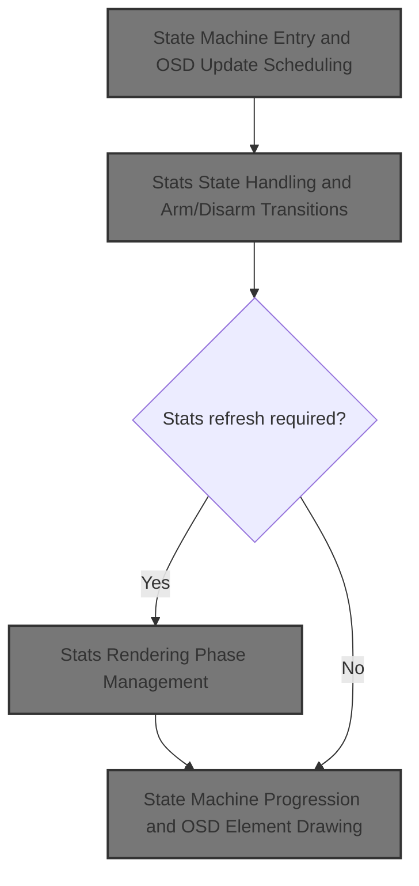
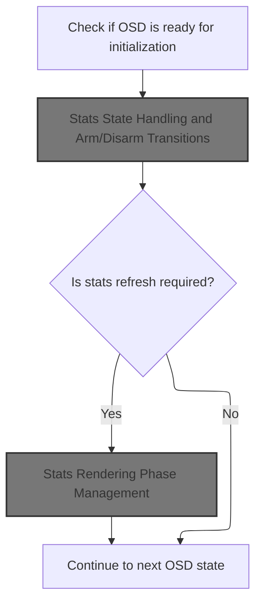

This document describes how flight statistics and telemetry data are collected, updated, and shown to the pilot. The process responds to system state changes and ensures the on-screen display always presents current information.



# State Machine Entry and OSD Update Scheduling



<SwmSnippet path="/src/main/osd/osd.c" line="1391">

---

In <SwmToken path="src/main/osd/osd.c" pos="1391:2:2" line-data="void osdUpdate(timeUs_t currentTimeUs)">`osdUpdate`</SwmToken>, we use a state machine to step through OSD update tasks. After handling heartbeat, we call <SwmToken path="src/main/osd/osd.c" pos="1442:7:7" line-data="            bool refreshStatsRequired = osdProcessStats1(currentTimeUs);">`osdProcessStats1`</SwmToken> to process stats, which is needed before we can update or refresh stats on the display.

```c
void osdUpdate(timeUs_t currentTimeUs)
{
    static uint16_t osdStateDurationFractionUs[OSD_STATE_COUNT] = { 0 };
    static uint32_t osdElementDurationFractionUs[OSD_ITEM_COUNT] = { 0 };
    static bool moreElementsToDraw;

    timeUs_t executeTimeUs;
    osdState_e osdCurrentState = osdState;

    if (osdState != OSD_STATE_UPDATE_CANVAS) {
        schedulerIgnoreTaskExecRate();
    }

    switch (osdState) {
    case OSD_STATE_INIT:
        if (!displayCheckReady(osdDisplayPort, false)) {
            // Frsky osd need a display redraw after search for MAX7456 devices
            if (osdDisplayPortDeviceType == OSD_DISPLAYPORT_DEVICE_FRSKYOSD) {
                displayRedraw(osdDisplayPort);
            } else {
                schedulerIgnoreTaskExecTime();
            }
            return;
        }

        osdCompleteInitialization();
        displayRedraw(osdDisplayPort);
        osdState = OSD_STATE_COMMIT;

        break;

    case OSD_STATE_CHECK:
        // don't touch buffers if DMA transaction is in progress
        if (displayIsTransferInProgress(osdDisplayPort)) {
            break;
        }

        osdState = OSD_STATE_UPDATE_HEARTBEAT;
        break;

    case OSD_STATE_UPDATE_HEARTBEAT:
        if (displayHeartbeat(osdDisplayPort)) {
            // Extraordinary action was taken, so return without allowing osdStateDurationFractionUs table to be updated
            return;
        }

        osdState = OSD_STATE_PROCESS_STATS1;
        break;

    case OSD_STATE_PROCESS_STATS1:
        {
            bool refreshStatsRequired = osdProcessStats1(currentTimeUs);

            if (refreshStatsRequired) {
                osdState = OSD_STATE_REFRESH_STATS;
            } else {
                osdState = OSD_STATE_PROCESS_STATS2;
            }
            break;
        }
```

---

</SwmSnippet>

## Stats State Handling and Arm/Disarm Transitions

<SwmSnippet path="/src/main/osd/osd.c" line="1223">

---

In <SwmToken path="src/main/osd/osd.c" pos="1223:4:4" line-data="STATIC_UNIT_TESTED bool osdProcessStats1(timeUs_t currentTimeUs)">`osdProcessStats1`</SwmToken>, we handle <SwmToken path="src/main/osd/osd.c" pos="1231:5:7" line-data="    // detect arm/disarm">`arm/disarm`</SwmToken> transitions and, if armed, call <SwmToken path="src/main/osd/osd.c" pos="1253:1:1" line-data="        osdUpdateStats();">`osdUpdateStats`</SwmToken> to update all relevant stats from sensors.

```c
STATIC_UNIT_TESTED bool osdProcessStats1(timeUs_t currentTimeUs)
{
    static timeUs_t lastTimeUs = 0;
    static timeUs_t osdStatsRefreshTimeUs;
    static timeUs_t osdAuxRefreshTimeUs = 0;

    bool refreshStatsRequired = false;

    // detect arm/disarm
    if (armState != ARMING_FLAG(ARMED)) {
        if (ARMING_FLAG(ARMED)) {
            osdStatsEnabled = false;
            osdStatsVisible = false;
            osdResetStats();
            resumeRefreshAt = osdShowArmed() + currentTimeUs;
        } else if (isSomeStatEnabled()
                   && !suppressStatsDisplay
                   && !failsafeIsActive()
                   && (!(getArmingDisableFlags() & (ARMING_DISABLED_RUNAWAY_TAKEOFF | ARMING_DISABLED_CRASH_DETECTED))
                       || !VISIBLE(osdElementConfig()->item_pos[OSD_WARNINGS]))) { // suppress stats if runaway takeoff triggered disarm and WARNINGS element is visible
            osdStatsEnabled = true;
            resumeRefreshAt = currentTimeUs + (60 * REFRESH_1S);
            stats.end_voltage = getStatsVoltage();
            osdRenderStatsReset();
        }

        armState = ARMING_FLAG(ARMED);
    }

    if (ARMING_FLAG(ARMED)) {
        osdUpdateStats();
```

---

</SwmSnippet>

### Sensor and Telemetry Stats Aggregation

```mermaid
%%{init: {"flowchart": {"defaultRenderer": "elk"}} }%%
flowchart TD
    node1["Start updating flight stats"]
    click node1 openCode "src/main/osd/osd.c:635:636"
    node1 --> node2["Update max speed (if GPS available)"]
    click node2 openCode "src/main/osd/osd.c:640:647"
    node2 --> node3["Update min voltage"]
    click node3 openCode "src/main/osd/osd.c:650:653"
    node3 --> node4["Update max current"]
    click node4 openCode "src/main/osd/osd.c:655:658"
    node4 --> node5["Update min RSSI"]
    click node5 openCode "src/main/osd/osd.c:660:663"
    node5 --> node6["Update max altitude"]
    click node6 openCode "src/main/osd/osd.c:665:668"
    node6 --> node7["Update max G-force (if ACC available)"]
    click node7 openCode "src/main/osd/osd.c:671:673"
    node7 --> node8["Update min link quality, RSSI dBm, RSNR"]
    click node8 openCode "src/main/osd/osd.c:677:694"
    node8 --> node9["Update max distance from home (if GPS fix)"]
    click node9 openCode "src/main/osd/osd.c:698:701"
    node9 --> node10["Update max ESC temp and RPM"]
    click node10 openCode "src/main/osd/osd.c:706:731"
    subgraph loop1["For each motor: check ESC temperature"]
        node10 --> node11{"Is motor ESC temp > current max?"}
        click node11 openCode "src/main/osd/osd.c:717:720"
        node11 -->|"Yes"| node12["Update max ESC temp and motor index"]
        click node12 openCode "src/main/osd/osd.c:718:719"
        node11 -->|"No"| node13["Continue to next motor"]
        click node13 openCode "src/main/osd/osd.c:721:721"
        node12 --> node13
        node13 --> node11
    end
    node10 --> node14["Finish"]
    click node14 openCode "src/main/osd/osd.c:732:733"

classDef HeadingStyle fill:#777777,stroke:#333,stroke-width:2px;

%% Swimm:
%% %%{init: {"flowchart": {"defaultRenderer": "elk"}} }%%
%% flowchart TD
%%     node1["Start updating flight stats"]
%%     click node1 openCode "<SwmPath>[src/…/osd/osd.c](src/main/osd/osd.c)</SwmPath>:635:636"
%%     node1 --> node2["Update max speed (if GPS available)"]
%%     click node2 openCode "<SwmPath>[src/…/osd/osd.c](src/main/osd/osd.c)</SwmPath>:640:647"
%%     node2 --> node3["Update min voltage"]
%%     click node3 openCode "<SwmPath>[src/…/osd/osd.c](src/main/osd/osd.c)</SwmPath>:650:653"
%%     node3 --> node4["Update max current"]
%%     click node4 openCode "<SwmPath>[src/…/osd/osd.c](src/main/osd/osd.c)</SwmPath>:655:658"
%%     node4 --> node5["Update min RSSI"]
%%     click node5 openCode "<SwmPath>[src/…/osd/osd.c](src/main/osd/osd.c)</SwmPath>:660:663"
%%     node5 --> node6["Update max altitude"]
%%     click node6 openCode "<SwmPath>[src/…/osd/osd.c](src/main/osd/osd.c)</SwmPath>:665:668"
%%     node6 --> node7["Update max G-force (if ACC available)"]
%%     click node7 openCode "<SwmPath>[src/…/osd/osd.c](src/main/osd/osd.c)</SwmPath>:671:673"
%%     node7 --> node8["Update min link quality, RSSI <SwmToken path="src/main/osd/osd.c" pos="411:18:18" line-data="    osdConfig-&gt;osd_craftname_msgs = false;   // Insert LQ/RSSI-dBm and warnings into CraftName">`dBm`</SwmToken>, RSNR"]
%%     click node8 openCode "<SwmPath>[src/…/osd/osd.c](src/main/osd/osd.c)</SwmPath>:677:694"
%%     node8 --> node9["Update max distance from home (if GPS fix)"]
%%     click node9 openCode "<SwmPath>[src/…/osd/osd.c](src/main/osd/osd.c)</SwmPath>:698:701"
%%     node9 --> node10["Update max ESC temp and RPM"]
%%     click node10 openCode "<SwmPath>[src/…/osd/osd.c](src/main/osd/osd.c)</SwmPath>:706:731"
%%     subgraph loop1["For each motor: check ESC temperature"]
%%         node10 --> node11{"Is motor ESC temp > current max?"}
%%         click node11 openCode "<SwmPath>[src/…/osd/osd.c](src/main/osd/osd.c)</SwmPath>:717:720"
%%         node11 -->|"Yes"| node12["Update max ESC temp and motor index"]
%%         click node12 openCode "<SwmPath>[src/…/osd/osd.c](src/main/osd/osd.c)</SwmPath>:718:719"
%%         node11 -->|"No"| node13["Continue to next motor"]
%%         click node13 openCode "<SwmPath>[src/…/osd/osd.c](src/main/osd/osd.c)</SwmPath>:721:721"
%%         node12 --> node13
%%         node13 --> node11
%%     end
%%     node10 --> node14["Finish"]
%%     click node14 openCode "<SwmPath>[src/…/osd/osd.c](src/main/osd/osd.c)</SwmPath>:732:733"
%% 
%% classDef HeadingStyle fill:#777777,stroke:#333,stroke-width:2px;
```



<SwmSnippet path="/src/main/osd/osd.c" line="635">

---

In <SwmToken path="src/main/osd/osd.c" pos="635:4:4" line-data="static void osdUpdateStats(void)">`osdUpdateStats`</SwmToken>, we loop through all the stats we care about (speed, voltage, current, RSSI, altitude, etc.), grab the latest sensor or telemetry values, and update the stored max/min if the new value beats the previous record. Conditional compilation makes sure we only include code for sensors that are actually present in the build.

```c
static void osdUpdateStats(void)
{
    int16_t value = 0;

#ifdef USE_GPS
    if (gpsConfig()->gps_use_3d_speed) {
        value = gpsSol.speed3d;
    } else {
        value = gpsSol.groundSpeed;
    }
    if (stats.max_speed < value) {
        stats.max_speed = value;
    }
#endif

    value = getStatsVoltage();
    if (stats.min_voltage > value) {
        stats.min_voltage = value;
    }

    value = getAmperage() / 100;
    if (stats.max_current < value) {
        stats.max_current = value;
    }

    value = getRssiPercent();
    if (stats.min_rssi > value) {
        stats.min_rssi = value;
    }

    int32_t altitudeCm = getEstimatedAltitudeCm();
    if (stats.max_altitude < altitudeCm) {
        stats.max_altitude = altitudeCm;
    }

#if defined(USE_ACC)
    if (stats.max_g_force < osdGForce) {
        stats.max_g_force = osdGForce;
    }
#endif

#ifdef USE_RX_LINK_QUALITY_INFO
    value = rxGetLinkQualityPercent();
    if (stats.min_link_quality > value) {
        stats.min_link_quality = value;
    }
#endif

#ifdef USE_RX_RSSI_DBM
    value = getRssiDbm();
    if (stats.min_rssi_dbm > value) {
        stats.min_rssi_dbm = value;
    }
#endif

#ifdef USE_RX_RSNR
    value = getRsnr();
    if (stats.min_rsnr > value) {
        stats.min_rsnr = value;
    }
#endif

#ifdef USE_GPS
    if (STATE(GPS_FIX) && STATE(GPS_FIX_HOME)) {
        if (stats.max_distance < GPS_distanceToHome) {
            stats.max_distance = GPS_distanceToHome;
        }
    }
#endif

#if defined(USE_ESC_SENSOR)
    if (featureIsEnabled(FEATURE_ESC_SENSOR)) {
        value = osdEscDataCombined->temperature;
        if (stats.max_esc_temp < value) {
            stats.max_esc_temp = value;
        }
    } else
#endif
#if defined(USE_DSHOT_TELEMETRY)
    {
        // Take max temp from dshot telemetry
        for (uint8_t k = 0; k < getMotorCount(); k++) {
            if (dshotTelemetryState.motorState[k].maxTemp > stats.max_esc_temp) {
                stats.max_esc_temp_ix = k + 1;
                stats.max_esc_temp = dshotTelemetryState.motorState[k].maxTemp;
            }
        }
```

---

</SwmSnippet>

<SwmSnippet path="/src/main/osd/osd.c" line="728">

---

<SwmToken path="src/main/osd/osd.c" pos="635:4:4" line-data="static void osdUpdateStats(void)">`osdUpdateStats`</SwmToken> doesn't return anything. It just updates the global stats variables in place, so the rest of the OSD code can use the latest values.

```c
    int32_t rpm = getAverageEscRpm();
    if (stats.max_esc_rpm < rpm) {
        stats.max_esc_rpm = rpm;
    }
#endif
}
```

---

</SwmSnippet>

### Stats Display Timing and Auxiliary Updates

```mermaid
%%{init: {"flowchart": {"defaultRenderer": "elk"}} }%%
flowchart TD
    node1["Start OSD stats processing"]
    click node1 openCode "src/main/osd/osd.c:1254:1298"
    node1 --> node2{"Update stats? (System armed or stats enabled)"}
    click node2 openCode "src/main/osd/osd.c:1254:1263"
    node2 -->|"Yes"| node3["Update flight, armed, and launch time"]
    click node3 openCode "src/main/osd/osd.c:1254:1263"
    node2 -->|"No"| node4{"Manage stats visibility? (OSD stats enabled)"}
    click node4 openCode "src/main/osd/osd.c:1264:1283"
    node4 -->|"Show/hide"| node5["Show or hide stats, reset timers as needed"]
    click node5 openCode "src/main/osd/osd.c:1264:1283"
    node4 -->|"No change"| node6["Continue"]
    click node6 openCode "src/main/osd/osd.c:1284:1284"
    node3 --> node7{"Aux value element visible?"}
    node5 --> node7
    node6 --> node7
    click node7 openCode "src/main/osd/osd.c:1286:1293"
    node7 -->|"Yes"| node8{"Time to refresh aux value?"}
    click node8 openCode "src/main/osd/osd.c:1288:1292"
    node8 -->|"Yes"| node9["Update aux value and refresh time"]
    click node9 openCode "src/main/osd/osd.c:1290:1291"
    node8 -->|"No"| node10["Continue"]
    node7 -->|"No"| node10
    node9 --> node11["Update last time and return refresh required"]
    node10 --> node11
    click node11 openCode "src/main/osd/osd.c:1295:1297"
classDef HeadingStyle fill:#777777,stroke:#333,stroke-width:2px;

%% Swimm:
%% %%{init: {"flowchart": {"defaultRenderer": "elk"}} }%%
%% flowchart TD
%%     node1["Start OSD stats processing"]
%%     click node1 openCode "<SwmPath>[src/…/osd/osd.c](src/main/osd/osd.c)</SwmPath>:1254:1298"
%%     node1 --> node2{"Update stats? (System armed or stats enabled)"}
%%     click node2 openCode "<SwmPath>[src/…/osd/osd.c](src/main/osd/osd.c)</SwmPath>:1254:1263"
%%     node2 -->|"Yes"| node3["Update flight, armed, and launch time"]
%%     click node3 openCode "<SwmPath>[src/…/osd/osd.c](src/main/osd/osd.c)</SwmPath>:1254:1263"
%%     node2 -->|"No"| node4{"Manage stats visibility? (OSD stats enabled)"}
%%     click node4 openCode "<SwmPath>[src/…/osd/osd.c](src/main/osd/osd.c)</SwmPath>:1264:1283"
%%     node4 -->|"Show/hide"| node5["Show or hide stats, reset timers as needed"]
%%     click node5 openCode "<SwmPath>[src/…/osd/osd.c](src/main/osd/osd.c)</SwmPath>:1264:1283"
%%     node4 -->|"No change"| node6["Continue"]
%%     click node6 openCode "<SwmPath>[src/…/osd/osd.c](src/main/osd/osd.c)</SwmPath>:1284:1284"
%%     node3 --> node7{"Aux value element visible?"}
%%     node5 --> node7
%%     node6 --> node7
%%     click node7 openCode "<SwmPath>[src/…/osd/osd.c](src/main/osd/osd.c)</SwmPath>:1286:1293"
%%     node7 -->|"Yes"| node8{"Time to refresh aux value?"}
%%     click node8 openCode "<SwmPath>[src/…/osd/osd.c](src/main/osd/osd.c)</SwmPath>:1288:1292"
%%     node8 -->|"Yes"| node9["Update aux value and refresh time"]
%%     click node9 openCode "<SwmPath>[src/…/osd/osd.c](src/main/osd/osd.c)</SwmPath>:1290:1291"
%%     node8 -->|"No"| node10["Continue"]
%%     node7 -->|"No"| node10
%%     node9 --> node11["Update last time and return refresh required"]
%%     node10 --> node11
%%     click node11 openCode "<SwmPath>[src/…/osd/osd.c](src/main/osd/osd.c)</SwmPath>:1295:1297"
%% classDef HeadingStyle fill:#777777,stroke:#333,stroke-width:2px;
```



<SwmSnippet path="/src/main/osd/osd.c" line="1254">

---

Back in <SwmToken path="src/main/osd/osd.c" pos="1223:4:4" line-data="STATIC_UNIT_TESTED bool osdProcessStats1(timeUs_t currentTimeUs)">`osdProcessStats1`</SwmToken>, after updating stats with <SwmToken path="src/main/osd/osd.c" pos="635:4:4" line-data="static void osdUpdateStats(void)">`osdUpdateStats`</SwmToken>, we update timers for flight and armed time, handle <SwmToken path="src/main/osd/osd.c" pos="1264:17:19" line-data="    } else if (osdStatsEnabled) {  // handle showing/hiding stats based on OSD disable switch position">`showing/hiding`</SwmToken> stats based on OSD switches, and update the auxiliary channel value if needed. The function returns true if it's time to refresh the stats display, which is used by the state machine to trigger a redraw.

```c
        int deltaT = cmpTimeUs(currentTimeUs, lastTimeUs);
        osdFlyTime += deltaT;
        stats.armed_time += deltaT;
#ifdef USE_LAUNCH_CONTROL
        if (!isLaunchControlActive()) {
            osdLaunchTime += deltaT;
        } else {
            osdLaunchTime = 0;
        }
#endif
    } else if (osdStatsEnabled) {  // handle showing/hiding stats based on OSD disable switch position
        if (displayIsGrabbed(osdDisplayPort)) {
            osdStatsEnabled = false;
            resumeRefreshAt = 0;
            stats.armed_time = 0;
        } else {
            if (IS_RC_MODE_ACTIVE(BOXOSD) && osdStatsVisible) {
                osdStatsVisible = false;
                displayClearScreen(osdDisplayPort, DISPLAY_CLEAR_NONE);
            } else if (!IS_RC_MODE_ACTIVE(BOXOSD)) {
                if (!osdStatsVisible) {
                    osdStatsVisible = true;
                    osdStatsRefreshTimeUs = 0;
                }
                if (currentTimeUs >= osdStatsRefreshTimeUs) {
                    osdStatsRefreshTimeUs = currentTimeUs + REFRESH_1S;
                    refreshStatsRequired = true;
                }
            }
        }
    }

    if (VISIBLE(osdElementConfig()->item_pos[OSD_AUX_VALUE])) {
        const uint8_t auxChannel = osdConfig()->aux_channel + NON_AUX_CHANNEL_COUNT - 1;
        if (currentTimeUs > osdAuxRefreshTimeUs) {
            // aux channel start after main channels
            osdAuxValue = (constrain(rcData[auxChannel], PWM_RANGE_MIN, PWM_RANGE_MAX) - PWM_RANGE_MIN) * osdConfig()->aux_scale / PWM_RANGE;
            osdAuxRefreshTimeUs = currentTimeUs + REFRESH_1S;
        }
    }

    lastTimeUs = currentTimeUs;

    return refreshStatsRequired;
}
```

---

</SwmSnippet>

## Stats Refresh Trigger and State Transition

<SwmSnippet path="/src/main/osd/osd.c" line="1451">

---

Back in <SwmToken path="src/main/osd/osd.c" pos="1391:2:2" line-data="void osdUpdate(timeUs_t currentTimeUs)">`osdUpdate`</SwmToken>, after <SwmToken path="src/main/osd/osd.c" pos="1223:4:4" line-data="STATIC_UNIT_TESTED bool osdProcessStats1(timeUs_t currentTimeUs)">`osdProcessStats1`</SwmToken> returns, if a stats refresh is needed, we move to <SwmToken path="src/main/osd/osd.c" pos="1451:3:3" line-data="    case OSD_STATE_REFRESH_STATS:">`OSD_STATE_REFRESH_STATS`</SwmToken> and call <SwmToken path="src/main/osd/osd.c" pos="1453:7:7" line-data="            bool completed = osdRefreshStats();">`osdRefreshStats`</SwmToken>. This redraws the stats on the OSD, keeping the display current.

```c
    case OSD_STATE_REFRESH_STATS:
        {
            bool completed = osdRefreshStats();
            if (completed) {
                osdState = OSD_STATE_PROCESS_STATS2;
            }
            break;
        }
```

---

</SwmSnippet>

## Stats Rendering Phase Management

<SwmSnippet path="/src/main/osd/osd.c" line="1142">

---

In <SwmToken path="src/main/osd/osd.c" pos="1142:4:4" line-data="static bool osdRefreshStats(void)">`osdRefreshStats`</SwmToken>, we step through phases and call <SwmToken path="src/main/osd/osd.c" pos="1170:7:7" line-data="            bool count_phase_complete = osdRenderStatsContinue();">`osdRenderStatsContinue`</SwmToken> to render stats rows incrementally.

```c
static bool osdRefreshStats(void)
{
    bool completed = false;

    typedef enum {
        INITIAL_CLEAR_SCREEN = 0,
        COUNT_STATS,
        CLEAR_SCREEN,
        RENDER_STATS,
    } osdRefreshStatsPhase_e;

    static osdRefreshStatsPhase_e phase = INITIAL_CLEAR_SCREEN;

    switch (phase) {
    default:
    case INITIAL_CLEAR_SCREEN:
        osdRenderStatsBegin();
        if (osdStatsRenderingState.rowCount > 0) {
            phase = RENDER_STATS;
        } else {
            phase = COUNT_STATS;
        }
        displayClearScreen(osdDisplayPort, DISPLAY_CLEAR_NONE);
        break;
    case COUNT_STATS:
        {
            // No stats row count has been set yet.
            // Go through the logic one time to determine how many stats are actually displayed.
            bool count_phase_complete = osdRenderStatsContinue();
            if (count_phase_complete) {
                phase = CLEAR_SCREEN;
            }
            break;
        }
    case CLEAR_SCREEN:
        osdRenderStatsBegin();
        // Then clear the screen and commence with normal stats display which will
        // determine if the heading should be displayed and also center the content vertically.
        displayClearScreen(osdDisplayPort, DISPLAY_CLEAR_NONE);
        phase = RENDER_STATS;
        break;
    case RENDER_STATS:
        completed = osdRenderStatsContinue();
        break;
    };

```

---

</SwmSnippet>

### Incremental Stats Row Rendering

```mermaid
%%{init: {"flowchart": {"defaultRenderer": "elk"}} }%%
flowchart TD
    node1["Start rendering stats"] --> node2{"Is this the initial rendering pass?"}
    click node1 openCode "src/main/osd/osd.c:1086:1089"
    node2 -->|"Yes"| node3{"Should display label? (rowCount < availableRows)"}
    click node2 openCode "src/main/osd/osd.c:1089:1094"
    node3 -->|"Yes"| node4["Display stats label and pause rendering"]
    click node3 openCode "src/main/osd/osd.c:1097:1107"
    node3 -->|"No"| node5["Center stats vertically"]
    click node5 openCode "src/main/osd/osd.c:1101:1102"
    node2 -->|"No"| node6["Proceed to stat rendering"]
    click node6 openCode "src/main/osd/osd.c:1110:1112"

    subgraph loop1["For each statistic to display"]
        node6 --> node7{"Is stat active and can be rendered?"}
        click node7 openCode "src/main/osd/osd.c:1119:1125"
        node7 -->|"Yes"| node8["Render stat and increment row"]
        click node8 openCode "src/main/osd/osd.c:1121:1122"
        node8 --> node9["Mark stat as rendered"]
        click node9 openCode "src/main/osd/osd.c:1122:1123"
        node7 -->|"No"| node10["Check next stat"]
        click node10 openCode "src/main/osd/osd.c:1116:1117"
        node10 --> node7
    end

    node9 --> node11{"Is there more space available for stats?"}
    click node11 openCode "src/main/osd/osd.c:1128:1130"
    node11 -->|"Yes"| node4
    node11 -->|"No"| node12["Continue rendering stats"]
    click node12 openCode "src/main/osd/osd.c:1138:1139"

    node5 --> node6
    node4 --> node12
classDef HeadingStyle fill:#777777,stroke:#333,stroke-width:2px;

%% Swimm:
%% %%{init: {"flowchart": {"defaultRenderer": "elk"}} }%%
%% flowchart TD
%%     node1["Start rendering stats"] --> node2{"Is this the initial rendering pass?"}
%%     click node1 openCode "<SwmPath>[src/…/osd/osd.c](src/main/osd/osd.c)</SwmPath>:1086:1089"
%%     node2 -->|"Yes"| node3{"Should display label? (<SwmToken path="src/main/osd/osd.c" pos="1093:5:5" line-data="        // if rowCount is 0 then we&#39;re running an initial analysis of the active stats items">`rowCount`</SwmToken> < <SwmToken path="src/main/osd/osd.c" pos="1095:5:5" line-data="            const int availableRows = osdDisplayPort-&gt;rows;">`availableRows`</SwmToken>)"}
%%     click node2 openCode "<SwmPath>[src/…/osd/osd.c](src/main/osd/osd.c)</SwmPath>:1089:1094"
%%     node3 -->|"Yes"| node4["Display stats label and pause rendering"]
%%     click node3 openCode "<SwmPath>[src/…/osd/osd.c](src/main/osd/osd.c)</SwmPath>:1097:1107"
%%     node3 -->|"No"| node5["Center stats vertically"]
%%     click node5 openCode "<SwmPath>[src/…/osd/osd.c](src/main/osd/osd.c)</SwmPath>:1101:1102"
%%     node2 -->|"No"| node6["Proceed to stat rendering"]
%%     click node6 openCode "<SwmPath>[src/…/osd/osd.c](src/main/osd/osd.c)</SwmPath>:1110:1112"
%% 
%%     subgraph loop1["For each statistic to display"]
%%         node6 --> node7{"Is stat active and can be rendered?"}
%%         click node7 openCode "<SwmPath>[src/…/osd/osd.c](src/main/osd/osd.c)</SwmPath>:1119:1125"
%%         node7 -->|"Yes"| node8["Render stat and increment row"]
%%         click node8 openCode "<SwmPath>[src/…/osd/osd.c](src/main/osd/osd.c)</SwmPath>:1121:1122"
%%         node8 --> node9["Mark stat as rendered"]
%%         click node9 openCode "<SwmPath>[src/…/osd/osd.c](src/main/osd/osd.c)</SwmPath>:1122:1123"
%%         node7 -->|"No"| node10["Check next stat"]
%%         click node10 openCode "<SwmPath>[src/…/osd/osd.c](src/main/osd/osd.c)</SwmPath>:1116:1117"
%%         node10 --> node7
%%     end
%% 
%%     node9 --> node11{"Is there more space available for stats?"}
%%     click node11 openCode "<SwmPath>[src/…/osd/osd.c](src/main/osd/osd.c)</SwmPath>:1128:1130"
%%     node11 -->|"Yes"| node4
%%     node11 -->|"No"| node12["Continue rendering stats"]
%%     click node12 openCode "<SwmPath>[src/…/osd/osd.c](src/main/osd/osd.c)</SwmPath>:1138:1139"
%% 
%%     node5 --> node6
%%     node4 --> node12
%% classDef HeadingStyle fill:#777777,stroke:#333,stroke-width:2px;
```



<SwmSnippet path="/src/main/osd/osd.c" line="1085">

---

In <SwmToken path="src/main/osd/osd.c" pos="1085:4:4" line-data="static bool osdRenderStatsContinue(void)">`osdRenderStatsContinue`</SwmToken>, we use a rendering state to keep track of which row and stat we're on. We center the stats label if there's space, then loop through the stats order, calling <SwmToken path="src/main/osd/osd.c" pos="1120:4:4" line-data="            if (osdDisplayStat(osdStatsDisplayOrder[index], osdStatsRenderingState.row)) {">`osdDisplayStat`</SwmToken> for each active stat. This way, we render one stat per call and can handle long lists without blocking.

```c
static bool osdRenderStatsContinue(void)
{
    uint8_t midCol = osdDisplayPort->cols / 2;

    if (osdStatsRenderingState.row == 0) {

        bool displayLabel = false;

        // if rowCount is 0 then we're running an initial analysis of the active stats items
        if (osdStatsRenderingState.rowCount > 0) {
            const int availableRows = osdDisplayPort->rows;
            int displayRows = MIN(osdStatsRenderingState.rowCount, availableRows);
            if (osdStatsRenderingState.rowCount < availableRows) {
                displayLabel = true;
                displayRows++;
            }
            osdStatsRenderingState.row = (availableRows - displayRows) / 2;  // center the stats vertically
        }

        if (displayLabel) {
            displayWrite(osdDisplayPort, midCol - (strlen("--- STATS ---") / 2), osdStatsRenderingState.row++, DISPLAYPORT_SEVERITY_NORMAL, "--- STATS ---");
            return false;
        }
    }

    bool renderedStat = false;

    while (osdStatsRenderingState.index < OSD_STAT_COUNT) {
        int index = osdStatsRenderingState.index;

        // prepare for the next call to the method
        osdStatsRenderingState.index++;

        // look for something to render
        if (osdStatGetState(osdStatsDisplayOrder[index])) {
            if (osdDisplayStat(osdStatsDisplayOrder[index], osdStatsRenderingState.row)) {
                osdStatsRenderingState.row++;
                renderedStat = true;
                break;
            }
        }
    }

```

---

</SwmSnippet>

<SwmSnippet path="/src/main/osd/osd.c" line="801">

---

<SwmToken path="src/main/osd/osd.c" pos="801:4:4" line-data="static bool osdDisplayStat(int statistic, uint8_t displayRow)">`osdDisplayStat`</SwmToken> takes a stat identifier and row, then uses a big switch to format and display the right value and label for each stat. It uses helper functions and config to handle units, labels, and only includes stats that are enabled in the build.

```c
static bool osdDisplayStat(int statistic, uint8_t displayRow)
{
    uint8_t midCol = osdDisplayPort->cols / 2;
    char buff[OSD_ELEMENT_BUFFER_LENGTH];

    switch (statistic) {
    case OSD_STAT_RTC_DATE_TIME: {
        bool success = false;
#ifdef USE_RTC_TIME
        success = osdFormatRtcDateTime(&buff[0]);
#endif
        if (!success) {
            tfp_sprintf(buff, "NO RTC");
        }

        displayWrite(osdDisplayPort, midCol - 13, displayRow, DISPLAYPORT_SEVERITY_NORMAL, buff);
        return true;
    }

    case OSD_STAT_TIMER_1:
        osdFormatTimer(buff, false, (OSD_TIMER_SRC(osdConfig()->timers[OSD_TIMER_1]) == OSD_TIMER_SRC_ON ? false : true), OSD_TIMER_1);
        osdDisplayStatisticLabel(midCol, displayRow, osdTimerSourceNames[OSD_TIMER_SRC(osdConfig()->timers[OSD_TIMER_1])], buff);
        return true;

    case OSD_STAT_TIMER_2:
        osdFormatTimer(buff, false, (OSD_TIMER_SRC(osdConfig()->timers[OSD_TIMER_2]) == OSD_TIMER_SRC_ON ? false : true), OSD_TIMER_2);
        osdDisplayStatisticLabel(midCol, displayRow, osdTimerSourceNames[OSD_TIMER_SRC(osdConfig()->timers[OSD_TIMER_2])], buff);
        return true;

    case OSD_STAT_MAX_ALTITUDE: {
        osdPrintFloat(buff, SYM_NONE, osdGetMetersToSelectedUnit(stats.max_altitude) / 100.0f, "", 1, true, osdGetMetersToSelectedUnitSymbol());
        osdDisplayStatisticLabel(midCol, displayRow, "MAX ALTITUDE", buff);
        return true;
    }

#ifdef USE_GPS
    case OSD_STAT_MAX_SPEED:
        if (featureIsEnabled(FEATURE_GPS)) {
            tfp_sprintf(buff, "%d%c", osdGetSpeedToSelectedUnit(stats.max_speed), osdGetSpeedToSelectedUnitSymbol());
            osdDisplayStatisticLabel(midCol, displayRow, "MAX SPEED", buff);
            return true;
        }
        break;

    case OSD_STAT_MAX_DISTANCE:
        if (featureIsEnabled(FEATURE_GPS)) {
            osdFormatDistanceString(buff, stats.max_distance, SYM_NONE);
            osdDisplayStatisticLabel(midCol, displayRow, "MAX DISTANCE", buff);
            return true;
        }
        break;

    case OSD_STAT_FLIGHT_DISTANCE:
        if (featureIsEnabled(FEATURE_GPS)) {
            const int distanceFlown = GPS_distanceFlownInCm / 100;
            osdFormatDistanceString(buff, distanceFlown, SYM_NONE);
            osdDisplayStatisticLabel(midCol, displayRow, "FLIGHT DISTANCE", buff);
            return true;
        }
        break;
#endif

    case OSD_STAT_MIN_BATTERY:
        osdPrintFloat(buff, SYM_NONE, stats.min_voltage / 100.0f, "", 2, true, SYM_VOLT);
        osdDisplayStatisticLabel(midCol, displayRow, osdConfig()->stat_show_cell_value? "MIN AVG CELL" : "MIN BATTERY", buff);
        return true;

    case OSD_STAT_END_BATTERY:
        osdPrintFloat(buff, SYM_NONE, stats.end_voltage / 100.0f, "", 2, true, SYM_VOLT);
        osdDisplayStatisticLabel(midCol, displayRow, osdConfig()->stat_show_cell_value ? "END AVG CELL" : "END BATTERY", buff);
        return true;

    case OSD_STAT_BATTERY:
        {
            const uint16_t statsVoltage = getStatsVoltage();
            osdPrintFloat(buff, SYM_NONE, statsVoltage / 100.0f, "", 2, true, SYM_VOLT);
            osdDisplayStatisticLabel(midCol, displayRow, osdConfig()->stat_show_cell_value ? "AVG BATT CELL" : "BATTERY", buff);
            return true;
        }
        break;

    case OSD_STAT_MIN_RSSI:
        itoa(stats.min_rssi, buff, 10);
        strcat(buff, "%");
        osdDisplayStatisticLabel(midCol, displayRow, "MIN RSSI", buff);
        return true;

    case OSD_STAT_MAX_CURRENT:
        if (batteryConfig()->currentMeterSource != CURRENT_METER_NONE) {
            tfp_sprintf(buff, "%d%c", stats.max_current, SYM_AMP);
            osdDisplayStatisticLabel(midCol, displayRow, "MAX CURRENT", buff);
            return true;
        }
        break;

    case OSD_STAT_USED_MAH:
        if (batteryConfig()->currentMeterSource != CURRENT_METER_NONE) {
            tfp_sprintf(buff, "%d%c", getMAhDrawn(), SYM_MAH);
            osdDisplayStatisticLabel(midCol, displayRow, "USED MAH", buff);
            return true;
        }
        break;

    case OSD_STAT_WATT_HOURS_DRAWN:
        if (batteryConfig()->currentMeterSource != CURRENT_METER_NONE) {
            osdPrintFloat(buff, SYM_NONE, getWhDrawn(), "", 2, true, SYM_NONE);
            osdDisplayStatisticLabel(midCol, displayRow, "USED WATT HOURS", buff);
            return true;
        }
        break;

#ifdef USE_BLACKBOX
    case OSD_STAT_BLACKBOX:
        if (blackboxConfig()->device && blackboxConfig()->device != BLACKBOX_DEVICE_SERIAL) {
            osdGetBlackboxStatusString(buff);
            osdDisplayStatisticLabel(midCol, displayRow, "BLACKBOX", buff);
            return true;
        }
        break;

    case OSD_STAT_BLACKBOX_NUMBER:
        {
            int32_t logNumber = blackboxGetLogNumber();
            if (logNumber >= 0) {
                itoa(logNumber, buff, 10);
                osdDisplayStatisticLabel(midCol, displayRow, "BB LOG NUM", buff);
                return true;
            }
        }
        break;
#endif

#if defined(USE_ACC)
    case OSD_STAT_MAX_G_FORCE:
        if (sensors(SENSOR_ACC)) {
            osdPrintFloat(buff, SYM_NONE, stats.max_g_force, "", 1, true, 'G');
            osdDisplayStatisticLabel(midCol, displayRow, "MAX G-FORCE", buff);
            return true;
        }
        break;
#endif

#ifdef USE_ESC_SENSOR
    case OSD_STAT_MAX_ESC_TEMP:
    {
        uint16_t ix = 0;
        if (stats.max_esc_temp_ix > 0) {
            ix = tfp_sprintf(buff, "%d ", stats.max_esc_temp_ix);
        }
        tfp_sprintf(buff + ix, "%d%c", osdConvertTemperatureToSelectedUnit(stats.max_esc_temp), osdGetTemperatureSymbolForSelectedUnit());
        osdDisplayStatisticLabel(midCol, displayRow, "MAX ESC TEMP", buff);
        return true;
    }
#endif

#if defined(USE_ESC_SENSOR) || defined(USE_DSHOT_TELEMETRY)
    case OSD_STAT_MAX_ESC_RPM:
        itoa(stats.max_esc_rpm, buff, 10);
        osdDisplayStatisticLabel(midCol, displayRow, "MAX ESC RPM", buff);
        return true;
#endif

#ifdef USE_RX_LINK_QUALITY_INFO
    case OSD_STAT_MIN_LINK_QUALITY:
        tfp_sprintf(buff, "%d", stats.min_link_quality);
        strcat(buff, "%");
        osdDisplayStatisticLabel(midCol, displayRow, "MIN LINK", buff);
        return true;
#endif

#if defined(USE_DYN_NOTCH_FILTER)
    case OSD_STAT_MAX_FFT:
        if (isDynNotchActive()) {
            int value = getMaxFFT();
            if (value > 0) {
                tfp_sprintf(buff, "%dHZ", value);
                osdDisplayStatisticLabel(midCol, displayRow, "PEAK FFT", buff);
            } else {
                osdDisplayStatisticLabel(midCol, displayRow, "PEAK FFT", "THRT<20%");
            }
            return true;
        }
        break;
#endif

#ifdef USE_RX_RSSI_DBM
    case OSD_STAT_MIN_RSSI_DBM:
        tfp_sprintf(buff, "%3d", stats.min_rssi_dbm);
        osdDisplayStatisticLabel(midCol, displayRow, "MIN RSSI DBM", buff);
        return true;
#endif

#ifdef USE_RX_RSNR
    case OSD_STAT_MIN_RSNR:
        tfp_sprintf(buff, "%3d", stats.min_rsnr);
        osdDisplayStatisticLabel(midCol, displayRow, "MIN RSNR", buff);
        return true;
#endif

#ifdef USE_GPS_LAP_TIMER
    case OSD_STAT_BEST_3_CONSEC_LAPS: {
        printLapTime(buff, gpsLapTimerData.best3Consec);
        osdDisplayStatisticLabel(midCol, displayRow, "BEST 3 CON", buff);
        return true;
    }

    case OSD_STAT_BEST_LAP: {
        printLapTime(buff, gpsLapTimerData.bestLapTime);
        osdDisplayStatisticLabel(midCol, displayRow, "BEST LAP", buff);
        return true;
    }
#endif // USE_GPS_LAP_TIMER

#ifdef USE_PERSISTENT_STATS
    case OSD_STAT_TOTAL_FLIGHTS:
        itoa(statsConfig()->stats_total_flights, buff, 10);
        osdDisplayStatisticLabel(midCol, displayRow, "TOTAL FLIGHTS", buff);
        return true;

    case OSD_STAT_TOTAL_TIME: {
        int minutes = statsConfig()->stats_total_time_s / 60;
        tfp_sprintf(buff, "%d:%02dH", minutes / 60, minutes % 60);
        osdDisplayStatisticLabel(midCol, displayRow, "TOTAL FLIGHT TIME", buff);
        return true;
    }

    case OSD_STAT_TOTAL_DIST:
        #define METERS_PER_KILOMETER 1000
        #define METERS_PER_MILE      1609
        if (osdConfig()->units == UNIT_IMPERIAL) {
            tfp_sprintf(buff, "%d%c", statsConfig()->stats_total_dist_m / METERS_PER_MILE, SYM_MILES);
        } else {
            tfp_sprintf(buff, "%d%c", statsConfig()->stats_total_dist_m / METERS_PER_KILOMETER, SYM_KM);
        }
        osdDisplayStatisticLabel(midCol, displayRow, "TOTAL DISTANCE", buff);
        return true;
#endif
#ifdef USE_RC_STATS
    case OSD_STAT_FULL_THROTTLE_TIME: {
        int seconds = RcStatsGetFullThrottleTimeUs() / 1000000;
        const int minutes = seconds / 60;
        seconds = seconds % 60;
        tfp_sprintf(buff, "%02d:%02d", minutes, seconds);
        osdDisplayStatisticLabel(midCol, displayRow, "100% THRT TIME", buff);
        return true;
    }

    case OSD_STAT_FULL_THROTTLE_COUNTER: {
        itoa(RcStatsGetFullThrottleCounter(), buff, 10);
        osdDisplayStatisticLabel(midCol, displayRow, "100% THRT COUNT", buff);
        return true;
    }

    case OSD_STAT_AVG_THROTTLE: {
        itoa(RcStatsGetAverageThrottle(), buff, 10);
        osdDisplayStatisticLabel(midCol, displayRow, "AVG THROTTLE", buff);
        return true;
    }
#endif // USE_RC_STATS
    }
    return false;
}
```

---

</SwmSnippet>

<SwmSnippet path="/src/main/osd/osd.c" line="1128">

---

After calling <SwmToken path="src/main/osd/osd.c" pos="801:4:4" line-data="static bool osdDisplayStat(int statistic, uint8_t displayRow)">`osdDisplayStat`</SwmToken> in <SwmToken path="src/main/osd/osd.c" pos="1085:4:4" line-data="static bool osdRenderStatsContinue(void)">`osdRenderStatsContinue`</SwmToken>, we check if there's more space and more stats to render. If so, we return false to keep rendering next time. If not, we finalize the row count and return true to signal we're done.

```c
    bool moreSpaceAvailable = osdStatsRenderingState.row < osdDisplayPort->rows;

    if (renderedStat && moreSpaceAvailable) {
        return false;
    }

    if (osdStatsRenderingState.rowCount == 0) {
        osdStatsRenderingState.rowCount = osdStatsRenderingState.row;
    }

    return true;
}
```

---

</SwmSnippet>

### Stats Rendering Completion and Phase Reset

<SwmSnippet path="/src/main/osd/osd.c" line="1188">

---

After <SwmToken path="src/main/osd/osd.c" pos="1085:4:4" line-data="static bool osdRenderStatsContinue(void)">`osdRenderStatsContinue`</SwmToken> returns in <SwmToken path="src/main/osd/osd.c" pos="1142:4:4" line-data="static bool osdRefreshStats(void)">`osdRefreshStats`</SwmToken>, if rendering is complete, we reset the phase to <SwmToken path="src/main/osd/osd.c" pos="1189:5:5" line-data="        phase = INITIAL_CLEAR_SCREEN;">`INITIAL_CLEAR_SCREEN`</SwmToken> so the next stats refresh starts from scratch.

```c
    if (completed) {
        phase = INITIAL_CLEAR_SCREEN;
    }

    return completed;
}
```

---

</SwmSnippet>

## State Machine Progression and OSD Element Drawing

```mermaid
%%{init: {"flowchart": {"defaultRenderer": "elk"}} }%%
flowchart TD
    subgraph loop1["OSD State Machine Loop"]
        node1{"What is the current OSD state?"}
        click node1 openCode "src/main/osd/osd.c:1459:1625"
        node1 -->|"Processing flight stats"| node2["Update flight statistics"]
        click node2 openCode "src/main/osd/osd.c:1460:1462"
        node2 --> node1
        node1 -->|"Updating alarms"| node3["Update alarms and warnings"]
        click node3 openCode "src/main/osd/osd.c:1479:1485"
        node3 --> node1
        node1 -->|"Preparing display"| node4{"Is OSD mode active?"}
        click node4 openCode "src/main/osd/osd.c:1490:1494"
        node4 -->|"Yes"| node5["Hide OSD display"]
        click node5 openCode "src/main/osd/osd.c:1491:1493"
        node5 --> node1
        node4 -->|"No"| node6{"Background layer supported?"}
        click node6 openCode "src/main/osd/osd.c:1496:1504"
        node6 -->|"Yes"| node7["Overlay background layer"]
        click node7 openCode "src/main/osd/osd.c:1499:1500"
        node6 -->|"No"| node8["Clear display for drawing"]
        click node8 openCode "src/main/osd/osd.c:1503:1504"
        node7 --> node9["Sync blinking elements"]
        click node9 openCode "src/main/osd/osd.c:1517:1518"
        node8 --> node9
        node9 --> node10["Prepare to draw elements"]
        click node10 openCode "src/main/osd/osd.c:1519:1520"
        node10 --> node1
        node1 -->|"Drawing elements"| node11{"Are there more elements to draw?"}
        click node11 openCode "src/main/osd/osd.c:1547:1550"
        node11 -->|"Yes"| node12["Draw next OSD element"]
        click node12 openCode "src/main/osd/osd.c:1529:1530"
        node12 --> node1
        node11 -->|"No"| node13{"Show pre-arm screen?"}
        click node13 openCode "src/main/osd/osd.c:1553:1556"
        node13 -->|"Yes"| node14["Show pre-arm screen"]
        click node14 openCode "src/main/osd/osd.c:1588:1591"
        node13 -->|"No"| node15["Commit display changes"]
        click node15 openCode "src/main/osd/osd.c:1597:1604"
        node14 --> node1
        node15 --> node1
        node1 -->|"Displaying elements"| node16{"Are there more elements to display?"}
        click node16 openCode "src/main/osd/osd.c:1567:1582"
        node16 -->|"Yes"| node17["Display next element"]
        click node17 openCode "src/main/osd/osd.c:1565:1566"
        node17 --> node1
        node16 -->|"No"| node18{"Show pre-arm screen?"}
        click node18 openCode "src/main/osd/osd.c:1574:1577"
        node18 -->|"Yes"| node19["Show pre-arm screen"]
        click node19 openCode "src/main/osd/osd.c:1588:1591"
        node18 -->|"No"| node20["Commit display changes"]
        click node20 openCode "src/main/osd/osd.c:1597:1604"
        node19 --> node1
        node20 --> node1
        node1 -->|"Committing changes"| node21{"Resume refresh immediately?"}
        click node21 openCode "src/main/osd/osd.c:1599:1603"
        node21 -->|"Yes"| node22["Go idle"]
        click node22 openCode "src/main/osd/osd.c:1600:1601"
        node21 -->|"No"| node23["Transfer display data"]
        click node23 openCode "src/main/osd/osd.c:1602:1603"
        node22 --> node1
        node23 --> node1
        node1 -->|"Transferring data"| node24{"Is display transfer in progress?"}
        click node24 openCode "src/main/osd/osd.c:1608:1615"
        node24 -->|"Yes"| node1
        node24 -->|"No"| node25{"More screen parts to transfer?"}
        click node25 openCode "src/main/osd/osd.c:1613:1615"
        node25 -->|"Yes"| node1
        node25 -->|"No"| node22
        node1 -->|"Idle"| node1
    end
    
classDef HeadingStyle fill:#777777,stroke:#333,stroke-width:2px;

%% Swimm:
%% %%{init: {"flowchart": {"defaultRenderer": "elk"}} }%%
%% flowchart TD
%%     subgraph loop1["OSD State Machine Loop"]
%%         node1{"What is the current OSD state?"}
%%         click node1 openCode "<SwmPath>[src/…/osd/osd.c](src/main/osd/osd.c)</SwmPath>:1459:1625"
%%         node1 -->|"Processing flight stats"| node2["Update flight statistics"]
%%         click node2 openCode "<SwmPath>[src/…/osd/osd.c](src/main/osd/osd.c)</SwmPath>:1460:1462"
%%         node2 --> node1
%%         node1 -->|"Updating alarms"| node3["Update alarms and warnings"]
%%         click node3 openCode "<SwmPath>[src/…/osd/osd.c](src/main/osd/osd.c)</SwmPath>:1479:1485"
%%         node3 --> node1
%%         node1 -->|"Preparing display"| node4{"Is OSD mode active?"}
%%         click node4 openCode "<SwmPath>[src/…/osd/osd.c](src/main/osd/osd.c)</SwmPath>:1490:1494"
%%         node4 -->|"Yes"| node5["Hide OSD display"]
%%         click node5 openCode "<SwmPath>[src/…/osd/osd.c](src/main/osd/osd.c)</SwmPath>:1491:1493"
%%         node5 --> node1
%%         node4 -->|"No"| node6{"Background layer supported?"}
%%         click node6 openCode "<SwmPath>[src/…/osd/osd.c](src/main/osd/osd.c)</SwmPath>:1496:1504"
%%         node6 -->|"Yes"| node7["Overlay background layer"]
%%         click node7 openCode "<SwmPath>[src/…/osd/osd.c](src/main/osd/osd.c)</SwmPath>:1499:1500"
%%         node6 -->|"No"| node8["Clear display for drawing"]
%%         click node8 openCode "<SwmPath>[src/…/osd/osd.c](src/main/osd/osd.c)</SwmPath>:1503:1504"
%%         node7 --> node9["Sync blinking elements"]
%%         click node9 openCode "<SwmPath>[src/…/osd/osd.c](src/main/osd/osd.c)</SwmPath>:1517:1518"
%%         node8 --> node9
%%         node9 --> node10["Prepare to draw elements"]
%%         click node10 openCode "<SwmPath>[src/…/osd/osd.c](src/main/osd/osd.c)</SwmPath>:1519:1520"
%%         node10 --> node1
%%         node1 -->|"Drawing elements"| node11{"Are there more elements to draw?"}
%%         click node11 openCode "<SwmPath>[src/…/osd/osd.c](src/main/osd/osd.c)</SwmPath>:1547:1550"
%%         node11 -->|"Yes"| node12["Draw next OSD element"]
%%         click node12 openCode "<SwmPath>[src/…/osd/osd.c](src/main/osd/osd.c)</SwmPath>:1529:1530"
%%         node12 --> node1
%%         node11 -->|"No"| node13{"Show pre-arm screen?"}
%%         click node13 openCode "<SwmPath>[src/…/osd/osd.c](src/main/osd/osd.c)</SwmPath>:1553:1556"
%%         node13 -->|"Yes"| node14["Show pre-arm screen"]
%%         click node14 openCode "<SwmPath>[src/…/osd/osd.c](src/main/osd/osd.c)</SwmPath>:1588:1591"
%%         node13 -->|"No"| node15["Commit display changes"]
%%         click node15 openCode "<SwmPath>[src/…/osd/osd.c](src/main/osd/osd.c)</SwmPath>:1597:1604"
%%         node14 --> node1
%%         node15 --> node1
%%         node1 -->|"Displaying elements"| node16{"Are there more elements to display?"}
%%         click node16 openCode "<SwmPath>[src/…/osd/osd.c](src/main/osd/osd.c)</SwmPath>:1567:1582"
%%         node16 -->|"Yes"| node17["Display next element"]
%%         click node17 openCode "<SwmPath>[src/…/osd/osd.c](src/main/osd/osd.c)</SwmPath>:1565:1566"
%%         node17 --> node1
%%         node16 -->|"No"| node18{"Show pre-arm screen?"}
%%         click node18 openCode "<SwmPath>[src/…/osd/osd.c](src/main/osd/osd.c)</SwmPath>:1574:1577"
%%         node18 -->|"Yes"| node19["Show pre-arm screen"]
%%         click node19 openCode "<SwmPath>[src/…/osd/osd.c](src/main/osd/osd.c)</SwmPath>:1588:1591"
%%         node18 -->|"No"| node20["Commit display changes"]
%%         click node20 openCode "<SwmPath>[src/…/osd/osd.c](src/main/osd/osd.c)</SwmPath>:1597:1604"
%%         node19 --> node1
%%         node20 --> node1
%%         node1 -->|"Committing changes"| node21{"Resume refresh immediately?"}
%%         click node21 openCode "<SwmPath>[src/…/osd/osd.c](src/main/osd/osd.c)</SwmPath>:1599:1603"
%%         node21 -->|"Yes"| node22["Go idle"]
%%         click node22 openCode "<SwmPath>[src/…/osd/osd.c](src/main/osd/osd.c)</SwmPath>:1600:1601"
%%         node21 -->|"No"| node23["Transfer display data"]
%%         click node23 openCode "<SwmPath>[src/…/osd/osd.c](src/main/osd/osd.c)</SwmPath>:1602:1603"
%%         node22 --> node1
%%         node23 --> node1
%%         node1 -->|"Transferring data"| node24{"Is display transfer in progress?"}
%%         click node24 openCode "<SwmPath>[src/…/osd/osd.c](src/main/osd/osd.c)</SwmPath>:1608:1615"
%%         node24 -->|"Yes"| node1
%%         node24 -->|"No"| node25{"More screen parts to transfer?"}
%%         click node25 openCode "<SwmPath>[src/…/osd/osd.c](src/main/osd/osd.c)</SwmPath>:1613:1615"
%%         node25 -->|"Yes"| node1
%%         node25 -->|"No"| node22
%%         node1 -->|"Idle"| node1
%%     end
%%     
%% classDef HeadingStyle fill:#777777,stroke:#333,stroke-width:2px;
```



<SwmSnippet path="/src/main/osd/osd.c" line="1459">

---

After <SwmToken path="src/main/osd/osd.c" pos="1142:4:4" line-data="static bool osdRefreshStats(void)">`osdRefreshStats`</SwmToken>, <SwmToken path="src/main/osd/osd.c" pos="1391:2:2" line-data="void osdUpdate(timeUs_t currentTimeUs)">`osdUpdate`</SwmToken> continues through more OSD update states, handling drawing, alarms, and display commits, all scheduled for efficiency.

```c
    case OSD_STATE_PROCESS_STATS2:
        osdProcessStats2(currentTimeUs);

        osdState = OSD_STATE_PROCESS_STATS3;
        break;
    case OSD_STATE_PROCESS_STATS3:
        osdProcessStats3();

#ifdef USE_CMS
        if (!displayIsGrabbed(osdDisplayPort))
#endif
        {
            osdState = OSD_STATE_UPDATE_ALARMS;
            break;
        }

        osdState = OSD_STATE_COMMIT;
        break;

    case OSD_STATE_UPDATE_ALARMS:
        osdUpdateAlarms();

        if (resumeRefreshAt) {
            osdState = OSD_STATE_TRANSFER;
        } else {
            osdState = OSD_STATE_UPDATE_CANVAS;
        }
        break;

    case OSD_STATE_UPDATE_CANVAS:
        // Hide OSD when OSDSW mode is active
        if (IS_RC_MODE_ACTIVE(BOXOSD)) {
            displayClearScreen(osdDisplayPort, DISPLAY_CLEAR_NONE);
            osdState = OSD_STATE_COMMIT;
            break;
        }

        if (backgroundLayerSupported) {
            // Background layer is supported, overlay it onto the foreground
            // so that we only need to draw the active parts of the elements.
            displayLayerCopy(osdDisplayPort, DISPLAYPORT_LAYER_FOREGROUND, DISPLAYPORT_LAYER_BACKGROUND);
        } else {
            // Background layer not supported, just clear the foreground in preparation
            // for drawing the elements including their backgrounds.
            displayClearScreen(osdDisplayPort, DISPLAY_CLEAR_NONE);
        }

#ifdef USE_GPS
        static bool lastGpsSensorState;
        // Handle the case that the GPS_SENSOR may be delayed in activation
        // or deactivate if communication is lost with the module.
        const bool currentGpsSensorState = sensors(SENSOR_GPS);
        if (lastGpsSensorState != currentGpsSensorState) {
            lastGpsSensorState = currentGpsSensorState;
            osdAnalyzeActiveElements();
        }
#endif // USE_GPS

        osdSyncBlink(currentTimeUs);

        osdState = OSD_STATE_DRAW_ELEMENT;

        break;

    case OSD_STATE_DRAW_ELEMENT:
        {
            uint8_t osdElement = osdGetActiveElement();

            timeUs_t startElementTime = micros();

            moreElementsToDraw = osdDrawNextActiveElement(osdDisplayPort);

            executeTimeUs = micros() - startElementTime;

            if (executeTimeUs > (osdElementDurationFractionUs[osdElement] >> OSD_EXEC_TIME_SHIFT)) {
                osdElementDurationFractionUs[osdElement] = executeTimeUs << OSD_EXEC_TIME_SHIFT;
            } else if (osdElementDurationFractionUs[osdElement] > 0) {
                // Slowly decay the max time
                osdElementDurationFractionUs[osdElement]--;
            }

            if (osdIsRenderPending()) {
                osdState = OSD_STATE_DISPLAY_ELEMENT;

                // Render the element just drawn
                break;
            }

            if (moreElementsToDraw) {
                // There are more elements to draw
                break;
            }

#ifdef USE_SPEC_PREARM_SCREEN
            if (!ARMING_FLAG(ARMED) && osdConfig()->osd_show_spec_prearm) {
                osdState = OSD_STATE_REFRESH_PREARM;
            } else
#endif // USE_SPEC_PREARM_SCREEN
            {
                osdState = OSD_STATE_COMMIT;
            }
        }
        break;

    case OSD_STATE_DISPLAY_ELEMENT:
        {
            const bool pendingDisplay = osdDisplayActiveElement();

            if (!pendingDisplay) {
                if (moreElementsToDraw) {
                    // There is no more to draw so advance to the next element
                    osdState = OSD_STATE_DRAW_ELEMENT;
                } else {
                    // Displaying the current element is complete and there are no futher elements to draw so advance
#ifdef USE_SPEC_PREARM_SCREEN
                    if (!ARMING_FLAG(ARMED) && osdConfig()->osd_show_spec_prearm) {
                        osdState = OSD_STATE_REFRESH_PREARM;
                    } else
#endif // USE_SPEC_PREARM_SCREEN
                    {
                        osdState = OSD_STATE_COMMIT;
                    }
                }
            }
        }
        break;

#ifdef USE_SPEC_PREARM_SCREEN
    case OSD_STATE_REFRESH_PREARM:
        if (osdDrawSpec(osdDisplayPort)) {
            // Rendering is complete
            osdState = OSD_STATE_COMMIT;
        }

        break;
#endif // USE_SPEC_PREARM_SCREEN

    case OSD_STATE_COMMIT:
        displayCommitTransaction(osdDisplayPort);

        if (resumeRefreshAt) {
            osdState = OSD_STATE_IDLE;
        } else {
            osdState = OSD_STATE_TRANSFER;
        }
        break;

    case OSD_STATE_TRANSFER:
        // Wait for any current transfer to complete
        if (displayIsTransferInProgress(osdDisplayPort)) {
            break;
        }

        // Transfer may be broken into many parts
        if (displayDrawScreen(osdDisplayPort)) {
            break;
        }

        osdState = OSD_STATE_IDLE;

        break;

    case OSD_STATE_IDLE:
    default:
        osdState = OSD_STATE_IDLE;
        break;
    }

    if (!schedulerGetIgnoreTaskExecTime()) {
        executeTimeUs = micros() - currentTimeUs;

        if (executeTimeUs > (osdStateDurationFractionUs[osdCurrentState] >> OSD_EXEC_TIME_SHIFT)) {
            osdStateDurationFractionUs[osdCurrentState] = executeTimeUs << OSD_EXEC_TIME_SHIFT;
        } else if (osdStateDurationFractionUs[osdCurrentState] > 0) {
            // Slowly decay the max time
            osdStateDurationFractionUs[osdCurrentState]--;
        }
    }

    if (osdState == OSD_STATE_IDLE) {
        schedulerSetNextStateTime((osdStateDurationFractionUs[OSD_STATE_CHECK] >> OSD_EXEC_TIME_SHIFT));
    } else if (osdState == OSD_STATE_DRAW_ELEMENT) {
        schedulerSetNextStateTime((osdElementDurationFractionUs[osdGetActiveElement()] >> OSD_EXEC_TIME_SHIFT) + OSD_ELEMENT_MARGIN);
    } else {
        schedulerSetNextStateTime((osdStateDurationFractionUs[osdState] >> OSD_EXEC_TIME_SHIFT) + OSD_TASK_MARGIN);
    }
}
```

---

</SwmSnippet>

&nbsp;

*This is an auto-generated document by Swimm 🌊 and has not yet been verified by a human*

<SwmMeta version="3.0.0" repo-id="Z2l0aHViJTNBJTNBYy1iZXRhZmxpZ2h0JTNBJTNBcmljYXJkb2xvcGV6Zw==" repo-name="c-betaflight"><sup>Powered by [Swimm](https://app.swimm.io/)</sup></SwmMeta>
