This document describes how the dashboard display is updated to reflect system status and page content. The flow receives current system state and timing information, determines whether to update the display, cycles through informational pages when not armed, and refreshes the display when a page change occurs.

# Where is this flow used?

This flow is used multiple times in the codebase as represented in the following diagram:

```mermaid
graph TD;
      20a9e06da60a625f4ffd2c6e514e237611b7e1ce3c005460848a084a444ebb93(src/…/io/dashboard.c::dashboardInit) --> 3c4661b2dc554a2dee24ac9bda6e644d606c7a28a0a51a71b6f5c88f0aeb3f2c(src/…/io/dashboard.c::dashboardUpdate):::mainFlowStyle

032d2f74c9df1239f5bf90d41b5084bf50abac82291ebe50753310120c344bf8(src/…/fc/init.c::init) --> 20a9e06da60a625f4ffd2c6e514e237611b7e1ce3c005460848a084a444ebb93(src/…/io/dashboard.c::dashboardInit)

a56b65832c2ed44ba063be84a6f773dcd78d889b825fcb24756a4b45722a90e8(src/…/io/gps.c::gpsHandlePassthrough) --> 3c4661b2dc554a2dee24ac9bda6e644d606c7a28a0a51a71b6f5c88f0aeb3f2c(src/…/io/dashboard.c::dashboardUpdate):::mainFlowStyle


classDef mainFlowStyle color:#000000,fill:#7CB9F4
classDef rootsStyle color:#000000,fill:#00FFF4
classDef Style1 color:#000000,fill:#00FFAA
classDef Style2 color:#000000,fill:#FFFF00
classDef Style3 color:#000000,fill:#AA7CB9

%% Swimm:
%% graph TD;
%%       20a9e06da60a625f4ffd2c6e514e237611b7e1ce3c005460848a084a444ebb93(<SwmPath>[src/…/io/dashboard.c](src/main/io/dashboard.c)</SwmPath>::<SwmToken path="src/main/io/dashboard.c" pos="715:2:2" line-data="void dashboardInit(void)">`dashboardInit`</SwmToken>) --> 3c4661b2dc554a2dee24ac9bda6e644d606c7a28a0a51a71b6f5c88f0aeb3f2c(<SwmPath>[src/…/io/dashboard.c](src/main/io/dashboard.c)</SwmPath>::<SwmToken path="src/main/io/dashboard.c" pos="642:2:2" line-data="void dashboardUpdate(timeUs_t currentTimeUs)">`dashboardUpdate`</SwmToken>):::mainFlowStyle
%% 
%% 032d2f74c9df1239f5bf90d41b5084bf50abac82291ebe50753310120c344bf8(<SwmPath>[src/…/fc/init.c](src/main/fc/init.c)</SwmPath>::init) --> 20a9e06da60a625f4ffd2c6e514e237611b7e1ce3c005460848a084a444ebb93(<SwmPath>[src/…/io/dashboard.c](src/main/io/dashboard.c)</SwmPath>::<SwmToken path="src/main/io/dashboard.c" pos="715:2:2" line-data="void dashboardInit(void)">`dashboardInit`</SwmToken>)
%% 
%% a56b65832c2ed44ba063be84a6f773dcd78d889b825fcb24756a4b45722a90e8(<SwmPath>[src/…/io/gps.c](src/main/io/gps.c)</SwmPath>::gpsHandlePassthrough) --> 3c4661b2dc554a2dee24ac9bda6e644d606c7a28a0a51a71b6f5c88f0aeb3f2c(<SwmPath>[src/…/io/dashboard.c](src/main/io/dashboard.c)</SwmPath>::<SwmToken path="src/main/io/dashboard.c" pos="642:2:2" line-data="void dashboardUpdate(timeUs_t currentTimeUs)">`dashboardUpdate`</SwmToken>):::mainFlowStyle
%% 
%% 
%% classDef mainFlowStyle color:#000000,fill:#7CB9F4
%% classDef rootsStyle color:#000000,fill:#00FFF4
%% classDef Style1 color:#000000,fill:#00FFAA
%% classDef Style2 color:#000000,fill:#FFFF00
%% classDef Style3 color:#000000,fill:#AA7CB9
```



# Controlling Dashboard State and Page Cycling

<SwmSnippet path="/src/main/io/dashboard.c" line="642">

---

In <SwmToken path="src/main/io/dashboard.c" pos="642:2:2" line-data="void dashboardUpdate(timeUs_t currentTimeUs)">`dashboardUpdate`</SwmToken>, we start by checking if the display is in use by CMS, and if so, we bail out. Next, we enforce the display update rate using <SwmToken path="src/main/io/dashboard.c" pos="652:17:17" line-data="    const bool updateNow = (int32_t)(currentTimeUs - nextDisplayUpdateAt) &gt;= 0L;">`nextDisplayUpdateAt`</SwmToken> and <SwmToken path="src/main/io/dashboard.c" pos="657:9:9" line-data="    nextDisplayUpdateAt = currentTimeUs + DISPLAY_UPDATE_FREQUENCY;">`DISPLAY_UPDATE_FREQUENCY`</SwmToken>. We track armed state changes with a static variable, so we can react only when the state flips. If armed, we only update the page on state change. If not armed, we handle page cycling, skipping pages flagged to be excluded from cycling. This sets up the conditions for whether the dashboard should update, cycle, or do nothing.

```c
void dashboardUpdate(timeUs_t currentTimeUs)
{
    static uint8_t previousArmedState = 0;

#ifdef USE_CMS
    if (displayIsGrabbed(displayPort)) {
        return;
    }
#endif

    const bool updateNow = (int32_t)(currentTimeUs - nextDisplayUpdateAt) >= 0L;
    if (!updateNow) {
        return;
    }

    nextDisplayUpdateAt = currentTimeUs + DISPLAY_UPDATE_FREQUENCY;

    bool armedState = ARMING_FLAG(ARMED) ? true : false;
    bool armedStateChanged = armedState != previousArmedState;
    previousArmedState = armedState;

    if (armedState) {
        if (!armedStateChanged) {
            return;
        }
        dashboardSetPage(PAGE_ARMED);
        pageState.pageChanging = true;
    } else {
        if (armedStateChanged) {
            pageState.pageFlags |= PAGE_STATE_FLAG_FORCE_PAGE_CHANGE;
        }

        pageState.pageChanging = (pageState.pageFlags & PAGE_STATE_FLAG_FORCE_PAGE_CHANGE) ||
                (((int32_t)(currentTimeUs - pageState.nextPageAt) >= 0L && (pageState.pageFlags & PAGE_STATE_FLAG_CYCLE_ENABLED)));
        if (pageState.pageChanging && (pageState.pageFlags & PAGE_STATE_FLAG_CYCLE_ENABLED)) {

            do {
                pageState.cycleIndex++;
                pageState.cycleIndex = pageState.cycleIndex % PAGE_COUNT;
                pageState.page = &pages[pageState.cycleIndex];
            } while (pageState.page->flags & PAGE_FLAGS_SKIP_CYCLING);
```

---

</SwmSnippet>

<SwmSnippet path="/src/main/io/dashboard.c" line="686">

---

When a page change is detected, we clear the force change flag, set up the next page change timing, and reset the display hardware to deal with OLED quirks. If the dashboard is present, we call <SwmToken path="src/main/io/dashboard.c" pos="698:1:1" line-data="        handlePageChange();">`handlePageChange`</SwmToken> to actually update the display to the new page.

```c
    if (pageState.pageChanging) {
        pageState.pageFlags &= ~PAGE_STATE_FLAG_FORCE_PAGE_CHANGE;
        pageState.nextPageAt = currentTimeUs + PAGE_CYCLE_FREQUENCY;

        // Some OLED displays do not respond on the first initialisation so refresh the display
        // when the page changes in the hopes the hardware responds.  This also allows the
        // user to power off/on the display or connect it while powered.
        resetDisplay();

        if (!dashboardPresent) {
            return;
        }
        handlePageChange();
    }

    if (!dashboardPresent) {
        return;
    }

```

---

</SwmSnippet>

## Switching Display Content and Showing Titles

<SwmSnippet path="/src/main/io/dashboard.c" line="249">

---

<SwmToken path="src/main/io/dashboard.c" pos="249:4:4" line-data="static void handlePageChange(void)">`handlePageChange`</SwmToken> clears the OLED display and then calls <SwmToken path="src/main/io/dashboard.c" pos="252:1:1" line-data="    showTitle();">`showTitle`</SwmToken> to put the new page's title at the top. This makes sure the user sees the correct title for the current page after a change.

```c
static void handlePageChange(void)
{
    i2c_OLED_clear_display_quick(dev);
    showTitle();
}
```

---

</SwmSnippet>

<SwmSnippet path="/src/main/io/dashboard.c" line="243">

---

<SwmToken path="src/main/io/dashboard.c" pos="243:4:4" line-data="static void showTitle(void)">`showTitle`</SwmToken> puts the title string from the current page at the top of the OLED display by setting the line to 0 and sending the string. It relies on global state for both the device and the page info.

```c
static void showTitle(void)
{
    i2c_OLED_set_line(dev, 0);
    i2c_OLED_send_string(dev, pageState.page->title);
}
```

---

</SwmSnippet>

## Rendering Page Content and Status Updates

<SwmSnippet path="/src/main/io/dashboard.c" line="705">

---

Back in <SwmToken path="src/main/io/dashboard.c" pos="642:2:2" line-data="void dashboardUpdate(timeUs_t currentTimeUs)">`dashboardUpdate`</SwmToken> after <SwmToken path="src/main/io/dashboard.c" pos="249:4:4" line-data="static void handlePageChange(void)">`handlePageChange`</SwmToken>, we draw the current page's content. If the craft isn't armed, we also update the failsafe, receiver, and ticker indicators to keep the user informed about system status when not flying.

```c
    pageState.page->drawFn();

    if (!armedState) {
        updateFailsafeStatus();
        updateRxStatus();
        updateTicker();
    }

}
```

---

</SwmSnippet>

&nbsp;

*This is an auto-generated document by Swimm 🌊 and has not yet been verified by a human*

<SwmMeta version="3.0.0" repo-id="Z2l0aHViJTNBJTNBYy1iZXRhZmxpZ2h0JTNBJTNBcmljYXJkb2xvcGV6Zw==" repo-name="c-betaflight"><sup>Powered by [Swimm](https://app.swimm.io/)</sup></SwmMeta>
