This document describes how the board is prepared to present its storage as a USB Mass Storage device to a host computer. Depending on configuration, either the SD card or flash storage is exposed over USB. The process includes initializing the USB interface, registering the appropriate storage, activating the USB device stack, and configuring system timing.

# USB Mass Storage Startup Logic

<SwmSnippet path="/src/platform/APM32/usb/msc/usb_msc_apm32f4xx.c" line="63">

---

In <SwmToken path="src/platform/APM32/usb/msc/usb_msc_apm32f4xx.c" pos="63:2:2" line-data="uint8_t mscStart(void)">`mscStart`</SwmToken>, we kick things off by resetting the USB bus (disconnect pulse) and setting up the USB data line IO pins. Then, based on the blackbox and SD card configuration, we register the right memory interface for the USB MSC device. This setup is all about making sure the USB device exposes the correct storage (SD card or flash) to the host, depending on how the board is configured. Once the memory interface is registered, we call into the USB device stack (<SwmToken path="src/platform/APM32/usb/msc/usb_msc_apm32f4xx.c" pos="100:1:1" line-data="    USBD_Init(&amp;gUsbDevice, USBD_SPEED_FS, &amp;USBD_DESC_MSC, &amp;USBD_MSC_CLASS, USB_DevUserHandler);">`USBD_Init`</SwmToken> in <SwmPath>[lib/…/src/usbd_core.c](lib/main/STM32_USB_Device_Library/Core/src/usbd_core.c)</SwmPath>) to actually bring up the USB device with the right descriptors and handlers. This next step is needed to get the USB MSC device recognized and functional on the host.

```c
uint8_t mscStart(void)
{
    //Start USB
    usbGenerateDisconnectPulse();

    IOInit(IOGetByTag(IO_TAG(PA11)), OWNER_USB, 0);
    IOInit(IOGetByTag(IO_TAG(PA12)), OWNER_USB, 0);

    switch (blackboxConfig()->device) {
#ifdef USE_SDCARD
    case BLACKBOX_DEVICE_SDCARD:
        switch (sdcardConfig()->mode) {
#ifdef USE_SDCARD_SDIO
        case SDCARD_MODE_SDIO:
            USBD_MSC_RegisterMemory(&gUsbDevice, &USBD_MEMORY_INTERFACE);
            break;
#endif
#ifdef USE_SDCARD_SPI
        case SDCARD_MODE_SPI:
            USBD_MSC_RegisterMemory(&gUsbDevice, &USBD_MEMORY_INTERFACE);
            break;
#endif
        default:
            return 1;
        }
        break;
#endif

#ifdef USE_FLASHFS
    case BLACKBOX_DEVICE_FLASH:
        USBD_MSC_RegisterMemory(&gUsbDevice, &USBD_MEMORY_INTERFACE);
        break;
#endif
    default:
        return 1;
    }

    USBD_Init(&gUsbDevice, USBD_SPEED_FS, &USBD_DESC_MSC, &USBD_MSC_CLASS, USB_DevUserHandler);

```

---

</SwmSnippet>

## USB Device Stack Initialization

<SwmSnippet path="/lib/main/STM32_USB_Device_Library/Core/src/usbd_core.c" line="137">

---

In <SwmToken path="lib/main/STM32_USB_Device_Library/Core/src/usbd_core.c" pos="137:2:2" line-data="void USBD_Init(USB_OTG_CORE_HANDLE *pdev,">`USBD_Init`</SwmToken>, we set up the hardware, clear any previous state, and register the class and user callbacks. The next step is calling <SwmToken path="lib/main/STM32_USB_Device_Library/Core/src/usbd_core.c" pos="154:1:1" line-data="  DCD_Init(pdev , coreID);">`DCD_Init`</SwmToken>, which sets up the USB device controller hardware and endpoint structures, making the device ready for USB communication. Without this, the USB stack can't actually talk to the host.

```c
void USBD_Init(USB_OTG_CORE_HANDLE *pdev,
               USB_OTG_CORE_ID_TypeDef coreID,
               USBD_DEVICE *pDevice,                  
               USBD_Class_cb_TypeDef *class_cb, 
               USBD_Usr_cb_TypeDef *usr_cb)
{
  /* Hardware Init */
  USB_OTG_BSP_Init(pdev);  
  
  USBD_DeInit(pdev);
  
  /*Register class and user callbacks */
  pdev->dev.class_cb = class_cb;
  pdev->dev.usr_cb = usr_cb;  
  pdev->dev.usr_device = pDevice;    
  
  /* set USB OTG core params */
  DCD_Init(pdev , coreID);
  
```

---

</SwmSnippet>

### USB Device Controller Setup

```mermaid
%%{init: {"flowchart": {"defaultRenderer": "elk"}} }%%
flowchart TD
  node1["Select USB core, set device status to default, address to 0"] --> node2["Disable global interrupts"]
  click node1 openCode "lib/main/STM32_USB_OTG_Driver/src/usb_dcd.c:97:100"
  click node2 openCode "lib/main/STM32_USB_OTG_Driver/src/usb_dcd.c:131:131"

  node2 --> node3["Initialize all IN endpoints"]
  click node3 openCode "lib/main/STM32_USB_OTG_Driver/src/usb_dcd.c:103:115"
  subgraph loop1["For each IN endpoint (0 to dev_endpoints-1)"]
    node3
  end

  node3 --> node4["Initialize all OUT endpoints"]
  click node4 openCode "lib/main/STM32_USB_OTG_Driver/src/usb_dcd.c:117:129"
  subgraph loop2["For each OUT endpoint (0 to dev_endpoints-1)"]
    node4
  end

  node4 --> node5{"Is hardware STM32F446xx or STM32F469_479xx?"}
  click node5 openCode "lib/main/STM32_USB_OTG_Driver/src/usb_dcd.c:133:149"
  node5 -->|"Yes"| node6["Set device mode"]
  click node6 openCode "lib/main/STM32_USB_OTG_Driver/src/usb_dcd.c:136:136"
  node6 --> node7["Initialize core"]
  click node7 openCode "lib/main/STM32_USB_OTG_Driver/src/usb_dcd.c:139:139"
  node5 -->|"No"| node8["Initialize core"]
  click node8 openCode "lib/main/STM32_USB_OTG_Driver/src/usb_dcd.c:144:144"
  node8 --> node9["Set device mode"]
  click node9 openCode "lib/main/STM32_USB_OTG_Driver/src/usb_dcd.c:147:147"
  node7 --> node10["Initialize device"]
  node9 --> node10
  click node10 openCode "lib/main/STM32_USB_OTG_Driver/src/usb_dcd.c:152:152"
  node10 --> node11["Enable global interrupts"]
  click node11 openCode "lib/main/STM32_USB_OTG_Driver/src/usb_dcd.c:155:155"

classDef HeadingStyle fill:#777777,stroke:#333,stroke-width:2px;

%% Swimm:
%% %%{init: {"flowchart": {"defaultRenderer": "elk"}} }%%
%% flowchart TD
%%   node1["Select USB core, set device status to default, address to 0"] --> node2["Disable global interrupts"]
%%   click node1 openCode "<SwmPath>[lib/…/src/usb_dcd.c](lib/main/STM32_USB_OTG_Driver/src/usb_dcd.c)</SwmPath>:97:100"
%%   click node2 openCode "<SwmPath>[lib/…/src/usb_dcd.c](lib/main/STM32_USB_OTG_Driver/src/usb_dcd.c)</SwmPath>:131:131"
%% 
%%   node2 --> node3["Initialize all IN endpoints"]
%%   click node3 openCode "<SwmPath>[lib/…/src/usb_dcd.c](lib/main/STM32_USB_OTG_Driver/src/usb_dcd.c)</SwmPath>:103:115"
%%   subgraph loop1["For each IN endpoint (0 to dev_endpoints-1)"]
%%     node3
%%   end
%% 
%%   node3 --> node4["Initialize all OUT endpoints"]
%%   click node4 openCode "<SwmPath>[lib/…/src/usb_dcd.c](lib/main/STM32_USB_OTG_Driver/src/usb_dcd.c)</SwmPath>:117:129"
%%   subgraph loop2["For each OUT endpoint (0 to dev_endpoints-1)"]
%%     node4
%%   end
%% 
%%   node4 --> node5{"Is hardware <SwmToken path="lib/main/STM32_USB_OTG_Driver/src/usb_dcd.c" pos="133:6:6" line-data="#if defined (STM32F446xx) || defined (STM32F469_479xx)">`STM32F446xx`</SwmToken> or <SwmToken path="lib/main/STM32_USB_OTG_Driver/src/usb_dcd.c" pos="133:14:14" line-data="#if defined (STM32F446xx) || defined (STM32F469_479xx)">`STM32F469_479xx`</SwmToken>?"}
%%   click node5 openCode "<SwmPath>[lib/…/src/usb_dcd.c](lib/main/STM32_USB_OTG_Driver/src/usb_dcd.c)</SwmPath>:133:149"
%%   node5 -->|"Yes"| node6["Set device mode"]
%%   click node6 openCode "<SwmPath>[lib/…/src/usb_dcd.c](lib/main/STM32_USB_OTG_Driver/src/usb_dcd.c)</SwmPath>:136:136"
%%   node6 --> node7["Initialize core"]
%%   click node7 openCode "<SwmPath>[lib/…/src/usb_dcd.c](lib/main/STM32_USB_OTG_Driver/src/usb_dcd.c)</SwmPath>:139:139"
%%   node5 -->|"No"| node8["Initialize core"]
%%   click node8 openCode "<SwmPath>[lib/…/src/usb_dcd.c](lib/main/STM32_USB_OTG_Driver/src/usb_dcd.c)</SwmPath>:144:144"
%%   node8 --> node9["Set device mode"]
%%   click node9 openCode "<SwmPath>[lib/…/src/usb_dcd.c](lib/main/STM32_USB_OTG_Driver/src/usb_dcd.c)</SwmPath>:147:147"
%%   node7 --> node10["Initialize device"]
%%   node9 --> node10
%%   click node10 openCode "<SwmPath>[lib/…/src/usb_dcd.c](lib/main/STM32_USB_OTG_Driver/src/usb_dcd.c)</SwmPath>:152:152"
%%   node10 --> node11["Enable global interrupts"]
%%   click node11 openCode "<SwmPath>[lib/…/src/usb_dcd.c](lib/main/STM32_USB_OTG_Driver/src/usb_dcd.c)</SwmPath>:155:155"
%% 
%% classDef HeadingStyle fill:#777777,stroke:#333,stroke-width:2px;
```



<SwmSnippet path="/lib/main/STM32_USB_OTG_Driver/src/usb_dcd.c" line="91">

---

In <SwmToken path="lib/main/STM32_USB_OTG_Driver/src/usb_dcd.c" pos="91:2:2" line-data="void DCD_Init(USB_OTG_CORE_HANDLE *pdev , ">`DCD_Init`</SwmToken>, we select the USB core, reset device status, and initialize all IN endpoint structures. Each IN endpoint is set up with its number, FIFO, type, and max packet size, making them ready for control transfers. This is the first half of endpoint setup before handling OUT endpoints.

```c
void DCD_Init(USB_OTG_CORE_HANDLE *pdev , 
              USB_OTG_CORE_ID_TypeDef coreID)
{
  uint32_t i;
  USB_OTG_EP *ep;
  
  USB_OTG_SelectCore (pdev , coreID);
  
  pdev->dev.device_status = USB_OTG_DEFAULT;
  pdev->dev.device_address = 0;
  
  /* Init ep structure */
  for (i = 0; i < pdev->cfg.dev_endpoints ; i++)
  {
    ep = &pdev->dev.in_ep[i];
    /* Init ep structure */
    ep->is_in = 1;
    ep->num = i;
    ep->tx_fifo_num = i;
    /* Control until ep is activated */
    ep->type = EP_TYPE_CTRL;
    ep->maxpacket =  USB_OTG_MAX_EP0_SIZE;
    ep->xfer_buff = 0;
    ep->xfer_len = 0;
  }
```

---

</SwmSnippet>

<SwmSnippet path="/lib/main/STM32_USB_OTG_Driver/src/usb_dcd.c" line="117">

---

After setting up IN endpoints, we loop through and initialize all OUT endpoints the same way—assigning numbers, FIFO, type, and max packet size. This makes sure the device can handle both directions of USB traffic right from the start.

```c
  for (i = 0; i < pdev->cfg.dev_endpoints; i++)
  {
    ep = &pdev->dev.out_ep[i];
    /* Init ep structure */
    ep->is_in = 0;
    ep->num = i;
    ep->tx_fifo_num = i;
    /* Control until ep is activated */
    ep->type = EP_TYPE_CTRL;
    ep->maxpacket = USB_OTG_MAX_EP0_SIZE;
    ep->xfer_buff = 0;
    ep->xfer_len = 0;
  }
```

---

</SwmSnippet>

<SwmSnippet path="/lib/main/STM32_USB_OTG_Driver/src/usb_dcd.c" line="131">

---

After endpoints are set up, we handle hardware differences: for some STM32 chips, we force device mode before core init, for others after. Then we finish core and device init and enable the USB global interrupt. This wraps up the hardware setup so the USB device can actually operate.

```c
  USB_OTG_DisableGlobalInt(pdev);

#if defined (STM32F446xx) || defined (STM32F469_479xx)
  
  /* Force Device Mode*/
  USB_OTG_SetCurrentMode(pdev, DEVICE_MODE);
  
  /*Init the Core (common init.) */
  USB_OTG_CoreInit(pdev);

#else
  
    /*Init the Core (common init.) */
  USB_OTG_CoreInit(pdev);

  /* Force Device Mode*/
  USB_OTG_SetCurrentMode(pdev, DEVICE_MODE);

#endif
  
  /* Init Device */
  USB_OTG_CoreInitDev(pdev);
  
  /* Enable USB Global interrupt */
  USB_OTG_EnableGlobalInt(pdev);
}
```

---

</SwmSnippet>

### Final USB Device Stack Activation

<SwmSnippet path="/lib/main/STM32_USB_Device_Library/Core/src/usbd_core.c" line="156">

---

Back in <SwmToken path="src/platform/APM32/usb/msc/usb_msc_apm32f4xx.c" pos="100:1:1" line-data="    USBD_Init(&amp;gUsbDevice, USBD_SPEED_FS, &amp;USBD_DESC_MSC, &amp;USBD_MSC_CLASS, USB_DevUserHandler);">`USBD_Init`</SwmToken> (<SwmPath>[lib/…/src/usbd_core.c](lib/main/STM32_USB_Device_Library/Core/src/usbd_core.c)</SwmPath>), after hardware setup in <SwmToken path="lib/main/STM32_USB_Device_Library/Core/src/usbd_core.c" pos="154:1:1" line-data="  DCD_Init(pdev , coreID);">`DCD_Init`</SwmToken>, we call the user Init callback to signal that the USB device is ready, then enable interrupts so USB events can be handled. This wraps up the device stack activation.

```c
  /* Upon Init call usr callback */
  pdev->dev.usr_cb->Init();
  
  /* Enable Interrupts */
  USB_OTG_BSP_EnableInterrupt(pdev);
}
```

---

</SwmSnippet>

## System Tick Interrupt Setup

<SwmSnippet path="/src/platform/APM32/usb/msc/usb_msc_apm32f4xx.c" line="102">

---

Back in <SwmToken path="src/platform/APM32/usb/msc/usb_msc_apm32f4xx.c" pos="63:2:2" line-data="uint8_t mscStart(void)">`mscStart`</SwmToken>, after returning from <SwmToken path="src/platform/APM32/usb/msc/usb_msc_apm32f4xx.c" pos="100:1:1" line-data="    USBD_Init(&amp;gUsbDevice, USBD_SPEED_FS, &amp;USBD_DESC_MSC, &amp;USBD_MSC_CLASS, USB_DevUserHandler);">`USBD_Init`</SwmToken>, we set up the SysTick interrupt: disable it, set its priority, and enable it again. This makes sure timing and scheduling are correct for USB MSC operation and the rest of the firmware.

```c
    // NVIC configuration for SYSTick
    NVIC_DisableIRQ(SysTick_IRQn);
    NVIC_SetPriority(SysTick_IRQn, NVIC_BUILD_PRIORITY(0, 0));
    NVIC_EnableIRQ(SysTick_IRQn);

    return 0;
}
```

---

</SwmSnippet>

&nbsp;

*This is an auto-generated document by Swimm 🌊 and has not yet been verified by a human*

<SwmMeta version="3.0.0" repo-id="Z2l0aHViJTNBJTNBYy1iZXRhZmxpZ2h0JTNBJTNBcmljYXJkb2xvcGV6Zw==" repo-name="c-betaflight"><sup>Powered by [Swimm](https://app.swimm.io/)</sup></SwmMeta>
