This document outlines the flow for initializing USB mass storage, enabling the system to present onboard storage to a host computer. The process involves selecting the storage backend, setting up the USB stack and controller, registering user callbacks, and configuring system timing. The input is the storage configuration, and the output is a ready-to-use USB mass storage device.

# USB Mass Storage Initialization Entry

<SwmSnippet path="/src/platform/STM32/usb_msc_f4xx.c" line="56">

---

In <SwmToken path="src/platform/STM32/usb_msc_f4xx.c" pos="56:2:2" line-data="uint8_t mscStart(void)">`mscStart`</SwmToken> we're kicking off USB mass storage setup: disconnect pulse, pin initialization, and picking the right storage backend handler based on config. We need to call <SwmToken path="src/platform/STM32/usb_msc_f4xx.c" pos="93:1:1" line-data="    USBD_Init(&amp;USB_OTG_dev, USB_OTG_FS_CORE_ID, &amp;MSC_desc, &amp;USBD_MSC_cb, &amp;USR_cb);">`USBD_Init`</SwmToken> next to actually set up the USB device stack, which will use the storage handler we just selected.

```c
uint8_t mscStart(void)
{
    //Start USB
    usbGenerateDisconnectPulse();

    IOInit(IOGetByTag(IO_TAG(PA11)), OWNER_USB, 0);
    IOInit(IOGetByTag(IO_TAG(PA12)), OWNER_USB, 0);

    switch (blackboxConfig()->device) {
#ifdef USE_SDCARD
    case BLACKBOX_DEVICE_SDCARD:
        switch (sdcardConfig()->mode) {
#ifdef USE_SDCARD_SDIO
        case SDCARD_MODE_SDIO:
            USBD_STORAGE_fops = &USBD_MSC_MICRO_SDIO_fops;
            break;
#endif
#ifdef USE_SDCARD_SPI
        case SDCARD_MODE_SPI:
            USBD_STORAGE_fops = &USBD_MSC_MICRO_SD_SPI_fops;
            break;
#endif
        default:
            return 1;
        }
        break;
#endif

#ifdef USE_FLASHFS
    case BLACKBOX_DEVICE_FLASH:
        USBD_STORAGE_fops = &USBD_MSC_EMFAT_fops;
        break;
#endif
    default:
        return 1;
    }

    USBD_Init(&USB_OTG_dev, USB_OTG_FS_CORE_ID, &MSC_desc, &USBD_MSC_cb, &USR_cb);

```

---

</SwmSnippet>

## USB Device Stack Setup

<SwmSnippet path="/lib/main/STM32_USB_Device_Library/Core/src/usbd_core.c" line="137">

---

In <SwmToken path="lib/main/STM32_USB_Device_Library/Core/src/usbd_core.c" pos="137:2:2" line-data="void USBD_Init(USB_OTG_CORE_HANDLE *pdev,">`USBD_Init`</SwmToken>, we're setting up the USB stack: hardware init, deinit, registering callbacks, and prepping the device structure. We call <SwmToken path="lib/main/STM32_USB_Device_Library/Core/src/usbd_core.c" pos="154:1:1" line-data="  DCD_Init(pdev , coreID);">`DCD_Init`</SwmToken> next to configure the hardware endpoints and get the USB controller ready for device mode.

```c
void USBD_Init(USB_OTG_CORE_HANDLE *pdev,
               USB_OTG_CORE_ID_TypeDef coreID,
               USBD_DEVICE *pDevice,                  
               USBD_Class_cb_TypeDef *class_cb, 
               USBD_Usr_cb_TypeDef *usr_cb)
{
  /* Hardware Init */
  USB_OTG_BSP_Init(pdev);  
  
  USBD_DeInit(pdev);
  
  /*Register class and user callbacks */
  pdev->dev.class_cb = class_cb;
  pdev->dev.usr_cb = usr_cb;  
  pdev->dev.usr_device = pDevice;    
  
  /* set USB OTG core params */
  DCD_Init(pdev , coreID);
  
```

---

</SwmSnippet>

### USB Endpoint and Controller Configuration

```mermaid
%%{init: {"flowchart": {"defaultRenderer": "elk"}} }%%
flowchart TD
    node1["Select USB core for device"] --> node2["Reset device status and address to default"]
    click node1 openCode "lib/main/STM32_USB_OTG_Driver/src/usb_dcd.c:97:97"
    click node2 openCode "lib/main/STM32_USB_OTG_Driver/src/usb_dcd.c:99:100"
    node2 --> loop1
    subgraph loop1["For each IN endpoint (total: device endpoints)"]
      node3["Prepare IN endpoint for USB communication"]
      click node3 openCode "lib/main/STM32_USB_OTG_Driver/src/usb_dcd.c:105:115"
    end
    loop1 --> loop2
    subgraph loop2["For each OUT endpoint (total: device endpoints)"]
      node4["Prepare OUT endpoint for USB communication"]
      click node4 openCode "lib/main/STM32_USB_OTG_Driver/src/usb_dcd.c:119:129"
    end
    loop2 --> node5["Disable global USB interrupts"]
    click node5 openCode "lib/main/STM32_USB_OTG_Driver/src/usb_dcd.c:131:131"
    node5 --> node6{"Is hardware STM32F446xx/469_479xx?"}
    click node6 openCode "lib/main/STM32_USB_OTG_Driver/src/usb_dcd.c:133:149"
    node6 -->|"Yes"| node7["Set device mode"]
    click node7 openCode "lib/main/STM32_USB_OTG_Driver/src/usb_dcd.c:136:136"
    node7 --> node8["Initialize USB core"]
    click node8 openCode "lib/main/STM32_USB_OTG_Driver/src/usb_dcd.c:139:139"
    node6 -->|"No"| node11["Initialize USB core"]
    click node11 openCode "lib/main/STM32_USB_OTG_Driver/src/usb_dcd.c:144:144"
    node11 --> node12["Set device mode"]
    click node12 openCode "lib/main/STM32_USB_OTG_Driver/src/usb_dcd.c:147:147"
    node8 --> node9["Initialize device settings"]
    click node9 openCode "lib/main/STM32_USB_OTG_Driver/src/usb_dcd.c:152:152"
    node12 --> node9
    node9 --> node10["Enable global USB interrupts"]
    click node10 openCode "lib/main/STM32_USB_OTG_Driver/src/usb_dcd.c:155:155"

classDef HeadingStyle fill:#777777,stroke:#333,stroke-width:2px;

%% Swimm:
%% %%{init: {"flowchart": {"defaultRenderer": "elk"}} }%%
%% flowchart TD
%%     node1["Select USB core for device"] --> node2["Reset device status and address to default"]
%%     click node1 openCode "<SwmPath>[lib/…/src/usb_dcd.c](lib/main/STM32_USB_OTG_Driver/src/usb_dcd.c)</SwmPath>:97:97"
%%     click node2 openCode "<SwmPath>[lib/…/src/usb_dcd.c](lib/main/STM32_USB_OTG_Driver/src/usb_dcd.c)</SwmPath>:99:100"
%%     node2 --> loop1
%%     subgraph loop1["For each IN endpoint (total: device endpoints)"]
%%       node3["Prepare IN endpoint for USB communication"]
%%       click node3 openCode "<SwmPath>[lib/…/src/usb_dcd.c](lib/main/STM32_USB_OTG_Driver/src/usb_dcd.c)</SwmPath>:105:115"
%%     end
%%     loop1 --> loop2
%%     subgraph loop2["For each OUT endpoint (total: device endpoints)"]
%%       node4["Prepare OUT endpoint for USB communication"]
%%       click node4 openCode "<SwmPath>[lib/…/src/usb_dcd.c](lib/main/STM32_USB_OTG_Driver/src/usb_dcd.c)</SwmPath>:119:129"
%%     end
%%     loop2 --> node5["Disable global USB interrupts"]
%%     click node5 openCode "<SwmPath>[lib/…/src/usb_dcd.c](lib/main/STM32_USB_OTG_Driver/src/usb_dcd.c)</SwmPath>:131:131"
%%     node5 --> node6{"Is hardware STM32F446xx/469_479xx?"}
%%     click node6 openCode "<SwmPath>[lib/…/src/usb_dcd.c](lib/main/STM32_USB_OTG_Driver/src/usb_dcd.c)</SwmPath>:133:149"
%%     node6 -->|"Yes"| node7["Set device mode"]
%%     click node7 openCode "<SwmPath>[lib/…/src/usb_dcd.c](lib/main/STM32_USB_OTG_Driver/src/usb_dcd.c)</SwmPath>:136:136"
%%     node7 --> node8["Initialize USB core"]
%%     click node8 openCode "<SwmPath>[lib/…/src/usb_dcd.c](lib/main/STM32_USB_OTG_Driver/src/usb_dcd.c)</SwmPath>:139:139"
%%     node6 -->|"No"| node11["Initialize USB core"]
%%     click node11 openCode "<SwmPath>[lib/…/src/usb_dcd.c](lib/main/STM32_USB_OTG_Driver/src/usb_dcd.c)</SwmPath>:144:144"
%%     node11 --> node12["Set device mode"]
%%     click node12 openCode "<SwmPath>[lib/…/src/usb_dcd.c](lib/main/STM32_USB_OTG_Driver/src/usb_dcd.c)</SwmPath>:147:147"
%%     node8 --> node9["Initialize device settings"]
%%     click node9 openCode "<SwmPath>[lib/…/src/usb_dcd.c](lib/main/STM32_USB_OTG_Driver/src/usb_dcd.c)</SwmPath>:152:152"
%%     node12 --> node9
%%     node9 --> node10["Enable global USB interrupts"]
%%     click node10 openCode "<SwmPath>[lib/…/src/usb_dcd.c](lib/main/STM32_USB_OTG_Driver/src/usb_dcd.c)</SwmPath>:155:155"
%% 
%% classDef HeadingStyle fill:#777777,stroke:#333,stroke-width:2px;
```



<SwmSnippet path="/lib/main/STM32_USB_OTG_Driver/src/usb_dcd.c" line="91">

---

In <SwmToken path="lib/main/STM32_USB_OTG_Driver/src/usb_dcd.c" pos="91:2:2" line-data="void DCD_Init(USB_OTG_CORE_HANDLE *pdev , ">`DCD_Init`</SwmToken>, we're looping through all device endpoints and setting up their structures as control endpoints with the hardware max packet size. This gets both IN and OUT endpoints ready for activation by the USB controller.

```c
void DCD_Init(USB_OTG_CORE_HANDLE *pdev , 
              USB_OTG_CORE_ID_TypeDef coreID)
{
  uint32_t i;
  USB_OTG_EP *ep;
  
  USB_OTG_SelectCore (pdev , coreID);
  
  pdev->dev.device_status = USB_OTG_DEFAULT;
  pdev->dev.device_address = 0;
  
  /* Init ep structure */
  for (i = 0; i < pdev->cfg.dev_endpoints ; i++)
  {
    ep = &pdev->dev.in_ep[i];
    /* Init ep structure */
    ep->is_in = 1;
    ep->num = i;
    ep->tx_fifo_num = i;
    /* Control until ep is activated */
    ep->type = EP_TYPE_CTRL;
    ep->maxpacket =  USB_OTG_MAX_EP0_SIZE;
    ep->xfer_buff = 0;
    ep->xfer_len = 0;
  }
```

---

</SwmSnippet>

<SwmSnippet path="/lib/main/STM32_USB_OTG_Driver/src/usb_dcd.c" line="117">

---

Here we're repeating the endpoint setup for OUT endpoints, mirroring what we did for IN endpoints. Both directions get the same control type and packet size so the USB controller can handle traffic either way.

```c
  for (i = 0; i < pdev->cfg.dev_endpoints; i++)
  {
    ep = &pdev->dev.out_ep[i];
    /* Init ep structure */
    ep->is_in = 0;
    ep->num = i;
    ep->tx_fifo_num = i;
    /* Control until ep is activated */
    ep->type = EP_TYPE_CTRL;
    ep->maxpacket = USB_OTG_MAX_EP0_SIZE;
    ep->xfer_buff = 0;
    ep->xfer_len = 0;
  }
```

---

</SwmSnippet>

<SwmSnippet path="/lib/main/STM32_USB_OTG_Driver/src/usb_dcd.c" line="131">

---

Finally in <SwmToken path="lib/main/STM32_USB_Device_Library/Core/src/usbd_core.c" pos="154:1:1" line-data="  DCD_Init(pdev , coreID);">`DCD_Init`</SwmToken>, we handle MCU-specific init order, set device mode, finish core and device setup, and enable interrupts. This wraps up the hardware prep so the USB stack can take over.

```c
  USB_OTG_DisableGlobalInt(pdev);

#if defined (STM32F446xx) || defined (STM32F469_479xx)
  
  /* Force Device Mode*/
  USB_OTG_SetCurrentMode(pdev, DEVICE_MODE);
  
  /*Init the Core (common init.) */
  USB_OTG_CoreInit(pdev);

#else
  
    /*Init the Core (common init.) */
  USB_OTG_CoreInit(pdev);

  /* Force Device Mode*/
  USB_OTG_SetCurrentMode(pdev, DEVICE_MODE);

#endif
  
  /* Init Device */
  USB_OTG_CoreInitDev(pdev);
  
  /* Enable USB Global interrupt */
  USB_OTG_EnableGlobalInt(pdev);
}
```

---

</SwmSnippet>

### User Callback and Interrupt Enable

<SwmSnippet path="/lib/main/STM32_USB_Device_Library/Core/src/usbd_core.c" line="156">

---

Back in <SwmToken path="src/platform/STM32/usb_msc_f4xx.c" pos="93:1:1" line-data="    USBD_Init(&amp;USB_OTG_dev, USB_OTG_FS_CORE_ID, &amp;MSC_desc, &amp;USBD_MSC_cb, &amp;USR_cb);">`USBD_Init`</SwmToken>, after returning from <SwmToken path="lib/main/STM32_USB_Device_Library/Core/src/usbd_core.c" pos="154:1:1" line-data="  DCD_Init(pdev , coreID);">`DCD_Init`</SwmToken>, we notify the user code that USB is ready and enable interrupts so the stack can handle USB events.

```c
  /* Upon Init call usr callback */
  pdev->dev.usr_cb->Init();
  
  /* Enable Interrupts */
  USB_OTG_BSP_EnableInterrupt(pdev);
}
```

---

</SwmSnippet>

## System Tick Interrupt Setup

<SwmSnippet path="/src/platform/STM32/usb_msc_f4xx.c" line="95">

---

Back in <SwmToken path="src/platform/STM32/usb_msc_f4xx.c" pos="56:2:2" line-data="uint8_t mscStart(void)">`mscStart`</SwmToken>, after <SwmToken path="src/platform/STM32/usb_msc_f4xx.c" pos="93:1:1" line-data="    USBD_Init(&amp;USB_OTG_dev, USB_OTG_FS_CORE_ID, &amp;MSC_desc, &amp;USBD_MSC_cb, &amp;USR_cb);">`USBD_Init`</SwmToken> finishes, we tweak the SysTick interrupt priority and re-enable it. This makes sure USB timing is handled properly before returning.

```c
    // NVIC configuration for SYSTick
    NVIC_DisableIRQ(SysTick_IRQn);
    NVIC_SetPriority(SysTick_IRQn, NVIC_BUILD_PRIORITY(0, 0));
    NVIC_EnableIRQ(SysTick_IRQn);

    return 0;
}
```

---

</SwmSnippet>

&nbsp;

*This is an auto-generated document by Swimm 🌊 and has not yet been verified by a human*

<SwmMeta version="3.0.0" repo-id="Z2l0aHViJTNBJTNBYy1iZXRhZmxpZ2h0JTNBJTNBcmljYXJkb2xvcGV6Zw==" repo-name="c-betaflight"><sup>Powered by [Swimm](https://app.swimm.io/)</sup></SwmMeta>
