This document outlines the flow for initializing USB mass storage on the flight controller, enabling a host computer to access onboard storage for data transfer. The process begins with a request to set up USB mass storage, determines the storage device and mode, configures the necessary components, and completes the setup or returns an error if the configuration is invalid.

# Setting Up USB Mass Storage

```mermaid
%%{init: {"flowchart": {"defaultRenderer": "elk"}} }%%
flowchart TD
    node1["Start USB mass storage initialization"]
    click node1 openCode "src/platform/AT32/usb_msc_at32f43x.c:177:179"
    node1 --> node2["Initialize hardware and USB pins"]
    click node2 openCode "src/platform/AT32/usb_msc_at32f43x.c:179:183"
    node2 --> node3{"Which storage device?"}
    click node3 openCode "src/platform/AT32/usb_msc_at32f43x.c:184:211"
    node3 -->|"SD card"| node4{"Which SD card mode?"}
    click node4 openCode "src/platform/AT32/usb_msc_at32f43x.c:187:200"
    node4 -->|"SDIO"| node5["Select SDIO mode"]
    click node5 openCode "src/platform/AT32/usb_msc_at32f43x.c:189:191"
    node4 -->|"SPI"| node6["Select SPI mode"]
    click node6 openCode "src/platform/AT32/usb_msc_at32f43x.c:194:196"
    node4 -->|"Other"| node11["Fail: Unsupported SD card mode (return 1)"]
    click node11 openCode "src/platform/AT32/usb_msc_at32f43x.c:198:200"
    node3 -->|"Flash"| node7["Select Flash storage"]
    click node7 openCode "src/platform/AT32/usb_msc_at32f43x.c:205:207"
    node3 -->|"Other"| node12["Fail: Unsupported device (return 1)"]
    click node12 openCode "src/platform/AT32/usb_msc_at32f43x.c:209:211"
    node5 --> node8["Enable clocks and interrupts"]
    node6 --> node8
    node7 --> node8
    node8["Enable clocks and interrupts"]
    click node8 openCode "src/platform/AT32/usb_msc_at32f43x.c:213:226"
    node8 --> node9["Initialize USB stack"]
    click node9 openCode "src/platform/AT32/usb_msc_at32f43x.c:218:223"
    node9 --> node10["Return success (0)"]
    click node10 openCode "src/platform/AT32/usb_msc_at32f43x.c:228:229"
    node11 --> node13["Return failure (1)"]
    click node13 openCode "src/platform/AT32/usb_msc_at32f43x.c:199:200"
    node12 --> node13
classDef HeadingStyle fill:#777777,stroke:#333,stroke-width:2px;

%% Swimm:
%% %%{init: {"flowchart": {"defaultRenderer": "elk"}} }%%
%% flowchart TD
%%     node1["Start USB mass storage initialization"]
%%     click node1 openCode "<SwmPath>[src/…/AT32/usb_msc_at32f43x.c](src/platform/AT32/usb_msc_at32f43x.c)</SwmPath>:177:179"
%%     node1 --> node2["Initialize hardware and USB pins"]
%%     click node2 openCode "<SwmPath>[src/…/AT32/usb_msc_at32f43x.c](src/platform/AT32/usb_msc_at32f43x.c)</SwmPath>:179:183"
%%     node2 --> node3{"Which storage device?"}
%%     click node3 openCode "<SwmPath>[src/…/AT32/usb_msc_at32f43x.c](src/platform/AT32/usb_msc_at32f43x.c)</SwmPath>:184:211"
%%     node3 -->|"SD card"| node4{"Which SD card mode?"}
%%     click node4 openCode "<SwmPath>[src/…/AT32/usb_msc_at32f43x.c](src/platform/AT32/usb_msc_at32f43x.c)</SwmPath>:187:200"
%%     node4 -->|"SDIO"| node5["Select SDIO mode"]
%%     click node5 openCode "<SwmPath>[src/…/AT32/usb_msc_at32f43x.c](src/platform/AT32/usb_msc_at32f43x.c)</SwmPath>:189:191"
%%     node4 -->|"SPI"| node6["Select SPI mode"]
%%     click node6 openCode "<SwmPath>[src/…/AT32/usb_msc_at32f43x.c](src/platform/AT32/usb_msc_at32f43x.c)</SwmPath>:194:196"
%%     node4 -->|"Other"| node11["Fail: Unsupported SD card mode (return 1)"]
%%     click node11 openCode "<SwmPath>[src/…/AT32/usb_msc_at32f43x.c](src/platform/AT32/usb_msc_at32f43x.c)</SwmPath>:198:200"
%%     node3 -->|"Flash"| node7["Select Flash storage"]
%%     click node7 openCode "<SwmPath>[src/…/AT32/usb_msc_at32f43x.c](src/platform/AT32/usb_msc_at32f43x.c)</SwmPath>:205:207"
%%     node3 -->|"Other"| node12["Fail: Unsupported device (return 1)"]
%%     click node12 openCode "<SwmPath>[src/…/AT32/usb_msc_at32f43x.c](src/platform/AT32/usb_msc_at32f43x.c)</SwmPath>:209:211"
%%     node5 --> node8["Enable clocks and interrupts"]
%%     node6 --> node8
%%     node7 --> node8
%%     node8["Enable clocks and interrupts"]
%%     click node8 openCode "<SwmPath>[src/…/AT32/usb_msc_at32f43x.c](src/platform/AT32/usb_msc_at32f43x.c)</SwmPath>:213:226"
%%     node8 --> node9["Initialize USB stack"]
%%     click node9 openCode "<SwmPath>[src/…/AT32/usb_msc_at32f43x.c](src/platform/AT32/usb_msc_at32f43x.c)</SwmPath>:218:223"
%%     node9 --> node10["Return success (0)"]
%%     click node10 openCode "<SwmPath>[src/…/AT32/usb_msc_at32f43x.c](src/platform/AT32/usb_msc_at32f43x.c)</SwmPath>:228:229"
%%     node11 --> node13["Return failure (1)"]
%%     click node13 openCode "<SwmPath>[src/…/AT32/usb_msc_at32f43x.c](src/platform/AT32/usb_msc_at32f43x.c)</SwmPath>:199:200"
%%     node12 --> node13
%% classDef HeadingStyle fill:#777777,stroke:#333,stroke-width:2px;
```



<SwmSnippet path="/src/platform/AT32/usb_msc_at32f43x.c" line="177">

---

MscStart kicks off the USB MSC setup by first forcing a USB disconnect (so the host will re-enumerate), then sets up the USB data line pins. It checks which storage device is configured (SD card or flash) and which mode the SD card uses, and assigns the right function pointers for USB MSC operations. After that, it configures the USB GPIO, enables the USB clock, sets up the clock source, enables the USB interrupt with the right priority, and initializes the USB device stack. It also temporarily disables and re-enables the SysTick interrupt. If any configuration is invalid, it bails out early with an error code. This is all about making sure the USB MSC is wired up to the right storage backend and hardware for this board.

```c
uint8_t mscStart(void)
{
    usbGenerateDisconnectPulse();

    IOInit(IOGetByTag(IO_TAG(PA11)), OWNER_USB, 0);
    IOInit(IOGetByTag(IO_TAG(PA12)), OWNER_USB, 0);

    switch (blackboxConfig()->device) {
#ifdef USE_SDCARD
    case BLACKBOX_DEVICE_SDCARD:
        switch (sdcardConfig()->mode) {
#ifdef USE_SDCARD_SDIO
        case SDCARD_MODE_SDIO:
            USBD_STORAGE_fops = &USBD_MSC_MICRO_SDIO_fops;
            break;
#endif
#ifdef USE_SDCARD_SPI
        case SDCARD_MODE_SPI:
            USBD_STORAGE_fops = &USBD_MSC_MICRO_SD_SPI_fops;
            break;
#endif
        default:
            return 1;
        }
        break;
#endif

#ifdef USE_FLASHFS
    case BLACKBOX_DEVICE_FLASH:
        USBD_STORAGE_fops = &USBD_MSC_EMFAT_fops;
        break;
#endif
    default:
        return 1;
    }

    msc_usb_gpio_config();
    crm_periph_clock_enable(OTG_CLOCK, TRUE);
    msc_usb_clock48m_select(USB_CLK_HEXT);
    nvic_irq_enable(OTG_IRQ, NVIC_PRIORITY_BASE(NVIC_PRIO_USB), NVIC_PRIORITY_SUB(NVIC_PRIO_USB));

    usbd_init(&otg_core_struct,
            USB_FULL_SPEED_CORE_ID,
            USB_ID,
            &msc_class_handler,
            &msc_desc_handler);

    nvic_irq_disable(SysTick_IRQn);

    nvic_irq_enable(SysTick_IRQn, 0, 0);

    return 0;
}
```

---

</SwmSnippet>

&nbsp;

*This is an auto-generated document by Swimm 🌊 and has not yet been verified by a human*

<SwmMeta version="3.0.0" repo-id="Z2l0aHViJTNBJTNBYy1iZXRhZmxpZ2h0JTNBJTNBcmljYXJkb2xvcGV6Zw==" repo-name="c-betaflight"><sup>Powered by [Swimm](https://app.swimm.io/)</sup></SwmMeta>
