This document describes the process of updating the On-Screen Display (OSD) by writing a new font character and confirming the update with the OSD.

# Writing a Font Character to the OSD

<SwmSnippet path="/src/main/io/frsky_osd.c" line="623">

---

<SwmToken path="src/main/io/frsky_osd.c" pos="623:2:2" line-data="bool frskyOsdWriteFontCharacter(unsigned char_address, const osdCharacter_t *chr)">`frskyOsdWriteFontCharacter`</SwmToken> sets up the character data and triggers the sync command to send it to the OSD.

```c
bool frskyOsdWriteFontCharacter(unsigned char_address, const osdCharacter_t *chr)
{
    frskyOsdCharacter_t c;
    STATIC_ASSERT(sizeof(*chr) == sizeof(c.data), invalid_character_size);

    memcpy(&c.data, chr, sizeof(c.data));
    c.addr = char_address;
    FRSKY_OSD_TRACE("Writing font character %u", char_address);
    frskyOsdSendSyncCommand(OSD_CMD_WRITE_FONT, &c, sizeof(c), 1000);
    return true;
}
```

---

</SwmSnippet>

# Sending a Synchronous Command to the OSD

<SwmSnippet path="/src/main/io/frsky_osd.c" line="475">

---

In <SwmToken path="src/main/io/frsky_osd.c" pos="475:4:4" line-data="static bool frskyOsdSendSyncCommand(uint8_t cmd, const void *data, size_t size, timeMs_t timeout)">`frskyOsdSendSyncCommand`</SwmToken>, we clear out any old responses before sending a new command.

```c
static bool frskyOsdSendSyncCommand(uint8_t cmd, const void *data, size_t size, timeMs_t timeout)
{
    FRSKY_OSD_TRACE("Send sync cmd %u", cmd);
    frskyOsdClearReceiveBuffer();
```

---

</SwmSnippet>

## Handling the Receive Buffer and Dispatching Responses

```mermaid
%%{init: {"flowchart": {"defaultRenderer": "elk"}} }%%
flowchart TD
    node1["Update receive buffer"]
    click node1 openCode "src/main/io/frsky_osd.c:459:459"
    node1 --> node2{"Is a response available?"}
    click node2 openCode "src/main/io/frsky_osd.c:461:461"
    node2 -->|"Yes"| node3["Process response"]
    click node3 openCode "src/main/io/frsky_osd.c:462:462"
    node2 -->|"No"| node4{"Is buffer position > 0?"}
    click node4 openCode "src/main/io/frsky_osd.c:463:463"
    node4 -->|"Yes"| node5["Discard leftover data (buffer position > 0)"]
    click node5 openCode "src/main/io/frsky_osd.c:464:465"
    node4 -->|"No"| node6["Buffer is ready for new data"]
    click node6 openCode "src/main/io/frsky_osd.c:467:467"
classDef HeadingStyle fill:#777777,stroke:#333,stroke-width:2px;

%% Swimm:
%% %%{init: {"flowchart": {"defaultRenderer": "elk"}} }%%
%% flowchart TD
%%     node1["Update receive buffer"]
%%     click node1 openCode "<SwmPath>[src/…/io/frsky_osd.c](src/main/io/frsky_osd.c)</SwmPath>:459:459"
%%     node1 --> node2{"Is a response available?"}
%%     click node2 openCode "<SwmPath>[src/…/io/frsky_osd.c](src/main/io/frsky_osd.c)</SwmPath>:461:461"
%%     node2 -->|"Yes"| node3["Process response"]
%%     click node3 openCode "<SwmPath>[src/…/io/frsky_osd.c](src/main/io/frsky_osd.c)</SwmPath>:462:462"
%%     node2 -->|"No"| node4{"Is buffer position > 0?"}
%%     click node4 openCode "<SwmPath>[src/…/io/frsky_osd.c](src/main/io/frsky_osd.c)</SwmPath>:463:463"
%%     node4 -->|"Yes"| node5["Discard leftover data (buffer position > 0)"]
%%     click node5 openCode "<SwmPath>[src/…/io/frsky_osd.c](src/main/io/frsky_osd.c)</SwmPath>:464:465"
%%     node4 -->|"No"| node6["Buffer is ready for new data"]
%%     click node6 openCode "<SwmPath>[src/…/io/frsky_osd.c](src/main/io/frsky_osd.c)</SwmPath>:467:467"
%% classDef HeadingStyle fill:#777777,stroke:#333,stroke-width:2px;
```



<SwmSnippet path="/src/main/io/frsky_osd.c" line="457">

---

<SwmToken path="src/main/io/frsky_osd.c" pos="457:4:4" line-data="static void frskyOsdClearReceiveBuffer(void)">`frskyOsdClearReceiveBuffer`</SwmToken> updates the receive buffer, then checks if there's a response to handle. If there is, it dispatches it with <SwmToken path="src/main/io/frsky_osd.c" pos="462:1:1" line-data="        frskyOsdDispatchResponse();">`frskyOsdDispatchResponse`</SwmToken>; if not, and the buffer isn't empty, it just resets the buffer to avoid stale data. So, calling <SwmToken path="src/main/io/frsky_osd.c" pos="462:1:1" line-data="        frskyOsdDispatchResponse();">`frskyOsdDispatchResponse`</SwmToken> here means we process any pending response before clearing out the buffer.

```c
static void frskyOsdClearReceiveBuffer(void)
{
    frskyOsdUpdateReceiveBuffer();

    if (frskyOsdIsResponseAvailable()) {
        frskyOsdDispatchResponse();
    } else if (state.recvBuffer.pos > 0) {
        FRSKY_OSD_DEBUG("Discarding receive buffer with %u bytes", state.recvBuffer.pos);
        frskyOsdResetReceiveBuffer();
    }
}
```

---

</SwmSnippet>

## Processing and Handling OSD Responses

```mermaid
%%{init: {"flowchart": {"defaultRenderer": "elk"}} }%%
flowchart TD
    node1["Start: Receive OSD buffer"] --> node2{"Is there data to process? (remaining > 0)"}
    click node1 openCode "src/main/io/frsky_osd.c:436:438"
    click node2 openCode "src/main/io/frsky_osd.c:441:452"
    node2 -->|"Yes"| node3{"Was command handled?"}
    click node3 openCode "src/main/io/frsky_osd.c:447:449"
    node3 -->|"Yes"| node4["Set result to success"]
    click node4 openCode "src/main/io/frsky_osd.c:448:448"
    node3 -->|"No"| node5["Continue with failure result"]
    click node5 openCode "src/main/io/frsky_osd.c:450:451"
    node4 --> node6["Reset buffer"]
    node5 --> node6
    node2 -->|"No"| node6["Reset buffer"]
    click node6 openCode "src/main/io/frsky_osd.c:453:453"
    node6 --> node7["Return result (success or failure)"]
    click node7 openCode "src/main/io/frsky_osd.c:454:454"
classDef HeadingStyle fill:#777777,stroke:#333,stroke-width:2px;

%% Swimm:
%% %%{init: {"flowchart": {"defaultRenderer": "elk"}} }%%
%% flowchart TD
%%     node1["Start: Receive OSD buffer"] --> node2{"Is there data to process? (remaining > 0)"}
%%     click node1 openCode "<SwmPath>[src/…/io/frsky_osd.c](src/main/io/frsky_osd.c)</SwmPath>:436:438"
%%     click node2 openCode "<SwmPath>[src/…/io/frsky_osd.c](src/main/io/frsky_osd.c)</SwmPath>:441:452"
%%     node2 -->|"Yes"| node3{"Was command handled?"}
%%     click node3 openCode "<SwmPath>[src/…/io/frsky_osd.c](src/main/io/frsky_osd.c)</SwmPath>:447:449"
%%     node3 -->|"Yes"| node4["Set result to success"]
%%     click node4 openCode "<SwmPath>[src/…/io/frsky_osd.c](src/main/io/frsky_osd.c)</SwmPath>:448:448"
%%     node3 -->|"No"| node5["Continue with failure result"]
%%     click node5 openCode "<SwmPath>[src/…/io/frsky_osd.c](src/main/io/frsky_osd.c)</SwmPath>:450:451"
%%     node4 --> node6["Reset buffer"]
%%     node5 --> node6
%%     node2 -->|"No"| node6["Reset buffer"]
%%     click node6 openCode "<SwmPath>[src/…/io/frsky_osd.c](src/main/io/frsky_osd.c)</SwmPath>:453:453"
%%     node6 --> node7["Return result (success or failure)"]
%%     click node7 openCode "<SwmPath>[src/…/io/frsky_osd.c](src/main/io/frsky_osd.c)</SwmPath>:454:454"
%% classDef HeadingStyle fill:#777777,stroke:#333,stroke-width:2px;
```



<SwmSnippet path="/src/main/io/frsky_osd.c" line="436">

---

In <SwmToken path="src/main/io/frsky_osd.c" pos="436:4:4" line-data="static bool frskyOsdDispatchResponse(void)">`frskyOsdDispatchResponse`</SwmToken>, we grab the command byte from the buffer and pass it to <SwmToken path="src/main/io/frsky_osd.c" pos="447:4:4" line-data="        if (frskyOsdHandleCommand(cmd, payload, remaining)) {">`frskyOsdHandleCommand`</SwmToken> to process the actual response. We call <SwmToken path="src/main/io/frsky_osd.c" pos="447:4:4" line-data="        if (frskyOsdHandleCommand(cmd, payload, remaining)) {">`frskyOsdHandleCommand`</SwmToken> next because that's where the logic for each command type lives.

```c
static bool frskyOsdDispatchResponse(void)
{
    const uint8_t *payload = state.recvBuffer.data;
    int remaining = (int)state.recvBuffer.pos;
    bool ok = false;
    if (remaining > 0) {
        // OSD sends commands one by one, so we don't need to handle
        // a frame with multiple ones.
        uint8_t cmd = *payload;
        payload++;
        remaining--;
        if (frskyOsdHandleCommand(cmd, payload, remaining)) {
            ok = true;
        } else {
            FRSKY_OSD_DEBUG("Discarding buffer due to unhandled command %u (%d bytes remaining)", cmd, remaining);
        }
    }
```

---

</SwmSnippet>

<SwmSnippet path="/src/main/io/frsky_osd.c" line="370">

---

<SwmToken path="src/main/io/frsky_osd.c" pos="370:4:4" line-data="static bool frskyOsdHandleCommand(osdCommand_e cmd, const void *payload, size_t size)">`frskyOsdHandleCommand`</SwmToken> switches on the command type and processes the payload accordingly. For <SwmToken path="src/main/io/frsky_osd.c" pos="381:3:3" line-data="        case OSD_CMD_INFO:">`OSD_CMD_INFO`</SwmToken>, it checks for the 'AGH' magic number and updates the internal state with version and display info. For <SwmToken path="src/main/io/frsky_osd.c" pos="408:3:3" line-data="        case OSD_CMD_READ_FONT:">`OSD_CMD_READ_FONT`</SwmToken>, it copies font character data into the buffer if expected. For <SwmToken path="src/main/io/frsky_osd.c" pos="425:3:3" line-data="        case OSD_CMD_WRITE_FONT:">`OSD_CMD_WRITE_FONT`</SwmToken>, it just acknowledges the command. The function assumes the payload is correctly formatted for each command type.

```c
static bool frskyOsdHandleCommand(osdCommand_e cmd, const void *payload, size_t size)
{
    switch (cmd) {
        case OSD_CMD_RESPONSE_ERROR:
        {
            if (size >= 2) {
                FRSKY_OSD_ERROR("Received an error %02x in response to command %u", *(ptr + 1), *ptr);
                return true;
            }
            break;
        }
        case OSD_CMD_INFO:
        {
            if (size < sizeof(frskyOsdInfoResponse_t)) {
                break;
            }
            const frskyOsdInfoResponse_t *resp = payload;
            if (resp->magic[0] != 'A' || resp->magic[1] != 'G' || resp->magic[2] != 'H') {
                FRSKY_OSD_ERROR("Invalid magic number %x %x %x, expecting AGH",
                    resp->magic[0], resp->magic[1], resp->magic[2]);
                return false;
            }
            state.info.major = resp->versionMajor;
            state.info.minor = resp->versionMinor;
            state.info.grid.rows = resp->gridRows;
            state.info.grid.columns = resp->gridColumns;
            state.info.viewport.width = resp->pixelWidth;
            state.info.viewport.height = resp->pixelHeight;
            if (!state.initialized) {
                FRSKY_OSD_DEBUG("FrSky OSD initialized. Version %u.%u.%u, pixels=%ux%u, grid=%ux%u",
                    resp->versionMajor, resp->versionMinor, resp->versionPatch,
                    resp->pixelWidth, resp->pixelHeight, resp->gridColumns, resp->gridRows);
                state.initialized = true;
                frskyOsdClearScreen();
                frskyOsdResetDrawingState();
            }
            return true;
        }
        case OSD_CMD_READ_FONT:
        {
            if (!state.recvOsdCharacter.chr) {
                FRSKY_OSD_DEBUG("Got unexpected font character");
                break;
            }
            if (size < sizeof(uint16_t) + FRSKY_OSD_CHAR_TOTAL_BYTES) {
                FRSKY_OSD_TRACE("Received buffer too small for a character: %u bytes", size);
                break;
            }
            const frskyOsdCharacter_t *chr = payload;
            state.recvOsdCharacter.addr = chr->addr;
            FRSKY_OSD_TRACE("Received character %u", chr->addr);
            // Skip character address
            memcpy(state.recvOsdCharacter.chr->data, &chr->data, MIN(sizeof(state.recvOsdCharacter.chr->data), (size_t)FRSKY_OSD_CHAR_TOTAL_BYTES));
            return true;
        }
        case OSD_CMD_WRITE_FONT:
        {
            // We only wait for the confirmation, we're not interested in the data
            return true;
        }
        default:
            break;
    }
    return false;
}
```

---

</SwmSnippet>

<SwmSnippet path="/src/main/io/frsky_osd.c" line="453">

---

We just returned from <SwmToken path="src/main/io/frsky_osd.c" pos="370:4:4" line-data="static bool frskyOsdHandleCommand(osdCommand_e cmd, const void *payload, size_t size)">`frskyOsdHandleCommand`</SwmToken>, so at the end of <SwmToken path="src/main/io/frsky_osd.c" pos="436:4:4" line-data="static bool frskyOsdDispatchResponse(void)">`frskyOsdDispatchResponse`</SwmToken>, we reset the receive buffer to clear out the processed data and return whether the command was handled successfully.

```c
    frskyOsdResetReceiveBuffer();
    return ok;
}
```

---

</SwmSnippet>

## Sending the Command and Waiting for a Response

```mermaid
%%{init: {"flowchart": {"defaultRenderer": "elk"}} }%%
flowchart TD
    node1["Send sync command to OSD"] --> node2["Flush send buffer"]
    click node1 openCode "src/main/io/frsky_osd.c:479:479"
    click node2 openCode "src/main/io/frsky_osd.c:480:480"
    node2 --> node3["Start waiting for sync response (timeout applies)"]
    click node3 openCode "src/main/io/frsky_osd.c:481:481"
    
    subgraph loop1["While time remains before timeout"]
        node3 --> node4["Update receive buffer"]
        click node4 openCode "src/main/io/frsky_osd.c:483:483"
        node4 --> node5{"Is sync response available and dispatched?"}
        click node5 openCode "src/main/io/frsky_osd.c:484:484"
        node5 -->|"Yes"| node6["Return success"]
        click node6 openCode "src/main/io/frsky_osd.c:486:486"
        node5 -->|"No"| node4
    end
    node3 -->|"Timeout expired"| node7["Return failure"]
    click node7 openCode "src/main/io/frsky_osd.c:490:490"
classDef HeadingStyle fill:#777777,stroke:#333,stroke-width:2px;

%% Swimm:
%% %%{init: {"flowchart": {"defaultRenderer": "elk"}} }%%
%% flowchart TD
%%     node1["Send sync command to OSD"] --> node2["Flush send buffer"]
%%     click node1 openCode "<SwmPath>[src/…/io/frsky_osd.c](src/main/io/frsky_osd.c)</SwmPath>:479:479"
%%     click node2 openCode "<SwmPath>[src/…/io/frsky_osd.c](src/main/io/frsky_osd.c)</SwmPath>:480:480"
%%     node2 --> node3["Start waiting for sync response (timeout applies)"]
%%     click node3 openCode "<SwmPath>[src/…/io/frsky_osd.c](src/main/io/frsky_osd.c)</SwmPath>:481:481"
%%     
%%     subgraph loop1["While time remains before timeout"]
%%         node3 --> node4["Update receive buffer"]
%%         click node4 openCode "<SwmPath>[src/…/io/frsky_osd.c](src/main/io/frsky_osd.c)</SwmPath>:483:483"
%%         node4 --> node5{"Is sync response available and dispatched?"}
%%         click node5 openCode "<SwmPath>[src/…/io/frsky_osd.c](src/main/io/frsky_osd.c)</SwmPath>:484:484"
%%         node5 -->|"Yes"| node6["Return success"]
%%         click node6 openCode "<SwmPath>[src/…/io/frsky_osd.c](src/main/io/frsky_osd.c)</SwmPath>:486:486"
%%         node5 -->|"No"| node4
%%     end
%%     node3 -->|"Timeout expired"| node7["Return failure"]
%%     click node7 openCode "<SwmPath>[src/…/io/frsky_osd.c](src/main/io/frsky_osd.c)</SwmPath>:490:490"
%% classDef HeadingStyle fill:#777777,stroke:#333,stroke-width:2px;
```



<SwmSnippet path="/src/main/io/frsky_osd.c" line="479">

---

We just returned from <SwmToken path="src/main/io/frsky_osd.c" pos="457:4:4" line-data="static void frskyOsdClearReceiveBuffer(void)">`frskyOsdClearReceiveBuffer`</SwmToken>. Now, <SwmToken path="src/main/io/frsky_osd.c" pos="475:4:4" line-data="static bool frskyOsdSendSyncCommand(uint8_t cmd, const void *data, size_t size, timeMs_t timeout)">`frskyOsdSendSyncCommand`</SwmToken> sends the command, flushes the buffer, and waits in a loop for a response. It keeps updating the receive buffer and calls <SwmToken path="src/main/io/frsky_osd.c" pos="484:10:10" line-data="        if (frskyOsdIsResponseAvailable() &amp;&amp; frskyOsdDispatchResponse()) {">`frskyOsdDispatchResponse`</SwmToken> to process any incoming response. If a response is handled, it returns success; otherwise, it times out and returns failure.

```c
    frskyOsdSendCommand(cmd, data, size);
    frskyOsdFlushSendBuffer();
    timeMs_t end = millis() + timeout;
    while (millis() < end) {
        frskyOsdUpdateReceiveBuffer();
        if (frskyOsdIsResponseAvailable() && frskyOsdDispatchResponse()) {
            FRSKY_OSD_DEBUG("Got sync response");
            return true;
        }
    }
    FRSKY_OSD_DEBUG("Sync response failed");
    return false;
}
```

---

</SwmSnippet>

&nbsp;

*This is an auto-generated document by Swimm 🌊 and has not yet been verified by a human*

<SwmMeta version="3.0.0" repo-id="Z2l0aHViJTNBJTNBYy1iZXRhZmxpZ2h0JTNBJTNBcmljYXJkb2xvcGV6Zw==" repo-name="c-betaflight"><sup>Powered by [Swimm](https://app.swimm.io/)</sup></SwmMeta>
