This document describes the process of writing a single byte to a file, using an efficient direct write when possible and a chunked write process otherwise. The flow ensures the byte is written, the file cursor is advanced, and the file state is updated.

# Writing a Single Byte Efficiently

<SwmSnippet path="/src/main/io/asyncfatfs/asyncfatfs.c" line="3074">

---

Afatfs_fputc starts the flow by trying to write a single byte. If the current sector is already locked in the cache and we're not at the last byte, it writes the byte directly and bumps the cursor offset (fast path). If not, it calls <SwmToken path="src/main/io/asyncfatfs/asyncfatfs.c" pos="3088:1:1" line-data="        afatfs_fwrite(file, &amp;c, sizeof(c));">`afatfs_fwrite`</SwmToken> to handle the write, which takes care of cache management and sector boundaries (slow path). This split avoids unnecessary overhead when possible, but falls back to the safe, general write when needed.

```c
void afatfs_fputc(afatfsFilePtr_t file, uint8_t c)
{
    uint32_t cursorOffsetInSector = file->cursorOffset % AFATFS_SECTOR_SIZE;

    int cacheIndex = file->writeLockedCacheIndex;

    /* If we've already locked the current sector in the cache, and we won't be completing the sector, we won't
     * be caching/uncaching/seeking, so we can just run this simpler fast case.
     */
    if (cacheIndex != -1 && cursorOffsetInSector != AFATFS_SECTOR_SIZE - 1) {
        afatfs_cacheSectorGetMemory(cacheIndex)[cursorOffsetInSector] = c;
        file->cursorOffset++;
    } else {
        // Slow path
        afatfs_fwrite(file, &c, sizeof(c));
    }
}
```

---

</SwmSnippet>

# Writing Data in Chunks

<SwmSnippet path="/src/main/io/asyncfatfs/asyncfatfs.c" line="3104">

---

In <SwmToken path="src/main/io/asyncfatfs/asyncfatfs.c" pos="3104:2:2" line-data="uint32_t afatfs_fwrite(afatfsFilePtr_t file, const uint8_t *buffer, uint32_t len)">`afatfs_fwrite`</SwmToken>, we check if the file is writable and not busy, then write data in sector-sized chunks. After each chunk, we call <SwmToken path="src/main/io/asyncfatfs/asyncfatfs.c" pos="3141:4:4" line-data="        if (afatfs_fseekInternal(file, bytesToWriteThisSector, NULL) == AFATFS_OPERATION_IN_PROGRESS) {">`afatfs_fseekInternal`</SwmToken> to move the cursor forward. If the seek can't complete immediately, we break out to wait for it. This keeps the file state consistent and handles async updates.

```c
uint32_t afatfs_fwrite(afatfsFilePtr_t file, const uint8_t *buffer, uint32_t len)
{
    if ((file->mode & (AFATFS_FILE_MODE_APPEND | AFATFS_FILE_MODE_WRITE)) == 0) {
        return 0;
    }

    if (afatfs_fileIsBusy(file)) {
        // There might be a seek pending
        return 0;
    }

    uint32_t cursorOffsetInSector = file->cursorOffset % AFATFS_SECTOR_SIZE;
    uint32_t writtenBytes = 0;

    while (len > 0) {
        uint32_t bytesToWriteThisSector = MIN(AFATFS_SECTOR_SIZE - cursorOffsetInSector, len);
        uint8_t *sectorBuffer;

        sectorBuffer = afatfs_fileLockCursorSectorForWrite(file);
        if (!sectorBuffer) {
            // Cache is currently busy
            break;
        }

        memcpy(sectorBuffer + cursorOffsetInSector, buffer, bytesToWriteThisSector);

        writtenBytes += bytesToWriteThisSector;

        /*
         * If the seek doesn't complete immediately then we'll break and wait for that seek to complete by waiting for
         * the file to be non-busy on entry again.
         *
         * A seek operation should always be able to queue on the file since we have checked that the file wasn't busy
         * on entry (fseek will never return AFATFS_OPERATION_FAILURE).
         *
         * If the seek has to queue, when the seek completes, it'll update the fileSize for us to contain the cursor.
         */
        if (afatfs_fseekInternal(file, bytesToWriteThisSector, NULL) == AFATFS_OPERATION_IN_PROGRESS) {
            break;
        }

#ifdef AFATFS_USE_FREEFILE
```

---

</SwmSnippet>

## Advancing the File Cursor

<SwmSnippet path="/src/main/io/asyncfatfs/asyncfatfs.c" line="2080">

---

In <SwmToken path="src/main/io/asyncfatfs/asyncfatfs.c" pos="2080:4:4" line-data="static afatfsOperationStatus_e afatfs_fseekInternal(afatfsFilePtr_t file, uint32_t offset, afatfsFileCallback_t callback)">`afatfs_fseekInternal`</SwmToken>, we first try <SwmToken path="src/main/io/asyncfatfs/asyncfatfs.c" pos="2083:4:4" line-data="    if (afatfs_fseekAtomic(file, offset)) {">`afatfs_fseekAtomic`</SwmToken> to move the cursor right away. If that works, we're done. If not, we have to queue the operation for later.

```c
static afatfsOperationStatus_e afatfs_fseekInternal(afatfsFilePtr_t file, uint32_t offset, afatfsFileCallback_t callback)
{
    // See if we can seek without queuing an operation
    if (afatfs_fseekAtomic(file, offset)) {
```

---

</SwmSnippet>

### Attempting Immediate Cursor Movement

See <SwmLink doc-title="Seeking Within Files on FAT Filesystems">[Seeking Within Files on FAT Filesystems](/.swm/seeking-within-files-on-fat-filesystems.xzx1dtc2.sw.md)</SwmLink>

### Handling Queued Seek Operations

```mermaid
%%{init: {"flowchart": {"defaultRenderer": "elk"}} }%%
flowchart TD
    node1{"Can seek be completed immediately?"}
    click node1 openCode "src/main/io/asyncfatfs/asyncfatfs.c:2084:2089"
    node1 -->|"Yes"| node2{"Is notification required?"}
    click node2 openCode "src/main/io/asyncfatfs/asyncfatfs.c:2084:2086"
    node2 -->|"Yes"| node3["Notify caller"]
    click node3 openCode "src/main/io/asyncfatfs/asyncfatfs.c:2085:2086"
    node2 -->|"No"| node4["Return success"]
    click node4 openCode "src/main/io/asyncfatfs/asyncfatfs.c:2088:2089"
    node3 --> node4
    node1 -->|"No"| node5{"Is file busy?"}
    click node5 openCode "src/main/io/asyncfatfs/asyncfatfs.c:2091:2092"
    node5 -->|"Yes"| node6["Return failure"]
    click node6 openCode "src/main/io/asyncfatfs/asyncfatfs.c:2092:2093"
    node5 -->|"No"| node7["Queue seek operation and notify later"]
    click node7 openCode "src/main/io/asyncfatfs/asyncfatfs.c:2095:2101"
    node7 --> node8["Return in progress"]
    click node8 openCode "src/main/io/asyncfatfs/asyncfatfs.c:2101:2102"

classDef HeadingStyle fill:#777777,stroke:#333,stroke-width:2px;

%% Swimm:
%% %%{init: {"flowchart": {"defaultRenderer": "elk"}} }%%
%% flowchart TD
%%     node1{"Can seek be completed immediately?"}
%%     click node1 openCode "<SwmPath>[src/…/asyncfatfs/asyncfatfs.c](src/main/io/asyncfatfs/asyncfatfs.c)</SwmPath>:2084:2089"
%%     node1 -->|"Yes"| node2{"Is notification required?"}
%%     click node2 openCode "<SwmPath>[src/…/asyncfatfs/asyncfatfs.c](src/main/io/asyncfatfs/asyncfatfs.c)</SwmPath>:2084:2086"
%%     node2 -->|"Yes"| node3["Notify caller"]
%%     click node3 openCode "<SwmPath>[src/…/asyncfatfs/asyncfatfs.c](src/main/io/asyncfatfs/asyncfatfs.c)</SwmPath>:2085:2086"
%%     node2 -->|"No"| node4["Return success"]
%%     click node4 openCode "<SwmPath>[src/…/asyncfatfs/asyncfatfs.c](src/main/io/asyncfatfs/asyncfatfs.c)</SwmPath>:2088:2089"
%%     node3 --> node4
%%     node1 -->|"No"| node5{"Is file busy?"}
%%     click node5 openCode "<SwmPath>[src/…/asyncfatfs/asyncfatfs.c](src/main/io/asyncfatfs/asyncfatfs.c)</SwmPath>:2091:2092"
%%     node5 -->|"Yes"| node6["Return failure"]
%%     click node6 openCode "<SwmPath>[src/…/asyncfatfs/asyncfatfs.c](src/main/io/asyncfatfs/asyncfatfs.c)</SwmPath>:2092:2093"
%%     node5 -->|"No"| node7["Queue seek operation and notify later"]
%%     click node7 openCode "<SwmPath>[src/…/asyncfatfs/asyncfatfs.c](src/main/io/asyncfatfs/asyncfatfs.c)</SwmPath>:2095:2101"
%%     node7 --> node8["Return in progress"]
%%     click node8 openCode "<SwmPath>[src/…/asyncfatfs/asyncfatfs.c](src/main/io/asyncfatfs/asyncfatfs.c)</SwmPath>:2101:2102"
%% 
%% classDef HeadingStyle fill:#777777,stroke:#333,stroke-width:2px;
```



<SwmSnippet path="/src/main/io/asyncfatfs/asyncfatfs.c" line="2084">

---

We just got back from <SwmToken path="src/main/io/asyncfatfs/asyncfatfs.c" pos="2083:4:4" line-data="    if (afatfs_fseekAtomic(file, offset)) {">`afatfs_fseekAtomic`</SwmToken> in <SwmToken path="src/main/io/asyncfatfs/asyncfatfs.c" pos="2080:4:4" line-data="static afatfsOperationStatus_e afatfs_fseekInternal(afatfsFilePtr_t file, uint32_t offset, afatfsFileCallback_t callback)">`afatfs_fseekInternal`</SwmToken>. If the atomic seek worked, we call the callback (if any) and return success. If not, we queue the seek operation, store the state, and return 'in progress'.

```c
        if (callback) {
            callback(file);
        }

        return AFATFS_OPERATION_SUCCESS;
    } else {
        // Our operation must queue
        if (afatfs_fileIsBusy(file)) {
            return AFATFS_OPERATION_FAILURE;
        }

        afatfsSeek_t *opState = &file->operation.state.seek;

        file->operation.operation = AFATFS_FILE_OPERATION_SEEK;
        opState->callback = callback;
        opState->seekOffset = offset;

        return AFATFS_OPERATION_IN_PROGRESS;
    }
}
```

---

</SwmSnippet>

## Finalizing the Write Operation

<SwmSnippet path="/src/main/io/asyncfatfs/asyncfatfs.c" line="3146">

---

After returning from <SwmToken path="src/main/io/asyncfatfs/asyncfatfs.c" pos="2080:4:4" line-data="static afatfsOperationStatus_e afatfs_fseekInternal(afatfsFilePtr_t file, uint32_t offset, afatfsFileCallback_t callback)">`afatfs_fseekInternal`</SwmToken> in <SwmToken path="src/main/io/asyncfatfs/asyncfatfs.c" pos="3088:1:1" line-data="        afatfs_fwrite(file, &amp;c, sizeof(c));">`afatfs_fwrite`</SwmToken>, we do a contiguous mode assertion if needed, update the remaining length and buffer pointer, and reset the sector offset for the next chunk. The function finally returns the total bytes written.

```c
        if ((file->mode & AFATFS_FILE_MODE_CONTIGUOUS) != 0) {
            afatfs_assert(file->cursorCluster < afatfs.freeFile.firstCluster);
        }
#endif

        len -= bytesToWriteThisSector;
        buffer += bytesToWriteThisSector;
        cursorOffsetInSector = 0;
    }

    return writtenBytes;
}
```

---

</SwmSnippet>

&nbsp;

*This is an auto-generated document by Swimm 🌊 and has not yet been verified by a human*

<SwmMeta version="3.0.0" repo-id="Z2l0aHViJTNBJTNBYy1iZXRhZmxpZ2h0JTNBJTNBcmljYXJkb2xvcGV6Zw==" repo-name="c-betaflight"><sup>Powered by [Swimm](https://app.swimm.io/)</sup></SwmMeta>
